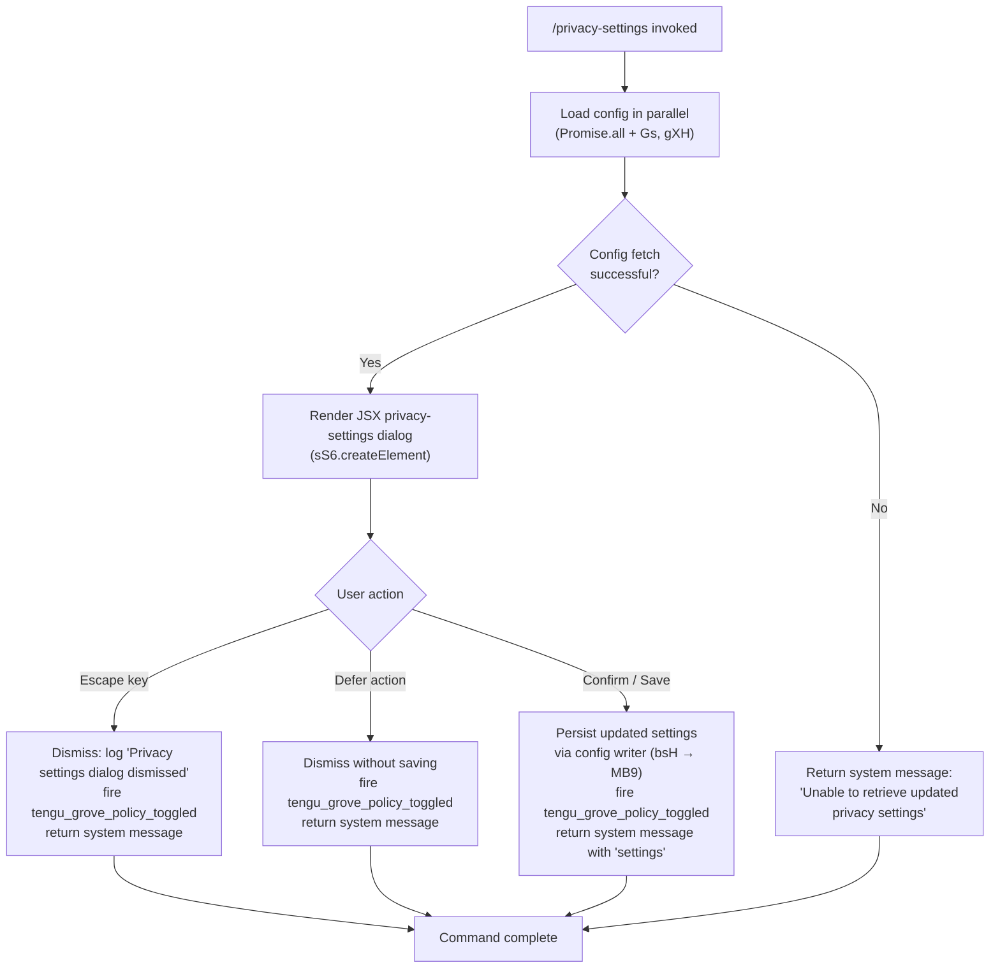

# `/privacy-settings`

> Analysis basis: CC v2.1.165 bundle.js (AST extraction + Claude interpretation)
> Minimum version: v2.1.165

---

## Overview

The `/privacy-settings` command opens an interactive JSX dialog that allows the user to view and update their privacy-related configuration (referred to internally as "grove policy"). When the user dismisses, confirms, or escapes the dialog, the command records the outcome via telemetry, optionally persists the updated settings, and returns a system message confirming the result. The command is entirely client-side (type `local-jsx`) and does not send a prompt to the AI model.

---

## Registration

| Field | Value |
|---|---|
| type | `local-jsx` |
| name | `privacy-settings` |
| description | `View and update your privacy settings` |
| loc_byte | `12437017` |
| loc_byte_end | `12437209` |
| loc_line | `8839` |
| module_id | `M8K` |
| load_inline | `true` |
| arbor_handler.name | `Mhf` |
| arbor_handler.fqn | `claude-2.1.165::Mhf` |
| arbor_handler.kind | `AsyncFunction` |
| arbor_handler.resolution_path | `module_id` |
| arbor_handler.n_hits | `0` |

Analysis basis: CC v2.1.165 bundle.js:+12437017

---

## Input Branching

The handler has four distinct exit paths depending on how the user interacts with the privacy-settings dialog (escape, defer, confirm/save, or error). A Mermaid flowchart is used.



Analysis basis: CC v2.1.165 bundle.js:+12436017, +12436057, +12436180, +12436194, +12436205, +12436331, +12436553, +12436617

---

## Behavioral Spec

### 1. Handler Entry — `privacySettingsHandler` (`Mhf`)

The top-level async handler is `Mhf`, resolved via `module_id` → `M8K`.

```
async function privacySettingsHandler(context):
    // 1. Parallel config load
    [currentConfig, extraData] = await Promise.all([
        fetchGroveConfig(context),     // Gs
        fetchGroveExtra(context)       // gXH
    ])

    // 2. Render interactive JSX dialog
    result = await renderPrivacyDialog(currentConfig, extraData)
        // dialog is created via createElement (sS6.createElement)

    // 3. Branch on user action
    if result.action == "escape" or result.action == "defer":
        emitTelemetry("tengu_grove_policy_toggled", { action: result.action })
        return systemMessage("Privacy settings dialog dismissed")

    if result.action == "confirm":
        savePrivacySettings(result.newSettings)   // bsH → MB9 path
        emitTelemetry("tengu_grove_policy_toggled", { action: "confirm" })
        return systemMessage(buildSettingsMessage(result.newSettings))  // "settings" key

    if fetchFailed:
        return systemMessage("Unable to retrieve updated privacy settings")
```

Analysis basis: CC v2.1.165 bundle.js:+12436057, +12436070, +12436075, +12436180, +12436194, +12436205, +12436250, +12436331, +12436553, +12436614, +12436617, +12436664

---

### 2. Config Read Pipeline — `configFetcher` (`bsH`)

`bsH` is the first callee of `Mhf` and orchestrates reading grove/privacy config from disk with caching logic.

```
function configFetcher(context):
    // Step 1: attempt to read settings from in-memory grove cache
    cached = groveCache.get()     // n4H

    // Step 2: determine staleness
    now = Date.now()
    if cache is absent:
        log("Grove: No cache, fetching config in background (dialog skipped this session)")
        triggerBackgroundFetch(context)   // v
        return defaultConfig

    if cache is stale:
        log("Grove: Cache stale, returning cached data and refreshing in background")
        scheduleBackgroundRefresh(context)   // MB9
        return cachedConfig

    log("Grove: Using fresh cached config")
    return cachedConfig
```

String constants observed:
- `"Grove: No cache, fetching config in background (dialog skipped this session)"` (bundle.js:+6999105)
- `"Grove: Cache stale, returning cached data and refreshing in background"` (bundle.js:+6999225)
- `"Grove: Using fresh cached config"` (bundle.js:+6999331)

Analysis basis: CC v2.1.165 bundle.js:+6999011, +6999050, +6999079, +6999185, +6999225, +6999331

---

### 3. Persistent Config Write — `configSaveWithLock` (`MB9` / `X8` / `CX_`)

When the user confirms new settings, the save path is:

```
async function savePrivacySettings(newSettings):
    // MB9 schedules or performs background refresh + write
    configSnapshot = await backgroundFetchLatest()  // y6 → bDH (readFileSync, utf-8)
    now = Date.now()

    // X8 / CX_: write with advisory lock
    await saveConfigWithLock(configSnapshot, newSettings):
        acquire lock (mkdirSync for lock directory)
        if lock took too long:
            warn("Lock acquisition took longer than expected ...")
            // tengu_config_lock_contention

        reReadConfig = readConfigFromDisk()
        if reReadConfig is missing auth that cache has:
            warn("saveConfigWithLock: re-read config is missing auth ...")
            // tengu_config_auth_loss_prevented
            abort write

        mergeAndWriteConfig(reReadConfig, newSettings)

        // rotate backups (keep most recent 5, max age 60000 ms)
        pruneOldBackups(backupDir, limit=5)

        release lock
```

Key constants:
- Lock warning: `"Lock acquisition took longer than expected - another Claude instance may be running"` (bundle.js:+3259888)
- Auth-loss guard: `"saveConfigWithLock: re-read config is missing auth that cache has; refusing to write to avoid wiping ~/.claude.json. See GH #3117."` (bundle.js:+3260304)
- Backup age limit: `60000` ms (bundle.js:+3260658)
- Maximum backup count: `5` (bundle.js:+3260907)

Analysis basis: CC v2.1.165 bundle.js:+6999185, +3256791, +3259888, +3260304, +3260658, +3260907

---

### 4. Config File I/O — `configFileReader` (`bDH`)

Handles raw file access for the settings JSON:

```
function configFileReader(path):
    if not allowed:
        throw Error("Config accessed before allowed.")   // +3261921

    try:
        content = fs.readFileSync(path, "utf-8")         // +3262004
        parsed = JSON.parse(content)
        return parsed
    catch ENOENT:                                        // +3262151
        return defaultConfig
    catch parseError:
        emitTelemetry("tengu_config_parse_error")        // +3262552
        return defaultConfig

    // Backup rotation on write
    if EEXIST on mkdir:                                  // +3262766
        // directory already exists; continue
    copyFileSync(src, dest)
    deleteOldestBackupsIfNeeded()
```

Analysis basis: CC v2.1.165 bundle.js:+3261921, +3262004, +3262151, +3262552, +3262766

---

### 5. Dialog Dismiss Handling

The dialog registers two keyboard/action codes before rendering:

- `"escape"` — user pressed Escape key (bundle.js:+12436180)
- `"defer"` — user clicked a deferred action button (bundle.js:+12436194)

Both result in the same dismissal message: `"Privacy settings dialog dismissed"` (bundle.js:+12436205).

The return message type for confirmed settings uses the key `"system"` (bundle.js:+12436250) and the property `"settings"` (bundle.js:+12436617).

When config fetch fails, the return message is `"Unable to retrieve updated privacy settings"` (bundle.js:+12436331).

---

### 6. API Key / Auth Context — `authContextReader` (`zY`)

Within the config-read path, authentication context is checked:

```
function authContextReader(config):
    apiKey = env["ANTHROPIC_API_KEY"]     // +2997395
    helper = config["apiKeyHelper"]       // +2997420

    // Determine subscription tier
    tier = config.tier  // values: "max" (+3020828), "pro" (+3020839)

    // Returns combined auth state
    return { apiKey, helper, tier }
```

Analysis basis: CC v2.1.165 bundle.js:+2997395, +2997420, +3020828, +3020839

---

### 7. MCP Context Loading — `mcpStateLoader` (`M` → `AbH` / `IYA`)

`Mhf` also calls `M` (bundle.js:+12436274), which loads current MCP server state so the privacy dialog can reflect MCP-related privacy options:

```
async function loadMcpState():
    allServers = Object.entries(serverRegistry)    // AbH
    for each server:
        computeHash(server)                         // VXH → sha256/hex
        checkConnectionStatus(server)               // ts_ / es_
        applyConnectionResult(server)               // eU8

    return aggregatedMcpState
```

MCP transport types recognized: `"stdio"`, `"sse"`, `"http"`, `"sse-ide"`, `"ws-ide"`, `"claudeai-proxy"` (bundle.js:+10425180, +10425279, +10425315, +10425587).

Analysis basis: CC v2.1.165 bundle.js:+12436274, +10424980, +10425043, +10425180

---

## State & Side Effects

| Item | Detail |
|---|---|
| Telemetry: `tengu_grove_policy_toggled` | Fired on every dialog exit (escape, defer, confirm); carries action type. bundle.js:+12436553 |
| Telemetry: `tengu_config_parse_error` | Fired when the on-disk config JSON fails to parse. bundle.js:+3262552 |
| Telemetry: `tengu_config_lock_contention` | Fired when lock acquisition exceeds expected time. bundle.js:+3259977 |
| Telemetry: `tengu_config_stale_write` | Fired when a stale-write condition is detected. bundle.js:+3260113 |
| Telemetry: `tengu_config_auth_loss_prevented` | Fired when write is aborted to prevent auth token loss (GH #3117). bundle.js:+3260456 |
| Telemetry: `tengu_feature_sad` | General feature-error sentinel reached via config path. bundle.js:+1010365 |
| Telemetry: `tengu_daemon_config_reload` | Fired when daemon picks up config change after write. bundle.js:+16149069 |
| Config file write | Writes to `~/.claude.json` (global config) with advisory lock and automatic backup rotation (max 5 backups, 60 000 ms age). |
| Backup files | Named with `.backup.` prefix; up to 5 kept; oldest pruned. bundle.js:+3260774, +3260907 |
| appState changes | Privacy/grove policy flags updated in the in-memory config cache after confirmed save. |
| JSX rendering | `sS6.createElement` used to build the dialog component. bundle.js:+12436664 |
| Sound | None detected in depth-2 traversal. |
| Hook registration | `j9` → `zXA.register` — registers a cleanup hook during config-write flow. bundle.js:+60323 |
| File watcher | `WTL` sets up and tears down a `watchFile` / `unwatchFile` pair on the config file during reads. bundle.js:+3258172, +3258505 |

---

## Version History

| Version | Change |
|---|---|
| v2.1.165 | Initial analysis |

---

## Common Mistakes

1. **Expecting a model response**: `/privacy-settings` is `local-jsx`; it renders a terminal dialog and returns a `system`-type message. It never sends a prompt to Claude.
2. **Running in non-interactive terminals**: The JSX dialog requires an interactive TTY. Piped or headless invocations will receive no dialog.
3. **Concurrent Claude instances during save**: A second Claude process holding the config lock will cause a `tengu_config_lock_contention` event and a warning. Avoid running multiple CC instances that write config simultaneously.
4. **Misinterpreting dismiss vs. save**: Both `escape` and `defer` produce the message `"Privacy settings dialog dismissed"` without writing changes. Only an explicit confirm action persists settings.
5. **Auth token wipe risk**: The command's write path actively guards against overwriting auth tokens (GH #3117). If the re-read config is missing auth credentials that the cache holds, the write is silently aborted and `tengu_config_auth_loss_prevented` is emitted.

---

## Appendix — Identifier Mapping

> For bundle debugging only. Identifiers change across versions.

| Identifier | Role |
|---|---|
| `Mhf` | Main async handler for `/privacy-settings` (`privacySettingsHandler`) |
| `bsH` | Grove/privacy config fetcher with cache logic (`configFetcher`) |
| `n4H` | Grove cache reader (`groveCacheReader`) |
| `_q` | Auth context assembler (`authContextAssembler`) |
| `mL_` | Auth sub-helper A |
| `uL_` | Auth sub-helper B |
| `zY` | API key / auth-state resolver (`authStateResolver`) |
| `ZA` | Config field validator (`configFieldValidator`) |
| `nR` | Array inclusion checker for config fields (`arrayInclusionChecker`) |
| `tu1` | Config post-processor (`configPostProcessor`) |
| `hL` | File-watch config reader (`fileWatchConfigReader`) |
| `y6` | Async config file loader (`asyncConfigFileLoader`) |
| `Q6` | Path resolver utility (`pathResolver`) |
| `kX_` | Config path helper (`configPathHelper`) |
| `bDH` | Low-level config file I/O (`configFileReader`) |
| `WTL` | File watcher setup/teardown (`fileWatcherManager`) |
| `v` | HTTP bootstrap fetcher (`httpBootstrapFetcher`) |
| `icK` | Fetch request builder (`fetchRequestBuilder`) |
| `DXA` | Header builder (`headerBuilder`) |
| `H` | Bootstrap fetch caller / command context (`bootstrapFetchCaller`) |
| `Gw_` | URL parser (`urlParser`) |
| `ZHH` | Domain allowlist checker (`domainAllowlistChecker`) |
| `uj` | URL sanitiser (`urlSanitiser`) |
| `e1` | Response parser (`responseParser`) |
| `s6` | Config persister (`configPersister`) |
| `SH` | JSON serialiser wrapper (`jsonSerialiserWrapper`) |
| `J4` | Path extension extractor (`pathExtensionExtractor`) |
| `c2A` | Extension map builder (`extensionMapBuilder`) |
| `ppH` | Output writer (`outputWriter`) |
| `C2A` | Stream write helper (`streamWriteHelper`) |
| `acK` | Async config appender (`asyncConfigAppender`) |
| `$pH` | Debounced write scheduler (`debouncedWriteScheduler`) |
| `d3H` | Config merge helper (`configMergeHelper`) |
| `aL6` | Version checker (`versionChecker`) |
| `s2A` | Config path joiner (`configPathJoiner`) |
| `a2A` | Atomic file rename helper (`atomicFileRenameHelper`) |
| `ocK` | Config directory creator + appender (`configDirCreatorAppender`) |
| `j9` | Cleanup hook registrar (`cleanupHookRegistrar`) |
| `MB9` | Background config refresh scheduler (`backgroundConfigRefreshScheduler`) |
| `X8` | Config save-with-lock orchestrator (`configSaveWithLockOrchestrator`) |
| `CX_` | Lock-based config write executor (`lockBasedConfigWriteExecutor`) |
| `_lH` | Lock directory path builder (`lockDirPathBuilder`) |
| `$r1` | Config entries enumerator (`configEntriesEnumerator`) |
| `t98` | Timestamp helper (`timestampHelper`) |
| `fj6` | Config integrity checker (`configIntegrityChecker`) |
| `c` | General utility / constants object |
| `RX_` | Global config save fallback (`globalConfigSaveFallback`) |
| `M` | MCP state loader entry point (`mcpStateLoader`) |
| `AbH` | MCP server aggregator (`mcpServerAggregator`) |
| `bl` | MCP server list builder (`mcpServerListBuilder`) |
| `wG6` | MCP server group resolver (`mcpServerGroupResolver`) |
| `ws` | MCP workspace config reader (`mcpWorkspaceConfigReader`) |
| `Cl` | MCP client lister (`mcpClientLister`) |
| `uY8` | MCP error formatter (`mcpErrorFormatter`) |
| `DG6` | MCP server deduplicator (`mcpServerDeduplicator`) |
| `fk` | MCP file-system watcher registrar (`mcpFsWatcherRegistrar`) |
| `oO` | MCP tool observer (`mcpToolObserver`) |
| `zb_` | MCP watcher cleanup (`mcpWatcherCleanup`) |
| `K` | Process/task list manager |
| `L` | Async task tracker |
| `f` | Stream/connection handle |
| `__` | String utility wrapper |
| `sk6` | MCP server status formatter (`mcpServerStatusFormatter`) |
| `skq` | MCP connection initiator (`mcpConnectionInitiator`) |
| `Ae_` | MCP auth pre-check (`mcpAuthPreCheck`) |
| `VXH` | MCP server config hasher (`mcpServerConfigHasher`) |
| `bY8` | MCP capability mapper (`mcpCapabilityMapper`) |
| `xY8` | MCP hash comparator (`mcpHashComparator`) |
| `GP` | Content hash builder (`contentHashBuilder`) |
| `RY8` | MCP result type checker (`mcpResultTypeChecker`) |
| `M4` | Result value extractor (`resultValueExtractor`) |
| `O8` | MCP debug log emitter (`mcpDebugLogEmitter`) |
| `ts_` | MCP transport session manager (`mcpTransportSessionManager`) |
| `BKf` | MCP transport builder (`mcpTransportBuilder`) |
| `Ad` | Auth token retriever (`authTokenRetriever`) |
| `i1H` | MCP IDE connector (`mcpIdeConnector`) |
| `r1H` | MCP reconnect scheduler (`mcpReconnectScheduler`) |
| `o1H` | MCP OAuth session handler (`mcpOAuthSessionHandler`) |
| `r_6` | MCP in-flight request tracker (`mcpInFlightRequestTracker`) |
| `D` | Forced shutdown handler (`forcedShutdownHandler`) |
| `_I8` | MCP needs-auth cache reader (`mcpNeedsAuthCacheReader`) |
| `Sn` | MCP reconnect loop (`mcpReconnectLoop`) |
| `yx` | Platform info reader (`platformInfoReader`) |
| `Y` | Supervisor / output stream manager |
| `T7` | MCP error log emitter (`mcpErrorLogEmitter`) |
| `EH` | Error string formatter (`errorStringFormatter`) |
| `FKf` | MCP flow completion handler (`mcpFlowCompletionHandler`) |
| `UKf` | SSH/remote session detector (`sshRemoteSessionDetector`) |
| `es_` | MCP server reconnect executor (`mcpServerReconnectExecutor`) |
| `i_6` | Pending auth cache reader (`pendingAuthCacheReader`) |
| `o_6` | In-flight connection reader (`inFlightConnectionReader`) |
| `Myq` | MCP multi-connect orchestrator (`mcpMultiConnectOrchestrator`) |
| `N9` | Async local storage reader (`asyncLocalStorageReader`) |
| `SI8` | MCP needs-auth cache path builder (`mcpNeedsAuthCachePathBuilder`) |
| `ss_` | MCP status summariser (`mcpStatusSummariser`) |
| `Lb_` | MCP server include-filter (`mcpServerIncludeFilter`) |
| `j` | Running process registry |
| `R` | Process kill helper |
| `FN` | MCP skill loader (`mcpSkillLoader`) |
| `D6` | Skill file change watcher (`skillFileChangeWatcher`) |
| `I` | Chokidar file watcher instance |
| `W6` | Async event emitter (`asyncEventEmitter`) |
| `S` | Output stream writer |
| `_yq` | Promise concurrency limiter (`promiseConcurrencyLimiter`) |
| `hB` | Async pool implementation (`asyncPoolImplementation`) |
| `zA6` | Integer parser A (`integerParserA`) |
| `RI8` | Integer parser B (`integerParserB`) |
| `eU8` | MCP connection result applier (`mcpConnectionResultApplier`) |
| `_bH` | Orphan connection detector (`orphanConnectionDetector`) |
| `mk` | MCP slot cleanup orchestrator (`mcpSlotCleanupOrchestrator`) |
| `$A6` | MCP slot hash validator (`mcpSlotHashValidator`) |
| `$` | Daemon status writer (`daemonStatusWriter`) |
| `NKK` | Daemon status file writer (`daemonStatusFileWriter`) |
| `nr` | Line formatter (`lineFormatter`) |
| `JR6` | Status path builder (`statusPathBuilder`) |
| `IYA` | MCP remote server retry loop (`mcpRemoteServerRetryLoop`) |
| `pY8` | MCP server permission checker (`mcpServerPermissionChecker`) |
| `l8` | Async timeout wrapper (`asyncTimeoutWrapper`) |
| `O` | Background session tracker |

---

Note: index built via Arbor fallback; some signals (telemetry, literals) may be missing — see arbor-fallback.js.