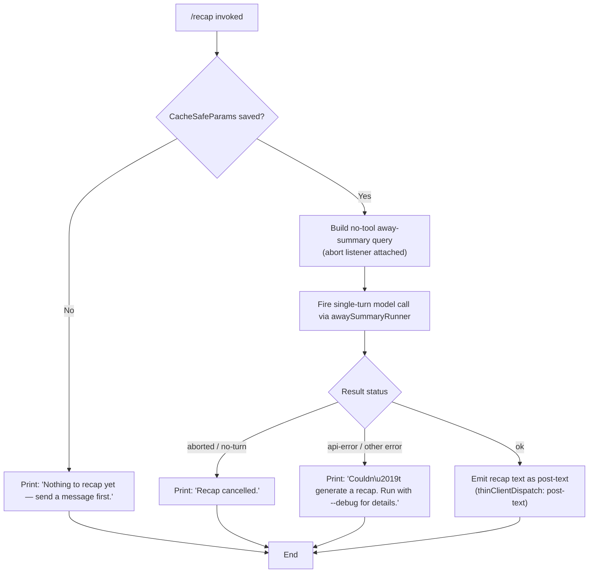

# `/recap`

> Analysis basis: CC v2.1.165 bundle.js (AST extraction + Claude interpretation)
> Minimum version: v2.1.165

---

## Overview

The `/recap` command triggers an on-demand, single-turn model call that generates a concise one-line summary of the current session. It operates as an "away summary" subsystem: it reads previously cached conversation parameters, fires a no-tool query to the model, and writes the resulting text back as a post-turn recap. If no conversation data is available yet, or if the request is cancelled or fails, distinct user-facing messages are shown instead.

---

## Registration

| Field | Value |
|---|---|
| type | `local` |
| name | `recap` |
| description | `Generate a one-line session recap now` |
| loc_byte | `12972504` |
| loc_byte_end | `12972720` |
| loc_line | `9613` |
| supportsNonInteractive | `false` |
| thinClientDispatch | `post-text` |
| load_inline | `true` |
| load_ident | `Upf` |
| arbor_handler.name | `Upf` |
| arbor_handler.fqn | `claude-2.1.165::Upf` |
| arbor_handler.kind | `AsyncFunction` |
| arbor_handler.resolution_path | `load_ident` |
| arbor_handler.n_hits | `0` |

Registration block span: `(12972504, 12972720)`

Analysis basis: CC v2.1.165 bundle.js:+12972504

---

## Input Branching

The command has four distinct outcome paths (no cached params → early exit; query cancelled → cancellation message; query error → error message; success → recap text), warranting a Mermaid flowchart.



Analysis basis: CC v2.1.165 bundle.js:+12972112 (handler entry `Upf`), +5479851 (no-params guard literal), +12972254 (nothing-to-recap literal), +12972346 (cancelled literal), +12972404 (error literal)

---

## Behavioral Spec

### Top-level handler (`Upf`)

The handler is an `AsyncFunction` resolved via `load_ident` from the inline `Promise.resolve({call: Upf})` shape in the registration.

```
async function recapCommandHandler(context):
    result = await awaySummaryOrchestrator(context)
    return result
```

Analysis basis: CC v2.1.165 bundle.js:+12972112

---

### Away-summary orchestrator (`cO8`)

This is the primary orchestration function reached from the handler. It coordinates the CacheSafeParams guard, the abort-signal wiring, and the model call.

```
async function awaySummaryOrchestrator(context):

    # Step 1 — Guard: check for saved CacheSafeParams
    params = loadCacheSafeParams(context)   # o_H
    if params is null or undefined:
        log.debug("[awaySummary] no CacheSafeParams saved, skipping")
        return buildNoTurnResult("Nothing to recap yet — send a message first.")

    # Step 2 — Wire abort signal
    abortController = new AbortController()
    context.signal.addEventListener("abort", () => abortController.abort())

    # Step 3 — Build query options
    #   - tools: DENIED ("Away summary cannot use tools")
    #   - turn type: "no-turn"
    #   - query tag: "away_summary"
    queryOptions = buildAwaySummaryQueryOptions(params, abortController.signal)

    # Step 4 — Execute single-turn model call
    queryResult = await runAwaySummaryQuery(queryOptions)   # jG

    # Step 5 — Find the assistant message in results
    assistantMsg = queryResult.find(isAssistantMessage)

    # Step 6 — Flatten tool-use output list for the turn
    flatOutputs = flattenTurnOutputs(queryResult)   # YV9

    # Step 7 — Branch on outcome
    if queryResult is aborted:
        return buildTextResult("Recap cancelled.")
    else if queryResult is api-error or other failure:
        return buildTextResult("Couldn't generate a recap. Run with --debug for details.")
    else:
        return buildPostTextResult(assistantMsg)
```

Analysis basis: CC v2.1.165 bundle.js:+5479830 (`o_H`), +5479849 (`v`), +5479851 (no-params log literal), +5479909 ("no-turn"), +5479946 (abort listener), +5479965 ("abort"), +5480024 (`jG`), +5480044 (`u8`), +5480142 ("deny"), +5480157 ("Away summary cannot use tools"), +5480225 ("away_summary"), +5480369 ("aborted"), +5480458 ("api-error"), +5480519 ("ok"), +5480386 (`q.find`), +5480475 (`YV9`)

---

### CacheSafeParams loader (`o_H`)

Reads the previously stored safe-params object from the session's persistent store.

```
function loadCacheSafeParams(context):
    params = sessionParamStore.get(context.sessionId)
    if not params:
        return null
    return params
```

Analysis basis: CC v2.1.165 bundle.js:+5479830

---

### Away-summary query runner (`jG`)

Fires the single-turn "away summary" query against the model. This is the same query engine used by the main conversation loop, but invoked with restricted options (no tools, single turn).

```
async function awaySummaryQueryRunner(queryOptions):
    startTime = Date.now()

    # Build a fresh session state snapshot for the query
    snapshot = buildSessionSnapshot(queryOptions)       # XV8

    # Acquire a random session ID for this auxiliary turn
    sessionId = crypto.randomUUID()

    # Build message list from snapshot
    messages = buildMessageList(snapshot)               # b1H → iCH

    # Determine the thread type ("main")
    threadType = "main"

    # Run the core model loop
    loopResult = await runMainModelLoop(messages, queryOptions)   # gm → hOf

    # Check the subagent-output cache
    subagentStatus = checkSubagentCache(loopResult)     # $y6

    # Accumulate result messages
    push results to D

    # Dispatch post-processing
    await postProcessAwaySummaryResult(loopResult)      # wfH

    # Map results to output shape
    return D.map(toOutputShape)
```

Analysis basis: CC v2.1.165 bundle.js:+10913624 (`Date.now`), +10913747 (`XV8`), +10913936 ("main"), +10913961 (`PV8`), +10913979 (`oh`), +10914003 (`b1H`), +10914023 (`v`), +10914093 (`H.at`), +10914154 (`gm`), +10914334 (`$y6`), +10914424 (`K9H`), +10914453 (`Bk8`), +10914474 (`PRq`), +10914579 (`D.push`), +10914591 (`wfH`), +10914935 (`D.map`)

---

### Session snapshot builder (`XV8`)

Reads current app state and constructs the parameter block passed to the model API.

```
function buildSessionSnapshot(queryOptions):
    appState = context.getAppState()
    avoidPrompts = appState["avoid_prompts"] ?? []

    # Hydrate model config
    modelConfig = loadAndDumpConfig(activeModel)        # C7H

    # Build system prompt / preamble
    preamble = buildPreamble(queryOptions)              # QwH, uw9

    # Update app state with snapshot data
    context.setAppState(updatedState)

    # Generate random hex nonce for deduplication
    nonce = crypto.randomBytes(8).toString("hex")       # oh

    # Assign UUID
    turnId = Axq.randomUUID()

    return { modelConfig, preamble, nonce, turnId, avoidPrompts, ... }
```

Analysis basis: CC v2.1.165 bundle.js:+10910671 (`uC`), +10910774 (`H.getAppState`), +10911004 ("avoid_prompts"), +10911517 (`C7H`), +10911691 (`QwH`), +10911797 (`uw9`), +10911938 (`H.setAppState`), +10911964 (`M`), +10912037 (`Object.assign`), +10912565 (`tI8`), +10912820 (`oh`), +6857921 (`nm9.randomBytes`), +6857937 (length `8`), +6857949 ("hex"), +10913019 (`Axq.randomUUID`)

---

### Main model loop (`hOf`)

The core agentic loop. For `/recap`, it executes a single turn with tool use denied, so it terminates after the first model response without iterating tool calls.

```
async function mainModelLoop(messages, options):
    # Initialise loop state
    threadType = "repl_main_thread"
    source = "sdk"

    log("stream_request_start")
    log("query_fn_entry")
    log("query_started")

    # Autocompact check
    if contextNeedsCompaction(messages):
        log("query_autocompact_start")
        await autoCompact(messages)
        log("query_autocompact_end")

    log("query_setup_start")
    # Validate request; surface prompt-too-long error if needed
    if requestInvalid:
        emit("invalid_request")
    log("query_setup_end")

    # API streaming loop
    log("query_api_loop_start")
    log("query_api_streaming_start")

    response = await D.callModel(requestPayload)

    log("query_api_streaming_end")

    # Process response blocks
    for block in response:
        if block.type == "tool_use":
            # tool use is denied for away_summary — classify as denied
            markToolDenied(block)
        elif block.type == "text":
            accumulateText(block)

    log("api_response")

    # Handle stop conditions
    if aborted:
        return { status: "cancelled" }
    elif maxOutputTokensHit:
        # Inject recovery prompt (not applicable for single-turn recap)
        log("max_output_tokens_recovery")
    elif malformedToolUse:
        log("malformed_tool_use_retry")

    log("completed")
    return accumulatedResult
```

Analysis basis: CC v2.1.165 bundle.js:+10866882 (`hOf`), +10868103 ("repl_main_thread"), +10868128 ("sdk"), +10868379 ("stream_request_start"), +10868406 ("query_fn_entry"), +10868438 ("query_started"), +10868971 ("query_autocompact_start"), +10869269 ("query_autocompact_end"), +10871222 ("query_setup_start"), +10871411 ("query_setup_end"), +10872306 ("query_api_loop_start"), +10872400 ("query_api_streaming_start"), +10872449 (`D.callModel`), +10878955 ("query_api_streaming_end"), +10879837 ("api_response"), +10886882 ("completed"), +10885536 ("Output token limit hit…"), +10886201 ("malformed_tool_use_retry")

---

### Transcript log writer (`acK`)

Persists each turn's content to the on-disk transcript log. Called during the query pipeline to record the recap turn.

```
async function transcriptLogWriter(turnData, logDir):
    # Determine log file path
    logPath = path.join(logDir, logFileName)            # s2A, KHH.join

    # Check existing file size; rotate if needed      # a2A
    stat = await fs.stat(logPath)
    if stat exists and path.endsWith(".txt"):
        # Rotate: rename old file, unlink if rotation limit exceeded  # a2A
        await fs.rename(logPath, rotatedPath)

    # Ensure directory exists
    await fs.mkdir(logDir, { recursive: true })         # ocK

    # Append serialised turn data
    await fs.appendFile(logPath, serialisedTurn)        # ocK

    # Update log rotation tracker
    updateRotationTracker(logPath)                      # aL6, s2A, a2A

    # Check byte length budget
    byteLen = Buffer.byteLength(serialisedTurn)

    # Register hook for post-write notification
    registerHook(j9)
```

Analysis basis: CC v2.1.165 bundle.js:+205563 (`$pH`), +205588 (`d3H`), +205596 (`KHH.dirname`), +205626 (`Vy`), +205641 (`Q6`), +205716 (`aL6`), +205733 (`s2A`), +205765 (`a2A`), +205771 (`Buffer.byteLength`), +205804 (`e2A`), +205317 (`Zy.mkdir`), +205376 (`Zy.appendFile`), +205021 (".txt"), +205073 (`Zy.rename`), +205113 (`Zy.unlink`), +205925 (`j9`)

---

### Turn output flattener (`YV9`)

Flattens the array of turn result objects into the list of displayable output items.

```
function flattenTurnOutputs(turnResults):
    return turnResults.flatMap(result => extractDisplayableItems(result))
```

Analysis basis: CC v2.1.165 bundle.js:+5480475 (`YV9`), +5480685 (`H.flatMap`)

---

## State & Side Effects

| Item | Detail |
|---|---|
| Telemetry | See table below — events fired from the shared query pipeline traversed during recap |
| CacheSafeParams read | `o_H` reads stored session params; if absent, command exits early (bundle.js:+5479830) |
| Abort signal wiring | An `abort` event listener is attached to the context signal and forwarded to the internal AbortController (bundle.js:+5479946) |
| App state read | `XV8` calls `getAppState()` to read `avoid_prompts` and model config (bundle.js:+10910774) |
| App state write | `XV8` calls `setAppState()` to persist snapshot data (bundle.js:+10911938) |
| Transcript log write | `acK` appends the recap turn to the on-disk log via `fs.appendFile`; rotates on size threshold (bundle.js:+205376) |
| Hook registration | `j9` registers a post-write hook via `zXA.register` (bundle.js:+60323) |
| thinClientDispatch | Result is dispatched as `post-text` to the thin client (registration field) |
| Sound | <!-- TODO: not found in depth-2 traversal; needs --depth 4 --> |

### Telemetry events (from traversed call graph)

| Event | Origin loc_byte |
|---|---|
| `tengu_feature_ok` | 1010222 |
| `tengu_feature_sad` | 1010365 |
| `tengu_feature_bad` | 1010284 |
| `tengu_auto_compact_rapid_refill_breaker` | 10869300 |
| `tengu_auto_compact_succeeded` | 10869763 |
| `tengu_ptl_surfaced_to_user` | 10871737 |
| `tengu_refusal_fallback_prompt_shown` | 10874429 |
| `tengu_refusal_fallback_prompt_choice` | 10874618 |
| `tengu_convolute_arcades_retry` | 10875402 |
| `tengu_refusal_fallback_triggered` | 10875793 |
| `tengu_orphaned_messages_tombstoned` | 10876890 |
| `tengu_convolute_arcades_retry_outcome` | 10879038 |
| `tengu_model_fallback_triggered` | 10880447 |
| `tengu_query_error` | 10881151 |
| `tengu_model_response_keyword_detected` | 10881970 |
| `tengu_malformed_tool_use_response` | 10886233 |
| `tengu_stop_hook_block_count` | 10887187 |
| `tengu_loop_dynamic_wakeup_ends_turn` | 10890560 |
| `tengu_post_autocompact_turn` | 10890727 |
| `tengu_query_before_attachments` | 10890841 |
| `tengu_query_after_attachments` | 10893159 |
| `tengu_mcp_tools_refreshed_mid_turn` | 10893462 |
| `tengu_forked_agent_default_turns_exceeded` | 10915159 |
| `tengu_fork_agent_query` | 10915602 |

---

## Version History

| Version | Change |
|---|---|
| v2.1.165 | Initial analysis |

---

## Common Mistakes

1. **Running `/recap` before any conversation turn.** The command requires at least one prior turn to have stored `CacheSafeParams`. Invoking it in a fresh session immediately returns "Nothing to recap yet — send a message first." (bundle.js:+12972254).
2. **Expecting tool calls to succeed during recap.** The away-summary query is explicitly configured with tool use denied ("Away summary cannot use tools", bundle.js:+5480157). Any tool invocation in the recap path will be blocked.
3. **Assuming `/recap` works in non-interactive mode.** `supportsNonInteractive: false` means the command is only available in interactive REPL sessions; attempting to invoke it via `--print` / pipe mode will fail.
4. **Misinterpreting the `post-text` dispatch.** The result is dispatched as `post-text` (thin-client side effect), not as a regular conversation turn. It does not advance the conversation message list.
5. **Interpreting a "Recap cancelled." message as an error.** Cancellation (e.g. pressing Ctrl+C) produces a distinct "Recap cancelled." string (bundle.js:+12972346), not the error message. These are separate code paths.

---

## Appendix — Identifier Mapping

> For bundle debugging only. Identifiers change across versions.

| Identifier | Role |
|---|---|
| `Upf` | Top-level recap command handler (AsyncFunction); handler resolved via `load_ident` |
| `cO8` | Away-summary orchestrator; guards CacheSafeParams, wires abort, calls model |
| `o_H` | CacheSafeParams loader; reads stored session parameters |
| `v` | Shared query pipeline entry / utility dispatcher |
| `icK` | Query validation / type-check helper |
| `DXA` | Request-object assembler within query pipeline |
| `H` | Multi-role context/session object (used for getAppState, setAppState, addEventListener, etc.) |
| `e$` | Bootstrap fetch helper |
| `Gw_` | String tokeniser (split/trim/indexOf/slice) used in message parsing |
| `ZHH` | Cache-set membership checker (`c44.has`) |
| `uj` | String sanitiser (`H.replace`) |
| `e1` | Message encoder / serialiser |
| `s6` | Low-level utility (calls `c` and `P6`) |
| `SH` | JSON serialisation wrapper (`JSON.stringify`) |
| `J4` | Path / file-name normaliser (map, replace, at, lastIndexOf, slice) |
| `c2A` | Filename-segment mapper (`QcK.map`) |
| `q` | File-system unlink helper (`puK.unlinkSync`) |
| `A` | Lowercase-normaliser helper (`f.toLowerCase`) |
| `ppH` | Stream writer wrapper (`C2A` → `H.write`) |
| `C2A` | Direct stream writer |
| `acK` | Transcript log writer (mkdir, appendFile, rename, unlink, rotation) |
| `$pH` | Debounced flush scheduler (clearTimeout / setTimeout / setImmediate) |
| `d3H` | Log directory resolver (`KHH.join`, `a8`, `S6`) |
| `Q6` | Config/path resolver |
| `aL6` | Rotation-tracker updater (`v8`) |
| `s2A` | Log file path builder (`KHH.join`, `S6`) |
| `a2A` | Log rotation handler (stat, endsWith, rename, unlink) |
| `ocK` | Log append worker (mkdir, appendFile, rotation helpers) |
| `j9` | Post-write hook registrar (`zXA.register`) |
| `jG` | Away-summary query runner (Date.now, snapshot, message build, model loop) |
| `XV8` | Session snapshot builder (getAppState, setAppState, randomBytes, randomUUID) |
| `uC` | Sub-context factory (`dq`, `qz9`) |
| `C7H` | Model config loader/dumper (`dC`, `_.load`, `H.dump`) |
| `QwH` | System-prompt / preamble builder |
| `uw9` | Auxiliary preamble helper |
| `M` | Message-list / state manager (`AbH`, `eU8`, `L.get`, `L.values`, `IYA`) |
| `tI8` | Token budget tracker |
| `oh` | Random hex nonce generator (`nm9.randomBytes`) |
| `PV8` | Pre-query validation step |
| `b1H` | Message-list assembler for query (`d4`, `iCH`) |
| `d4` | Turn registry access (`j9`) |
| `iCH` | Message filter / classifier (`H.filter`, `_x8`, `Dx8`, `cFf`) |
| `gm` | Turn orchestrator — calls `hOf` (main model loop) and `LY8` (subagent cache) |
| `hOf` | Core agentic model loop (streaming, tool handling, compaction, refusal fallback) |
| `LY8` | Subagent-exit cache manager (`tu.get`, `KY8`, `tu.delete`, `CC_.delete`) |
| `hH` | Success-path result emitter (`c`, `P6`) |
| `RH` | Error-path result emitter (`c`, `P6`) |
| `$y6` | Subagent-output cache checker (`lMf.has`) |
| `K9H` | Turn-completion notifier |
| `Bk8` | Metrics accumulator for the turn |
| `PRq` | Post-result subagent-cache probe (`$y6`) |
| `D` | Process exit / abort controller (`IJ`, `process.exit`, `z.abort`) |
| `IJ` | Forced-shutdown handler |
| `z` | Daemon abort handler (`hH`, `RH`, `Yh`, `Tp`) |
| `wfH` | Post-query result dispatcher (`fJ`, `nz7`, `H.filter`, `L.has`, `H.push`) |
| `fJ` | Result item factory |
| `nz7` | Result finder (`H.find`) |
| `L` | Pending-promise tracker (`q.add`, `f.finally`, `q.delete`) |
| `c` | Core primitive / logger (called throughout) |
| `gOf` | Forked-agent query helper (`c`, `P6`) |
| `P6` | Notification emitter (`Nu6`) |
| `u8` | Terminal/UI renderer entry (`P`, `pk.randomUUID`, `X`) |
| `P` | Terminal display manager (fromText, onChange, setOffset, slice, w, L3A, C.execute) |
| `J` | Write-stream wrapper (`w`) |
| `j` | Process-kill helper (`A.values`, `R.kill`) |
| `Y` | Terminal supervisor update loop (start/stop/updateConfig, config reload) |
| `h` | Background memory management loop (respawn, retire, prewarm) |
| `w` | Worker lifecycle manager (get, kill, spawn, SIGKILL, SIGTERM) |
| `L3A` | Vim-mode command dispatcher (operator, operatorCount, find, replace, indent, …) |
| `C` | API request enqueuer (`deq`, `I.enqueue`, `Pj.randomUUID`, `S6`) |
| `X` | IPC frame reader (Buffer.concat, indexOf, subarray, T55) |
| `J5` | IPC frame finaliser (`H.end`, `SH`) |
| `T55` | IPC protocol handler (ping, nudge, dispatch, kill, resize, attach, stream, snapshot, …) |
| `EH` | String coercion helper (`String`) |
| `YV9` | Turn-output flattener (`H.flatMap`) |