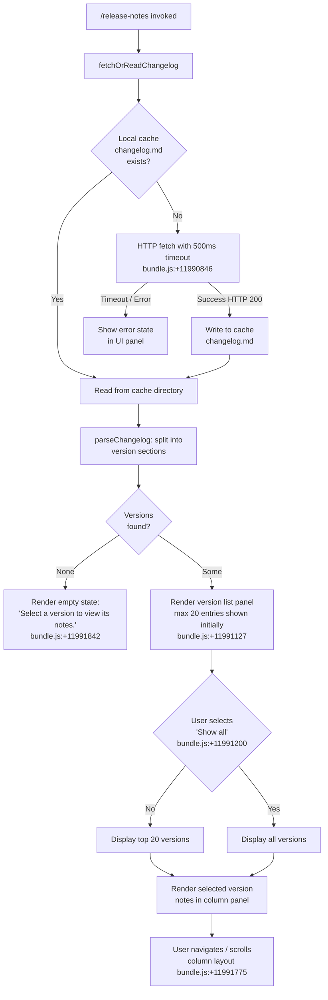

# `/release-notes`

> Analysis basis: CC v2.1.165 bundle.js (AST extraction + Claude interpretation)
> Minimum version: v2.1.165

---

## Overview

The `/release-notes` command renders a two-panel interactive UI (React JSX) that lets users browse the changelog for Claude Code. It fetches or reads `changelog.md` from a local cache directory, parses the file into per-version sections, and displays the selected version's notes in a scrollable column layout. The command is read-only and produces no agent turn; it is purely informational.

---

## Registration

| Field | Value |
|---|---|
| type | `local-jsx` |
| name | `release-notes` |
| description | `View release notes` |
| module_id | `Lrq` |
| load_inline | `true` |
| loc_byte | `11992554` |
| loc_byte_end | `11992695` |
| loc_line | `8306` |
| arbor_handler.name | `uTf` |
| arbor_handler.fqn | `claude-2.1.165::uTf` |
| arbor_handler.kind | `AsyncFunction` |
| arbor_handler.resolution_path | `module_id` |
| arbor_handler.n_hits | `0` |

Analysis basis: CC v2.1.165 bundle.js:+11992554

---

## Input Branching

The command has four distinct rendering paths depending on changelog availability and user selection, plus a fetch sub-path, warranting a Mermaid flowchart.



---

## Behavioral Spec

### 1. Handler Entry Point (`uTf`)

The Arbor-resolved async handler `uTf` is the main entry point for the command.

```
async function releaseNotesHandler(context):
    // Race between the changelog fetch and a hard timeout
    timeoutPromise = new Promise((_, reject) =>
        setTimeout(() => reject(new Error("Timeout")), 500)
        // bundle.js:+11990846, +11990834
    )

    changelogResult = await Promise.race([
        fetchChangelog(context),   // W9A
        timeoutPromise
    ])
    // bundle.js:+11990860

    versions = parseChangelog(changelogResult)  // ZS8
    return renderReleaseNotesUI(versions)        // Krq
```

Analysis basis: CC v2.1.165 bundle.js:+11990810

---

### 2. Changelog Fetch (`W9A`)

```
async function fetchChangelog(context):
    // Resolve cache path: join cache dir with "cache/changelog.md"
    cachePath = pathJoin(cacheDir, "cache", "changelog.md")
    // bundle.js:+11987457, +11987444, +11987435

    storeEntry = asyncLocalStorage.getStore()  // N9, bundle.js:+11987818

    // Check HTTP response code
    response = await httpGet(changelogUrl, headers)
    if response.status == 200:                 // bundle.js:+11987764
        recordTimestamp(Date.now())            // bundle.js:+11987879
        writeToCache(cachePath, responseBody)  // X8
        return responseBody
    else:
        return readFromCache(cachePath)        // fallback
```

Analysis basis: CC v2.1.165 bundle.js:+11987695

---

### 3. Cache Read / Write Sub-system (`X8`, `CX_`, `bDH`)

The cache sub-system handles filesystem locking, backup rotation, and atomic writes.

```
function readOrWriteCache(cachePath, content):
    // Acquire write lock (warns if contention exceeds threshold)
    // telemetry: tengu_config_lock_contention on slow acquisition
    // bundle.js:+3259977

    if writing:
        ensureDir(dirname(cachePath))          // L.mkdirSync
        atomicWrite(cachePath, content)        // TM6 (safe write with temp file)
        // Keeps up to 5 backup copies         // bundle.js:+3260907
        rotateBackups(cachePath, maxBackups=5)
    else:
        data = readFileSync(cachePath, "utf-8")  // bundle.js:+3262004
        return data

    // Guard: never overwrite if re-read config lost auth  // bundle.js:+3260304
    if reReadMissingAuth:
        emit("tengu_config_auth_loss_prevented")           // bundle.js:+3260456
        abort()
```

Analysis basis: CC v2.1.165 bundle.js:+11987890

---

### 4. Changelog Parser (`ZS8`, `ES6`)

```
function parseChangelog(rawText):
    // Split on newlines, trim each line
    // bundle.js:+11988134, +11988183
    lines = rawText.split("\n").map(l => l.trim())

    sections = {}
    currentVersion = null

    for line in lines:
        // Detect version header: format "VERSION - SUMMARY"
        // separator literal: " - "   bundle.js:+11988265
        if line matches version header pattern:
            [version, summary] = parseVersionHeader(line)   // Q1
            currentVersion = version
            sections[version] = { summary, entries: [] }
        elif line.startsWith("- "):   // bundle.js:+11988343
            sections[currentVersion].entries.push(line)

    // Filter to non-empty sections
    validVersions = Object.keys(sections).filter(v => sections[v].entries.length > 0)
    // bundle.js:+11988804, +11988904

    // Render each version entry via kH / HA helpers
    return validVersions.map(v => buildEntry(v, sections[v]))
```

Analysis basis: CC v2.1.165 bundle.js:+11988773

---

### 5. Version-List Helper (`qrq`)

```
function buildVersionEntry(versionEntries, maxCount):
    // Slice to at most maxCount items (used for the "top 20" view)
    // bundle.js:+11990685
    subset = versionEntries.slice(0, maxCount)
    // Map each entry through the gw formatter
    return subset.map(entry => formatEntry(entry))   // gw
```

Analysis basis: CC v2.1.165 bundle.js:+11990610

---

### 6. Changelog Path Helper (`P9A`)

```
function resolveChangelogPath(baseDir):
    // Constructs: <baseDir>/cache/changelog.md
    return pathJoin(baseDir, "cache", "changelog.md")
    // literals: "cache" bundle.js:+11987449
    //           "changelog.md" bundle.js:+11987457
```

Analysis basis: CC v2.1.165 bundle.js:+11987435

---

### 7. React UI Component (`Krq`)

```
function ReleaseNotesUI(versionList):
    // Memoised with React.memo_cache_sentinel  // bundle.js:+11991701
    // Layout: column mode                      // bundle.js:+11991775

    if versionList is empty:
        return StaticMessage("Select a version to view its notes.")
        // bundle.js:+11991842

    // Show top 20 by default
    displayList = versionList.slice(0, 20)      // bundle.js:+11991127
    showAll = false

    render:
        LeftPanel:
            forEach entry in (showAll ? versionList : displayList):
                VersionRow(entry)               // A.map  bundle.js:+11991298
            if not showAll AND versionList.length > 20:
                Button("Show all",              // bundle.js:+11991200
                    onClick: showAll = true)
        RightPanel:
            if selectedVersion != null:
                NoteDetail(selectedVersion)     // qrq
            else:
                Placeholder("Select a version to view its notes.")

    // Outer wrapper labelled "Release notes"   // bundle.js:+11992226
```

Analysis basis: CC v2.1.165 bundle.js:+11991121

---

### 8. Atomic File Writer (`TM6`)

```
function atomicWrite(targetPath, data):
    // Generate 6-byte random hex suffix for temp filename
    // bundle.js:+1057396, +1057380  (6 bytes → 12 hex chars)
    tmpPath = targetPath + "." + randomBytes(6).toString("hex")

    fd = fs.openSync(tmpPath, flags)
    try:
        fs.writeFileSync(fd, data)           // M$.writeFileSync
        // Preserve original file permissions
        originalMode = fs.lstatSync(targetPath).mode
        fs.fchmodSync(fd, originalMode)      // bundle.js:+1057874
        // "Applied original permissions to temp file"  bundle.js:+1057895
        fs.fsyncSync(fd)
    finally:
        fs.closeSync(fd)

    fs.renameSync(tmpPath, targetPath)       // atomic replace
    // Handles ELOOP, ENOTDIR on symlink resolution  bundle.js:+1057037
```

Analysis basis: CC v2.1.165 bundle.js:+1056664

---

## State & Side Effects

| Item | Detail |
|---|---|
| Telemetry | `tengu_feature_sad` (bundle.js:+1010365) |
| Telemetry | `tengu_config_lock_contention` (bundle.js:+3259977) |
| Telemetry | `tengu_config_stale_write` (bundle.js:+3260113) |
| Telemetry | `tengu_config_parse_error` (bundle.js:+3262552) |
| Telemetry | `tengu_config_auth_loss_prevented` (bundle.js:+3260456) |
| HTTP fetch | GET changelog URL; 500 ms hard timeout (bundle.js:+11990846) |
| Cache write | Writes `cache/changelog.md` in CC cache directory (bundle.js:+11987457) |
| Backup rotation | Keeps up to 5 timestamped backup copies of cache file (bundle.js:+3260907) |
| Filesystem | Creates cache directory with `mkdirSync` if absent |
| Atomic writes | Uses temp-file + `fsync` + `rename` to avoid corruption |
| Auth-loss guard | Aborts write if re-read config loses auth token (GH #3117) |
| appState changes | None detected in depth-2 traversal |
| Sound | None detected |
| Hook registration | `zXA.register` called via `j9` (bundle.js:+60323) — likely cleanup/atexit hook |
| Timer | `setTimeout` 500 ms race timeout; `clearTimeout`/`setImmediate` in output-stream flush (`$pH`) |

---

## Version History

| Version | Change |
|---|---|
| v2.1.165 | Initial analysis |

---

## Common Mistakes

1. **Expecting agent output**: `/release-notes` is `local-jsx` — it renders a UI panel directly and does not send a prompt to the AI model. There is no assistant response in the conversation.
2. **Stale changelog**: If the HTTP fetch fails or times out (500 ms limit), the command silently falls back to a cached copy. If no cache exists either, an error state is shown; re-running after a network connection is restored refreshes the cache.
3. **Assuming all versions are visible by default**: Only the 20 most recent versions are listed initially. Use the "Show all" button to expand the full list.
4. **Confusing cache path**: The changelog is cached at `<CC_cache_dir>/cache/changelog.md`, not the project directory. Deleting it forces a fresh fetch on next invocation.
5. **Timeout too short for slow networks**: The 500 ms timeout (bundle.js:+11990846) is intentionally short to keep the UI responsive; on high-latency connections the fallback cache path will be used more frequently.

---

## Appendix — Identifier Mapping

> For bundle debugging only. Identifiers change across versions.

| Identifier | Role |
|---|---|
| `uTf` | Main async handler for `/release-notes` (Arbor-resolved entry point) |
| `W9A` | Changelog fetch orchestrator (HTTP get + cache fallback) |
| `P9A` | Changelog cache path resolver (`cache/changelog.md`) |
| `N9` | Async-local-storage store accessor |
| `X8` | Cache read/write coordinator (calls `CX_`) |
| `CX_` | Config/cache file manager (lock, backup, atomic write) |
| `bDH` | Low-level file reader with parse-error telemetry |
| `TM6` | Atomic file writer (temp file + fsync + rename) |
| `bX_` | Backup file path builder |
| `RX_` | Config save with lock (fallback path) |
| `XP1` | Config object constructor / `Object.assign` helper |
| `t98` | Timestamp recorder (`Date.now`) |
| `$r1` | Config entries serialiser (`Object.entries`) |
| `fj6` | Config serialisation helper |
| `ZS8` | Changelog parser (splits raw text into version sections) |
| `TS8` | Section-level parse helper |
| `ES6` | Line-level entry parser (version header + bullet lines) |
| `Q1` | Version-header field extractor (indexOf / slice) |
| `kH` | Entry rendering helper with error logging |
| `HA` | Error/string coercion wrapper |
| `qW4` | Rolling buffer helper (shift/push for bounded log) |
| `Krq` | React UI component for the release-notes panel |
| `qrq` | Version-entry list builder (slice + map) |
| `G9A` | Entry formatter (map over version entries) |
| `gw` | Individual entry formatter |
| `K` | List row renderer (`L.map` + `f.padEnd`) |
| `$` | Stream/output helper (calls `NKK`) |
| `NKK` | Telemetry-aware output writer (`Date.now` + `N9`) |
| `acK` | Output stream writer with append-file logic |
| `$pH` | Buffered output flusher (clearTimeout / setTimeout / setImmediate) |
| `d3H` | Output chunk assembler (`KHH.join`) |
| `ocK` | Append-file writer with directory creation |
| `s2A` | Log file path builder |
| `a2A` | Log file rotator (stat / rename / unlink) |
| `aL6` | Log level / verbosity helper |
| `e2A` | Buffer size guard |
| `j9` | Cleanup/atexit hook registrar (`zXA.register`) |
| `icK` | Markdown/text renderer |
| `DXA` | Markdown component helper |
| `ppH` | Stdout write helper (`C2A`) |
| `C2A` | Raw handle writer (`H.write`) |
| `v` | Version-string / model-metadata parser |
| `J4` | Version token extractor (replace / slice / lastIndexOf) |
| `c2A` | Version map builder (`QcK.map`) |
| `SH` | JSON serialiser (`JSON.stringify`) |
| `VR` | <!-- TODO: not found in depth-2 traversal; needs --depth 4 --> |
| `e$` | <!-- TODO: not found in depth-2 traversal; needs --depth 4 --> |
| `Gw_` | Argument string parser (split / trim / indexOf / slice) |
| `ZHH` | Seen-command set checker (`c44.has`) |
| `uj` | Command name normaliser (`H.replace`) |
| `e1` | Markdown AST renderer (calls `D6H`, `Aq`, `eX`) |
| `D6H` | Block-level markdown renderer |
| `yd` | Inline markdown element handler |
| `Aq` | Inline text styler (trim / toLowerCase / replace) |
| `o0` | Token classifier (`q4H`) |
| `_4H` | Character class checker (`H4H.includes`) |
| `wI` | Style applicator (`gM` / `Z5`) |
| `NQH` | Nested style handler (`Z5`) |
| `NE` | Style node emitter (`gM` / `Z5` / `XA`) |
| `SX1` | Style sequence builder (`NE`) |
| `gM` | ANSI/colour emitter (`XA`) |
| `Pe6` | Punctuation checker (`r1L.includes`) |
| `vQH` | Character entity handler (`eH`) |
| `eX` | Inline context dispatcher (`Aq` / `r0`) |
| `r0` | Inline render dispatcher (many sub-renderers) |
| `s6` | Feature-flag / sad-path handler (`tengu_feature_sad`) |
| `c` | Core render primitive |
| `P6` | Render pipeline entry (`Nu6`) |
| `GS6` | Alternate changelog fetcher path (`P9A` / `N9`) |
| `f` | Process/stream close helper (`A.close` / `q.close` / `L`) |
| `L` | Promise-tracked async task wrapper (add / finally / delete) |
| `Dq` | HTTP client wrapper (`xSA`) |
| `xSA` | HTTP response coercer (`eH`) |
| `eH` | String coercer (`String`) |
| `U_` | <!-- TODO: not found in depth-2 traversal; needs --depth 4 --> |
| `Q6` | Path / config key resolver |
| `v8` | Config value getter |
| `_lH` | <!-- TODO: not found in depth-2 traversal; needs --depth 4 --> |
| `IqH` | <!-- TODO: not found in depth-2 traversal; needs --depth 4 --> |
| `x0` | <!-- TODO: not found in depth-2 traversal; needs --depth 4 --> |
| `Bs6` | <!-- TODO: not found in depth-2 traversal; needs --depth 4 --> |
| `VQH` | <!-- TODO: not found in depth-2 traversal; needs --depth 4 --> |
| `hX1` | <!-- TODO: not found in depth-2 traversal; needs --depth 4 --> |
| `l1L` | <!-- TODO: not found in depth-2 traversal; needs --depth 4 --> |
| `n1L` | <!-- TODO: not found in depth-2 traversal; needs --depth 4 --> |
| `Nu6` | Render pipeline root |
| `Or1` | <!-- TODO: not found in depth-2 traversal; needs --depth 4 --> |
| `eT` | <!-- TODO: not found in depth-2 traversal; needs --depth 4 --> |
| `UJ` | <!-- TODO: not found in depth-2 traversal; needs --depth 4 --> |
| `R8` | <!-- TODO: not found in depth-2 traversal; needs --depth 4 --> |
| `P45` | <!-- TODO: not found in depth-2 traversal; needs --depth 4 --> |
| `V` | Path startsWith filter variable |
| `P` | Text input / editor component |
| `T` | Slice target variable in backup rotation |

---

Note: index built via Arbor fallback; some signals (telemetry, literals) may be missing — see arbor-fallback.js.