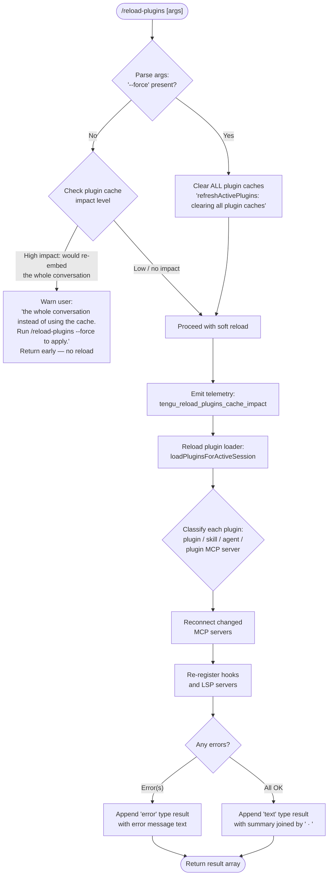

# `/reload-plugins`

> Analysis basis: CC v2.1.165 bundle.js (AST extraction + Claude interpretation)
> Minimum version: v2.1.165

---

## Overview

`/reload-plugins` activates pending plugin changes in the current Claude Code session without requiring a full restart. It rescans all plugin configurations (skills, agents, and MCP servers), wires up updated hooks and LSP servers, and optionally clears all plugin caches when the `--force` flag is supplied.

---

## Registration

| Field | Value |
|---|---|
| type | `local` |
| name | `reload-plugins` |
| description | `Activate pending plugin changes in the current session` |
| argumentHint | `[--force]` |
| supportsNonInteractive | `false` |
| thinClientDispatch | `"control-request"` |
| module_id | `FAK` |
| load_inline | `true` |
| loc_byte | `12572127` |
| loc_byte_end | `12572371` |
| loc_line | `9042` |
| arbor_handler.name | `lSf` |
| arbor_handler.kind | `AsyncFunction` |
| arbor_handler.fqn | `claude-2.1.165::lSf` |
| arbor_handler.resolution_path | `module_id` |
| arbor_handler.n_hits | `0` |

Analysis basis: CC v2.1.165 bundle.js:+12572127

---

## Input Branching

The command has 4+ distinct paths depending on the `--force` flag, the current cache-impact level, and whether any plugins are dirty. A Mermaid flowchart is used.



Analysis basis: CC v2.1.165 bundle.js:+12570825, +12570876, +12571211, +12571247, +12571325

---

## Behavioral Spec

### 1. Argument Parsing

```
function parseReloadPluginsArgs(rawInput):
    trimmed = rawInput.trim()
    forceMode = trimmed includes "--force"
    return { forceMode }
```

The `--force` flag is detected via the literal string `"--force"` (bundle.js:+12571247) and mapped to the key `"force"` (bundle.js:+12571262). The argument string is trimmed before inspection (bundle.js:+12571211).

### 2. Cache-Impact Guard (soft-reload path)

When `--force` is absent, the handler consults a cache-impact assessment function (`BAK`, resolved as the cache-impact checker):

```
function checkCacheImpact(appState):
    impact = computeReloadPluginsCacheImpact(appState)
    emit telemetry("tengu_reload_plugins_cache_impact", { impact })
    if impact is HIGH:
        return { blocked: true,
                 message: "...the whole conversation instead of using the cache. Run /reload-plugins --force to apply." }
    return { blocked: false }
```

If blocked, the handler returns a single `"text"` type result containing the warning message and does not proceed with any reload operations.

Analysis basis: CC v2.1.165 bundle.js:+12570119 (telemetry), +12570710 (warning literal), +12571431

### 3. Cache Clearing (force path only)

When `--force` is present, the handler invokes `V0H` (the active-plugin refresher) with a flag that causes it to clear all plugin caches before reloading:

```
function clearAllPluginCaches():
    log("refreshActivePlugins: clearing all plugin caches")
    pluginInstallCache.clear()       // MF / pN8.clear
    skillIndexCache.clearSkillIndexCache()  // Mm / H.clearSkillIndexCache
```

Analysis basis: CC v2.1.165 bundle.js:+12567795 (log literal), +12567849 (`HVq`), +9960902 (`MF → pN8.clear`), +13154866 (`Mm → H.clearSkillIndexCache`), +12571557

### 4. Plugin Reload — `loadPluginsForActiveSession` (`V0H`)

`V0H` is the central reloader. It:

1. Reads all plugin configuration sources (project, user, local, enterprise MCP configs from `.mcp.json` files).
2. Loads installed skill/agent/plugin manifests from disk via `Ys` (the plugin-file scanner) and `nSH` (the LSP config reader).
3. Classifies each loaded item by type: `"plugin"`, `"skill"`, `"agent"`, or `"plugin MCP server"` (bundle.js:+12570941, +12570972, +12571000, +12571032).
4. Merges previous and new plugin state, filtering removed items (`dSf`, `cSf`).
5. Fires `Vl.emit` to notify subscribers of the updated plugin graph (bundle.js:+12568903).

```
async function loadPluginsForActiveSession(appState, options):
    configs = await readAllMcpConfigs()          // EP / ws
    installedPlugins = await scanInstalledPlugins()   // Ys
    lspConfigs = await readLspConfigs()          // nSH
    merged = mergePluginState(previous, configs, installedPlugins, lspConfigs)
    removed = computeRemovedPlugins(previous, merged)  // dSf / cSf
    emit("pluginStateChanged", merged)
    return merged
```

Analysis basis: CC v2.1.165 bundle.js:+12567795, +12567904, +12568262, +12568473, +12568506, +12568903

### 5. MCP Server Reconnection (`UAK` / plugin-connection manager)

After the plugin graph is rebuilt, `UAK` drives MCP server reconnection:

```
async function reconnectMcpServers(previousSlots, newSlots):
    for each server in newSlots:
        if server was previously connected AND config unchanged:
            skip   // _.has / A.has check
        else:
            resolve server identity via xN (getServerIdentity)
            determine transport type via Ls (resolveTransportMode)
            apply policy filter via TD (checkOutputTokenPolicy)
            connect / reconnect
```

Analysis basis: CC v2.1.165 bundle.js:+12569843, +12569893, +12569932, +12569976, +12569982, +12570003

### 6. Plugin-Type Classification and Result Assembly

After reload completes, the handler assembles the user-visible result string:

```
function assembleReloadResult(loadResult):
    parts = []
    for each item in loadResult:
        classify item as "plugin" | "skill" | "agent" | "plugin MCP server"
        if item has error:
            parts.push({ type: "error", text: errorMessage })
        else:
            parts.push(item.displayName)
    summary = parts.join(" · ")
    return [{ type: "text", content: summary }]
```

Separator literal `" · "` is from bundle.js:+12571059. Result-type literals `"error"` and `"text"` are from bundle.js:+12571114 and +12571189.

### 7. Hook and LSP Re-registration (`RMH`)

`RMH` is the hook/LSP manager invoked as the final step. It re-reads the hook manifest and re-registers all hooks and LSP server configs derived from the refreshed plugin state.

```
async function reRegisterHooksAndLsp(pluginGraph):
    hooks = extractHooks(pluginGraph)    // hkH / m2 / lA
    lspServers = extractLspServers(pluginGraph)  // ta / Jh_
    for hook in hooks:
        registerHook(hook)   // _k → R5
    for lsp in lspServers:
        reconnectLsp(lsp)
    return { hookCount, lspCount }
```

Result labels `"hook"` (bundle.js:+12571806) and `"plugin LSP server"` (bundle.js:+12571865) appear in the final summary output.

Analysis basis: CC v2.1.165 bundle.js:+12571589, +12571632

### 8. Argument-Splitting Helper (`nSf`)

A small helper splits the raw argument string into tokens before flag detection:

```
function splitArgs(rawInput):
    return rawInput.split(" ")   // A.split — bundle.js:+12570607
```

Analysis basis: CC v2.1.165 bundle.js:+12571485, +12570607

---

## State & Side Effects

| Item | Detail |
|---|---|
| Telemetry | `tengu_reload_plugins_cache_impact` (bundle.js:+12570119) — fired on every invocation with the computed impact level |
| Telemetry (indirect) | `tengu_mcp_list_changed` (bundle.js:+15917193) — may fire if MCP tool list changes after reconnect |
| Telemetry (indirect) | `tengu_plugin_state_file_error` (bundle.js:+10018441) — if plugin state file is corrupt |
| Telemetry (indirect) | `tengu_skill_file_changed` (bundle.js:+14158235) — if skill files change during reload |
| Plugin cache cleared | On `--force`: `pN8` cache cleared (bundle.js:+9960902); skill index cache cleared via `H.clearSkillIndexCache` (bundle.js:+13154866) |
| appState changes | `pluginStateChanged` event emitted via `Vl.emit` (bundle.js:+12568903); active plugin graph updated in memory |
| MCP server connections | Changed or new MCP server slots are connected/reconnected; unchanged slots are left in place |
| Hook registration | All hooks from updated plugin manifests are re-registered via `RMH` (bundle.js:+12571589) |
| LSP servers | LSP server configs derived from plugin manifests are re-applied (bundle.js:+12571865) |
| Non-interactive | `supportsNonInteractive: false` — command cannot be used in `--print` / pipe mode |
| Thin client dispatch | `"control-request"` — in thin-client mode the command is forwarded as a control request rather than executed locally |
| Sound | None observed in depth-2 traversal |

---

## Version History

| Version | Change |
|---|---|
| v2.1.165 | Initial analysis |

---

## Common Mistakes

1. **Forgetting `--force` when MCP configs changed significantly.** If the reload would require re-embedding the entire conversation, the soft reload is blocked and a warning is shown. You must explicitly run `/reload-plugins --force` to proceed.
2. **Running in non-interactive mode.** `supportsNonInteractive` is `false`; attempting to use this command in `--print` mode or piped input will fail.
3. **Expecting instant MCP reconnection.** MCP servers that were previously failed are subject to a 15-minute retry backoff (`"Skipping connection (recent failure cached; retries automatically in 15 min, or edit the plugin config to retry now)"` — bundle.js:+10426035). Editing the plugin config or using `--force` can bypass the backoff.
4. **Confusing plugin types.** The command treats `"plugin"`, `"skill"`, `"agent"`, and `"plugin MCP server"` as distinct categories; errors in one category do not prevent others from loading.
5. **Using yarn or pnpm lockfiles in plugin packages.** The plugin installer skips such packages (`"Skipped: yarn/pnpm lockfiles are not supported"` — bundle.js:+5084517). Migrate to npm or bun for plugin packages that require install-time hooks.

---

## Appendix — Identifier Mapping

> For bundle debugging only. Identifiers change across versions.

| Identifier | Role |
|---|---|
| `lSf` | Main handler for `/reload-plugins` (AsyncFunction, entry point) |
| `iX` | Pre-handler validation / argument intake |
| `s4` | Argument parser / tokenizer utility |
| `MEH` | Sub-utility called from argument parser |
| `Hi` | Cache-impact pre-check dispatcher |
| `b8` | Low-level utility called by cache-impact checker |
| `BAK` | Cache-impact assessment and early-return logic |
| `nSf` | Argument string splitter |
| `V0H` | Active-plugin session reloader (core reload orchestrator) |
| `HVq` | Plugin-cache-clear flag handler |
| `F$` | Plugin installer/cache manager composite |
| `MAf` | Plugin loader aggregate |
| `oW` | Single-plugin loader |
| `Mm` | Skill index cache clearer |
| `MF` | Plugin install cache clearer (`pN8.clear`) |
| `nh` | Plugin state persistence helper |
| `dCH` | Plugin state disk writer |
| `nW6` | Plugin object store accessor |
| `Rh_` | Plugin reload hook wrapper |
| `Ys` | Installed plugin file scanner |
| `oB` | Plugin file extension filter (`.mcpb`, `.dxt`) |
| `dC_` | Plugin manifest file reader |
| `tx9` | Plugin status tracker |
| `CW6` | MCPB archive extractor / manifest loader |
| `nSH` | LSP config reader |
| `QU7` | LSP config path validator |
| `gU7` | LSP path relativity checker |
| `t08` | LSP extension-conflict detector |
| `UAK` | MCP server reconnection orchestrator |
| `fm9` | Plugin loader (all-plugins entry) |
| `Dh_` | Plugin load dispatcher |
| `jh_` | Per-plugin load worker |
| `Yh_` | Plugin load result assembler |
| `ws` | MCP server connection manager |
| `EP` | MCP config file reader (`.mcp.json`) |
| `vXH` | MCP server slot builder |
| `Qj` | Policy settings checker for MCP |
| `LD7` | MCP server deduplication tracker |
| `XY8` | MCP server capability negotiator |
| `fk` | MCP server connection finalizer |
| `xN` | MCP server identity resolver |
| `hR_` | MCP transport type resolver |
| `yR_` | Auto-scaling MCP connection helper |
| `gM7` | MCP server prefix checker |
| `Ls` | MCP transport mode resolver |
| `dM7` | Transport-mode array handler |
| `D6` | Token-search/tool-search feature flag checker |
| `TD` | Output-token policy enforcer |
| `RMH` | Hook and LSP re-registration manager |
| `_k` | Hook registry writer |
| `R5` | Hook config reader (known_marketplaces.json consumer) |
| `oN8` | Hook file path builder |
| `hkH` | Hook manifest parser |
| `x8` | Hook entry validator |
| `Pl6` | Hook UJA/BJA installer |
| `Kd` | Hook loader (full) |
| `bZ` | Managed-scope guard (throws on managed installs) |
| `lA` | Hook include/split helper |
| `m2` | Hook resolution engine |
| `Nw9` | URL fragment extractor |
| `k26` | Dependency resolver |
| `L$8` | Dependency leaf validator |
| `vw9` | Host-pattern matcher |
| `Iw9` | Path-pattern matcher |
| `ZsL` | Dependency graph walker |
| `h_H` | Hook entry type checker |
| `yw9` | Composite pattern matcher |
| `ta` | Marketplace manifest reader |
| `lI6` | Marketplace file path builder |
| `Ia_` | Marketplace JSON validator |
| `eE` | Effective-config merger for hooks |
| `Jh_` | Hook config file reader |
| `DWf` | Dependency whitelist checker |
| `FW6` | Full plugin-install/update pipeline |
| `mZ` | Plugin state file loader |
| `ya_` | Plugin state file reader (sync) |
| `ha_` | Plugin state entry iterator |
| `Lh_` | Plugin state updater |
| `dSf` | Removed-plugin filter (previous → new diff) |
| `cSf` | Removed-plugin filter variant |
| `pAK` | Plugin active-set membership checker |
| `acK` | Plugin log/trace writer |
| `d3H` | Log entry formatter |
| `aL6` | Log level selector |
| `s2A` | Log file path builder |
| `a2A` | Log file rotation handler |
| `ocK` | Log file append worker |
| `j9` | Diagnostic hook registrar (`zXA.register`) |
| `UAK` | (see above) |
| `V0H` | (see above — core reload orchestrator) |
| `R_H` | Result formatter (maps items to display strings with dependency labels) |
| `$pH` | Async write-queue manager (clearTimeout / setTimeout / setImmediate pattern) |
| `NKK` | Daemon status file writer (`daemon.status.json`) |
| `JR6` | Daemon status path builder |
| `N9` | AsyncLocalStorage store accessor |
| `nr` | Session metadata writer |
| `W8` | Session initializer |
| `FH` | Full session handler composite |
| `M` | MCP update applier composite |
| `AbH` | MCP server connection builder |
| `eU8` | MCP connection result applier |
| `IYA` | MCP retry / recovery manager |
| `wyq` | MCP SDK connect wrapper |
| `zH` | MCP server state map (get/set) |
| `AH` | MCP server descriptor tuple |
| `E8` | MCP connection health tracker |
| `S8` | MCP session UUID manager |
| `M8` | MCP server cleanup handler |
| `$xK` | MCP experiment-gate checker |
| `uO9` | VSCode MCP integration checker |
| `pH` | Session plugin state viewer |
| `QH` | Message write-batch helper |
| `OH` | Session output enqueuer |
| `n` | Agent scheduler ref |
| `r` | Agent MCP-update applier |
| `s` | Agent plugin-filter worker |
| `hB` | Observable/stream combinator |
| `_bH` | MCP update payload validator |
| `zA6` | Integer parser (parseInt wrapper) |
| `RI8` | Integer range validator |
| `g$` | Tool-use gate checker |
| `GH` | Tool-use gate + policy composite |
| `PH` | Tool-use boolean resolver |
| `Yg` | Tool-use session gate |
| `FH` | (see above) |
| `W` | MCP client connection holder |
| `XK6` | MCP client init helper |
| `vH` | Tool-list combiner |
| `fH` | Tool-list change notifier |
| `JA7` | Plugin dependency final resolver |
| `BW6` | Plugin binary (MCPB) installer |
| `aoH` | MCPB package unpacker |
| `HO8` | MCPB manifest validator |
| `U_H` | MCPB hash verifier |
| `Hk` | MCPB directory manager |
| `p$8` | npm package installer for plugins |
| `aB` | Error code converter |
| `yJH` | MCPB post-install hook runner |
| `s38` | Plugin cleanup helper |
| `Lh_` | (see above — plugin state updater) |
| `N4` | OTEL metrics plugin event emitter |
| `vkH` | OTEL resource attribute builder |
| `e46` | Plugin install event emitter |
| `Rg8` | Plugin install metric recorder |
| `Cg8` | Plugin install counter |
| `R_H` | (see above — result formatter) |
| `sI` | Platform name normalizer |
| `u$` | String error code extractor |
| `qH` | Voice + session state composite ref |
| `Q6` | Config directory path resolver |
| `sz` | Module cache clearer |
| `b6` | Context store accessor |
| `bd6` | AsyncLocalStorage store getter |

---

Note: index built via Arbor fallback; some signals (telemetry, literals) may be missing — see arbor-fallback.js.