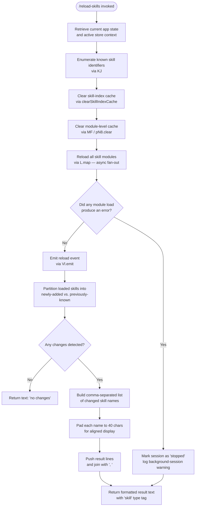

# `/reload-skills`

> Analysis basis: CC v2.1.165 bundle.js (AST extraction + Claude interpretation)
> Minimum version: v2.1.165

---

## Overview

`/reload-skills` rescans the filesystem for skill definitions that were added or modified after the current session started, clears the internal skill-index cache, and reloads all skill modules without restarting Claude Code. It concludes by emitting a summary event and reporting back either the names of reloaded skills or a "no changes" notice.

---

## Registration

| Field | Value |
|---|---|
| type | `local` |
| name | `reload-skills` |
| description | `Pick up skills added or changed on disk during this session` |
| supportsNonInteractive | `true` |
| thinClientDispatch | `post-text` |
| module_id | `dAK` |
| load_inline | `true` |
| loc_byte | `12572921` |
| loc_byte_end | `12573138` |
| loc_line | `9042` |
| arbor_handler.name | `rSf` |
| arbor_handler.fqn | `claude-2.1.165::rSf` |
| arbor_handler.kind | `AsyncFunction` |
| arbor_handler.resolution_path | `module_id` |
| arbor_handler.n_hits | `0` |

Analysis basis: CC v2.1.165 bundle.js:+12572921

---

## Input Branching

The command has four distinct outcome branches after execution: skills newly loaded, skills that existed before and were reloaded, no changed skills detected, and a background-session / error case. A Mermaid flowchart is used.



Analysis basis: CC v2.1.165 bundle.js:+12572443 – +12572817

---

## Behavioral Spec

### 1. Handler Entry Point — `reloadSkillsHandler` (`rSf`)

The async handler `rSf` is the primary entry point resolved via `module_id → dAK`.

```
async function reloadSkillsHandler(context):
    // Step 1: Acquire app state
    appState = getAppState()          // via b6 → bd6 → Cd6.getStore
    activeStore = resolveActiveStore() // via X_ → uv

    // Step 2: Snapshot current skill identifiers before reload
    previousSkillSet = getKnownSkillIdentifiers(appState)   // via KJ

    // Step 3: Clear all skill caches
    clearSkillIndex()        // via nh → Mm → H.clearSkillIndexCache
    clearModuleCache()       // via MF → pN8.clear

    // Step 4: Fan-out reload across all skill modules (async)
    reloadResults = await Promise.all(
        skillModuleList.map(module => reloadSingleSkill(module))
    )                        // via L.map, each entry: q.add, f.finally, L, q.delete

    // Step 5: Emit reload lifecycle event
    emitReloadEvent(eventBus)   // via Vl.emit

    // Step 6: Partition results
    newlyAdded   = reloadResults.filter(s => !previousSkillSet.has(s))
    // bundle.js:+12572581
    alsoReloaded = reloadResults.filter(s =>  previousSkillSet.has(s))
    // bundle.js:+12572605, +12572620

    // Step 7: Build output
    if newlyAdded is empty AND alsoReloaded is empty:
        return { type: "text", content: "no changes" }
        // bundle.js:+12572735, +12572760

    lines = []
    for skill in (newlyAdded + alsoReloaded):
        lines.push(formatSkillEntry(skill))   // via O.push → b8

    resultText = lines.join(", ")             // bundle.js:+12572722, +12572729
    return { type: "skill", content: resultText }
    // bundle.js:+12572805, +12572817
```

Analysis basis: CC v2.1.165 bundle.js:+12572443

---

### 2. App-State Retrieval — `getAppState` (`b6`)

```
function getAppState():
    store = contextualStore.getStore()   // via bd6 → Cd6.getStore
    if store is null:
        return fallbackState()           // via bd6 → ie
    return resolveDisplay(store)         // via X_ → uv
```

Analysis basis: CC v2.1.165 bundle.js:+1020504

---

### 3. Skill-Index Cache Clearing — `clearSkillIndex` (`nh`)

```
async function clearSkillIndex():
    await resolveSkillManager()          // via Mm → Promise.resolve + hAA
    skillManager.clearSkillIndexCache()  // via Mm → H.clearSkillIndexCache
    // bundle.js:+13154866

    invalidateBootstrapCache()           // via cN8
    resetSecondaryCache()                // via bZq
    resetDerivedCache()                  // via dCH → Dk6 → Gv8.get + zk6
```

Analysis basis: CC v2.1.165 bundle.js:+13154913

---

### 4. Skill Manager Bootstrap — `resolveSkillManager` (`Mm`)

The skill manager is fetched via an HTTP bootstrap call with the following observable characteristics:

- Logs `"[Bootstrap] Fetching"` at debug level before the request.
  (bundle.js:+15724583)
- Sets `Content-Type: application/json` and `User-Agent` request headers.
  (bundle.js:+15724668, +15724702)
- Has a fetch timeout of **5000 ms**.
  (bundle.js:+15724784)
- On a successful parse, logs `"[Bootstrap] Fetch ok"`.
  (bundle.js:+15724957)
- On parse failure, records a `parse_failed` marker and fires the
  `api_bootstrap_fetch` telemetry event.
  (bundle.js:+15724927, +15724905)
- Uses an internal LRU/Map cache (`_A.get`) to avoid redundant fetches.
  (bundle.js:+15724619)

Analysis basis: CC v2.1.165 bundle.js:+13154814

---

### 5. Module-Level Cache Clear — `clearModuleCache` (`MF`)

```
function clearModuleCache():
    moduleRegistry.clear()   // via pN8.clear
    // Ensures stale compiled skill modules are evicted before re-import.
```

Analysis basis: CC v2.1.165 bundle.js:+9960902

---

### 6. Single Skill Reload — `reloadSingleSkill` (`L` entry)

```
async function reloadSingleSkill(module):
    activeSet.add(module)               // q.add  — marks in-flight
    try:
        handle = await openSkillFile(module)    // A → f.toLowerCase (normalise path)
        result = await loadSkillContents(handle) // f → L (recursive partial load)
        await handle.close()            // f → A.close
        await result.close()            // f → q.close
        return result
    finally:
        activeSet.delete(module)        // L → q.delete
```

Note: file names are normalised to lowercase before processing.
(bundle.js:+16160354)

Name padding to **40 characters** is applied when building the display list.
(bundle.js:+16160428)

Analysis basis: CC v2.1.165 bundle.js:+16139634

---

### 7. Stopped / Background-Session Branch (`b8`)

When a skill reload detects a session in a `"stopped"` state, it appends
a `"background session"` label to the output lines rather than raising an
exception, allowing the handler to complete gracefully.
(bundle.js:+16170459, +16170502)

Analysis basis: CC v2.1.165 bundle.js:+16170497

---

### 8. Skill-Name Parsing — `parseSkillName` (`Gw_`)

```
function parseSkillName(raw):
    parts = raw.split(delimiter)        // _.split
    trimmed = parts.map(p => p.trim())  // q.trim
    idx = trimmed.indexOf(marker)       // q.indexOf  (marker offset = 1)
    // bundle.js:+2974566
    if idx < 0:
        return trimmed.slice(0)         // q.slice from 0
        // bundle.js:+2974591
    return trimmed.slice(idx)
```

Analysis basis: CC v2.1.165 bundle.js:+2974480

---

### 9. Skill Identifier Validation — `validateSkillIdent` (`v`)

```
function validateSkillIdent(ident):
    if not isValidFormat(ident):        // f76
        log("debug", ...)               // bundle.js:+206051
        return null
    if isKnownPlatform(ident):          // icK
        if platformList.includes(ident):  // H.includes
            canonical = normalize(ident)  // SH
            upper = canonical.toUpperCase() // _.toUpperCase
            key = buildKey(upper)        // J4
            trimmed = key.trim()         // H.trim
            validated = applyRules(trimmed) // VR
            return postProcess(validated)   // ppH, acK
    return null
```

Analysis basis: CC v2.1.165 bundle.js:+206075

---

## State & Side Effects

| Item | Detail |
|---|---|
| Telemetry | `tengu_feature_sad` (fired within error-handling path of store lookup, bundle.js:+1010365) |
| Skill-index cache | Fully invalidated via `H.clearSkillIndexCache` (bundle.js:+13154866) |
| Module registry | Cleared via `pN8.clear` (bundle.js:+9960902) |
| Secondary / derived caches | Cleared via `cN8`, `bZq`, `dCH` (bundle.js:+13154918–13154930) |
| Event bus | `Vl.emit` fires a reload lifecycle event after modules are loaded (bundle.js:+12572550) |
| In-flight tracker | `activeSet` (Set) tracks reloads in progress; entries are added before and deleted after each module load (bundle.js:+16139634, +16139657) |
| File handles | Skill file handles are closed in a `finally` block ensuring no leaks (bundle.js:+16145626, +16145636) |
| Output type | Returns a `{ type: "text" }` object when no changes, or a `{ type: "skill" }` object with a comma-separated name list (bundle.js:+12572760, +12572817) |
| Non-interactive support | `supportsNonInteractive: true` — safe to invoke in scripted / headless pipelines |
| Thin-client dispatch | `thinClientDispatch: "post-text"` — result is posted as plain text in thin-client mode |

---

## Version History

| Version | Change |
|---|---|
| v2.1.165 | Initial analysis |

---

## Common Mistakes

1. **Expecting immediate availability of newly-written skills without running `/reload-skills`** — the skill index is only rebuilt on command invocation; file-system watches do not trigger automatic reloads within a session.
2. **Assuming `/reload-skills` restarts the Claude Code process** — the command clears and rebuilds in-process caches only; no process restart occurs.
3. **Invoking in a thin-client context and expecting structured JSON back** — `thinClientDispatch` is `"post-text"`, so the response is plain text, not a JSON payload.
4. **Expecting an error to be thrown when no changes are found** — the handler returns `"no changes"` as a normal text result; callers should not treat a non-error return as implicit confirmation of changes.
5. **Ignoring the 5000 ms bootstrap fetch timeout** — if the skill manager bootstrap endpoint is unreachable, the reload will silently fail after the timeout; check connectivity in environments with network restrictions.

---

## Appendix — Identifier Mapping

> For bundle debugging only. Identifiers change across versions.

| Identifier | Role |
|---|---|
| `rSf` | Primary handler — `reloadSkillsHandler` (AsyncFunction, arbor-resolved via module_id `dAK`) |
| `b6` | App-state accessor — retrieves current application state from context store |
| `bd6` | Contextual store resolver — calls `Cd6.getStore` and falls back via `ie` |
| `ie` | Fallback state provider — returns default state when store is absent |
| `X_` | Active-store resolver — delegates to `uv` |
| `uv` | Display/store adapter |
| `nh` | Skill-index cache invalidator — orchestrates full cache clearing |
| `Mm` | Skill manager bootstrapper — async HTTP fetch with 5000 ms timeout |
| `H` | Skill manager object — exposes `clearSkillIndexCache`, HTTP headers, and cache map |
| `v` | Skill identifier validator — checks format, platform membership, and normalises casing |
| `e$` | HTTP response handler within bootstrap flow |
| `Gw_` | Skill-name parser — splits, trims, and slices raw name strings |
| `ZHH` | Set membership checker (`c44.has`) |
| `uj` | String replacement utility (`H.replace`) |
| `e1` | Composite string processor — delegates to `D6H`, `Aq`, `eX` |
| `s6` | Secondary cache helper — delegates to `c` and `P6` |
| `cN8` | Secondary cache invalidator |
| `bZq` | Tertiary cache reset |
| `dCH` | Derived-cache reset — delegates to `Dk6` |
| `Dk6` | Cache entry lookup and removal — uses `Gv8.get` and `zk6` |
| `zk6` | Cache-entry deletion helper |
| `MF` | Module-registry clearer — calls `pN8.clear` |
| `L` | Single-skill reload worker — manages add/load/delete lifecycle |
| `f` | Skill file handle — exposes `close`, `toLowerCase` for path normalisation |
| `A` | Secondary file handle or stream — exposes `close` |
| `K` | Skill-name formatter — pads names to 40 chars via `f.padEnd` |
| `O` | Output line accumulator — collects formatted skill entries via `push`/`join` |
| `b8` | Background-session / stopped-state entry builder |
| `q` | General-purpose collection / file-op proxy (context-dependent: Set operations, `unlinkSync`, `trim`, `indexOf`, `slice`, `filter`, `close`) |

---

Note: index built via Arbor fallback; some signals (telemetry, literals) may be missing — see arbor-fallback.js.