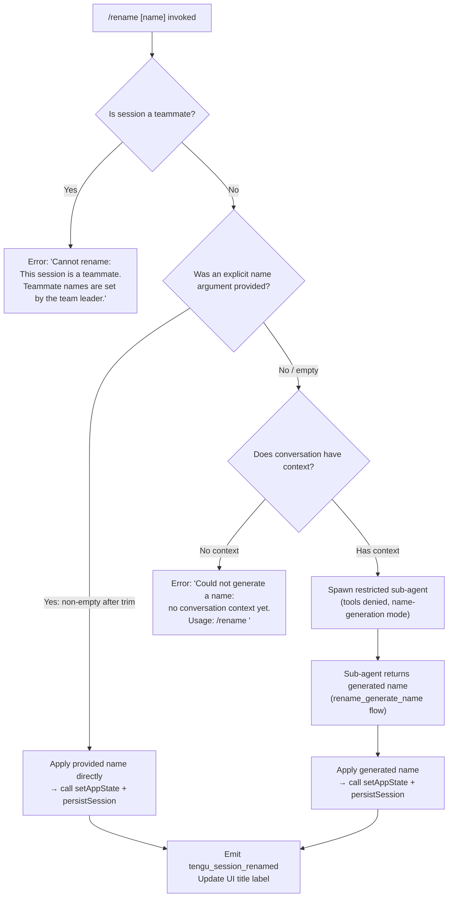

# `/rename`

> Analysis basis: CC v2.1.165 bundle.js (AST extraction + Claude interpretation)
> Minimum version: v2.1.165

---

## Overview

`/rename` renames the current Claude Code conversation session. It accepts an optional explicit name argument; when no name is supplied and sufficient conversation context exists, the command invokes a restricted sub-agent to auto-generate a name from the conversation history. If invoked from within a teammate session, the command is blocked because teammate names are controlled by the team leader.

---

## Registration

| Field | Value |
|---|---|
| type | `local-jsx` |
| name | `rename` |
| description | `Rename the current conversation` |
| argumentHint | `[name]` |
| immediate | `true` |
| aliases | `["name"]` |
| module_id | `jrq` |
| load_inline | `true` |
| loc_byte | `11998439` |
| loc_byte_end | `11998638` |
| loc_line | `8326` |
| arbor_handler.name | `gTf` |
| arbor_handler.fqn | `claude-2.1.165::gTf` |
| arbor_handler.kind | `AsyncFunction` |
| arbor_handler.resolution_path | `module_id` |
| arbor_handler.n_hits | `0` |

Analysis basis: CC v2.1.165 bundle.js:+11998439

---

## Input Branching

Four distinct execution paths are present, requiring a Mermaid flowchart.



Analysis basis: CC v2.1.165 bundle.js:+11997465, +11997583, +11997603, +11997702, +11997814, +11997928, +11997942

---

## Behavioral Spec

### Top-Level Handler (`gTf`)

The Arbor-resolved handler is `gTf` (AsyncFunction, resolved via `module_id → jrq`). It orchestrates the three sub-functions `sessionValidation`, `inputProcessor`, and `sessionRenameApply`.

```
async function topLevelRenameHandler(context, args):
    isTeammate = sessionValidation(context)
    if isTeammate:
        return errorMessage("Cannot rename: This session is a teammate. ...")
    trimmedArg = args.trim()
    if trimmedArg is non-empty:
        applyRename(context, trimmedArg, origin="rename")
    else:
        autoGeneratedName = await autoGenerateName(context)
        if autoGeneratedName is null:
            return errorMessage("Could not generate a name: no conversation ...")
        applyRename(context, autoGeneratedName, origin="rename_generate_name")
```

Analysis basis: CC v2.1.165 bundle.js:+11998135, +11998151, +11998193

---

### Teammate Guard (`vS8` → `GT`)

Before any rename logic executes, the handler checks whether the current session is operating as a teammate. This check calls into the app-state getter path.

```
function teammateGuard(context):
    state = getAppState(context)
    return state.isTeammate === true
```

Analysis basis: CC v2.1.165 bundle.js:+11997465

If `true`, the literal error string `"Cannot rename: This session is a teammate. Teammate names are set by the team leader."` is returned immediately.

Analysis basis: CC v2.1.165 bundle.js:+11997603

---

### Argument Processing (`IS8`)

`IS8` is the primary command body function. It:

1. Calls `sessionValidation` (teammate guard).
2. Trims the argument string via `H.trim` (Analysis basis: +11997702).
3. Branches on whether the trimmed string is non-empty.
4. On explicit name: calls `sessionRenameApply` with `origin = "rename"` (literal at +11995827).
5. On empty string: calls `autoGenerateName`, guarded by a context-availability check.
6. If context is absent: returns the no-context error (literal at +11997814).
7. Calls `setAppState` (Analysis basis: +11997942) to update the UI title.
8. Calls `sessionPersistenceWriter` (`BwH`) to durably save the name.
9. Calls `sessionBasenameAccessor` (`aj`) for display label derivation.

Analysis basis: CC v2.1.165 bundle.js:+11997583

---

### Auto-Name Generation (`m16` / `FTf` / `jG`)

When no explicit name is provided but conversation context exists, the command forks a restricted sub-agent:

```
async function autoGenerateName(context):
    emit telemetry("tengu_rename_full_session_fork")
    timestamp = Date.now()
    sessionSnapshot = buildSessionSnapshot(context)          // u6A
    abortController = new AbortController()
    abortController.signal.addEventListener("abort", ...)    // FTf
    agentConfig = {
        permissionMode: "deny",                              // literal "deny" at +11995733
        toolsAllowed: [],
        systemPrompt: "Session name generation cannot use tools",  // +11995748
        origin: "rename_generate_name"                       // +11995851
    }
    result = await runSubAgent(agentConfig, sessionSnapshot) // jG
    return extractTextContent(result)                        // EH, VS8
```

The sub-agent is intentionally restricted: tool use is denied (literal `"deny"` at +11995733) and the system prompt explicitly states `"Session name generation cannot use tools"` (+11995748).

Analysis basis: CC v2.1.165 bundle.js:+11996288, +11996329, +11996348, +11995487, +11995748

---

### Session Persistence and File Rename (`BwH` / `acK` / `a2A`)

After a name is determined (either manual or generated), the command persists it:

```
async function persistRename(context, newName):
    oldPath = resolveSessionFilePath(context)                // s2A, KHH.join
    newBasename = sanitizeFileName(newName)                  // J4: toUpperCase, replace, slice
    newPath = buildNewPath(oldPath, newBasename)
    if fileExists(oldPath):
        if oldPath.endsWith(".txt"):                         // a2A, literal ".txt" at +205021
            intermediate = oldPath.slice(0, -4)             // literal 4 at +205043
        await fs.rename(oldPath, newPath)                    // Zy.rename at +205073
        if intermediateExists:
            await fs.unlink(intermediate)                    // Zy.unlink at +205113
    writeSessionTitle(context, newName)                      // C2A → H.write
    scheduleDebounced(persistQueue)                          // acK → $pH: clearTimeout/setTimeout
```

The debounce queue (`$pH`) uses `clearTimeout` and `setTimeout` with short intervals, and falls back to `setImmediate` for immediate flushing.

Analysis basis: CC v2.1.165 bundle.js:+205073, +205113, +205021, +205043, +193190, +59737, +59901, +59994

---

### Session Title Log Write (`CS` / `JMH` / `D$H`)

The session title is also appended to the transcript log file in two variants:

- `"custom-title"` origin when the user supplied the name explicitly (literal at +13196652).
- `"ai-title"` origin when the name was auto-generated by the sub-agent (literal at +13196816).

Log line width is padded to 384 or 448 characters (literals at +13195726 and +13195770).

```
function writeSessionTitleToLog(sessionPath, title, origin):
    logLine = formatLogLine(title, origin)   // origin: "custom-title" | "ai-title"
    fs.appendFileSync(sessionPath, logLine)  // D$H → A.appendFileSync
    fs.mkdirSync(dirname, {recursive:true})  // D$H → A.mkdirSync
    emitEvent("tengu_session_renamed")       // CS → DC6.emit
```

Analysis basis: CC v2.1.165 bundle.js:+13196631, +13196640, +13196652, +13196816, +13196731, +13196744

---

### File Name Sanitization (`J4`)

The raw name string is sanitized before use as a filesystem path component:

```
function sanitizeFileName(name):
    mapped = characterMap(name)              // c2A: QcK.map
    replaced = mapped.replace(regex, "")    // H.replace
    lastSep = replaced.lastIndexOf(sep)     // A.lastIndexOf
    segment = replaced.slice(lastSep + 1)   // A.slice
    trimmed = segment.trim()
    return trimmed.toUpperCase()            // _.toUpperCase at +206177
```

Analysis basis: CC v2.1.165 bundle.js:+198062, +198089, +198199, +198225, +198251, +206177

---

### Conversation Context Normalization (`H` / `e1` / `Aq`)

Before the sub-agent receives the conversation as input, messages pass through a multi-step normalization pipeline:

```
function normalizeConversationForNameGeneration(messages):
    fetched = bootstrapFetch(messages)                 // H → v → [Bootstrap] Fetching
    parsed = parseMessages(fetched)                    // e1 → D6H
    normalized = normalizeModelTokens(parsed)          // Aq: trim, toLowerCase, replace
    filtered = filterByOrigin(normalized)              // lK → H.filter
    formatted = buildMessageArray(filtered)            // VS8: push, join, slice
    return formatted
```

Analysis basis: CC v2.1.165 bundle.js:+15724581, +2239233, +2243153, +10725823, +11993106

---

## State & Side Effects

| Item | Detail |
|---|---|
| Telemetry: `tengu_rename_full_session_fork` | Fired when the auto-generation sub-agent is spawned (bundle.js:+11996291) |
| Telemetry: `tengu_session_renamed` | Fired after the session title is written to the transcript log (bundle.js:+13196744) |
| Telemetry: `tengu_fork_agent_query` | Fired during sub-agent query execution (bundle.js:+10915602) |
| Telemetry: `tengu_forked_agent_default_turns_exceeded` | Fired if sub-agent exceeds turn limit (bundle.js:+10915159) |
| `appState` changes | `setAppState` is called to update the in-memory session title (bundle.js:+11997942) |
| File system: rename | `fs.rename` moves the old session file to a path derived from the new name (bundle.js:+205073) |
| File system: unlink | `fs.unlink` removes stale `.txt` intermediate file if present (bundle.js:+205113) |
| File system: appendFileSync | Session title log entry appended with `"custom-title"` or `"ai-title"` origin (bundle.js:+13195699) |
| Hook registration | Sub-agent registers hooks via `zXA.register` during name generation (bundle.js:+60323) |
| Sound | Not found in depth-2 traversal |
| Debounce queue | `$pH` uses `clearTimeout` / `setTimeout` / `setImmediate` to batch persistence writes (bundle.js:+59737, +59901, +59994) |

---

## Version History

| Version | Change |
|---|---|
| v2.1.165 | Initial analysis |

---

## Common Mistakes

1. **Calling `/rename` without arguments in a fresh session**: If the conversation has no messages yet, the auto-generation path will fail with `"Could not generate a name: no conversation context yet. Usage: /rename <name>"`. Always supply an explicit name in new sessions.
2. **Calling `/rename` in a teammate session**: The command is blocked unconditionally for teammate sessions; the team leader must change the name. No workaround exists within the teammate session.
3. **Expecting tool use during auto-generation**: The name-generation sub-agent runs with `permissionMode: "deny"` and cannot call any tools. Hooks or workflows that expect tool calls to fire during `/rename` will not trigger.
4. **Relying on the alias `/name`**: The `name` alias is registered but may not be surfaced prominently in help text. Both aliases share identical behavior.
5. **Assuming instant file rename**: The file-system rename is asynchronous and debounced; short-lived scripts that inspect the session file immediately after the command may observe the old filename.

---

## Appendix — Identifier Mapping

> For bundle debugging only. Identifiers change across versions.

| Identifier | Role |
|---|---|
| `gTf` | Top-level async handler for `/rename` (Arbor-resolved entry point) |
| `IS8` | Primary command body: argument processing, branching, state update |
| `vS8` | Teammate-guard check wrapper |
| `GT` | App-state getter used by teammate guard |
| `m16` | Auto-name generation orchestrator (sub-agent spawn coordinator) |
| `FTf` | Sub-agent runner with abort-controller wiring |
| `jG` | Core sub-agent query executor |
| `u6A` | Session snapshot builder (timestamp + context collector) |
| `V46` | Session snapshot helper called by `u6A` |
| `XV8` | App-state read/write within sub-agent query |
| `gOf` | Forked-agent result post-processor |
| `VS8` | Message array builder (push/join/slice for prompt construction) |
| `wrq` | Message trim/format helper used in both manual and auto paths |
| `xR` | Whitespace trimmer for individual message strings |
| `acK` | Session persistence scheduler (debounce wrapper) |
| `$pH` | Debounce queue: clearTimeout / setTimeout / setImmediate logic |
| `d3H` | Persistence queue flush helper |
| `s2A` | Session file path resolver (KHH.join) |
| `a2A` | File rename / unlink executor (Zy.rename, Zy.unlink) |
| `ocK` | Alternative append-file persistence path (mkdir + appendFile) |
| `ppH` | Session title write dispatcher |
| `C2A` | Low-level title writer (H.write) |
| `j9` | Hook registrar called during persistence (zXA.register) |
| `J4` | File name sanitizer (map, replace, lastIndexOf, slice, toUpperCase) |
| `c2A` | Character-map helper used by sanitizer (QcK.map) |
| `D6` | Conversation file loader / session context reader |
| `bDH` | Session file parser (readFileSync, statSync, mkdirSync, etc.) |
| `y6` | Session context accessor (Q6, eT, kX_, bDH) |
| `WTL` | File watcher for session context (watchFile/unwatchFile) |
| `B98` | Session-cache lookup (DX_.has/add, yDH.get) |
| `YX_` | New session record creator (randomUUID, SH, gEL, Vo.emit) |
| `XX_` | Session record updater (fm1, e_, oi1) |
| `xh` | Conversation context assembler passed to sub-agent |
| `Uv8` | Context serializer (hash, readFile, writeFile) |
| `HT` | Full conversation message formatter for API |
| `cqf` | Per-message content-block mapper |
| `CxH` | Conversation context combiner (Us_, C3K) |
| `Us_` | Context accumulator (pv8, Uv8) |
| `C3K` | Main agent query loop (streaming, tool dispatch, normalization) |
| `Y2` | Output message extractor (XA, Hf, sf_, e1) |
| `XA` | Text-content extractor (→ eH) |
| `e1` | Message normalization pipeline entry (D6H, Aq, eX) |
| `D6H` | Message structure normalizer (x0, IqH, SA, yd) |
| `yd` | Per-message role/content normalizer |
| `Aq` | Token/model-string normalizer (trim, toLowerCase, replace) |
| `H` | Bootstrap fetch + header construction for API calls |
| `v` | API call dispatcher (f76, icK, SH, J4, ppH, acK) |
| `icK` | HTTP response handler (Vy, ncK, DXA) |
| `DXA` | Response body parser (rgK, ogK) |
| `SH` | JSON.stringify wrapper |
| `EH` | String coercion helper |
| `TbH` | Session rendering / output formatting coordinator |
| `CS` | Transcript log append (Ov, D$H, S6, DC6.emit) |
| `D$H` | Log file writer (appendFileSync, mkdirSync, SH) |
| `bt` | Alternate log append path (D$H, Ov, DC6.emit) |
| `JMH` | Agent-name log writer (emits tengu_agent_name_set) |
| `Rd` | Session persistence read/write (rO6, Date.now) |
| `rO6` | File-based session state persister (readFile, writeFile, SH) |
| `M` | MCP server manager (AbH, eU8, L.get/values) |
| `AbH` | MCP connection orchestrator (bl, fk, skq, ts_, es_) |
| `BwH` | Session file cache manager (yK, e9, oj, ff) |
| `yK` | Session file path builder (k2.join, cE) |
| `cE` | Session directory path helper (k2.join, a8) |
| `e9` | Session file cache reader/updater (stat, readFile, JSON parse) |
| `ff` | Session file atomic writer (MY, k2.join, SH) |
| `MY` | Atomic file write (randomBytes, writeFile, rename, copyFile, unlink) |
| `aj` | Session basename accessor for display label (k2.basename, S6) |
| `sk8` | State key enumerator (Object.keys) |
| `kH` | Error logger for session operations (HA, eH, Dq, qW4) |
| `HA` | Error string formatter |
| `eH` | String coercion (String()) |
| `Dq` | Diagnostic logger (xSA) |
| `qW4` | Log ring-buffer manager (kd6.shift/push) |
| `s6` | Platform/env utility (c, P6) |
| `P6` | Version/platform accessor (Nu6) |
| `OM` | App-state store accessor |
| `s0` | AsyncLocalStorage store getter (L5_.getStore) |
| `Gw_` | API key / auth prefix parser (split, trim, indexOf, slice) |
| `ZHH` | Character set membership checker (c44.has) |
| `uj` | String replace utility |
| `sf_` | Auth-token type classifier (DO, startsWith, slice) |
| `NQH` | Model token normalizer helper (Z5) |
| `NE` | Model-string resolver (gM, Z5, XA) |
| `wI` | Model alias resolver (gM, Z5) |
| `SX1` | Model alias pipeline entry (NE) |
| `gM` | Model provider resolver (XA) |
| `Pe6` | Model inclusion checker (r1L.includes) |
| `vQH` | Model variant resolver (eH) |
| `r0` | Request options builder (ZA, P6H, PYH, IQH, NE, z2, gM, XA, Z5, wI) |
| `eX` | Message array builder for API (Aq, r0) |
| `lK` | Message filter by origin (H.filter) |
| `Q6` | File path utility |
| `aL6` | Path accessor helper (v8) |
| `b6` | Encoding helper (bd6, X_) |
| `B6` | JSON.parse wrapper |
| `Gvq` | Context hash generator (nqf) |
| `v8` | Async file utility |
| `R8` | Error type checker (v8) |
| `tf` | Error classifier (v8) |
| `oj` | Cache-entry deleter (_7H.delete) |
| `u8` | Input widget handler (P, pk.randomUUID, X) |
| `P` | Text input component (Fq.fromText, onChange, setOffset) |
| `X` | Stream buffer handler (Buffer.concat, indexOf, off, setTimeout) |
| `$y6` | Message type checker (lMf.has) |
| `PRq` | Message type filter ($y6) |
| `wfH` | Tool filter helper (fJ, nz7, H.filter/push) |
| `K9H` | Turn counter / state tracker |
| `Bk8` | Sub-agent turn limiter |
| `gm` | Sub-agent exit handler (hOf, LY8, hH, RH) |
| `oh` | Random bytes generator (nm9.randomBytes) |
| `b1H` | Sub-agent lifecycle hook (d4, iCH) |
| `d4` | Hook dispatcher (j9) |
| `PV8` | Sub-agent result packager |
| `o_H` | Abort signal pre-check |
| `xY8` | MCP connection status helper (bY8, GP) |
| `RY8` | MCP connection result mapper (M4) |
| `O8` | MCP debug logger (hBH.push, Er.logMCPDebug) |
| `T7` | MCP error logger (hBH.push, Er.logMCPError) |
| `ts_` | MCP tool call executor (BKf, Ad, mKf, Promise.race) |
| `es_` | MCP OAuth token handler (Ad, pKf, i_6, o_6) |
| `Myq` | MCP tool list fetcher (kI8.then, Ae_, SI8) |
| `ss_` | MCP connection state tester (GP, M4, O8, EH) |
| `Lb_` | MCP transport type checker (X8, A.includes) |
| `skq` | MCP connection batcher (Ae_, VXH, bY8, Date.now) |
| `bl` | MCP client connector (wG6, ws, ZXH, Cl, DG6) |
| `fk` | MCP client factory (oO, zb_) |
| `FN` | MCP skills emitter (D6, tengu_mcp_skills) |
| `IYA` | MCP server list updater (AbH, eU8, Object.fromEntries) |
| `eU8` | MCP connection result applier (applyMcpUpdate, _bH, mk) |
| `mk` | MCP cleanup executor ($A6, K.cleanup, FN) |
| `NKK` | Session state serializer (nr, Date.now, JR6, SH) |
| `pY8` | MCP server permission checker (tY7.has, fb_.has) |
| `l8` | Async timeout/retry helper (K, Error, setTimeout, clearTimeout) |
| `$A6` | MCP slot config accessor (VXH) |
| `_bH` | MCP connection config validator (VXH) |
| `cD` | MCP connection disposer |
| `s4` | Output stream helper (MEH) |
| `MEH` | Output message emitter |
| `x1H` | Session render state updater |
| `Rd` | Session history persister |
| `RW` | Session render cleanup |
| `Wt` | Render completion signal |
| `wT` | Render wait handler |
| `XWH` | Session render state initializer |
| `__` | Identity/passthrough helper (_) |
| `sk6` | MCP server config formatter |
| `_yq` | MCP health checker (hB) |
| `zA6` | MCP retry-after parseInt parser |
| `RI8` | MCP backoff parseInt parser |
| `IS` | MCP connection state inspector |
| `j` | Process signal handler (A.values, R.kill) |
| `K` | Output column formatter (L.map, f.padEnd) |
| `L` | Promise lifecycle tracker (q.add, f.finally, q.delete) |
| `D` | Forced shutdown handler (IJ, process.exit, z.abort) |
| `I` | Chokidar watcher wrapper (v, c, W6, S) |
| `Hf` | Message content accessor |
| `UE` | Context post-processor |
| `eK` | Context pre-processor |
| `Uk` | Session render utility |
| `PM` | Path join utility for session rendering (JR, NO, X_, DXH.join) |
| `JR` | Path component helper (uv) |
| `X_` | Path segment builder (uv) |
| `Ov` | Session output formatter (S6, Uk, PM, NO, X_, XD.join) |
| `Hj6` | Session file discovery helper |
| `_j6` | Session file filter helper |
| `qu` | Session context aggregator (Au) |
| `Au` | Session turn builder (fC) |
| `YX_` | New session initializer (Au, QNH, oU, GcH, randomUUID, SH, gEL) |
| `XX_` | Session record patcher (fm1, e_, oi1, ZHH) |
| `y6` | Session context fetcher (Q6, eT, kX_, bDH) |
| `bDH` | Full session file parser (readFileSync, statSync, mkdirSync, etc.) |
| `WTL` | Session file watcher (a98.watchFile/unwatchFile) |
| `kX_` | Session context key resolver |
| `eT` | Session state enum accessor |

---

Note: index built via Arbor fallback; some signals (telemetry, literals) may be missing — see arbor-fallback.js.