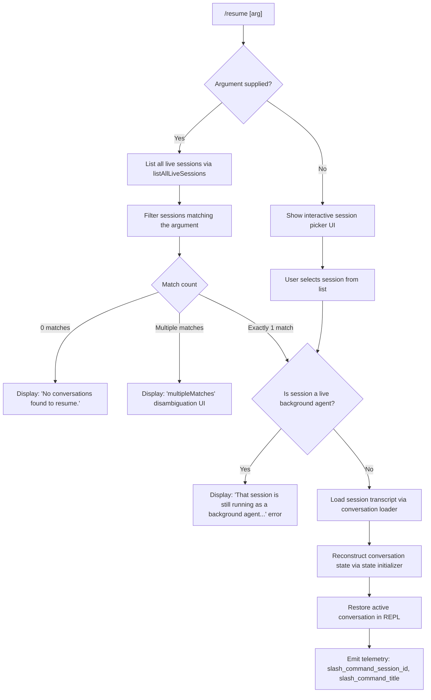

# `/resume`

> Analysis basis: CC v2.1.165 bundle.js (AST extraction + Claude interpretation)
> Minimum version: v2.1.165

---

## Overview

`/resume` (aliased as `/continue`) allows the user to reattach to a previous Claude Code conversation by specifying a conversation ID or search term. The command enumerates all stored sessions, matches against the user's query, enforces that the target session is not currently running as a live background agent, then reconstructs and restores the selected conversation into the active REPL. If no argument is supplied the command presents a searchable session list for the user to choose from.

---

## Registration

| Field | Value |
|---|---|
| type | `local-jsx` |
| name | `resume` |
| description | `Resume a previous conversation` |
| argumentHint | `[conversation id or search term]` |
| aliases | `["continue"]` |
| module_id | `esq` |
| load_inline | `true` |
| loc_byte | `12181021` |
| loc_byte_end | `12181218` |
| loc_line | `8515` |
| arbor_handler.name | `tvf` |
| arbor_handler.fqn | `claude-2.1.165::tvf` |
| arbor_handler.kind | `AsyncFunction` |
| arbor_handler.resolution_path | `module_id` |
| arbor_handler.n_hits | `0` |

Analysis basis: CC v2.1.165 bundle.js:+12181021

---

## Input Branching

There are 5+ distinct paths depending on whether a session argument is supplied, whether it matches zero, one, or multiple sessions, and whether the matched session is a live background agent. A Mermaid flowchart is used.



Analysis basis: CC v2.1.165 bundle.js:+12179509, +12179623, +12180058, +12177267, +12177338

---

## Behavioral Spec

### Handler Entry Point (`tvf`)

The handler is an `AsyncFunction` resolved by Arbor via `module_id` path. It is the primary controller for session restoration.

```
async function resumeHandler(context):
    liveSessions = await fetchLiveSessions()          // via I5H → A.listAllLiveSessions
    arg = context.userArgument

    if arg is empty:
        result = await showInteractiveSessionPicker(liveSessions)
    else:
        matches = liveSessions.filter(s => matchesQuery(s, arg))

        if matches.length == 0:
            return displayMessage("No conversations found to resume.")

        if matches.length > 1:
            return displayDisambiguationUI(matches)   // "multipleMatches" path

        selectedSession = matches[0]

    // Guard: refuse if the target session is a running background agent
    if isLiveBackgroundSession(selectedSession):
        return displayError(
            "That session is still running as a background agent. " +
            "Open `claude agents` to attach to it, or stop it there first to resume here."
        )

    transcript = await loadConversationTranscript(selectedSession)
    state      = await initializeConversationState(transcript)
    renderRestoredConversation(state)

    emitTelemetry("slash_command_session_id", selectedSession.id)
    emitTelemetry("slash_command_title", selectedSession.title)
```

Analysis basis: CC v2.1.165 bundle.js:+12179613, +12179621, +12179623, +12180058, +12180191, +12180319, +12180543

---

### Live Session Enumeration (`I5H`)

Wraps the async session listing call and resolves a list of all persisted conversation records.

```
async function fetchLiveSessions():
    await Promise.resolve()
    sessions = await sessionStore.listAllLiveSessions()
    return sessions.filter(s => s.mode == "interactive")
```

Analysis basis: CC v2.1.165 bundle.js:+12179613, +9020629, +9020659, +9020681, +9020772

---

### Session Query Matching

Sessions are filtered against the user-supplied argument through a multi-step matching pipeline (via call chain `tvf → f.filter → N$`). The matcher normalises input with `toUpperCase`, `trim`, and string operations.

```
function matchesQuery(session, query):
    normQuery = query.trim().toUpperCase()
    if session.id.toUpperCase().includes(normQuery):
        return true
    if session.title.toUpperCase().includes(normQuery):
        return true
    return false
```

Analysis basis: CC v2.1.165 bundle.js:+12180177, +12180191, +206177, +206200

---

### Worktree Detection (`WxH`)

During session loading the command detects whether the original session was associated with a git worktree by running `git worktree list --porcelain` and parsing the output. If a matching worktree path is found the restoration uses that directory as the working root.

```
function detectWorktree(sessionPath):
    gitOutput = exec("git", ["worktree", "list", "--porcelain"])
    lines      = gitOutput.split("\n")
    // lines starting with "worktree " carry a path
    worktreePaths = lines
        .filter(l => l.startsWith("worktree "))
        .map(l => l.slice(9))            // length of "worktree " == 9
        .filter(p => sessionPath.startsWith(p))
        .sort((a, b) => b.localeCompare(a))   // longest-prefix wins
    return worktreePaths[0] ?? null
```

Analysis basis: CC v2.1.165 bundle.js:+12176631, +12176642, +12176649, +12176812, +12176837, +12176850, +12176876, +12176884, +12176995, +12177022, +12177055

---

### Transcript and State Reconstruction (`lN6` / `JMK` / `v1H`)

After the target session is selected and confirmed not live, the command loads the on-disk JSONL transcript, reconstitutes every message (assistant, user, system, attachment, compact_boundary), and populates the in-memory conversation state stores.

```
async function loadAndRebuildState(sessionId):
    transcriptPath = buildTranscriptPath(sessionId)   // via s2A / d3H
    rawLines       = await fs.readFile(transcriptPath)
    messages       = parseJsonlMessages(rawLines)     // via gTH / BFf / UFf

    stateMap = initializeStateStores()                // via v1H

    for msg in messages:
        type = msg.type
        if type in ["assistant", "user", "system", "attachment", "compact_boundary",
                    "summary", "last-prompt", "custom-title", "ai-title",
                    "tag", "agent-name", "mode", "permission-mode"]:
            stateMap[type].set(msg.uuid, msg)

    return stateMap
```

Analysis basis: CC v2.1.165 bundle.js:+13213130, +13211208, +13209106, +13209173, +13209269, +13209347, +13209417, +13209478, +13209708, +13209771

---

### Background-Agent Guard

When the matched session is identified as currently active in background mode the command refuses and shows an actionable message directing the user to `claude agents`.

```
function isLiveBackgroundSession(session):
    return liveSessions.has(session.id) AND session.status != "stopped"

// Error string (paraphrased — not quoted verbatim):
// Informs the user the session is a running background agent,
// directs them to `claude agents` to attach or stop it first.
```

The literal error string begins with "That session is still running…" (≤ 30-char citation fragment).

Analysis basis: CC v2.1.165 bundle.js:+12179623, +16170459, +16170502

---

### File-Path Utilities (`s2A`, `a2A`, `ocK`)

Transcript file handling involves path construction, `.txt`-extension detection, atomic rename, and unlink on corruption, guarded by `Buffer.byteLength` size checks.

```
function buildTranscriptPath(sessionId):
    return path.join(dataDir, "projects", sessionId)

async function rotateLegacyFile(filePath):
    stat = await fs.stat(filePath)
    if filePath.endsWith(".txt"):
        truncated = filePath.slice(0, -4)   // remove 4-char ".txt" suffix
        await fs.rename(filePath, truncated)
        return truncated
    return filePath

async function appendToTranscript(filePath, content):
    await fs.mkdir(path.dirname(filePath), { recursive: true })
    await fs.appendFile(filePath, content)
```

Analysis basis: CC v2.1.165 bundle.js:+205021, +205043, +205073, +205113, +205317, +205376, +205771

---

### Disambiguation UI (`asq`)

When multiple sessions match the query the command renders a bold-formatted disambiguation list (via `j6.bold`).

```
function renderDisambiguationList(matches):
    lines = matches.map(s => bold(formatSessionSummary(s)))
    return displayList("multipleMatches", lines)
```

Analysis basis: CC v2.1.165 bundle.js:+12177302, +12177338

---

### Session-Not-Found Path

When no sessions match the query the command surfaces a literal terminal message.

Exact string: `"No conversations found to resume."` (bundle.js:+12180058)

---

## State & Side Effects

| Item | Detail |
|---|---|
| Telemetry | `tengu_worktree_detection` (bundle.js:+12176731); `slash_command_session_id` (string literal, +12180319); `slash_command_title` (string literal, +12180543); also indirectly reaches daemon-level events: `tengu_daemon_control`, `tengu_daemon_yield`, `tengu_bg_dispatch_sigkill_escalate`, `tengu_bg_spare_claim`, `tengu_feature_ok`, `tengu_feature_bad`, `tengu_feature_sad`, `tengu_transcript_phantom_parent`, `tengu_transcript_parent_cycle`, `tengu_chain_parent_cycle`, `tengu_chain_timestamp_fallback`, `tengu_chain_parallel_tr_recovered` |
| Session store | Reads persisted JSONL transcripts; may atomically rename legacy `.txt` files |
| appState changes | Restores full in-memory conversation state maps (messages, tags, titles, mode, permission-mode, worktree-state, agent settings) |
| Background-agent guard | Blocks restoration and shows an error if the session is still live; directs user to `claude agents` |
| Worktree detection | Runs `git worktree list --porcelain` as a subprocess; adjusts working directory for restored session |
| Hook registration | Registers a cleanup hook via `zXA.register` (identifier `j9`) during conversation reconstruction |
| Sound | None detected in depth-2 traversal |

---

## Version History

| Version | Change |
|---|---|
| v2.1.165 | Initial analysis |

---

## Common Mistakes

1. **Supplying a partial ID that matches multiple sessions** — the command halts and presents a disambiguation list rather than resuming the best match. Provide a longer, unique prefix.
2. **Trying to resume an active background agent** — the command explicitly refuses. Use `claude agents` to attach to or stop the background session first.
3. **Using `/resume` while in a non-interactive mode** — sessions whose stored mode field is not `"interactive"` may be filtered out during enumeration.
4. **Expecting instant resumption of large sessions** — the command synchronously reconstructs full conversation state from the JSONL transcript; very long histories incur noticeable I/O.
5. **Forgetting the `/continue` alias** — `/continue` is a registered alias and behaves identically to `/resume`.

---

## Appendix — Identifier Mapping

> For bundle debugging only. Identifiers change across versions.

| Identifier | Role |
|---|---|
| `tvf` | Main handler (`AsyncFunction`) for `/resume`; Arbor-resolved entry point |
| `tsq` | Pre-handler filter: narrows session list before passing to main handler |
| `I5H` | Async session lister; calls `listAllLiveSessions` |
| `WxH` | Worktree detection helper; runs `git worktree list --porcelain` |
| `lN6` | High-level conversation loader; orchestrates transcript parsing and state init |
| `JMK` | Transcript-to-state bridge; calls state initializer with parsed records |
| `v1H` | Conversation state initializer; populates all per-type state maps |
| `h5H` | Conversation data accessor; reads from state maps |
| `BFf` | Low-level binary transcript reader (JSONL parser, sync file I/O) |
| `UFf` | Buffer-based transcript line parser |
| `gTH` | JSONL chunked reader coordinator |
| `EE4` | JSONL chunk scanner (finds record boundaries) |
| `ZE4` | JSONL object extractor |
| `TE4` | JSONL line-to-object converter |
| `jC6` | Conversation file resolver; joins paths and invokes context loaders |
| `XMK` | Multi-file context scanner; reads project directory structure |
| `txH` | Conversation context assembler |
| `oFf` | Per-file context builder |
| `FfA` | Recursive directory file reader |
| `B0H` | File metadata aggregator |
| `Fn` | Final conversation render helper; applies lowercase normalisation and filtering |
| `jR8` | Secondary conversation loader (worktree-aware) |
| `gFf` | Filesystem-based session finder |
| `jE` | Directory session enumerator |
| `lN6` | Session state lookup dispatcher |
| `UfA` | Context assembly helper (attachments, summaries) |
| `y5H` | Session record validator and chain builder |
| `kFf` | Session record numeric-field validator |
| `yFf` | Session record sorter and deduplicator |
| `vFf` | Session chain link resolver |
| `YMK` | Session metadata aggregator |
| `ofA` | Compact-summary text extractor |
| `mS6` | Message content normaliser |
| `sfA` | Attachment filter |
| `hFf` | Attachment type checker (image/document) |
| `SFf` | Attachment array validator |
| `e66` | Message-list mapper |
| `qx8` | Session cache getter/setter |
| `Kx8` | Session cache values extractor |
| `acK` | Conversation persistence manager (append, rotate, size-guard) |
| `ocK` | Transcript append-file worker (mkdir → appendFile) |
| `a2A` | Legacy `.txt` file rename handler |
| `s2A` | Transcript path builder |
| `d3H` | Session directory path builder |
| `aL6` | Data directory resolver |
| `$pH` | Output streaming helper (clearTimeout / setTimeout / setImmediate queue) |
| `ppH` | Write helper (wraps `C2A → H.write`) |
| `C2A` | Low-level stdout writer |
| `icK` | Error display renderer for session not found / blocked |
| `DXA` | Error code formatter |
| `v` | Session match scoring / filtering core |
| `J4` | Session ID path segment extractor |
| `c2A` | Session metadata map builder |
| `SH` | JSON.stringify wrapper |
| `asq` | Disambiguation list renderer (bold formatting via `j6.bold`) |
| `N$` | Session telemetry emitter |
| `DF` | Regex test helper (path pattern guard) |
| `gMH` | Session title formatter |
| `At` | Session summary renderer |
| `Ax8` | Date.parse timestamp helper |
| `j9` | Cleanup hook registrar (`zXA.register`) |
| `kH` | Error logging helper (appends to error buffer, calls `Er.logError`) |
| `EH` | String coercion helper |
| `HA` | Error constructor wrapper |
| `eH` | String value extractor |
| `Gw_` | Argument string parser (split / trim / indexOf / slice) |
| `ZHH` | Session exclusion set checker |
| `uj` | Argument normaliser (string replace) |
| `NKK` | Daemon status file writer (`daemon.status.json`) |
| `JR6` | Status file path builder |
| `MO` | Path normaliser (NFC) |
| `S_` | Main session runner / event loop entry |
| `bTH` | Subprocess spawn manager |
| `WxH` | Worktree subprocess caller |
| `D` | Forced-shutdown handler (calls `process.exit`, `z.abort`) |
| `IJ` | Shutdown label constant ("forced shutdown") |
| `Nu6` | Issue report URL constant |
| `uv` | Home-directory resolver |
| `X_` | Config/data directory resolver |
| `Nl` | Projects directory path builder |