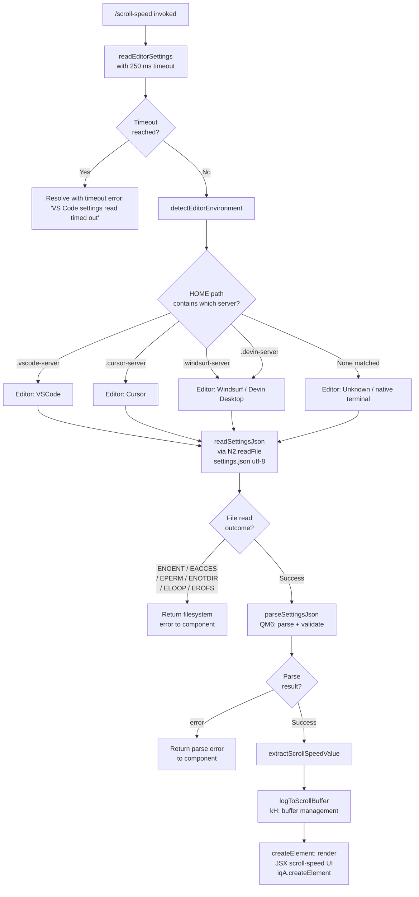

# `/scroll-speed`

> Analysis basis: CC v2.1.165 bundle.js (AST extraction + Claude interpretation)
> Minimum version: v2.1.165

---

## Overview

`/scroll-speed` is a local JSX command that adjusts the mouse wheel scroll speed within the Claude Code terminal UI. It operates by detecting the host editor environment (VS Code, Cursor, Windsurf, or Devin Desktop), reading that environment's `settings.json` file, and rendering a JSX component that allows the user to modify scroll sensitivity. The handler is asynchronous and includes a timed read of VS Code-family settings with a 250 ms timeout guard.

---

## Registration

| Field | Value |
|---|---|
| type | `local-jsx` |
| name | `scroll-speed` |
| description | `Adjust mouse wheel scroll speed` |
| module_id | `etq` |
| load_inline | `true` |
| loc_byte | `12233760` |
| loc_byte_end | `12234008` |
| loc_line | `8632` |
| arbor_handler.name | `Hkf` |
| arbor_handler.fqn | `claude-2.1.165::Hkf` |
| arbor_handler.kind | `AsyncFunction` |
| arbor_handler.resolution_path | `module_id` |
| arbor_handler.n_hits | `0` |

Analysis basis: CC v2.1.165 bundle.js:+12233760

---

## Input Branching

The command has 4+ distinct branches based on detected editor environment and settings-read outcome. A Mermaid flowchart is used.



Analysis basis: CC v2.1.165 bundle.js:+12233523 (handler entry), +12233532 (timeout value 250), +12233536 (timeout message), +4027852 (server path detection), +4032026 (file read), +176047–176116 (filesystem error codes)

---

## Behavioral Spec

### 1. Handler Entry — `scrollSpeedHandler` (`Hkf`)

```
async function scrollSpeedHandler(commandContext):
    settingsResult = await Promise.race([
        readEditorSettings(),          // resolves with parsed settings or error
        timeoutAfter(250)              // resolves with timeout sentinel after 250 ms
    ])
    clearTimeout(timeoutHandle)

    jsx = createElement(ScrollSpeedComponent, {
        settings: settingsResult
    })
    return jsx
```

Analysis basis: CC v2.1.165 bundle.js:+12233523 (`Hkf` → `yL`), +12233526 (`Hkf` → `EE_`), +12233594 (`iqA.createElement`)

---

### 2. Timeout Wrapper — `timedPromise` (`yL`)

```
function timedPromise(promise, ms):
    handle = setTimeout(resolve_sentinel, ms)   // ms = 250
    return Promise.race([promise, sentinelPromise])
    // on resolution: clearTimeout(handle)
```

The literal `0` at bundle.js:+2294159 is used as the initial timer handle sentinel.

Analysis basis: CC v2.1.165 bundle.js:+2294083 (`setTimeout`), +2294114 (`Promise.race`), +2294161 (`clearTimeout`), +12233532 (constant `250`)

---

### 3. Editor Environment Detection — `detectEditorEnvironment` (`sL8`)

The function inspects the home directory path (or a related environment path) for known server directory suffixes to identify the embedding editor:

```
function detectEditorEnvironment(homePath):
    if homePath.includes(".vscode-server"):
        return { name: "VSCode", display: "VS Code" }
    if homePath.includes(".cursor-server"):
        return { name: "cursor", display: "Cursor" }
    if homePath.includes(".windsurf-server"):
        return { name: "windsurf", display: "Windsurf" }
    if homePath.includes(".devin-server"):
        return { name: "windsurf", display: "Devin Desktop" }
    return { name: null, display: null }
```

Display-name string pairs observed: `"VSCode"` / `"vscode"`, `"Cursor"` / `"cursor"`, `"Devin Desktop"` / `"windsurf"`.

Analysis basis: CC v2.1.165 bundle.js:+4027852 (`H.includes`), +4027863 (`.vscode-server`), +4027893 (`.cursor-server`), +4027923 (`.windsurf-server`), +4027955 (`.devin-server`), +4032330 (`"VSCode"`), +4032315 (`"vscode"`), +4032358 (`"Cursor"`), +4032343 (`"cursor"`), +4032388 (`"Devin Desktop"`), +4032371 (`"windsurf"`)

---

### 4. Settings File Reader — `readEditorSettings` (`EE_`)

```
async function readEditorSettings(editorInfo):
    editorEnv = detectEditorEnvironment(homePath)
    settingsPath = path.join(..., "settings.json")
    raw = await fs.readFile(settingsPath, "utf-8")
    parsed = parseAndValidateSettings(raw)           // QM6
    validated = checkArrayShape(parsed)              // GE_
    logToBuffer(validated)                           // s1
    return bufferManagedResult(validated)            // kH
```

On any filesystem error (`ENOENT`, `EACCES`, `EPERM`, `ENOTDIR`, `ELOOP`, `EROFS`) the read rejects with an error object whose `code` field matches the standard POSIX error string.

Analysis basis: CC v2.1.165 bundle.js:+4031979 (`RpL`), +4031992 (`sL8`), +4032026 (`N2.readFile`), +4032038 (`hh.join`), +4032052 (`eL8`), +4032059 (`"settings.json"`), +4032086 (`"utf-8"`), +4032098 (`QM6`), +4032107 (`GE_`), +4032213 (`s1`), +4032219 (`kH`), +176047–176116 (error codes)

---

### 5. Settings Parser — `parseAndValidateSettings` (`QM6`)

```
function parseAndValidateSettings(rawText):
    if rawText.startsWith(BOM_or_prefix):
        rawText = rawText.slice(offset)
    parsed = JSON.parse / custom parse (via Ix)
    result = normalizeValue(parsed)                 // v
    stringified = String(result)
    if error_condition:
        return { status: "error", ... }
    return { status: "ok", value: result }
```

Analysis basis: CC v2.1.165 bundle.js:+1144075 (`Sc6`), +1144079 (`Ix`), +1143808 (`H.startsWith`), +1143831 (`H.slice`), +1144102 (`v`), +1144159 (`String`), +1144178 (`"error"`)

---

### 6. Log Buffer Manager — `logBufferManager` (`kH`)

```
function logBufferManager(entry):
    errorString = formatError(entry)       // HA / eH
    if telemetryMode != "no-telemetry" and != "essential-traffic":
        emitTelemetry("tengu_feature_sad") // on error path
    dequeueIfFull(buffer)                  // qW4: shift + push
    buffer.push(entry)                     // hBH.push
    if error:
        logger.logError(entry)             // Er.logError
    resolve via deferred (Dq / xSA)
```

Observed telemetry mode strings: `"essential-traffic"` (bundle.js:+1014267), `"no-telemetry"` (bundle.js:+1014326), `"default"` (bundle.js:+1014400).

Analysis basis: CC v2.1.165 bundle.js:+1015586 (`HA`), +1015599 (`eH`), +1015845 (`Dq`), +1015928 (`qW4`), +1015946 (`hBH.push`), +1015986 (`Er.logError`), +1010363 (`c`), +1010399 (`P6`)

---

### 7. Value Normalization — `normalizeInputValue` (`v`)

```
function normalizeInputValue(raw):
    if raw includes "debug" tag:
        handle debug path                  // f76
    normalize via icK
    if H.includes(platform_check):
        apply platform transform           // SH
    uppercase key portion                  // _.toUpperCase
    invoke J4(H.trim(value))
    resolve via VR / ppH
    apply acK transformation
    return normalized
```

Analysis basis: CC v2.1.165 bundle.js:+206051 (`"debug"`), +206075 (`f76`), +206093 (`icK`), +206115 (`H.includes`), +206133 (`SH`), +206177 (`_.toUpperCase`), +206197 (`J4`), +206200 (`H.trim`), +206216 (`VR`), +206222 (`ppH`), +206236 (`acK`)

---

## State & Side Effects

| Item | Detail |
|---|---|
| Telemetry | `tengu_feature_sad` — emitted on error path inside log buffer manager (bundle.js:+1010365) |
| Hook registration | None observed at depth ≤ 2 |
| appState changes | Scroll-speed preference persisted via JSX component interaction (rendered via `iqA.createElement`, bundle.js:+12233594) |
| File I/O | Reads `settings.json` from detected editor's server config directory (bundle.js:+4032026) |
| Timer | 250 ms `setTimeout` / `clearTimeout` pair guards the settings read (bundle.js:+12233532) |
| Error logging | `Er.logError` called on filesystem or parse failure (bundle.js:+1015986) |
| Sound | <!-- TODO: not found in depth-2 traversal; needs --depth 4 --> |

---

## Version History

| Version | Change |
|---|---|
| v2.1.165 | Initial analysis |

---

## Common Mistakes

1. **Expecting instant settings read**: The handler races the settings file read against a 250 ms timeout. If the editor settings file is on a slow or remote filesystem, the command will silently fall back to the timeout sentinel and the scroll-speed UI may render without pre-populated values.
2. **Running outside a supported editor**: The environment detection checks only for `.vscode-server`, `.cursor-server`, `.windsurf-server`, and `.devin-server` path segments. Running `/scroll-speed` in a native terminal (no embedded editor) means no editor-specific settings file is located; the component will still render but without settings context.
3. **Permission errors on settings.json**: If the user's `settings.json` is not readable (`EACCES`, `EPERM`, `EROFS`), the error is surfaced to the JSX component and logged via `Er.logError`. The command does not retry or escalate; the user must fix permissions manually.
4. **Telemetry suppression**: When `telemetryMode` is `"no-telemetry"` or `"essential-traffic"`, the `tengu_feature_sad` event is suppressed even on genuine errors, meaning error-rate metrics will be under-reported in restricted environments.

---

## Appendix — Identifier Mapping

> For bundle debugging only. Identifiers change across versions.

| Identifier | Role |
|---|---|
| `Hkf` | Main async handler for `/scroll-speed` (scrollSpeedHandler) |
| `yL` | Timeout-wrapping promise utility (timedPromise) |
| `EE_` | Editor settings file reader (readEditorSettings) |
| `RpL` | Path resolution helper used inside settings reader |
| `sL8` | Editor environment detector (detectEditorEnvironment) |
| `H` | Generic string/path argument variable used across helpers |
| `v` | Input value normalizer (normalizeInputValue) |
| `e$` | HTTP/fetch helper (used in bootstrap fetch call graph) |
| `Gw_` | String-splitting/parsing utility |
| `ZHH` | Set membership checker (c44.has wrapper) |
| `uj` | String replacement utility (H.replace wrapper) |
| `e1` | Deferred/promise constructor (D6H / Aq / eX) |
| `s6` | Sub-utility inside log buffer pipeline |
| `_` | Generic parameter variable (context-dependent) |
| `QM6` | Settings JSON parser and validator (parseAndValidateSettings) |
| `Ix` | Prefix/BOM stripper for raw JSON text |
| `GE_` | Array shape validator (Array.isArray wrapper) |
| `s1` | Logging sink dispatcher (v8 wrapper) |
| `v8` | Low-level log write function |
| `kH` | Log buffer lifecycle manager (logBufferManager) |
| `HA` | Error object formatter (Error + String) |
| `eH` | String coercion helper for error messages |
| `Dq` | Deferred resolver (xSA wrapper) |
| `xSA` | Inner deferred resolution helper |
| `qW4` | Ring-buffer shift/push manager for log entries |

---

Note: index built via Arbor fallback; some signals (telemetry, literals) may be missing — see arbor-fallback.js.