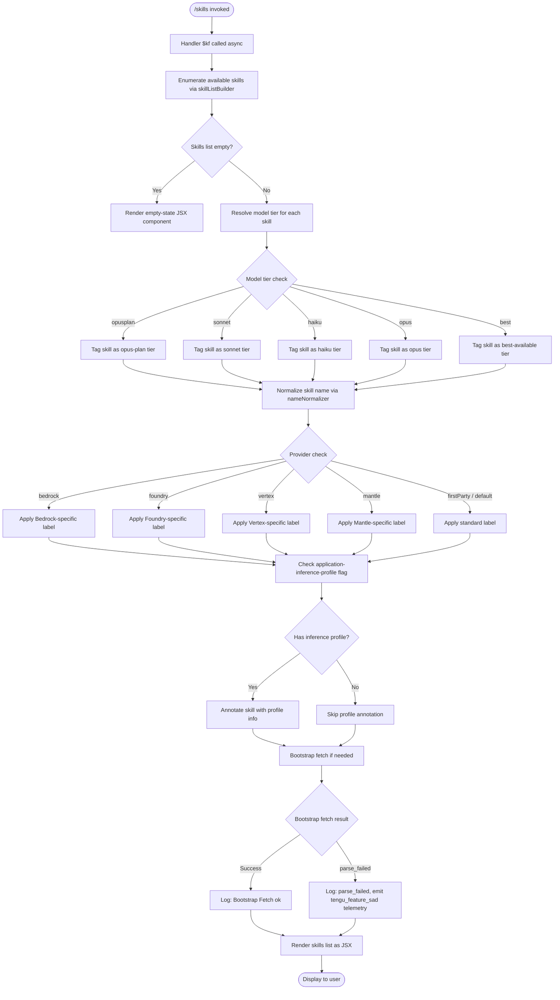

# `/skills`

> Analysis basis: CC v2.1.165 bundle.js (AST extraction + Claude interpretation)
> Minimum version: v2.1.165

---

## Overview

The `/skills` command lists the available skills (capabilities) registered in the current Claude Code session. It is a `local-jsx` command that executes immediately without requiring further user input, rendering its output as a JSX component rather than submitting a prompt to the model.

---

## Registration

| Field | Value |
|---|---|
| type | `local-jsx` |
| name | `skills` |
| description | `List available skills` |
| loc_byte | `12243494` |
| loc_byte_end | `12243626` |
| loc_line | `8632` |
| immediate | `true` |
| module_id | `jeq` |
| load_inline | `true` |
| arbor_handler.name | `$kf` |
| arbor_handler.fqn | `claude-2.1.165::$kf` |
| arbor_handler.kind | `AsyncFunction` |
| arbor_handler.resolution_path | `module_id` |
| arbor_handler.n_hits | `0` |

Analysis basis: CC v2.1.165 bundle.js:+12243494

---

## Input Branching

The command accepts no interactive user input (`immediate: true`). Internally, the handler branches over several states during skill enumeration and model-tier resolution. There are more than 3 distinct branching paths, so a Mermaid flowchart is used.



---

## Behavioral Spec

### Handler Entry (`$kf`)

The primary handler is the async function `$kf`, resolved via the `module_id` path (`jeq`) by Arbor. It is the sole top-level function invoked when `/skills` is triggered.

```
async function skillsCommandHandler():
    skillsList = await buildSkillsList()
    if skillsList is empty:
        return renderEmptyState()
    enrichedSkills = []
    for each skill in skillsList:
        tier      = resolveModelTier(skill)
        provider  = resolveProvider(skill)
        normName  = normalizeSkillName(skill.name)
        annotated = applyProviderLabel(normName, provider)
        if hasInferenceProfile(skill):
            annotated = addProfileAnnotation(annotated)
        enrichedSkills.append(annotated)
    return renderSkillsJSX(enrichedSkills)
```

Analysis basis: CC v2.1.165 bundle.js:+12243309, +12243383

---

### Skill List Builder (`a0` → `skillListBuilder`)

Assembles the list of available skills. It invokes the name-normalizer and the skill-entry formatter, then checks a membership set (`i1L`) to filter or categorize skills.

```
function buildSkillsList():
    rawSkills = fetchRawSkillEntries()       // calls skillEntryFormatter
    formatted = []
    for each entry in rawSkills:
        normalized = normalizeSkillName(entry)
        formatted  = formatSkillEntry(normalized, entry)
        if membershipSet.has(entry.id):
            formatted.category = "special"
        formatted.append(formatted)
    // Limit applied: up to 4 skill columns rendered (literal: 4)
    // Limit applied: up to 3 items per category row (literal: 3)
    return formatted
```

Analysis basis: CC v2.1.165 bundle.js:+2241350 (limit 4), +2241435 (limit 3), +2241422 (membership check)

---

### Name Normalizer (`Aq` → `nameNormalizer`)

Normalizes a raw skill or model name string for display. It trims whitespace, lower-cases, applies regex replacements, and classifies the name into a tier category.

```
function normalizeSkillName(rawName):
    trimmed   = rawName.trim()
    lowered   = trimmed.toLowerCase()
    replaced  = applyReplaceRules(lowered)       // _.replace calls
    tier      = classifyTier(replaced)
    return { displayName: replaced, tier: tier }
```

Tier classification checks (in order of evaluation):

| Tier keyword | loc_byte |
|---|---|
| `"opusplan"` | +2243249 |
| `"[1m]"` marker | +2243275 |
| `"sonnet"` | +2243290 |
| `"haiku"` | +2243329 |
| `"opus"` | +2243368 |
| `"best"` | +2243405 |

Analysis basis: CC v2.1.165 bundle.js:+2243153, +2243164, +2243192

---

### Provider Resolver (`XA` → `providerResolver`)

Determines which API provider backs a skill, mapping to one of five labels.

```
function resolveProvider(skill):
    providerTag = skill.providerTag
    switch providerTag:
        case "bedrock"    → return ProviderLabel.BEDROCK
        case "foundry"    → return ProviderLabel.FOUNDRY
        case "mantle"     → return ProviderLabel.MANTLE
        case "vertex"     → return ProviderLabel.VERTEX
        case "firstParty" → return ProviderLabel.FIRST_PARTY
        case "anthropicAws" → return ProviderLabel.ANTHROPIC_AWS
        case "gateway"    → return ProviderLabel.GATEWAY
        default           → return ProviderLabel.FIRST_PARTY
```

Analysis basis: CC v2.1.165 bundle.js:+2096653, +2096693, +2096743, +2096853, +2096901, +2097331, +2097348, +2097366, +2097386

---

### Bootstrap Fetch (`H` → `bootstrapFetcher`)

If skills data requires a remote bootstrap, a fetch is performed with a 5000 ms timeout. Successful responses are parsed as JSON; failures emit a log event and telemetry.

```
async function bootstrapFetcher(url):
    log("[Bootstrap] Fetching", url)           // literal at +15724583
    response = await fetch(url, {
        timeout: 5000,                         // literal at +15724784
        headers: {
            "Content-Type": "application/json",  // +15724668 / +15724683
            "User-Agent": <agent string>         // +15724702
        }
    })
    if response.ok:
        data = await response.json()
        log("[Bootstrap] Fetch ok")            // +15724957
        emit telemetry("api_bootstrap_fetch")  // +15724905
        return data
    else:
        emit telemetry("api_bootstrap_fetch", { status: "parse_failed" })  // +15724927
        return null
```

Analysis basis: CC v2.1.165 bundle.js:+15724581, +15724619, +15724715, +15724723, +15724754, +15724784, +15724902

---

### Skill Entry Formatter (`t1` → `skillEntryFormatter`)

Formats a single skill entry for display, applying string replacements and checking for the `application-inference-profile` flag.

```
function formatSkillEntry(skill):
    label = skill.label.toLowerCase()
    if label.includes("application-inference-profile"):  // +2241240
        label = applyInferenceProfileReplacement(label)
    if label.includes(<model family check>):             // +2241229
        label = applyFamilyReplacement(label)
    formatted = applyStringReplacements(label)           // uj / H.replace +2241284
    return { id: skill.id, label: formatted }
```

Analysis basis: CC v2.1.165 bundle.js:+2241197, +2241220, +2241229, +2241240, +2241280, +2241284

---

### Model Name Lookup (`tX` → `modelNameLookup`)

Checks a known list of versioned Claude model identifiers and returns the canonical display form. The known model strings observed in literals are:

| Model string | loc_byte |
|---|---|
| `claude-opus-4-8` | +2240215 |
| `claude-opus-4-7` | +2240272 |
| `claude-opus-4-6` | +2240329 |
| `claude-opus-4-5` | +2240386 |
| `claude-opus-4-1` | +2240443 |
| `claude-opus-4-0` | +2240532 |
| `claude-sonnet-4-6` | +2240564 |
| `claude-sonnet-4-5` | +2240625 |
| `claude-sonnet-4-0` | +2240720 |
| `claude-haiku-4-5` | +2240754 |
| `claude-3-7-sonnet` | +2240813 |
| `claude-3-5-sonnet` | +2240874 |
| `claude-3-5-haiku` | +2240935 |
| `claude-3-opus` | +2240994 |
| `claude-3-sonnet` | +2241047 |
| `claude-3-haiku` | +2241104 |

Analysis basis: CC v2.1.165 bundle.js:+2240188, +2240204, +2241152

---

### JSX Renderer (`$kf` → `aqA.createElement`)

The handler calls `aqA.createElement` directly to build the output component — consistent with the `local-jsx` command type. No agent prompt is sent to the model.

```
function renderSkillsJSX(enrichedSkills):
    if enrichedSkills.length == 0:
        return createElement(EmptySkillsComponent, {})
    rows = chunkIntoRows(enrichedSkills, columnCount=4)  // limit +2241350
    return createElement(SkillsListComponent, { rows: rows })
```

Analysis basis: CC v2.1.165 bundle.js:+12243309

---

## State & Side Effects

| Item | Detail |
|---|---|
| Telemetry | `tengu_feature_sad` (emitted on bootstrap parse failure; loc_byte +1010365); `api_bootstrap_fetch` (emitted on bootstrap fetch attempt; loc_byte +15724905) |
| Hook registration | None observed in depth-2 traversal |
| appState changes | None observed in depth-2 traversal |
| Bootstrap fetch | HTTP GET with `Content-Type: application/json`, `User-Agent` header, 5000 ms timeout (loc_byte +15724784) |
| Membership set check | `i1L.has(entry.id)` for skill categorization (loc_byte +2241422) |
| Sound | None observed in depth-2 traversal |
| Debug logging | `"debug"` log level used in provider resolution path (loc_byte +206051) |

---

## Version History

| Version | Change |
|---|---|
| v2.1.165 | Initial analysis |

---

## Common Mistakes

1. **Expecting a model response**: `/skills` is `immediate: true` and `local-jsx` — it renders output directly without sending any prompt to Claude. Do not wait for an assistant turn.
2. **Assuming all providers are shown**: Skills are filtered and labeled per provider (`bedrock`, `foundry`, `vertex`, `mantle`, `firstParty`, `gateway`). A skill may not appear if the active provider does not support it.
3. **Relying on exact model strings**: The list of recognized model names is hardcoded in the bundle. Models added after v2.1.165 may not be recognized by the name lookup and could display as raw identifiers.
4. **Expecting more than 4 columns**: The JSX renderer caps the column count at 4 (literal at bundle.js:+2241350). Layouts expecting wider grids will not render correctly.
5. **Ignoring the inference-profile annotation**: Skills backed by `application-inference-profile` receive additional label processing. Downstream tooling that parses `/skills` output should account for this suffix transformation.

---

## Appendix — Identifier Mapping

> For bundle debugging only. Identifiers change across versions.

| Identifier | Role |
|---|---|
| `$kf` | Main handler (AsyncFunction) for `/skills`; entry point resolved via module_id `jeq` |
| `a0` | Skill list builder; assembles and filters the full skills list |
| `Aq` | Name normalizer; trims, lowercases, and classifies skill/model names into tier |
| `H` | Bootstrap fetcher; performs remote HTTP fetch for skills data |
| `v` | Provider/debug log helper; routes log output by level |
| `e$` | Auxiliary function called from bootstrap fetcher (purpose: <!-- TODO: not found in depth-2 traversal; needs --depth 4 --> ) |
| `Gw_` | String parser utility; splits, trims, and slices strings (used in name parsing) |
| `ZHH` | Membership set checker; wraps `c44.has()` for set membership tests |
| `uj` | String replacement helper; applies regex/string replacements to labels |
| `e1` | Skill entry sub-processor; delegates to name normalizer and additional transforms |
| `s6` | Feature-sad telemetry emitter; fires `tengu_feature_sad` event |
| `_` | Generic string operand (context-dependent: `toLowerCase`, `toUpperCase`, `replace`) |
| `o0` | Normalization sub-step; delegates to `q4H` |
| `q4H` | String encoding/escaping helper; delegates to `eH` |
| `A` | String operand with `.toLowerCase` and `.replace` (model name context) |
| `f` | Connection/stream object with `.close` methods |
| `_4H` | Inclusion checker against a known-values array (`H4H.includes`) |
| `wI` | Model tier classifier; delegates to `gM` and `Z5` |
| `gM` | Provider tag resolver sub-function; calls `XA` |
| `Z5` | Secondary tier/provider resolver; calls `amH`, `D8L`, `N$1`, `Us6`, `XA` |
| `NQH` | Tier query helper; delegates to `Z5` |
| `NE` | Combined tier+provider resolver; calls `gM`, `Z5`, `XA` |
| `XA` | Provider resolver; maps provider tag strings to provider labels |
| `SX1` | Skill entry normalizer combiner; calls `NE` |
| `Pe6` | Inclusion check against allowed model list (`r1L.includes`) |
| `vQH` | Value converter; delegates to `eH` |
| `eH` | String converter; wraps `String()` constructor |
| `t1` | Skill entry formatter; applies model name lookup and string replacements |
| `Bs6` | Raw skill entries fetcher; iterates `Object.entries` |
| `e_` | Entry decoder; delegates to `DU` |
| `tX` | Model name lookup by known string list; applies `.toLowerCase`, `.includes`, `.replace` |
| `cQ8` | Auxiliary transform in skill entry formatting (purpose: <!-- TODO: not found in depth-2 traversal; needs --depth 4 --> ) |

---

Note: index built via Arbor fallback; some signals (telemetry, literals) may be missing — see arbor-fallback.js.