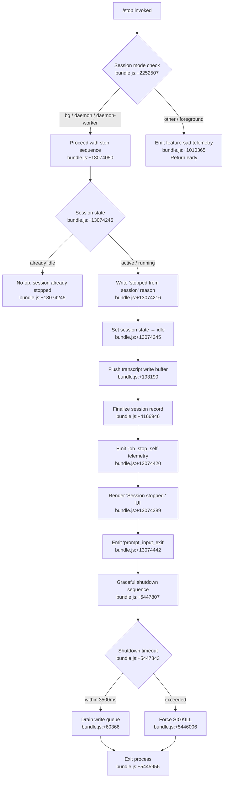

# `/stop`

> Analysis basis: CC v2.1.165 bundle.js (AST extraction + Claude interpretation)
> Minimum version: v2.1.165

---

## Overview

The `/stop` command terminates the current background session cleanly, emitting a `"stop_command"` telemetry event and setting the session state to `"idle"` while deliberately preserving the session transcript and any associated worktree on disk. It is an `immediate` command rendered as a local JSX component, meaning it executes synchronously without waiting for agent turn completion.

---

## Registration

| Field | Value |
|---|---|
| type | `local-jsx` |
| name | `stop` |
| description | Stop this background session; transcript and worktree are kept |
| loc_byte | `13074888` |
| loc_byte_end | `13075072` |
| loc_line | `9697` |
| immediate | `true` |
| module_id | `D5K` |
| load_inline | `true` |
| arbor_handler.name | `PBf` |
| arbor_handler.fqn | `claude-2.1.165::PBf` |
| arbor_handler.kind | `AsyncFunction` |
| arbor_handler.resolution_path | `module_id` |
| arbor_handler.n_hits | `0` |

Analysis basis: CC v2.1.165 bundle.js:+13074888

---

## Input Branching

The command exhibits four distinct execution paths based on session state and process context, warranting a Mermaid flowchart.



---

## Behavioral Spec

### 1. Handler Entry — `stopCommandHandler` (`PBf`)

The Arbor-resolved handler is the async function `PBf` (referred to here as `stopCommandHandler`). It is reached via `module_id` resolution on module `D5K`.

Analysis basis: CC v2.1.165 bundle.js:+13074607

```
async function stopCommandHandler(context):
    emit telemetry("tengu_bg_agent_action")          // +13074018
    render JSX component renderStopUI(context)
    await performSessionStop(context)
```

### 2. Session Mode Gate — `sessionModeRenderer` (`db8`)

Before any stop logic executes, the handler delegates to `db8` (referred to here as `sessionModeRenderer`), which first validates that the current session is operating in a background-capable mode.

Analysis basis: CC v2.1.165 bundle.js:+13074050

```
function sessionModeRenderer(context):
    mode = getSessionMode(context)         // checks "bg", "daemon", "daemon-worker"
    if mode not in ["bg", "daemon", "daemon-worker"]:
        emit telemetry("tengu_feature_sad")
        return earlyExitComponent()

    // Render stop action UI
    showLabel("stop")                      // literal "stop" at +13074053
    proceedWithStop(context)
```

String literals `"bg"`, `"daemon"`, and `"daemon-worker"` are found at bundle bytes `+2252507`, `+2252517`, `+2252531` respectively.

### 3. Stop Reason Recording — `recordStopReason` (within `db8`)

When a valid background session is found active, the implementation writes a human-readable stop reason before transitioning state.

Analysis basis: CC v2.1.165 bundle.js:+13074216

```
function recordStopReason(sessionRecord):
    sessionRecord.stopReason = "stopped from session"   // +13074216
    sessionRecord.targetState = "idle"                   // +13074245
    persistSessionRecord(sessionRecord)
```

### 4. Transcript & State Flush — `transcriptWriter` (`ppH` / `C2A`)

The transcript write helper (`ppH` → `C2A`) flushes any buffered content to the backing file descriptor before the session is finalized.

Analysis basis: CC v2.1.165 bundle.js:+206222, +193190

```
function flushTranscript(writeStream):
    pendingContent = collectPendingWrites()
    writeStream.write(pendingContent)         // H.write at +193190
    // Note: worktree is NOT removed; only session state is updated
```

### 5. Session Record Finalization — `sessionStateMapper` (`jY` / `$N`)

The session record is updated to one of the terminal states recognized by the background-session state machine.

Analysis basis: CC v2.1.165 bundle.js:+13074170, +4166946

Valid terminal state string literals found in this path:

| Literal | Byte offset |
|---|---|
| `"done"` | `+4166884` |
| `"success"` | `+4166897` |
| `"failed"` | `+4166914` |
| `"failure"` | `+4166929` |
| `"stopped"` | `+4166946` |
| `"active"` | `+4167065` |

For `/stop`, the transition targets `"stopped"` (bundle.js:+4166946).

```
function finalizeSessionState(sessionId, targetState):
    currentState = getSessionState(sessionId)   // $N / FwH at +4167006
    if currentState == "active":
        updateSessionState(sessionId, targetState)  // → "stopped"
```

### 6. Transcript Persistence — `transcriptPersistenceLoop` (`acK`)

A dedicated persistence loop (`acK`) manages the ongoing write pipeline, including directory creation, append-file operations, and rolling file compaction.

Analysis basis: CC v2.1.165 bundle.js:+205563

```
async function transcriptPersistenceLoop(config):
    clearTimeout(pendingTimer)              // $pH at +205563, clearTimeout at +59737
    dir = path.dirname(transcriptPath)      // KHH.dirname at +205596
    await ensureDirectory(dir)              // Zy.mkdir via ocK at +205317
    await appendFile(transcriptPath, data)  // Zy.appendFile at +205376

    // Rolling file management:
    stat = await Zy.stat(transcriptPath)    // a2A at +204917
    if stat.size exceeds threshold:
        compactFile(transcriptPath)         // Zy.rename at +205073, Zy.unlink at +205113

    // Size accounting:
    byteCount = Buffer.byteLength(data)     // at +205771
    notifyHook(byteCount)                   // j9 → zXA.register at +60323
```

The `.txt` file extension is used for transcript files (literal `".txt"` at bundle.js:+205021). A slice offset of `4` bytes is applied during compaction (number literal `4` at +205043).

### 7. Graceful Shutdown Sequencer — `gracefulShutdown` (`M9`)

After the session record is marked stopped, a graceful shutdown sequence is initiated. This is the most complex sub-flow, coordinating UI teardown, write-queue draining, and forced termination fallback.

Analysis basis: CC v2.1.165 bundle.js:+5447739

```
async function gracefulShutdown(exitCode):
    // Phase 1: UI teardown
    unmountUI()                              // JyH → H.unmount at +5445369
    writeSync(finalOutput)                   // AfH.writeSync at +5445291

    // Phase 2: Write queue drain with timeout
    drainTimeout = Math.max(calculated, 3500)  // literal 3500 at +5447843
    drainTimer = setTimeout(forcedKill, drainTimeout)
    drainTimer.unref()                       // QJH.unref at +5447852

    drainWriteQueue()                        // OpH → zXA.drain at +60366

    // Phase 3: Settle pending promises
    await Promise.race([
        Promise.allSettled(pendingOps),      // cZ9 at +5448081
        AbortSignal.timeout(2000)            // literal 2000 at +5448021
    ])

    // Phase 4: Session-end telemetry
    emit("session_end")                      // literal at +5448233

    clearTimeout(drainTimer)
    writeSync(postDrainOutput)               // AfH.writeSync at +5448303

    process.exit(exitCode)                   // $S_ at +5445956

function forcedKill():
    process.kill(process.pid, "SIGKILL")     // $S_ → process.kill at +5445981
```

The 2000 ms `AbortSignal.timeout` (bundle.js:+5448121) acts as a hard cap for awaiting pending operations before `process.exit` is called.

### 8. Session Status Summary Renderer — `sessionSummaryPrinter` (`MS_`)

Before the process exits, a session summary is printed to the terminal, including path information and config context.

Analysis basis: CC v2.1.165 bundle.js:+5445579

```
function printSessionSummary(session):
    workdir = getWorktreeDir()              // w06 → q.statSync at +13168284
    summaryLines = buildSummary(session)
    output = summaryLines.replaceAll("\\\\", "\\")   // literal at +5445667
                         .replaceAll("\\\"", "\"")   // literal at +5445690
    writeSync(output, dim style)            // AfH.writeSync at +5445748, j6.dim at +5445764
```

### 9. Bootstrap Fetch (Context Dependency — `bootstrapFetcher` / `H`)

The outer handler `H` performs a bootstrap API fetch before delegating to the stop logic. This is a shared infrastructure call, not stop-specific behavior.

Analysis basis: CC v2.1.165 bundle.js:+15724583

```
async function bootstrapFetcher(endpoint):
    log("[Bootstrap] Fetching")             // literal at +15724583
    response = await fetch(endpoint, {
        headers: {
            "Content-Type": "application/json",   // +15724668, +15724683
            "User-Agent": userAgentString          // +15724702
        },
        timeout: 5000                              // +15724784
    })
    if parse fails:
        emit("api_bootstrap_fetch", {status: "parse_failed"})  // +15724905, +15724927
    else:
        log("[Bootstrap] Fetch ok")         // +15724957
```

---

## State & Side Effects

| Item | Detail |
|---|---|
| Telemetry — `tengu_bg_agent_action` | Fired at handler entry (bundle.js:+13074018) |
| Telemetry — `tengu_feature_sad` | Fired when `/stop` is invoked outside a background session context (bundle.js:+1010365) |
| Telemetry — `tengu_feature_ok` | Fired on successful execution path (bundle.js:+1010222) |
| Telemetry — `tengu_bg_state_read_transient` | Fired when reading transient session state during transcript persistence (bundle.js:+4160428) |
| Telemetry — `tengu_daemon_config_reload` | Fired during supervisor config update cycle triggered by session teardown (bundle.js:+16149069) |
| Telemetry — `tengu_scroll_summary` | Fired during scroll/output summary rendering in the shutdown path (bundle.js:+5447125) |
| Telemetry — `tengu_pewter_brook` | Fired during fullscreen/terminal mode detection (bundle.js:+3440447) |
| Telemetry — `tengu_cache_eviction_hint` | Fired when context cache eviction is hinted during session end (bundle.js:+5448195) |
| Telemetry — `tengu_startup_perf` | Fired as part of startup profiling report path reached during worker teardown (bundle.js:+217090) |
| Literal event `"job_stop_self"` | Inline event string recorded in session log at +13074420 |
| Literal event `"prompt_input_exit"` | Inline event string recorded at session UI exit +13074442 |
| Literal event `"stop_command"` | Inline event string recorded at +13074621 |
| Literal event `"session_end"` | Written to session record at +5448233 |
| Session state transition | Active → `"stopped"` → `"idle"` (literals at +4166946, +13074245) |
| Transcript file | Flushed and retained on disk (`.txt` extension, +205021); worktree also retained per description |
| Write queue | Drained via `zXA.drain` before exit (+60366) |
| Hook registration | `zXA.register` called from transcript persistence loop (+60323) |
| Process exit | `process.exit` called after drain and settle (+5445956); fallback `SIGKILL` after 3500 ms (+5447843, +5446006) |
| Terminal display | `"Session stopped."` rendered in UI (+13074389) |
| `immediate` flag | `true` — command runs without waiting for active agent turn |

---

## Version History

| Version | Change |
|---|---|
| v2.1.165 | Initial analysis |

---

## Common Mistakes

1. **Invoking `/stop` in a foreground (non-background) session**: The command silently emits `tengu_feature_sad` and returns early without stopping anything. It is specifically designed for background (`bg`), `daemon`, and `daemon-worker` session modes only.
2. **Expecting the worktree to be cleaned up**: The registration description explicitly states "transcript and worktree are kept." The command stops the session process but does not delete files.
3. **Assuming synchronous completion**: Although `immediate: true` bypasses agent-turn waiting, the underlying handler is an `AsyncFunction`. The graceful shutdown involves a 3500 ms drain timeout and a 2000 ms `AbortSignal.timeout` for pending promises.
4. **Confusing `/stop` with process kill**: The command attempts a clean drain of the write queue before exiting. Hard `SIGKILL` is only sent as a last resort after the drain timeout expires.
5. **Using `/stop` during an active non-idle session expecting instant UI feedback**: The `"Session stopped."` message is displayed only after the state transition completes and transcript is flushed.

---

## Appendix — Identifier Mapping

> For bundle debugging only. Identifiers change across versions.

| Identifier | Role |
|---|---|
| `PBf` | Main stop command handler (`stopCommandHandler`) — async entry point |
| `H` | Bootstrap fetcher / outer session context provider |
| `v` | Inner session action dispatcher |
| `icK` | Session mode validator / dispatcher |
| `DXA` | Dispatch action helper |
| `SH` | JSON serializer helper |
| `J4` | Path/filename utility |
| `c2A` | Path mapping helper |
| `ppH` | Transcript write trigger |
| `C2A` | Transcript stream writer |
| `acK` | Transcript persistence loop coordinator |
| `$pH` | Debounced write scheduler (clearTimeout/setTimeout gating) |
| `d3H` | Transcript content assembler |
| `Q6` | Directory existence checker |
| `aL6` | File I/O abstraction layer |
| `s2A` | Transcript path builder |
| `a2A` | Transcript file stat/rotate handler |
| `ocK` | Append-file write executor |
| `j9` | Write-queue hook registrar |
| `Gw_` | Input string parser/splitter |
| `ZHH` | Session registry lookup |
| `uj` | String replacement utility |
| `e1` | Model/provider resolution entry |
| `D6H` | Model config resolver |
| `yd` | Model string parser |
| `Aq` | Model alias normalizer |
| `o0` | Model ID transformer |
| `_4H` | Model family classifier |
| `wI` | Model tier selector |
| `NQH` | Sonnet-tier model picker |
| `NE` | Primary model resolver |
| `SX1` | Model selection wrapper |
| `gM` | Provider type classifier |
| `Pe6` | Model list inclusion checker |
| `vQH` | Model error handler |
| `eX` | Model config expansion |
| `r0` | Full model resolution pipeline |
| `s6` | Feature telemetry wrapper (ok path) |
| `c` | Core telemetry emitter |
| `P6` | Telemetry event dispatcher |
| `Nu6` | Low-level telemetry sink |
| `db8` | Session mode renderer / stop action coordinator |
| `W6` | Secondary telemetry dispatcher |
| `S6` | Utility logger / string output |
| `uv` | Logger sink |
| `XBf` | Stop UI JSX component |
| `Z9` | Session mode string extractor |
| `GYH` | Session mode constants map |
| `e9` | Background session state reader |
| `R8` | Error code classifier |
| `v8` | ENOENT/EISDIR error guard |
| `tf` | File-not-found handler |
| `B6` | JSON parse wrapper |
| `jY` | Session state transition orchestrator |
| `$N` | Session state record updater |
| `FwH` | Session state constants |
| `ff` | Transcript checkpoint writer |
| `MY` | Atomic file writer (rename pattern) |
| `oj` | State map delete helper |
| `ke6` | Session stop event emitter (`"job_stop_self"`) |
| `$9H` | "Session stopped." UI message renderer |
| `hH` | `prompt_input_exit` event emitter |
| `M9` | Graceful shutdown sequencer |
| `K` | Active session map iterator |
| `L` | Tracked-promise set manager |
| `f` | Stream close / session finalize |
| `JyH` | UI unmount + final write helper |
| `DC` | Post-unmount cleanup |
| `U48` | Terminal cursor save/restore (ESC-7/ESC-8) |
| `MS_` | Session summary printer |
| `qE` | Summary line builder |
| `Lx` | Summary formatter |
| `w06` | Worktree path stat resolver |
| `g$` | Config path helper |
| `uZ9` | Summary truncation utility |
| `$S_` | Process exit / SIGKILL executor |
| `OpH` | Write queue drainer (`zXA.drain`) |
| `Y` | Supervisor / daemon manager |
| `C0H` | Config reload handler |
| `aLK` | Config key iterator |
| `E` | Remote-control event handler |
| `T` | Timer/heartbeat manager |
| `$mK` | Heartbeat scheduler |
| `V` | Secondary timer manager |
| `cZ9` | `Promise.allSettled` settle helper |
| `j76` | Startup profiling reporter |
| `Uc8` | Profiling data collector |
| `DWA` | Profiling report writer |
| `mO8` | Scroll/summary state serializer |
| `xZ9` | Scroll state accessor |
| `bZ9` | Scroll metrics calculator |
| `M1` | Local agent initializer |
| `Z46` | Cache eviction hint emitter |
| `pO8` | Pending operations settler |
| `l8` | Abort-aware timeout promise |