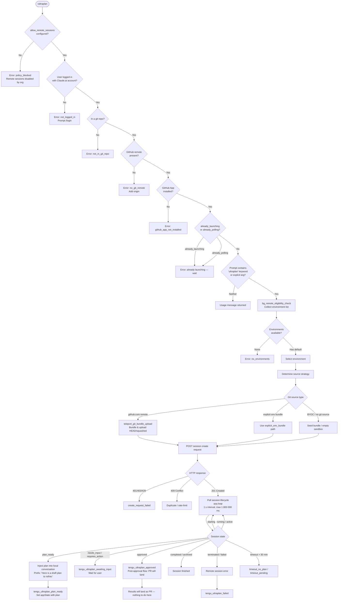

# `/ultraplan`

> Analysis basis: CC v2.1.165 bundle.js (AST extraction + Claude interpretation)
> Minimum version: v2.1.165

---

## Overview

`/ultraplan` launches a remote Claude Code session (via the "teleport" infrastructure) that drafts an editable, structured plan for the user's task on the Claude.ai web UI. The command validates a chain of preconditions (authentication, Git environment, remote-session policy, GitHub App installation), bundles and uploads the current repository state, creates a cloud session, polls its lifecycle, and — when the remote agent reaches the `plan_ready` state — injects the resulting plan back into the local CLI conversation for refinement. If any precondition fails or the session cannot be created, the command emits a descriptive error message and telemetry without modifying the conversation state.

---

## Registration

| Field | Value |
|---|---|
| type | `local-jsx` |
| name | `ultraplan` |
| description | `Draft an editable plan in Claude Code on the web ( ... ) · See  ...` |
| argumentHint | `<prompt>` |
| load_inline | `true` |
| load_ident | `ZIf` |
| loc_byte | `12214215` |
| loc_byte_end | `12214447` |
| loc_line | `8606` |
| arbor_handler.name | `ZIf` |
| arbor_handler.fqn | `claude-2.1.165::ZIf` |
| arbor_handler.kind | `AsyncFunction` |
| arbor_handler.resolution_path | `load_ident` |
| arbor_handler.n_hits | `1` |

Analysis basis: CC v2.1.165 bundle.js:+12214215

---

## Input Branching

The handler has well over three distinct decision branches (precondition failures, guard states, environment selection, source strategy, session lifecycle states). A Mermaid flowchart is used.



---

## Behavioral Spec

### Handler Entry — `ZIf` (main handler)

Analysis basis: CC v2.1.165 bundle.js:+12212355

```
async function ultraplanHandler(context):
    check precondition: allow_remote_sessions flag (literal "allow_remote_sessions", +12212376)
    if not allowed:
        return policy_blocked error

    call remoteEligibilityGuard(context)           // RN8
    call sessionLaunchOrchestrator(context, prompt) // FS6 → TIf → Wn
    read appState via _.getAppState()              // +12212690
    call notificationHelper(...)                   // y6
    call parallelSetupHelper(...)                  // _96
    write appState via _.setAppState(...)          // +12212912
```

---

### Precondition Check — `remoteEligibilityGuard` (RN8 / SN8 / Ha_)

Analysis basis: CC v2.1.165 bundle.js:+9927917

```
function remoteEligibilityGuard(context):
    // SN8 delegates to Ha_
    check if string starts with known guard prefix  // Ha_ → H.startsWith (+9926967)
    push guard entry onto internal queue            // q.push (+9927184)
    run matchAll regex (flags: "gi", +9927365) against prompt
    if q.some(...) matches guard condition:
        return existing guard result
    push result to output list M                    // M.push (+9927645)
    // literal "ultraplan" at +9927717 used as internal tag
    // RN8 also slices H (+9927945) and applies replace "$1$2" (+9928042)
    // truncation constant: 5 tokens (+9928065)
```

---

### Session Launch Orchestrator — `FS6`

Analysis basis: CC v2.1.165 bundle.js:+12209594

```
async function sessionLaunchOrchestrator(context, prompt):
    call remoteEligibilityGuard (W9) to validate preconditions
    check internal state "already_polling" (+12209853)
    check internal state "already_launching" (+12209871)
    if either set:
        emit tengu_ultraplan_create_failed (+12209631)
        return "already launching" message (+12208458)

    if prompt missing and keyword "ultraplan" not in message:
        return usage string:
            "Usage: /ultraplan <prompt>, or include 'ultraplan' anywhere in your prompt"
            (+12209918, +12209984)

    // Register task-notification hook (+12210623)
    launch remote session via GR8 → WR8 → D6
    subscribe to WIf channel (+12210228)
    call mainSessionLoop (TIf)
```

---

### Precondition Validator — `W9` (remoteSessionPreconditions)

Analysis basis: CC v2.1.165 bundle.js:+4178343

```
function remoteSessionPreconditions(context):
    call rL9 → WIH:
        check account type via TC:
            accepted types: "firstParty" (+4177841), "enterprise" (+4178114), "team" (+4178149)
        read config file via XX6 → nL9.readFileSync (encoding "utf-8", +4178222)
        validate git config via q7H:
            check A.some(...)
            check _.includes(...)
            call YcH for additional git checks

    check kBL.has(context) → if missing: call TC
    check yBL.has(context) → if missing: call Dq (xSA → eH)
    check allow_product_feedback flag (+4178415)
    call e4H (→ eH) for token validation
    call WIH for environment check
    check q.includes(...) for additional policy check
```

---

### Git Bundle Upload — `bl_` (teleportGitBundleUpload)

Analysis basis: CC v2.1.165 bundle.js:+9032500

Telemetry: `tengu_ccr_bundle_upload` (+9032822)

```
async function teleportGitBundleUpload(sessionParams):
    call b6 (base context)
    call F4, RH, S_ (git state helpers)

    if not in git repo:
        emit error "Not in a git repository" (+9032590)
        set result: empty_repo

    clean up seed refs:
        git update-ref -d refs/seed/stash (+9032681, +9032694)
        git update-ref -d refs/seed/root

    check for commits via:
        git for-each-ref --count=1 refs/ (+9032732, +9032747, +9032759)
    if no commits:
        return "Repository has no commits yet" (+9032940)

    run git stash create (+9033018, +9033026)
    verify HEAD via git rev-parse --verify HEAD (+9033370, +9033382, +9033393)
    if stash fails: set stash_failed (+9033467)

    create bundle file: ccr-seed<id>.bundle (+9033825, +9033836)
    attempt HEAD bundle upload → result: "head" (+9034502)
    if fails: attempt fallback HEAD → "fallback_head" (+9034541)
    if fails: attempt squashed bundle → "squashed" (+9034576)
    if fails: "fallback_squashed" (+9034619)

    if upload fails: set upload_failed (+9034281), emit tengu_ccr_bundle_upload
    on success: set success (+9034433)
    clean up: _86.unlink(bundleFile) (+9034777)
```

---

### Session Creation POST — `Wn` (teleportToRemote)

Analysis basis: CC v2.1.165 bundle.js:+9047799

```
async function teleportToRemote(params):
    // Phase: env-select (+9050819)
    check policy denial → "policy_denied" (+9047922)
    check first-party requirement → "not_first_party" (+9048057)
    check access token via kH:
        if missing: "no_access_token" (+9048395)
        token status logged as "set"/"unset" (+9048262, +9048268)
    get organization UUID via U1:
        if missing: "no_org_uuid" (+9048692)

    set headers:
        anthropic-beta: "ccr-byoc-2025-07-29" (+9048802)
        x-organization-uuid: <org uuid> (+9048824)

    // Phase: branch-detect (+9052622)
    call En7 to generate task title and branch name:
        model: claude/task (+9035882)
        branch name max length: 75 chars (+9035876)
        schema fields: title (string), branch (string) (+9036106, +9036114)
        telemetry: teleport_generate_title (+9036180)

    determine bundle mode (tengu_teleport_bundle_mode, +9049206):
        "too_large" | "bundle" | "explicit_env_bundle" | "git_repository" | "none"

    // Phase: bundle-upload (+9053758)
    run GitHub preflight check via ERH:
        result: github_preflight_ok (+9053238) | github_preflight_failed (+9053260)
        | ghes_optimistic (+9053298) | forced_bundle (+9053328) | no_github_remote (+9053356)

    determine teleport source decision (tengu_teleport_source_decision, +9054668)

    // Phase: POST-sent (literal at +9055806)
    _A.post(sessionCreateEndpoint, payload)
    handle HTTP responses:
        500 → error
        201 → success, extract session id
        401/403/429 → create_request_failed (+9050465)
        missing session id → malformed_response (+9050681)

    if BYOC no git source:
        log "[teleportToRemote] No repository detected — empty sandbox" (+9055070)

    auto-create default cloud environment if none:
        name: "Default" (+8998191)
        cloud type: anthropic_cloud (+8998631)
        home: /home/user (+8998737)
        python: 3.11 (+8998799, +8998816)
        node: 20 (+8998830, +8998845)
        if create fails: warn with onboarding URL (+9051084)

    emit tengu_ccr_session_link (+9042754)
```

---

### Session Poll Loop — `azq` (remoteSessionPoller)

Analysis basis: CC v2.1.165 bundle.js:+9127937

```
async function remoteSessionPoller(sessionId, options):
    poll interval: 1000 ms (+9129093)
    max duration: 1 800 000 ms (30 minutes) (+9129100)

    loop:
        GET session status
        parse last assistant message
        check session state:
            "starting"   → continue polling
            "running"    → continue polling
            "idle"       → continue polling
            "active"     → continue polling
            "hook_started" / "hook_progress" / "hook_response" → relay to local UI
            "SessionStart" → log start event
            "completed"  → extract result, break
            "archived"   → break
            "terminated" → error: "remote session returned an error" (+9131701)
            timeout >30m → error: "remote session exceeded 30 minutes" (+9131742)
            no plan output → "no review output — orchestrator may have exited early" (+9131779)

        dispatch control_request events (+9047389)
        handle set_permission_mode messages (+9047466)

    on cancel: _.isCancel check → return gracefully
    on AxiosError: _A.isAxiosError check → network_error / exception
```

---

### Plan Injection — `PIf` (planInjector) / `Vtq` (pollerWithTimeout)

Analysis basis: CC v2.1.165 bundle.js:+12205695

```
async function pollerWithTimeout(sessionId, timeoutMs):
    // timeout constant: 5400 seconds (+12205261) → 90 minutes total budget
    poll via Hv (taskStatusMonitor)

    on plan_ready (+12197277):
        emit tengu_ultraplan_plan_ready (+12205939)
        inject into local conversation:
            prefix text: "Here is a draft plan to refine:" (+12205568)
            followed by plan body from remote session

    on needs_input (+12197292):
        emit tengu_ultraplan_awaiting_input (+12205871)

    on approved (+12196899):
        emit tengu_ultraplan_approved (+12206347)
        append system message:
            "Results will land as a pull request when the remote session finishes.
             There is nothing to do here." (+12206837)

    on failed / terminated:
        emit tengu_ultraplan_failed (+12207224)
        append system message:
            "Remote Ultraplan session failed. Wait for the user's next instructions."
            (+12207635)

    on timeout_pending (+12197630) / timeout_no_plan (+12197648):
        report timeout in minutes (divisor: 60000 ms, +12197407)

    on network_or_unknown (+12196511):
        report "Lost connection to the remote session after repeated retries —
        the session may still be running" (+12196585)

    on extract_marker_missing (+12196845):
        report missing extraction marker

    timing: emit tengu_ultraplan_timeout_seconds (+12205227) at completion
    emit tengu_ultraplan_launched (+12211313) at successful start
```

---

### Main TIf Orchestration — `TIf`

Analysis basis: CC v2.1.165 bundle.js:+12210363

```
async function mainOrchestrator(context, prompt):
    call T2H → nzq (parallelSetup):
        call W9 (preconditions)
        push to results array
        call s6
        await Promise.all(...)
        call MT8, bR (context helpers)
        call XOq, e_ (state helpers)
        call fT8, wh (feature flags)
        call $T8, b6, F4 (config helpers)
        call ERH (GitHub app check)
        call hH, RH (notification helpers)

    call c (JSX render helper)
    call W6 → Nu6 (UI component factory)

    call WR8 → D6 (daemon session manager):
        checks yDH.has, eU.has, eU.get
        registers tw6.add
        calls B98, y6

    call wIf (session watchdog)

    call TIf sub-steps:
        iw → k_ (module initializer), Xv_ → lP6/vrL (UI state)
        L (lifecycle tracker)
        GIf (guard state)
        CRH (remote agent runner):
            Wk → BMK.randomBytes (random token, 8 bytes, +13256033)
            B66 → Gx8/w5A/d$/Ye.open (session file I/O)
            o2 → Date.now / d$ (timestamp helper)
            en7 → Hn_/v/String (status formatter)
            azq (poll loop)

        Hv (task status monitor):
            i8f (task_started event, +9906504)
            l8f (task_updated event, +9905621)
            r8f, o8f (timestamp/key monitors)
            p1H (active state tracker: user_typed/active/aborted)

        PIf (plan injector / poller with timeout)

    on unexpected error:
        emit tengu_ultraplan_create_failed
        append "Ultraplan hit an unexpected error during launch. Wait for the user's next instructions." (+12211892)
        detail: ". See --debug for details." (+12211102)

    on orphaned session detection:
        log "ultraplan: failed to archive orphaned session" (+12212040)

    display label "Ultraplan" (+12211477)
    invocation source tag: "slash" (+12212501)
    retry delay on conflict: 1500 ms (+12211662)
```

---

### GitHub App Installed Check — `ERH` (checkGithubAppInstalled)

Analysis basis: CC v2.1.165 bundle.js:+9000036

```
async function checkGithubAppInstalled(context):
    check access token via px:
        if missing: log "checkGithubAppInstalled: No access token found,
            assuming app not installed" (+8999666)
        return false

    check org UUID via U1:
        if missing: log "checkGithubAppInstalled: No org UUID found,
            assuming app not installed" (+8999779)
        return false

    call _A.get(githubAppCheckEndpoint)
    if _A.isAxiosError(error):
        if status == 400 (+9000437): treat as "is not" installed (+9000182)
        else: log error
    log: GitHub app "is" / "is not" (+9000177, +9000182) installed
    return boolean
```

---

## State & Side Effects

| Item | Detail |
|---|---|
| Telemetry — launch | `tengu_ultraplan_launched` (+12211313) |
| Telemetry — create failed | `tengu_ultraplan_create_failed` (+12209631) |
| Telemetry — plan ready | `tengu_ultraplan_plan_ready` (+12205939) |
| Telemetry — awaiting input | `tengu_ultraplan_awaiting_input` (+12205871) |
| Telemetry — approved | `tengu_ultraplan_approved` (+12206347) |
| Telemetry — failed | `tengu_ultraplan_failed` (+12207224) |
| Telemetry — timeout seconds | `tengu_ultraplan_timeout_seconds` (+12205227) |
| Telemetry — prompt identifier | `tengu_ultraplan_prompt_identifier` (+12205394) |
| Telemetry — eligibility check | `tengu_ccr_bundle_seed_enabled` (+9121047) |
| Telemetry — bundle upload | `tengu_ccr_bundle_upload` (+9032822) |
| Telemetry — bundle mode | `tengu_teleport_bundle_mode` (+9049206) |
| Telemetry — session link | `tengu_ccr_session_link` (+9042754) |
| Telemetry — source decision | `tengu_teleport_source_decision` (+9054668) |
| Telemetry — bg dispatch | `tengu_bg_dispatch_sigkill_escalate`, `tengu_bg_dispatch_low_mem` |
| Telemetry — background session | `tengu_bg_spare_enable`, `tengu_bg_spare_claim`, `tengu_bg_spare_claim_fail` |
| Telemetry — daemon session | `tengu_bg_dispatch_sigkill_escalate`, `daemon_bg_session_create` |
| Telemetry — title generation | `teleport_generate_title` |
| Telemetry — environments list | `teleport_environments_list` |
| Telemetry — env create | `teleport_default_environment_create` |
| Hook registration | `task-notification` hook registered (+12210623); `j9` calls `zXA.register` (+60323) |
| appState changes | Reads via `_.getAppState()` (+12212690); writes via `_.setAppState(...)` (+12212912); plan result injected as conversation message |
| File I/O | Git bundle file written to temp path `ccr-seed<id>.bundle`, deleted after upload (+9034777); `_86.unlink`; session seed file `_source_seed.bundle` (+9034132) |
| Network | `_A.post` to session create endpoint; `_A.get` for GitHub App check and environment list; `XB8.connect` for daemon socket |
| Sound | <!-- TODO: not found in depth-2 traversal; needs --depth 4 --> |
| Guard state | `already_launching` / `already_polling` checked and set to prevent duplicate invocations |

---

## Version History

| Version | Change |
|---|---|
| v2.1.165 | Initial analysis |

---

## Common Mistakes

1. **Running without a Claude.ai login**: `/ultraplan` requires OAuth authentication with a Claude.ai account, not just an Anthropic API key. API-key-only sessions will fail with `not_logged_in`. Run `/login` first.
2. **Running outside a Git repository**: A Git repository is mandatory for non-BYOC sessions. The command will reject with `not_in_git_repo` if no `.git` directory is detected.
3. **No GitHub remote configured**: Even with a local Git repo, a GitHub remote (`origin`) is required. Add one with `git remote add origin <REPO_URL>` before invoking.
4. **GitHub App not installed**: The Anthropic GitHub App must be installed on the repository's organization/owner. If missing, the command fails at the `github_app_not_installed` precondition.
5. **Omitting the prompt**: Calling `/ultraplan` with no argument and without the word "ultraplan" appearing in the surrounding conversation will return the usage string instead of launching a session. Always supply `<prompt>`.
6. **Invoking while a session is already launching**: The guard `already_launching` / `already_polling` prevents concurrent launches. Wait for the current session to complete or fail before retrying.
7. **Organisation policy block**: In enterprise or team environments, an administrator may have disabled `allow_remote_sessions`. The command will return a `policy_blocked` error; contact your organisation admin.
8. **Repository with no commits**: An empty repository (no commits yet) will fail at the bundle-upload phase with `empty_repo`. Commit at least one change (`git add . && git commit -m "initial"`) before running `/ultraplan`.

---

## Appendix — Identifier Mapping

> For bundle debugging only. Identifiers change across versions.

| Identifier | Role |
|---|---|
| `ZIf` | Main async handler for `/ultraplan` (entry point) |
| `RN8` | Remote eligibility guard dispatcher |
| `SN8` | Guard inner executor |
| `Ha_` | Guard string-matching and queue logic |
| `W9` | Remote session precondition validator |
| `rL9` | Account-type resolution helper |
| `WIH` | Config/environment reader (reads file, calls TC, XX6, q7H) |
| `TC` | Account type classifier ("firstParty"/"enterprise"/"team") |
| `XX6` | Config file reader (readFileSync, utf-8) |
| `q7H` | Git config validator |
| `Dq` | Token/credential fetcher |
| `xSA` | Credential string builder |
| `eH` | String normalisation utility |
| `e4H` | Token presence checker |
| `C5H` | Context state accessor |
| `FS6` | Session launch orchestrator (state guard + dispatch) |
| `W6` | UI component factory wrapper |
| `Nu6` | Base UI component constructor |
| `L` | Lifecycle / in-flight request tracker (add/delete/finally) |
| `Rtq` | Result emitter helper |
| `GR8` | Daemon session manager facade |
| `WR8` | Daemon session manager core |
| `D6` | Background session slot allocator |
| `wIf` | Session watchdog / heartbeat |
| `TIf` | Main orchestration shell (renders UI, drives sub-steps) |
| `T2H` | Parallel setup coordinator |
| `nzq` | Parallel setup executor (Promise.all fan-out) |
| `XIf` | Plan text assembler (push/join) |
| `JIf` | Plan section formatter |
| `Wn` | teleportToRemote — remote session creation and environment selection |
| `b6` | Git base-context builder |
| `Z7` | Config path resolver |
| `S3` | Bw_ config helper |
| `Ul_` | URL / endpoint builder |
| `kH` | Access-token retriever with error logging |
| `px` | API URL builder (local/staging/prod) |
| `U1` | Organisation UUID retriever |
| `gj` | Axios header builder (anthropic-version, anthropic-client-platform) |
| `bl_` | teleportGitBundleUpload — git stash + bundle + upload |
| `S6` | Logger / trace helper |
| `v` | Log-level formatter (debug/warn/error) |
| `P6` | Nu6-based UI primitive |
| `bR` | Git remote URL getter (runs `git config --get remote.origin.url`) |
| `Dzq` | Control-request event builder (randomUUID) |
| `pN6` | Polling state flag setter |
| `SH` | JSON serialiser wrapper |
| `Yzq` | CCR session link emitter |
| `fT8` | Feature-flag reader |
| `_t` | teleport_environments_list fetcher |
| `a66` | teleport_default_environment_create handler |
| `EH` | Error message extractor (String coercion) |
| `$` | Conversation message list accessor |
| `En7` | Title + branch name generator (calls model via k.object/k.string schema) |
| `wh` | Tool/feature permission gate (checks yDH, tw6, B98) |
| `ERH` | checkGithubAppInstalled — GitHub App installation verifier |
| `ov` | Default branch detector (symbolic-ref, show-ref, main/master) |
| `e1` | Conversation message appender |
| `CHH` | Git remote URL parser (scheme detection: https/http) |
| `s` | MCP update applier / pending-state tracker |
| `HA` | Generic error wrapper |
| `jz` | Cancellation checker |
| `BO` | Abort signal broadcaster |
| `iw` | Module initialiser (k_ + Xv_) |
| `k_` | Core module bootstrap (FGH, JF8, Tu6, Zu6, OpK, fwA) |
| `Xv_` | UI state bridge (lP6, vrL) |
| `GIf` | Guard/lock state accessor |
| `CRH` | Remote agent runner (random token, session file, poller) |
| `Wk` | Random-bytes token generator |
| `B66` | Session file opener (Gx8, w5A, d$, Ye.open) |
| `o2` | Session timestamp helper |
| `en7` | Session status string formatter |
| `azq` | remoteSessionPoller — long-poll loop (1 s / 30 min) |
| `Hv` | Task status monitor (i8f/l8f/r8f/o8f/p1H) |
| `i8f` | task_started event handler |
| `l8f` | task_updated event handler |
| `ro_` | Poll result router |
| `r8f` | Timestamp-based poll handler |
| `o8f` | Object-key-based poll handler |
| `p1H` | Active-state tracker (user_typed/active/aborted) |
| `PIf` | planInjector — injects plan text into local conversation |
| `Vtq` | pollerWithTimeout — drives PIf with 90-minute outer budget |
| `YIf` | D6 slot wrapper |
| `EIf` | Plan extraction helper |
| `_v6` | Session file cleanup (unlink) |
| `K` | Column padding formatter (padEnd + map) |
| `pm` | Post-plan message sender |
| `j9` | Hook registration (zXA.register) |
| `WIf` | Subscription channel handler |
| `y6` | Notification dispatcher (Q6, eT, kX_, bDH) |
| `Q6` | Notification queue accessor |
| `kX_` | Notification key builder |
| `bDH` | Config file reader with backup logic |
| `B6` | JSON.parse wrapper |
| `Ix` | Path prefix stripper (startsWith / slice) |
| `v8` | Version/metadata accessor |
| `Or1` | Backup directory resolver |
| `bX_` | Path join helper (UD.join + a8) |
| `w` | Background subprocess manager (spawn/kill/SIGKILL) |
| `l8` | Timeout-with-abort helper |
| `RH` | Notification "ok" feature reporter |
| `hH` | Notification "bad" feature reporter |
| `vb8` | Memory threshold checker (macOS freemem, 1024 MB) |
| `zX6` | Config file list reader (readFile + filter) |
| `g` | Background process lifecycle manager (kill/SIGTERM/retry) |
| `VDA` | Daemon socket connector (Fg.claim, XB8.connect) |
| `hDA` | Daemon session adopter (roster entry, WD.rm/unlink) |
| `D` | Forced-shutdown handler (process.exit, z.abort) |
| `F` | Disposable resource handle |
| `WTL` | File watcher (a98.watchFile/unwatchFile) |
| `No` | Watch-event debouncer |
| `_96` | Parallel context setup (bR, wh, F4, b6, eH, ERH) |