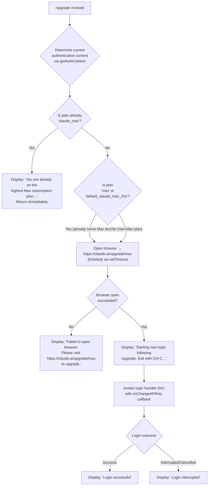

# `/upgrade`

> Analysis basis: CC v2.1.165 bundle.js (AST extraction + Claude interpretation)
> Minimum version: v2.1.165

---

## Overview

The `/upgrade` command guides the user through upgrading their Claude account to the Max subscription tier, which provides higher API rate limits and increased access to the Opus model family. It first inspects the current authentication context to determine whether an upgrade is applicable, and if so opens the browser to the Claude Max upgrade page and optionally initiates a fresh login flow to bind the new subscription.

---

## Registration

| Field | Value |
|---|---|
| type | `local-jsx` |
| name | `upgrade` |
| description | Upgrade to Max for higher rate limits and more Opus |
| module_id | `LLA` |
| load_inline | `true` |
| loc_byte | `12701740` |
| loc_byte_end | `12701987` |
| loc_line | `9080` |
| arbor_handler.name | `zR6` |
| arbor_handler.fqn | `claude-2.1.165::zR6` |
| arbor_handler.kind | `AsyncFunction` |
| arbor_handler.resolution_path | `module_id` |
| arbor_handler.n_hits | `0` |

Analysis basis: CC v2.1.165 bundle.js:+12701740

---

## Input Branching

The command exhibits four distinct runtime branches based on the current account subscription state and the outcome of the browser/login flow. A Mermaid flowchart is used.



Analysis basis: CC v2.1.165 bundle.js:+12700785, +12700871, +12700896, +12701015, +12701101, +12701116, +12701266, +12701269, +12701302, +12701341, +12701437, +12701460, +12701479, +12701533

---

## Behavioral Spec

### 1. Handler Entry — `upgradeCommandHandler` (`zR6`)

The top-level handler is an `AsyncFunction` resolved via the `module_id` path (`LLA → zR6`).

```
async function upgradeCommandHandler(commandContext):
    authContext = await getAuthContext()          // ZA → zY pipeline
    currentPlan = authContext.plan

    if currentPlan == "claude_max":
        displayMessage(ALREADY_MAX_MESSAGE)
        return

    // Attempt to open the upgrade URL in the system browser
    browserOpened = await openBrowserURL("https://claude.ai/upgrade/max")  // hK

    if not browserOpened:
        displayMessage("Failed to open browser. Please visit "
                       "https://claude.ai/upgrade/max to upgrade.")
        return

    // Announce the new login sequence and wait briefly before starting
    displayJSXComponent(upgradeUIElement)
    displayMessage("Starting new login following /upgrade. "
                   "Exit with Ctrl-C to use existing account.")

    setTimeout(async () => {
        loginResult = await runLoginFlow(onChangeAPIKey)  // hK → C8 / S_ / kH
        if loginResult.success:
            displayMessage("Login successful")
        else:
            displayMessage("Login interrupted")
    }, delay)
```

Analysis basis: CC v2.1.165 bundle.js:+12700785, +12700797, +12700957, +12701101, +12701266, +12701302, +12701437, +12701456, +12701512

---

### 2. Authentication Context Resolution — `getAuthContext` (`ZA → zY`)

```
async function getAuthContext():
    rawContext = await resolveAuthProvider()    // zY
    plan       = extractPlanFromContext(rawContext)
    authType   = classifyAuthType(rawContext)   // nR checks array membership
    return { plan, authType, rawContext }
```

Key plan strings checked:
- `"max"` (bundle.js:+12700871)
- `"default_claude_max_20x"` (bundle.js:+12700896)
- `"claude_max"` (bundle.js:+12701015)

The auth type classifier (`nR`) uses `Array.isArray` and `H.includes` to determine whether the resolved auth falls into recognised categories such as `"user_oauth"` (bundle.js:+2996179), `"profile-implicit"` (bundle.js:+2996106), or `"claude-desktop-3p"` (bundle.js:+2995637).

Provider type is also checked against known cloud backends:
- `"bedrock"` (bundle.js:+2096693)
- `"foundry"` (bundle.js:+2096743)
- `"anthropicAws"` (bundle.js:+2096799)
- `"mantle"` (bundle.js:+2096853)
- `"vertex"` (bundle.js:+2096901)
- `"firstParty"` (bundle.js:+2096910)

Analysis basis: CC v2.1.165 bundle.js:+3017466, +3017487, +2997115, +2997234

---

### 3. OAuth Profile Fetch — `fetchOAuthProfile` (`fYH`)

```
async function fetchOAuthProfile(token):
    headers = {
        "Content-Type": "application/json"
    }
    try:
        response = await httpGet(profileEndpoint, headers, timeout=10000)
        emitTelemetry("oauth_profile_fetch")
        return response.data
    catch error:
        emitTelemetry("oauth_profile_token_failed")
        logError("error", error)
        return null
```

Timeout: 10 000 ms (bundle.js:+2103533)  
Telemetry events: `oauth_profile_fetch` (bundle.js:+2103549), `oauth_profile_token_failed` (bundle.js:+2103616)

Analysis basis: CC v2.1.165 bundle.js:+12700957, +2103389, +2103443, +2103490, +2103505, +2103533, +2103546, +2103591, +2103646, +2103716

---

### 4. Browser Open — `openURL` (`hK`)

```
async function openURL(url):
    validate url starts with "http:" or "https:"  // BY7 guard
    platform = process.platform
    if platform == "darwin":
        spawn("open", [url])
    elif platform == "win32":
        spawn("rundll32", ["url,OpenURL", url])
    else:
        spawn("xdg-open", [url])                  // Linux / other POSIX
    return success
```

The URL opened for upgrades is `"https://claude.ai/upgrade/max"` (bundle.js:+12701269).  
Platform strings: `"darwin"` (bundle.js:+6804356), `"win32"` (bundle.js:+6804372).  
System commands: `"rundll32"` / `"url,OpenURL"` (bundle.js:+6804456, +6804468), `"open"` (bundle.js:+6804530), `"xdg-open"` (bundle.js:+6804537).

Analysis basis: CC v2.1.165 bundle.js:+12701266, +6804284, +6804047, +6804069, +6804356, +6804372, +6804456, +6804530, +6804537

---

### 5. Login Flow — `runLoginFlow` (`C8 → S_`)

```
async function runLoginFlow(onChangeAPIKey):
    session = await initAuthSession()        // bTH with many sub-handlers
    result  = await awaitSessionCompletion(session)
    if result.ok:
        await persistCredentials(result)
        onChangeAPIKey(result.apiKey)        // notifies parent context
        return { success: true }
    else:
        return { success: false }
```

The session initialisation (`bTH`) wires numerous lifecycle callbacks (bind patterns visible at bundle.js:+1090843, +1090882) and can emit `Promise.reject` on failure (bundle.js:+1090615).  
A forced-shutdown path exists via `process.exit` under `D` (bundle.js:+16166966) for catastrophic failures, guarded by the message `"forced shutdown"` (bundle.js:+16166947).

Analysis basis: CC v2.1.165 bundle.js:+12701266, +12701512, +6804405, +1094770, +1095276, +1090449, +1090615

---

### 6. Already-on-Max Guard

```
if currentPlan == "claude_max":
    displayMessage(
        "You are already on the highest Max subscription plan. "
        "For additional usage, run /login to switch to an API "
        "usage-billed account."
    )
    return   // command terminates here; no browser open, no login
```

Full message literal at bundle.js:+12701116.

---

## State & Side Effects

| Item | Detail |
|---|---|
| Telemetry — `tengu_feature_ok` | Emitted on successful feature gate check (bundle.js:+1010222) |
| Telemetry — `tengu_feature_sad` | Emitted on failed feature gate check (bundle.js:+1010365) |
| Telemetry — `oauth_profile_fetch` | Emitted after a successful OAuth profile HTTP request (bundle.js:+2103549) |
| Telemetry — `oauth_profile_token_failed` | Emitted when the OAuth profile fetch fails (bundle.js:+2103616) |
| Telemetry — `api_bootstrap_fetch` | Emitted during bootstrap API fetch used by auth resolution (bundle.js:+15724905) |
| Browser launch | Opens `https://claude.ai/upgrade/max` via platform-native command (`open` / `rundll32` / `xdg-open`) |
| `onChangeAPIKey` callback | Invoked on successful login to propagate new credentials into app state (bundle.js:+12701437) |
| `setTimeout` scheduling | Login flow is deferred by a brief delay after the upgrade URL is opened (bundle.js:+12701101) |
| JSX render | A JSX element is created via `KLA.createElement` to surface status messaging in the TUI (bundle.js:+12701302) |
| Transcript / log write | `C2A` calls `H.write` — may append to the session transcript (bundle.js:+193190) |
| File-rotation side effect | `a2A` can call `Zy.rename` / `Zy.unlink` for log rotation during session init (bundle.js:+205073, +205113) |

---

## Version History

| Version | Change |
|---|---|
| v2.1.165 | Initial analysis |

---

## Common Mistakes

1. **Running `/upgrade` when already subscribed to `claude_max`** — The command exits immediately with an informational message and does not open a browser or start a login flow. Use `/login` instead to switch to an API-billed account.
2. **No browser available (headless/SSH environment)** — The command will display a fallback message (`"Failed to open browser. Please visit https://claude.ai/upgrade/max to upgrade."`) but will not open the URL; the user must visit the link manually.
3. **Interrupting the login flow with Ctrl-C** — This produces a `"Login interrupted"` message and leaves the account unchanged. The existing credentials remain in use.
4. **Expecting instant credential propagation** — The login flow is scheduled via `setTimeout`, so there is a short delay between the browser opening and the login prompt appearing in the TUI.
5. **Confusing `max` / `default_claude_max_20x` with `claude_max`** — The already-on-Max guard only triggers for the `"claude_max"` plan string; the intermediate Max plan identifiers (`"max"`, `"default_claude_max_20x"`) still proceed through the upgrade flow.

---

## Appendix — Identifier Mapping

> For bundle debugging only. Identifiers change across versions.

| Identifier | Role |
|---|---|
| `zR6` | Top-level upgrade command handler (`AsyncFunction`) |
| `ZA` | Auth context orchestrator (calls `zY` + `nR`) |
| `zY` | Auth provider resolver (builds full context from raw token data) |
| `L4` | Low-level config/settings reader |
| `eH` | Error formatting / wrapping utility |
| `Bj` | Auth profile builder (assembles profile from provider + flags) |
| `ns6` | Token normalisation helper |
| `JcH` | Header/field extraction helper |
| `vU` | OAuth token file-descriptor reader (`CLAUDE_CODE_OAUTH_TOKEN_FILE_DESCRIPTOR`) |
| `lV` | Flag-settings loader |
| `nR` | Auth-type classifier (uses `Array.isArray` + `H.includes`) |
| `Z7` | Provider-type checker (bedrock / foundry / vertex etc.) |
| `XA` | Provider-type string mapper |
| `pX` | Profile priority resolver |
| `DO` | Auth environment variable reader (`ANTHROPIC_API_KEY` etc.) |
| `Hw6` | API key helper loader |
| `HpH` | VS Code integration check (`claude-vscode`) |
| `zO6` | API key file-descriptor reader (`CLAUDE_CODE_API_KEY_FILE_DESCRIPTOR`) |
| `y6` | Session timestamp / metadata recorder |
| `iR` | Array slice helper (depth-20 limiter) |
| `Aw6` | Alternate header builder |
| `fYH` | OAuth profile fetch orchestrator |
| `U1` | OAuth URL builder / endpoint selector |
| `KvA` | Base OAuth URL resolver |
| `o74` | Environment-specific OAuth endpoint selector |
| `hH` | Feature-OK telemetry emitter |
| `c` | Core telemetry emit primitive |
| `P6` | Telemetry event dispatch |
| `Nu6` | Telemetry queue flusher |
| `s6` | Feature-sad telemetry emitter |
| `BO` | HTTP client (axios) instance |
| `v` | HTTP request executor with debug logging |
| `icK` | Request retry / error-classification wrapper |
| `DXA` | HTTP error code handler |
| `H` | Bootstrap API fetch (User-Agent, 5 000 ms timeout) |
| `e$` | Bootstrap config parser |
| `Gw_` | Header string splitter / trimmer |
| `ZHH` | Cached-response checker |
| `uj` | URL sanitiser (replace sensitive params) |
| `e1` | Response body parser |
| `SH` | JSON.stringify wrapper |
| `J4` | Path redaction helper (`[REDACTED]`) |
| `c2A` | Stdout/stream writer |
| `ppH` | Output write dispatcher |
| `C2A` | Raw stream `H.write` wrapper |
| `acK` | Session log / transcript manager |
| `$pH` | Buffered write scheduler (clearTimeout / setTimeout / setImmediate) |
| `d3H` | Log chunk assembler |
| `Q6` | Log directory path resolver |
| `aL6` | Log file path builder |
| `s2A` | Log file name generator |
| `a2A` | Log file rotator (stat / rename / unlink) |
| `ocK` | Log file appender (mkdir / appendFile) |
| `j9` | Shutdown hook registrar (`zXA.register`) |
| `kH` | Conversation history manager (push/shift queue) |
| `HA` | Error string coercer |
| `Dq` | History deduplication helper |
| `xSA` | History entry formatter |
| `qW4` | History ring-buffer manager (shift / push) |
| `hK` | Browser open + login flow coordinator |
| `BY7` | URL protocol validator (http/https guard) |
| `FY` | Browser spawn result handler |
| `C8` | Login session entry point |
| `S_` | Login session lifecycle manager |
| `bTH` | Auth session initialiser (binds many lifecycle callbacks) |
| `D` | Forced-shutdown handler (`process.exit`) |
| `bG4` | Shutdown message formatter |
| `K$` | Post-login credential persister |
| `v8` | Secure credential storage writer |
| `b6` | Async-local-storage context accessor |
| `bd6` | Store-context reader (`Cd6.getStore`) |
| `X_` | UV async handle initialiser |

---

Note: index built via Arbor fallback; some signals (telemetry, literals) may be missing — see arbor-fallback.js.