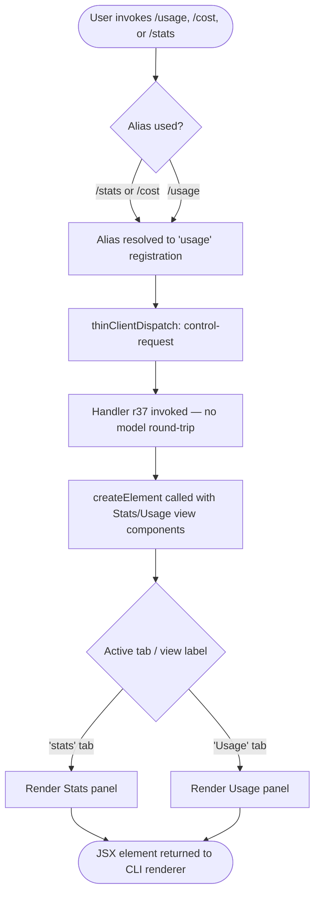

# `/usage`

> Analysis basis: CC v2.1.132 bundle.js (AST extraction + Claude interpretation)
> Minimum version: v2.1.132

---

## Overview

The `/usage` command (also invocable as `/cost` or `/stats`) renders a JSX panel displaying session-level cost, plan usage, and activity statistics for the current Claude Code session. It is a `local-jsx` command, meaning it resolves entirely on the client side and returns a rendered React element rather than sending a prompt to the model. The command dispatches via the `control-request` thin-client path, keeping it outside the normal agent turn cycle.

---

## Registration

| Field | Value |
|---|---|
| type | `local-jsx` |
| name | `usage` |
| description | `Show session cost, plan usage, and activity stats` |
| aliases | `cost`, `stats` |
| thinClientDispatch | `control-request` |
| module_id | `c7q` |
| load_inline | `true` |
| handler | `r37` (resolved via `module_id` path) |
| loc_byte span | `11056107` – `11056333` |
| `loc_byte_end` | `11056333` |
| `arbor_handler.name` | `r37` |
| `arbor_handler.kind` | `AsyncFunction` |
| `arbor_handler.resolution_path` | `module_id` |
| `arbor_handler.fqn` | `claude-2.1.132::r37` |
| `arbor_handler.n_hits` | `0` |

Analysis basis: CC v2.1.132 bundle.js:+11056107

---

## Input Branching

Because this is a `local-jsx` / `control-request` command, there is no model prompt involved and no free-form argument parsing at the agent level. Branching is limited to how the JSX renderer selects which tab or view to surface.



Analysis basis: CC v2.1.132 bundle.js:+11055442 (callGraph edge), +11055500–+11055516 (tab-label literals)

---

## Behavioral Spec

### Handler Entry Point

The async handler `r37` (resolved from module `c7q` via the `module_id` path) is the sole implementation entry point for this command. Because `load_inline: true` is set, the module is resolved eagerly without a dynamic import boundary at invocation time.

```
async function renderUsagePanel(commandContext):
    element = createElement(
        UsageRootComponent,
        props derived from commandContext,
        TabView(
            Tab(label="stats",  content=StatsPanel),
            Tab(label="Stats",  content=StatsPanel),   // display label
            Tab(label="Usage",  content=UsagePanel)    // display label
        )
    )
    return element
```

Analysis basis: CC v2.1.132 bundle.js:+11055442 (`hhA.createElement` call), +11055500 (`"stats"` literal), +11055508 (`"Stats"` literal), +11055516 (`"Usage"` literal)

### Dispatch Path

The `thinClientDispatch: "control-request"` field causes the CLI shell to handle this command locally, bypassing the agent loop entirely. No tokens are consumed, no tool calls are made, and the response is a synchronous (or microtask-resolved) JSX element handed directly to the terminal renderer.

```
function dispatchUsageCommand(cmd):
    if cmd.thinClientDispatch == "control-request":
        result = await cmd.handler(sessionContext)
        renderToTerminal(result)
        return                          // never enters agent queue
```

Analysis basis: CC v2.1.132 bundle.js:+11056107 (`thinClientDispatch` field in registration)

### Alias Resolution

The command is registered under the primary name `usage` with aliases `["cost", "stats"]`. The CLI command-router maps all three names to the same registration object before dispatch.

```
function resolveCommand(inputName):
    for each registration in commandRegistry:
        if registration.name == inputName:
            return registration
        if inputName in registration.aliases:
            return registration
    return null
```

Analysis basis: CC v2.1.132 bundle.js:+11056107 (`aliases` field in registration)

### Rendered Content

The handler composes a panel containing at minimum two named view areas surfaced as tab-like components:

- **Stats** — session activity statistics (token counts, turn counts, or similar per-session metrics). The internal tab key is the lowercase string `"stats"` while the display label is `"Stats"`.
- **Usage** — plan-level usage and cost information. The display label is `"Usage"`.

Exact data fields populated within each panel are sourced from session state at render time; the depth-2 call graph traversal did not reach the data-binding layer.

```
function buildTabViews(sessionContext):
    statsTab  = Tab(key="stats",  label="Stats",  data=getActivityStats(sessionContext))
    usageTab  = Tab(key="Usage",  label="Usage",  data=getCostAndPlanData(sessionContext))
    return [statsTab, usageTab]
```

Analysis basis: CC v2.1.132 bundle.js:+11055500, +11055508, +11055516

---

## State & Side Effects

| Item | Detail |
|---|---|
| Telemetry | None detected in depth-2 traversal |
| Hook registration | None detected in depth-2 traversal |
| appState changes | None detected; read-only render of existing session state |
| Model tokens consumed | Zero — `control-request` path bypasses agent loop |
| Sound | None detected in depth-2 traversal |
| Network calls | <!-- TODO: not found in depth-2 traversal; needs --depth 4 --> |
| Data sources for panel | <!-- TODO: not found in depth-2 traversal; needs --depth 4 --> |

---

## Version History

| Version | Change |
|---|---|
| v2.1.132 | Initial analysis — `local-jsx` / `control-request` command with aliases `cost` and `stats`; handler `r37` in module `c7q` |

---

## Common Mistakes

1. **Expecting a model response**: Because `/usage` uses `thinClientDispatch: "control-request"`, it never enters the agent queue. Callers should not poll for a streamed reply or measure latency against model response time.
2. **Assuming `/cost` and `/stats` are separate commands**: Both are aliases for the same `usage` registration and produce identical output. There is no behavioral difference between the three invocation forms.
3. **Treating the Stats tab and Usage tab as the same data**: The literals `"stats"` / `"Stats"` and `"Usage"` represent distinct view areas within the panel, likely showing different data categories (activity metrics vs. cost/plan quota).
4. **Expecting telemetry events**: No `tengu_*` telemetry events were found in the depth-2 traversal. Do not build monitoring pipelines that rely on this command emitting usage-tracking events.
5. **Dynamic import assumptions**: Although the handler is loaded via `module_id: "c7q"`, `load_inline: true` means the module is bundled inline and does not require a separate chunk fetch at invocation time.

---

## Appendix — Identifier Mapping

> For bundle debugging only. Identifiers change across versions.

| Identifier | Role |
|---|---|
| `r37` | Async handler function for the `/usage` command; entry point resolved from module `c7q` via `module_id` path; calls `hhA.createElement` to produce the JSX output |
| `hhA` | React (or compatible) createElement host; called by `r37` to construct the panel element tree (Analysis basis: CC v2.1.132 bundle.js:+11055442) |