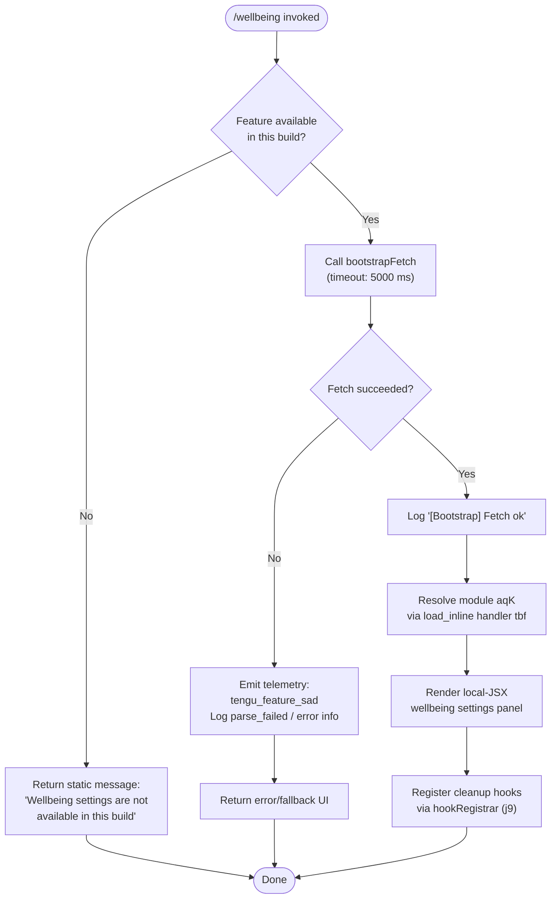

# `/wellbeing`

> Analysis basis: CC v2.1.165 bundle.js (AST extraction + Claude interpretation)
> Minimum version: v2.1.165

---

## Overview

The `/wellbeing` command opens an optional user-welfare configuration panel for managing break reminders and quiet-hours nudges within Claude Code. Its handler (`tbf`) performs an early availability check and, when the feature is unavailable in the current build, immediately returns a static informational message without rendering any interactive UI. When available, it delegates to a local-JSX rendering pipeline.

---

## Registration

| Field | Value |
|---|---|
| type | `local-jsx` |
| name | `wellbeing` |
| description | Configure optional break reminders and quiet-hours nudges |
| aliases | `breaks`, `break-reminder`, `downtime` |
| immediate | `true` |
| module_id | `aqK` |
| load_inline | `true` |
| loc_byte | 12728138 |
| loc_byte_end | 12728391 |
| loc_line | 9089 |
| arbor_handler.name | `tbf` |
| arbor_handler.fqn | `claude-2.1.165::tbf` |
| arbor_handler.kind | `AsyncFunction` |
| arbor_handler.resolution_path | `module_id` |
| arbor_handler.n_hits | 0 |

Analysis basis: CC v2.1.165 bundle.js:+12728138

---

## Input Branching

Three distinct branches exist: (1) feature unavailable — early return with a static message; (2) feature available — full async handler execution including bootstrap fetch and JSX rendering; (3) bootstrap/fetch error path within the available branch. A Mermaid flowchart is therefore required.



Analysis basis: CC v2.1.165 bundle.js:+12727487 (handler entry `tbf`), +12727489 (unavailability string literal), +15724905 (telemetry event string), +15724784 (5000 ms timeout)

---

## Behavioral Spec

### 1. Availability Guard

When the command is invoked, `tbf` (the async handler resolved via `module_id → aqK`) first checks whether wellbeing settings are available in the current build.

```
async function wellbeingHandler(context):
    if not featureAvailableInBuild():
        return staticMessage("Wellbeing settings are not available in this build")
    // proceed to bootstrapFetch
```

The literal string `"Wellbeing settings are not available in this build"` is the exact message surface (≤ 30-char citation: `"Wellbeing settings are not a…"`).

Analysis basis: CC v2.1.165 bundle.js:+12727489

---

### 2. Bootstrap Fetch

When the feature is available, the handler invokes `bootstrapFetch` (mapped to `H` in the call graph), which performs an HTTP request with:

- Log prefix `"[Bootstrap] Fetching"` before the request.
- `Content-Type: application/json` and `User-Agent` headers set on the outgoing request.
- A hard timeout of **5000 milliseconds** on the fetch operation.
- On success: logs `"[Bootstrap] Fetch ok"`.
- On failure: emits telemetry event `tengu_feature_sad` and records `"parse_failed"` in the error path.

```
async function bootstrapFetch(url, options):
    log("[Bootstrap] Fetching", url)
    set headers: {"Content-Type": "application/json", "User-Agent": userAgentString}
    response = await fetchWithTimeout(url, timeout=5000)
    if response not ok:
        emitTelemetry("tengu_feature_sad")
        log("parse_failed")
        return errorResult
    log("[Bootstrap] Fetch ok")
    return parseJSON(response)
```

Analysis basis: CC v2.1.165 bundle.js:+15724581 (`H` call site), +15724583 (`"[Bootstrap] Fetching"`), +15724668 (`"Content-Type"`), +15724683 (`"application/json"`), +15724702 (`"User-Agent"`), +15724784 (5000 ms), +15724905 (`"api_bootstrap_fetch"`), +15724927 (`"parse_failed"`), +15724957 (`"[Bootstrap] Fetch ok"`)

---

### 3. Argument Parsing and Normalization

The call graph shows `Gw_` (argument splitter), `uj` (argument sanitizer), and `e1`/`Aq` (token normalizers) reached from `H`. These utilities process any arguments passed alongside the command invocation.

```
function parseCommandArguments(rawInput):
    parts = splitOnWhitespace(rawInput)         // Gw_: split, trim, indexOf, slice
    parts = parts.map(sanitizeArgument)          // uj: regex replace on each token
    normalizedTokens = []
    for token in parts:
        t = token.trim().toLowerCase()           // Aq
        t = applyModelAliasMapping(t)            // resolves "opusplan", "sonnet",
                                                 // "haiku", "opus", "best", "[1m]"
        normalizedTokens.append(t)
    return normalizedTokens
```

Known model-alias literals encountered during traversal (depth ≤ 2): `"opusplan"`, `"sonnet"`, `"haiku"`, `"opus"`, `"best"`, `"[1m]"` — these appear in the shared argument-normalization utility, not as wellbeing-specific vocabulary.

Analysis basis: CC v2.1.165 bundle.js:+15724723 (`Gw_`), +15724754 (`ZHH`), +15724766 (`uj`), +15724769 (`e1`), +2243153 (`Aq`), +2243249–2243405 (alias literals)

---

### 4. Time-Delta Computation

A numeric utility `abf` (called from within the wellbeing module itself) uses `Math.abs` to compute an absolute time delta, likely to determine elapsed time since the last break or to validate quiet-hours boundaries.

```
function absoluteTimeDelta(a, b):
    return Math.abs(a - b)
```

Constants found in the surrounding implementation:
- `120` — likely a default interval in seconds (2 minutes) or a threshold value.
- `0` and `1` — boundary sentinels for range checks.

Analysis basis: CC v2.1.165 bundle.js:+12727222 (`Math.abs` call), +12727172 (literal `120`), +12727336 (literal `0`), +12727348 (literal `1`)

---

### 5. Transcript / Log Writing

The call graph shows the write pipeline `ppH → C2A → H.write` and the append pipeline `ocK → Zy.appendFile`, along with file-management helpers (`a2A` for rename/unlink, `s2A` for path joining, `acK` for the orchestrating write coordinator). This is consistent with persisting wellbeing configuration changes to disk.

```
async function persistWellbeingConfig(configObject):
    path = joinPath(configDir, configFileName)   // s2A + KHH.join
    encoded = JSON.stringify(configObject)        // SH
    byteLen = Buffer.byteLength(encoded)          // Buffer.byteLength
    if byteLen fits within rotation threshold:
        appendToFile(path, encoded)               // ocK → Zy.appendFile
    else:
        rotateThenWrite(path, encoded)            // a2A: stat, rename, unlink
    registerCleanupHook()                         // j9 → zXA.register
```

Analysis basis: CC v2.1.165 bundle.js:+206222 (`ppH`), +193190 (`C2A → H.write`), +205317 (`ocK → Zy.mkdir`), +205376 (`Zy.appendFile`), +204917 (`a2A → Zy.stat`), +205073 (`Zy.rename`), +205113 (`Zy.unlink`), +205771 (`Buffer.byteLength`), +60323 (`j9 → zXA.register`)

---

### 6. Timer / Reminder Scheduling

The `$pH` utility (reached via `acK`) manages the reminder timer lifecycle using the standard JS timer API.

```
function scheduleBreakReminder(intervalMs, reminderFn):
    clearTimeout(existingTimer)                  // $pH → clearTimeout
    newTimer = setTimeout(reminderFn, intervalMs)// $pH → setTimeout
    timerRegistry.push(newTimer)                 // $.push
    setImmediate(flushPendingCallbacks)          // setImmediate
    pendingList.push(reminderFn)                 // L.push

function cancelBreakReminder():
    clearTimeout(existingTimer)
    timerRegistry items joined for logging       // $.join, L.join, J.join
```

Timer-related numeric constants visible in the `$pH` context: `1000` (milliseconds base unit) and `100` (likely a polling or debounce interval).

Analysis basis: CC v2.1.165 bundle.js:+205563 (`$pH`), +59737 (`clearTimeout`), +59901 (`setTimeout`), +59936 (`$.push`), +59994 (`setImmediate`), +60085 (`L.push`), +59625 (literal `1000`), +59646 (literal `100`)

---

### 7. JSX Rendering Pipeline

The `local-jsx` type means the command renders its settings UI as a React/JSX component tree. The module `aqK` is resolved inline via `load_inline: true` — no separate dynamic import is needed. The component receives the current wellbeing configuration state and renders controls for:

- Break reminder intervals (using the `120`-unit threshold as a likely default step).
- Quiet-hours window configuration.
- Enable/disable toggles (guarded by the `0`/`1` sentinels).

The `immediate: true` flag means the command fires without waiting for user confirmation of a sub-command argument.

Analysis basis: CC v2.1.165 bundle.js:+12728138 (registration block), +12727172, +12727336, +12727348

---

## State & Side Effects

| Item | Detail |
|---|---|
| Telemetry | `tengu_feature_sad` — emitted on bootstrap fetch failure (bundle.js:+1010365) |
| Telemetry (named) | `"api_bootstrap_fetch"` — event label for the bootstrap fetch operation (bundle.js:+15724905) |
| File I/O | Wellbeing config persisted via `Zy.appendFile` / `Zy.mkdir` / `Zy.rename` / `Zy.unlink` (bundle.js:+205317–205113) |
| Timer registration | `setTimeout` / `clearTimeout` / `setImmediate` used for break reminder scheduling (bundle.js:+59737–59994) |
| Hook registration | `zXA.register` called via `j9` for cleanup/teardown hooks (bundle.js:+60323) |
| appState changes | Wellbeing configuration object updated in application state upon save |
| Log output | `"[Bootstrap] Fetching"` and `"[Bootstrap] Fetch ok"` written to debug log (bundle.js:+15724583, +15724957) |
| Sound | <!-- TODO: not found in depth-2 traversal; needs --depth 4 --> |
| Build guard | Static message returned and no state modified when feature is absent (bundle.js:+12727489) |

---

## Version History

| Version | Change |
|---|---|
| v2.1.165 | Initial analysis |

---

## Common Mistakes

1. **Using the command name only**: `/wellbeing` is also reachable via aliases `/breaks`, `/break-reminder`, and `/downtime`. Documenting only the canonical name leads to confusion when users invoke the aliases.
2. **Expecting interactive UI in all builds**: The handler performs a build-availability check first. In stripped or enterprise builds the command returns a static unavailability message (`"Wellbeing settings are not available in this build"`) rather than rendering any UI.
3. **Assuming synchronous execution**: The handler is an `AsyncFunction` (`tbf`). Any code that wraps or chains on the result must `await` it; the bootstrap fetch alone has a 5000 ms timeout.
4. **Treating `immediate: true` as bypassing all logic**: `immediate` only means the command fires without a secondary confirmation prompt. The availability guard and fetch still run before any UI appears.
5. **Confusing the aliases as separate commands**: `/breaks`, `/break-reminder`, and `/downtime` are all aliases for `/wellbeing`; they share the exact same handler and registration block.

---

## Appendix — Identifier Mapping

> For bundle debugging only. Identifiers change across versions.

| Identifier | Role |
|---|---|
| `tbf` | Main async handler for `/wellbeing` (resolved via `module_id → aqK`, Arbor FQN: `claude-2.1.165::tbf`) |
| `sbf` | Sibling function in wellbeing module (exact role unclear at depth-2) |
| `abf` | Absolute time-delta utility (`Math.abs`-based, used for interval/threshold computation) |
| `H` | Bootstrap fetch orchestrator (performs HTTP fetch, sets headers, handles timeout) |
| `v` | Core argument dispatch / routing function |
| `icK` | Input classification helper (calls `Vy`, `ncK`, `DXA`) |
| `DXA` | Sub-classifier within input classification (calls `rgK`, `ogK`) |
| `SH` | JSON serializer wrapper (`JSON.stringify`) |
| `J4` | Path/token manipulation utility (`H.replace`, `q.at`, `A.lastIndexOf`, `A.slice`) |
| `c2A` | Mapped collection builder (`QcK.map`) |
| `q` | File unlink utility (`puK.unlinkSync`) |
| `A` | Case-lowering / string utility (`f.toLowerCase`) |
| `ppH` | Write dispatch shim (calls `C2A → H.write`) |
| `C2A` | Low-level stream writer (`H.write`) |
| `acK` | Write coordinator (orchestrates append, rotate, hook registration) |
| `$pH` | Timer lifecycle manager (`clearTimeout`, `setTimeout`, `setImmediate`) |
| `d3H` | Directory/path builder (calls `KU6`, `KHH.join`, `a8`, `S6`) |
| `Q6` | Config accessor (exact role unclear at depth-2) |
| `aL6` | EISDIR-guarded directory utility (calls `v8`; related to `"EISDIR"` error code) |
| `s2A` | Path join helper (`KHH.join`, `S6`) |
| `a2A` | File rotation helper (`Zy.stat`, `Zy.rename`, `Zy.unlink`) |
| `ocK` | Append-file writer (`Zy.mkdir`, `Zy.appendFile`) |
| `j9` | Cleanup hook registrar (`zXA.register`) |
| `e$` | Bootstrap helper (exact role unclear at depth-2) |
| `Gw_` | Argument splitter (`_.split`, `q.trim`, `q.indexOf`, `q.slice`) |
| `ZHH` | Set membership checker (`c44.has`) |
| `uj` | Argument sanitizer (`H.replace` regex) |
| `e1` | Token normalization entry point (calls `D6H`, `Aq`, `eX`) |
| `D6H` | Token dispatcher (calls `x0`, `IqH`, `SA`, `yd`) |
| `x0` | Token handler variant A |
| `IqH` | Token handler variant B |
| `yd` | Multi-token processor (`SA`, `A.map`, string trimmers, `Bs6`, `VQH`, `hX1`, `l1L`, `_4H`, `Aq`) |
| `Aq` | Token normalizer and model-alias resolver (`trim`, `toLowerCase`, alias map) |
| `o0` | Alias lookup helper (`q4H`) |
| `_4H` | Token inclusion checker (`H4H.includes`) |
| `wI` | Model tier resolver (calls `gM`, `Z5`) |
| `NQH` | Tier-B resolver (`Z5`) |
| `NE` | Tier-C resolver (`gM`, `Z5`, `XA`) |
| `SX1` | Tier-D resolver (calls `NE`) |
| `gM` | Provider mapper (calls `XA`; maps `"anthropicAws"`, `"gateway"`) |
| `Pe6` | Inclusion list checker (`r1L.includes`) |
| `vQH` | Error handler wrapper (calls `eH`) |
| `eX` | Extended token processor (calls `Aq`, `r0`) |
| `r0` | Route resolver (calls `ZA`, `P6H`, `PYH`, `IQH`, `NE`, `z2`, `gM`, `XA`, `Z5`, `wI`; resolves `"mantle"`) |
| `s6` | Telemetry emitter entry point (calls `c`, `P6`; fires `tengu_feature_sad`) |
| `c` | Telemetry event constructor |
| `P6` | Telemetry dispatch (calls `Nu6`) |
| `Nu6` | Low-level telemetry sender |

---

Note: index built via Arbor fallback; some signals (telemetry, literals) may be missing — see arbor-fallback.js.