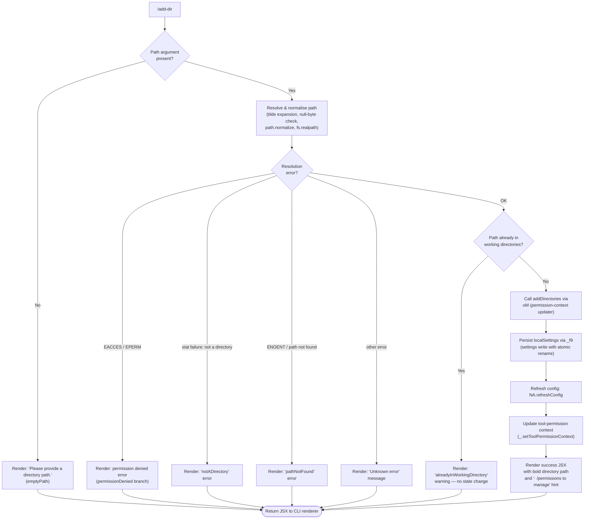

# `/add-dir`

> Analysis basis: CC v2.1.167 bundle.js (AST extraction + Claude interpretation)
> Minimum version: v2.1.167

---

## Overview

`/add-dir` registers an additional working directory with the current Claude Code session, allowing the agent to read and operate on files outside the initially configured working directory. The command resolves, validates, and normalises the supplied path before persisting it to session state and refreshing the agent's configuration. It presents inline JSX feedback confirming success or describing the specific failure reason.

---

## Registration

| Field | Value |
|---|---|
| type | `local-jsx` |
| name | `add-dir` |
| description | `Add a new working directory` |
| argumentHint | `<path>` |
| module_id | `Fuq` |
| load_inline | `true` |
| loc_byte | `10947960` |
| loc_byte_end | `10948108` |
| loc_line | `7244` |
| arbor_handler.name | `JDf` |
| arbor_handler.fqn | `claude-2.1.167::JDf` |
| arbor_handler.kind | `AsyncFunction` |
| arbor_handler.resolution_path | `module_id` |
| arbor_handler.n_hits | `0` |

Analysis basis: CC v2.1.167 bundle.js:+10947960

---

## Input Branching

The command has 6+ distinct outcome branches (empty path, path-resolution error, not-a-directory, permission denied, path-not-found, already-in-working-directory, and success), so a Mermaid flowchart is used.



Analysis basis: CC v2.1.167 bundle.js:+10946741, +10947013, +10947442, +3851316, +3851414, +3851559, +3851684, +3851760, +3851845

---

## Behavioral Spec

### 1. Entry point and app-state retrieval

`JDf` is the async handler for `/add-dir` (Arbor resolution path: `module_id → Fuq → JDf`).

```
async function addDirHandler(commandInput, sessionContext):
    appState = getAppState(sessionContext)        // b_ → H.getAppState
    rawPath  = commandInput.args[0]              // first positional argument
    ...
```

Analysis basis: CC v2.1.167 bundle.js:+10946741, +10944365

### 2. Path resolution and validation (`PiH` / `T1`)

`PiH` wraps the path-normalisation pipeline. It calls `T1` (the core path resolver), which:

1. Rejects paths containing null bytes — error message: `"Path contains null bytes"` (bundle.js:+1053727).
2. Expands a leading `~/` to the OS home directory via `os.homedir()` (bundle.js:+1053824, +1053855).
3. Resolves relative paths to absolute using `path.resolve` (bundle.js:+1054038).
4. Normalises the result with `path.normalize` and `jO` (NFC Unicode normalisation, bundle.js:+177725, +177737).
5. On Windows, applies `/var/` → `/tmp$1` path mapping via `kZ` (bundle.js:+13276144, +13276185).

After `T1`, `PiH` calls `fs.stat` (via `Z99.stat`, bundle.js:+3851369) to verify existence and type.

```
async function resolveAndValidatePath(rawPath):
    if rawPath is empty or null:
        return { outcome: "emptyPath" }
    if rawPath contains null byte:
        return { outcome: "error", detail: "Path contains null bytes" }
    expanded = expandTilde(rawPath)          // ~/  → homedir
    absolute = path.resolve(expanded)
    normalised = path.normalize(absolute)   // NFC normalisation applied
    try:
        stat = await fs.stat(normalised)
    catch err:
        if err.code in ["EACCES", "EPERM"]:
            return { outcome: "permissionDenied" }
        if err.code == "ENOENT":
            return { outcome: "pathNotFound" }
        return { outcome: "unknownError", detail: err.message }
    if not stat.isDirectory():
        return { outcome: "notADirectory" }
    return { outcome: "resolved", path: normalised }
```

Analysis basis: CC v2.1.167 bundle.js:+3851335, +3851369, +3851477, +3851559, +3851414, +3851519, +3851533, +1053520, +1053727, +1053824

### 3. Duplicate-path guard

Before mutating state, the handler checks `Y.includes` to determine whether the resolved path is already registered as a working directory.

```
function isAlreadyRegistered(resolvedPath, currentWorkingDirs):
    return currentWorkingDirs.includes(resolvedPath)
```

If `true`, the command renders the `"alreadyInWorkingDirectory"` JSX fragment and returns early — no state mutation occurs.

Analysis basis: CC v2.1.167 bundle.js:+10946907, +3851684

### 4. Permission-context update (`oM`)

`oM` applies the `addDirectories` operation to the live permission context, inserting the new path. It also handles `setMode`, `addRules`, `replaceRules`, and `removeRules` variants (not triggered by this command), and filters `removeDirectories` (bundle.js:+4762010).

```
function applyPermissionContextUpdate(context, update):
    if update.type == "setMode" and mode == "bypassPermissions":
        if bypassPermissionsDisabled:
            log("Ignoring permission update: setMode 'bypassPermissions' rejected ...")
            return context   // no-op
    if update.type == "addDirectories":
        context.workingDirectories.add(update.path)
    ...
    return updatedContext
```

Analysis basis: CC v2.1.167 bundle.js:+10946883, +4760343, +4760621, +4761626, +4762010, +4762238

### 5. Settings persistence (`_f9` / `zf` / `XY`)

After the permission context is updated, the new directory is written to `localSettings`. `_f9` coordinates the write:

1. `oj` removes the stale cached entry (bundle.js:+4167234).
2. `e9` re-reads and merges current on-disk settings (bundle.js:+4167275), using an atomic `stat` + `readFile` + merge cycle.
3. `zf` / `XY` performs the atomic file write: generates random hex bytes for a temp filename, writes to the temp file, sets permissions, then `fs.rename` replaces the target (bundle.js:+2287893, +2287940, +2287994).

The `--add-dir` flag string (bundle.js:+10946965) is used as the settings mutation key.

```
async function persistLocalSettings(path, sessionSettings):
    invalidateCache(path)                   // oj
    merged = await mergeWithOnDisk(path, sessionSettings)  // e9
    tempName = randomHex(4) + ".tmp"        // XY: 4 random bytes → hex
    await fs.writeFile(tempName, JSON.stringify(merged))
    await fs.rename(tempName, settingsFilePath)
```

Analysis basis: CC v2.1.167 bundle.js:+4170750, +4170768, +4170933, +2287893, +2287940, +2287994, +10946965

### 6. Config refresh and tool-permission context update

After settings are persisted:

1. `NA.refreshConfig` reloads the agent configuration from disk (bundle.js:+10946935).
2. `_.setToolPermissionContext` pushes the updated permission context (including the new directory) into the active session (bundle.js:+10946851).

```
async function finaliseAddDir(newPath, updatedContext):
    await NA.refreshConfig()
    sessionContext.setToolPermissionContext(updatedContext)
```

Analysis basis: CC v2.1.167 bundle.js:+10946851, +10946935

### 7. JSX rendering

Success renders bold text containing the resolved path followed by the dim hint string `"· /permissions to manage"` (bundle.js:+10947306).

Error renders the literal `"Did not add a working directory."` (bundle.js:+10947442) along with the specific error code/message.

```
function renderResult(outcome, resolvedPath):
    if outcome == "success":
        return <Text>
                 <Bold>{resolvedPath}</Bold> added as working directory.
                 <Dim> · /permissions to manage</Dim>
               </Text>
    else:
        return <Text>
                 Did not add a working directory.
                 <ErrorDetail>{describeOutcome(outcome)}</ErrorDetail>
               </Text>
```

Analysis basis: CC v2.1.167 bundle.js:+10947013, +10947299, +10947306, +10947442

### 8. App-state fields consulted during execution

The `b_` helper queries the following named fields from app state before and after the operation:

| Field | Purpose |
|---|---|
| `working_directory` | Current primary working dir (bundle.js:+10944470) |
| `allowed_tools` | Tool allow-list snapshot (bundle.js:+10944525) |
| `disallowed_tools` | Tool deny-list snapshot (bundle.js:+10944580) |
| `avoid_prompts` | Prompt-avoidance flags (bundle.js:+10944641) |
| `permission_mode` | Current permission mode string (bundle.js:+10944743) |
| `bypassPermissions` | Whether bypass mode is active (bundle.js:+10944774) |
| `session` | Session identifier (bundle.js:+10945073) |
| `effort` | Effort level (bundle.js:+10945098) |
| `model` | Active model name (bundle.js:+10945111) |
| `max_thinking_tokens` | Thinking token budget (bundle.js:+10945123) |
| `flag_settings` | Feature-flag map (bundle.js:+10945149) |
| `addDirectories` | Directories pending addition (bundle.js:+10946777) |
| `localSettings` | Local settings object (bundle.js:+10946824) |

Analysis basis: CC v2.1.167 bundle.js:+10944365, +10944470–10946824

---

## State & Side Effects

| Item | Detail |
|---|---|
| Telemetry | `tengu_feature_ok` (bundle.js:+1010950), `tengu_feature_bad` (bundle.js:+1011012), `tengu_feature_sad` (bundle.js:+1011093), `tengu_disable_bypass_permissions_mode` (bundle.js:+4204496), `tengu_bg_state_read_transient` (bundle.js:+4167723), `tengu_daemon_config_reload` (bundle.js:+16212216) |
| Settings write | Atomic rename write to `localSettings` (`.claude/settings.local.json`) via `XY` (bundle.js:+2287994) |
| Permission context | `_.setToolPermissionContext` called with updated directory list (bundle.js:+10946851) |
| Config refresh | `NA.refreshConfig()` triggered after successful write (bundle.js:+10946935) |
| Cache invalidation | `oj` deletes the stale settings cache entry; `R7H.delete` clears the file-state cache (bundle.js:+4167234) |
| appState changes | `addDirectories` field updated; `localSettings` re-persisted |
| Sound | <!-- TODO: not found in depth-2 traversal; needs --depth 4 --> |
| Hook registration | No hook registration observed in depth-2 traversal |

---

## Version History

| Version | Change |
|---|---|
| v2.1.167 | Initial analysis |

---

## Common Mistakes

1. **Providing a file path instead of a directory path.** The command calls `fs.stat` and checks `isDirectory()`; a regular file path yields the `notADirectory` error and no directory is added.
2. **Providing a path that is already a working directory.** The duplicate guard (`Y.includes`) causes an early return with `alreadyInWorkingDirectory` and no state mutation — this is silent from the agent's perspective but still renders a notice to the user.
3. **Using a relative path in non-interactive scripts.** Relative paths are resolved against the process working directory at the time of the call, which may differ from the user's intent. Prefer absolute paths or paths starting with `~/`.
4. **Expecting immediate tool availability.** The directory is added to the permission context synchronously, but `NA.refreshConfig()` is async; tools that scan working directories may not reflect the new path until the config reload completes.
5. **Providing a path with null bytes.** The validator rejects such paths immediately with a `TypeError`-style error before any filesystem call is made (bundle.js:+1053520, +1053727).
6. **Assuming `/add-dir` persists across sessions.** The write target is `localSettings` (`settings.local.json`), which is project-scoped. If that file is absent or not tracked, the directory addition will not survive a new session without re-issuing the command.

---

## Appendix — Identifier Mapping

> For bundle debugging only. Identifiers change across versions.

| Identifier | Role |
|---|---|
| `JDf` | Main async handler for `/add-dir` (Arbor: `claude-2.1.167::JDf`) |
| `b_` | App-state reader / field extractor |
| `H` | Generic context / state object (overloaded across call sites) |
| `v` | Path utility / string normalisation helper |
| `onK` | Sub-helper inside path normalisation (index 1) |
| `RH` | JSON serialisation helper (`JSON.stringify` wrapper) |
| `G4` | String/path manipulation utility (lastIndexOf, slice) |
| `EUH` | Additional path encoding helper (`lWA`) |
| `enK` | File-content reading / byte-length computation helper |
| `Y3` | Bootstrap fetch helper |
| `uj_` | String split / trim / indexOf helper |
| `lHH` | Set membership check helper (`i74.has`) |
| `uj` | String replace wrapper |
| `H9` | Model-name resolution orchestrator |
| `m6H` | Model metadata builder |
| `s9` | Model alias normaliser (toLowerCase, trim) |
| `FJ` | Model fallback resolver |
| `o6` | Render helper (JSX element factory) |
| `l` | Low-level JSX text node helper |
| `J6` | JSX component builder |
| `sy8` | App-state snapshot helper (calls `L1`) |
| `ty8` | App-state update helper (calls `L1`) |
| `L1` | Core state read/write primitive |
| `aB` | Permission-mode disable helper |
| `D6` | Permission-context object builder |
| `dj6` | Permission context sub-field initialiser |
| `cj6` | Permission context sub-field initialiser (deny list) |
| `hu` | Context merger helper |
| `dq8` | Dedup / cache helper for permission contexts |
| `C6` | Permission context timestamp/version helper |
| `oM` | Permission-context mutation dispatcher (addDirectories, addRules, etc.) |
| `jM` | Rule-string escaping helper (`XV4`) |
| `XV4` | `String.replaceAll` wrapper for rule escaping |
| `K` | Collection / array helper (overloaded) |
| `yV` | Session validation helper |
| `Y` | Daemon / supervisor write helper |
| `$GH` | Config file reader with ENOENT handling |
| `V9` | Async-storage getter helper |
| `V8` | Error classification / typed-error constructor |
| `mfA` | Config merge helper (`ufA`) |
| `GH` | String coercion helper |
| `mfK` | Config key-width calculator (`Math.max`) |
| `T` | Supervisor process handle |
| `cy6` | Process stop signal helper |
| `z46` | Process status helper |
| `E` | Spinner / progress indicator handle |
| `WUK` | Heartbeat sender (`S8H`) |
| `pTH` | Post-add notification helper |
| `H_A` | CLAUDE.md file writer / appender |
| `DGH` | Environment discriminator (`production`/`test`) |
| `_6` | String coercion utility |
| `n$K` | Config path helper |
| `Cx` | Config directory resolver |
| `jO` | Path NFC normaliser (`H.normalize`) |
| `h8` | Typed-error builder |
| `xR` | Error renderer (`tv`) |
| `W_` | Secondary error renderer |
| `tv` | Terminal colour/style primitive |
| `hH` | CLAUDE.md read/parse/write orchestrator |
| `AA` | Error-wrapping helper |
| `$q` | CLAUDE.md section parser |
| `QRA` | CLAUDE.md section extractor (`_6`) |
| `zG4` | CLAUDE.md history ring-buffer (shift/push) |
| `_f9` | Local-settings persist orchestrator |
| `oj` | Settings cache invalidator (`R7H.delete`) |
| `e9` | Settings merge-from-disk helper |
| `Tf` | Typed error for settings read failures |
| `U6` | `JSON.parse` wrapper |
| `zf` | Atomic file-write coordinator |
| `XY` | Low-level atomic write (randomBytes → tmp → rename) |
| `fz` | Settings-change event emitter |
| `g_H` | Tool-filter / permission-list renderer |
| `bv_` | Permission list builder |
| `mz9` | Tool metadata collector |
| `$26` | Policy-settings reader |
| `x8` | Settings key accessor |
| `JoL` | Tool-entry formatter |
| `eO` | Tool display-name resolver |
| `g$` | `fs.realpathSync` wrapper for tool paths |
| `d6` | Debug / trace logger |
| `oP` | Tool-permission renderer (`Br`) |
| `WoL` | Tool-list section builder |
| `w$` | Rule-pattern formatter |
| `WV4` | Rule string builder |
| `IT` | `Object.hasOwn` wrapper |
| `GV4` | Rule negation helper |
| `PV4` | Rule `replaceAll` wrapper |
| `M` | MCP client / tool registry manager |
| `xbH` | MCP connection builder / tool registrar |
| `XF8` | MCP connection result applicator |
| `$` | MCP lifecycle helper (`zLK`) |
| `dDA` | MCP client diff-and-apply orchestrator |
| `o_` | Settings-load-from-disk orchestrator |
| `H__` | Settings file parser (with schema validation) |
| `kd` | Settings schema field validators |
| `t6_` | Settings load timestamp recorder |
| `IZH` | Settings cache populator |
| `$$6` | Atomic write with symlink/permission handling |
| `LY` | Cache-clear helper (two sets) |
| `yl6` | gitignore / exclude-file tracker |
| `qu` | `.claude/settings.json` path resolver |
| `SH` | Success-toast renderer |
| `CH` | Error-toast renderer |
| `gU` | Settings load dispatcher |
| `PiH` | Path validation and `fs.stat` orchestrator |
| `T1` | Core path resolver (tilde, null-byte, normalize, resolve) |
| `u6` | Async-storage context reader |
| `mc6` | Store getter with fallback (`BQ`) |
| `ka` | Error-outcome renderer for path failures |
| `kZ` | macOS `/var/` → `/tmp` path rewriter |
| `vMA` | Platform-specific path transformer |
| `uz` | `toLowerCase` path normaliser |
| `eHH` | Path comparison finaliser |
| `WiH` | Success JSX renderer (bold path + dirname) |

---

Note: index built via Arbor fallback; some signals (telemetry, literals) may be missing — see arbor-fallback.js.