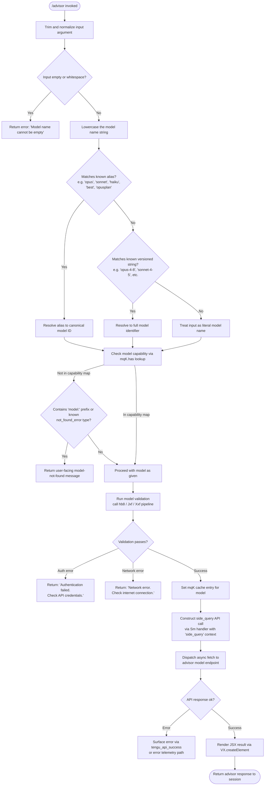

# `/advisor`

> Analysis basis: CC v2.1.167 bundle.js (AST extraction + Claude interpretation)
> Minimum version: v2.1.167

---

## Overview

The `/advisor` command allows the current Claude model to consult a stronger or more capable model at key decision points during a session. It operates as a `local-jsx` command that validates the requested advisor model name, checks for known aliases and version strings, and dispatches a side-query API call to the chosen model, returning its response into the ongoing conversation context. This enables a weaker or faster model to escalate complex reasoning to a more powerful model on demand.

---

## Registration

| Field | Value |
|---|---|
| type | `local-jsx` |
| name | `advisor` |
| description | `Let Claude consult a stronger model at key moments` |
| module_id | `gqK` |
| load_inline | `true` |
| loc_byte | `12665088` |
| loc_byte_end | `12665329` |
| loc_line | `9077` |
| argumentHint | `null` |
| isHidden | `null` |
| arbor_handler.name | `Ixf` |
| arbor_handler.fqn | `claude-2.1.167::Ixf` |
| arbor_handler.kind | `AsyncFunction` |
| arbor_handler.resolution_path | `module_id` |
| arbor_handler.n_hits | `1` |

Analysis basis: CC v2.1.167 bundle.js:+12665088

---

## Input Branching

The handler has more than 3 distinct branching paths (model alias resolution, model validation, capability flag checks, side-query dispatch, and JSX rendering), requiring a flowchart.



---

## Behavioral Spec

### Main Handler: advisorCommandHandler (Ixf)

The handler is an `AsyncFunction` resolved via the `gqK` module at registration byte range `(12665088, 12665329)`.

Analysis basis: CC v2.1.167 bundle.js:+12664544

```
async function advisorCommandHandler(inputArgument, sessionContext):
    rawInput = inputArgument.trim()                        // +12664544
    if rawInput is empty:
        return error("Model name cannot be empty")         // +12656802

    normalizedModel = rawInput.toLowerCase()               // +12664544 via s9

    resolvedModel = resolveModelAlias(normalizedModel)     // see alias resolution below

    // Render initial JSX wrapper for the UI
    element = createElement(...)                           // +12664580

    // Run model capability check and validation
    validationResult = await validateAdvisorModel(resolvedModel, sessionContext)  // hb8 at +12664712

    if validationResult.authFailed:
        return "Authentication failed. Please check your API credentials."  // +12657501

    if validationResult.networkFailed:
        return "Network error. Please check your internet connection."      // +12657603

    if validationResult.modelNotFound:
        return formatModelNotFoundMessage(resolvedModel)   // +12657722 ('not_found_error')

    // Cache the validated model name
    cacheModel(resolvedModel)                              // mqK.set at +12657254

    // Build and dispatch side query to advisor model
    advisorResponse = await dispatchSideQuery(resolvedModel, sessionContext)  // Sm at +12664698

    // Join result parts and return
    return advisorResponse.parts.join(...)                 // AsH.join at +12664855
```

---

### Alias Resolution: resolveModelAlias (s9)

Resolves human-readable shorthand names or plan-based aliases to canonical model identifiers.

Analysis basis: CC v2.1.167 bundle.js:+2247412

```
function resolveModelAlias(normalizedInput):
    trimmed = normalizedInput.trim()                       // +2247412
    lower   = trimmed.toLowerCase()                        // +2247423

    // Check plan-based shorthand tokens
    if lower includes "opusplan":
        return resolveViaModelPlan("opusplan")             // +2247508

    if lower equals "[1m]":                                // +2247534
        return resolveViaModelPlan("[1m]")

    if lower equals "sonnet":                              // +2247549
        return resolveViaPlanTable("sonnet")

    if lower equals "haiku":                               // +2247588
        return resolveViaPlanTable("haiku")

    if lower equals "opus":                                // +2247627
        return resolveViaPlanTable("opus")

    if lower equals "best":                                // +2247664
        return resolveViaBestModel()

    // Apply string replacement pass for provider-specific formatting
    cleaned = applyModelNameReplacements(lower)            // A.replace at +2247451

    // Check capability flag for this model string
    if modelCapabilityCheck(cleaned):                      // h4H at +2247487
        return applyCapabilityAwareResolution(cleaned)     // CI at +2247526

    return cleaned
```

---

### Model Validation: validateAdvisorModel (hb8)

Performs a lightweight API probe call to verify the model identifier is reachable and that credentials are valid before committing to a full side query.

Analysis basis: CC v2.1.167 bundle.js:+12656765

```
async function validateAdvisorModel(modelName, context):
    trimmedName = modelName.trim()                         // +12656765

    // Parse model structure (provider, version tokens)
    parsedModel = parseModelStructure(trimmedName)         // qB at +12656836

    // Lowercase model name for normalized comparison
    lowerName = trimmedName.toLowerCase()                  // +12656925

    // Reject models that appear in a deny-list
    if isDisallowedModel(lowerName):                       // y4H.includes at +12656944
        return ValidationResult.DISALLOWED

    // Check the in-process model validation cache
    if modelValidationCache.has(lowerName):                // mqK.has at +12657046
        return modelValidationCache.get(lowerName)

    // Issue a test query to the model endpoint
    result = await probeModelEndpoint(lowerName, context)  // Sm at +12657091

    on AuthenticationError:
        return ValidationResult.authFailed("Authentication failed...")  // +12657501

    on NetworkError:
        return ValidationResult.networkFailed("Network error...")       // +12657603

    on ApiError where error.type == "not_found_error":                  // +12657722
        return ValidationResult.modelNotFound

    return ValidationResult.ok(result)
```

---

### Model Version String Resolution (Jxf / Xxf)

After the probe validates a model, the handler maps known versioned shorthand strings (e.g. `opus-4-8`, `sonnet-4-5`) to their full canonical identifiers.

Analysis basis: CC v2.1.167 bundle.js:+12657295

```
function resolveVersionedModelString(input):
    str = String(input)                                    // +12657991

    lowerStr = str.toLowerCase()                           // +12658041 via Xxf

    // Resolve known opus versioned shorthands
    if lowerStr includes "opus-4-8" or "opus_4_8":        // +12658071 / +12658095
        return canonicalModelId("opus-4-8")

    if lowerStr includes "opus-4-7" or "opus_4_7":        // +12658140 / +12658164
        return canonicalModelId("opus-4-7")

    if lowerStr includes "opus-4-6" or "opus_4_6":        // +12658209 / +12658233
        return canonicalModelId("opus-4-6")

    if lowerStr includes "opus-4-5" or "opus_4_5":        // +12658278 / +12658302
        return canonicalModelId("opus-4-5")

    // Resolve known sonnet versioned shorthands
    if lowerStr includes "sonnet-4-6" or "sonnet_4_6":    // +12658347 / +12658373
        return canonicalModelId("sonnet-4-6")

    if lowerStr includes "sonnet-4-5" or "sonnet_4_5":    // +12658422 / +12658448
        return canonicalModelId("sonnet-4-5")

    // Fall through to capability-aware resolution
    return capabilityAwareResolution(lowerStr, ...)        // N5 at +12658114
```

---

### Side Query Dispatch (Sm)

The core async function that issues the actual API call to the advisor model, using the `"side_query"` context classification. This calls the full API pipeline (authentication, header construction, streaming) analogous to a normal main-thread query but flagged as a side query.

Analysis basis: CC v2.1.167 bundle.js:+13499096

```
async function dispatchSideQuery(modelName, context):
    // Classify this request as a side query — affects billing headers and telemetry
    requestContext = buildRequestContext("side_query")     // literal at +13499128

    // Authenticate and build API headers (OAuth or API key path)
    authHeaders = await resolveAuthentication(context)     // PB at +13499096

    // Apply prompt cache configuration (1h ephemeral cache control)
    cacheConfig = buildCacheConfig("1h", "ephemeral")      // +13499980 / +12657235

    // Limit context length (Math.min applied to token count)
    tokenCount = Math.min(contextTokens, maxTokens)        // +13499938

    // Dispatch fetch with AbortSignal timeout
    response = await fetch(advisorEndpoint, {
        headers: authHeaders,
        signal: AbortSignal.timeout(10000)                 // +2300896 (10s timeout in credential path)
    })

    // Emit telemetry on success
    emit("tengu_api_success")                              // +13500709

    // Sanitize lone surrogates in response
    sanitized = sanitizeLoneSurrogates(response.text)      // tengu_lone_surrogate_sanitized at +13500458

    return parseAndFormatResponse(sanitized)
```

---

### Model Capability Check (h4H / VH8)

Determines whether a model name is in the set of recognized capability-flagged models before issuing validation calls.

Analysis basis: CC v2.1.167 bundle.js:+2240618

```
function isCapabilityFlaggedModel(modelName):
    // Check against the static capability list
    return knownCapableModels.includes(modelName)          // y4H.includes at +2240618

function isKnownHighCapabilityModel(modelName):
    // Secondary check against a broader list
    return broadCapabilityList.includes(modelName)         // HKL.includes at +2247950
```

---

## State & Side Effects

| Item | Detail |
|---|---|
| Telemetry — `tengu_api_success` | Emitted on successful advisor model API response (bundle.js:+13500709) |
| Telemetry — `tengu_lone_surrogate_sanitized` | Emitted when the advisor model response contains lone UTF-16 surrogates that are sanitized (bundle.js:+13500458) |
| Telemetry — `tengu_prompt_cache_1h_config` | Emitted when 1-hour ephemeral cache control is applied to the side query (bundle.js:+13459188) |
| Telemetry — `tengu_feature_sad` | Emitted via `o6` / `l` path, indicating a degraded or unavailable feature state (bundle.js:+1011093) |
| Model validation cache (`mqK`) | The validated model name is written to `mqK` via `mqK.set` after a successful probe (bundle.js:+12657254). Subsequent `/advisor` calls with the same model name skip re-validation via `mqK.has` (bundle.js:+12657046). |
| API request context | Sets request classification to `"side_query"` (bundle.js:+13499128) and `"model_validation"` (bundle.js:+12657141) for the probe phase. |
| Cache control | Sets `"ephemeral"` cache control (bundle.js:+12657235) and `"1h"` cache TTL (bundle.js:+13499980) on the advisor request. |
| JSX element creation | Calls `VX.createElement` (bundle.js:+12664580) to render the advisor UI component. |
| Session headers | Advisor calls include `X-Claude-Code-Session-Id`, `x-client-app`, `x-claude-code-agent-id` and related headers via the standard API pipeline (bundle.js:+2973465 and adjacent). |
| appState changes | <!-- TODO: not found in depth-2 traversal; needs --depth 4 --> |
| Sound | <!-- TODO: not found in depth-2 traversal; needs --depth 4 --> |
| Hook registration | <!-- TODO: not found in depth-2 traversal; needs --depth 4 --> |

---

## Version History

| Version | Change |
|---|---|
| v2.1.167 | Initial analysis. Command registered as `local-jsx` type; handler `Ixf` resolved via `module_id` `gqK`. Supports alias tokens (`opus`, `sonnet`, `haiku`, `best`, `opusplan`) and versioned shorthands (`opus-4-8` through `opus-4-5`, `sonnet-4-6`, `sonnet-4-5`). Side query dispatched with `side_query` context classification and 1-hour ephemeral prompt cache. |

---

## Common Mistakes

1. **Providing an empty or whitespace-only argument** — The handler explicitly validates that the trimmed model name is non-empty before proceeding. An empty `/advisor` invocation will return `"Model name cannot be empty"` immediately (bundle.js:+12656802).
2. **Using an unsupported model alias** — Only the documented shorthand aliases (`opus`, `sonnet`, `haiku`, `best`, `opusplan`, `[1m]`) and versioned strings listed above are resolved. Arbitrary partial strings that do not match will be passed as literals and will fail at the API probe stage with a `not_found_error` (bundle.js:+12657722).
3. **Invalid or expired API credentials** — The model validation probe call runs before the full side query. Expired OAuth tokens or missing API keys will surface as `"Authentication failed…"` (bundle.js:+12657501) before any advisor response is generated.
4. **Network connectivity issues** — A separate network-error branch returns `"Network error. Please check your internet connection."` (bundle.js:+12657603). This is distinct from authentication failure and indicates a transport-layer problem.
5. **Expecting the advisor to share main-thread context automatically** — The `side_query` API context (bundle.js:+13499128) is a separate API call with its own token budget. The advisor receives whatever context is injected by the side-query construction logic, not the full unbounded conversation history.
6. **Repeated validation overhead** — The first call with a new model name incurs a probe round-trip. Subsequent calls with the same name hit the `mqK` cache (bundle.js:+12657046) and skip re-validation. Restarting the CLI session clears this in-memory cache.

---

## Appendix — Identifier Mapping

> For bundle debugging only. Identifiers change across versions.

| Identifier | Role |
|---|---|
| `Ixf` | Main async handler for `/advisor` command (advisorCommandHandler) |
| `Jxf` | Outer versioned model string resolver |
| `Xxf` | Inner versioned model string resolver (lowercases, matches known versioned shorthands) |
| `hb8` | Model validation probe function (validateAdvisorModel) |
| `Sm` | Side-query API dispatch function (dispatchSideQuery) |
| `s9` | Model alias resolution function (resolveModelAlias) |
| `qB` | Model structure parser (parses provider, version tokens) |
| `h4H` | Capability list membership check (isCapabilityFlaggedModel) |
| `VH8` | Secondary broad capability list check (isKnownHighCapabilityModel) |
| `CI` | Capability-aware model resolution |
| `lM` | Lower-level model lookup helper |
| `N5` | Canonical model ID resolver |
| `MA` | Core model attribute accessor |
| `WAL` | Model resolution with provider context |
| `ct6` | Model entry finder in model table |
| `DdH` | Delegating resolver wrapping N5 |
| `bT` | Model resolution combining lM, N5, MA |
| `cP1` | Wrapper delegating to bT |
| `wdH` | Model name normalization helper (uses _6) |
| `_6` | Low-level string coercion / identity helper |
| `Y2` | Model name token validator |
| `R4H` | Token validation helper wrapping _6 |
| `PB` | Core API request builder and dispatcher |
| `KD` | Context store retrieval (getStore) |
| `J9` | Request metadata builder |
| `bo` | Request header helper |
| `R6` | API routing helper |
| `jM_` | URL encoding helper for API paths |
| `B3` | API auth helper |
| `aP1` | Boolean coercion helper for auth flags |
| `GY` | OAuth / credential resolution |
| `D3` | Request parameter helper |
| `w2L` | Proxy auth configuration helper |
| `U_` | Auth token accessor |
| `do6` | ProxyAuthHelper invocation with trust check |
| `T2L` | Streaming API session manager |
| `jY` | Request context builder |
| `wY` | Proxy-Authorization header builder |
| `j2L` | API response stream handler |
| `iYH` | API timing / metrics helper |
| `Ed8` | Timestamp helper (Date.now wrapper) |
| `bw6` | Header normalization (lowercases authorization headers) |
| `UDH` | SDK error logger |
| `V18` | Response type dispatcher |
| `E` | Stream event processor |
| `FTH` | Model prefix matcher |
| `xW` | OAuth token exchange helper |
| `Bj` | Primary credential builder |
| `oYH` | WIF token exchange handler |
| `kdH` | WIF credential resolution with fetch |
| `T` | Token cache accessor |
| `X` | Socket / stream connection handler |
| `J` | Stream buffer helper |
| `w` | Worker/daemon session manager |
| `X5` | Stream end handler |
| `i$5` | IPC message dispatcher (full daemon protocol) |
| `GH` | Generic string coercion helper |
| `eNH` | Context filter applying model checks |
| `e1` | Extended model context resolver |
| `Jh` | Model attribute helper wrapping MA |
| `W` | Tool availability / features list |
| `lV6` | TeammateMailbox message handler |
| `glf` | Side-query model finder |
| `$$A` | SHA-256 hash helper |
| `IH8` | Session header builder |
| `jK` | String conversion helper |
| `NH8` | Store accessor (oP1.getStore) |
| `DM_` | Additional session metadata helper |
| `MK8` | Model attribute wrapper |
| `hhH` | Prompt cache 1h configuration builder |
| `GA` | API call wrapper combining GY, YC, r1 |
| `D6` | Tool dispatch / hook registration helper |
| `_N` | HIPAA / compliance flag helper |
| `rj_` | Compliance mode resolver |
| `tNH` | Compliance tag builder |
| `TzK` | Response token counter |
| `x18` | Temperature / model parameter injector |
| `$2` | Message mapper |
| `TjH` | Prompt construction helper |
| `ZB` | Random byte / nonce generator |
| `kL` | API call with C6 + GY |
| `oWA` | Message array mutator (pop + push) |
| `eU6` | Message structure validator |
| `ZW` | Deep clone (structuredClone wrapper) |
| `_B6` | Alternative message array mutator |
| `rWA` | Message replacement helper |
| `t3H` | Timer / sweep helper |
| `y1` | Lifecycle hook helper |
| `ym6` | Base lifecycle event emitter |
| `vW6` | Worker pool manager |
| `uJ9` | Worker session builder |
| `HaH` | Worker state machine |
| `NW6` | Worker pool initializer |
| `Nl` | Agent name resolver |
| `MH7` | Agent prefix parser (builtin/custom/main) |
| `c_H` | Thread name classifier |
| `hH` | Error log / push helper |
| `jL6` | Supplemental API helper |
| `i06` | Model include-list checker |
| `H` | Generic session/context state object (reused widely) |
| `v` | Core API configuration builder |
| `onK` | API request parameter assembler |
| `RH` | JSON.stringify wrapper |
| `G4` | Model string tokenizer |
| `EUH` | Extended utility helper (lWA) |
| `enK` | File / byte-length context packer |
| `uj_` | String split/trim/slice utility |
| `lHH` | Capability set membership (i74.has) |
| `uj` | String replacement helper |
| `H9` | Model resolution pipeline (m6H + s9 + FJ) |
| `m6H` | Model table entry builder |
| `FJ` | Fallback model resolver |
| `Y3` | Session metadata helper |
| `o6` | Feature availability check (sad path) |
| `l` | Generic utility / logging helper |
| `J6` | Lifecycle event helper |
| `lt6` | Object entries model enumerator |
| `l_` | Locale/config key accessor |
| `YdH` | Model list membership checker |
| `dP1` | Model index finder |
| `sqL` | Model string inclusion validator |
| `tqL` | Prefix-aware model validator |
| `QP1` | startsWith guard |
| `M` | MCP server connection map manager |
| `xbH` | MCP connection builder |
| `XF8` | MCP connection result applier |
| `$` | zLK-delegating helper |
| `dDA` | MCP server discovery and refresh |
| `K` | Column/list formatter (padEnd) |