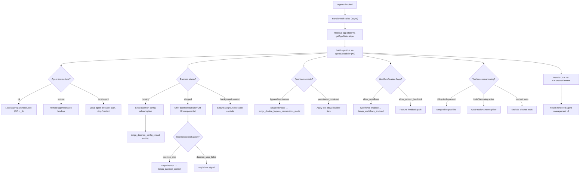

# `/agents`

> Analysis basis: CC v2.1.167 bundle.js (AST extraction + Claude interpretation)
> Minimum version: v2.1.167

---

## Overview

The `/agents` command provides a management interface for agent configurations within Claude Code. It renders a JSX-based UI component (type `local-jsx`) that allows users to inspect, configure, and control agent lifecycle settings — including daemon management, permission modes, tool access policies, and multi-agent team coordination. The command is backed by an async handler (`Mbf`) that assembles application state and passes it to a React element for display.

---

## Registration

| Field | Value |
|---|---|
| type | `local-jsx` |
| name | `agents` |
| description | `Manage agent configurations` |
| module_id | `z9K` |
| load_inline | `true` |
| loc_byte | `12598025` |
| loc_byte_end | `12598150` |
| loc_line | `9054` |
| arbor_handler.name | `Mbf` |
| arbor_handler.fqn | `claude-2.1.167::Mbf` |
| arbor_handler.kind | `AsyncFunction` |
| arbor_handler.resolution_path | `module_id` |
| arbor_handler.n_hits | `0` |

Analysis basis: CC v2.1.167 bundle.js:+12598025

---

## Input Branching

The command has multiple distinct internal branches across agent type selection, daemon lifecycle control, tool permission narrowing, and permission-mode management. A Mermaid flowchart is used.



---

## Behavioral Spec

### 1. Handler Entry and State Retrieval

```
async function agentsCommandHandler(context):
    appState = getAppState(context)                 // b_ → H.getAppState
    agentList = buildAgentList(appState)             // Xv
    element   = createElement(agentManagementUI, agentList)  // ILA.createElement
    return element
```

Analysis basis: CC v2.1.167 bundle.js:+12597876, +12597884, +12597897

---

### 2. Agent List Builder (`Xv`)

The agent list builder (`Xv`) is the central orchestration function for the `/agents` UI. It performs the following steps:

```
function buildAgentList(appState):
    // Resolve agent session entries
    sessionList = buildSessionList(appState)         // wG → Yd, jK, _6, D6

    // Determine agent source type (cli / remote)
    if agentType == "cli":
        resolveLocalAgentPath()                      // GP → _6, Md8
    elif agentType == "remote":
        bindRemoteSession()

    // Apply boolean flags: "yes"/"on" → true, "no"/"off" → false
    parseFlags(sessionList)                          // jK / _6 String coercion

    // Enumerate active agent connections
    activeConnections = filterActiveAgents(appState) // K9H → H.filter, Jk6

    // Resolve tool-access policies per agent
    toolPolicy = resolveToolPolicy(activeConnections) // K9H → k6A, ZCq

    // Assemble supervisor entry
    supervisorEntry = buildSupervisorRecord()        // Y → supervisor literal

    // Register component hooks
    registerComponentHooks()                         // _s_ → iEq, y_

    // Resolve feature and permission flags
    featureState = resolveFeatureFlags()             // zP → if8, wf9, uZ_, BgL

    // Check agent team flag
    if hasAgentTeamsFlag("--agent-teams"):           // B9 → M47, D6
        initializeAgentTeam()

    // Check workflow flags
    if workflowsAllowed("allow_workflows"):          // FgL → D6, Aq
        emitTelemetry("tengu_workflows_enabled")

    // Collect all components into render list
    pushRenderItems(sessionList, supervisorEntry, featureState)  // z.push, Y.push

    return renderedList
```

Analysis basis: CC v2.1.167 bundle.js:+9882061, +9882133, +9882148, +9882162, +9882184, +9882199, +9882211, +9882271, +9882369, +9882387, +9882415, +9882427, +9882438, +9882514, +9882529, +9882557, +9882610, +9882655

---

### 3. Session List Construction (`wG`)

```
function buildSessionList(appState):
    sessions = []
    for each agentEntry in appState:
        normalizeAgentId()        // Yd
        coerceStringFlags()       // jK → String, _6 → String
        registerWithDaemon(D6)    // D6 → dj6, cj6, hu, HwH.has, dq8, C6
        sessions.push(agentEntry)
    return sessions
```

The daemon registry (`D6`) checks an internal set (`HwH.has`) to prevent duplicate registration. If not already present, it calls the daemon initialization chain (`dq8` → `SP_.add`, `yP_`, `xP_`) and the config/timestamp update logic (`C6` → `d6`, `qZ`, `Date.now`, `IVL`).

Analysis basis: CC v2.1.167 bundle.js:+4802016, +4802033, +4802078, +4802195, +3244155, +3244192, +3244227, +3244244, +3244255

---

### 4. App State Fetch with Bootstrap (`H` / `b_`)

```
function getAppStateHelper(context):
    log("[Bootstrap] Fetching")                   // literal at +15797460
    response = fetch(endpoint, {
        headers: {
            "Content-Type": "application/json",   // +15797545, +15797560
            "User-Agent": userAgentString          // +15797579
        },
        timeout: 5000                              // +15797661
    })
    emit telemetry("api_bootstrap_fetch")          // +15797782
    if parseFailed:
        emit "parse_failed"                        // +15797804
    else:
        log("[Bootstrap] Fetch ok")                // +15797834
    
    // Scan result for agent fields
    findField("working_directory")                 // +10944470
    findField("allowed_tools")                     // +10944525
    findField("disallowed_tools")                  // +10944580
    findField("avoid_prompts")                     // +10944641
    findField("permission_mode")                   // +10944743
    findField("bypassPermissions")                 // +10944774
    findField("session")                           // +10945073
    findField("effort")                            // +10945098
    findField("model")                             // +10945111
    findField("max_thinking_tokens")               // +10945123
    findField("flag_settings")                     // +10945149

    return appState
```

Analysis basis: CC v2.1.167 bundle.js:+10944365, +15797458, +15797496, +15797592

---

### 5. Permission Mode Management (`aB`)

```
function managePermissionMode(config):
    if config.bypassPermissions == true:
        setPermissionMode("disable")              // literal "disable" at +4204597
        emitTelemetry("tengu_disable_bypass_permissions_mode")
    applyYamlConfig(yA)                           // yA at +4204543
```

Analysis basis: CC v2.1.167 bundle.js:+10944796, +4204493, +4204497, +4204543, +4204597

---

### 6. Active Agent Connection Filter (`K9H` / `Jk6`)

```
function filterActiveAgents(agentList):
    filtered = agentList.filter(entry =>
        entry.status != "blocked"               // literal "blocked" at +9881428
    )
    // Resolve tool rules per agent
    for agent in filtered:
        toolRules = resolveToolRules(agent)     // k6A → l$6, n$6, VZH, rmA, $Z
        if toolRules.type == "deny":            // literal "deny" at +10676814
            agent.tools = excludeTools(toolRules)
        tag source as:
            "cliArg"          // +10677488
            or "toolsNarrowing"  // +10677509
    return filtered
```

Analysis basis: CC v2.1.167 bundle.js:+9881367, +9881382, +10677551, +10677567, +10677591

---

### 7. Daemon Lifecycle Control (`z` render items — `SH`, `CH`, `xh`, `sp`)

```
function renderDaemonControls(daemonStatus):
    if daemonStatus == "stopped":               // literal at +16233608
        render(DaemonStartButton)               // SH → l, J6
        render(DaemonStopFailedButton)          // CH → l, J6
        emitOnStop("daemon_stop")               // literal at +16233699
        emitOnFail("daemon_stop_failed")        // literal at +16233736
    
    if daemonStatus == "background session":    // literal at +16233651
        render(BackgroundSessionControls)       // xh → yu, EvH, kP_
        emitTelemetry("tengu_daemon_control")   // +16233774
        // firstParty agent flag checked        // literal at +3237265
    
    // Graceful shutdown race
    shutdownResult = Promise.race([             // sp → Promise.race at +16228773
        Promise.all(shutdownPromises),          // +16228787
        timeoutAfter(500)                       // 500ms literal at +16228817
    ])
    if timeout:
        process.exit()                          // +16228856
```

Analysis basis: CC v2.1.167 bundle.js:+16233696, +16233719, +16233771, +16233825, +16228773, +16228787, +16228800, +16228814, +16228856

---

### 8. Feature Flag Resolution (`zP` / `X9` / `FgL`)

```
function resolveFeatureFlags(config):
    // Product feedback flag
    if X9.check("allow_product_feedback"):      // literal at +4185711
        enableProductFeedback()
    
    // Workflows flag
    if FgL.check("allow_workflows"):            // literal at +4187138
        if userTier == "pro":                   // literal at +4187584
            enableWorkflows(D6)
            emitTelemetry("tengu_workflows_enabled")
    
    return featureFlags
```

Analysis basis: CC v2.1.167 bundle.js:+4186811, +4186830, +4186874, +4186902, +4185711, +4187138, +4187263, +4187336

---

### 9. Agent Team Mode (`nN` / `aC_`)

```
function initializeAgentTeamMode(config):
    teamMode = detectTeamMode(config)           // aC_ → tNH, oC_, HO7
    if teamMode == "standard":                  // literal at +6589890
        configureStandardTeam()
    elif teamMode == "tst":                     // literal at +6589969
        configureTestTeam()
    elif teamMode == "tst-auto":                // literal at +6590019
        configureAutoTestTeam()
    
    // Check Vertex AI tool-search beta restriction
    if provider == "vertex":                    // literal at +2101160
        // Tool search disabled for Vertex AI
        // See literal: "[ToolSearch:optimistic] disabled..."  at +6590903
        disableToolSearch()
    
    validateProvider(config)                    // MA → _6
    // Supported providers: bedrock, foundry, anthropicAws, mantle, vertex
    //   literals at +2100952, +2101002, +2101058, +2101112, +2101160
```

Analysis basis: CC v2.1.167 bundle.js:+6590367, +6589878, +6589942, +6590006, +6590033, +6590054, +6590407, +6590559, +6590581

---

### 10. Daemon Status File Polling (`zLK` / `zC6`)

```
function pollDaemonStatus():
    statusPath = join(configDir, "daemon.status.json")  // literal at +12780168
    timestamp  = Date.now()                              // +12780280
    sessionId  = getSessionStore(V9)                     // aNL.getStore at +3374862
    result     = readStatusFile(t8)                      // zC6 → OLK.join, t8
    encoded    = serialize(RH)                           // JSON.stringify at +185264
    return { statusPath, timestamp, sessionId, result }
```

Analysis basis: CC v2.1.167 bundle.js:+12780265, +12780280, +12780312, +12780329, +12780335, +12780154, +12780163, +12780168

---

### 11. Cobalt Ridge / Agent Platform Initialization (`fb` / `y4`)

```
function initAgentPlatform(platformConfig):
    if platform == "windows":                   // literal at +4918734
        usePlatformShim()
    
    resolveEntryPoint(r6)                       // r6 at +4918727
    coerceConfig(_6)                            // _6 at +4918751
    buildAgentId(jK)                            // jK at +4918760
    applyPermissions(uKH)                       // uKH at +4918796
    registerWithDaemon(D6)                      // D6 at +4918825
    emitTelemetry("tengu_cobalt_ridge")         // +4918828

function buildAgentEntry(entryConfig):
    resolveEntryPoint(r6)                       // y4 → r6 at +4918870
    applyPermissions(uKH)                       // uKH at +4918903
```

Analysis basis: CC v2.1.167 bundle.js:+9881962, +9881986, +9881992, +4918727, +4918734, +4918751, +4918760, +4918796, +4918825, +4918828, +4918870, +4918903

---

### 12. Slate Harbor Telemetry (`wG`)

```
function registerAgentInSessionRegistry(agent):
    // Map agent source classification
    if agent.source == "cli":                   // literal at +4802168
        agentClass = "cli"
    elif agent.source == "remote":              // literal at +4802179
        agentClass = "remote"
    
    registerDaemon(D6)                          // +4802195
    emitTelemetry("tengu_slate_harbor")         // +4802198
```

Analysis basis: CC v2.1.167 bundle.js:+4802016, +4802168, +4802179, +4802195, +4802198

---

## State & Side Effects

| Item | Detail |
|---|---|
| Telemetry: `tengu_feature_sad` | Emitted on feature error path (bundle.js:+1011093) |
| Telemetry: `tengu_feature_ok` | Emitted on successful feature activation (bundle.js:+1010950) |
| Telemetry: `tengu_feature_bad` | Emitted on known bad feature state (bundle.js:+1011012) |
| Telemetry: `tengu_disable_bypass_permissions_mode` | Emitted when bypass-permissions mode is disabled (bundle.js:+4204496) |
| Telemetry: `tengu_slate_harbor` | Emitted when an agent session is registered in the CLI/remote registry (bundle.js:+4802198) |
| Telemetry: `tengu_daemon_config_reload` | Emitted when daemon configuration is reloaded (bundle.js:+16212216) |
| Telemetry: `tengu_workflows_enabled` | Emitted when workflow capability is activated (bundle.js:+4187339) |
| Telemetry: `tengu_cobalt_ridge` | Emitted during agent platform initialization (bundle.js:+4918828) |
| Telemetry: `tengu_daemon_control` | Emitted on daemon start/stop control actions (bundle.js:+16233774) |
| Telemetry: `tengu_amber_flint` | Emitted during agent team / daemon registration (bundle.js:+5490905) |
| Hook registration | Component hooks registered via `_s_` → `iEq` / `y_` on render (bundle.js:+9882148) |
| appState changes | `permission_mode`, `bypassPermissions`, `allowed_tools`, `disallowed_tools`, `avoid_prompts`, `session`, `effort`, `model`, `max_thinking_tokens`, `flag_settings` all read/mutated (bundle.js:+10944470–+10945149) |
| Daemon lifecycle | Start, stop, config reload, and graceful shutdown with 500 ms timeout race (bundle.js:+16228817) |
| Sound | <!-- TODO: not found in depth-2 traversal; needs --depth 4 --> |
| Process exit | `process.exit()` called if daemon shutdown timeout exceeded (bundle.js:+16228856) |
| File I/O | Reads `daemon.status.json` from config directory (bundle.js:+12780168) |
| UUID generation | `vP_.randomUUID` called during background session creation (bundle.js:+3236800) |

---

## Version History

| Version | Change |
|---|---|
| v2.1.167 | Initial analysis |

---

## Common Mistakes

1. **Invoking `/agents` expecting a text response** — this command renders a `local-jsx` component, not plain text. The output is a React element; calling it in a context that cannot render JSX will produce no visible output.
2. **Assuming daemon operations are synchronous** — the daemon shutdown path uses `Promise.race` with a 500 ms hard timeout before `process.exit()`. Operations that exceed this window are forcibly terminated.
3. **Confusing `allowed_tools` and `disallowed_tools`** — both fields are read independently during state hydration. Providing both simultaneously may produce unexpected tool availability depending on narrowing order (`cliArg` vs `toolsNarrowing`).
4. **Bypassing permission mode without understanding side effects** — setting `bypassPermissions` will immediately trigger the `tengu_disable_bypass_permissions_mode` telemetry event and apply the `"disable"` permission policy; this is not reversible within the same session without reconfiguration.
5. **Expecting Vertex AI tool-search** — the `/agents` command detects `vertex` as the provider and explicitly disables the tool-search beta header. Setting `ENABLE_TOOL_SEARCH=true` is required to override this restriction.
6. **Using agent teams (`--agent-teams`) without a supported team mode** — only `"standard"`, `"tst"`, and `"tst-auto"` are recognized team mode literals; unrecognized values fall through without initialization.

---

## Appendix — Identifier Mapping

> For bundle debugging only. Identifiers change across versions.

| Identifier | Role |
|---|---|
| `Mbf` | Main async handler for `/agents` command (arbor_handler) |
| `b_` | App-state retrieval helper (wraps `H.getAppState`) |
| `H` | Bootstrap fetch / app-state module |
| `v` | Debug/logging utility (uses `"debug"` literal) |
| `onK` | Log formatting helper |
| `RH` | JSON serializer wrapper (`JSON.stringify`) |
| `G4` | String normalization / redaction utility |
| `EUH` | Extended utility helper (`lWA`) |
| `enK` | File/buffer processing utility (`Buffer.byteLength`, dirname) |
| `Y3` | Secondary state field extractor |
| `uj_` | String split/trim/index/slice helper |
| `q` | File system unlink / general node reference |
| `lHH` | Set membership checker (`i74.has`) |
| `uj` | String replace helper |
| `H9` | Config normalization entry point |
| `m6H` | Model config builder (`Q0`, `aqH`, `yA`, `qB`) |
| `s9` | Model alias resolver (`opusplan`, `sonnet`, `haiku`, `opus`, `best`) |
| `FJ` | Model alias dispatch (`s9`, `_G`) |
| `o6` | Feature flag evaluator (`l`, `J6`) |
| `l` | Feature check primitive |
| `J6` | Feature dispatch (`ym6`) |
| `A` | General array / agent record reference |
| `f` | Stream/file handle reference |
| `L` | Connection/set manager (`q.add`, `q.delete`, `f.finally`) |
| `sy8` | Allowed-tools list builder (`L1`) |
| `L1` | Tool list normalization utility |
| `ty8` | Disallowed-tools list builder (`L1`) |
| `aB` | Permission mode applier (`D6`, `yA`) |
| `D6` | Daemon registration controller (`dj6`, `cj6`, `hu`, `dq8`, `C6`) |
| `dj6` | Daemon entry initializer |
| `cj6` | Daemon config writer |
| `hu` | Daemon hydration helper (`yu`) |
| `dq8` | Daemon dedup / set manager (`SP_.has`, `HwH.get`, `SP_.add`, `yP_`, `xP_`) |
| `C6` | Daemon config timestamp updater (`d6`, `qZ`, `lP_`, `LwH`, `Date.now`, `IVL`) |
| `Xv` | Agent list / UI builder (central orchestration) |
| `wG` | Session registry builder (`Yd`, `jK`, `_6`, `D6`) |
| `Yd` | Agent ID normalizer |
| `jK` | Boolean/string coercion (`String`, "yes"/"on") |
| `_6` | Boolean/string coercion (`String`, "no"/"off") |
| `Y` | Supervisor render list (`$GH`, `q.write`, `mfK`, `T.stop`, `WUK`, `V.start`) |
| `$GH` | Supervisor session record builder |
| `V9` | Session store getter (`aNL.getStore`) |
| `V8` | Session record field |
| `mfA` | Supervisor config helper (`ufA`) |
| `GH` | String coercion for session code |
| `K` | Map/padEnd list helper |
| `mfK` | Supervisor display formatter (`Object.keys`, `Math.max`, `bD`) |
| `T` | Spinner/progress control (`cy6`, `z46`) |
| `cy6` | Spinner stop helper |
| `z46` | Spinner cleanup helper |
| `E` | Agent entry controller (`stop`, `updateConfig`, `start`) |
| `WUK` | Heartbeat handler (`S8H`) |
| `S8H` | Heartbeat literal handler |
| `V` | Agent process controller (`start`) |
| `_s_` | Component hook registration (`iEq`, `y_`) |
| `y_` | React effect / hook utility (`wTH`, `hg8`, `vm6.call`, `Im6.bind`, `DBK`, `GjA.set`) |
| `Im6` | Effect binding helper |
| `zP` | Feature flag router (`if8`, `wf9`, `uZ_`, `BgL`) |
| `if8` | Flag evaluator (`_6`, `aE`) |
| `aE` | Feature flag state accessor |
| `wf9` | Workflow flag resolver (`X9`) |
| `X9` | Permission/feature flag checker (`Yf9`, `pgL.has`, `UgL.has`, `ILH`, `sIH`, `q.includes`) |
| `uZ_` | Workflow enablement gate (`FgL`) |
| `FgL` | Workflow activation handler (`_6`, `D6`, `jK`, `Aq`) |
| `BgL` | Feedback flag handler (`aE`) |
| `K9H` | Active agent filter (`H.filter`, `Jk6`) |
| `Jk6` | Tool rule resolver (`at`, `k6A`, `ZCq`) |
| `at` | Tool rule flattener (`Dy8.flatMap`, `w$`) |
| `k6A` | Tool access policy builder (`l$6`, `n$6`, `VZH`, `rmA`, `$Z`) |
| `ZCq` | Tool rule collector |
| `As_` | Agent entry assembler (`fb`, `H_6`, `y_`) |
| `fb` | Agent entry builder (`r6`, `_6`, `jK`, `uKH`, `D6`) |
| `y4` | Agent entry initializer (`r6`, `uKH`) |
| `z` | Daemon control render list (`SH`, `CH`, `xh`, `sp`) |
| `SH` | Daemon start UI component (`l`, `J6`) |
| `CH` | Daemon stop-failed UI component (`l`, `J6`) |
| `xh` | Background session control component (`yu`, `EvH`, `kP_`) |
| `yu` | Session state helper (`kC`) |
| `EvH` | Session event handler (`bh`) |
| `kP_` | Session UUID / event emitter (`mq8`, `vP_.randomUUID`, `LlH`, `ZB`, `H.emit`) |
| `sp` | Graceful shutdown race handler (`Promise.race`, `Promise.all`, `RLH`, `pLH`, `r8`, `process.exit`) |
| `RLH` | Shutdown initiator (`SLH.shutdown`) |
| `pLH` | Shutdown timeout cleaner (`clearTimeout`, `A2_`) |
| `r8` | Timeout/abort utility (`K`, `Error`, `q`, `setTimeout`, `O`, `clearTimeout`, `L.unref`) |
| `Vg` | Agent team orchestrator (`y4`, `GP`, `ow`, `_6`, `KA6`, `_s_`, `B9`, `CAf`, `bAf`, `As_`, `nN`) |
| `GP` | Local-agent path resolver (`_6`, `Md8`) |
| `Md8` | Local-agent path utility |
| `ow` | Remote agent session binder (`jK`) |
| `KA6` | Agent team key builder |
| `B9` | Agent team flag handler (`_6`, `M47`, `D6`) |
| `M47` | Agent team config utility |
| `CAf` | Agent component A hook wrapper (`kEq`, `y_`) |
| `bAf` | Agent component B hook wrapper (`bEq`, `y_`) |
| `nN` | Agent team mode initializer (`aC_`, `v`, `MA`, `Lf`) |
| `aC_` | Team mode detector (`tNH`, `oC_`, `HO7`, `_6`, `jK`) |
| `MA` | Provider validator (`_6`) |
| `Lf` | Team mode finalizer |
| `Y4` | Feature set version helper |
| `O` | Feature/permission enable checker (`b8`) |
| `b8` | Permission check primitive |
| `$` | Session list reference (`zLK`) |
| `zLK` | Daemon status file reader (`Yo`, `Date.now`, `V9`, `zC6`, `RH`) |
| `Yo` | Status key accessor (`b4H`) |
| `zC6` | Status file path builder (`OLK.join`, `t8`) |

---

Note: index built via Arbor fallback; some signals (telemetry, literals) may be missing — see arbor-fallback.js.