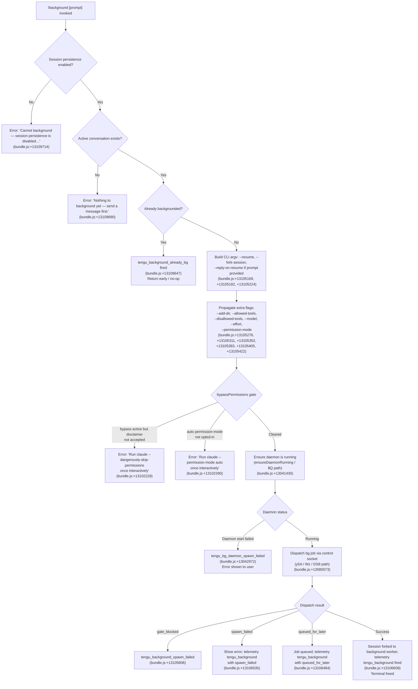

# `/background`

> Analysis basis: CC v2.1.167 bundle.js (AST extraction + Claude interpretation)
> Minimum version: v2.1.167

---

## Overview

`/background` (alias: `/bg`) sends the current interactive REPL session to a background daemon worker, freeing the terminal for other use. It forks the active session into a daemon-managed job, optionally attaching a follow-up prompt, and returns the caller's terminal to a ready state. The command relies on the Claude Code background daemon infrastructure (`fu8` → `Cgf` handler chain) to persist the session.

---

## Registration

| Field | Value |
|---|---|
| type | `local-jsx` |
| name | `background` |
| description | `Send this session to the background and free the terminal` |
| argumentHint | `[prompt]` |
| aliases | `["bg"]` |
| immediate | `null` |
| module_id | `aMK` |
| load_inline | `true` |
| loc_byte | `13110349` |
| loc_byte_end | `13110589` |
| loc_line | `9713` |
| arbor_handler.name | `Cgf` |
| arbor_handler.fqn | `claude-2.1.167::Cgf` |
| arbor_handler.kind | `AsyncFunction` |
| arbor_handler.resolution_path | `module_id` |
| arbor_handler.n_hits | `0` |

Analysis basis: CC v2.1.167 bundle.js:+13110349

---

## Input Branching

The command has more than three distinct outcome paths depending on daemon/session state and user input.



---

## Behavioral Spec

### Top-level handler (`Cgf`)

Analysis basis: CC v2.1.167 bundle.js:+13109633

```
async function backgroundCommandHandler(context):
    // Guard: session persistence must be enabled
    if not sessionPersistenceEnabled(context):
        return renderError("Cannot background — session persistence is disabled, ...")
        // bundle.js:+13109714

    // Guard: there must be an active conversation
    if not hasActiveConversation(context):
        return renderError("Nothing to background yet — send a message first.")
        // bundle.js:+13109890

    // Guard: already in background mode?
    if sessionIsAlreadyBackgrounded(context):
        emit telemetry("tengu_background_already_bg")  // bundle.js:+13109647
        return   // silent no-op

    // Delegate to fork-and-dispatch logic
    await forkSessionToBackground(context)
```

### Argument assembly (`fu8`)

Analysis basis: CC v2.1.167 bundle.js:+13104818

```
function buildBackgroundArgv(sessionInfo, userPrompt, appFlags):
    argv = []

    // Core fork flags
    argv.push("--resume", sessionInfo.sessionId)          // +13105169
    argv.push("--fork-session")                           // +13105182

    if userPrompt is non-empty:
        argv.push("--reply-on-resume", userPrompt)        // +13105224

    // Directory additions
    for each extraDir in appFlags.addedDirs:              // +13105276
        argv.push("--add-dir", extraDir)

    // Tool policy forwarding
    if appFlags.allowedTools:
        argv.push("--allowed-tools", ...)                 // +13105311
    if appFlags.disallowedTools:
        argv.push("--disallowed-tools", ...)              // +13105352

    // Model / effort / permission forwarding
    if appFlags.model:    argv.push("--model", ...)       // +13105383
    if appFlags.effort:   argv.push("--effort", ...)      // +13105405
    if appFlags.permMode: argv.push("--permission-mode", ...) // +13105422

    // Separator before positional prompt if applicable
    argv.push("--")                                       // +13105450

    return argv
```

### Permission pre-flight (`hgf` / `Tgf`)

Analysis basis: CC v2.1.167 bundle.js:+13102059

```
function checkPermissionGates(settings):
    // bypassPermissions gate
    if settings.permissionMode == "bypassPermissions":   // +13102059
        if not disclaimerAcceptedInteractively():
            throw Error("--bg with bypassPermissions requires accepting...")
            // +13102228

    // auto mode gate
    if settings.permissionMode == "auto":                // +13102370
        if not autoModeOptedIn():
            throw Error("--bg with auto mode requires opting in first...")
            // +13102390
```

### Daemon lifecycle (`$Q` — ensure daemon running)

Analysis basis: CC v2.1.167 bundle.js:+13041430

```
async function ensureDaemonRunning():
    emit telemetry("daemon_ensure_running", status="up")   // +13041430

    // Check if service exec path is stale (binary deleted)
    if daemonExecPathStale():
        emit telemetry("tengu_bg_daemon_service_stale_exec") // +13041505
        // Fall back to transient spawn

    // Platform-specific: on Linux without a service, prompt
    if platform == "linux" and not serviceInstalled():
        answer = promptUser("Install as a service now? [y/N/never, or 'once']")
        // +13049026
        emit telemetry("tengu_bg_daemon_cold_start_ask")    // +13042453
        handle answer: yes | once | no | never

    // Spawn transient daemon if needed
    if not daemonReachable():
        spawnResult = spawnTransientDaemon(["run", "--origin", "--spawned-by"])
        // +13042844
        if spawnResult.failed:
            emit telemetry("tengu_bg_daemon_spawn_failed")  // +13042972
            throw Error(spawnResult.reason)

    // Poll until daemon acks (up to 60 000 ms)          // +13043225
    if pollTimeout():
        emit telemetry("daemon_ensure_transient_unreachable") // +13043941
```

### Background dispatch (`y5A`)

Analysis basis: CC v2.1.167 bundle.js:+13079823

```
async function dispatchBackgroundJob(argv, sessionDir, signal):
    emit telemetry("tengu_bg_dispatch")                    // +13081927

    // Create random socket path for this dispatch
    socketPath = path.join(tempDir, randomBytes())         // +13080169

    // Flush timeout guard (2000 ms)                       // +13105113
    await withTimeout(2000, "flush timeout",               // +13105118
        writeDispatchFile(sessionDir, argv)
    )

    // Connect to daemon control socket
    conn = await connectToDaemonSocket(socketPath)         // Wz / DS8 path

    if conn.error == "ENOCONN":                            // +11507271
        emit telemetry("tengu_bg_dispatch_fallback")       // +13082457
        // Retry or surface error

    // Write dispatch request
    result = await sendDispatch(conn, dispatchPayload)

    emit telemetry("tengu_bg_dispatch", result=result.status)
    return result
```

### Fork result handling (`fu8` post-dispatch)

Analysis basis: CC v2.1.167 bundle.js:+13106461

```
function handleDispatchResult(result):
    emit telemetry("tengu_background", outcome=result.outcome)  // +13106609

    switch result.outcome:
        case "gate_blocked":
            emit telemetry("tengu_background_spawn_failed")     // +13105806
            showError("couldn't start in the background — press Enter to retry")
            // +13106169

        case "spawn_failed":
            // telemetry: tengu_background / spawn_failed       // +13106535
            showError(result.reason)

        case "queued_for_later":
            // telemetry: tengu_background / queued_for_later   // +13106484
            showInfo("Session queued for background execution")

        case "repl_background_fork":
            // telemetry: tengu_background / repl_background_fork // +13106461
            showStatus("(backgrounded)")                        // +13107344
            freeTerminal()

        default:
            // session forked; display backgrounded indicator
```

### Away-summary generation (`y` / `rz8`)

Analysis basis: CC v2.1.167 bundle.js:+15656052

When a session is backgrounded it may later generate an away-summary when the
user re-attaches. The guard logic:

```
function maybeGenerateAwaySummary(sessionState):
    // Skip if cache age unknown
    if cacheAge == null:
        log("[awaySummary] skipped: cache age unknown")        // +15656054
        return

    // Skip if stale (threshold 0.9)                           // +15656123
    if staleness > 0.9:
        log("[awaySummary] skipped: cache stale")              // +15656130
        return

    // Skip if near rate limit
    if rateLimitStatus != "allowed":                           // +15656205
        log("[awaySummary] skipped: at or near rate limit")    // +15656218
        return

    // Skip if draft input present
    if draftInputPresent():
        log("[awaySummary] skipped: draft input present")      // +15656301
        return

    // Proceed with summary generation
    emit telemetry("away_summary_generate")                    // +15656532
```

---

## State & Side Effects

| Item | Detail |
|---|---|
| Telemetry — primary | `tengu_background` (outcome field: `repl_background_fork`, `queued_for_later`, `spawn_failed`) — bundle.js:+13106609 |
| Telemetry — already-bg guard | `tengu_background_already_bg` — bundle.js:+13109647 |
| Telemetry — spawn failure | `tengu_background_spawn_failed` — bundle.js:+13105806 |
| Telemetry — daemon lifecycle | `daemon_ensure_running`, `tengu_bg_daemon_spawn_failed`, `tengu_bg_daemon_cold_start_ask`, `tengu_bg_daemon_service_stale_exec`, `daemon_ensure_transient_unreachable` |
| Telemetry — dispatch | `tengu_bg_dispatch`, `tengu_bg_dispatch_fallback`, `tengu_bg_dispatch_rescued` |
| Telemetry — away summary | `away_summary_generate`, `tengu_bg_attach`, `tengu_bg_attach_stall_ms`, `tengu_bg_attach_stall_gave_up`, `tengu_bg_attach_stall_respawn` |
| Telemetry — daemon control socket | `tengu_daemon_control`, `tengu_daemon_config_reload`, `tengu_daemon_idle_exit` |
| Filesystem — dispatch file | Written under `sessionDir/tmp/` via `zf` / `XY` helpers; unlinked on completion |
| Filesystem — control socket | Unix socket path created per-dispatch, unlinked on close via `ipK.unlinkSync` — bundle.js:+16173867 |
| Session fork flag | `--fork-session` appended to child argv — bundle.js:+13105182 |
| Resume flag | `--resume <sessionId>` appended — bundle.js:+13105169 |
| Optional reply flag | `--reply-on-resume <prompt>` appended when argument provided — bundle.js:+13105224 |
| Flush timeout | 2 000 ms hard limit on dispatch-file write — bundle.js:+13105113 |
| Daemon cold-start poll limit | 60 000 ms maximum — bundle.js:+13043225 |
| appState changes | Session is marked `(backgrounded)` — literal at bundle.js:+13107344; mode stored as `"bg"` — bundle.js:+16203426 |
| Terminal | Terminal is freed after successful fork; PTY cleanup calls `A.close` / `q.close` |
| Sound | None detected in depth-2 traversal |

---

## Version History

| Version | Change |
|---|---|
| v2.1.167 | Initial analysis |

---

## Common Mistakes

1. **Running `/background` before sending any message** — the command emits the error `"Nothing to background yet — send a message first."` (bundle.js:+13109890). At least one conversation turn must exist.
2. **Using `/background` with `--dangerously-skip-permissions` without prior interactive acceptance** — the permission pre-flight gate blocks the command with a clear instruction to run the interactive session once first (bundle.js:+13102228).
3. **Using `/background` with `--permission-mode auto` without opting in interactively** — same gate pattern as above; the auto-mode flag must first be accepted in a live session (bundle.js:+13102390).
4. **Expecting a persistent background job when session persistence is disabled** — the command detects this and surfaces `"Cannot background — session persistence is disabled…"` immediately (bundle.js:+13109714).
5. **Calling `/background` in an already-backgrounded session** — the command silently no-ops and emits `tengu_background_already_bg` telemetry; no error is shown but nothing happens either (bundle.js:+13109647).
6. **No running daemon on Linux without a system service** — if the daemon is not installed as a service the command will prompt to install or spawn transiently; transient spawns may time out after 60 000 ms (bundle.js:+13043225).

---

## Appendix — Identifier Mapping

> For bundle debugging only. Identifiers change across versions.

| Identifier | Role |
|---|---|
| `Cgf` | Main handler for `/background` command (AsyncFunction, arbor-resolved) |
| `fu8` | Fork-and-dispatch orchestrator; builds argv and calls daemon |
| `y5A` | Background dispatch function; writes dispatch file, connects to daemon socket |
| `$Q` | Ensure-daemon-running function; manages service lifecycle and cold-start prompts |
| `Tgf` | Inner fork-session executor; handles session file ops and socket negotiation |
| `hgf` | Permission pre-flight checker (bypassPermissions / auto-mode gates) |
| `ki` | Session prep utility; creates tmp dir, copies files, sets up fork environment |
| `Wz` | Low-level daemon control-socket connect-and-write helper |
| `DS8` | Alternate daemon socket connector with timeout/unref logic |
| `VxH` | Socket path resolver helper |
| `xMK` | Dispatch timing / retry metadata tracker |
| `I5A` | Dispatch error classifier (maps error codes to user-facing strings) |
| `R96` | Session rename / fork metadata helper (called from fork path) |
| `XNf` | Agent-query executor used inside rename sub-flow |
| `EG` | Main agent query loop (streaming) |
| `CN8` | App-state mutation during agent execution |
| `FC6` | Daemon-side session runner |
| `i$5` | Daemon-side worker attach / detach handler |
| `n$5` | Worker respawn-on-stall handler |
| `oMH` | Detach-request message sender (sends `"detach-request"` to worker) |
| `Spq` | Daemon-worker detach signal builder |
| `Ae` | Raw PTY write helper |
| `DGH` | Environment/context wrapper for background handler |
| `Mu8` | Post-fork display builder (renders `"(backgrounded)"` indicator) |
| `p5A` | Telemetry registration helper |
| `vE` | Telemetry dispatch (async) |
| `IL` | Promise race with timeout (flush-timeout guard) |
| `Q0` | Session-list collector (enumerates active sessions) |
| `GM` | Daemon-session filter (Boolean coercion step) |
| `w` | Daemon worker spawn/claim manager |
| `mwA` | Spare worker claim and connect |
| `QwA` | Worker lifecycle state machine |
| `h` | Daemon supervisor sweep (low-memory shed, prewarm) |
| `P` | Terminal repaint/supervisor scheduler |
| `y` | Away-summary eligibility guard and generator |
| `rz8` | Away-summary API call executor |
| `HN8` | Away-summary cache-state reader |
| `g` | Supervisor output writer (throttled) |
| `D6` | Daemon telemetry enrichment helper |
| `lx8` | Worker upgrade-attach helper |
| `l$5` | Worker stall-height calculator |
| `r8` | Promise-race with abort-signal helper |
| `R6` | App state accessor |
| `tv` | Core app state store |
| `s$` | App-state read shortcut |
| `mg` | App-state write shortcut |
| `GH` | String coercion utility |
| `_6` | String primitive coercion |
| `V8` | Void/noop sentinel |
| `RH` | JSON serialiser wrapper |
| `U6` | JSON parser wrapper |
| `hH` | Structured logger (error/warn levels) |
| `l` | Logger primitive |
| `J6` | Telemetry event emitter |
| `SH` | Positive telemetry helper (`tengu_feature_ok`) |
| `CH` | Negative telemetry helper (`tengu_feature_bad`) |
| `o6` | Sad-path telemetry helper (`tengu_feature_sad`) |
| `zf` | Atomic file write helper (randomBytes + rename) |
| `XY` | Underlying atomic-write implementation |
| `oj` | File-state cache invalidation after write |
| `e9` | File-stat and content cache manager |
| `RK` | Jobs-directory path builder |
| `sT` | Jobs-root path resolver |
| `tHH` | Claude-config dir / link-scan path enumerator |
| `hW` | Recursive directory walker |
| `iG4` | File line scanner (reads user/assistant turn markers) |
| `LwH` | Config file reader/writer with backup rotation |
| `C6` | Config object with file-watch integration |
| `IVL` | Config file watcher setup |
| `W_` | Settings accessor |
| `mc6` | AsyncLocalStorage-based context store getter |
| `u6` | Context store read utility |
| `P_H` | Relative-path display formatter |
| `G4` | Path truncation / redaction helper |
| `qu8` | Session-ID prefix matcher |
| `lMK` | Resume-flag (`--resume=` / `-r=` / `-r`) parser |
| `Rgf` | Cloud/remote flag checker |
| `nMK` | Session-name flag aggregator |
| `CMK` | Argv map helper |
| `Ggf` | Telemetry counter accumulator |
| `Qc6` | Rate-limit / quota read helper |
| `ygf` | Positional-prompt extractor from argv tail |
| `Y5A` | Cloud-flag presence check |
| `Cc` | Session-state slice helper |
| `QU` | Settings type dispatcher |
| `x8` | Multi-source settings merger |
| `iMK` | Fleet-mode flag parser |
| `qS` | Tool-schema query orchestrator |
| `K4` | Tool registry lookup |
| `oI8` | Tool input schema builder |
| `ME` | Full tool-list normaliser / deduplicator |
| `wLf` | Tool schema serialiser |
| `aIq` | Tool schema cache helper |
| `fuH` | Agent query entry point (slash-command dispatch path) |
| `$e_` | Tool result collector |
| `GzK` | Core agent query loop (main conversation runner) |
| `D2` | Provider credential resolver |
| `MA` | Provider-type selector |
| `YM_` | Managed-key / API-key discriminator |
| `H9` | HTTP client factory |
| `DdH` | Network error classifier |
| `nT` | Non-streaming fallback handler |
| `sK` | Response filter helper |
| `RO` | Compact-boundary inspector |
| `Zy8` | Compact-boundary message builder |
| `YjH` | File-snapshot writer (AbortSignal guarded) |
| `fz` | Snapshot eligibility checker |
| `uF` | Array-check utility |
| `Py8` | Sensitive-pattern detector |
| `TS` | Tool-input sanitiser |
| `cn` | Tool-input array normaliser |
| `v9H` | Tool-name prefix checker |
| `J9` | Daemon-worker session ID reader |
| `dYH` | Daemon-worker config path helper |
| `bH8` | PTY task-type constant |
| `n$K` | Background-mode feature flag name |
| `Cx` | Feature-flag evaluator |

---

Note: index built via Arbor fallback; some signals (telemetry, literals) may be missing — see arbor-fallback.js.