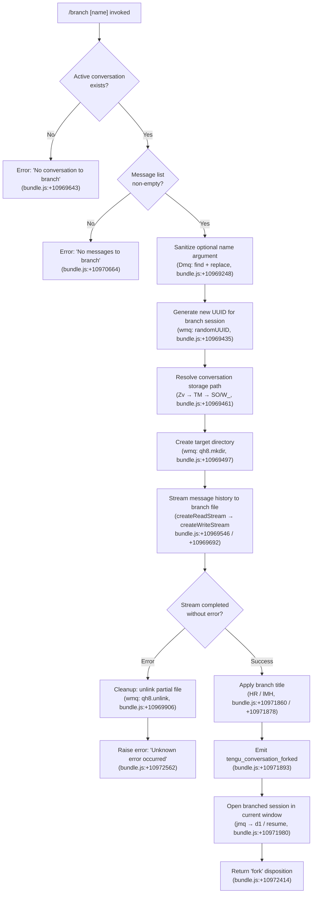

# `/branch`

> Analysis basis: CC v2.1.167 bundle.js (AST extraction + Claude interpretation)
> Minimum version: v2.1.167

---

## Overview

`/branch` creates a diverging copy of the current conversation at its current point, writing the message history up to the branch point into a new session file and optionally applying a user-supplied name. It is the primary mechanism for forking a conversation thread so that the user can explore an alternative direction without losing the original session's context.

---

## Registration

| Field | Value |
|---|---|
| type | `local-jsx` |
| name | `branch` |
| description | `Create a branch of the current conversation at this point` |
| argumentHint | `[name]` |
| module_id | `f_A` |
| load_inline | `true` |
| loc_byte | `12511291` |
| loc_byte_end | `12511468` |
| loc_line | `8941` |
| arbor_handler.name | `bDf` |
| arbor_handler.fqn | `claude-2.1.167::bDf` |
| arbor_handler.kind | `AsyncFunction` |
| arbor_handler.resolution_path | `module_id` |
| arbor_handler.n_hits | `0` |

Analysis basis: CC v2.1.167 bundle.js:+12511291

---

## Input Branching

The command exhibits four distinct execution paths: no conversation present, no messages to branch, successful branch creation, and branch copy failure. A Mermaid flowchart is therefore used.



---

## Behavioral Spec

### 1. Argument Parsing and Name Sanitization

The optional `[name]` argument is extracted from the raw command line. The sanitizer (`Dmq`) uses `Array.find` to locate a name token and then applies `String.replace` to strip characters that are unsafe in filesystem paths.

Analysis basis: CC v2.1.167 bundle.js:+10969248 / +10969326

```
function sanitizeBranchName(rawArgs):
    token = rawArgs.find(...)
    if token is absent:
        return default title "Branched conversation"   // bundle.js:+10969196
    return token.replace(unsafeCharsPattern, "")
```

### 2. Pre-flight Checks

Before any I/O the handler verifies that:
1. An active conversation object exists — if not it surfaces `"No conversation to branch"` (bundle.js:+10969643).
2. The conversation's message list is non-empty — if not it surfaces `"No messages to branch"` (bundle.js:+10970664).

```
function preflightChecks(conversation):
    if conversation is null:
        throw UserError("No conversation to branch")
    if conversation.messages.length == 0:
        throw UserError("No messages to branch")
```

### 3. Branch Session Creation (`wmq` / `copyConversationToFile`)

This is the core I/O routine. It:
1. Generates a fresh UUID (`Omq.randomUUID`) as the new session identifier (bundle.js:+10969435).
2. Resolves the storage directory via the path-building utilities `SO` and `W_` (bundle.js:+10969461 / +10969464).
3. Resolves the full conversation storage path via `Zv` → `TM` (bundle.js:+10969472 / +10969486).
4. Creates the destination directory (`qh8.mkdir`, bundle.js:+10969497).
5. Opens the source JSONL file as a read stream (`Ah8.createReadStream`, bundle.js:+10969546) with encoding `"utf8"` (bundle.js:+10969579).
6. Awaits the stream `"open"` event before proceeding (bundle.js:+10969605).
7. Up to 100 messages are written to the branch file (numeric constant `100`, bundle.js:+10969363); the write stream uses a buffer of 384 bytes (bundle.js:+10969738) and the read uses a 448-byte high-watermark (bundle.js:+10969528).
8. Progress events (`"progress"`, bundle.js:+10970582) are emitted during the copy.
9. On stream error the partial output file is removed (`qh8.unlink`, bundle.js:+10969906) and the process stream is destroyed (`O.destroy`, bundle.js:+10969888).
10. After completion, a readline interface (`zmq.createInterface`, bundle.js:+10969786) is used to iterate and transform message lines — lines of type `"text"` (bundle.js:+10969269) are processed through `H.map` (bundle.js:+10969841); `"content-replacement"` lines (bundle.js:+10970123) are identified and handled distinctly.
11. Writes are flushed and the write stream is closed with `O.end` (bundle.js:+10971060); the stream finish is awaited via `Ymq.finished` (bundle.js:+10971074).

```
async function copyConversationToFile(conversation, branchUUID):
    destDir = resolveStorageDir(SO, W_)
    sourcePath = resolveConversationPath(Zv, TM, conversation.id)
    destPath = join(destDir, branchUUID)
    await mkdir(destPath, { recursive: true })
    readStream = createReadStream(sourcePath, {
        encoding: "utf8",
        highWaterMark: 448        // bundle.js:+10969528
    })
    await once(readStream, "open")
    writeStream = createWriteStream(destPath + "/messages.jsonl", {
        // buffer: 384             // bundle.js:+10969738
    })
    writeStream.on(...)
    lineReader = createInterface({ input: readStream })
    messageCount = 0
    for each line in lineReader:
        if messageCount >= 100: break   // bundle.js:+10969363
        parsed = parseJSONLine(line)
        if parsed.type == "text":
            writeStream.write(transformMessage(parsed))
            messageCount++
        // content-replacement lines handled separately
    writeStream.end()
    await finished(writeStream)
    return destPath
```

### 4. Title and Agent-Name Application

After successful file copy:
- `HR` (`applyCustomTitle`) calls `Zv` and `Q$H` to write a `"custom-title"` metadata record (bundle.js:+10971860 / +13234083), then emits `tengu_session_renamed` (bundle.js:+13234175).
- `lMH` (`applyAgentName`) similarly writes an `"agent-name"` metadata record (bundle.js:+10971878 / +13237105), then emits `tengu_agent_name_set` (bundle.js:+13237203).
- Both utilities call `r4` to persist the metadata entry and `$b6.emit` / `PMA.emit` to broadcast the change.

```
function applyCustomTitle(sessionPath, title):
    writeMetadataRecord(sessionPath, "custom-title", title)
    emit(tengu_session_renamed)

function applyAgentName(sessionPath, agentName):
    writeMetadataRecord(sessionPath, "agent-name", agentName)
    emit(tengu_agent_name_set)
```

Analysis basis: CC v2.1.167 bundle.js:+10971860 / +10971878

### 5. Fork Disposition and Navigation

After the branch session is created the top-level handler (`jmq`) sets the session-open disposition to `"fork"` (bundle.js:+10972414) and calls the session navigation helper (`d1`, using `H.indexOf` / `H.slice`, bundle.js:+10971980) to switch the current window to the newly branched session. The timestamp of the branch point is captured via `z.toISOString()` / `z.getTime()` (bundle.js:+10971983 / +10972032).

```
async function handleBranchCommand(args, conversation):
    sanitizedName = sanitizeBranchName(args)
    preflightChecks(conversation)
    branchUUID = randomUUID()
    destPath = await copyConversationToFile(conversation, branchUUID)
    applyCustomTitle(destPath, sanitizedName)
    applyAgentName(destPath, "auto")   // bundle.js:+10971847
    emit(tengu_conversation_forked)    // bundle.js:+10971893
    navigateToSession(branchUUID, disposition="fork")
```

Analysis basis: CC v2.1.167 bundle.js:+10972414 / +10971893

---

## State & Side Effects

| Item | Detail |
|---|---|
| Telemetry | `tengu_conversation_forked` (bundle.js:+10971893), `tengu_session_renamed` (bundle.js:+13234175), `tengu_agent_name_set` (bundle.js:+13237203) |
| New session file | Branch session JSONL written to resolved storage directory under new UUID |
| Metadata records | `"custom-title"` and `"agent-name"` records appended to branch session metadata |
| Session navigation | Current window navigates to the new branch session with `"fork"` disposition |
| Error cleanup | On stream failure, partial destination file is unlinked via `qh8.unlink` |
| Message limit | Maximum 100 messages copied into the branch (bundle.js:+10969363) |
| Default title | Falls back to `"Branched conversation"` when no name argument is provided (bundle.js:+10969196) |
| Default agent name | Set to `"auto"` (bundle.js:+10971847) |

---

## Version History

| Version | Change |
|---|---|
| v2.1.167 | Initial analysis |

---

## Common Mistakes

1. **Branching with no active conversation** — `/branch` called when no session is loaded produces `"No conversation to branch"`. Ensure a conversation is open before invoking the command.
2. **Branching an empty conversation** — If the conversation has no messages yet, the command exits with `"No messages to branch"`. At least one exchange must be present.
3. **Branch name with special characters** — Characters that are unsafe in file paths are silently stripped from the supplied name. The final branch title may differ from what was typed.
4. **Assuming all messages are copied** — Only the first 100 messages are written into the branch file. Very long conversations will be truncated at that limit.
5. **Expecting to stay in the original session** — `/branch` immediately navigates the current window to the new branch session. To resume the original, the user must explicitly switch back.

---

## Appendix — Identifier Mapping

> For bundle debugging only. Identifiers change across versions.

| Identifier | Role |
|---|---|
| `bDf` | Main handler for `/branch` command (AsyncFunction) |
| `jmq` | Top-level branch orchestrator; calls copy, title, navigation helpers |
| `wmq` | Conversation file copy routine (stream-based JSONL copy) |
| `Dmq` | Branch name sanitizer (find + replace on raw args) |
| `CDf` | Line-type classifier and message-set builder used during copy |
| `Mi` | Git worktree detection helper called during path resolution |
| `HR` | Custom-title metadata writer (`"custom-title"` record) |
| `lMH` | Agent-name metadata writer (`"agent-name"` record) |
| `Q$H` | Low-level metadata append (appendFileSync + mkdirSync) |
| `jmq` | Session navigation after fork (also entry point) |
| `d1` | Session ID slicer/indexer used for navigation |
| `Zv` | Conversation storage path resolver |
| `TM` | Storage path builder (joins dir components) |
| `SO` | Storage-root resolver |
| `W_` | Working directory resolver |
| `R6` | Path utility (used by multiple path helpers) |
| `qy` | Auxiliary path helper |
| `hH` | Log/error utility |
| `AA` | Error string formatter |
| `_6` | String coercion helper |
| `s$` | Session metadata reader |
| `r4` | Metadata persistence writer |
| `ed` | Date.now wrapper for branch timestamp |
| `mz6` | Config read/write helper (reads/writes JSON config files) |
| `SV` | String escape/replace utility |
| `xR` | Path join sub-helper |
| `tv` | Low-level path primitive |
| `V8` | Error class wrapper |
| `h8` | Error handler / catch helper |
| `RH` | JSON.stringify wrapper |
| `U6` | JSON.parse wrapper |
| `GH` | String coercion wrapper |
| `Tf` | Error type helper |
| `b8` | Stream event handler |
| `ym6` | Base path primitive |
| `J6` | Logger/emitter helper |
| `l` | Logger utility |
| `IuH` | Buffer allocation helper (used in Mi worktree detection) |
| `_MH` | Worktree detection implementation |
| `q3K` | Directory listing helper for worktree/file completion |
| `S$` | Session state helper |