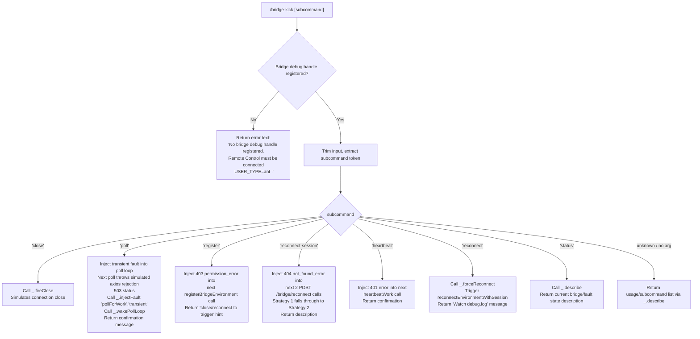

# `/bridge-kick`

> Analysis basis: CC v2.1.167 bundle.js (AST extraction + Claude interpretation)
> Minimum version: v2.1.167

---

## Overview

`/bridge-kick` is a developer-facing diagnostic command that injects synthetic Remote Control failures into the Claude Code bridge subsystem for recovery testing purposes. It operates exclusively in sessions where a bridge debug handle is registered (i.e., `USER_TYPE=ant` sessions with an active Remote Control connection), and dispatches one of several fault injection modes — covering poll failures, registration errors, reconnect failures, heartbeat faults, and forced reconnects — based on a subcommand argument supplied by the user.

---

## Registration

| Field | Value |
|---|---|
| type | `local` |
| name | `bridge-kick` |
| description | `Inject Remote Control failures for recovery testing` |
| loc_byte | `12623438` |
| loc_byte_end | `12623617` |
| supportsNonInteractive | `false` |
| load_inline | `true` |
| load_ident | `xbf` |
| arbor_handler.name | `xbf` |
| arbor_handler.fqn | `claude-2.1.167::xbf` |
| arbor_handler.kind | `AsyncFunction` |
| arbor_handler.resolution_path | `load_ident` |
| arbor_handler.n_hits | `0` |

Analysis basis: CC v2.1.167 bundle.js:+12623438

The handler is registered via an inline `load: () => Promise.resolve({ call: xbf })` shape (no separate `module_id`). The Arbor symbol graph resolved the handler as `xbf` via the `load_ident` resolution path. Analysis of all call edges originates at `xbf`.

---

## Input Branching

The command parses a single subcommand token from the user's input and dispatches across 7+ distinct branches. A Mermaid flowchart is used.



Analysis basis: CC v2.1.167 bundle.js:+12621197 through +12623351

---

## Behavioral Spec

### 1. Guard: Debug Handle Availability

Before performing any action, the handler checks whether a bridge debug handle is currently registered. If no handle is present (i.e., the session is not a `USER_TYPE=ant` session with an active Remote Control connection), the command immediately returns a result of type `"text"` containing the message:

> "No bridge debug handle registered. Remote Control must be connected (USER_TYPE=ant)."

No fault injection is attempted. The command is effectively a no-op for standard user sessions.

Analysis basis: CC v2.1.167 bundle.js:+12621221, +12621234

```
async function bridgeKickHandler(context):
    debugHandle = acquireDebugHandle(context)  // i9K
    if debugHandle is null or undefined:
        return textResult("No bridge debug handle registered. Remote Control must be connected (USER_TYPE=ant).")

    subcommand = context.input.trim()  // H.trim
    return dispatchSubcommand(debugHandle, subcommand)
```

### 2. Subcommand Dispatch

After the guard passes, the trimmed input string is used as a subcommand key. The handler coerces any numeric suffix (via `Number` / `Number.isFinite`) where applicable — for example, for subcommands that accept a repeat count or HTTP status override.

Analysis basis: CC v2.1.167 bundle.js:+12621333, +12621384, +12621398

```
function dispatchSubcommand(handle, subcommand):
    match subcommand:
        case "close":
            return handleClose(handle)
        case "poll":
            return handlePollFault(handle)
        case "register":
            return handleRegisterFault(handle)
        case "reconnect-session":
            return handleReconnectSessionFault(handle)
        case "heartbeat":
            return handleHeartbeatFault(handle)
        case "reconnect":
            return handleForceReconnect(handle)
        case "status":
            return handleDescribe(handle)
        default:
            return handleDescribe(handle)
```

### 3. `close` — Fire Connection Close

Calls `_.fireClose` on the debug handle to simulate an abrupt connection-close event. This exercises the bridge's reconnection logic from a clean-close trigger.

Analysis basis: CC v2.1.167 bundle.js:+12621369, +12621486

```
function handleClose(handle):
    handle.fireClose()
    return textResult("Connection close fired.")
```

### 4. `poll` — Inject Transient Poll Failure

Sets up the debug handle so that the **next** invocation of the `pollForWork` loop throws a transient axios-style rejection with HTTP status `503`. After injecting the fault, the poll loop is woken immediately so the fault is exercised without waiting for the natural poll interval.

- Fault type string: `"transient"` (Analysis basis: CC v2.1.167 bundle.js:+12621615)
- Target function label: `"pollForWork"` (Analysis basis: CC v2.1.167 bundle.js:+12621656)
- Simulated HTTP status: `503` (Analysis basis: CC v2.1.167 bundle.js:+12621694)
- Confirmation message: "Next poll will throw a transient (axios rejection). Poll loop woken." (Analysis basis: CC v2.1.167 bundle.js:+12621744)

```
function handlePollFault(handle):
    handle.injectFault("pollForWork", "transient", statusCode=503)
    handle.wakePollLoop()
    return textResult("Next poll will throw a transient (axios rejection). Poll loop woken.")
```

### 5. `register` — Inject Registration 403

Injects a `403 permission_error` into the next `registerBridgeEnvironment` call. Because registration occurs only after a close/reconnect cycle, the confirmation message instructs the tester to trigger a close or reconnect to activate the injected fault.

- Target function label: `"registerBridgeEnvironment"` (Analysis basis: CC v2.1.167 bundle.js:+12622244)
- Simulated HTTP status: `403` (Analysis basis: CC v2.1.167 bundle.js:+12622292)
- Error type: `"permission_error"` (Analysis basis: CC v2.1.167 bundle.js:+12622306)
- Confirmation message fragment: "Next registerBridgeEnvironment will 403. Trigger with close/reconnect." (Analysis basis: CC v2.1.167 bundle.js:+12622354)

```
function handleRegisterFault(handle):
    handle.injectFault("registerBridgeEnvironment", "permission_error", statusCode=403)
    return textResult("Next registerBridgeEnvironment will 403. Trigger with close/reconnect.")
```

### 6. `reconnect-session` — Inject Double Reconnect 404

Injects a `404 not_found_error` into the **next 2** `POST /bridge/reconnect` calls (i.e., `reconnectSession` target). This forces doReconnect Strategy 1 to fail and fall through to Strategy 2, testing the multi-strategy reconnection path.

- Target function label: `"reconnectSession"` (Analysis basis: CC v2.1.167 bundle.js:+12622712)
- Simulated HTTP status: `404` (Analysis basis: CC v2.1.167 bundle.js:+12621944)
- Error type: `"not_found_error"` (Analysis basis: CC v2.1.167 bundle.js:+12621948)
- Repeat count: `2` (inferred from confirmation message content)
- Confirmation message fragment: "Next 2 POST /bridge/reconnect calls will 404. doReconnect Strategy 1 falls through to Strategy 2." (Analysis basis: CC v2.1.167 bundle.js:+12622812)

```
function handleReconnectSessionFault(handle):
    handle.injectFault("reconnectSession", "not_found_error", statusCode=404, repeatCount=2)
    return textResult("Next 2 POST /bridge/reconnect calls will 404. doReconnect Strategy 1 falls through to Strategy 2.")
```

### 7. `heartbeat` — Inject Heartbeat 401

Injects a `401` error into the next `heartbeatWork` execution, simulating an authentication failure during the bridge heartbeat cycle.

- Target function label: `"heartbeatWork"` (Analysis basis: CC v2.1.167 bundle.js:+12622980)
- Simulated HTTP status: `401` (Analysis basis: CC v2.1.167 bundle.js:+12622947)
- Subcommand token: `"heartbeat"` (Analysis basis: CC v2.1.167 bundle.js:+12622917)

```
function handleHeartbeatFault(handle):
    handle.injectFault("heartbeatWork", statusCode=401)
    return textResult("Next heartbeat will respond with 401.")
```

### 8. `reconnect` — Force Immediate Reconnect

Calls `_.forceReconnect` on the debug handle, which in turn invokes `reconnectEnvironmentWithSession()` synchronously. The user is directed to watch `debug.log` to observe the reconnect flow.

- Confirmation message: "Called reconnectEnvironmentWithSession(). Watch debug.log." (Analysis basis: CC v2.1.167 bundle.js:+12623251)

Analysis basis: CC v2.1.167 bundle.js:+12623194, +12623213

```
function handleForceReconnect(handle):
    handle.forceReconnect()
    return textResult("Called reconnectEnvironmentWithSession(). Watch debug.log.")
```

### 9. `status` — Describe Current State

Calls `_.describe` on the debug handle, which returns a human-readable summary of the bridge's current connection state and any pending injected faults. Also used as the default/fallback when no recognised subcommand is provided, effectively acting as a usage/help path.

Analysis basis: CC v2.1.167 bundle.js:+12623317, +12623351

```
function handleDescribe(handle):
    description = handle.describe()
    return textResult(description)
```

### 10. Fatal / Auth Error Fault Modes

The literals also reveal a `"fatal"` fault type string and an `"authentication_error"` string present in the handler's scope, suggesting additional internal fault categories that may be reachable via extended subcommands or internal wiring not directly exposed as named subcommand tokens in this version.

- `"fatal"` fault string: Analysis basis: CC v2.1.167 bundle.js:+12622038
- `"authentication_error"` string: Analysis basis: CC v2.1.167 bundle.js:+12621966

---

## State & Side Effects

| Item | Detail |
|---|---|
| Telemetry | `tengu_feature_sad` (bundle.js:+1011093) — fired via the `o6` → `l` call path, likely on error/sad-path feature usage |
| Bridge debug handle | Reads the registered debug handle via `i9K` (acquireDebugHandle); no write to persistent state |
| Fault injection state | Writes pending-fault entries into the bridge debug handle's internal fault queue; these are consumed on the next matching bridge operation |
| Poll loop | `_.wakePollLoop` immediately wakes the poll loop when the `poll` subcommand is used, causing the injected fault to be exercised without delay |
| `forceReconnect` | `_.forceReconnect` triggers a live `reconnectEnvironmentWithSession()` call — has immediate network-level side effects |
| stdout / return | All subcommands return a `"text"` type result object to the CLI shell for display |
| appState changes | None detected in depth-2 traversal |
| Sound | None detected |
| Log file | `reconnect` subcommand directs user to observe `debug.log` for side effects |

---

## Version History

| Version | Change |
|---|---|
| v2.1.167 | Initial analysis |

---

## Common Mistakes

1. **Running outside a `USER_TYPE=ant` Remote Control session.** The command will immediately return the "No bridge debug handle registered" error for any standard user session. The debug handle must be actively registered before the command is invoked.

2. **Expecting the `poll` fault to trigger instantly without `wakePollLoop`.** The fault is injected and the poll loop is also woken by the command itself — but a tester manually re-registering faults outside this command would need to explicitly wake the loop or wait for the next natural poll interval.

3. **Using `reconnect-session` when only one reconnect call needs to fail.** This subcommand injects the fault for the next **2** POST calls; if the test only requires a single 404, both strategy fallback legs will be exercised, which may not be the intended scenario.

4. **Confusing `close` and `reconnect`.** `close` fires a connection-close event (exercises the close → auto-reconnect path), while `reconnect` directly calls `reconnectEnvironmentWithSession()` (bypasses the close trigger and exercises the reconnect path in isolation).

5. **Expecting persistent fault state across sessions.** Injected faults are held in the in-memory debug handle and are consumed once triggered; restarting the session or losing the bridge connection will clear any pending injected faults.

6. **Providing no subcommand and expecting an error.** The default/unknown subcommand path falls through to `_.describe`, returning the current bridge state description rather than an error message.

---

## Appendix — Identifier Mapping

> For bundle debugging only. Identifiers change across versions.

| Identifier | Role |
|---|---|
| `xbf` | Main handler for `/bridge-kick` (AsyncFunction); entry point resolved via `load_ident` |
| `i9K` | Acquire / look up the registered bridge debug handle |
| `H` | Bootstrap fetch / HTTP utility; also used as a general call-site variable in multiple contexts |
| `v` | Internal log or output channel writer (writes `"debug"` level entries) |
| `onK` | Log-level routing helper called by `v` |
| `vPA` | Sub-helper within log routing (`sdK`, `tdK` targets) |
| `RH` | JSON serialization helper (wraps `JSON.stringify`) |
| `_` | Contextual object; in `xbf` scope holds bridge debug handle methods (`fireClose`, `injectFault`, `wakePollLoop`, `forceReconnect`, `describe`) |
| `G4` | String path / token manipulation utility (replace, slice, lastIndexOf) |
| `q0A` | Map-based subcommand or token list builder |
| `q` | File unlink helper (`ipK.unlinkSync`) |
| `A` | Lowercase / file path normalisation helper |
| `EUH` | Writer wrapper calling `lWA` → `H.write` |
| `lWA` | Low-level stream write wrapper |
| `enK` | Log-file append / rotation manager (mkdir, appendFile, stat, rename, unlink) |
| `npH` | Async queue / debounce scheduler (clearTimeout, setTimeout, setImmediate, push/join arrays) |
| `YKH` | Path join + token assembly helper (`i76`, `IHH.join`, `t8`, `R6`) |
| `d6` | Utility called during log-file path setup |
| `U76` | Directory utility checking for `EISDIR` (`V8` sub-call) |
| `M0A` | Path join helper for log file locations (`IHH.join`, `R6`) |
| `cl8` | Log rotation helper (stat → endsWith `.txt` → rename → unlink) |
| `tnK` | Bound log-flush callback (mkdir, appendFile, rotation, byte-length checks) |
| `j9` | Hook/listener registration helper (`VPA.register`) |
| `Y3` | Bootstrap state check helper |
| `uj_` | Input token splitter (split, trim, indexOf, slice) |
| `lHH` | Set membership checker (`i74.has`) |
| `uj` | String sanitiser (replace) |
| `H9` | Model/token resolution entry point (`m6H`, `s9`, `FJ`) |
| `m6H` | Model metadata resolver (`Q0`, `aqH`, `yA`, `qB`) |
| `Q0` | Model constant lookup |
| `aqH` | Model alias resolver |
| `qB` | Model string parser (trim, map, startsWith, includes, anthropic-prefix check) |
| `s9` | Model name normalisation (toLowerCase, replace, alias expansion) |
| `Y2` | Model version resolver (`R4H`) |
| `h4H` | Model family membership check (`y4H.includes`) |
| `CI` | Model tier classifier (`lM`, `N5`) |
| `DdH` | Model deprecation checker (`N5`) |
| `bT` | Model capability resolver (`lM`, `N5`, `MA`) |
| `cP1` | Model capability wrapper calling `bT` |
| `lM` | Provider mapping helper (`MA`) |
| `VH8` | Model list membership check (`HKL.includes`) |
| `wdH` | Model family resolver (`_6`) |
| `FJ` | Model resolution finaliser (`s9`, `_G`) |
| `_G` | Full model descriptor builder (`GA`, `g6H`, `gYH`, `jdH`, `bT`, `z2`, `lM`, `MA`, `N5`, `CI`) |
| `o6` | Feature-sad telemetry emitter (`l`, `J6`) |
| `l` | Telemetry event dispatcher (`tengu_feature_sad`) |
| `J6` | Telemetry transport / sink (`ym6`) |
| `ym6` | Low-level telemetry send primitive |

---

Note: index built via Arbor fallback; some signals (telemetry, literals) may be missing — see arbor-fallback.js.