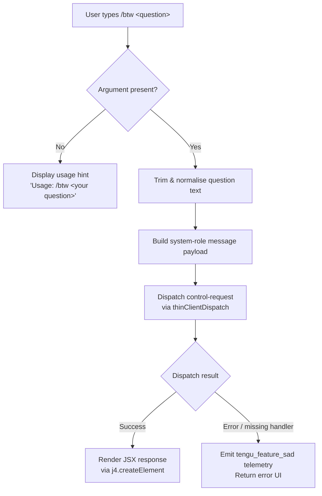

# `/btw`

> Analysis basis: CC v2.1.167 bundle.js (AST extraction + Claude interpretation)
> Minimum version: v2.1.167

---

## Overview

`/btw` ("by the way") allows the user to pose a quick side question to the agent without disrupting the flow of the main conversation. It is a `local-jsx` command that dispatches a `control-request` through the thin-client path and executes immediately, injecting the question as a `system`-role message before returning a JSX-rendered response.

---

## Registration

| Field | Value |
|---|---|
| type | `local-jsx` |
| name | `btw` |
| description | Ask a quick side question without interrupting the main conversation |
| argumentHint | `<question>` |
| immediate | `true` |
| thinClientDispatch | `control-request` |
| module_id | `Pmq` |
| load_inline | `true` |
| loc_byte | `10978931` |
| loc_byte_end | `10979170` |
| loc_line | `7280` |
| arbor_handler.name | `QDf` |
| arbor_handler.fqn | `claude-2.1.167::QDf` |
| arbor_handler.kind | `AsyncFunction` |
| arbor_handler.resolution_path | `module_id` |
| arbor_handler.n_hits | `0` |

Analysis basis: CC v2.1.167 bundle.js:+10978931

---

## Input Branching

Three distinct input paths exist: missing argument, valid question text, and an internal dispatch/render fork depending on the thin-client control-request outcome.



Analysis basis: CC v2.1.167 bundle.js:+10978522 (handler entry `QDf`), +10978524 (usage literal), +10978563 (system role literal), +1011091 (error path `o6`/`l`)

---

## Behavioral Spec

### Main Handler — `asyncBtwCommandHandler` (`QDf`)

```
async function asyncBtwCommandHandler(commandContext):
    question = commandContext.args.trim()

    if question is empty:
        return renderUsageError("Usage: /btw <your question>")
        // literal at bundle.js:+10978524

    systemPayload = buildSystemMessage(question)
        // role = "system" (bundle.js:+10978563)

    sessionContext = await fetchSessionContext()
        // calls bootstrapFetcher (H) → bundle.js:+10978586

    jsxElement = j4.createElement(
        responseComponent,
        { payload: systemPayload, session: sessionContext }
    )
    // bundle.js:+10978632

    return jsxElement
```

Analysis basis: CC v2.1.167 bundle.js:+10978522

---

### Bootstrap Fetcher — `bootstrapFetcher` (`H`)

```
async function bootstrapFetcher(url, options):
    log("[Bootstrap] Fetching", url)
    // literal at bundle.js:+15797460

    headers = {
        "Content-Type": "application/json",   // +15797545 / +15797560
        "User-Agent": <clientUserAgent>        // +15797579
    }

    response = await fetchWithTimeout(url, headers, timeout=5000)
    // timeout literal at bundle.js:+15797661

    if parse fails:
        emit telemetry("api_bootstrap_fetch", { result: "parse_failed" })
        // literals at +15797782 / +15797804
        return null

    log("[Bootstrap] Fetch ok")
    // literal at +15797834
    return parsedData
```

Analysis basis: CC v2.1.167 bundle.js:+15797458

---

### Message Normalisation — `normaliseInput` (`v`)

```
function normaliseInput(rawText, modelHints):
    stripped   = stripRedactedSections(rawText)     // "[REDACTED]" literal +198252
    upper      = rawText.toUpperCase()              // +206696
    trimmed    = rawText.trim()                     // +206719
    extension  = resolveFileExtension(rawText)      // G4 path, +206716

    if modelHints includes relevant model token:
        tag = selectModelTag(modelHints)            // s9 path
    
    result = buildNormalisedMessage(trimmed, extension, tag)
    return result
```

Analysis basis: CC v2.1.167 bundle.js:+206594

---

### File-Extension Resolver — `resolveFileExtension` (`G4`)

```
function resolveFileExtension(text):
    mapped = applyExtensionMapping(text)            // q0A, +198173
    replaced = text.replace(pattern, mapped)        // +198200
    lastDot = replaced.lastIndexOf(".")             // +198336
    if lastDot >= 0:
        return replaced.slice(lastDot)              // +198362
    return replaced.at(index)                       // +198310
```

Analysis basis: CC v2.1.167 bundle.js:+206716

---

### Conversation-Log Writer — `conversationLogWriter` (`enK`)

Called to persist the side question and any agent response to the session log.

```
function conversationLogWriter(sessionId, messageBlock):
    logDir    = path.dirname(sessionLogPath)            // IHH.dirname, +206115
    byteCount = Buffer.byteLength(messageBlock)         // +206290

    if logDir does not exist:
        fs.mkdir(logDir, { recursive: true })           // tnK → ly.mkdir, +205836

    appendToLog(logDir, messageBlock)                   // ly.appendFile, +205895
    rotateLogs(logDir)                                  // cl8, +206284

    scheduleNextFlush(debouncer)                        // npH timeout logic, +206082
    registerCleanupHook(hookRegistry)                   // j9 → VPA.register, +206445
```

Analysis basis: CC v2.1.167 bundle.js:+206755

---

### Debounced Log Flush — `debouncedFlush` (`npH`)

```
function debouncedFlush(pendingChunks, options):
    clearTimeout(currentTimer)                  // +59783
    merged = pendingChunks.join("")             // $.join, +59857
    lines  = lineBuffer.join("\n")              // L.join, +59901

    if immediate flush requested:
        setImmediate(flushCallback)             // +60040
    else:
        currentTimer = setTimeout(             // +59947
            flushCallback,
            delay /* 1000 ms, +59671 */
        )
    pendingChunks.push(nextChunk)              // +59982
    lineBuffer.push(nextLine)                  // +60131
```

Analysis basis: CC v2.1.167 bundle.js:+206082

---

### Config Save with Lock — `saveConfigWithLock` (`aP_`)

Side-effect path when `/btw` triggers a settings checkpoint.

```
async function saveConfigWithLock(configPath, newConfig):
    dir = path.dirname(configPath)              // dD.dirname, +3265182
    fs.mkdirSync(dir, { recursive: true })      // L.mkdirSync, +3265203

    timestamp = Date.now()                      // +3265248

    try:
        acquireLock(configPath)
    catch timeout:
        emit telemetry("tengu_config_lock_contention")  // +3265476
        log("error", "Lock acquisition took longer than expected…")
        // literal at +3265387

    cached  = readCachedConfig()
    onDisk  = readConfigFromDisk(configPath)    // q.readFileSync, +3267476

    if cached has auth AND onDisk is missing auth:
        emit telemetry("tengu_config_auth_loss_prevented")  // +3265955
        log("saveConfigWithLock: re-read config is missing auth…")
        // literal at +3265803
        return  // refuse write

    atomicWrite(configPath, newConfig)          // $$6 atomic write path
    // backup count limit: 5 (literal +3266406)
    // lock timeout: 60000 ms (literal +3266157)
    // file mode: 0o600 (384 decimal, literal +3266688)
```

Analysis basis: CC v2.1.167 bundle.js:+3265176

---

### Error / Feature-Sad Path — `featureSadHandler` (`o6`)

```
function featureSadHandler(error, context):
    emit telemetry("tengu_feature_sad")         // +1011093
    renderErrorComponent(error, context)        // l → JSX error block, +1011091
    routeToErrorUI(context)                     // J6 → ym6, +1011127
```

Analysis basis: CC v2.1.167 bundle.js:+1011091

---

## State & Side Effects

| Item | Detail |
|---|---|
| Telemetry — `tengu_feature_sad` | Fired when the command's main feature path errors (bundle.js:+1011093) |
| Telemetry — `tengu_config_lock_contention` | Fired when config lock takes longer than expected (bundle.js:+3265476) |
| Telemetry — `tengu_config_stale_write` | Fired when a stale config write is detected (bundle.js:+3265612) |
| Telemetry — `tengu_config_parse_error` | Fired when the on-disk config cannot be parsed (bundle.js:+3268051) |
| Telemetry — `tengu_config_auth_loss_prevented` | Fired when an auth-wiping write is refused (bundle.js:+3265955) |
| Telemetry — `tengu_bg_dispatch_sigkill_escalate` | Fired when background worker escalated to SIGKILL (bundle.js:+16196804) |
| Telemetry — `tengu_bg_dispatch_low_mem` | Fired on low-memory condition during dispatch (bundle.js:+16197405) |
| Telemetry — `tengu_bg_spare_enable` | Fired when spare background worker pool is enabled (bundle.js:+16198109) |
| Telemetry — `tengu_bg_spare_claim` | Fired when a spare worker is claimed (bundle.js:+16198237) |
| Telemetry — `tengu_bg_spare_claim_fail` | Fired when spare claim fails (bundle.js:+16198503) |
| Telemetry — `tengu_daemon_control` | Fired on daemon control operations (bundle.js:+16233774) |
| Telemetry — `tengu_daemon_config_reload` | Fired on daemon config reload (bundle.js:+16212216) |
| Telemetry — `tengu_bg_retire_pinned_low_mem` | Fired when pinned workers are retired under low memory (bundle.js:+16201409) |
| Telemetry — `tengu_bg_prewarm_per_sweep` | Fired per background prewarm sweep (bundle.js:+16201530) |
| Hook registration | `j9` → `VPA.register` registers a cleanup hook for the log writer (bundle.js:+60369) |
| appState changes | Session log appended via `ly.appendFile`; config checkpoint written atomically via `$$6` (bundle.js:+205895, +1058550) |
| thinClientDispatch | Sends a `control-request` message type to the thin client layer |
| Immediate execution | `immediate: true` — command fires without waiting for existing turns to settle |
| Sound | <!-- TODO: not found in depth-2 traversal; needs --depth 4 --> |

---

## Version History

| Version | Change |
|---|---|
| v2.1.167 | Initial analysis |

---

## Common Mistakes

1. **Omitting the argument**: `/btw` with no text triggers the usage-hint path (`"Usage: /btw <your question>"`) rather than a conversational reply. Always supply a question string.
2. **Expecting turn interruption**: The command is `immediate` and dispatched as a `control-request`, meaning it runs as a side-channel message. It does not cancel or pause a running tool-use turn.
3. **Assuming chat-role injection**: The question is injected with role `"system"` (bundle.js:+10978563), not as a `user` turn. Downstream tool parsing that relies on role order may behave unexpectedly.
4. **Treating it as a prompt-type command**: `/btw` is `local-jsx`, not `prompt`. It renders a JSX component; its output is not raw text fed back into the main conversation thread.
5. **Concurrent config writes**: If another Claude instance holds the config lock when `/btw` triggers a settings checkpoint, the `tengu_config_lock_contention` event fires and the write is deferred — the side question still proceeds independently.

---

## Appendix — Identifier Mapping

> For bundle debugging only. Identifiers change across versions.

| Identifier | Role |
|---|---|
| `QDf` | Main async handler for `/btw` command (`asyncBtwCommandHandler`) |
| `H` | Bootstrap fetcher / generic HTTP utility |
| `v` | Input normalisation function |
| `onK` | Argument parsing helper |
| `vPA` | Sub-argument validator |
| `RH` | JSON serialiser wrapper |
| `G4` | File-extension resolver |
| `q0A` | Extension mapping table iterator |
| `EUH` | Stream/write coordinator |
| `lWA` | Low-level write wrapper |
| `enK` | Conversation log writer |
| `npH` | Debounced log flush scheduler |
| `YKH` | Log rotation helper |
| `d6` | Path existence checker |
| `U76` | Config value accessor |
| `M0A` | Log path builder |
| `cl8` | Log file rotation / rename handler |
| `tnK` | Log directory creator + appender |
| `j9` | Cleanup hook registrar |
| `Y3` | Session context builder |
| `uj_` | Argument splitter / tokeniser |
| `lHH` | Feature-flag / set membership checker |
| `uj` | Text replacement utility |
| `H9` | Message block assembler |
| `m6H` | Message part composer |
| `Q0` | Content block factory |
| `aqH` | Role assignment helper |
| `qB` | Message validation and annotation |
| `s9` | Model-tag selector / string normaliser |
| `Y2` | Model alias resolver |
| `h4H` | Model-family membership checker |
| `CI` | Context injector |
| `DdH` | Derived context builder |
| `bT` | Provider tag builder |
| `cP1` | Provider tag composer |
| `lM` | Provider metadata accessor |
| `VH8` | Model-hint list checker |
| `wdH` | Model alias map accessor |
| `FJ` | Full message formatter |
| `_G` | Extended context assembler |
| `o6` | Feature-sad / error path handler |
| `l` | JSX error component renderer |
| `J6` | Error UI router |
| `ym6` | Terminal error display |
| `X8` | Session-context fetch orchestrator |
| `aP_` | Config save with lock |
| `L` | Filesystem module wrapper (sync ops) |
| `f` | File handle lifecycle manager |
| `S21` | Config object builder |
| `gM_` | Config initialiser helper |
| `V8` | Generic error handler / EISDIR guard |
| `LwH` | On-disk config reader with backup logic |
| `U6` | JSON parse wrapper |
| `Hu` | UTF-8 BOM stripper |
| `Vo1` | Backup directory scanner |
| `sP_` | Backup path builder |
| `w` | Background worker / process manager |
| `oj6` | Config diff / merge helper |
| `P` | Terminal viewport / editor instance |
| `J` | Worker kill coordinator |
| `j` | Worker value iterator |
| `z` | Scroll-offset controller |
| `Y` | Supervisor write / config-reload manager |
| `h` | Background sweep / memory pressure handler |
| `TOA` | Vim-mode action dispatcher |
| `C` | Request queue executor |
| `E` | Background session controller |
| `$$6` | Atomic file writer with temp-file rename |
| `O` | Symlink status checker |
| `h8` | EISDIR error wrapper |
| `QlH` | Session query helper |
| `Zo1` | Object entries iterator for session map |
| `AK8` | Timestamp-keyed cache builder |
| `oP_` | Partial config writer |

---

Note: index built via Arbor fallback; some signals (telemetry, literals) may be missing — see arbor-fallback.js.