# `/callback`

> Analysis basis: CC v2.1.167 bundle.js (AST extraction + Claude interpretation)
> Minimum version: v2.1.167

---

## Overview

The `/callback` command is a low-level internal command of type `callback`, meaning its execution is driven entirely by a registered handler function rather than a user-facing prompt or description. It is identified as one of a fixed set of command sub-types (`prompt`, `agent`, `http`, `mcp_tool`, `callback`, `unknown`) and its primary role is to receive and dispatch control-flow callbacks within the Claude Code CLI runtime — particularly in contexts such as bootstrap fetching, log rotation, and stream-write operations. It has no end-user description and is not intended for direct interactive use.

---

## Registration

| Field | Value |
|---|---|
| type | `callback` |
| name | `callback` |
| description | `null` |
| loc_byte | `13380098` |
| loc_byte_end | `13380131` |
| loc_line | `10710` |
| arbor_handler.name | `Wcf` |
| arbor_handler.fqn | `claude-2.1.167::Wcf` |
| arbor_handler.kind | `Function` |
| arbor_handler.resolution_path | `direct` |
| arbor_handler.n_hits | `1` |

Analysis basis: CC v2.1.167 bundle.js:+13380098

---

## Input Branching

The call graph from `Wcf` fans out into multiple distinct processing paths — more than three — covering bootstrap fetching, log/stream writing, command-type discrimination, and file rotation. A Mermaid flowchart is used.

```mermaid
flowchart TD
    A[Wcf: handler entry] --> B[Map over registered handlers\nbundle.js:+13379711]
    A --> C[Invoke Z$H\nbundle.js:+13379782]

    B --> D[bootstrapFetch — H\nbundle.js:+15797458]
    D --> D1[Log: Bootstrap Fetching\nbundle.js:+15797460]
    D --> D2[Set headers: Content-Type, User-Agent\nbundle.js:+15797545]
    D --> D3[Timeout: 5000 ms\nbundle.js:+15797661]
    D --> D4[qA.get — retrieve cached entry\nbundle.js:+15797496]
    D --> D5[parseInput — uj_\nbundle.js:+15797600]
    D --> D6[filterKnown — lHH\nbundle.js:+15797631]
    D --> D7[sanitize — uj\nbundle.js:+15797643]
    D --> D8[normalizeModel — H9\nbundle.js:+15797646]
    D --> D9[a75 — auxiliary\nbundle.js:+15797670]
    D --> D10[Emit telemetry: api_bootstrap_fetch\nbundle.js:+15797782]
    D10 --> D11{parse ok?}
    D11 -- yes --> D12[Log: Bootstrap Fetch ok\nbundle.js:+15797834]
    D11 -- no --> D13[Emit: parse_failed\nbundle.js:+15797804]

    B --> E[commandTypeDispatch — v\nbundle.js:+206594]
    E --> E1[resolveCommandType — onK\nbundle.js:+206612]
    E1 --> E1a[KI — check condition\nbundle.js:+205174]
    E1 --> E1b[f0A\nbundle.js:+205288]
    E1 --> E1c[vPA — numeric dispatch\nbundle.js:+205301]
    E1c --> E1c1[sdK\nbundle.js:+61502]
    E1c --> E1c2[tdK\nbundle.js:+61516]
    E --> E2[H.includes check\nbundle.js:+206634]
    E --> E3[RH — JSON.stringify\nbundle.js:+206652]
    E --> E4[_.toUpperCase\nbundle.js:+206696]
    E --> E5[trimInput — G4\nbundle.js:+206716]
    E --> E6[H.trim\nbundle.js:+206719]
    E --> E7[ny\nbundle.js:+206735]
    E --> E8[streamWrite — EUH\nbundle.js:+206741]
    E8 --> E8a[lWA — H.write\nbundle.js:+193301]
    E --> E9[rotateLog — enK\nbundle.js:+206755]

    E9 --> F1[npH — debounce/flush\nbundle.js:+206082]
    F1 --> F1a[clearTimeout\nbundle.js:+59783]
    F1 --> F1b[setTimeout\nbundle.js:+59947]
    F1 --> F1c[setImmediate\nbundle.js:+60040]
    E9 --> F2[YKH — path assembly\nbundle.js:+206107]
    E9 --> F3[IHH.dirname\nbundle.js:+206115]
    E9 --> F4[KI\nbundle.js:+206145]
    E9 --> F5[d6\nbundle.js:+206160]
    E9 --> F6[U76 — EISDIR guard\nbundle.js:+206235]
    E9 --> F7[M0A — join path\nbundle.js:+206252]
    E9 --> F8[cl8 — file rotate\nbundle.js:+206284]
    F8 --> F8a[ly.stat\nbundle.js:+205407]
    F8 --> F8b{endsWith .txt?}
    F8b -- yes --> F8c[slice suffix\nbundle.js:+205522]
    F8b -- no --> F8d[ly.rename\nbundle.js:+205563]
    F8 --> F8e[h8\nbundle.js:+205591]
    F8 --> F8f[ly.unlink\nbundle.js:+205603]
    E9 --> F9[Buffer.byteLength\nbundle.js:+206290]
    E9 --> F10[$0A\nbundle.js:+206323]
    E9 --> F11[LB6.then chain\nbundle.js:+206340]
    E9 --> F12[tnK — append/mkdir\nbundle.js:+206349]
    F12 --> F12a[ly.mkdir\nbundle.js:+205836]
    F12 --> F12b[ly.appendFile\nbundle.js:+205895]
    E9 --> F13[j9 — VPA.register\nbundle.js:+206445]

    B --> G[featureCallback — o6\nbundle.js:+15797779]
    G --> G1[l\nbundle.js:+1011091]
    G --> G2[J6\nbundle.js:+1011127]
    G2 --> G3[ym6\nbundle.js:+3628]
    G1 --> G4[tengu_feature_sad telemetry\nbundle.js:+1011093]
```



---

## Behavioral Spec

### 1. Entry Point — Handler Dispatch (`Wcf`)

```
function callbackCommandHandler(registeredHandlers, context):
    for each handler in registeredHandlers.map(...):    // bundle.js:+13379711
        invoke handler with context
    invoke auxiliaryCleanup(context)                    // bundle.js:+13379782
```

Analysis basis: CC v2.1.167 bundle.js:+13379711, +13379782

---

### 2. Bootstrap Fetch (`bootstrapFetch`)

This path handles fetching remote configuration or model-routing data during CLI startup.

```
function bootstrapFetch(url, options):
    log("[Bootstrap] Fetching", url)                     // bundle.js:+15797460
    set headers:
        "Content-Type": "application/json"               // bundle.js:+15797545,+15797560
        "User-Agent": <version string>                   // bundle.js:+15797579
    set timeout: 5000 ms                                 // bundle.js:+15797661
    cached = cacheStore.get(url)                         // bundle.js:+15797496
    if cached:
        return cached
    rawInput = parseInput(url)                           // bundle.js:+15797600
    filtered = filterKnown(rawInput)                     // bundle.js:+15797631
    sanitized = sanitize(filtered)                       // bundle.js:+15797643
    normalized = normalizeModel(sanitized)               // bundle.js:+15797646
    result = invokeAuxiliary(normalized)                 // bundle.js:+15797670
    emit telemetry("api_bootstrap_fetch", result)        // bundle.js:+15797782
    if parse succeeded:
        log("[Bootstrap] Fetch ok")                      // bundle.js:+15797834
        return result
    else:
        emit telemetry("parse_failed")                   // bundle.js:+15797804
        raise error
```

Analysis basis: CC v2.1.167 bundle.js:+15797458

---

### 3. Command-Type Dispatcher (`commandTypeDispatch`)

Determines which processing branch to invoke based on the command's sub-type string. Known sub-type literals found in the bundle: `"prompt"`, `"agent"`, `"http"`, `"mcp_tool"`, `"callback"`, `"unknown"`.

```
function commandTypeDispatch(command, payload):
    type = resolveCommandType(command)                  // bundle.js:+206612
        // resolveCommandType uses:
        //   conditionCheck (KI)          bundle.js:+205174
        //   auxiliaryCheck (f0A)         bundle.js:+205288
        //   numericDispatch (vPA)        bundle.js:+205301
        //     with constants 0, 1       bundle.js:+61494,+205186
    if payload includes known marker:                   // bundle.js:+206634
        serialized = JSON.stringify(payload)            // bundle.js:+185264
    uppercasedKey = key.toUpperCase()                   // bundle.js:+206696
    trimmedInput = trimAndNormalizeInput(payload)       // bundle.js:+206716,+206719
    writeToStream(trimmedInput)                         // bundle.js:+206741
    rotateLogIfNeeded(trimmedInput)                     // bundle.js:+206755
```

Analysis basis: CC v2.1.167 bundle.js:+206594

---

### 4. Stream Write (`streamWrite`)

Writes processed payload data to an output stream (e.g., stdout or a log stream).

```
function streamWrite(data):
    writer = getStreamWriter()
    writer.write(data)                                  // bundle.js:+193301
```

Analysis basis: CC v2.1.167 bundle.js:+206741, +193301

---

### 5. Log Rotation (`rotateLog`)

Manages log file lifecycle: debouncing writes, assembling paths, rotating files when conditions are met.

```
function rotateLog(data, context):
    debounceFlush(data):                               // bundle.js:+206082
        clearTimeout(pendingTimer)                     // bundle.js:+59783
        // batch accumulation with constants:
        //   batch size 1000             bundle.js:+59671
        //   flush threshold 100         bundle.js:+59692
        if immediate:
            setImmediate(flushCallback)                // bundle.js:+60040
        else:
            setTimeout(flushCallback, delay)           // bundle.js:+59947

    logDir = path.dirname(logPath)                    // bundle.js:+206115
    fullPath = joinPath(logDir, filename)             // bundle.js:+206252

    if directory error (EISDIR):                      // bundle.js:+175692
        handle gracefully                             // bundle.js:+206235

    rotatedFile = rotateFile(fullPath):               // bundle.js:+206284
        stat = fs.stat(fullPath)                      // bundle.js:+205407
        if filename endsWith ".txt":                  // bundle.js:+205500,+205511
            newName = filename.slice(0, -4)           // bundle.js:+205522
            // slice by 4 chars          bundle.js:+205533
        fs.rename(fullPath, rotatedName)              // bundle.js:+205563
        invokeRotationHook()                          // bundle.js:+205591
        fs.unlink(oldFile)                            // bundle.js:+205603

    byteLen = Buffer.byteLength(data)                 // bundle.js:+206290
    computeWriteParams(byteLen)                       // bundle.js:+206323
    LB6.then(continueWrite)                           // bundle.js:+206340
    appendWriter = createAppendWriter(context):       // bundle.js:+206349
        fs.mkdir(logDir, {recursive: true})           // bundle.js:+205836
        fs.appendFile(fullPath, data)                 // bundle.js:+205895
        invokeU76(context)                            // bundle.js:+205927
        joinPath(...)                                 // bundle.js:+205944
        rotateFile(...)                               // bundle.js:+205982
        Buffer.byteLength(data)                       // bundle.js:+205988
        computeWriteParams(...)                       // bundle.js:+206021

    registerHandler(VPA.register, context)            // bundle.js:+206445,+60369
```

Analysis basis: CC v2.1.167 bundle.js:+206755

---

### 6. Model Normalization (`normalizeModel`)

Normalizes model identifier strings before dispatch or caching. Recognized model-family string constants found in the bundle: `"opusplan"`, `"sonnet"`, `"haiku"`, `"opus"`, `"best"`, `"[1m]"`. Provider string constants: `"anthropic."`, `"firstParty"`, `"anthropicAws"`, `"gateway"`, `"mantle"`.

```
function normalizeModel(rawModelId):
    trimmed = rawModelId.trim().toLowerCase()           // bundle.js:+2247412,+2247423
    normalized = applyAliasMap(trimmed)                 // bundle.js:+2247441
    normalized = normalized.replace(pattern, "")        // bundle.js:+2247451,+2247754
    tier = classifyModelTier(normalized):               // bundle.js:+2247487
        // checks against y4H list      bundle.js:+2240618
    providerInfo = resolveProvider(normalized):         // bundle.js:+2247526
        // resolves lM / N5             bundle.js:+2243881,+2243893
    if haiku-family:
        applyHaikuRules(normalized)                     // bundle.js:+2247588
    if opusPlan-family:
        applyOpusPlanRules(normalized)                  // bundle.js:+2247508
    if sonnet-family:
        applySonnetRules(normalized)                    // bundle.js:+2247549
    if opus-family:
        applyOpusRules(normalized)                      // bundle.js:+2247627
    if best-alias:
        resolveBestModel(normalized)                    // bundle.js:+2247664
    return fullyNormalized
```

Analysis basis: CC v2.1.167 bundle.js:+15797646, +2243492

---

### 7. Input Parsing and Sanitization (`parseInput`, `sanitize`)

```
function parseInput(rawUrl):
    parts = rawUrl.split(delimiter)                    // bundle.js:+2979391
    trimmed = parts.map(p => p.trim())                 // bundle.js:+2979430
    idx = trimmed.indexOf(marker)                      // bundle.js:+2979454
    result = trimmed.slice(idx)                        // bundle.js:+2979494
    return result

function sanitize(input):
    cleaned = input.replace(forbiddenPattern, "")      // bundle.js:+2249044
    // redacts sensitive tokens       bundle.js:+198252 ("[REDACTED]")
    return cleaned
```

Analysis basis: CC v2.1.167 bundle.js:+15797600, +2979391, +2249044

---

### 8. Feature Sad Telemetry Callback (`featureCallback`)

An internal callback triggered in error or degraded-feature scenarios. It emits a telemetry event indicating a feature failure.

```
function featureCallback(context):
    innerCallback(context)                             // bundle.js:+1011091
        // emits: tengu_feature_sad     bundle.js:+1011093
    issueReport = buildIssueReport(context)            // bundle.js:+1011127
        // references ym6              bundle.js:+3628
        // points user to:
        //   https://github.com/anthropics/claude-code/issues
        //   https://code.claude.com/docs/en/overview
```

Analysis basis: CC v2.1.167 bundle.js:+15797779, +1011091

---

## State & Side Effects

| Item | Detail |
|---|---|
| Telemetry | `tengu_feature_sad` (bundle.js:+1011093); `api_bootstrap_fetch` (bundle.js:+15797782); `parse_failed` (bundle.js:+15797804) |
| Hook registration | `VPA.register` called via `j9` (bundle.js:+60369, +206445) |
| File system | `fs.stat`, `fs.rename`, `fs.unlink`, `fs.mkdir`, `fs.appendFile` executed during log rotation (bundle.js:+205407, +205563, +205603, +205836, +205895) |
| Stream write | `H.write` called via `lWA`/`EUH` (bundle.js:+193301, +206741) |
| Timers | `clearTimeout` / `setTimeout` / `setImmediate` used for write debouncing (bundle.js:+59783, +59947, +60040) |
| Cache | `qA.get` consulted during bootstrap fetch (bundle.js:+15797496) |
| appState changes | <!-- TODO: not found in depth-2 traversal; needs --depth 4 --> |
| Sound | <!-- TODO: not found in depth-2 traversal; needs --depth 4 --> |

---

## Version History

| Version | Change |
|---|---|
| v2.1.167 | Initial analysis |

---

## Common Mistakes

1. **Treating `/callback` as interactive**: This command has `description: null` and is not surfaced in the user-facing command palette. It is an internal runtime callback type; invoking it manually will yield no meaningful output.
2. **Conflating command type with command name**: The literal `"callback"` at bundle.js:+12471449 is one entry in the command sub-type enum (`prompt`, `agent`, `http`, `mcp_tool`, `callback`, `unknown`). The `/callback` registration is a distinct object registered at bytes +13380098–+13380131.
3. **Assuming log rotation is synchronous**: The `rotateLog` path uses `setTimeout`/`setImmediate` debouncing (bundle.js:+59947, +60040) with batch constants of 1000 and 100 (bundle.js:+59671, +59692). Callers must not assume the file is flushed immediately.
4. **Ignoring the EISDIR guard**: The `U76` function explicitly checks for `"EISDIR"` errors (bundle.js:+175692) before proceeding with file operations. Providing a directory path where a file is expected will be silently handled rather than crashing.
5. **Skipping model normalization**: The bootstrap fetch path runs full model-string normalization (trim, lowercase, alias resolution, provider classification) before caching. Raw model IDs passed directly may not match cached entries.

---

## Appendix — Identifier Mapping

> For bundle debugging only. Identifiers change across versions.

| Identifier | Role |
|---|---|
| `Wcf` | Primary handler for `/callback` command (arbor_handler, direct resolution) |
| `H` | Bootstrap fetch orchestrator function |
| `v` | Command-type dispatcher function |
| `onK` | Command-type resolver (determines sub-type from context) |
| `vPA` | Numeric dispatch helper within type resolution |
| `RH` | JSON serialization helper (wraps `JSON.stringify`) |
| `_` | Key string subject to `.toUpperCase()` transformation |
| `G4` | Input trim-and-normalize function |
| `q0A` | Sub-helper inside `G4` (maps over `lnK`) |
| `q` | File unlink wrapper (calls `ipK.unlinkSync`) |
| `A` | Path/string subject to `toLowerCase`, `lastIndexOf`, `slice` |
| `EUH` | Stream write outer function |
| `lWA` | Stream write inner function (calls `H.write`) |
| `enK` | Log rotation orchestrator |
| `npH` | Debounce/flush scheduler (clearTimeout, setTimeout, setImmediate) |
| `YKH` | Log path assembly helper |
| `d6` | Auxiliary within log rotation |
| `U76` | EISDIR guard / error-tolerant file check |
| `M0A` | Path join helper for log directory |
| `cl8` | File rotate helper (stat, rename, unlink) |
| `tnK` | Append-writer factory (mkdir + appendFile) |
| `j9` | Handler registrar (calls `VPA.register`) |
| `Y3` | Auxiliary step in bootstrap fetch |
| `uj_` | Input parser (split, trim, indexOf, slice) |
| `lHH` | Known-entry filter (uses `i74.has`) |
| `uj` | Sanitizer (calls `H.replace`) |
| `H9` | Model normalization entry point |
| `m6H` | Model normalization sub-dispatcher |
| `Q0` | Sub-helper in model normalization |
| `aqH` | Sub-helper in model normalization |
| `qB` | Model string classification helper |
| `s9` | Core model-string normalizer (trim, toLowerCase, alias resolution) |
| `Y2` | Alias map lookup helper |
| `h4H` | Model tier classifier (checks `y4H` list) |
| `CI` | Provider resolver (`lM`/`N5`) |
| `DdH` | Provider resolver variant (calls `N5`) |
| `bT` | Provider builder (`lM`, `N5`, `MA`) |
| `cP1` | Provider chain helper (calls `bT`) |
| `lM` | Provider type mapper (calls `MA`) |
| `VH8` | Provider-list inclusion check (`HKL.includes`) |
| `wdH` | Provider fallback helper (`_6`) |
| `FJ` | Model normalization pipeline combiner |
| `_G` | Full model-descriptor assembler |
| `o6` | Feature callback dispatcher |
| `l` | Inner feature callback (emits `tengu_feature_sad`) |
| `J6` | Issue report builder |
| `ym6` | Issue-report base data / constants |
| `Z$H` | Auxiliary cleanup called from `Wcf` entry |

---

Note: index built via Arbor fallback; some signals (telemetry, literals) may be missing — see arbor-fallback.js.