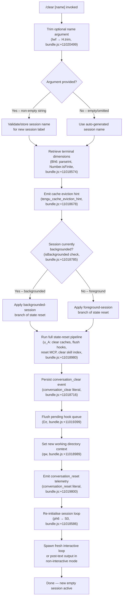

# `/clear`

> Analysis basis: CC v2.1.167 bundle.js (AST extraction + Claude interpretation)
> Minimum version: v2.1.167

---

## Overview

`/clear` (also invocable as `/reset` or `/new`) starts a brand-new conversation session with an empty context window while leaving the previous session's data intact on disk so it can be resumed later with `/resume`. The command accepts an optional `[name]` argument to label the new session, trims any whitespace from the supplied argument, and then orchestrates a full state-reset pipeline — clearing in-memory caches, flushing pending I/O, persisting session metadata, emitting a `conversation_clear` telemetry event, and finally spawning a fresh interactive loop.

---

## Registration

| Field | Value |
|---|---|
| type | `local` |
| name | `clear` |
| description | Start a new session with empty context; previous session stays on disk (resumable with /resume) |
| argumentHint | `[name]` |
| aliases | `reset`, `new` |
| supportsNonInteractive | `true` |
| thinClientDispatch | `post-text` |
| module_id | `_pq` |
| load_inline | `true` |
| loc_byte | 11020673 |
| loc_byte_end | 11020964 |
| loc_line | 7301 |
| arbor_handler.name | `Iwf` |
| arbor_handler.fqn | `claude-2.1.167::Iwf` |
| arbor_handler.kind | `AsyncFunction` |
| arbor_handler.resolution_path | `module_id` |
| arbor_handler.n_hits | 0 |

Analysis basis: CC v2.1.167 bundle.js:+11020673

---

## Input Branching

The command execution has four or more distinct paths depending on argument presence, the session background state, whether any running tasks exist, and the outcome of the state-reset pipeline. A Mermaid flowchart is used to represent this.



---

## Behavioral Spec

### 1. Handler Entry — Argument Normalisation

```
async function clearCommandHandler(args, context):
    rawName = args ?? ""
    sessionName = rawName.trim()          // H.trim, bundle.js:+11020499
    sessionContext = buildSessionContext(context)
    return runClearPipeline(sessionName, sessionContext)
```

Analysis basis: CC v2.1.167 bundle.js:+11020499

---

### 2. Terminal Dimension Retrieval

Before the reset pipeline begins, the terminal dimensions are sampled and clamped so the new session can render correctly.

```
function getTerminalDimensions(rawValue):
    parsed   = parseInt(rawValue, 10)     // Bh6, bundle.js:+13330941
    isFinite = Number.isFinite(parsed)    // bundle.js:+13330963
    columns  = Math.max(MIN_COLS, Math.min(MAX_COLS, isFinite ? parsed : DEFAULT_COLS))
    rows     = Math.max(MIN_ROWS, Math.min(MAX_ROWS, /* similar logic */))
    return { columns, rows }
```

`Math.max` / `Math.min` calls observed at bundle.js:+13331159 and +13331172.

Analysis basis: CC v2.1.167 bundle.js:+11018574

---

### 3. Cache Eviction Hint

Immediately after dimension retrieval the runtime emits `tengu_cache_eviction_hint` (bundle.js:+11018678) to allow upstream infrastructure to release cached prompt context before the new session starts.

---

### 4. Full State-Reset Pipeline (`stateResetOrchestrator`)

This is the most elaborate part of `/clear`. It calls a chain of specialised reset helpers, each responsible for a subsystem:

```
async function stateResetOrchestrator(sessionName, context):
    // 1. Clear skill index cache
    clearSkillIndexCache()                       // mm → H.clearSkillIndexCache, bundle.js:+13191539

    // 2. Reset autonomous-loop delivery counter
    resetAutonomousLoopDelivered()               // hs → Aw7.resetAutonomousLoopDelivered, bundle.js:+6779889

    // 3. Clear all MCP connection state
    clearMcpConnections()                        // Ru9 → bF.clear, bundle.js:+6730807

    // 4. Flush pending hook queue entries
    flushHookQueue()                             // OD8, bundle.js:+6779473

    // 5. Clear compact-state caches
    clearCompactCaches()                         // Mm9 → FG6.clear + sb_.clear, bundle.js:+6767675

    // 6. Clear file-watch registry
    clearFileWatchRegistry()                     // YD8 → KCq.clear, bundle.js:+10660128

    // 7. Reset agent-type registries
    clearAgentTypeRegistries()                   // LYq → fCH.clear + gn_.clear, bundle.js:+9032901
                                                 // jKq → P66.clear + tV6.clear, bundle.js:+8263859
                                                 // Ju9 → FY8.clear,           bundle.js:+6719387
                                                 // G6_ → bFH.clear,           bundle.js:+1102579
                                                 // h6_ → xFH.clear,           bundle.js:+1109626

    // 8. Clear NLq / G2H state caches
    clearNlCaches()                              // NLq → zt.clear + G2H.clear, bundle.js:+8341557

    // 9. Clear tool-call state machine cache
    clearToolCallCache()                         // vm → sv8.clear, bundle.js:+9984556

    // 10. Emit internal session_start to lifecycle bus
    emitSessionStart()                           // zW6 → XG, bundle.js:+5020173

    // 11. Persist new session name / metadata to disk
    persistSessionMetadata(sessionName)          // DhH → QY8.mkdir + QY8.writeFile, bundle.js:+6720900

    // 12. Reset hook execution context
    resetHookExecutionContext()                  // VAH → td8 + Mc8, bundle.js:+6766522

    return Promise.resolve()
```

Analysis basis: CC v2.1.167 bundle.js:+11018980

---

### 5. Hook Queue Flush

```
async function flushHookQueue(context):
    pendingHandles = collectPendingHookHandles()  // Dz → uu8.get, bundle.js:+13291558
    for handle in pendingHandles:
        await handle.flush()                      // _.flush, bundle.js:+13291580
        deleteFromRegistry(handle)                // uu8.delete, bundle.js:+13291590
```

Analysis basis: CC v2.1.167 bundle.js:+11019399

---

### 6. Working-Directory Re-Initialisation

After the state reset the command re-anchors the shell working-directory context so the new session starts in a valid directory.

```
function reinitWorkingDirectory(cwd, context):
    if not isAbsolute(cwd):                      // qw → nG8.isAbsolute, bundle.js:+8326803
        cwd = resolve(cwd)                       // nG8.resolve, bundle.js:+8326823
    validate(cwd)                                // d6, h8, bundle.js:+8326838
    if validation fails:
        throw Error(...)                         // bundle.js:+8326905
    setWorkingDirectoryStore(cwd)                // GH_ → uc6.getStore, bundle.js:+1021121
    normalise(cwd)                               // jO → H.normalize, bundle.js:+177725
    emitTelemetry("tengu_shell_set_cwd")         // bundle.js:+8326958
```

Analysis basis: CC v2.1.167 bundle.js:+11018989

---

### 7. New Session Loop Bootstrap (`sessionLoopBootstrap`)

Once all resets are complete the command re-enters the main session loop, which in turn triggers a `SessionEnd` lifecycle hook for the outgoing session (literal `"SessionEnd"` at bundle.js:+13321499) and sets up the new session's hook registrations, MCP connections, and UI state.

```
async function sessionLoopBootstrap(terminalDimensions, sessionName, context):
    emitSessionEndHook()              // LxH → BL → "SessionEnd", bundle.js:+13321499
    setupHookRegistrations()          // j9 → VPA.register, bundle.js:+60369
    reinitMcpConnections()            // xF → uG6 → BL, bundle.js:+13320767
    randomUUID()                      // ph6 → tmq.randomUUID, bundle.js:+11019839
    emitConversationResetTelemetry()  // "conversation_reset", bundle.js:+11019800
    emitConversationClearEvent()      // "conversation_clear", bundle.js:+11018716
    startNewInteractiveLoop(terminalDimensions, sessionName)
```

Analysis basis: CC v2.1.167 bundle.js:+11018586

---

### 8. Non-Interactive Mode

When `supportsNonInteractive: true` is exercised (e.g. piped CLI usage), the `thinClientDispatch: "post-text"` path is taken. In this case the handler still executes the full state-reset pipeline but outputs a plain-text confirmation rather than re-entering the REPL.

Analysis basis: CC v2.1.167 bundle.js:+11020673 (registration field)

---

## State & Side Effects

| Item | Detail |
|---|---|
| Telemetry — cache hint | `tengu_cache_eviction_hint` emitted before reset (bundle.js:+11018678) |
| Telemetry — shell cwd | `tengu_shell_set_cwd` emitted after working-directory re-init (bundle.js:+8326958) |
| Telemetry — session rename | `tengu_session_renamed` if session name changes (bundle.js:+13234175) |
| Telemetry — REPL hook finished | `tengu_repl_hook_finished` after any hook completes (bundle.js:+13354617) |
| Telemetry — hook plugin injected | `tengu_hook_plugin_injected` (bundle.js:+13369196) |
| Telemetry — feature ok/bad/sad | `tengu_feature_ok`, `tengu_feature_bad`, `tengu_feature_sad` (bundle.js:+1010950, +1011012, +1011093) |
| Literal — clear event name | `"conversation_clear"` (bundle.js:+11018716) |
| Literal — reset event name | `"conversation_reset"` (bundle.js:+11019800) |
| Literal — "SessionEnd" hook | Fired to lifecycle bus for the outgoing session (bundle.js:+13321499) |
| Disk state | Previous session data **preserved** on disk (resumable via `/resume`). New session metadata written via `QY8.mkdir` + `QY8.writeFile` (bundle.js:+6720900) |
| In-memory caches cleared | Skill index, MCP connections, compact caches, file-watch registry, agent-type registries, NL caches, tool-call state machine, hook pending queue — all cleared (bundle.js:+11018980) |
| Hook registration | All hook registrations from the old session are flushed; new session re-registers via `j9 → VPA.register` (bundle.js:+60369) |
| appState changes | `isBackgrounded` flag checked before deciding reset branch (bundle.js:+11018785); new session UUID generated (bundle.js:+11019839) |
| Sound | No audio side effect observed in depth-2 traversal |

---

## Version History

| Version | Change |
|---|---|
| v2.1.167 | Initial analysis |

---

## Common Mistakes

1. **Confusing `/clear` with permanent deletion.** The previous session is not deleted; it remains on disk and can be recovered with `/resume`. Users who want to truly discard a session must delete session files manually.
2. **Expecting the name argument to be optional silently ignored.** An empty or whitespace-only name is trimmed to an empty string and the system falls back to auto-generating a session label — it does not error, but the supplied name is silently discarded.
3. **Using `/clear` in a non-interactive script and expecting REPL output.** In non-interactive / piped mode (`thinClientDispatch: "post-text"`) the command completes the reset and emits plain text, not the interactive UI.
4. **Assuming all aliases behave identically.** `/reset` and `/new` are registered aliases (bundle.js:+11020673) and share the same handler (`Iwf`), so their behaviour is identical to `/clear`.
5. **Running `/clear` while background hooks are in flight.** The command flushes pending hooks synchronously before the state reset; hooks that have already dispatched externally may still complete, which can produce unexpected post-clear telemetry events.

---

## Appendix — Identifier Mapping

> For bundle debugging only. Identifiers change across versions.

| Identifier | Role |
|---|---|
| `Iwf` | Main async handler for `/clear` (arbor_handler, module `_pq`) |
| `ph6` | Inner session-reset orchestrator; called by `Iwf` |
| `Bh6` | Terminal dimension parser/clamper |
| `LxH` | Session-loop bootstrap (triggers `SessionEnd` hook, spawns new loop) |
| `S0` | New session main loop initialiser |
| `u_A` | Full in-memory state-reset function (clears all subsystem caches) |
| `qw` | Working-directory re-initialisation helper |
| `GH_` | Working-directory store accessor |
| `jO` | Path normaliser (NFC) |
| `XHH` | Path store setter |
| `W_` | Terminal-write helper (used for output) |
| `Dz` | Hook-queue flush helper |
| `pu8` | Pending-hook set manager |
| `j9` | Hook re-registration helper (calls `VPA.register`) |
| `mm` | Skill-index cache clear helper |
| `Ru9` | MCP connection cache clear helper |
| `DhH` | Session metadata persistence helper (mkdir + writeFile) |
| `hs` | Multi-subsystem reset coordinator (calls OD8, VAH, Mm9, etc.) |
| `OD8` | Hook pending-queue flush (`Im.get`, `Im.delete`) |
| `VAH` | Hook execution context reset |
| `Mm9` | Compact-state cache clear |
| `YD8` | File-watch registry clear |
| `LYq` | Agent-type registry clear (fCH, gn_) |
| `jKq` | Secondary agent-type registry clear (P66, tV6) |
| `Ju9` | Tertiary agent-type registry clear (FY8) |
| `G6_` | Quaternary agent-type registry clear (bFH) |
| `h6_` | Quinary agent-type registry clear (xFH) |
| `NLq` | NL/G2H cache clear |
| `vm` | Tool-call state machine cache clear (sv8) |
| `MIq` | Skill-index loader reset |
| `Ly6` | Skill-index get helper |
| `zW6` | Session-start lifecycle event emitter |
| `LQ8` | UUID-emitting event emitter (`nqH.randomUUID`, `Wp6.emit`) |
| `HR` | Session event log writer |
| `Q$H` | Append-to-session-log helper (appendFileSync, mkdirSync) |
| `Zp` | Session-rename emit helper |
| `y9H` | Session isolation-latch writer |
| `H3K` | Session append-file helper (wL.appendFile, wL.mkdir) |
| `LbH` | Symlink / worktree state manager |
| `S86` | Worktree-state file opener |
| `SMA` | Worktree directory creator |
| `y66` | Worktree path builder |
| `lZ` | Subagent path resolver |
| `xF` | Plugin/MCP hook loader and new-session hook setup |
| `uG6` | MCP connection re-initialiser (calls `BL`, `s$`) |
| `hP` | Full session-loop request processor |
| `enK` | Conversation transcript/log writer |
| `YKH` | Transcript segment formatter |
| `cl8` | Log-file rotation helper (stat, rename, unlink) |
| `tnK` | Log append-with-rotate helper |
| `G4` | Model/provider label formatter |
| `q0A` | Provider list mapper |
| `H9` | Message normaliser for display |
| `m6H` | Message type dispatcher |
| `s9` | Single-message formatter |
| `CI` | Content-item formatter |
| `bT` | Block-type formatter |
| `FJ` | Full message formatter pipeline |
| `_G` | Aggregate formatter |
| `v` | Session-state store accessor |
| `onK` | State-field reader |
| `vPA` | State sub-field accessor |
| `EUH` | Terminal writer wrapper |
| `lWA` | Low-level H.write wrapper |
| `npH` | Output buffer / debounce helper |
| `R6` | Telemetry event emitter |
| `ev` | Async telemetry helper |
| `RH` | JSON.stringify wrapper |
| `GH` | String coercer |
| `V8` | Error logger |
| `h8` | Error-code tester (ENOENT, EISDIR) |
| `_6` | String coercer (String call) |
| `AA` | Error constructor wrapper |
| `Tf` | V8 error logger alias |
| `d6` | Path existence checker |
| `U6` | JSON.parse wrapper |
| `r4` | Internal event bus dispatcher |
| `mwA` | Daemon background-session manager |
| `QwA` | Daemon session lifecycle controller |
| `cx8` | macOS memory checker |
| `D6` | Memory-pressure dispatcher |
| `tX6` | Pinned-files reader |
| `kgL` | Directory pinned-files scanner |
| `e9` | Session state-file reader/writer |
| `VY` | Active-session marker writer |
| `G$A` | Background session metadata writer |
| `U$5` | Daemon claim-send helper |
| `p$5` | Daemon claim-frame builder |
| `fy` | Binary frame encoder (Buffer ops) |
| `t16` | Session-transcript tail watcher |
| `q$H` | Session log path builder |
| `yE` | Session log line parser |
| `gg` | Session roster entry writer |
| `XS6` | Session directory initialiser |
| `XF` | Telemetry flush helper (_H7.emit, Date.now) |
| `HCH` | Terminal capability checker |
| `SP` | Spinner/progress indicator |
| `LJ` | Layout manager |
| `Y3` | Bootstrap fetch initiator |
| `uj_` | User-agent string parser |
| `lHH` | Feature-flag checker |
| `uj` | Request header builder |
| `o6` | Feature telemetry reporter (ok/bad/sad) |
| `J6` | Feature event dispatcher |
| `ym6` | Low-level event emitter |
| `Nk` | Skill-index reload orchestrator |
| `EbH` | Skill-index entry processor |
| `KI8` | Skill-index kind classifier |
| `jNq` | Skill-index normaliser |
| `FL6` | Feature-lock checker |
| `Lx_` | Post-reset cleanup finaliser |
| `C59` | Configuration change notifier |
| `rd8` | Per-feature has-check helper |
| `zsH` | CLI notification helper |
| `FN9` | Notification formatter |
| `Hpq` | Hook-output validator |
| `HOH` | Hook-output schema checker |
| `s$` | Session event emitter wrapper |
| `Uh6` | Session event bus subscriber |
| `$i` | Async session event handler |
| `Zp` | Session rename emitter |
| `GM` | Global-mode flag accessor |
| `bN` | Background-notification helper |
| `G` | MCP server connection manager |
| `T` | Tool-call state transition handler |
| `aM` | Autonomous-mode accessor |
| `Tq` | Task-queue accessor |
| `y_` | Module initialiser bootstrap |
| `Im6` | Module bind helper |
| `z46` | MCP server status checker |
| `rS` | MCP retry scheduler |
| `wv` | MCP event watcher |
| `Hi` | MCP health inspector |
| `MF` | MCP failure recorder |
| `M` | MCP client registry manager |
| `xbH` | MCP server connector |
| `XF8` | MCP connection result applier |
| `dDA` | MCP client diff/update applier |
| `$` | MCP state snapshot helper |
| `R1` | Session UUID + timestamp recorder |