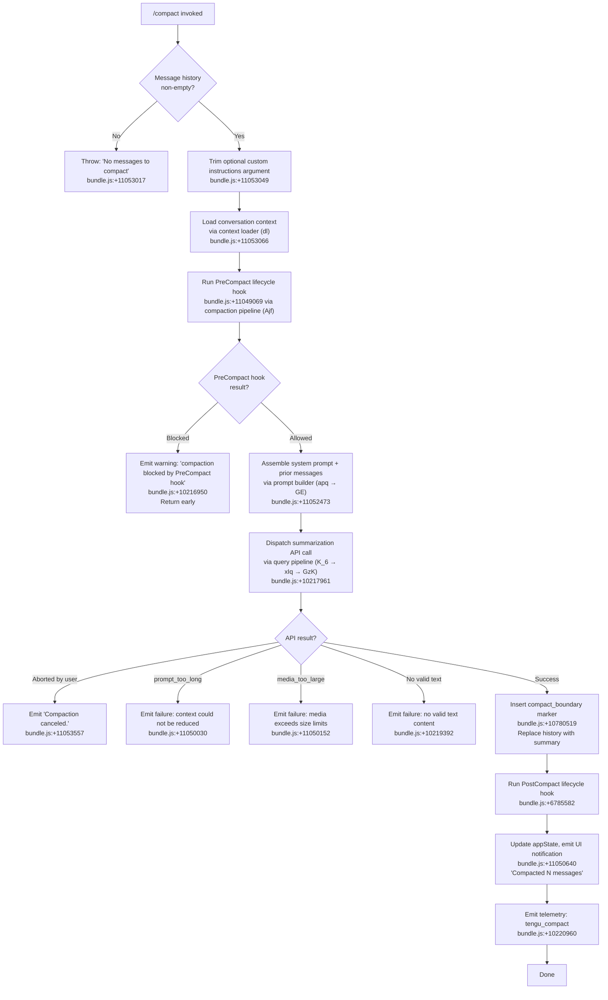

# `/compact`

> Analysis basis: CC v2.1.167 bundle.js (AST extraction + Claude interpretation)
> Minimum version: v2.1.167

---

## Overview

`/compact` frees up context window space by summarizing the current conversation into a condensed representation, replacing the full message history with a compact boundary marker and an AI-generated summary. It supports an optional argument for custom summarization instructions, runs lifecycle hooks (`PreCompact` / `PostCompact`), and both manual invocation and automatic reactive triggering share the same core summarization pipeline.

---

## Registration

| Field | Value |
|---|---|
| type | `local` |
| name | `compact` |
| description | `Free up context by summarizing the conversation so far` |
| argumentHint | `<optional custom summarization instructions>` |
| supportsNonInteractive | `true` |
| thinClientDispatch | `post-text` |
| module_id | `spq` |
| load_inline | `true` |
| loc_byte | `11053955` |
| loc_byte_end | `11054255` |
| loc_line | `7430` |
| arbor_handler.name | `_jf` |
| arbor_handler.fqn | `claude-2.1.167::_jf` |
| arbor_handler.kind | `AsyncFunction` |
| arbor_handler.resolution_path | `module_id` |
| arbor_handler.n_hits | `0` |

Analysis basis: CC v2.1.167 bundle.js:+11053955

---

## Input Branching

The command involves more than 3 distinct branches across its lifecycle (empty message history guard, custom instructions path, PreCompact hook block, summary generation outcomes, PostCompact cleanup). A Mermaid flowchart is used.



---

## Behavioral Spec

### 1. Entry Guard — Empty History Check

If the current session has no messages at all, the handler raises an error immediately before any other work.

```
function compactCommandHandler(args, context):
    messages = getConversationMessages(context)
    if messages is empty:
        throw Error("No messages to compact")   // bundle.js:+11053017
    customInstructions = args.trim()             // bundle.js:+11053049
    proceed to context loading
```

Analysis basis: CC v2.1.167 bundle.js:+11053011

---

### 2. Context Loading

The handler loads the current conversation context, including message history serialization, through a dedicated loader function.

```
function loadConversationContext(context):
    rawMessages = fetchHistory(context)          // via RO → Zy8 → fJ
    slicedMessages = rawMessages.slice(...)      // bundle.js:+10780672
    // Inserts compact_boundary sentinel (string: "compact_boundary")
    // at system position, value 1 from end
    // bundle.js:+10780519, +10780573, +10780578
    return serializedContext
```

Analysis basis: CC v2.1.167 bundle.js:+10780497, +10780519, +10780573

---

### 3. PreCompact Hook Execution

Before summarization begins, the `PreCompact` lifecycle hook is fired. If the hook signals a block, compaction is aborted and a warning notification is emitted.

```
function runPreCompactHook(context):
    startTime = performance.now()               // bundle.js:+11049069
    hookResult = await executeHook("PreCompact", context)
    if hookResult.decision == "block":
        emitNotification({
            type: "warning",                    // bundle.js:+10217017
            message: "compaction blocked by PreCompact hook"  // bundle.js:+10216950
        })
        return BLOCKED
    return ALLOWED
```

The string `"PreCompact"` is confirmed in literals at bundle.js:+13316658.

Analysis basis: CC v2.1.167 bundle.js:+11049069, +10216916

---

### 4. System Prompt and Message Assembly

The prompt builder assembles the full context to send to the summarization model, drawing from memory, environment context, and prior conversation messages.

```
function buildCompactionPrompt(customInstructions, context):
    appState = context.getAppState()            // bundle.js:+11052473
    memoryPrompt = buildCombinedMemoryPrompt()  // via DJ6 → nNL.buildCombinedMemoryPrompt
    systemSections = assembleSystemSections(appState, memoryPrompt)
    priorMessages = collectMessageHistory(context)  // via b_ → findLast
    if customInstructions is non-empty:
        append customInstructions to summarization request
    return { system: systemSections, messages: priorMessages }
```

The summarization model is instructed: `"You are a helpful AI assistant tasked with summarizing conversations."` (bundle.js:+10230916).

Analysis basis: CC v2.1.167 bundle.js:+11052473, +11052540, +10230916

---

### 5. Summarization API Call and Result Handling

The compaction pipeline sends the assembled prompt to the Claude API and processes the response through the standard query infrastructure.

```
function runSummarizationQuery(prompt, abortSignal):
    // Telemetry: compact_start at bundle.js:+11049492
    // stream_mode: "manual" at bundle.js:+11049145
    result = await apiQuery(prompt, {
        model: resolveCompactionModel(),
        abortSignal: abortSignal,
        toolUsePolicy: "deny"   // "Tool use is not allowed during compaction"
                                 // bundle.js:+10228546
    })
    match result:
        case aborted:
            return ABORTED
        case no_summary / empty text:
            // "compact_no_summary" telemetry, bundle.js:+10219363
            throw Error("Failed to generate conversation summary...")
        case prompt_too_long:
            // "compact_prompt_too_long" telemetry, bundle.js:+10218979
            throw Error("context could not be reduced...")
        case api_error:
            // "compact_api_error" telemetry, bundle.js:+10219659
            throw Error(...)
        case success:
            summaryText = extractText(result)
            return summaryText
```

Tool use is explicitly blocked during compaction agent turns; the compaction agent is expected to produce only a text summary (bundle.js:+10228626).

Analysis basis: CC v2.1.167 bundle.js:+11049492, +10228531, +10228546, +10219363

---

### 6. History Replacement and Boundary Insertion

On successful summarization, the conversation history is replaced with the compact boundary marker followed by the summary.

```
function replaceHistoryWithSummary(summaryText, context):
    boundaryMessage = {
        role: "system",                     // bundle.js:+10780497
        type: "compact_boundary",           // bundle.js:+10780519
        index: messages.length - 1,        // bundle.js:+10780573
        offset: 0                           // bundle.js:+10780578
    }
    newHistory = [boundaryMessage, summaryMessage(summaryText)]
    context.setHistory(newHistory)
    // Emit "Conversation compacted" signal, bundle.js:+10780075
```

Analysis basis: CC v2.1.167 bundle.js:+10780075, +10780497, +10780519

---

### 7. PostCompact Hook and UI Notification

After history replacement, the `PostCompact` hook fires, and the UI is updated.

```
function finalizeCompaction(summaryText, messageCount, context):
    await executeHook("PostCompact", context)   // bundle.js:+6785582
    // Reset state via hs() cleanup: bundle.js:+11053276
    // Emit notification panel update via opq(): bundle.js:+11053348
    //   displays "Compacted N messages" (bundle.js:+11052417)
    // Register keybinding app:toggleTranscript / ctrl+o (bundle.js:+11052278)
    updateAppState(context)                    // via XhH → BG6.setState
    emitTelemetry("tengu_compact")             // bundle.js:+10220960
```

Analysis basis: CC v2.1.167 bundle.js:+6785582, +11052417, +11053276, +11053348

---

### 8. Reactive Compaction (Automatic Path)

In addition to manual invocation, compaction is triggered reactively when context utilization approaches limits. The reactive path shares the core summarization infrastructure but has its own grouping and retry logic.

```
function reactiveCompact(context):
    groups = partitionMessageGroups(context)
    if groups.length < 2:
        log("Reactive compact: fewer than 2 groups, nothing to compact")
        // bundle.js:+6764131, telemetry "too_few_groups"
        return
    summarizeSet = selectSummarizationSet(groups)
    if no assistant messages in summarizeSet:
        log("Reactive compact: no assistant messages in summarize set")
        // bundle.js:+6764693
        return
    // Attempt summary; on media_too_large, retry with media stripped
    // bundle.js:+6765581 "Reactive compact: summarize hit media-size error, retrying stripped"
    result = attemptSummarize(summarizeSet)
    if result.success:
        emitTelemetry("tengu_reactive_compact_succeeded") // bundle.js:+6786178
    else:
        emitTelemetry("tengu_reactive_compact_failed")   // bundle.js:+6783717
```

Analysis basis: CC v2.1.167 bundle.js:+6764131, +6764693, +6765581, +6786178

---

## State & Side Effects

| Item | Detail |
|---|---|
| Telemetry | `tengu_compact` (bundle.js:+10220960), `tengu_compact_failed` (bundle.js:+10232249), `tengu_compact_ptl_retry` (bundle.js:+10219019), `tengu_compact_cache_prefix` (bundle.js:+10218543), `tengu_compact_cache_sharing_success` (bundle.js:+10229423), `tengu_compact_cache_sharing_fallback` (bundle.js:+10230053), `tengu_precomputed_compact_consumed` (bundle.js:+6778543), `tengu_precomputed_compact_discarded` (bundle.js:+6779166), `tengu_reactive_compact_attempt` (bundle.js:+6764854), `tengu_reactive_compact_succeeded` (bundle.js:+6786178), `tengu_reactive_compact_failed` (bundle.js:+6783717), `tengu_post_compact_file_restore_success` (bundle.js:+10232735), `tengu_post_compact_file_restore_error` (bundle.js:+10232777) |
| Hook registration | `PreCompact` hook fired before summarization (bundle.js:+13316658); `PostCompact` hook fired after history replacement (bundle.js:+13350338, +6785582) |
| appState changes | App state reset via `XhH → BG6.setState` after compaction (bundle.js:+11050438, +6766179); conversation history replaced with `compact_boundary` + summary |
| History mutation | Inserts sentinel message `{role:"system", type:"compact_boundary"}` and replaces all prior messages with summary text (bundle.js:+10780519) |
| UI notification | Emits `"Compacted N messages"` notification with `app:toggleTranscript` keybinding (`ctrl+o`) (bundle.js:+11052417, +11052278) |
| Abort support | Emits `"Compaction canceled."` on user abort (bundle.js:+11053557) |
| Tool use policy | Tool use explicitly denied during compaction turns; agent must produce text-only output (bundle.js:+10228531, +10228546) |
| Error messages | `"Compaction failed · conversation could not be reduced below the context limit"` (bundle.js:+11050030); `"Compaction failed · attached media exceeds size limits"` (bundle.js:+11050152) |
| Sound | <!-- TODO: not found in depth-2 traversal; needs --depth 4 --> |

---

## Version History

| Version | Change |
|---|---|
| v2.1.167 | Initial analysis |

---

## Common Mistakes

1. **Invoking `/compact` on an empty session** — The command throws immediately if there are no messages. Wait until at least one turn has completed.
2. **Expecting tools to work during compaction** — Tool use is explicitly blocked while the summarization agent is active. The compaction agent produces text-only output.
3. **Assuming custom instructions always take effect** — The custom instructions argument is trimmed and passed through; if the argument is whitespace-only after trimming, compaction proceeds with default summarization instructions.
4. **Ignoring `PreCompact` hook blocks** — If a registered `PreCompact` hook returns a block decision, compaction silently cancels with a warning notification rather than an error. Scripts relying on compaction completing should check for this.
5. **Assuming reactive compaction is the same as manual** — The reactive path requires at least 2 message groups and at least one assistant message in the candidate set; it will bail out silently in edge cases where the manual path would attempt summarization.

---

## Appendix — Identifier Mapping

> For bundle debugging only. Identifiers change across versions.

| Identifier | Role |
|---|---|
| `_jf` | Main async handler for `/compact` command (Arbor-resolved entry point) |
| `RO` | Message history fetcher / conversation accessor |
| `Zy8` | History serialization helper |
| `fJ` | Message list builder |
| `dl` | Conversation context loader |
| `U_` | Context utility (used by context loader) |
| `D6` | Config/data accessor used across multiple subsystems |
| `dq8` | Config cache lookup |
| `yP_` | Config initializer with UUID generation |
| `xP_` | Config persistence helper |
| `C6` | File-backed config read/write module |
| `LwH` | Low-level file config loader (readFileSync, mkdirSync, copyFileSync) |
| `IVL` | File watcher for config changes |
| `Ajf` | Compaction pipeline orchestrator (wraps timing, hooks, and API dispatch) |
| `m2` | Message normalization / serialization helper |
| `WLf` | Message format builder |
| `De_` | Message content normalizer for API payload |
| `cl` | Hook runner / hook pipeline executor |
| `BL` | Hook loader / plugin hook resolver |
| `S0` | Hook execution engine (spawn, HTTP, MCP) |
| `QMA` | Hook registry / plugin matcher |
| `eu8` | Shell hook spawner |
| `apq` | Compaction prompt assembler |
| `GE` | System prompt builder / context section assembler |
| `DJ6` | Memory prompt loader (CLAUDE.md, team memory) |
| `b_` | App state message history accessor |
| `Pp` | Agent system prompt builder |
| `K_6` | Core compaction query function (manual path) |
| `xIq` | Compaction agent query loop / turn executor |
| `GzK` | Main API query engine (streaming + non-streaming) |
| `qjf` | Precomputed compact consumer / cache-aware compact path |
| `Ax_` | Pending compact request tracker |
| `gsH` | Precomputed summary applicator |
| `qx_` | Compact boundary finder in message history |
| `$D8` | Post-compaction timing recorder |
| `wD8` | Reactive compaction runner |
| `$x_` | Reactive compaction orchestrator |
| `qD8` | Reactive compaction group partitioner |
| `iD7` | Reactive compaction summarization API caller |
| `pG6` | Reactive compact message selector |
| `ou9` | Reactive compact group size calculator |
| `hs` | Post-compaction state cleanup (clears caches, resets autonomous loop) |
| `XhH` | App state updater after compaction (`BG6.setState`) |
| `opq` | Post-compaction UI notification emitter ("Compacted N messages") |
| `phH` | Model display name resolver |
| `lJ7` | Model token context builder |
| `vJH` | OTEL span / metrics emitter for compaction |
| `h4` | Metrics event emitter |
| `LyH` | OTEL resource attribute builder |
| `ME` | Message content block normalizer for API |
| `cY8` | Per-message token counter |
| `pD7` | Token cache updater |
| `lY8` | Token rounding helper |
| `RIq` | Message slice / context window trimmer |
| `psH` | Message push helper |
| `zrH` | Token counter helper |
| `p7H` | Token estimation from content blocks |
| `PP6` | Token integer parser |
| `rb_` | Message content flattener |
| `C4f` | Message content filter |
| `b4f` | Message content mapper / normalizer |
| `Qt_` | Recursive content tree normalizer |
| `hIq` | Surrogate-pair-aware character slicer |
| `Oy6` | Tool search mode decision helper |
| `MbH` | Tool capability checker |
| `aC_` | Tool search parameter builder |
| `zLf` | Tool search result processor |
| `t_6` | Tool schema builder entry |
| `GzK` | (also) Streaming API event loop |
| `BY8` | Config schema validator |
| `e1` | Model name normalizer |
| `lV6` | Teammate mailbox message marker |
| `TM` | Model context window info resolver |
| `xR` | Token limit lookup |
| `W_` | Token limit lookup (alternate) |
| `wG` | CLI/remote mode classifier |
| `UG6` | Token display formatter |
| `nD7` | Token display string trimmer |
| `ta` | Abort/stop signal handler |
| `bIq` | Error notification emitter |
| `hN` | Turn queue manager |
| `NhH` | Status line updater |
| `AD8` | Text trimmer utility |
| `u8` | Session runner / REPL main loop |
| `P` | Terminal UI controller |
| `i$5` | PTY/daemon IPC handler |
| `y_` | Module loader bootstrap |
| `et_` | State reset helper (used post-compaction) |
| `kbq` | UUID generator wrapper |
| `R1` | Message record factory (UUID + timestamp) |
| `PS` | Random bytes generator |
| `EG` | Turn executor / streaming turn manager |
| `CN8` | Per-turn state machine |
| `Xp` | Command lifecycle emitter |
| `QfH` | Streaming event filter |
| `wDf` | Fork agent query telemetry emitter |
| `xbH` | MCP plugin connection manager |
| `XF8` | MCP connection result applier |
| `dDA` | MCP server list builder |
| `Mm9` | Cache clear on post-compact |
| `YD8` | KV-cache clear on post-compact |
| `OD8` | Pending compact request cleaner |
| `zW6` | UI state reset helper |
| `VAH` | Post-compact cleanup coordinator |
| `Lx_` | Lingering async hook cleaner |
| `gsH` | (also) Precomputed summary consumer |
| `GH` | String coercion utility |
| `hs` | (primary role) Post-compaction cleanup bundle |
| `gl` | Tool availability scanner |
| `Zu9` | Tool availability check helper |
| `SG6` | Cache-prefix file writer |
| `DhH` | Cache-prefix async file writer |
| `NAH` | Notification accumulator |
| `OLf` | Array notification checker |
| `$Lf` | Notification type resolver |