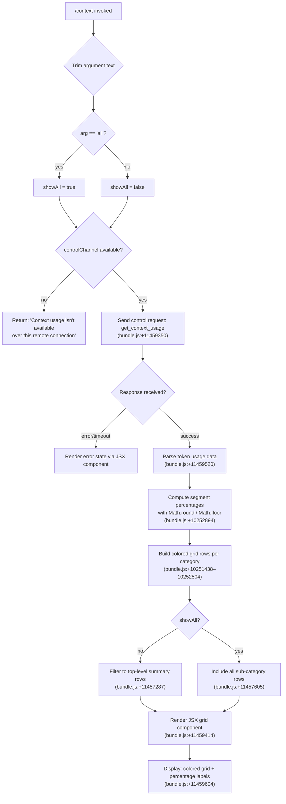

# `/context`

> Analysis basis: CC v2.1.167 bundle.js (AST extraction + Claude interpretation)
> Minimum version: v2.1.167

---

## Overview

`/context` visualizes the current context window usage as a colored grid in the Claude Code terminal UI. It dispatches a `get_context_usage` control request to the underlying session, then renders a breakdown of how different content categories (system prompt, tools, memory files, messages, etc.) are occupying the available token budget. An optional `all` argument forces complete detail display.

---

## Registration

| Field | Value |
|---|---|
| type | `local-jsx` |
| name | `context` |
| description | `Visualize current context usage as a colored grid` |
| argumentHint | `[all]` |
| thinClientDispatch | `control-request` |
| module_id | `oFq` |
| load_inline | `true` |
| loc_byte | `11460590` |
| loc_byte_end | `11460816` |
| loc_line | `7486` |
| arbor_handler.name | `O2f` |
| arbor_handler.fqn | `claude-2.1.167::O2f` |
| arbor_handler.kind | `AsyncFunction` |
| arbor_handler.resolution_path | `module_id` |
| arbor_handler.n_hits | `0` |

Analysis basis: CC v2.1.167 bundle.js:+11460590

---

## Input Branching

The command has 4+ distinct branches based on argument value, remote-connection state, and the presence of a control channel. A Mermaid flowchart is used.



Analysis basis: CC v2.1.167 bundle.js:+11459184 (handler entry `O2f`), +11459223 (argument check `oL`), +11459241 (`controlChannel` string constant), +11459268 (remote error string).

---

## Behavioral Spec

### Handler Entry — `contextCommandHandler` (`O2f`)

```
async function contextCommandHandler(args, options):
    trimmedArg = args.trim()                    // bundle.js:+11459190
    showAll    = checkIfAllArg(trimmedArg)      // bundle.js:+11459223 (oL)
    channel    = resolveControlChannel(options) // bundle.js:+11459238 (wI → oL)

    if not channel:
        return staticText(                      // bundle.js:+11459266
            "Context usage isn't available over this remote connection"
        )

    response = await channel.sendControlRequest(  // bundle.js:+11459350
        "get_context_usage"
    )

    grid = buildContextGrid(response, showAll)    // bundle.js:+11459414, +11459520

    return renderJSX(
        outerContainer(grid),                     // bundle.js:+11459604
        percentageLabels(response)                // bundle.js:+11459693
    )
```

### Argument Detection — `checkIfAllArg` (`oL` → `uTH`)

```
function checkIfAllArg(trimmedArg):
    // Matches the string "all" (bundle.js:+11459215)
    return trimmedArg.toLowerCase() == "all"
```

Analysis basis: CC v2.1.167 bundle.js:+11459223

### Control Channel Check — `resolveControlChannel` (`wI` → `oL`)

```
function resolveControlChannel(options):
    // Looks up the "controlChannel" key in options/app-state
    // (bundle.js:+11459241)
    return options["controlChannel"] ?? null
```

Analysis basis: CC v2.1.167 bundle.js:+11459238, +11459241

### Grid Construction — `buildContextGrid` (`LS6`)

```
function buildContextGrid(usageResponse, showAll):
    // Segment definitions (bundle.js:+10251438–10252504):
    //   "System prompt"      color: promptBorder  (bundle.js:+11459497, +10251469)
    //   "System tools"       color: inactive      (bundle.js:+10251518, +10251549)
    //   "MCP tools"          color: cyan_FOR_SUBAGENTS_ONLY (bundle.js:+10251582, +10251609)
    //   "MCP tools (deferred)"                    (bundle.js:+10251657)
    //   "System tools (deferred)"                 (bundle.js:+10251742)
    //   "Custom agents"                            (bundle.js:+10251830)
    //   "Memory files"       color: claude        (bundle.js:+10251896, +10251926)
    //   "Skills"             color: warning       (bundle.js:+10251957, +10251981)
    //   "Messages"           color: purple_FOR_SUBAGENTS_ONLY (bundle.js:+10252478, +10252504)
    //   "Free space"                               (bundle.js:+11457322)
    //   "Autocompact buffer"                       (bundle.js:+11457345)

    allSegments = parseUsageIntoSegments(usageResponse)   // bundle.js:+11457287

    if not showAll:
        segments = allSegments.filter(topLevelOnly)       // bundle.js:+11457287

    rows = segments.map(seg =>
        gridRow(
            color  = seg.color,
            label  = seg.label,
            tokens = seg.tokenCount,
            pct    = Math.round(seg.fraction * 100)       // bundle.js:+10252894
        )
    )

    return rows
```

Analysis basis: CC v2.1.167 bundle.js:+11459520 (`LS6`), +11457287, +11457605

### Percentage Formatter — `formatPct` (`gq` → `yK`)

```
function formatPct(value):
    // Formats a float as "XX.0%" using "en-US" locale, "compact" notation
    // appends ".0" when no decimal is present (bundle.js:+212426)
    // thresholds: < 20 shown in one style, < 10 in another (bundle.js:+212456, +212465, +212498)
    formatted = value.toLocaleString("en-US", { notation: "compact" })
    if not formatted.includes("."):
        formatted += ".0"
    return formatted + "%"
```

Analysis basis: CC v2.1.167 bundle.js:+212412 (`gq`), +212426, +212456, +212465, +212498

### Compact-Boundary Marker — `compactBoundarySegment` (`$2f` → `RO`)

```
function compactBoundarySegment(usageResponse):
    // Locates the "compact_boundary" marker in the token map
    // (bundle.js:+10780519)
    // Slices usage data up to boundary offset (bundle.js:+10780672)
    boundary = usageResponse.find(e => e.type == "compact_boundary")
    return boundary ? usageResponse.slice(0, boundary.offset) : usageResponse
```

Analysis basis: CC v2.1.167 bundle.js:+11459693 (`$2f`), +10780519, +10780649, +10780672

### Context Usage Threshold — `usageThresholdCheck` (`gI8` orchestration)

The handler function `gI8` (the primary context-usage computation engine) applies the following numeric bounds:

- **80** — threshold fraction (e.g. 80 % used triggers a warning color) (bundle.js:+11459726)
- `Math.max` / `Math.min` clamping applied to token counts before rendering (bundle.js:+10252304, +10252315)
- `Math.round` for percentage labels (bundle.js:+10252894)
- `Math.floor` for grid cell sizing (bundle.js:+10253056)

Analysis basis: CC v2.1.167 bundle.js:+11459726, +10252304, +10252315, +10252894, +10253056

### JSX Rendering — `renderContextComponent` (`WH6` → `QB`)

```
function renderContextComponent(rows, totals):
    // Listens on the "data" event of the control channel (bundle.js:+7955298)
    // Converts response buffer to string (bundle.js:+7955330)
    // Renders via createElement (bundle.js:+7955360, +11459414)
    // Inner component Va builds sub-rows via EIH (bundle.js:+3819307)
    return createElement(GridContainer, {
        rows:   rows,
        totals: totals,
        onData: channel.on("data", handler)
    })
```

Analysis basis: CC v2.1.167 bundle.js:+11459410 (`WH6`), +7955293, +7955298, +7955330, +7955357, +7955360

---

## State & Side Effects

| Item | Detail |
|---|---|
| Telemetry | No `tengu_*` events fire directly inside the `/context` handler path at depth ≤ 2. Indirect events reachable via `gI8` orchestration include `tengu_amber_redwood2` (bundle.js:+10236794), `tengu_amber_redwood3` (bundle.js:+10236679). |
| Control request | Sends `"get_context_usage"` over `thinClientDispatch: "control-request"` channel (bundle.js:+11459350) |
| appState changes | None detected; the command is read-only and renders its result as a JSX component without mutating global app state. |
| Sound | None detected. |
| Hook registration | `j9` → `VPA.register` (bundle.js:+60369) is reachable transitively but is not specific to this command's primary path. |
| Remote connection guard | Returns static error string `"Context usage isn't available over this remote connection"` when no `controlChannel` is present (bundle.js:+11459268). |

---

## Version History

| Version | Change |
|---|---|
| v2.1.167 | Initial analysis |

---

## Common Mistakes

1. **Running `/context` over a remote or thin-client connection** — the command requires a local `controlChannel`. Over SSH or other remote transports where no control channel is established, the command immediately returns the static error message rather than a grid.
2. **Expecting live-refresh** — `/context` is a one-shot snapshot; it does not continuously update. Re-run the command to see updated usage after further interaction.
3. **Omitting `all` when investigating sub-categories** — without the `all` argument, the grid shows only top-level aggregated rows ("System prompt", "Messages", etc.). Pass `/context all` to expand to per-source sub-rows including individual memory files, deferred tools, and custom agents.
4. **Misinterpreting the 80 % color change** — the colored highlight at the 80 % usage mark (bundle.js:+11459726) indicates proximity to the context limit, not an error state; the session continues normally.
5. **Confusing "Autocompact buffer" with free space** — the `"Autocompact buffer"` segment (bundle.js:+11457345) represents reserved headroom for the auto-compaction system, not usable space; effective free space is shown separately as `"Free space"` (bundle.js:+11457322).

---

## Appendix — Identifier Mapping

> For bundle debugging only. Identifiers change across versions.

| Identifier | Role |
|---|---|
| `O2f` | Main async handler for `/context` command |
| `$1` | Inner rendering helper / component sub-function |
| `lHH` | Checks a Set membership (capability/feature flag check) |
| `VW_` | Resolves agent-type string (`"local-agent"`) |
| `_6` | Converts value to `String` |
| `qa` | Applies color/style lookup for grid segments |
| `VIL` | Terminal environment detection (iTerm / tmux check) |
| `ZIL` | Checks if terminal string starts with `"screen"` or `"tmux"` |
| `v` | Generic rendering/display helper |
| `onK` | Output/display channel orchestrator |
| `vPA` | Sync/async display-driver helpers (`sdK`, `tdK`) |
| `H` | Global app-state / options accessor |
| `Y3` | Bootstrap-fetch helper |
| `uj_` | Parses `"key: value"` header lines from strings |
| `uj` | Applies string `.replace()` transformations |
| `H9` | Model-name formatting (`m6H`, `s9`, `FJ`) |
| `o6` | Low-level logger (`l`, `J6`) |
| `RH` | Serializes objects with `JSON.stringify` |
| `G4` | Path/filename utility (basename, extension stripping) |
| `q0A` | Maps model-id list |
| `EUH` | Writes to output channel via `lWA` |
| `lWA` | Performs `H.write` output |
| `enK` | File-logging subsystem (append, rotate, mkdir) |
| `npH` | Buffered line-flush with `setTimeout`/`setImmediate` |
| `YKH` | Builds joined log-line strings |
| `U76` | Validates or formats a path segment (`V8`) |
| `M0A` | Joins path components with `IHH.join` |
| `cl8` | File-rotation helper (stat, rename, unlink) |
| `tnK` | Appends to log file, rotates when needed |
| `j9` | Registers a hook via `VPA.register` |
| `ZW_` | Detects Windows-over-SSH / ConPTY condition |
| `l_` | Loads settings from disk (async) |
| `gU` | Settings-load orchestrator |
| `aE` | Settings type enum/constants |
| `b9` | Deduplication-set helper for settings |
| `___` | Core settings-parse and merge function |
| `kd` | Constructs merged settings object from layers |
| `Dp6` | Post-load settings side-effect handler |
| `NIL` | Context-display outer wrapper component |
| `D6` | React/JSX context state accessor |
| `dj6` | Computes derived context value |
| `cj6` | Computes secondary derived context value |
| `hu` | Wraps context with `yu` |
| `dq8` | Deduplication-set lookup with `SP_`/`HwH` |
| `C6` | Async context-state updater with timestamp |
| `oL` | Argument-string classifier (detects `"all"`) |
| `uTH` | Low-level string comparison helper |
| `wI` | Resolves `controlChannel` from options |
| `K` | Control-request sender (`K.sendControlRequest`) |
| `L` | Promise-tracking Set wrapper |
| `f` | Connection/stream object |
| `WH6` | Data-event listener for control-channel response |
| `QB` | JSX render bridge (`DT_`, `vT_`, `Va`) |
| `vT_` | Creates React element |
| `Va` | Outer grid layout component |
| `EIH` | Inner row-builder component |
| `LS6` | Token-usage segment parser and grid builder |
| `gq` | Percentage formatter (locale "en-US", "compact") |
| `yK` | Applies ".0" suffix to compact percentage |
| `AiK` | Low-level numeric formatter |
| `QFH` | Segment color/style resolver |
| `hHH` | Per-row percentage calculation (`Math.round`) |
| `GH` | String conversion helper |
| `$2f` | Compact-boundary locator |
| `RO` | Slices usage array at compact boundary |
| `Zy8` | Finds `"compact_boundary"` marker (`fJ`) |
| `fJ` | Compact-boundary predicate |
| `gI8` | Main context-usage computation engine (token counting) |
| `JZ` | Top-level token-bucket assembler |
| `m6H` | Model-name normalizer |
| `Q0` | Model-name prefix handler |
| `aqH` | Model alias mapper |
| `qB` | Message-content parser / token estimator |
| `bT` | Token-count accumulator (`lM`, `N5`) |
| `lM` | Accumulates first-party token counts |
| `N5` | Token sub-budget helper |
| `MA` | Converts model bucket to `_6` string |
| `CI` | Combines `lM` + `N5` counts |
| `OE` | Auto-compact-enabled flag resolver |
| `u4` | Settings accessor for `"autoCompactEnabled"` |
| `gV` | SL6-based Set deduplication helper |
| `x8` | Cross-references `Nn6`/`kd` |
| `rn` | CLAUDE_CODE_AUTO_COMPACT_WINDOW env resolver |
| `e1` | Tool/content-type classifier |
| `lt6` | Settings entry iterator |
| `tX` | String normalizer (toLower, includes, replace) |
| `Kc8` | Cache-control helper |
| `HN` | Context-limit integer parser |
| `Y2` | Context-limit validator (`R4H`) |
| `KB` | Claude-3 model context-limit lookup |
| `p6H` | Context-limit for specific model families |
| `I18` | Context-limit for modern models (parseInt, isFinite) |
| `d0` | Default context-limit fallback |
| `a_H` | Parses `CLAUDE_CODE_AUTO_COMPACT_WINDOW` env var |
| `dIq` | Auto-compact window orchestrator |
| `U_` | Reads or derives context limit |
| `ot_` | Parses compact-window size string (auto/numeric) |
| `GE` | System-prompt builder (assembles all segments) |
| `A$A` | Static system-prompt fragment |
| `u6` | AsyncLocalStorage context store accessor |
| `mc6` | Retrieves store value or returns `BQ` |
| `W_` | Looks up `tv` (terminal/voice flag) |
| `H68` | Environment-info segment builder |
| `KW1` | Checks locale/feature includes |
| `mOK` | MCP-context builder |
| `_I8` | Iterates Object.values for MCP segment |
| `$E` | Static prompt-segment constant |
| `ycf` | Env-info segment (dynamic) |
| `hcf` | Confirmation-behavior segment |
| `cz6` | Task-continuity segment |
| `Scf` | Task-continuity sub-segment |
| `f$A` | Feature-flag prompt segment |
| `jK` | Converts flag value with `String` |
| `flf` | Wrapper calling `f$A` |
| `Qcf` | Schedule/routines/session-guidance segment |
| `dQ` | Session-state accessor |
| `GP` | Resolves `_6`/`Md8` for GP segment |
| `gcf` | `$b`-based sub-segment |
| `BS_` | Static segment constant |
| `$b` | Reads `Jw9` disabled flag |
| `pL` | Prompt-layer helper |
| `eg` | `ixH`/`B86`/`Q9` segment |
| `bg` | Flat-maps content blocks |
| `DJ6` | Memory-prompt assembler |
| `m4` | Builds memory header |
| `iLH` | Creates memory directory |
| `ro` | Stats a memory file |
| `P6` | Path helper (`ym6`) |
| `SH` | Low-level file read (`l`, `J6`) |
| `fa1` | Reads memory files with `Promise.allSettled` |
| `Y` | Supervisor/session manager |
| `YJ6` | Memory-path tokenizer |
| `dw` | D6-based memory state |
| `Ea1` | Builds combined memory-path list |
| `Ta1` | Team-memory loader (`bvH`) |
| `Ga1` | Personal-memory loader (`bvH`) |
| `C2_` | Memory combined-path resolver (`bvH`) |
| `l` | Low-level file-system read |
| `scf` | Static env-info segment |
| `xj` | Formats model display name |
| `q$A` | Env-info sub-segment |
| `acf` | Dynamic env-info builder (OS, shell, worktree) |
| `L$A` | OS info (os.version/release/type) |
| `GM` | Git worktree detector |
| `K$A` | Shell-type classifier (zsh/bash/PowerShell) |
| `xcf` | Language/locale segment |
| `ucf` | Output-style segment |
| `ecf` | Background-session segment (`od_`) |
| `od_` | Worktree/none classifier |
| `Hlf` | Scratchpad / tmp segment |
| `YqH` | D6-based scratchpad accessor |
| `PGH` | Joins `cK` path with `HK6`/`R6` |
| `Alf` | Brief-mode enabled check (`kcf.isBriefEnabled`) |
| `Llf` | Focus/context-management segment |
| `lcf` | Growthbook experiment segment |
| `Ccf` | Heron-brook / autonomy segment |
| `bcf` | Autonomy-append segment |
| `su9` | MCP-tools prompt loader |
| `AOH` | MCP-tool list accessor |
| `sd8` | MCP-tool cache entry |
| `ccf` | `_$A`-based static segment |
| `mcf` | SDK segment |
| `pcf` | `Rcf`/`bg` segment |
| `Rcf` | Rcf prompt builder |
| `Ucf` | Verified-vs-assumed segment |
| `Bcf` | `f$A`-based segment |
| `Fcf` | Slate-harbor / CLI/remote segment |
| `wG` | Builds `Yd`/`jK`/`_6`/`D6` segment |
| `dcf` | `bg`-only segment |
| `Sa1` | System-prompt root builder |
| `ha1` | Memory-prompt root (`m4`, `dw`, `pvH`) |
| `gDH` | Formats model-name display string |
| `_N` | Applies `rj_`/`tNH` normalization |
| `Lf` | Low-level string format helper |
| `Pp` | Full system-prompt assembler |
| `K4` | System-prompt segment constant |
| `b2` | `_6`/`wT`/`Q9` sub-segment |
| `wT` | Token-weight constant |
| `Q9` | Segment-type constant |
| `y_` | Module bootstrap (wTH, hg8, vm6, Im6, DBK) |
| `Im6` | Module bind helper |
| `M` | MCP-server manager |
| `xbH` | MCP connection builder |
| `XF8` | Applies MCP connection update |
| `$` | Rate-limit event emitter (`zLK`) |
| `dDA` | MCP client-state diffing helper |
| `pz` | System-prompt getter |
| `J6` | Path join with `ym6` |
| `ym6` | Path module reference |
| `r4f` | Tool-listing builder |
| `i4f` | Parses tool-result content blocks |
| `dI8` | `Promise.all`-based tool assembler |
| `tcf` | Tool-context segment |
| `Ra1` | Memory + tool root assembler |
| `xOK` | Extracts `mcp__`-prefixed tool names |
| `pA6` | Tool-prompt entry builder |
| `kbH` | Builds token-count request for a tool |
| `hH` | Renders tool-use block |
| `nIq` | Builds inline tool-result segment |
| `o4f` | Builds list of tool-use segments |
| `YW6` | Filters tool history |
| `a4f` | Builds assistant-turn content blocks |
| `mWH` | Maps content blocks with `pA6` |
| `cI8` | Formats an individual tool definition block |
| `z` | Session/daemon manager |
| `CH` | File-channel reader (`l`, `J6`) |
| `xh` | Context-push helper (`yu`, `Vc.push`) |
| `sp` | Process-exit / race helper |
| `W` | TeammateMailbox / session-state store |
| `lV6` | Reads mailbox messages |
| `X` | Buffer/stream reader for IPC |
| `J` | Process/worker reference |
| `w` | Worker-process lifecycle manager |
| `X5` | Ends an IPC stream |
| `i$5` | IPC message dispatcher (ping, nudge, yield, lease…) |
| `e4f` | Builds prompt-turn segments |
| `s5` | Rounds token count with `Math.round` |
| `O` | Session-state object |
| `b8` | Session state constant |
| `D` | Forced-shutdown helper |
| `IJ` | Shutdown signal |
| `HLf` | Maps tool entries with `pA6` |
| `s4f` | Sub-agent tool segment builder |
| `nS_` | Agent-listing helper (`KJ`, `JAH`, `dQ`) |
| `JAH` | Filters agent list |
| `lIq` | `hK`-based lookup |
| `hK` | Recursive settings-key resolver |
| `KLf` | Top-level token-count orchestrator |
| `_Lf` | Token-count row builder (RH, s5) |
| `ALf` | Accumulated token-count row (s5, RH, A.get) |
| `qLf` | Token-count row formatter |
| `ME` | Full message-list normalizer/token-counter |
| `EOf` | Builds ordered token-bucket list |
| `r6A` | Constant/token-weight map |
| `kOf` | Looks up `A59` weight |
| `IOf` | Content-type router (document, image, text…) |
| `yOf` | Checks if array has `_.has` item |
| `k` | File-watcher helper (`v`, `l`, `P6`, `R`) |
| `Py8` | Checks `_.some` predicate |
| `FOf` | Generates UUID via `Ay.randomUUID` |
| `u8` | Assigns UUID to a message |
| `NE` | Normalizes empty content |
| `Co_` | Filters out unsupported content types |
| `Wy8` | Wraps content in `Gy8`/`Tbq`/`COf` |
| `nN` | Standard/non-standard model normalizer |
| `H8A` | Filters thinking blocks from array |
| `ZOf` | Checks for tool-use in array |
| `V` | App-version / session-status object |
| `y` | Away-summary manager |
| `VOf` | Checks `H.some` / `Array.isArray` |
| `BOf` | Resolves MCP tool names (strips `mcp__` prefix) |
| `Y4` | Token-count accumulator |
| `Ubq` | Finds message by predicate |
| `SOf` | Filters and scores content blocks |
| `Wbq` | Builds compaction-window slice |
| `De_` | System-injection / diagnostics segment builder |
| `gOf` | Joins segment parts |
| `E` | Session event emitter |
| `hOf` | Wraps `Gy8`/`Tbq`/`bOf` |
| `Fv6` | Checks deferred-tool validity |
| `oOf` | Slices content at boundary |
| `Bv6` | Filters thinking messages |
| `aOf` | Slices array after index |
| `ROf` | Rebuilds message ring buffer |
| `Pbq` | Finds last tool-use index |
| `Gbq` | Appends to message ring at `A.at` |
| `vOf` | Checks homogeneous content array |
| `t4f` | Builds tool-listing prompt segment |
| `iS_` | Sub-agent tool-listing resolver |
| `AG` | Assembles agent-capability string |
| `s9` | Full model-name to short-name mapper |
| `_y6` | Token-count row with `s5`/`Ct_` |
| `Ct_` | Compact-token formatter |
| `AA` | Error-string formatter |
| `$9H` | Context-usage summary aggregator |
| `BfH` | Delegates to `BDH` / `a_H` |
| `BDH` | Builds diagnostics token segment |
| `t` | Voice / recording state ref |
| `T` | Timer / current-ref |
| `cy6` | cy6 ref |
| `z46` | z46 timer |
| `Q` | Request-queue / timeout manager |
| `U` | Clears interval on shutdown |
| `b4H` | Trims `_6H` string |
| `C` | Enqueues rate-limit event |
| `g` | Debounced write timer |
| `j` | Worker kill helper |
| `r` | Voice-recording state machine |
| `G` | Connection-status manager |
| `d` | Loop-default sentinel checker |
| `jH` | MCP message dispatcher |
| `r8` | Abort/timeout wrapper |
| `SpH` | Header-name normalizer |
| `QzA` | File-watcher path tracker |
| `px8` | Voice-stream WebSocket manager |
| `NH` | Session-send / finalize wrapper |
| `vH` | Voice microphone handler |
| `bH` | Buffer-push helper |
| `wH` | Slice with Boolean filter |
| `poH` | Usage-set lookup (`s_H`) |
| `s_H` | Checks `UoH.has` membership |
| `dl` | `U_`/`D6` context helper |
| `pH` | Message-history push tracker |
| `aH` | Message-history slice manager |
| `Kb6` | Kb6 session-state ref |
| `xH` | Session-message stream |
| `ke` | `Tu8`/`Pdf.has` checker |
| `_qH` | Derived session-state helper |
| `gt` | Phantom-parent hint tracker |
| `$M` | pH sub-tracker |
| `PH` | Internal `_` ref |
| `OH` | `PH`/`mlf` pair |
| `mlf` | mlf constant |
| `QH` | Token-window slice manager |
| `oH` | Message-write orchestrator |
| `XH` | Message-push buffer |
| `R1` | Session UUID generator |

---

Note: index built via Arbor fallback; some signals (telemetry, literals) may be missing — see arbor-fallback.js.