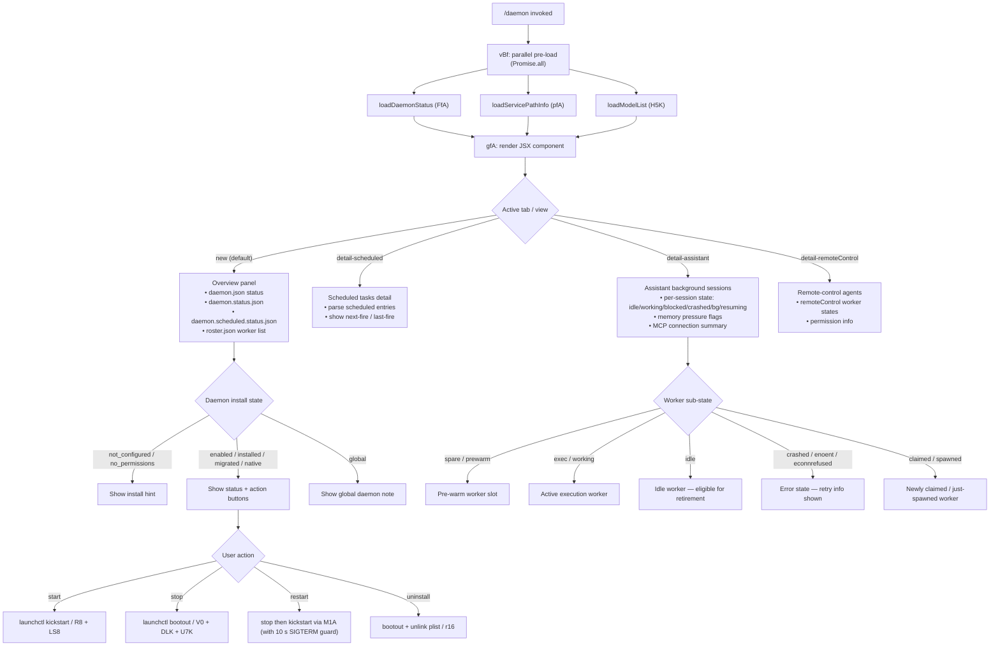

# `/daemon`

> Analysis basis: CC v2.1.167 bundle.js (AST extraction + Claude interpretation)
> Minimum version: v2.1.167

---

## Overview

`/daemon` is an interactive management console for the Claude Code background daemon process and its associated subsystems. It surfaces live status across three distinct views — scheduled tasks, assistant background sessions, and remote-control agents — and provides controls to start, stop, restart, and uninstall the daemon service. The command renders a JSX UI component that queries daemon state, MCP server status, and background worker health in parallel before presenting results.

---

## Registration

| Field | Value |
|---|---|
| type | `local-jsx` |
| name | `daemon` |
| description | Manage background services and routines |
| loc_byte | `12995450` |
| loc_byte_end | `12995618` |
| loc_line | `9616` |
| immediate | `true` |
| module_id | `QfA` |
| load_inline | `true` |
| arbor_handler.name | `vBf` |
| arbor_handler.fqn | `claude-2.1.167::vBf` |
| arbor_handler.kind | `AsyncFunction` |
| arbor_handler.resolution_path | `module_id` |
| arbor_handler.n_hits | `0` |

Analysis basis: CC v2.1.167 bundle.js:+12995450

---

## Input Branching

The command has four or more distinct top-level display branches (tab/view selection) plus multiple nested state branches per view. A Mermaid flowchart is required.



Analysis basis: CC v2.1.167 bundle.js:+12984198 (handler entry), +12985029–+12986277 (tab-name literals), +16203101–+16204698 (worker state literals)

---

## Behavioral Spec

### 1. Handler Entry — `vBf` (AsyncFunction)

```
async function daemonCommandHandler(context):
    [daemonStatus, servicePathInfo, modelList] = await Promise.all([
        loadDaemonStatus(),        // FfA — reads status files, PID files, roster
        loadServicePathInfo(),     // pfA — resolves ~/.config or homedir plist path
        loadModelList()            // H5K → p16 — enumerates available model configs
    ])
    return renderDaemonUI(daemonStatus, servicePathInfo, modelList)
```

Analysis basis: CC v2.1.167 bundle.js:+12984198

---

### 2. Daemon Status Loader — `FfA`

Reads multiple on-disk files concurrently, merges them into a single status object, and detects running processes.

```
async function loadDaemonStatus():
    [mcpServerMap, scheduledStatus, assistantStatus] = await Promise.all([
        loadMcpServerMap(),          // gfK → $GH — reads MCP registry, checks ENOENT
        loadScheduledStatus(),       // V0  — reads daemon.status.json, kills stale PIDs
        loadScheduledStatusAlt(),    // DLK — reads daemon.scheduled.status.json
        loadU7KStatus(),             // U7K — reads daemon.scheduled.status.json variant
        readRoster(),                // Qg  — reads roster.json, validates entries
        readDaemonInfo(),            // Di  — launchctl print, 5000 ms timeout
        enumerateWorkers(),          // Object.keys on result map
    ])
    return merged status object
```

Analysis basis: CC v2.1.167 bundle.js:+12983719 (`j0H`), +12983749 (`Promise.all`), +12983788 (`gfK`), +12983815 (`DLK`), +12983837 (`U7K`), +12983859 (`Qg`), +12983877 (`Di`)

---

### 3. Scheduled-Entry Parser — `yq6` / `l7A`

```
async function parseScheduledEntries(dirPath):
    raw = await fs.readFile(path, "utf8")    // Kx8.readFile, encoding literal "utf8"
    trimmed = raw.trim()
    parsed = JSON.parse(trimmed)             // throws on bad JSON → wrapped by Hu
    if not Array.isArray(parsed):
        throw Error(...)
    entries = parsed.filter(e => e.kind === "scheduled")   // literal "scheduled"
    for each entry:
        validate via WfA (Array.isArray check)
        optionally push XfA-transformed entry
    return entries
```

Analysis basis: CC v2.1.167 bundle.js:+12872163 (`l7A`), +12780949 (`Kx8.readFile`), +12780964 (literal `"utf8"`), +12872175 (literal `"scheduled"`), +12872207 (`WfA`)

---

### 4. Roster Reader — `Qg`

Reads `roster.json`, validates structure, manages stale entries.

```
async function readRoster():
    path = buildRosterPath()               // A$H → ZxH → OO.join, filename "roster.json"
    raw  = await s16.readFile(path)
    if error (h8 check): return empty
    age  = Date.now() - w1A()
    entries = parseRosterEntries(hH, l)   // hH = log-error helper
    for each entry:
        validate schema via jWf (Array.isArray + Object.keys)
        if entry matches regex rMH: rename via _Qq
        else: track via y1 / ym6
    return roster object
```

Key file-name literals: `"roster.json"` (bundle.js:+11505557), `"daemon.json"` (bundle.js:+11499501).

Analysis basis: CC v2.1.167 bundle.js:+11509130 (`Qg`), +11509152 (`A$H`), +11509212 (`hH`), +11509419 (`jWf`)

---

### 5. Daemon Control Operations

#### 5a. Stop daemon — `V0` / `DLK` / `U7K`

```
async function stopDaemon(statusFilePath):
    status = await readStatusFile(YS6)          // up.readFile → D0H path helper
    pid    = parsePid(A1A)                      // splits on newline, slices
    if pid is alive:
        process.kill(pid, signal)               // SIGTERM first, then SIGKILL if needed
    cleanup via w2
```

Status file names: `"daemon.status.json"` (bundle.js:+12780168), `"daemon.scheduled.status.json"` (bundle.js:+12870670).

Analysis basis: CC v2.1.167 bundle.js:+11499008 (`YS6`), +11499036 (`process.kill`), +11499086 (`A1A`), +12780651 (`DLK` → `process.kill`), +12871076 (`U7K` → `process.kill`)

#### 5b. Start / install — `R8` + `LS8`

```
function startDaemon():
    // R8 resolves launchctl plist path via C_ (YZH, D, FE4, O$, V8 chain)
    // LS8 reads current uid via lgq → process.getuid()
    runLaunchctl("kickstart", plistLabel)       // literal "kickstart" (bundle.js:+11501952)
```

Analysis basis: CC v2.1.167 bundle.js:+11503028 (`Di` → `R8`), +11503052 (`LS8`), +11499885 (`lgq` → `process.getuid`)

#### 5c. Restart — `M1A`

```
async function restartDaemon():
    label = LS8()           // get launchd service label
    R8()                    // resolve plist path
    await stop()            // launchctl "bootout"
    // Guard: if daemon has not exited within 10 s of SIGTERM, abort restart
    // Literal: "daemon did not exit within 10s of SIGTERM; restart aborted before kickstart"
    //           (bundle.js:+11502274)
    cgq.setTimeout(...)     // launchctl "kickstart"
```

Analysis basis: CC v2.1.167 bundle.js:+11501835 (`M1A`), +11502230 (`cgq.setTimeout`), +11502274 (timeout error literal)

#### 5d. Uninstall — `r16`

```
async function uninstallDaemon():
    path = f1A()            // wS6.join + K1A.homedir → ~/Library/LaunchAgents path
    R8()                    // resolve plist
    LS8()                   // get uid
    bootout via launchctl   // literal "bootout" (bundle.js:+11501589)
    p9H.unlink(path)        // remove plist file
    GH()                    // log result
```

Note: uninstall is explicitly unavailable on darwin for the service path variant — literal `"service uninstall not available on darwin"` (bundle.js:+11501721). The standard LaunchAgents path is used instead: `~/Library/LaunchAgents` (literals bundle.js:+11499816, +11499826).

Analysis basis: CC v2.1.167 bundle.js:+11501561 (`f1A`), +11501573 (`R8`), +11501629 (`p9H.unlink`), +12984840 (literal `"uninstall"`)

---

### 6. MCP Server Map Loader — `gfK` / `$GH`

```
async function loadMcpServerMap():
    store = V9()                            // aNL.getStore() — async-local store
    if store is null: return {}
    try:
        serverMap = $GH(store)             // iterates server configs
    catch ENOENT:                          // literal "ENOENT" (bundle.js:+12966497)
        return {}
    servers = Object.keys(serverMap)
    result  = []
    for server in servers:
        pid  = ib(server)                  // reads daemon.json socket path
        slot = K.has(server) ? "same-dir" : basename  // literal "same-dir" (bundle.js:+12972102)
        result.push({ server, pid, slot })
    return result
```

Analysis basis: CC v2.1.167 bundle.js:+12971935 (`$GH`), +12966464 (`V9`), +12971939 (`ib`), +12972004 (`V0`), +12972059 (`x$H.basename`), +12972102 (literal `"same-dir"`)

---

### 7. Service Path Resolver — `pfA`

```
async function loadServicePathInfo():
    w_result   = W_()               // checks feature flag tv
    langSuffix = _l6()              // d6 + h8 chain
    basePath   = path.join(b$H, pfK.homedir(), ...)
    stat       = await kC6.stat(basePath)
    if stat error (h8):
        return { installed: false, kind: "not_configured" }
    role       = v()                // onK → vPA → sdK/tdK chain; checks H.includes
    envStr     = _.toUpperCase()
    formatted  = G4()               // q0A map + H.replace + slice
    return { path: basePath, role, kind, env: formatted }
```

Relevant `kind` literals: `"not_configured"`, `"no_permissions"`, `"enabled"`, `"installed"`, `"migrated"`, `"native"`, `"global"` (bundle.js:+3263122–+3263141).

Analysis basis: CC v2.1.167 bundle.js:+12968042 (`W_`), +12968072 (`b$H.join`), +12968081 (`pfK.homedir`), +12968125 (`kC6.stat`), +12968164 (`v`)

---

### 8. Background Worker Supervisor Loop — `w` (supervisor)

The string literal `"supervisor"` (bundle.js:+16211423) identifies the background-worker supervisor. It manages a pool of background sessions and is observed (not directly invoked) by `/daemon`.

```
function supervisorLoop():
    workers = A.get(workerId)
    for worker in A.values():
        worker.retireIfSettled()        // Q.retireIfSettled
    freemem = dwA.freemem()            // os.freemem
    if freemem < threshold:
        // tengu_bg_dispatch_low_mem telemetry
        shed non-pinned workers
        if still low:
            // tengu_bg_retire_pinned_low_mem telemetry
            // literal: "bg: low memory persists after shedding non-pinned..."
            shed pinned settled workers
    prewarm_count = 0
    for slot in slots:
        if slot.state === "idle":
            d.respawnIfIdleStale()
        else if slot.state === "prewarm":
            prewarm_count++
    // tengu_bg_prewarm_per_sweep telemetry
    setTimeout(supervisorLoop, interval)
```

Worker states observed by the UI: `"spare"`, `"exec"`, `"idle"`, `"prewarm"`, `"claimed"`, `"spawned"`, `"bg"`, `"working"`, `"blocked"`, `"crashed"`, `"done"`, `"killed"`, `"active"`, `"resuming"` (bundle.js:+16197596–+16204698).

Analysis basis: CC v2.1.167 bundle.js:+16196686 (`w`), +16197235 (`dwA.freemem`), +16197405 (telemetry `tengu_bg_dispatch_low_mem`), +16198566 (`YQ.spawn`), +16201530 (telemetry `tengu_bg_prewarm_per_sweep`)

---

### 9. Daemon Stop Telemetry Hooks — `z` (stop handler)

```
function daemonStopHandler():
    SH()    // emit tengu_daemon_stop
    CH()    // emit tengu_daemon_stop_failed (on error path)
    xh()    // teardown active connections
    sp()    // race: Promise.race([shutdown signal, Promise.all([...]), r8 timer])
            // 500 ms grace window (literal 500 at bundle.js:+16228817)
    process.exit()
```

Literals: `"daemon_stop"` (bundle.js:+16233699), `"daemon_stop_failed"` (bundle.js:+16233736).

Analysis basis: CC v2.1.167 bundle.js:+16233696 (`z`), +16233699 (literal), +16233774 (telemetry `tengu_daemon_control`), +16228773 (`sp` → `Promise.race`)

---

### 10. Roster Entry Management — `_Qq`

When a roster entry's filename matches a rename-eligibility regex, the entry is migrated atomically:

```
async function rotateRosterEntry(entry):
    await s16.rename(oldPath, newPath)   // A$H builds new path
    entry.timestamp = Date.now()
    log via hH
```

Analysis basis: CC v2.1.167 bundle.js:+11509765 (`_Qq` → `s16.rename`), +11509776 (`A$H`), +11509802 (`Date.now`)

---

## State & Side Effects

| Item | Detail |
|---|---|
| Telemetry — roster | `tengu_bg_roster_parse_failed` (bundle.js:+11509220) |
| Telemetry — daemon control | `tengu_daemon_control` (bundle.js:+16233774) |
| Telemetry — daemon stop | `tengu_daemon_stop` / `tengu_daemon_stop_failed` (via `SH`/`CH` at +16233699, +16233736) |
| Telemetry — daemon yield | `tengu_daemon_yield` (bundle.js:+16216439) |
| Telemetry — daemon config reload | `tengu_daemon_config_reload` (bundle.js:+16212216) |
| Telemetry — daemon idle exit | `tengu_daemon_idle_exit` (bundle.js:+16217469) |
| Telemetry — bg sessions | `tengu_bg_dispatch_sigkill_escalate`, `tengu_bg_low_mem_mb`, `tengu_bg_dispatch_low_mem`, `tengu_bg_adopt_sock_unlinked`, `tengu_bg_spare_enable`, `tengu_bg_sendclaim_failed`, `tengu_bg_state_read_transient`, `tengu_bg_spare_claim`, `tengu_bg_spare_claim_fail`, `tengu_bg_retire_grace_bridged_min`, `tengu_bg_retire_pinned_low_mem`, `tengu_bg_attach_upgrade`, `tengu_bg_prewarm_per_sweep`, `tengu_bg_session_create` |
| Telemetry — scheduled tasks | `tengu_scheduled_task_fire`, `tengu_scheduled_task_expired` |
| Telemetry — MCP OAuth | `tengu_mcp_oauth_flow_start`, `tengu_mcp_oauth_flow_success`, `tengu_mcp_oauth_flow_error` |
| Telemetry — config | `tengu_config_auth_loss_prevented`, `tengu_config_parse_error` |
| Telemetry — features | `tengu_feature_ok`, `tengu_feature_bad`, `tengu_feature_sad` |
| Telemetry — voice (reachable via worker graph) | `tengu_voice_silent_drop_replay`, `tengu_voice_recording_completed` |
| Telemetry — MCP skills | `tengu_mcp_skills` |
| Disk reads | `daemon.json`, `daemon.status.json`, `daemon.scheduled.status.json`, `roster.json`, `mcp-needs-auth-cache.json`, `pins.json` |
| Disk writes | Roster rename (`s16.rename`), plist unlink (`p9H.unlink`), log file append (`ly.appendFile`) |
| Process signals sent | `SIGTERM` (stop), `SIGKILL` (escalation after 10 s), via `process.kill` |
| launchctl calls | `print`, `bootout`, `kickstart` |
| appState changes | Daemon config reload fires `tengu_daemon_config_reload`; supervisor writes roster entries; MCP server map is refreshed via `Y.stop` / `Y.start` / `Y.updateConfig` chain |
| Sound | None detected in depth-2 traversal |
| Immediate rendering | `immediate: true` — JSX is rendered without waiting for a follow-up user message |

---

## Version History

| Version | Change |
|---|---|
| v2.1.167 | Initial analysis |

---

## Common Mistakes

1. **Running `/daemon` outside a project with a configured daemon** — when the daemon plist is absent (`stat` fails) the command renders an install hint rather than status controls; no error is thrown.
2. **Expecting synchronous output** — the handler is async (`AsyncFunction`); all status files are fetched in parallel before the UI renders. On a cold filesystem this adds a short delay.
3. **Attempting "uninstall" on a non-darwin host** — the literal `"service uninstall not available on darwin"` (bundle.js:+11501721) reveals a darwin-specific guard; behaviour on Linux is controlled by a separate code path through `DLK`/`U7K`.
4. **Assuming restart is instantaneous** — restart issues a SIGTERM and waits up to 10 seconds for the daemon to exit before calling `kickstart`. If the daemon is hung the restart is aborted (bundle.js:+11502274).
5. **Confusing tab names with command sub-commands** — `detail-scheduled`, `detail-assistant`, and `detail-remoteControl` are internal UI tab identifiers, not CLI arguments. `/daemon` accepts no sub-command tokens.

---

## Appendix — Identifier Mapping

> For bundle debugging only. Identifiers change across versions.

| Identifier | Role |
|---|---|
| `vBf` | Main handler (AsyncFunction) — daemon command entry point |
| `bBf` | Render wrapper / JSX mount function |
| `FfA` | Daemon status aggregator (parallel file reads) |
| `gfA` | JSX React component for the daemon UI |
| `pfA` | Service path / plist info resolver |
| `H5K` | Model list loader (→ `p16`) |
| `p16` | Model config enumerator |
| `qJf` | Model definition factory |
| `rfK` | Sub-aggregator: scheduled + roster + hH + V0 |
| `yq6` | Scheduled-entry directory scanner |
| `l7A` | Scheduled JSON file reader / validator |
| `WfA` | Array-shape validator for scheduled entries |
| `XfA` | Entry transformer for scheduled entries |
| `hH` | Error-logging helper (AA + _6 chain) |
| `AA` | Error constructor wrapper |
| `V0` | `daemon.status.json` reader + PID killer |
| `YS6` | Status-file reader (up.readFile → D0H) |
| `A1A` | PID file line parser (split + slice) |
| `w2` | Cleanup helper after stop (→ Eh) |
| `DLK` | `daemon.status.json` variant reader + PID killer |
| `zC6` | Status path builder (OLK.join + t8) |
| `U7K` | `daemon.scheduled.status.json` reader + PID killer |
| `p7K` | Scheduled-status path builder (u7K.join + t8) |
| `Qg` | `roster.json` reader + validator + rotate |
| `A$H` | Roster path builder (OO.join → ZxH) |
| `ZxH` | Base roster directory path helper |
| `w1A` | Timestamp helper (Date.now wrapper) |
| `_Qq` | Roster entry rename/rotate |
| `jWf` | Schema validator (Array.isArray + Object.keys) |
| `Di` | launchctl query wrapper (→ R8 + LS8) |
| `R8` | Plist/label resolver (→ C_ chain) |
| `C_` | Plist path constructor (YZH, D, FE4, O$, V8) |
| `LS8` | launchd service label reader (→ lgq) |
| `lgq` | UID fetcher (process.getuid) |
| `r16` | Daemon uninstall handler (f1A + R8 + LS8 + p9H.unlink) |
| `f1A` | LaunchAgents plist path builder (wS6.join + K1A.homedir) |
| `JS6` | Daemon start/restart wrapper (→ M1A) |
| `M1A` | Restart orchestrator (LS8 + R8 + cgq.setTimeout) |
| `gfK` | MCP server map loader (→ $GH + ib + V0) |
| `$GH` | MCP server config iterator (V9 + V8 + mfA + Object.keys) |
| `V9` | Async-local store accessor (aNL.getStore) |
| `ib` | Daemon socket path builder (q1A.join + t8) |
| `GH` | String coercion / log helper |
| `K` | padEnd-based column formatter (L.map + f.padEnd) |
| `v` | Environment variable builder (NUH + onK + H.includes chain) |
| `onK` | Env key validator (KI + f0A + vPA) |
| `vPA` | Env sanitiser (sdK + tdK) |
| `G4` | String formatter / redactor (q0A + H.replace + A.lastIndexOf + slice) |
| `enK` | File-write helper with rotation (npH + YKH + cl8 + tnK + j9) |
| `cl8` | Log file rotator (ly.stat + rename/unlink) |
| `tnK` | Appending file writer (ly.mkdir + ly.appendFile) |
| `j9` | Signal registration (VPA.register) |
| `M` | MCP server manager (xbH + XF8 + dDA) |
| `xbH` | MCP connection orchestrator |
| `XF8` | MCP connection result applier (applyMcpUpdate) |
| `dDA` | MCP retry loop (getClients + lD8 + xbH + XF8) |
| `Dk8` | MCP server connection driver (W9H + QA6 + an + Y) |
| `W9H` | MCP stdio/http client handler |
| `an` | MCP reconnect logic |
| `Y` | MCP config supervisor (stop/start/updateConfig + E.start) |
| `w` | Background session supervisor main loop |
| `Q` | Background session process manager (retireIfSettled + kill) |
| `mwA` | Claim-send helper (YQ.claim + bF8.connect + fy) |
| `QwA` | Worker lifecycle manager (spawn + roster + file cleanup) |
| `z` | Daemon shutdown / stop handler |
| `sp` | Graceful shutdown race (Promise.race + process.exit) |
| `SH` | `tengu_daemon_stop` emitter |
| `CH` | `tengu_daemon_stop_failed` emitter |
| `h` | Background health-check sweep (memory, respawn, retire) |
| `d` | Background session clock / scheduler |
| `r` | Voice-recording + background session handler |
| `px8` | Voice WebSocket stream client |
| `p16` | Model config enumerator / list builder |
| `lM` | Model metadata helper (→ MA) |
| `MA` | Platform tag resolver (_6 chain) |
| `N5` | Model display-name builder (upH + WAL + U31 + ct6 + MA) |
| `bT` | Model tag builder (lM + N5 + MA) |
| `KJf` | Model filter / selection logic (xj + e1 + CI + DdH) |
| `P` | Input/editor component (OK.fromText + TOA.execute) |
| `TOA` | Vim-mode input handler |
| `W` | Permission/team context component (lV6) |
| `lV6` | Teammate mailbox UI component (JRH + p5H) |
| `J` | Session list component (→ w loop) |
| `b4H` | Process output line trimmer (_6H + _.trim) |
| `C` | Rate-limit event queuer (R6K + k.enqueue + Jj.randomUUID) |
| `g` | Idle-timer / spinner updater |
| `U` | clearInterval wrapper |
| `fy` | Binary frame builder (Buffer.from + writeUInt32BE + writeUInt8) |
| `zLK` | Daemon config change publisher (Yo + Date.now + V9 + zC6 + RH) |
| `Yo` | Config-change broadcaster (b4H) |
| `D6` | MCP skill-discovery hook (dj6 + cj6 + hu + HwH.has + gj6.add) |
| `tN` | MCP skill dispatcher (→ D6) |
| `sk` | MCP server list builder |
| `_T6` | SSE/HTTP server slot processor |
| `pD8` | Tool hash builder (vAH + Object.keys) |
| `tXH` | Tool fingerprint hasher (RH + Array.isArray + Xp9.createHash sha256) |
| `dk8` | MCP cache path builder (Qk8.join + t8, filename `"mcp-needs-auth-cache.json"`) |
| `VHA` | MCP server state reader (V9 + dk8 + U6) |
| `mhq` | MCP reconnect trigger (Fk8.then + VHA + V9 + dk8 + RH) |
| `Ee_` | MCP error broadcaster (EP + z4 + M8 + GH) |
| `cx8` | macOS memory/cpu reader (r6 + D6) |
| `gC6` | Memory metric collector (cx8 + fMK.freemem) |
| `MMK` | Memory threshold checker (→ D6) |
| `lx8` | Low-memory bridge helper (→ D6) |
| `tX6` | Pin-file reader (k2.readFile + EZ_ + kgL) |
| `kgL` | Pin directory scanner (k2.readdir + k2.readFile + Hf9) |
| `RK` | Session directory path builder (y2.join + sT) |
| `e9` | Session state file reader + cache (k2.stat + k2.readFile + R7H/OjH maps) |
| `VY` | Session state aggregator (→ GN) |
| `zf` | Session info reader (XY + y2.join + RH + oj) |
| `t16` | Roster tail-watcher (AQq.then + Qg + Date.now + JWf) |
| `q$H` | Roster path helper (OO.join + NxH) |
| `yE` | Roster split-line reader (r6 + OO.join + NxH + H.split) |
| `gg` | Roster entry lister (r6 + O1A + OO.join + a16) |
| `XS6` | Roster directory creator (OO.join + D1A) |
| `c` | PID-file / socket cleanup helper (YS6 + ggq) |
| `ggq` | Socket unlink helper (up.unlink + D0H + h8) |
| `G` | Agent session manager (z46 + rS + wv + Promise.all + Hi + MF + hH + AA) |
| `T` | Agent clock holder (cy6 + z46) |
| `jH` | MCP message dispatcher (sendMcpMessage + L8.cleanup + Qhq + Au + sz9 + JmK) |
| `QzA` | Session path builder + file tracker ($4 + gzA.basename + _.add + Nw + hEK + jA5) |
| `r` | Session conductor (finishRecording + voice + background loop + NH) |
| `NH` | Session data stream wrapper |
| `SpH` | Language/locale helper (H.toLowerCase + MPA.has + _.split) |
| `IVL` | Config file watcher (HK8.watchFile + d6 + x9 + lP_ + co + j9 + HK8.unwatchFile) |
| `LwH` | Config file reader/writer with backup (q.readFileSync + JSON + q.mkdirSync + q.copyFileSync) |
| `C6` | Config change dispatcher (d6 + qZ + lP_ + LwH + Date.now + IVL) |