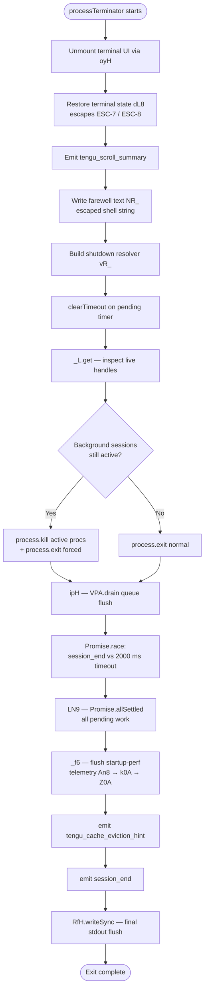

# `/exit`

> Analysis basis: CC v2.1.167 bundle.js (AST extraction + Claude interpretation)
> Minimum version: v2.1.167

---

## Overview

The `/exit` command (also available as `/quit`) terminates the current Claude Code CLI session immediately. It is classified as a `local-jsx` command with the `immediate` flag set, meaning it executes without waiting for any pending agent response. The implementation (handler `lxf`) orchestrates a multi-phase shutdown sequence: it displays a farewell message, flushes conversation logs, tears down background daemon connections, and finally calls `process.exit`.

---

## Registration

| Field | Value |
|---|---|
| type | `local-jsx` |
| name | `exit` |
| description | `null` |
| aliases | `["quit"]` |
| immediate | `true` |
| module_id | `LKK` |
| load_inline | `true` |
| loc_byte | `12679180` |
| loc_byte_end | `12679376` |
| loc_line | `9080` |
| arbor_handler.name | `lxf` |
| arbor_handler.fqn | `claude-2.1.167::lxf` |
| arbor_handler.kind | `AsyncFunction` |
| arbor_handler.resolution_path | `module_id` |
| arbor_handler.n_hits | `1` |

Analysis basis: CC v2.1.167 bundle.js:+12679180

---

## Input Branching

The `/exit` command has a linear, single-path flow — there are no user-supplied arguments to branch on. The `immediate: true` flag means the command fires before the current agent turn completes. The only conditional logic lies inside the shutdown sequence (daemon present vs. absent, background sessions active vs. idle), which is internal to the handler and not driven by user input.

```
1. User types /exit (or /quit alias).
2. immediate flag fires handler lxf without waiting for agent.
3. Handler renders "Goodbye!" farewell element via JSX.
4. Flush + teardown sequence begins (see Behavioral Spec).
5. process.exit is called.
```

---

## Behavioral Spec

### 1. Entry point — handler `lxf`

```
async function exitCommandHandler(context):
    // Emit telemetry for prompt-input exit path
    emit("prompt_input_exit")                        // +12678617

    // Step 1: fire session-state cleanup (J9 → dYH)
    await cleanupSessionState(context)               // +12678429

    // Step 2: initiate graceful shutdown coordinator (H)
    await gracefulShutdownCoordinator(context)       // +12678441

    // Step 3: detach from background daemon (oMH)
    detachFromDaemon(context)                        // +12678445

    // Step 4: flush global state / config manager (GM)
    flushGlobalManager(context)                      // +12678462

    // Step 5: build and push scheduled-task flush (Jh8)
    flushScheduledTasks(context)                     // +12678476

    // Step 6: render JSX farewell element
    return createElement(FarewellComponent, props)   // +12678506

    // Step 7: call final process terminator (A9)
    await processTerminator(context)                 // +12678612
```

Analysis basis: CC v2.1.167 bundle.js:+12678429

---

### 2. Farewell message display

The string `"Goodbye!"` (bundle.js:+12678393) is passed to a JSX element created via `A7A.createElement` (+12678506). The `cxf` helper (+12678599) wraps an inner component (`c2`, +12678384) to build the rendered output. This JSX node is returned as the command's visual output before shutdown proceeds.

Analysis basis: CC v2.1.167 bundle.js:+12678393

---

### 3. Session-state cleanup (`cleanupSessionState` — `J9` → `dYH`)

```
function cleanupSessionState(context):
    // Invokes dYH to flush in-memory session records
    sessionRecordsFlusher()                          // +2256843
    // Related literals indicate process-mode awareness:
    //   "bg", "daemon", "daemon-worker"             // +2256766..+2256790
```

Analysis basis: CC v2.1.167 bundle.js:+12678429 → +2256843

---

### 4. Graceful shutdown coordinator (`gracefulShutdownCoordinator` — `H`)

```
async function gracefulShutdownCoordinator(context):
    // Logs "[Bootstrap] Fetching" debug line (v)    // +15797460
    logBootstrapStatus()

    // Checks content-type / user-agent headers for
    // any in-flight HTTP requests                   // +15797545..+15797579

    // Resolves pending model identifiers via uj_    // +15797600
    resolvePendingModelIdent()

    // Checks the obfuscated filter set lHH          // +15797631
    checkFilterSet()

    // Applies text normalisation (uj / H9)          // +15797643
    normaliseText()

    // Times out after 5000 ms                       // +15797661
    timeoutMs = 5000

    // On completion emits "api_bootstrap_fetch"     // +15797782
    emit("api_bootstrap_fetch")
```

Analysis basis: CC v2.1.167 bundle.js:+15797458

---

### 5. Daemon detach (`detachFromDaemon` — `oMH`)

```
function detachFromDaemon(context):
    // Sends a "detach-request" message              // +11038680
    sendDetachRequest()

    // Serialises state via Ae (write + JSON.stringify)  // +11038671
    serialiseAndWrite()

    // Checks background session object bH8          // +11038646
    inspectBackgroundSession()

    // Uses Spq to select between task/daemon paths
    //   literals: "task"                            // +11033242
    resolveTaskOrDaemonPath()

    // Updates S9H (session handle)                  // +11038726
    updateSessionHandle()
```

Analysis basis: CC v2.1.167 bundle.js:+12678445

---

### 6. Scheduled-task flush (`flushScheduledTasks` — `Jh8`)

```
function flushScheduledTasks(context):
    // Resolves the next scheduled task timer (jT → tv)  // +11032092
    resolveNextTimer()

    // Pushes a "scheduled task" completion marker   // +11032111
    pushScheduledTaskCompletion()

    // Delegates to cwf for cron-style time parsing  // +11032138
    parseCronExpression()
    //   Internally uses RN for rule matching,
    //   Yk for trim/split, EoH for date arithmetic

    // Uses a9 for string-width-aware truncation     // +11032153
```

Analysis basis: CC v2.1.167 bundle.js:+12678476

---

### 7. Process terminator (`processTerminator` — `A9`)

This is the most complex sub-function. It orchestrates the final resource teardown before calling `process.exit`.



Key constants observed in this path:

- Shutdown race timeout: **2000 ms** (bundle.js:+5456762)
- Grace period maximum: **3500 ms** (bundle.js:+5456584)
- Unreachable sentinel string: `"unreachable"` (bundle.js:+5454770) — thrown if `vR_` reaches an impossible state

Analysis basis: CC v2.1.167 bundle.js:+5456480 → +5457044

---

### 8. Terminal screen restoration (`clearScreen` — `dL8`)

```
function restoreTerminalScreen():
    // Writes ESC-7 (save cursor) then ESC-8 (restore cursor)  // +3789099, +3789110
    writeEscapeSequence(ESC_SAVE)
    writeEscapeSequence(ESC_RESTORE)

    // Detects multiplexer environment via QW:
    //   "tmux" → replaces double-ESC sequences      // +3437232
    //   "screen" → similar replacement              // +3437305
    normaliseMuxEscapes()

    // Terminal capability checks via MIH:
    //   "ghostty" ≥ 1.2.0                           // +3516716, +3516746
    //   "iTerm.app" ≥ 3.6.6                         // +3516785, +3516817
    checkTerminalCapabilities()
```

Analysis basis: CC v2.1.167 bundle.js:+3789119

---

### 9. Log / conversation flush (`enK` sub-system)

Called indirectly during the shutdown coordinator path. It is responsible for persisting the session transcript to disk before the process exits.

```
function flushConversationLog():
    // Computes transcript directory via IHH.dirname  // +206115
    logDir = path.dirname(logPath)

    // Creates directory if needed (tnK → ly.mkdir)  // +205836
    ensureLogDirectory(logDir)

    // Appends conversation data (ly.appendFile)     // +205895
    appendSessionData()

    // Rotates old log files via cl8:
    //   rename .txt suffix files                    // +205511
    //   unlinks files beyond rotation limit (4)     // +205533
    rotateLogs()

    // Measures byte length (Buffer.byteLength)      // +206290
    byteLen = Buffer.byteLength(data)

    // Drains write queue (j9 → VPA.register)        // +60369
    drainWriteQueue()
```

Analysis basis: CC v2.1.167 bundle.js:+206082 → +206445

---

## State & Side Effects

| Item | Detail |
|---|---|
| Telemetry: `prompt_input_exit` | Fired at handler entry (+12678617) — records that the user explicitly typed `/exit` |
| Telemetry: `tengu_scroll_summary` | Emitted during terminal-UI unmount phase (+5455866) |
| Telemetry: `tengu_cache_eviction_hint` | Emitted just before final `session_end` event (+5456936) |
| Telemetry: `tengu_startup_perf` | Emitted via `_f6` → `An8` startup profiling flush (+217609) |
| Telemetry: `tengu_amber_creek` | Emitted via `$1` fullscreen-mode detection path (+3446931) |
| Telemetry: `tengu_pewter_brook` | Emitted via `$1` alternate display-mode path (+3446839) |
| Telemetry: `tengu_feature_sad` | Emitted via `o6` → `l` (+1011093) — records sad-path feature event |
| Telemetry: `session_end` | Emitted via `P6` → `ym6` (+5456971) — canonical session-close event |
| Telemetry: `api_bootstrap_fetch` | Emitted when bootstrap HTTP fetch concludes during shutdown (+15797782) |
| Terminal state | ESC-7/ESC-8 save/restore sequences written; multiplexer escape normalisation applied |
| Log files | Session transcript appended and rotated (up to 4 `.txt` rotation slots) |
| Background daemon | Sends `"detach-request"` message; active background sessions sent SIGKILL if unresponsive after grace period |
| Process handles | `clearTimeout` on pending timers; `JXH.unref()` to allow clean exit (+5456593) |
| `process.exit` | Called via `vR_` (+5454697); `process.kill` also used when forced shutdown is required (+5454722) |
| Farewell display | JSX element containing `"Goodbye!"` rendered to terminal before teardown |
| `immediate` flag | Command executes without waiting for any in-progress agent response |

---

## Version History

| Version | Change |
|---|---|
| v2.1.167 | Initial analysis |

---

## Common Mistakes

1. **Using `/exit` to abort a running tool call**: because `immediate: true` is set, the command fires before the current agent turn finishes, but it does not cancel in-flight tool executions instantaneously — the shutdown grace period (up to 3500 ms, +5456584) allows pending work to settle.
2. **Assuming `/quit` behaves differently**: `/quit` is a registered alias for `/exit` and runs the identical `lxf` handler — there is no behavioural difference.
3. **Expecting an interactive confirmation prompt**: `/exit` does not ask "are you sure?" — it terminates immediately. Any unsaved state not flushed by the `enK` log system will be lost.
4. **Ignoring background sessions**: if background daemon sessions are active, the handler escalates to `process.kill` with SIGKILL after the grace period. Background tasks are not cleanly paused — they are terminated.
5. **Relying on teardown order for side effects**: the shutdown sequence (daemon detach → log flush → terminal restore → process.exit) is fixed; external code that hooks into `process.exit` may see a partially torn-down state.

---

## Appendix — Identifier Mapping

> For bundle debugging only. Identifiers change across versions.

| Identifier | Role |
|---|---|
| `lxf` | Main exit command handler (AsyncFunction, arbor_handler) |
| `J9` | Session-state cleanup dispatcher |
| `dYH` | Session records flusher (called by J9) |
| `H` | Graceful shutdown coordinator (bootstrap/HTTP layer) |
| `v` | Bootstrap debug logger |
| `onK` | HTTP header builder |
| `vPA` | Header value formatter |
| `RH` | JSON serialiser wrapper |
| `G4` | Path/string normaliser |
| `q0A` | Path segment mapper |
| `EUH` | Stream writer helper |
| `lWA` | Low-level write dispatcher |
| `enK` | Conversation log flush orchestrator |
| `npH` | Write-queue drain with timer management |
| `YKH` | Log-path join and rotation helper |
| `d6` | Directory existence checker |
| `U76` | Filesystem utility (V8 delegate) |
| `M0A` | Log path builder |
| `cl8` | Log file rotate-and-unlink helper |
| `tnK` | Log directory creator + append writer |
| `j9` | Write-queue registrar (VPA.register) |
| `Y3` | Bootstrap state getter |
| `uj_` | Input string splitter/trimmer |
| `lHH` | Filter-set membership checker |
| `uj` | Text replace normaliser |
| `H9` | Token/model name dispatcher |
| `m6H` | Model name resolution chain |
| `Q0` | Model alias resolver |
| `aqH` | Alias lookup helper |
| `qB` | Provider/model classifier |
| `s9` | Model string normaliser |
| `Y2` | Model name regex helper |
| `h4H` | Model inclusion checker |
| `CI` | Model context builder |
| `DdH` | Model constraint checker |
| `bT` | Model metadata builder |
| `cP1` | Model capability resolver |
| `lM` | Model ancestor resolver |
| `VH8` | Model list inclusion checker |
| `wdH` | Model string transformer |
| `FJ` | Token classifier dispatcher |
| `_G` | Composite model descriptor builder |
| `o6` | Feature-sad telemetry emitter |
| `l` | Low-level event logger |
| `J6` | Event route dispatcher |
| `ym6` | Core event emitter |
| `oMH` | Daemon detach orchestrator |
| `bH8` | Background session inspector |
| `Spq` | Task/daemon path selector |
| `Uy8` | Daemon channel helper |
| `b8` | Background session state accessor |
| `Ae` | State serialiser + writer |
| `S9H` | Session handle updater |
| `GM` | Global state / config manager flush |
| `Jh8` | Scheduled-task flush orchestrator |
| `jT` | Timer resolver |
| `tv` | Core timer primitive |
| `cwf` | Cron-expression parser |
| `RN` | Cron-rule matcher |
| `K` | Padded-column formatter |
| `w` | Background session lifecycle manager |
| `L` | Async operation tracker |
| `j` | Background process kill helper |
| `D` | Forced-shutdown invoker (process.exit + z.abort) |
| `$` | zLK-backed signal dispatcher |
| `J` | UTC date arithmetic helper |
| `Yk` | Cron-field trimmer |
| `saL` | Cron-field set builder |
| `EoH` | Date/time offset calculator |
| `O` | Background-session stopped-state tracker |
| `f` | Stream handle closer |
| `$9` | Time-duration formatter (floor/round) |
| `a9` | String-width-aware substring helper |
| `H8` | Bun.stringWidth wrapper |
| `W1` | Wide-character column calculator |
| `aY` | Grapheme cluster helper |
| `cxf` | JSX farewell component wrapper |
| `A9` | Process terminator (main exit sequence) |
| `oyH` | Terminal UI unmount + final write |
| `xC` | Terminal cleanup helper |
| `dL8` | Terminal screen restore (ESC-7/ESC-8) |
| `MIH` | Terminal capability detector (ghostty, iTerm) |
| `evH` | Terminal event handler teardown |
| `QW` | Multiplexer escape normaliser (tmux/screen) |
| `O$` | Output stream finaliser |
| `NR_` | Farewell text writer (escaped shell strings) |
| `wT` | Write-target selector |
| `Cx` | Cursor position helper |
| `R6` | Core timer/ticker primitive |
| `_G6` | Path stat checker (statSync) |
| `xR` | Timer variant A |
| `W_` | Timer variant B |
| `s$` | Shutdown sequence entry (R6 + r4) |
| `r4` | Shutdown step executor (j9 delegate) |
| `sV9` | String escape helper |
| `vR_` | Shutdown resolver (clearTimeout, process.exit, process.kill) |
| `ipH` | Write-queue drainer (VPA.drain) |
| `Y` | Session supervisor manager |
| `$GH` | Session state snapshotting helper |
| `V9` | AsyncLocalStorage store getter |
| `V8` | Filesystem utility core |
| `mfA` | Session state merger |
| `GH` | String coercer for session keys |
| `mfK` | Session metrics collector |
| `T` | Supervisor process handle |
| `cy6` | Supervisor stop variant A |
| `z46` | Supervisor stop variant B |
| `E` | Rendering/display engine |
| `WUK` | Heartbeat handler (S8H delegate) |
| `S8H` | Heartbeat tick emitter |
| `V` | Display engine starter |
| `LN9` | Promise.allSettled pending-work waiter |
| `_f6` | Startup-perf telemetry flusher |
| `An8` | Perf checkpoint collector (k0A delegate) |
| `k0A` | Performance mark recorder |
| `Z0A` | Perf report file writer |
| `v0A` | Perf report path builder (variant A) |
| `jOH` | Synchronous file write helper (openSync/writeFileSync/fsyncSync/closeSync) |
| `W0A` | Perf report formatter |
| `px` | Node.js `require` wrapper |
| `I0A` | Perf report path builder (variant B) |
| `Bz8` | Scroll-summary telemetry emitter |
| `aV9` | Scroll metric collector |
| `oV9` | Scroll timing calculator |
| `iV9` | Scroll inner helper |
| `$1` | Display-mode / fullscreen detector |
| `VW_` | Display-mode flag resolver |
| `qa` | VIL-backed mode selector |
| `ZW_` | Windows SSH / ConPTY detector |
| `l_` | Display utility (gU delegate) |
| `NIL` | Fullscreen fallback path (D6 delegate) |
| `D6` | Display configuration applier |
| `DL6` | Deferred layout resolver |
| `P6` | Session-end event emitter (ym6 delegate) |
| `Fz8` | Promise.all / Promise.race shutdown combiner |
| `r8` | Timeout/abort wrapper with unref |

---

Note: index built via Arbor fallback; some signals (telemetry, literals) may be missing — see arbor-fallback.js.