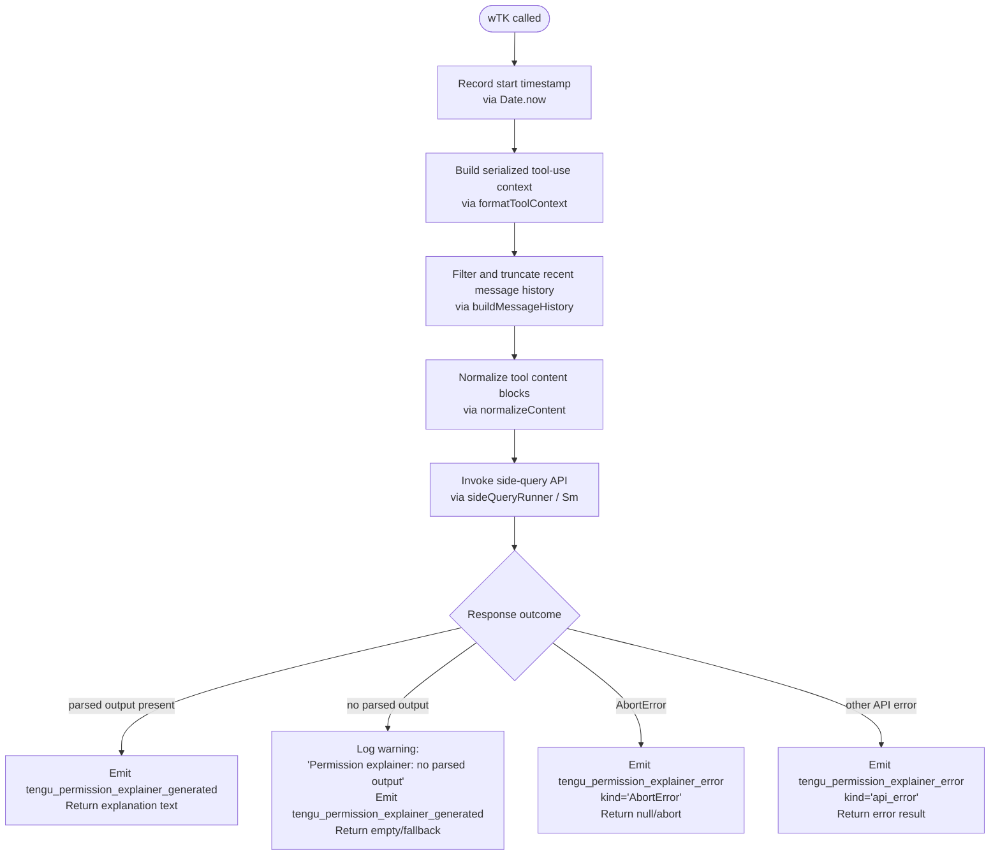

# `/explain_command`

> Analysis basis: CC v2.1.167 bundle.js (AST extraction + Claude interpretation)
> Minimum version: v2.1.167

---

## Overview

`/explain_command` is an internal `tool`-type slash command that drives the **permission explainer** subsystem. When invoked, the handler (`wTK`) gathers context about a pending tool-use request, calls the model via a side-query API path (`Sm`/`PB`), and returns a human-readable explanation of why a specific permission is being requested. The result is surfaced to the user at permission-prompt time to provide transparency about what an agent action intends to do.

---

## Registration

| Field | Value |
|---|---|
| type | `tool` |
| name | `explain_command` |
| description | `null` (not set in registration object) |
| loc_byte | `14258965` |
| loc_byte_end | `14259001` |
| loc_line | `11300` |
| arbor_handler.name | `wTK` |
| arbor_handler.fqn | `claude-2.1.167::wTK` |
| arbor_handler.kind | `AsyncFunction` |
| arbor_handler.resolution_path | `direct` |
| arbor_handler.n_hits | `1` |

Analysis basis: CC v2.1.167 bundle.js:+14258965

---

## Input Branching

The handler has four distinct outcome paths: normal explanation generation, no parsed output fallback, abort/cancellation, and API error. A Mermaid flowchart is used.



Analysis basis: CC v2.1.167 bundle.js:+14258660 (entry `wTK→kzA`), +14259448 (success telemetry), +14259550 (`permission_explainer_generate` literal), +14259660 (error telemetry), +14259795 (no-parsed-output warning literal), +14260118 (`AbortError` literal), +14260189 (`api_error` literal)

---

## Behavioral Spec

### 1. Handler Entry — `mainHandler` (`wTK`)

```
async function mainHandler(toolInput, context):
    startTime = Date.now()                          // +14258684
    toolContext = formatToolContext(toolInput)       // +14258705  (e85)
    messageHistory = buildMessageHistory(context)   // +14258723  (H_5)
    normalizedContent = normalizeContent(toolInput) // +14258870  (H9)
    result = await sideQueryRunner(                 // +14258883  (Sm)
        toolContext,
        messageHistory,
        normalizedContent
    )
    if result has no parsed output:                 // +14259795
        log warning "Permission explainer: no parsed output in response"
        emit tengu_permission_explainer_generated   // +14259448
        return fallback
    if result.name == "AbortError":                 // +14260118
        emit tengu_permission_explainer_error       // +14259660
        return abort result
    if result is api_error:                         // +14260189
        emit tengu_permission_explainer_error
        return error result
    emit tengu_permission_explainer_generated       // +14259448
    return result.explanation
```

Analysis basis: CC v2.1.167 bundle.js:+14258660

---

### 2. Tool-Context Formatter — `formatToolContext` (`e85`)

```
function formatToolContext(toolInput):
    serialized = toJsonString(toolInput)            // RH → JSON.stringify +185264
    asString = String(serialized)                   // +14258201
    truncated = serialized.slice(0, 2)              // limit constant 2 at +14258185
    // Produces a compact representation of the pending tool-use payload
    return truncated
```

The constant `2` found at +14258185 is an index/slice parameter used in processing the tool-use block, not a character limit; the value `1000` at +14258229 is a related length boundary applied during message history filtering.

Analysis basis: CC v2.1.167 bundle.js:+14258705

---

### 3. Message History Builder — `buildMessageHistory` (`H_5`)

```
function buildMessageHistory(context):
    messages = context.messages                     // +14258241  H.filter
    // Filter: keep only assistant messages with role "assistant" (+14258264)
    // Limit: keep last N messages where N is bounded by constant 3 (+14258284)
    // Truncate each text block to 1000 characters (+14258229)
    filtered = messages
        .filter(m => m.role == "assistant")
        .slice(-3)
    // Reverse order for context assembly
    reversed = filtered.reverse()                   // +14258309
    // Truncate long text blocks using surrogate-safe slicer
    truncated = reversed.map(m => truncateBlock(m)) // zr +14258452
    // Prepend ellipsis sentinel "..." if history was truncated
    result = ["...", ...truncated]                  // +14258460, q.unshift +14258468
    joined = result.join(separator)                 // +14258501
    return joined
```

- Maximum assistant messages retained: **3** (bundle.js:+14258284)
- Per-block text truncation limit: **1000 characters** (bundle.js:+14258229)
- Ellipsis sentinel: `"..."` (bundle.js:+14258460)
- Only `"text"` content blocks are processed (bundle.js:+14258367)

Analysis basis: CC v2.1.167 bundle.js:+14258723

---

### 4. Content Normalizer — `normalizeContent` (`H9`)

```
function normalizeContent(toolInput):
    // Delegates to modelSlugNormalizer (m6H) for model alias resolution
    // and to sentenceFormatter (s9) for text normalization
    normalized = modelSlugNormalizer(toolInput.model)  // m6H +2243492
    formatted = sentenceFormatter(normalized)           // s9  +2243529
    return formatted
```

Model aliases resolved here include: `"opusplan"`, `"sonnet"`, `"haiku"`, `"opus"`, `"best"`, `"[1m]"` (bundle.js:+2247508–+2247664).

Analysis basis: CC v2.1.167 bundle.js:+14258870

---

### 5. Side-Query Runner — `sideQueryRunner` (`Sm`)

```
async function sideQueryRunner(toolContext, messageHistory, normalizedContent):
    // Assembles API request for the permission explainer sub-agent role
    // Uses "side_query" request classification (+13499128)
    // Calls authAndRequestBuilder (PB) to attach auth headers and resolve
    //   OAuth/API-key credentials before sending
    // Uses hash-based cache key ($$A → dOK.createHash "sha256") for dedup
    // Calls streamingResponseHandler (X) for SSE/stdio response parsing
    // Returns structured explanation object or error

    authRequest = buildAuthenticatedRequest(        // PB +13499096
        context = normalizedContent,
        mode = "side_query"
    )
    response = await streamAndParse(authRequest)    // X  +13499177
    return response
```

The side-query path sets request header `"side_query"` and uses the `"1h"` prompt-cache TTL configuration (bundle.js:+13499980). SHA-256 hashing is applied to construct a cache/dedup key (bundle.js:+13452798).

Analysis basis: CC v2.1.167 bundle.js:+14258883

---

### 6. Config Loader — `configLoader` (`kzA` → `C6`)

```
function configLoader():
    // Reads on-disk config via readConfigFile (LwH)
    // Watches for file changes via fileWatcher (IVL)
    // Returns merged config object

    raw = readConfigFile()                          // LwH +14258536
    watcher = startFileWatcher(raw.path)            // IVL +3264311
    return raw
```

`readConfigFile` (`LwH`) guards against premature access with the error literal `"Config accessed before allowed."` (bundle.js:+3267420). Config encoding is `"utf-8"` (bundle.js:+3267503). On `ENOENT` the function returns a default/empty config (bundle.js:+3267650). Backup copies are stored in a `"backups"` subdirectory (bundle.js:+3266988), created with `mkdirSync` tolerating `EEXIST` (bundle.js:+3268265). Config timestamps use `Date.now()` (bundle.js:+3268541) and copies are written with `copyFileSync` (bundle.js:+3268559).

Analysis basis: CC v2.1.167 bundle.js:+14258660

---

### 7. Permission Explainer Telemetry Emission

```
function emitExplainerTelemetry(event, metadata):
    // event is one of:
    //   "tengu_permission_explainer_generated"  (+14259448)
    //   "tengu_permission_explainer_error"      (+14259660)
    emit(event, {
        durationMs: Date.now() - startTime,
        kind: metadata.kind   // "AbortError" | "api_error" | undefined
    })
```

Analysis basis: CC v2.1.167 bundle.js:+14259448, +14259660

---

## State & Side Effects

| Item | Detail |
|---|---|
| Telemetry — success | `tengu_permission_explainer_generated` (bundle.js:+14259448) |
| Telemetry — error | `tengu_permission_explainer_error` (bundle.js:+14259660) |
| Telemetry — config parse error | `tengu_config_parse_error` (bundle.js:+3268051) |
| Telemetry — config auth loss prevented | `tengu_config_auth_loss_prevented` (bundle.js:+3262625) |
| Telemetry — API success (side query) | `tengu_api_success` (bundle.js:+13500709) |
| Telemetry — lone surrogate sanitized | `tengu_lone_surrogate_sanitized` (bundle.js:+13500458) |
| Hook registration | `j9` calls `VPA.register` (bundle.js:+60369) — file-watcher hook registered during config initialization |
| File I/O | Config file read (`q.readFileSync`), backup copies written (`q.copyFileSync`), backup directory created (`q.mkdirSync`), directory listings read (`q.readdirStringSync`) |
| File watching | `HK8.watchFile` / `HK8.unwatchFile` called during config lifecycle via `IVL` (bundle.js:+3263671, +3264004) |
| appState changes | None observed at depth-2; explainer result is returned to caller, not stored in global app state |
| Sound | None observed |
| Network | Side-query HTTP/SSE request issued via `sideQueryRunner` (`Sm`/`PB`) to Anthropic API or configured endpoint |

---

## Version History

| Version | Change |
|---|---|
| v2.1.167 | Initial analysis |

---

## Common Mistakes

1. **Invoking `/explain_command` directly as a user command** — this is an internal `tool`-type command invoked programmatically by the permission-prompt subsystem, not a user-facing slash command intended for manual invocation.
2. **Expecting a description in the command palette** — the `description` field is `null` in the registration; the command will not appear with a description in any UI that relies on that field.
3. **Assuming synchronous behavior** — the handler (`wTK`) is an `AsyncFunction` that awaits a network round-trip to the model; callers must `await` it and handle both `AbortError` and `api_error` rejection paths.
4. **Missing abort handling** — if the parent operation is cancelled, the handler returns an abort result rather than throwing; callers that do not check for `AbortError` kind will silently discard the explanation.
5. **Config access timing** — `readConfigFile` (`LwH`) enforces an "allowed" gate; calling the explainer before the config subsystem is initialized will throw `"Config accessed before allowed."` (bundle.js:+3267420).

---

## Appendix — Identifier Mapping

> For bundle debugging only. Identifiers change across versions.

| Identifier | Role |
|---|---|
| `wTK` | Main handler for `explain_command` (AsyncFunction) |
| `kzA` | Config-and-context loader called by main handler |
| `C6` | Config resolution / merged-config builder |
| `d6` | Low-level config primitive / path resolver |
| `lP_` | Config field accessor |
| `LwH` | Config file reader (readFileSync, backup, ENOENT handling) |
| `U6` | JSON parser wrapper |
| `Hu` | String prefix/slice utility (startsWith + slice) |
| `V8` | Miscellaneous value utility |
| `Vo1` | Directory-scan helper (readdirStringSync, path joining) |
| `v` | Logger / diagnostic emitter |
| `l` | Generic log/error helper |
| `sP_` | Backup path builder (join + t8) |
| `w` | Background session / daemon process manager |
| `IVL` | Config file watcher (watchFile / unwatchFile lifecycle) |
| `co` | Watcher callback helper |
| `j9` | Hook registrar (VPA.register) |
| `e85` | Tool-context formatter (toJsonString + String) |
| `RH` | JSON stringifier wrapper |
| `H_5` | Message history builder (filter, reverse, truncate, join) |
| `H` | HTTP bootstrap fetcher / message array accessor |
| `Y3` | Response field extractor |
| `uj_` | String split/trim/indexOf/slice utility |
| `lHH` | Set membership checker (i74.has) |
| `uj` | String replace utility |
| `H9` | Content normalizer (delegates to modelSlugNormalizer + sentenceFormatter) |
| `m6H` | Model slug normalizer |
| `s9` | Sentence / text formatter |
| `FJ` | Format-joining helper (delegates to s9, _G) |
| `o6` | Output formatter / result builder |
| `J6` | Output sink (delegates to ym6) |
| `A` | Array/map utility (toLowerCase, etc.) |
| `f` | Stream/connection closer |
| `L` | Promise/set tracker (add, finally, delete) |
| `zr` | Surrogate-safe string slicer (charCodeAt + slice) |
| `Sm` | Side-query runner / main API orchestrator |
| `PB` | Authenticated request builder (auth headers, OAuth, proxy) |
| `KD` | AsyncLocalStorage store getter (nP1.getStore) |
| `J9` | Sub-context builder (dYH) |
| `bo` | OAuth store accessor (NH8) |
| `NH8` | OAuth store getter (oP1.getStore) |
| `R6` | TV/runtime resolver |
| `jM_` | URL encoder (replace + encodeURIComponent) |
| `_6` | String coercion utility |
| `B3` | OAuth token refresh orchestrator (AJ_) |
| `AJ_` | OAuth token refresh core (lock, retry, disk write) |
| `aP1` | Boolean coercion helper |
| `GY` | Auth profile selector |
| `O4` | Profile option resolver (_6) |
| `Bj` | Auth profile builder (tt6, AlH, sU, etc.) |
| `aL` | MA-based auth loader |
| `pX` | Profile context provider |
| `GO` | Auth resolution orchestrator (selects provider) |
| `lw6` | Auth-layer wrapper (AlH) |
| `AlH` | Auth-layer helper (_6, nOH) |
| `D3` | Dependency/context resolver |
| `w2L` | Request wrapper (pX, acH) |
| `acH` | Request timestamp/credential attacher |
| `U_` | Upstream URL resolver |
| `do6` | Proxy auth helper (sZH, I_1, trust check, timeout) |
| `sZH` | Proxy-auth string serializer (_6) |
| `I_1` | Proxy-auth string parser (sZH) |
| `vd4` | Numeric parser (parseInt + Number.isNaN) |
| `jh` | Proxy auth callback |
| `tP` | Proxy auth timeout handler (YZH) |
| `T2L` | Streaming API request manager (UUID, model, headers, stream) |
| `MA` | Auth-state accessor (_6) |
| `Lf` | Request label formatter |
| `M` | Model / state map accessor |
| `bpH` | Request body patcher |
| `DW1` | Config-driven request builder (C6) |
| `Uj_` | Upstream config injector (C6) |
| `E2L` | Header sanitizer (authorization → `<opaque>`, anthropic-beta, x-anthropic-*) |
| `G2L` | Request metadata builder (jK, _6, D6) |
| `P2L` | Numeric param resolver (mj_, Number, Math.min/max) |
| `W2L` | Stream watchdog / byte-idle timeout manager |
| `jY` | Model-family classifier (cO6, XAL, MA, dt6) |
| `cO6` | Model-family string builder (MA, _6) |
| `XAL` | Model prefix checker (startsWith) |
| `dt6` | Model alias lowercaser (toLowerCase, Object.values) |
| `wY` | Proxy URL validator (_6, jh, dd, MgH, k_1, wK_, XK_) |
| `dd` | URL parser (XK_, split, toLowerCase, includes, startsWith, substring, endsWith) |
| `MgH` | Proxy credential formatter (AC, cU) |
| `k_1` | Proxy key helper |
| `wK_` | IP/host validator (dd, DK_.isIP, split, includes, w__) |
| `XK_` | URL-object constructor |
| `j2L` | Request finalizer (V18, _I, opH, FTH, D3, F1) |
| `V18` | Version/compatibility checker (D2, H9, e1, _I) |
| `_I` | Internal identifier resolver |
| `opH` | Operation phase tracker |
| `FTH` | Feature-flag checker (edK.find, H.startsWith, sp6) |
| `F1` | OAuth custom-URL validator (wIA, t54, replace, Rd6.includes) |
| `iYH` | Gateway JWT refresh helper (D3, Date.now, Promise.resolve, Zd8, oKL) |
| `Zd8` | JWT decode helper |
| `oKL` | Gateway token refresh HTTP caller (rP.post, AW1, v, D3, _W1, Date.now, qW1, GH) |
| `up6` | Gateway refresh scheduler |
| `Ed8` | Request expiry stamper (Date.now) |
| `bw6` | Header entry lowercaser (Object.entries, q.toLowerCase) |
| `UDH` | SDK error/warn logger (console.error) |
| `R` | Terminal writer / output dispatcher |
| `Y` | Terminal output manager (write, spinners, config) |
| `h` | Background worker sweep controller (memory, respawn, retire) |
| `k` | Skill/chokidar file watcher |
| `d` | Scheduled-task / grace-clock manager |
| `gC6` | Memory availability sampler (cx8, fMK.freemem) |
| `MMK` | Memory metric emitter (D6) |
| `tX6` | CLAUDE.md / config file loader (k2.readFile, U6, Array.isArray) |
| `hH` | Error logger with telemetry (AA, _6, $q, zG4, pr.logError) |
| `B` | Background session set |
| `a8` | Internal helper (_) |
| `c` | Background session lifecycle (YS6, ggq) |
| `lx8` | Memory-threshold checker (D6) |
| `D6` | Dispatch orchestrator (dj6, cj6, hu, C6, IB map) |
| `r` | Worker respawn / PTY session manager |
| `y` | Away-summary generator |
| `HN8` | App-state getter (Jg.getState) |
| `PL5` | Away-summary param builder (iYA) |
| `eyK` | Cache-param accessor |
| `V` | Abort-signal holder |
| `rz8` | Away-summary API caller (GAH, addEventListener, EG, u8, IN9) |
| `CH` | Generic output channel helper (l, J6) |
| `kbq` | UUID generator (Ay.randomUUID) |
| `g` | Timer/writer helper (clearTimeout, setTimeout, Y.write, Math.round) |
| `SH` | Secondary output channel helper (l, J6) |
| `E` | Stream/error controller |
| `xW` | Auth-wrapper for side-query (GO) |
| `oYH` | API provider selector (kdH, SH, CH, f4L, v) |
| `kdH` | WIF/OAuth credential fetcher (Nq, $4L, aU, fetch, AbortSignal.timeout) |
| `f4L` | Provider filter (_.includes) |
| `T` | Token store (cy6, z46) |
| `cy6` | Token getter helper |
| `z46` | Token fallback helper |
| `X` | IPC / socket stream handler (Buffer.concat, J.indexOf, X5, GH) |
| `J` | Process / worker handle |
| `X5` | Stream end/RH helper |
| `i$5` | Full daemon session protocol handler |
| `r$5` | Session sub-handler |
| `$` | Writable stream / PTY output |
| `K` | Column formatter (L.map, f.padEnd) |
| `Sz` | Background-service descriptor (AwH) |
| `BwA` | Protocol message builder |
| `tpK` | Protocol timing / throttle helper |
| `r8` | Retry/timeout helper (setTimeout, clearTimeout, L.unref) |
| `P` | Terminal repaint controller (OK.fromText, C.execute) |
| `e9` | File-state tracker (k2.stat, k2.readFile, R7H/OjH maps) |
| `RK` | File-path resolver (y2.join, sT) |
| `tHH` | Link scanner (zY, Fr.join, ex, Fr.dirname, hW, iG4) |
| `l$5` | Scroll/layout helper (D6, Math.max) |
| `m` | Output flush helper (clearTimeout, $.write) |
| `b` | Interval-based helper |
| `S9H` | Session state notifier |
| `n$5` | Session cleanup orchestrator (e9, RK, tHH, w46.rm, H.kill) |
| `n` | MCP update applier (Promise.all, AF, K16, r.applyMcpUpdate, bbH, GH, g, dDA) |
| `U` | Interval cleaner (clearInterval) |
| `a` | MCP server manager (G, XF8, r.applyMcpUpdate, bbH, Q.push, d.push) |
| `G` | MCP connection orchestrator (z46, rS, wv, Promise.all, Hi, MF, hH, AA) |
| `Ru6` | Socket destroy/write helper (H.destroy, H.write, RH) |
| `W` | Layout/view state manager (lV6) |
| `GH` | String coercion/display helper (String) |
| `eNH` | Model compatibility checker (e1, jY, Jh, _.includes) |
| `e1` | Token / model-version header builder (lt6, tX, H.includes, Kc8, uj) |
| `lt6` | Extra-header builder (l_, Object.entries) |
| `tX` | Header normalizer (toLowerCase, includes, replace) |
| `Kc8` | Beta-header accumulator |
| `Jh` | Auth-profile header appender (MA) |
| `glf` | System-prompt finder (H.find, A.find) |
| `$$A` | Request hash builder (dOK.createHash sha256) |
| `IH8` | Session-context injector (jK, MA, NH8, KD, DM_, v) |
| `jK` | String coercer (String) |
| `DM_` | Session metadata builder |
| `MK8` | Memory-directive builder (MA) |
| `hhH` | Main prompt assembler (_6, MA, GA, Hc8, D6, _c8, A.endsWith, H.startsWith, A.slice) |
| `GA` | Permission/tool-list builder (GY, YC, r1) |
| `YC` | Array-or-string includes checker |
| `Hc8` | Prompt header builder |
| `_c8` | Prompt suffix builder |
| `_N` | System-prompt normalizer (rj_, tNH) |
| `rj_` | Prompt renderer (MA) |
| `tNH` | HIPAA/compliance tag injector (_6, _M_) |
| `_M_` | Compliance mode list checker (HM_.includes) |
| `TzK` | Token count estimator |
| `x18` | Extended-thinking config builder (xo, e1, A.includes) |
| `$2` | Tool-list mapper (H.map) |
| `TjH` | Tool input formatter (x9, Array.isArray, v, RH, ZB, kL, R6) |
| `ZB` | Tool-call context builder (C6, No1.randomBytes, X8) |
| `X8` | Tool runner / permission gate (aP_, qZ, H, QlH, Zo1, AK8, v, LwH, oj6, l, oP_) |
| `kL` | Tool dispatch router (GY, C6) |
| `oWA` | Message-array pop/push helper (Array.isArray, eU6, _.push, Object.keys) |
| `eU6` | Message normalizer (nWA, gnK.test) |
| `ZW` | Deep-clone helper (structuredClone) |
| `_B6` | Message-array pop/push variant (Array.isArray, eU6, rWA, A.push, Object.keys) |
| `rWA` | Content-block replacer (iWA, H.replace) |
| `t3H` | Token/timing accumulator |
| `y1` | Render scheduler (ym6) |
| `ym6` | Core render/tick primitive |
| `vW6` | Tool-hash/agent-id resolver (uJ9, HaH, NW6) |
| `uJ9` | Agent built-in resolver ($H7, hH) |
| `$H7` | Agent registry checker (CJ9.has, ZK, k38.has) |
| `HaH` | Agent context builder (kx) |
| `kx` | Agent render helper (ym6) |
| `NW6` | Agent hash builder (HaH, v38) |
| `v38` | SHA-based hash (SJ9.createHash) |
| `Nl` | Agent-name resolver (MH7, c_H, hH) |
| `MH7` | Agent-name parser (H.startsWith, H.slice, I38, UI_, c_H) |
| `I38` | Agent-name fallback (UI_) |
| `UI_` | String index/slice splitter |
| `c_H` | Agent-prefix checker (H.startsWith) |
| `jL6` | Cache-control tag appender |
| `u9` | Tool-name classifier (Object.hasOwn, kx, H.startsWith, P6) |
| `P6` | Primitive render helper (ym6) |

---

Note: index built via Arbor fallback; some signals (telemetry, literals) may be missing — see arbor-fallback.js.