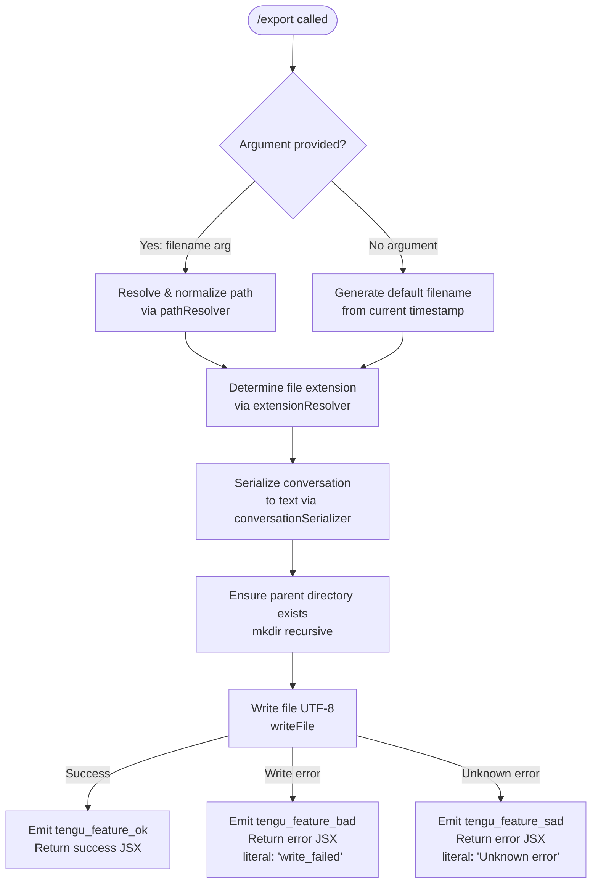

# `/export`

> Analysis basis: CC v2.1.167 bundle.js (AST extraction + Claude interpretation)
> Minimum version: v2.1.167

---

## Overview

`/export` serializes the current conversation session — including all user and assistant messages — into a structured text representation, then writes that content either to a caller-specified file path or to a default output destination. The command resolves the target path, ensures parent directories exist, and emits telemetry reflecting success or failure.

---

## Registration

| Field | Value |
|---|---|
| type | `local-jsx` |
| name | `export` |
| description | Export the current conversation to a file or clipboard |
| argumentHint | `[filename]` |
| module_id | `VKK` |
| load_inline | `true` |
| loc_byte | `12695509` |
| loc_byte_end | `12695705` |
| loc_line | `9083` |
| arbor_handler.name | `fuf` |
| arbor_handler.fqn | `claude-2.1.167::fuf` |
| arbor_handler.kind | `AsyncFunction` |
| arbor_handler.resolution_path | `module_id` |
| arbor_handler.n_hits | `0` |

Analysis basis: CC v2.1.167 bundle.js:+12695509

---

## Input Branching

Four distinct branches exist, determined by the presence/absence of a filename argument and the success/failure of the file-write operation.



Analysis basis: CC v2.1.167 bundle.js:+12694981, +12694990, +12695008, +12695053, +12695070, +12695151

---

## Behavioral Spec

### Main Handler — `exportCommandHandler` (`fuf`)

The Arbor-resolved handler is the async function `fuf` (FQN: `claude-2.1.167::fuf`), reached via `module_id` resolution through module `VKK`.

```
async function exportCommandHandler(commandInput, appContext):

    // 1. Collect and serialize the conversation
    rawText = serializeConversation(appContext)       // via conversationSerializer (Luf → Qb8)
    trimmedText = rawText.trim()                     // bundle.js:+12694950

    // 2. Resolve output path
    if commandInput has non-empty filename argument:
        targetPath = resolveFilePath(commandInput.filename)   // via pathResolver (T1)
    else:
        timestamp = buildTimestamp(new Date())                // via timestampBuilder (Kuf)
        targetPath = defaultExportPath(timestamp)

    // 3. Determine / normalize file extension
    targetPath = resolveExtension(targetPath)        // via extensionResolver (exf → Fb8.extname)

    // 4. Extract message subset from conversation history
    messages = extractMessages(appContext, limit=50) // EKK, literal 50 @ bundle.js:+12694662

    // 5. Write file
    try:
        parentDir = path.dirname(targetPath)         // Fb8.dirname @ bundle.js:+12690442
        fs.mkdirSync(parentDir, { recursive: true }) // Bb8.mkdir  @ bundle.js:+12690432
        fs.writeFile(targetPath, trimmedText, "utf-8")  // Bb8.writeFile, literal "utf-8" @ bundle.js:+12690507

        emitTelemetry("tengu_feature_ok")            // bundle.js:+1010950
        return renderSuccessComponent(targetPath)    // SH / successRenderer

    catch writeError:
        if error code is recognizable write failure:
            emitTelemetry("tengu_feature_bad")       // bundle.js:+1011012
            return renderErrorComponent("write_failed", writeError)  // literal @ bundle.js:+12695070

        else:
            emitTelemetry("tengu_feature_sad")       // bundle.js:+1011093
            return renderErrorComponent("Unknown error", writeError) // literal @ bundle.js:+12695151
```

Analysis basis: CC v2.1.167 bundle.js:+12694941, +12694981, +12694990, +12695008, +12695053, +12695188, +12695206, +12695234

---

### Sub-feature: Conversation Serialization (`conversationSerializer` — `Luf` → `Qb8` → `quf`)

```
function serializeConversation(appContext):
    parts = []
    for each message in conversationHistory:
        role = message.role    // "user" or "assistant" literals @ bundle.js:+12694444, +12693073
        if message.type == "text":                   // literal @ bundle.js:+12694601
            content = stripANSI(message.content)    // p4 → Bun.stripANSI @ bundle.js:+3847204
        else:
            content = renderMessageContent(message)
        parts.push(formatMessageBlock(role, content))
    return parts.join("\n")                          // Qb8 → q.join @ bundle.js:+12693960
```

Analysis basis: CC v2.1.167 bundle.js:+12693915, +12693933, +12693940, +12693960

---

### Sub-feature: Message Extraction (`messageExtractor` — `EKK`)

```
function extractMessages(conversationHistory, maxMessages):
    // maxMessages defaults to 50 (literal @ bundle.js:+12694662)
    userMessages = conversationHistory.find(role == "user")  // H.find @ bundle.js:+12694423
    trimmedArg  = argument.trim()                            // A.trim @ bundle.js:+12694539
    if Array.isArray(content):                               // @ bundle.js:+12694556
        textBlock = content.find(type == "text")             // A.find @ bundle.js:+12694580
        extracted = substringHelper(textBlock, maxLen=50)    // iL, q.substring @ bundle.js:+12694647, +12694667
        // Limit preview to 49 characters                    // literal 49 @ bundle.js:+12694681
    return extracted
```

Analysis basis: CC v2.1.167 bundle.js:+12694423, +12694539, +12694556, +12694580, +12694647, +12694662, +12694667, +12694681

---

### Sub-feature: Path Resolution (`pathResolver` — `T1`)

```
function resolveFilePath(rawInput):
    normalized = DI.normalize(rawInput)              // DI.normalize @ bundle.js:+1053786
    if normalized contains null bytes:               // literal "Path contains null bytes" @ bundle.js:+1053727
        throw TypeError("Path contains null bytes")  // TypeError @ bundle.js:+1053520

    normalized = normalized.normalize("NFC")         // literal "NFC" @ bundle.js:+177737

    if normalized.startsWith("~/"):                  // literal "~/" @ bundle.js:+1053855
        homeDir = os.homedir()                       // ac6.homedir @ bundle.js:+1053824
        normalized = path.join(homeDir, normalized.slice(2))  // DI.join @ bundle.js:+1053871

    if platform == "windows":                        // literal "windows" @ bundle.js:+1053924
        normalized = applyWindowsPathRules(normalized) // r6 @ bundle.js:+1053917

    if not DI.isAbsolute(normalized):                // DI.isAbsolute @ bundle.js:+1053984
        normalized = DI.resolve(normalized)          // DI.resolve @ bundle.js:+1054038

    return normalized
```

Analysis basis: CC v2.1.167 bundle.js:+1053474, +1053520, +1053727, +1053786, +1053824, +1053842, +1053871, +1053984, +1054038

---

### Sub-feature: File Extension Resolution (`extensionResolver` — `exf`)

```
function resolveExtension(filePath):
    ext = path.extname(filePath)    // Fb8.extname @ bundle.js:+12690336
    if ext is empty or unrecognized:
        // Append default extension (derived from T1 resolution)
        filePath = applyDefaultExtension(filePath)
    return filePath
```

Analysis basis: CC v2.1.167 bundle.js:+12690336, +12690376

---

### Sub-feature: Timestamp-Based Default Filename (`timestampBuilder` — `Kuf`)

```
function buildTimestamp(date):
    year    = String(date.getFullYear())             // bundle.js:+12694149, +12694167
    month   = zeroPad(date.getMonth() + 1)           // bundle.js:+12694174
    day     = zeroPad(date.getDate())                // bundle.js:+12694215
    hours   = zeroPad(date.getHours())               // bundle.js:+12694253
    minutes = zeroPad(date.getMinutes())             // bundle.js:+12694292
    seconds = zeroPad(date.getSeconds())             // bundle.js:+12694333
    return year + "-" + month + "-" + day + "T" + hours + minutes + seconds
```

Analysis basis: CC v2.1.167 bundle.js:+12694149, +12694167, +12694174, +12694215, +12694253, +12694292, +12694333

---

### Sub-feature: File Write with Rotation (`fileWriteWithRotation` — `enK` / `tnK`)

The write subsystem performs an atomic-style append + rotation pattern:

```
async function writeWithRotation(targetPath, content):
    dir = path.dirname(targetPath)                   // IHH.dirname @ bundle.js:+206115
    await fs.mkdir(dir, { recursive: true })         // ly.mkdir  @ bundle.js:+205836
    await fs.appendFile(targetPath, content)         // ly.appendFile @ bundle.js:+205895

    // Rotation check
    currentSize = Buffer.byteLength(content)         // Buffer.byteLength @ bundle.js:+206290
    if rotation needed:
        rotateTo = buildRotationPath(targetPath)     // M0A @ bundle.js:+206252
        await fs.rename(targetPath, rotateTo)        // cl8 → ly.rename @ bundle.js:+205563

    // Cleanup of stale rotated files
    await fs.unlink(staleFile)                       // cl8 → ly.unlink @ bundle.js:+205603
    registerCleanupHandler(targetPath)               // j9 → VPA.register @ bundle.js:+60369
```

Analysis basis: CC v2.1.167 bundle.js:+206082, +206115, +206145, +206235, +206252, +206284, +206290, +206323, +206340, +206349, +206445

---

### Sub-feature: Format Selection (`formatSelector` — `ZKK`)

```
function selectExportFormat(inputArg):
    normalized = inputArg.toLowerCase()     // H.toLowerCase @ bundle.js:+12694726
    // Branches on format strings; "export" and "prompt" are recognized
    // literals @ bundle.js:+12693619, +12693635
    return normalized
```

Analysis basis: CC v2.1.167 bundle.js:+12694726, +12693619, +12693635

---

## State & Side Effects

| Item | Detail |
|---|---|
| Telemetry — success | `tengu_feature_ok` emitted on successful file write (bundle.js:+1010950) |
| Telemetry — known error | `tengu_feature_bad` emitted when a recognized write failure occurs (bundle.js:+1011012) |
| Telemetry — unknown error | `tengu_feature_sad` emitted on unexpected/unknown errors (bundle.js:+1011093) |
| File system — directory creation | Parent directories are created recursively (`fs.mkdir` recursive) before write (bundle.js:+12690432, +205836) |
| File system — write | Target file written as UTF-8 (`"utf-8"` literal, bundle.js:+12690507) via `fs.writeFile` |
| File system — rotation | Append + rename rotation pattern applied by `fileWriteWithRotation` (bundle.js:+205836–206445) |
| File system — unlink | Stale rotated files cleaned up via `fs.unlink` (bundle.js:+205603) |
| Cleanup registration | Shutdown cleanup handler registered via `VPA.register` (bundle.js:+60369) |
| ANSI stripping | All message content passes through `Bun.stripANSI` before serialization (bundle.js:+3847204) |
| Error literals | `"write_failed"` (bundle.js:+12695070), `"Unknown error"` (bundle.js:+12695151) surfaced to UI |

---

## Version History

| Version | Change |
|---|---|
| v2.1.167 | Initial analysis |

---

## Common Mistakes

1. **Omitting the filename argument** — Without `[filename]`, the command generates a timestamp-based default name. Users expecting a predictable path should always supply an explicit filename.
2. **Relative paths without context** — The path resolver calls `DI.resolve` on relative inputs, anchoring them to the current working directory at invocation time, not the project root. Supply an absolute path or `~/`-prefixed path for reliable placement.
3. **Paths with `~` but no slash** — Only the `~/` prefix (tilde + forward slash) triggers home-directory expansion. A bare `~` without the slash is not expanded.
4. **Assuming clipboard output** — The description mentions "clipboard," but the call graph shows only `fs.writeFile` and `fs.appendFile` paths; no clipboard API is present at depth ≤ 2. Do not rely on clipboard behavior without further confirmation.
5. **Null bytes in paths** — The path resolver explicitly throws a `TypeError` for paths containing null bytes (bundle.js:+1053727). Programmatically constructed filenames must be sanitized first.
6. **Large conversation histories** — Message extraction is capped at 50 entries (bundle.js:+12694662) for the preview/extraction step; the full serialized text is still written, but the extracted preview shown in the UI may be truncated at 49 characters (bundle.js:+12694681).

---

## Appendix — Identifier Mapping

> For bundle debugging only. Identifiers change across versions.

| Identifier | Role |
|---|---|
| `fuf` | Main export command handler (`exportCommandHandler`) — Arbor-resolved entry point |
| `ZKK` | Format selector — normalizes input argument to lowercase format string |
| `EKK` | Message extractor — finds and trims user message text from conversation history |
| `Luf` | Conversation serializer wrapper — delegates to `Qb8` |
| `Qb8` | Conversation serializer core — iterates messages, joins parts |
| `quf` | Inner serializer loop — handles per-message rendering |
| `_uf` | Serializer helper — sub-routine of `quf` |
| `RF` | Role/permission filter — checks teammate status, plan mode, and connection state |
| `WH6` | Stream/event listener — attaches `data` event handler, creates React elements |
| `Auf` | Array type guard used in serialization branching |
| `O` | Session state checker (checks for `"stopped"` / `"background session"`) |
| `p4` | ANSI stripper — wraps `Bun.stripANSI` |
| `gb8` | File write orchestrator — calls `mkdir`, `writeFile` with UTF-8 encoding |
| `exf` | Extension resolver — uses `path.extname` to detect/append file extension |
| `T1` | Path resolver — normalizes, expands `~/`, handles Windows paths, resolves absolute path |
| `u6` | Path sub-utility used by `T1` |
| `jO` | Unicode normalizer — applies NFC normalization to path strings |
| `Kuf` | Timestamp builder — constructs `YYYY-MM-DDTHHMMSS` string from `Date` |
| `SH` | Success renderer — emits `tengu_feature_ok` and returns success JSX |
| `CH` | Write-failure renderer — emits `tengu_feature_bad` and returns error JSX |
| `o6` | Unknown-error renderer — emits `tengu_feature_sad` and returns error JSX |
| `l` | JSX render helper used by `SH`, `CH`, `o6` |
| `J6` | JSX component builder used by `SH`, `CH`, `o6` |
| `ym6` | Low-level JSX primitive used by `J6` |
| `iL` | Substring extraction helper — used in message preview truncation |
| `d1` | Index/slice helper used by `iL` |
| `enK` | File write orchestrator (append + rotation path) |
| `npH` | Async write scheduler — uses `setTimeout`/`setImmediate`/`clearTimeout` |
| `YKH` | Write path helper — joins path segments, references `t8` and `R6` |
| `tnK` | Rotation write worker — `mkdir`, `appendFile`, rotation logic |
| `cl8` | File rotation handler — `stat`, `endsWith`, `rename`, `unlink` |
| `M0A` | Rotation path builder — joins path with rotation suffix |
| `U76` | EISDIR error handler (checks for `"EISDIR"` error code) |
| `$0A` | Write completion callback |
| `j9` | Cleanup handler registration — calls `VPA.register` |
| `onK` | Conversation history accessor |
| `vPA` | Conversation store helpers (`sdK`, `tdK`) |
| `RH` | JSON serializer for conversation data — calls `JSON.stringify` |
| `G4` | Path/extension utility — `replace`, `at`, `lastIndexOf`, `slice` |
| `q0A` | Map helper used in `G4` |
| `EUH` | File write wrapper — delegates to `lWA` |
| `lWA` | Low-level write caller — calls `H.write` |
| `v` | Main command dispatch function — orchestrates format, path, write, and result |
| `H9` | Message formatter — calls `m6H`, `s9`, `FJ` |
| `m6H` | Block formatter — constructs structured message blocks |
| `qB` | Content block handler — trims, checks `startsWith`, handles model provider strings |
| `s9` | Markdown/text segment renderer — handles model aliases (`opusplan`, `sonnet`, `haiku`, `opus`, `best`) |
| `FJ` | Message join formatter — calls `s9` and `_G` |
| `_G` | Combined message renderer — calls `GA`, `bT`, `lM`, `MA`, `N5`, `CI` |
| `CI` | Code block renderer — uses `lM` and `N5` |
| `DdH` | Diff renderer — uses `N5` |
| `bT` | Inline text renderer — uses `lM`, `N5`, `MA`, with `"firstParty"` provider check |
| `cP1` | Wrapped inline renderer — delegates to `bT` |
| `lM` | Text segment emitter — calls `MA` |
| `VH8` | Header inclusion checker — references `HKL.includes` |
| `wdH` | Word-wrap helper — delegates to `_6` |
| `Y3` | Session/context accessor used in main handler `H` |
| `uj_` | Argument parser — splits, trims, finds index, slices input string |
| `lHH` | Feature-flag checker — calls `i74.has` |
| `uj` | Text replacer used in message formatting |
| `d6` | Utility shared across path and write subsystems |

---

Note: index built via Arbor fallback; some signals (telemetry, literals) may be missing — see arbor-fallback.js.