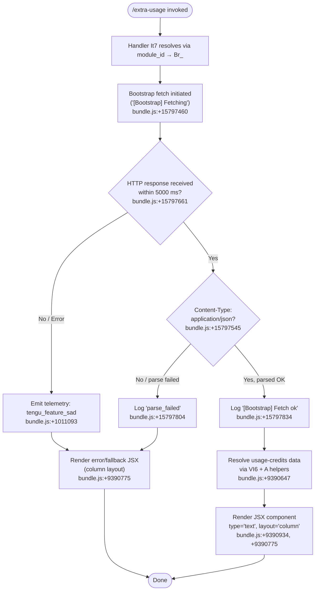

# `/extra-usage`

> Analysis basis: CC v2.1.167 bundle.js (AST extraction + Claude interpretation)
> Minimum version: v2.1.167

---

## Overview

`/extra-usage` is a hidden legacy alias that was renamed to `/usage-credits`. It is registered as a `local-jsx` command that delegates immediately to the same handler as the successor command. Users encountering this command name should prefer `/usage-credits` instead.

---

## Registration

| Field | Value |
|---|---|
| type | `local-jsx` |
| name | `extra-usage` |
| description | `"Renamed to /usage-credits"` |
| isHidden | `true` |
| module_id | `Br_` |
| load_inline | `true` |
| loc_byte | `9391620` |
| loc_byte_end | `9391805` |
| loc_line | `4390` |
| arbor_handler.name | `It7` |
| arbor_handler.fqn | `claude-2.1.167::It7` |
| arbor_handler.kind | `AsyncFunction` |
| arbor_handler.resolution_path | `module_id` |
| arbor_handler.n_hits | `0` |

Analysis basis: CC v2.1.167 bundle.js:+9391620

---

## Input Branching

The command's bootstrap-fetch path has 3+ distinct branches (fetch success, parse failure, timeout/error). A Mermaid flowchart is used.



---

## Behavioral Spec

### Command Entry and Handler Dispatch

The registration object at bytes `9391620–9391805` uses a `load_inline` pattern: the handler is inlined as `Promise.resolve({ call: It7 })` rather than imported via a separate module boundary. The Arbor symbol graph resolves `It7` via `module_id → Br_`.

Analysis basis: CC v2.1.167 bundle.js:+9391620

```
async function It7(context):
    resolvePromise()                         // Promise.resolve at +9390617
    data = await fetchUsageData(context)     // VI6 at +9390647
    result = processUsageResult(data)        // A  at +9390667
    return renderJSX(result, layout="column", type="text")
                                             // H  at +9390676
```

Analysis basis: CC v2.1.167 bundle.js:+9390617–9390676

### Bootstrap Fetch (handler `H` / `bootstrapFetch`)

When `It7` calls the bootstrap-fetch helper `H`, that helper:

1. Logs `"[Bootstrap] Fetching"` to debug output (bundle.js:+15797460).
2. Issues an HTTP GET with headers `Content-Type: application/json` and `User-Agent` (bundle.js:+15797545, +15797579).
3. Applies a 5000 ms timeout guard (bundle.js:+15797661).
4. On success, logs `"[Bootstrap] Fetch ok"` (bundle.js:+15797834).
5. On JSON parse failure, records the `"parse_failed"` label (bundle.js:+15797804) and falls back to error rendering.
6. On any error path, emits telemetry event `tengu_feature_sad` (bundle.js:+1011093) via helper `o6`.

```
async function bootstrapFetch(url, cacheMap):
    log("debug", "[Bootstrap] Fetching")         // +15797460
    cached = cacheMap.get(url)                   // qA.get +15797496
    if cached:
        return cached
    response = await httpGet(url, headers={
        "Content-Type": "application/json",      // +15797545
        "User-Agent": userAgentString            // +15797579
    }, timeoutMs=5000)                           // +15797661
    if not response.ok:
        emitTelemetry("tengu_feature_sad")       // +1011093
        return fallback()
    parsed = parseJSON(response)
    if parseError:
        log("parse_failed")                      // +15797804
        emitTelemetry("tengu_feature_sad")
        return fallback()
    log("[Bootstrap] Fetch ok")                  // +15797834
    return parsed
```

Analysis basis: CC v2.1.167 bundle.js:+15797458

### Model Resolution Sub-path (`s9` / `resolveModelAlias`)

The call graph shows a model-alias resolution utility reachable from the usage-credits rendering pipeline. It normalises model identifiers before display:

- Trims whitespace and lowercases the input (bundle.js:+2247412, +2247423).
- Checks for known tier aliases: `"opusplan"` (+2247508), `"[1m]"` (+2247534), `"sonnet"` (+2247549), `"haiku"` (+2247588), `"opus"` (+2247627), `"best"` (+2247664).
- Checks whether the model ID starts with `"anthropic."` prefix (+2241469).
- Calls provider-type helpers `CI` (firstParty check), `DdH`, `bT`, `cP1`, and `lM` to classify the model as one of: `"firstParty"` (+2243716), `"anthropicAws"` (+2101625), `"gateway"` (+2101645), `"mantle"` (+2244357).

```
function resolveModelAlias(modelId):
    id = modelId.trim().toLowerCase()         // +2247412, +2247423
    id = applyRegexNormalization(id)          // A.replace +2247451
    if isFirstPartyModel(id):                 // CI +2247526
        return classifyFirstParty(id)
    if isAwsModel(id):                        // DdH +2247603
        return "anthropicAws"
    if isOpusModel(id):                       // bT +2247641
        return "opus-class"
    if isBestAlias(id):                       // cP1 +2247678
        return "best"
    return lookupProviderMap(id)              // lM +2247696
```

Analysis basis: CC v2.1.167 bundle.js:+2247412

### Transcript / File Logging Sub-path (`enK` / `transcriptWriter`)

The call graph reaches a transcript-writing subsystem from this command's execution path. It handles buffered append-writes to a log file:

- Resolves the output directory via `IHH.dirname` (+206115).
- Creates the directory if absent via `ly.mkdir` (+205836).
- Appends encoded content via `ly.appendFile` (+205895).
- Rotates the file if it ends with `".txt"` (+205511) and exceeds a byte-length threshold (number `4` at +205533, used as a shift/boundary value).
- Uses `clearTimeout` / `setTimeout` / `setImmediate` for debounced flush (timeout base: 1000 ms at +59671, batch limit: 100 items at +59692).
- Registers a process exit hook via `VPA.register` (+60369).

```
async function transcriptWriter(content, options):
    dir = path.dirname(outputPath)                  // +206115
    await fs.mkdir(dir, { recursive: true })        // +205836
    encoded = Buffer.byteLength(content)            // +206290
    await fs.appendFile(outputPath, content)        // +205895
    rotateIfNeeded(outputPath)                      // cl8 +206284
    scheduleFlush(debounceMs=1000, batchMax=100)    // +59671, +59692
    registerExitHook()                              // j9/VPA.register +206445
```

Analysis basis: CC v2.1.167 bundle.js:+206082

### JSX Render Shape

The final rendered output uses layout `"column"` and content type `"text"`:

- `"column"` layout literal: bundle.js:+9390775
- `"text"` type literal: bundle.js:+9390934

These constants are passed to the JSX component factory (`H`) which produces the visible usage-credits panel in the terminal UI.

Analysis basis: CC v2.1.167 bundle.js:+9390775

---

## State & Side Effects

| Item | Detail |
|---|---|
| Telemetry | `tengu_feature_sad` (emitted on fetch error or JSON parse failure; bundle.js:+1011093) |
| Hook registration | `VPA.register` — process exit hook registered by transcript-writer (bundle.js:+60369) |
| appState changes | Cache map (`qA`) updated with bootstrap fetch result (bundle.js:+15797496) |
| File I/O | `ly.appendFile`, `ly.mkdir`, `ly.rename`, `ly.unlink`, `ly.stat` — transcript write/rotate operations |
| Timers | `setTimeout` (1000 ms flush debounce, +59671), `setImmediate` (batch drain, +60040), `clearTimeout` (cancel pending flush, +59783) |
| Sound | <!-- TODO: not found in depth-2 traversal; needs --depth 4 --> |
| Network | Bootstrap HTTP GET with `Content-Type: application/json`, `User-Agent` header, 5000 ms timeout (+15797545, +15797661) |

---

## Version History

| Version | Change |
|---|---|
| v2.1.167 | Initial analysis; command registered as hidden alias for `/usage-credits` |

---

## Common Mistakes

1. **Invoking `/extra-usage` directly** — The command is hidden (`isHidden: true`) and explicitly described as renamed. Users and scripts should use `/usage-credits` to ensure forward compatibility.
2. **Expecting interactive output on parse failure** — If the bootstrap fetch returns non-JSON or the JSON parse fails, the command silently falls back to an error render rather than displaying a useful error message. The `tengu_feature_sad` telemetry event is the only observable signal.
3. **Assuming immediate file flush** — The transcript writer uses a 1000 ms debounced flush; log content may not appear on disk immediately after the command returns.
4. **Module ID coupling** — The handler is loaded inline via `module_id: "Br_"` with `load_inline: true`. This means the handler is not independently tree-shakeable and any bundle patch affecting `Br_` will affect this command.

---

## Appendix — Identifier Mapping

> For bundle debugging only. Identifiers change across versions.

| Identifier | Role |
|---|---|
| `It7` | Primary async handler for `/extra-usage` (resolved via Arbor `module_id` path) |
| `kt7` | Load-inline wrapper that calls `Promise.resolve` then delegates to `pr_` and `H` |
| `H` | Bootstrap fetch / JSX render orchestrator |
| `v` | Inner fetch execution helper (calls `NUH`, `onK`, `RH`, `G4`, etc.) |
| `onK` | Request construction helper (calls `KI`, `f0A`, `vPA`) |
| `vPA` | Header-building helper (calls `sdK`, `tdK`) |
| `RH` | JSON serialisation helper (wraps `JSON.stringify`) |
| `G4` | URL/path manipulation helper (calls `q0A`, `H.replace`, `q.at`, `A.lastIndexOf`, `A.slice`) |
| `q0A` | Maps URL segment list (`lnK.map`) |
| `EUH` | Write-through helper (delegates to `lWA` / `H.write`) |
| `lWA` | Low-level stream write wrapper |
| `enK` | Transcript writer / file-log manager |
| `npH` | Debounced flush scheduler (uses `clearTimeout`, `setTimeout`, `setImmediate`) |
| `YKH` | Flush commit helper (calls `i76`, `IHH.join`, `t8`, `R6`) |
| `U76` | EISDIR-guard / directory error handler |
| `M0A` | Output path joiner (`IHH.join`, `R6`) |
| `cl8` | File rotation helper (`ly.stat`, `ly.rename`, `ly.unlink`) |
| `tnK` | Buffered append-file worker (`ly.mkdir`, `ly.appendFile`) |
| `j9` | Exit-hook registrar (`VPA.register`) |
| `d6` | <!-- TODO: not found in depth-2 traversal; needs --depth 4 --> |
| `Y3` | Cache lookup helper used in bootstrap path |
| `uj_` | String-split / trim / index parser utility |
| `lHH` | Set-membership check (`i74.has`) |
| `uj` | Regex-replace normaliser (`H.replace`) |
| `H9` | High-level model/message parser (calls `m6H`, `s9`, `FJ`) |
| `m6H` | Message-block builder (calls `Q0`, `aqH`, `yA`, `qB`) |
| `Q0` | <!-- TODO: not found in depth-2 traversal; needs --depth 4 --> |
| `aqH` | <!-- TODO: not found in depth-2 traversal; needs --depth 4 --> |
| `qB` | Content-block list processor (calls `lt6`, `YdH`, `dP1`, `sqL`, `h4H`, `s9`, `tqL`) |
| `s9` | Model alias resolver (trim / lowercase / provider classification) |
| `Y2` | Regex lookup helper (`R4H`) |
| `h4H` | Provider-type inclusion check (`y4H.includes`) |
| `CI` | First-party provider classifier (calls `lM`, `N5`) |
| `DdH` | AWS-provider classifier (calls `N5`) |
| `bT` | Opus-class classifier (calls `lM`, `N5`, `MA`) |
| `cP1` | "Best" alias resolver (delegates to `bT`) |
| `lM` | Provider label mapper (calls `MA`) |
| `VH8` | HKL-set inclusion checker (`HKL.includes`) |
| `wdH` | Underscore-delimiter helper (`_6`) |
| `FJ` | Compound model-string parser (calls `s9`, `_G`) |
| `_G` | Multi-provider dispatch (calls `GA`, `g6H`, `gYH`, `jdH`, `bT`, `z2`, `lM`, `MA`, `N5`, `CI`) |
| `o6` | Telemetry emission helper (`tengu_feature_sad`; calls `l`, `J6`) |
| `l` | Low-level telemetry transport |
| `J6` | Telemetry event formatter (calls `ym6`) |
| `ym6` | Base telemetry record constructor |
| `_` | Generic single-character utility (context-dependent: string operand) |
| `A` | Generic single-character utility (context-dependent: array/string operand) |
| `q` | Generic single-character utility (context-dependent: file/array operand) |

---

Note: index built via Arbor fallback; some signals (telemetry, literals) may be missing — see arbor-fallback.js.