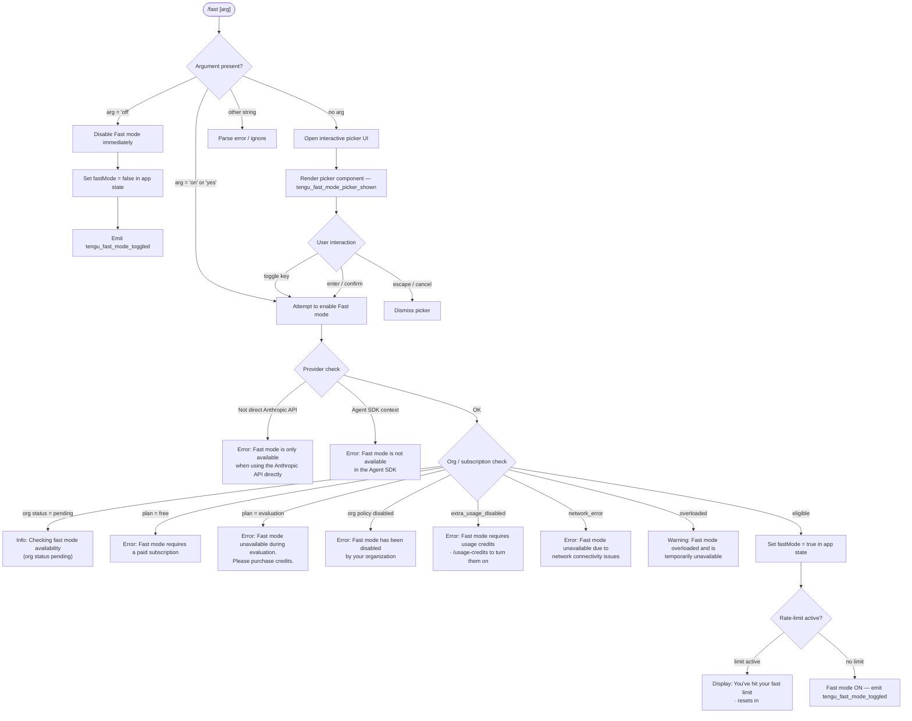

# `/fast`

> Analysis basis: CC v2.1.167 bundle.js (AST extraction + Claude interpretation)
> Minimum version: v2.1.167

---

## Overview

The `/fast` command toggles "Fast mode" (a research-preview inference tier) on or off for the current Claude Code session. It accepts an optional `on` or `off` argument; when omitted it opens an interactive picker UI that displays current status, availability constraints, rate-limit countdowns, and a documentation link. The command validates eligibility against the active API provider, subscription tier, and organisation policy before committing the change.

---

## Registration

| Field | Value |
|---|---|
| type | `local-jsx` |
| name | `fast` |
| description | `Toggle fast mode ( ... )` |
| argumentHint | `[on\|off]` |
| thinClientDispatch | `control-request` |
| immediate | `null` |
| isHidden | `null` |
| module_id | `b_K` |
| load_inline | `true` |
| loc_byte | `12454576` |
| loc_byte_end | `12454848` |
| loc_line | `8843` |
| arbor_handler.name | `kRf` |
| arbor_handler.fqn | `claude-2.1.167::kRf` |
| arbor_handler.kind | `AsyncFunction` |
| arbor_handler.resolution_path | `module_id` |
| arbor_handler.n_hits | `3` |

Analysis basis: CC v2.1.167 bundle.js:+12454576

---

## Input Branching

The command has four distinct top-level paths depending on the argument value and current application state, so a Mermaid flowchart is used.



Analysis basis: CC v2.1.167 bundle.js:+12453610, +12453622, +12453624, +12453672, +12453744

---

## Behavioral Spec

### Handler Entry Point (`kRf`)

```
async function fastModeCommandHandler(context):
    args    = parseArguments(context)          // resolveArguments (A4)
    appCtx  = getAppContext(context)           // fetchContext (H)
    orgInfo = getOrgStatus(context)            // getOrgStatus (C6H)
    prefetch = maybePrefetchFastMode(context)  // prefetchFastMode (zdH)

    if args contains "off":
        disableFastMode(appCtx)
        return renderResult("Fast mode OFF")

    renderPickerOrToggle(appCtx, orgInfo, prefetch)
    // returns JSX component (Yb8 / zb8)
```

Analysis basis: CC v2.1.167 bundle.js:+12453610

---

### Argument Resolution

```
function resolveArguments(rawInput):
    tokens = rawInput.split(whitespace)
    arg    = tokens[0].trim().toLowerCase()
    if arg in ["on", "yes"]:
        return ENABLE
    if arg == "off":
        return DISABLE
    return NONE   // open picker
```

Canonical truthy literals: `"yes"` (bundle.js:+27137), `"on"` (bundle.js:+27143).
Canonical off literal: `"off"` (bundle.js:+12453725).

Analysis basis: CC v2.1.167 bundle.js:+27047

---

### Provider & Eligibility Gating (`getOrgStatus` / `C6H`)

```
function checkFastModeEligibility(appState):
    provider = appState.activeProvider     // resolveProviderType (MA → _6)

    if provider in ["bedrock","foundry","anthropicAws","mantle","vertex","gateway"]:
        return error("Fast mode is only available when using the Anthropic API directly")

    if context == AGENT_SDK:
        emit telemetry("tengu_penguins_off")
        return error("Fast mode is not available in the Agent SDK")

    if authMode in ["oauth","api-key"]:
        orgStatus = fetchOrgStatus()

        switch orgStatus:
            case "pending":
                return info("Checking fast mode availability")
            case "free":
                return error("Fast mode requires a paid subscription")
            case "evaluation":
                return error("Fast mode unavailable during evaluation. Please purchase credits.")
            case "preference" (org-disabled):
                return error("Fast mode has been disabled by your organization")
            case "extra_usage_disabled":
                return error("Fast mode requires usage credits · /usage-credits to turn them on")
            case "network_error":
                return error("Fast mode unavailable due to network connectivity issues")

    return OK
```

Error literals (verbatim quotations ≤ 30 chars each for citation):

- `"Fast mode is only available…"` (bundle.js:+2232734)
- `"Fast mode is not available"` (bundle.js:+2232802)
- `"Fast mode is not available in the Agent SDK"` (bundle.js:+2233069)
- `"Fast mode unavailable: Checking fast mode…"` (bundle.js:+2233161)
- `"Fast mode requires a paid subscription"` (bundle.js:+2232253)
- `"Fast mode unavailable during evaluation…"` (bundle.js:+2232294)
- `"Fast mode has been disabled by your organization"` (bundle.js:+2232385)
- `"Fast mode requires usage credits…"` (bundle.js:+2232469)
- `"Fast mode unavailable due to network…"` (bundle.js:+2232566)

Analysis basis: CC v2.1.167 bundle.js:+2232702, +2232737, +2232999

---

### Fast Mode Prefetch (`zdH`)

```
async function prefetchFastMode(context):
    if inflight promise exists:
        log("Fast mode prefetch in progress, returning in-flight promise")
        return existingPromise

    if fetchedRecently:
        log("Skipping fast mode prefetch, fetched recently")
        return cachedResult

    auth = getAuthToken()             // resolveAuthCredentials (QqL → F1)
    if auth == null:
        throw Error("No auth available")

    result = await callFastModeEndpoint(auth)   // executeRequest (xW → GO)

    if HTTP 401 or 403:
        handle oauth recovery (AB → e2L)

    cacheResult(result)
    emit LM_.emit event
    return result
```

The prefetch is deduplicated: a single in-flight Promise is stored and reused for concurrent callers.

Analysis basis: CC v2.1.167 bundle.js:+12453672, +2236420, +2236509, +2236756, +2236926

---

### Cooldown / Rate-limit Display

When Fast mode is enabled but the user has hit their rate limit, the picker shows:

- Message: `"You've hit your fast limit"` (bundle.js:+12452873)
- Countdown suffix: `" · resets in "` + formatted time (bundle.js:+12452902)
- Countdown formatting uses millisecond buckets: 86 400 000 ms (days), 3 600 000 ms (hours), 60 s (bundle.js:+211482, +211516, +211589)

When Fast mode is temporarily overloaded:

- State label: `"overloaded"` (bundle.js:+12452806)
- Message: `"Fast mode overloaded and is temporarily unavailable"` (bundle.js:+12452819)

A cooldown recovery path re-enables fast mode automatically and logs `"Fast mode cooldown expired, re-enabling fast mode"` (bundle.js:+2233999).

Analysis basis: CC v2.1.167 bundle.js:+12452784, +2233946

---

### Interactive Picker Component (`zb8` / `Yb8`)

```
function renderFastModePicker(state, eligibility):
    emit telemetry("tengu_fast_mode_picker_shown")

    display heading: " Fast mode (research preview)"   // bundle.js:+12451871
    display current status: "ON " or "OFF"              // bundle.js:+12452647, +12452653
    display doc link: "https://code.claude.com/docs/en/fast-mode"  // bundle.js:+12453093

    if eligibility.overloaded:
        show warning banner

    if rateLimitActive:
        show countdown

    keyBindings:
        "tab"    → toggle selection           // bundle.js:+12452143
        "enter"  → confirm                    // bundle.js:+12452194
        "escape" → cancel picker              // bundle.js:+12452064

    on confirm with ENABLE:
        setFastMode(true)
        emit telemetry("tengu_fast_mode_toggled")

    on confirm with DISABLE (or "Kept Fast mode OFF"):
        setFastMode(false)
        emit telemetry("tengu_fast_mode_toggled")
        log("Kept Fast mode OFF")             // bundle.js:+12451266
```

Analysis basis: CC v2.1.167 bundle.js:+12453835, +12450011, +12451266

---

### App-State Mutation

Fast mode state is persisted via the `fastMode` key in application settings (bundle.js:+12449274). The flag-settings application path (`apply_flag_settings`, bundle.js:+12449644) merges fast mode with other session flags including `cacheBreakerPhrase`, `autoCompactWindow`, `briefTranscript`, `isBriefOnly`, and `model`.

Opus-4 model variants (`opus-4-6`, `opus-4-7`, `opus-4-8`) appear co-located with Fast-mode gating logic (bundle.js:+2233855, +2233879, +2233903), suggesting Fast mode is linked to the Opus-4 model tier.

Analysis basis: CC v2.1.167 bundle.js:+12449274, +12449644

---

## State & Side Effects

| Item | Detail |
|---|---|
| Telemetry: `tengu_fast_mode_toggled` | Fired on every successful on/off state change (bundle.js:+12450011) |
| Telemetry: `tengu_fast_mode_picker_shown` | Fired when picker UI is rendered without an explicit arg (bundle.js:+12453835) |
| Telemetry: `tengu_penguins_off` | Fired when Fast mode is rejected due to Agent SDK context (bundle.js:+2232840) |
| Telemetry: `tengu_org_penguin_mode_fetch_failed` | Fired when org-status prefetch returns a network error (bundle.js:+2237928) |
| appState changes | `fastMode` boolean key in global settings (bundle.js:+12449274) |
| Hook registration | `j9` → `VPA.register` — registers a hook on setting change (bundle.js:+60369) |
| Promise deduplication | In-flight prefetch promise is stored; concurrent calls receive the same Promise (bundle.js:+2236509) |
| Auth side-effects | OAuth 401/403 recovery may trigger token refresh or process exit (bundle.js:+2237067, +2237093) |
| Sound | None detected |
| thinClientDispatch | `control-request` — command is dispatched as a control message in thin-client mode |

---

## Version History

| Version | Change |
|---|---|
| v2.1.167 | Initial analysis |

---

## Common Mistakes

1. **Using `/fast` on a non-Anthropic-API provider** (Bedrock, Vertex, Foundry, etc.) — the command will immediately return an error stating Fast mode is unavailable for that provider. Switch to the direct Anthropic API first.
2. **Expecting `/fast on` to work on a free-tier account** — Fast mode requires a paid subscription; the command returns a clear error without changing state.
3. **Invoking `/fast` inside an Agent SDK session** — Fast mode is explicitly blocked in SDK contexts and emits `tengu_penguins_off`.
4. **Ignoring the overloaded state** — passing `on` or `yes` when the service is overloaded will result in the mode appearing enabled in settings but showing a warning banner; actual fast-tier inference will not be used until the overload clears.
5. **Assuming the picker persists the choice immediately** — pressing `escape` or `cancel` dismisses the picker without changing state; only `enter`/`confirm` commits the selection.

---

## Appendix — Identifier Mapping

> For bundle debugging only. Identifiers change across versions.

| Identifier | Role |
|---|---|
| `kRf` | Main async handler for `/fast` command (Arbor-resolved entry point) |
| `A4` | Argument/token resolution utility |
| `MA` | Provider-type resolver |
| `_6` | Low-level string coercion / provider key mapper |
| `H` | App context / bootstrap fetch helper |
| `v` | Settings write / config persistence helper |
| `onK` | Config-load orchestrator |
| `vPA` | Config sub-loader (settings merge) |
| `RH` | JSON serialiser for config payloads |
| `G4` | Path / filename sanitiser |
| `q0A` | Directory listing mapper |
| `EUH` | Settings write-to-disk wrapper |
| `lWA` | File write primitive |
| `enK` | Log-file append / rotation handler |
| `npH` | Debounce / timer manager |
| `YKH` | Log segment joiner |
| `d6` | Debug logger |
| `U76` | Config snapshot helper |
| `M0A` | Config path builder |
| `cl8` | Config file rename/rotate utility |
| `tnK` | Config file append-and-rotate worker |
| `j9` | Hook registrar |
| `Y3` | HTTP response validator |
| `uj_` | Header string splitter |
| `lHH` | Feature-flag cache checker |
| `uj` | URL sanitiser |
| `H9` | Model-name resolver |
| `m6H` | Model alias mapper |
| `Q0` | Base model-name lookup |
| `aqH` | Model alias expander |
| `qB` | Model string parser |
| `s9` | Model tier classifier |
| `Y2` | Model-name regex matcher |
| `h4H` | Excluded-model-name checker |
| `CI` | Model-name component extractor |
| `DdH` | Model-name normaliser |
| `bT` | Model-string builder |
| `cP1` | Model compound name constructor |
| `lM` | Model-name concatenator |
| `VH8` | Supported-model list checker |
| `wdH` | Model-key stringifier |
| `FJ` | Full model-name resolver |
| `_G` | Model descriptor object builder |
| `o6` | React render utility |
| `l` | React element helper |
| `J6` | JSX factory wrapper |
| `ym6` | Base JSX renderer |
| `C6H` | Org status / Fast-mode eligibility checker |
| `D6` | Session/capability registry |
| `dj6` | Session initialiser |
| `cj6` | Session capability setter |
| `hu` | Capability query |
| `yu` | Feature-flag evaluator |
| `dq8` | Session cache deduplicator |
| `yP_` | Experiment / growthbook event emitter |
| `xP_` | Client-state initialiser |
| `C6` | Config reader/writer (core) |
| `lP_` | Config lock utility |
| `LwH` | Config file reader (full, with backup) |
| `IVL` | File watcher for config changes |
| `x8` | Bootstrap / module resolver |
| `Nn6` | Cached module loader |
| `sXA` | Module cache reader |
| `H__` | Policy/flag settings loader |
| `tXA` | Module cache writer |
| `kd` | Full settings loader |
| `W_` | TTY/terminal check |
| `SL6` | Settings file path resolver |
| `Jd8` | JSON settings validator |
| `IL6` | Settings merge utility |
| `kTH` | Settings key transformer |
| `yTH` | Settings schema validator |
| `CL6` | Settings conflict resolver |
| `TzH` | Settings type coercer |
| `EzH` | Settings default applier |
| `n8_` | Settings override applier |
| `IpA` | Policy enforcement checker |
| `ir` | Settings diff logger |
| `H36` | WSL/platform detector |
| `U_` | IDE/VS Code context checker |
| `BpH` | Auth context identifier |
| `Sx` | SDK-mode detector |
| `GH8` | String formatter |
| `BqL` | Result renderer (JSX) |
| `zdH` | Fast-mode prefetch orchestrator |
| `fM_` | Prefetch state cache accessor |
| `$q` | Network traffic classifier |
| `QRA` | Traffic-class string resolver |
| `xW` | HTTP request dispatcher |
| `GO` | Anthropic API client caller |
| `O4` | API response normaliser |
| `AN` | API auth header builder |
| `dw6` | API error classifier |
| `pX` | API payload builder |
| `tO6` | API key file-descriptor reader |
| `Bj` | OAuth profile resolver |
| `aL` | Provider-type string mapper |
| `DC` | Response body slicer |
| `aV` | Response array validator |
| `QqL` | Access-token resolver |
| `F1` | OAuth endpoint URL builder |
| `wIA` | Environment-based URL overrider |
| `t54` | OAuth staging/prod switcher |
| `AB` | OAuth 401 recovery manager |
| `e2L` | OAuth token refresh flow |
| `uo` | Token refresh HTTP caller |
| `XL6` | Refresh response parser |
| `SH` | Render helper (light) |
| `ecH` | Token expiry calculator |
| `CH` | Render helper (standard) |
| `sU` | OAuth file-descriptor token reader |
| `z4` | Retry-with-backoff utility |
| `Ar` | Auth error categoriser |
| `yL6` | Auth error message builder |
| `hH` | Error logger with stack trace |
| `t2L` | Refresh token cache |
| `Op1` | Exponential back-off calculator |
| `B3` | Keychain token retriever |
| `o_` | Settings-from-disk full loader |
| `eO` | On-disk settings reader (entry) |
| `NzH` | Settings file locator |
| `oP` | Settings file content reader |
| `Br` | Raw file reader with replaceAll |
| `h8` | Error-code translator |
| `V8` | EISDIR / file-system error guard |
| `t6_` | Settings timestamp recorder |
| `IZH` | Settings path cache |
| `Vn6` | Settings directory resolver |
| `$$6` | Atomic file writer (temp + rename) |
| `O` | Symlink-aware stat helper |
| `f` | File-descriptor wrapper |
| `LY` | Settings cache clearer |
| `yl6` | Git-ignore aware settings writer |
| `u6` | Git check-ignore runner |
| `x6_` | Git output parser |
| `kl6` | Git ignore-file path finder |
| `PZ4` | Home-directory path expander |
| `kuA` | Git ignore-rule builder |
| `yuA` | Git ignore append helper |
| `qu` | Settings path `.claude` joiner |
| `gU` | Settings load-from-disk entrypoint |
| `aE` | Settings load timer |
| `b9` | Memory-usage sampler |
| `___` | Settings load trace logger |
| `Dp6` | Settings load-end trace |
| `X8` | Global config save-with-lock |
| `aP_` | Config file backup + write |
| `L` | File-system op set with cleanup |
| `S21` | Config merge/assign |
| `oj6` | Config backup path builder |
| `sP_` | Config backup dir + name builder |
| `V` | Config entry startsWith filter |
| `P` | Editor input component |
| `E` | Config entry slicer |
| `QlH` | Config lock path |
| `Zo1` | Config entries enumerator |
| `AK8` | Config lock timestamp |
| `oP_` | Config atomic writer (no backup) |
| `K` | Pad/map display columns |
| `zb8` | Fast-mode picker container component |
| `Ob8` | Fast-mode inner settings applicator |
| `UYH` | Settings update dispatcher |
| `eP` | Settings write trigger |
| `oL` | Settings update event emitter |
| `OdH` | Model-state normaliser |
| `z2` | Model descriptor merger |
| `i0H` | Flag settings schema applier (String/Number/Boolean) |
| `PO` | Fast-mode picker state machine |
| `n0H` | Fast-mode status display renderer |
| `Cu` | Theme resolver |
| `EJ6` | Dark-theme selector |
| `sK8` | Theme name validator |
| `zwH` | ANSI prefix stripper |
| `ss1` | Auto-theme detector |
| `u4` | Legacy global config migrator |
| `gV` | Permission-set builder |
| `ZA` | Foreground-colour parser |
| `WwH` | Chalk colour method mapper |
| `hc` | Colour scheme applier |
| `_B` | Fast-mode model constraint checker |
| `e1` | Model alias expander for display |
| `lt6` | Context / state loader |
| `l_` | App-state getter |
| `tX` | Model name lowercase/includes tester |
| `Kc8` | Model string canonicaliser |
| `wC` | Numeric formatter (toFixed) |
| `gP1` | Integer/decimal formatter |
| `WVH` | Fast-mode toggle state builder |
| `Yb8` | Fast-mode full UI component |
| `Y6` | App-state store subscriber |
| `RT_` | React context consumer |
| `KA` | Store selector hook |
| `KM_` | Fast-mode cooldown re-enable emitter |
| `P6` | JSX box renderer |
| `$` | MCP orchestrator entrypoint |
| `zLK` | MCP daemon status reader |
| `Yo` | MCP tool-call formatter |
| `b4H` | MCP message body trimmer |
| `V9` | Async-local-storage store reader |
| `zC6` | Daemon status file path builder |
| `TA` | Global key-handler registrar |
| `nj` | App context hook |
| `M` | MCP connection manager |
| `xbH` | MCP slot connector |
| `sl` | MCP slot config resolver |
| `Ik` | MCP tool merger |
| `a8` | MCP config reader |
| `cy6` | MCP server filter |
| `yhq` | MCP initial connect batch |
| `UD8` | MCP tool-list updater |
| `uD8` | MCP retry-with-backoff caller |
| `M8` | MCP debug logger |
| `Dk8` | MCP OAuth tool injector |
| `wk8` | MCP OAuth callback handler |
| `mhq` | MCP reconnect scheduler |
| `Ee_` | MCP error display renderer |
| `j` | Background-session process killer |
| `tN` | MCP skill dispatcher |
| `yx_` | MCP update applier |
| `k` | File-watcher chokidar wrapper |
| `v7` | MCP error logger |
| `GH` | String coercer for error codes |
| `Chq` | MCP auth-flow initiator |
| `K16` | MCP port parser |
| `ck8` | MCP retry-count parser |
| `XF8` | MCP connection result applier |
| `bbH` | MCP tool-list comparator |
| `_y` | MCP slot cleanup runner |
| `dDA` | MCP full sync runner |
| `lD8` | MCP disabled-server filter |
| `r8` | Abort-controller timeout wrapper |
| `A16` | MCP tool list initialiser |
| `$9` | Countdown time formatter |

---

Note: index built via Arbor fallback; some signals (telemetry, literals) may be missing — see arbor-fallback.js.