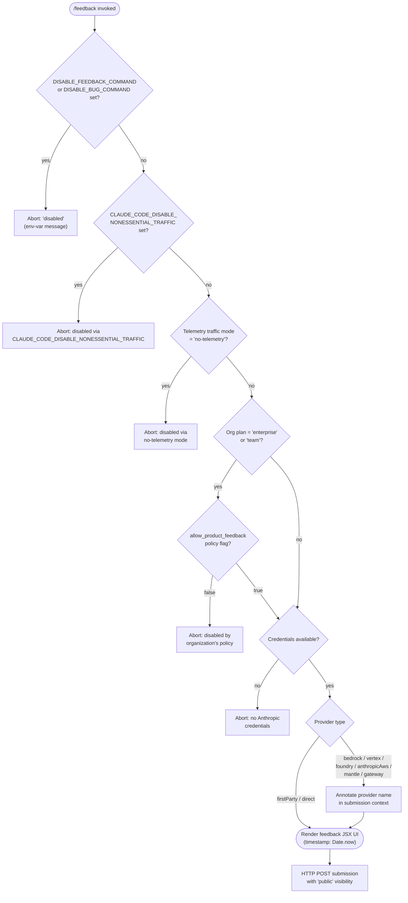

# `/feedback`

> Analysis basis: CC v2.1.167 bundle.js (AST extraction + Claude interpretation)
> Minimum version: v2.1.167

---

## Overview

The `/feedback` command (also aliased as `/share` and `/bug`) allows users to submit feedback about Claude Code, report bugs, or share their conversation with Anthropic. Before presenting the feedback UI, the command evaluates a layered set of policy checks — environment variable flags, organizational policy, telemetry-traffic settings, and credential availability — and will abort with a descriptive message if any check fails.

---

## Registration

| Field | Value |
|---|---|
| type | `local-jsx` |
| name | `feedback` |
| description | `Submit feedback, report a bug, or share your conversation` |
| argumentHint | `[report]` |
| aliases | `share`, `bug` |
| module_id | `Bmq` |
| load_inline | `true` |
| loc_byte | `11004608` |
| loc_byte_end | `11004831` |
| loc_line | `7299` |
| arbor_handler.name | `Mwf` |
| arbor_handler.fqn | `claude-2.1.167::Mwf` |
| arbor_handler.kind | `AsyncFunction` |
| arbor_handler.resolution_path | `module_id` |
| arbor_handler.n_hits | `0` |

Analysis basis: CC v2.1.167 bundle.js:+11004608

---

## Input Branching

The command involves 5+ distinct policy-check branches before the feedback UI is rendered, making a Mermaid flowchart the appropriate representation.



Analysis basis: CC v2.1.167 bundle.js:+10982483, +10982501, +10982642, +10982760, +10982924, +10983531, +10983588

---

## Behavioral Spec

### 1. Top-level Handler Dispatch (`Mwf` → `feedbackCommandEntry`)

The async handler `Mwf` (described as `feedbackCommandEntry`) is the module-level entry resolved via `module_id: "Bmq"` (resolution_path: `module_id`). It calls the JSX render function `Umq` (`feedbackRenderer`) after all policy gates pass.

```
async function feedbackCommandEntry(context):
    result = await policyGateCheck(context)
    if result.blocked:
        return disabledMessage(result.reason)
    timestamp = Date.now()                        // pmq, loc:+11003978
    return renderFeedbackUI(context, timestamp)   // Umq, loc:+11004439
```

Analysis basis: CC v2.1.167 bundle.js:+11004439

---

### 2. Environment-Variable Disable Checks (`AxH` → `envDisableCheck`)

The function `AxH` (`envDisableCheck`) inspects environment variables in order:

1. If `DISABLE_FEEDBACK_COMMAND` is set to a truthy value (including `"yes"` or `"on"`), return the message: `"/feedback has been disabled via the DISABLE_FEEDBACK_COMMAND environment variable"`.
2. If `DISABLE_BUG_COMMAND` is set similarly, return: `"/feedback has been disabled via the DISABLE_BUG_COMMAND environment variable"`.
3. If `CLAUDE_CODE_DISABLE_NONESSENTIAL_TRAFFIC` is active, return: `"/feedback has been disabled via the CLAUDE_CODE_DISABLE_NONESSENTIAL_TRAFFIC environment variable"`.

Truthy detection uses the string set `{"yes", "on", "1"}` via the `_6` utility (loc:+27088), where the numeric value `1` (loc:+27047) and strings `"yes"` (loc:+27137) and `"on"` (loc:+27143) are the recognized affirmative constants.

```
function envDisableCheck(env):
    if isTruthy(env.DISABLE_FEEDBACK_COMMAND):
        return { blocked: true, reason: "DISABLE_FEEDBACK_COMMAND" }
    if isTruthy(env.DISABLE_BUG_COMMAND):
        return { blocked: true, reason: "DISABLE_BUG_COMMAND" }
    if isTruthy(env.CLAUDE_CODE_DISABLE_NONESSENTIAL_TRAFFIC):
        return { blocked: true, reason: "CLAUDE_CODE_DISABLE_NONESSENTIAL_TRAFFIC" }
    return { blocked: false }
```

Analysis basis: CC v2.1.167 bundle.js:+10982483, +10982501, +10982642, +10982760

---

### 3. Telemetry Traffic Policy Check (`$q` → `telemetryTrafficCheck`)

The function `$q` (`telemetryTrafficCheck`) examines the configured traffic level:

- If the current traffic mode resolves to `"no-telemetry"` (loc:+1015052), the command is blocked.
- `"essential-traffic"` (loc:+1014993) is permitted — feedback is considered non-essential but the gate is specifically `no-telemetry`.
- The `"default"` mode (loc:+1015126) also permits the command.

This check uses the `QRA` → `_6` utility chain for mode string normalization.

```
function telemetryTrafficCheck(config):
    mode = resolveTrafficMode(config)   // QRA/_6
    if mode == "no-telemetry":
        return { blocked: true, reason: "no-telemetry" }
    return { blocked: false }
```

Analysis basis: CC v2.1.167 bundle.js:+1015052, +1015157, +1015070

---

### 4. Organizational Policy Check (`X9` → `orgPolicyCheck`)

The function `X9` (`orgPolicyCheck`) applies when the account is on an `"enterprise"` (loc:+4185410) or `"team"` (loc:+4185445) plan:

1. Determine the current account plan via `cC` (`resolveAccountPlan`).
2. If the plan is `"enterprise"` or `"team"`, query the `allow_product_feedback` policy flag (loc:+4185711).
3. If the flag is falsy, return the blocked message: `"/feedback has been disabled by your organization's policy"` (loc:+10982924).
4. Additionally, if `pgL.has` or `UgL.has` indicate restricted plan membership (loc:+4185655, +4185687), fall through to the credential check.
5. On non-enterprise/non-team plans, this check passes unconditionally.

```
function orgPolicyCheck(session):
    plan = resolveAccountPlan(session)    // cC
    if plan in {"enterprise", "team"}:
        if not session.policies.allow_product_feedback:
            return { blocked: true, reason: "org_policy" }
    return { blocked: false }
```

Analysis basis: CC v2.1.167 bundle.js:+4185410, +4185445, +4185655, +4185687, +4185711, +10982924

---

### 5. Credential and Provider Annotation (`EB` → `credentialAndProviderCheck`)

The function `EB` (`credentialAndProviderCheck`) ensures Anthropic credentials are present and annotates the submission context with the cloud provider name:

1. If no Anthropic auth context is available (third-party provider without bridged credentials), check whether an OAuth token exists; if not, return `"no_creds"` (loc:+10983531) with the message `"no Anthropic credentials"` (loc:+10983548).
2. Map the internal provider identifier to a human-readable name:
   - `"bedrock"` → `"Amazon Bedrock"` (loc:+10983056)
   - `"vertex"` → `"Vertex AI"` (loc:+10983131)
   - `"foundry"` → `"Microsoft Foundry"` (loc:+10983202)
   - `"anthropicAws"` → `"Claude Platform on AWS"` (loc:+10983286)
   - `"mantle"` → `"Amazon Bedrock (Mantle)"` (loc:+10983369)
   - `"gateway"` → `"an API gateway"` (loc:+10983454)
   - First-party / direct → no provider annotation needed
3. Attach the `"bundle"` (loc:+10983024) and `"provider"` (loc:+10983039) fields to the submission payload.

```
function credentialAndProviderCheck(authContext):
    if authContext.isThirdParty and not authContext.hasOAuthToken:
        return { blocked: true, reason: "no_creds" }
    providerLabel = mapProviderToLabel(authContext.provider)
    return { blocked: false, providerLabel: providerLabel }
```

Analysis basis: CC v2.1.167 bundle.js:+10983024, +10983039, +10983056, +10983131, +10983202, +10983286, +10983369, +10983400, +10983454, +10983531, +10983548

---

### 6. JSX UI Rendering and HTTP Submission (`Umq` → `feedbackRenderer`)

`Umq` (`feedbackRenderer`) creates the interactive feedback JSX component. It:

1. Captures a `Date.now()` timestamp at invocation (via `pmq`, loc:+11003978) — a 30 000 ms timeout constant is present (loc:+11003997), suggesting a submission deadline.
2. Invokes the feedback form helper `H` (`feedbackFormHelper`) to collect user input and conversation context.
3. Uses `v_A.createElement` (loc:+11004221) to construct the React/JSX tree.
4. On form submission, sends an HTTP `"post"` (loc:+10983588) with visibility set to `"public"` (loc:+11004414).
5. Applies header redaction: API keys are replaced with `"[REDACTED]"` (loc:+198252) and only the last 2 characters (loc:+198281) may be shown for identification.

```
function feedbackRenderer(context, timestamp):
    form = buildFeedbackForm(context)            // H / feedbackFormHelper
    element = createElement(FeedbackComponent, {
        form,
        timestamp,
        timeout: 30000,
        visibility: "public"
    })
    on submit:
        payload = sanitizeHeaders(form.data)     // [REDACTED] pattern
        httpPost(feedbackEndpoint, payload)
    return element
```

Analysis basis: CC v2.1.167 bundle.js:+11003978, +11003997, +11004177, +11004200, +11004221, +11004414, +198252, +198281

---

### 7. Conversation Transcript Serialization (`H` → `feedbackFormHelper`)

The form helper `H` (`feedbackFormHelper`) includes logic to fetch and format conversation history for attachment:

- Issues a bootstrap fetch (logged as `"[Bootstrap] Fetching"`, loc:+15797460) with a 5 000 ms timeout (loc:+15797661).
- Sets `Content-Type: application/json` (loc:+15797545) and a `User-Agent` header (loc:+15797579).
- Uses `uj_` (`splitAndTrimArg`) to parse any inline argument following the command (e.g., `/feedback [report]`).
- Runs the `lHH` (`featureSetCheck`) to verify feature availability.
- On failure, fires the `tengu_feature_sad` telemetry event (loc:+1011093, see §State & Side Effects) via the `o6` → `l` → `J6` chain.
- On success (status code `"[Bootstrap] Fetch ok"`, loc:+15797834), passes the result to the form builder.

```
async function feedbackFormHelper(args, session):
    parsedArg = splitAndTrimArg(args)            // uj_
    available = featureSetCheck(session)         // lHH
    if not available:
        emit("tengu_feature_sad")
        return errorResponse()
    response = await bootstrapFetch({
        timeout: 5000,
        headers: { "Content-Type": "application/json", "User-Agent": userAgent }
    })
    if response.ok:
        return buildForm(response.data, parsedArg)
    else:
        emit("api_bootstrap_fetch", { status: "parse_failed" })
        return errorResponse()
```

Analysis basis: CC v2.1.167 bundle.js:+15797458, +15797460, +15797496, +15797545, +15797560, +15797579, +15797600, +15797631, +15797661, +15797782, +15797804, +15797834

---

## State & Side Effects

| Item | Detail |
|---|---|
| Telemetry | `tengu_feature_sad` — fired when the feedback feature is unavailable/blocked at the feature-set check level (bundle.js:+1011093) |
| Telemetry (inline literal) | `"api_bootstrap_fetch"` with `"parse_failed"` tag — fired on bootstrap fetch parse failure (bundle.js:+15797782, +15797804) |
| Environment variables read | `DISABLE_FEEDBACK_COMMAND`, `DISABLE_BUG_COMMAND`, `CLAUDE_CODE_DISABLE_NONESSENTIAL_TRAFFIC` |
| Organization policy read | `allow_product_feedback` flag (enterprise/team plans only) |
| HTTP side effect | HTTP POST to feedback endpoint with `"public"` visibility (bundle.js:+10983588, +11004414) |
| Header redaction | API keys replaced with `[REDACTED]`; at most 2 trailing characters may appear in logs (bundle.js:+198252, +198281) |
| File I/O | Log rotation via `cl8` / `tnK` — `ly.appendFile`, `ly.rename`, `ly.unlink`, `ly.mkdir` (bundle.js:+205407–205982) |
| Timer | `setTimeout`/`clearTimeout`/`setImmediate` used in log writer `npH` (bundle.js:+59783–60198) |
| Timeout constant | 30 000 ms submission deadline (bundle.js:+11003997) |
| Bootstrap fetch timeout | 5 000 ms (bundle.js:+15797661) |
| appState changes | No direct appState mutation observed in depth-2 traversal |
| Sound | <!-- TODO: not found in depth-2 traversal; needs --depth 4 --> |

---

## Version History

| Version | Change |
|---|---|
| v2.1.167 | Initial analysis |

---

## Common Mistakes

1. **Expecting `/feedback` to work under `no-telemetry` mode.** The command is blocked entirely when the traffic mode is set to `"no-telemetry"` — this is distinct from `"essential-traffic"`, which still permits the command.
2. **Setting `DISABLE_BUG_COMMAND` and expecting `/bug` to still work.** The alias `/bug` resolves to the same registration; `DISABLE_BUG_COMMAND` disables both `/bug` and functionally `/feedback`.
3. **Assuming third-party providers (Bedrock, Vertex, etc.) cannot use `/feedback`.** The command is permitted on third-party providers as long as an OAuth token is present; it is only blocked when no Anthropic credentials are available at all.
4. **Expecting organizational policy to apply on personal/free plans.** The `allow_product_feedback` check is only evaluated for `"enterprise"` and `"team"` plan accounts; personal accounts bypass it.
5. **Passing a long argument after `/feedback`.** The argument hint is `[report]` and the argument is split/trimmed via `uj_` — unexpected multi-word or structured input may be truncated or ignored.

---

## Appendix — Identifier Mapping

> For bundle debugging only. Identifiers change across versions.

| Identifier | Role |
|---|---|
| `Mwf` | Top-level async handler / `feedbackCommandEntry` (arbor handler, module `Bmq`) |
| `Umq` | JSX render function / `feedbackRenderer` |
| `AxH` | Environment-variable disable check / `envDisableCheck` |
| `$q` | Telemetry traffic mode check / `telemetryTrafficCheck` |
| `QRA` | Traffic mode resolver (calls `_6`) |
| `_6` | Truthy-string normalizer (recognizes `"yes"`, `"on"`, `1`) |
| `X9` | Organizational policy check / `orgPolicyCheck` |
| `Yf9` | Plan resolution helper (calls `sIH`) |
| `sIH` | Internal plan/session state accessor |
| `cC` | Account plan resolver / `resolveAccountPlan` |
| `MA` | Provider/auth type mapping utility |
| `Lf` | <!-- TODO: not found in depth-2 traversal; needs --depth 4 --> |
| `GO` | Auth credential builder / token assembler |
| `Bj` | OAuth profile/token resolver |
| `ILH` | Org policy flag accessor |
| `EB` | Credential and provider annotation check / `credentialAndProviderCheck` |
| `Wc` | Third-party auth guard (emits "Anthropic auth not used on third-party providers") |
| `aL` | Auth context accessor |
| `GA` | OAuth token retrieval |
| `GY` | OAuth token builder |
| `YC` | Array/model-type membership check |
| `xW` | API-key extraction helper |
| `H` | Feedback form helper / `feedbackFormHelper` |
| `v` | Bootstrap fetch executor |
| `onK` | HTTP request builder |
| `vPA` | Stream write helpers (`sdK`, `tdK`) |
| `RH` | JSON serializer for debug output |
| `_` | Generic string utility (toUpperCase, toLowerCase, replace) |
| `G4` | API key redaction utility |
| `q0A` | Key segment map helper |
| `A` | String transform target (toLowerCase, lastIndexOf, slice) |
| `EUH` | Output writer wrapper (`lWA`) |
| `lWA` | Terminal write utility |
| `enK` | Log append/rotate coordinator |
| `npH` | Async log flusher (uses setTimeout/clearTimeout/setImmediate) |
| `YKH` | Log path join helper |
| `d6` | <!-- TODO: not found in depth-2 traversal; needs --depth 4 --> |
| `U76` | Directory ensure helper |
| `M0A` | Log file path builder |
| `cl8` | Log file rotate/stat helper |
| `tnK` | Log append-and-rotate executor |
| `j9` | Signal/hook registration (VPA.register) |
| `Y3` | <!-- TODO: not found in depth-2 traversal; needs --depth 4 --> |
| `uj_` | Argument split-and-trim parser / `splitAndTrimArg` |
| `lHH` | Feature availability set checker / `featureSetCheck` |
| `uj` | String replace sanitizer |
| `H9` | Conversation history serializer |
| `m6H` | Message format builder |
| `Q0` | <!-- TODO: not found in depth-2 traversal; needs --depth 4 --> |
| `aqH` | <!-- TODO: not found in depth-2 traversal; needs --depth 4 --> |
| `qB` | Message content parser |
| `s9` | Model/alias string normalizer |
| `Y2` | Model alias registry lookup |
| `h4H` | Model-ID prefix checker |
| `CI` | Model tier classifier |
| `DdH` | Model capability descriptor |
| `bT` | Model metadata resolver |
| `cP1` | Model config builder |
| `lM` | Model string utility |
| `VH8` | Model include-list checker |
| `wdH` | Model string transformer |
| `FJ` | Format/join pipeline for conversation content |
| `_G` | Content block type router |
| `o6` | Telemetry event emitter entry |
| `l` | Telemetry payload builder |
| `J6` | Telemetry dispatch / `ym6` caller |
| `ym6` | Core telemetry send function |
| `pmq` | Timestamp capture helper (`Date.now` wrapper) |

---

Note: index built via Arbor fallback; some signals (telemetry, literals) may be missing — see arbor-fallback.js.