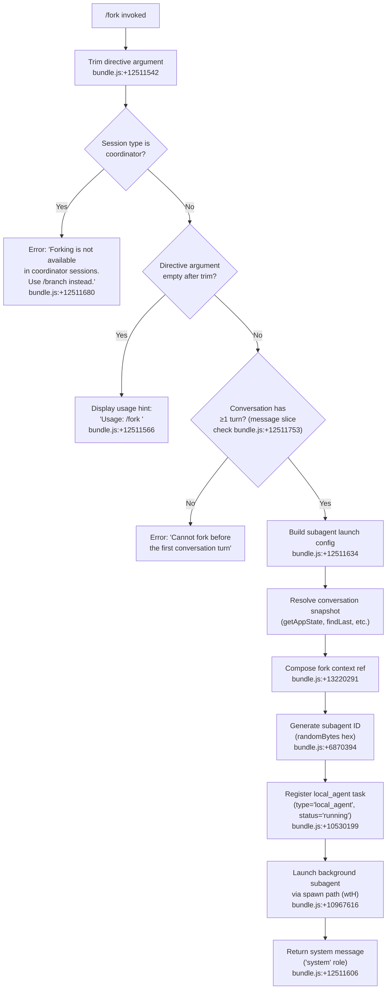

# `/fork`

> Analysis basis: CC v2.1.167 bundle.js (AST extraction + Claude interpretation)
> Minimum version: v2.1.167

---

## Overview

`/fork` spawns a background agent that inherits the full current conversation history. The user supplies a `<directive>` argument to define the task the forked agent will pursue independently, allowing parallel or divergent workstreams from the same conversation context. The command validates preconditions (session type, conversation state) before launching the subagent.

---

## Registration

| Field | Value |
|---|---|
| type | `local-jsx` |
| name | `fork` |
| description | `Spawn a background agent that inherits the full conversation` |
| argumentHint | `<directive>` |
| module_id | `bAK` |
| load_inline | `true` |
| loc_byte | `12511983` |
| loc_byte_end | `12512186` |
| loc_line | `8941` |
| arbor_handler.name | `ACf` |
| arbor_handler.fqn | `claude-2.1.167::ACf` |
| arbor_handler.kind | `AsyncFunction` |
| arbor_handler.resolution_path | `module_id` |
| arbor_handler.n_hits | `0` |

Analysis basis: CC v2.1.167 bundle.js:+12511983

---

## Input Branching

The handler has 4+ distinct branches: coordinator-session guard, missing-directive guard, pre-turn guard, and the main fork-launch path.



---

## Behavioral Spec

### 1. Argument Validation

```
async function forkCommandHandler(directive, sessionContext):
    trimmedDirective = directive.trim()           // bundle.js:+12511542
    if sessionContext is coordinator mode:
        return errorMessage("Forking is not available in coordinator sessions. Use /branch instead.")
                                                  // bundle.js:+12511680
    if trimmedDirective is empty:
        return usageHint("Usage: /fork <directive>")
                                                  // bundle.js:+12511566
    conversationHistory = getConversationSlice()  // bundle.js:+10967079
    if conversationHistory.length < 1:            // bundle.js:+12511753
        return errorMessage("Cannot fork before the first conversation turn")
    // proceed to launch
```

Analysis basis: CC v2.1.167 bundle.js:+12511542, +12511566, +12511680, +12511753

### 2. Conversation Snapshot Construction

```
function buildConversationSnapshot(appState):
    messages = appState.getAppState()             // bundle.js:+10968375
    lastMessage = messages.findLast(isAssistant)  // bundle.js:+10944445
    inheritedConfig = {
        working_directory: ...,                   // bundle.js:+10944470
        allowed_tools: ...,                       // bundle.js:+10944525
        disallowed_tools: ...,                    // bundle.js:+10944580
        avoid_prompts: ...,                       // bundle.js:+10944641
        permission_mode: ...,                     // bundle.js:+10944743
        bypassPermissions: ...,                   // bundle.js:+10944774
        session: ...,                             // bundle.js:+10945073
        effort: ...,                              // bundle.js:+10945098
        model: ...,                               // bundle.js:+10945111
        max_thinking_tokens: ...,                 // bundle.js:+10945123
        flag_settings: ...,                       // bundle.js:+10945149
    }
    return { messages, inheritedConfig }
```

Analysis basis: CC v2.1.167 bundle.js:+10944365–10945149

### 3. Fork Context Reference and Subagent Identity

```
function prepareForkLaunch(snapshot, directive):
    forkContextRef = buildRef(snapshot)       // literal "fork-context-ref" bundle.js:+13220291
    agentId = randomBytes(8).toString("hex")  // bundle.js:+6870394, literal 8 at +6870410
    timestamp = Date.now()                    // bundle.js:+10967133
    forkMode = "fork"                         // literal bundle.js:+10966891
    resumeMode = "resume"                     // literal bundle.js:+10967010
    subagentTask = {
        type: "local_agent",                  // literal bundle.js:+10529888
        status: "running",                    // literal bundle.js:+10529933
        purpose: "general-purpose",           // literal bundle.js:+10530007
    }
    return { forkContextRef, agentId, timestamp, subagentTask }
```

Analysis basis: CC v2.1.167 bundle.js:+10966891, +10967010, +13220291, +6870394

### 4. Coordinator-Mode Guard

The handler calls a helper (resolved as `coordinatorModeCheck`, bundle identifier `CH`) to classify the current session role. If the session is tagged as `"subagent_fork_coordinator_mode"` the guard fires and returns the error literal.

```
function coordinatorModeCheck(sessionContext):
    // literal "subagent_fork_coordinator_mode" at bundle.js:+10966718
    if sessionContext.mode === COORDINATOR:
        return BLOCKED
    return ALLOWED
```

Analysis basis: CC v2.1.167 bundle.js:+10966718

### 5. Subagent Launch Sequence

```
async function launchForkedSubagent(config):
    // Emit telemetry: subagent_launch, subagent_fork_coordinator_mode checks done
    // literal "subagent_launch" bundle.js:+10966700
    spawn = buildSpawnDescriptor(config)      // "spawn" literal bundle.js:+10967616
    // Register task in task registry via taskRegister (K.register)
    //   bundle.js:+10530199
    // Launch via wtH (background subagent runner)
    //   bundle.js:+10967650
    // Write fork context ref file for subagent discovery
    //   bundle.js:+13220291
    // Return system-role confirmation message
    //   role literal "system" bundle.js:+12511606
```

Analysis basis: CC v2.1.167 bundle.js:+10966700, +10967616, +10530199

### 6. Missing Prompt Telemetry

If the directive is absent after trim, telemetry event `"subagent_fork_prompt_missing"` is emitted before returning the usage hint.

Analysis basis: CC v2.1.167 bundle.js:+10966842 (literal `"subagent_fork_prompt_missing"`)

### 7. Slice Limit on Inherited Messages

The conversation slice passed to the forked agent is bounded; the handler calls `H.slice` with limits `50` and `49` (off-by-one safe boundary).

Analysis basis: CC v2.1.167 bundle.js:+10967079 (`q_A → H.slice`), literals `50` at +10967076, `49` at +10967089

---

## State & Side Effects

| Item | Detail |
|---|---|
| Telemetry — subagent_launch | Emitted when fork launch is initiated (bundle.js:+10966700) |
| Telemetry — subagent_fork_coordinator_mode | Emitted on coordinator guard check (bundle.js:+10966718) |
| Telemetry — subagent_fork_prompt_missing | Emitted when directive is absent (bundle.js:+10966842) |
| Telemetry — tengu_forked_agent_default_turns_exceeded | Emitted if forked agent exceeds default turn limit (bundle.js:+10943239) |
| Telemetry — tengu_agent_tool_completed | Emitted on forked-agent tool completion (bundle.js:+6958760) |
| Telemetry — tengu_agent_tool_terminated | Emitted on forked-agent tool kill (bundle.js:+6964920) |
| Task registry | Registers a `local_agent` task entry (type `"local_agent"`, status `"running"`, purpose `"general-purpose"`) via `K.register` (bundle.js:+10530199) |
| Fork context ref file | Writes a `"fork-context-ref"` file on disk for subagent discovery (bundle.js:+13220291) |
| Subagent process | Spawns a new background process via `YQ.spawn` through the `wtH` subagent runner (bundle.js:+10967650, +16198566) |
| appState changes | Reads `appState` to clone conversation; does not mutate the parent session's `appState` |
| Sound | <!-- TODO: not found in depth-2 traversal; needs --depth 4 --> |
| Hook registration | Subagent lifecycle hooks (`SubagentStart`, `SubagentStop`) are registered in the spawned session (literals bundle.js:+13321254, +13362946) |

---

## Version History

| Version | Change |
|---|---|
| v2.1.167 | Initial analysis |

---

## Common Mistakes

1. **Running `/fork` in a coordinator session** — The command is explicitly blocked when the session is in coordinator mode; use `/branch` in that context instead (error literal at bundle.js:+12511680).
2. **Issuing `/fork` before any conversation turns** — The handler checks that at least one message exists; running it on a brand-new session with no prior exchange will be rejected (bundle.js:+12511753).
3. **Omitting the `<directive>` argument** — Without a directive, the command prints a usage hint and does nothing; the directive is mandatory (bundle.js:+12511566).
4. **Expecting the fork to share live state with the parent** — The forked agent receives a snapshot copy of the conversation (up to ~50 messages, bundle.js:+10967076); subsequent parent-session changes are not mirrored.
5. **Assuming all tool permissions are inherited automatically** — Inherited config copies `allowed_tools`, `disallowed_tools`, `permission_mode`, and `bypassPermissions` from the parent at fork time; later parent permission changes do not propagate.

---

## Appendix — Identifier Mapping

> For bundle debugging only. Identifiers change across versions.

| Identifier | Role |
|---|---|
| `ACf` | Main async handler for `/fork` command (Arbor-resolved entry point) |
| `q_A` | Fork subagent launch orchestrator (builds config and calls spawn) |
| `CH` | Coordinator-mode session classifier |
| `RDf` | Conversation snapshot builder (reads appState, finds last message) |
| `b_` | Conversation history accessor (getAppState + findLast) |
| `sy8` | Subagent config helper A (working_directory, allowed_tools etc.) |
| `ty8` | Subagent config helper B (disallowed_tools, avoid_prompts etc.) |
| `aB` | Permission mode resolver (bypassPermissions / disable) |
| `GE` | System-prompt assembly orchestrator |
| `wtH` | Background subagent runner / turn executor |
| `Q_6` | Subagent task registration pipeline |
| `LbH` | Subagent filesystem setup (symlinks, socket paths) |
| `PS` | Random ID generator (`randomBytes` wrapper) |
| `Mmq` | Directive trim / normalise helper |
| `uS` | Subagent REPL session launcher (main in-process subagent loop) |
| `hP` | Hook execution engine for subagent lifecycle hooks |
| `DJ6` | Memory-prompt builder (CLAUDE.md / team memory) |
| `xs` | System-prompt context assembler |
| `Pp` | Subagent system-prompt finaliser |
| `zv8` | REPL context slice builder (assistant/user message filtering) |
| `XT6` | Subagent turn executor (streams model response) |
| `EG` | API streaming loop for subagent turns |
| `VMH` | Subagent result writer / session closer |
| `W6` | Subagent bridge/transport handler |
| `P3A` | Worker event-stream protocol handler |
| `B_6` | Fork context-ref file writer |
| `r4` | Fork context-ref resolver |
| `A9H` | Subagent metadata writer |
| `vbH` | Subagent output batch writer |
| `HDf` | Core agent query function (model API call + tool loop) |
| `ms` | Subagent multi-agent session manager |
| `GH` | String converter utility |
| `_6` | Generic string-to-string helper |
| `R6` | Path/URL resolution helper |
| `lZ` | Subagent socket path builder |
| `D6` | Telemetry event emitter |
| `v` | HTTP fetch / bootstrap fetch utility |
| `h` | Background-worker health sweep / grace-clock manager |
| `d` | Grace-clock / scheduled-loop sentinel manager |
| `Vw8` | Subagent output display renderer |
| `DT6` | Auto-mode permission classifier |
| `Tw8` | Subagent end / completion handler |
| `Zw8` | Subagent result finaliser |
| `SAH` | Task-state speculation aborter / updater |
| `DtH` | Task-state transition handler |
| `Nw8` | Task-state update helper |
| `DPH` | Task-state date-update helper |
| `WT6` | Task state machine update A |
| `i2q` | Task state machine update B |
| `YPH` | Task tool-call start event emitter |
| `ubH` | Tool-call start payload builder |
| `hK` | Recursive token-budget cache helper |
| `bhH` | Token-budget initialiser |
| `ChH` | Subagent progress-rate throttle helper |
| `sK` | Message-filter utility (text content) |
| `RhH` | Subagent stall-timeout handler |
| `vw8` | Compact-boundary finder |
| `ftH` | Task progress event emitter |
| `cZ` | Last-assistant-message finder |
| `Xk` | Tool-name lowercase checker |
| `h4` | Tool-event emitter |
| `DfH` | Tool-name lowercase resolver |
| `PJ7` | Permission mode fast-path helper |
| `QfH` | Subagent output-filter / render helper |
| `lHf` | System-prompt forwarding helper |
| `FI6` | System-prompt outer context wrapper |
| `gI6` | Subagent session initialiser |
| `BL` | API client builder for subagent |
| `Fp9` | Subagent scroll-position cache getter |
| `Bp9` | Subagent scroll delta calculator |
| `kj7` | Subagent pixel-position pusher |
| `Aw8` | Subagent viewport/scroll tracker |
| `du9` | Subagent socket-path setter |
| `cu9` | Subagent socket-path deleter |
| `DU9` | OTEL span ender for subagent |
| `NhH` | OTEL span status setter |
| `fPH` | OTEL context restorer |
| `LPH` | OTEL context enterWith helper |
| `XS` | OTEL active-span accessor |
| `YU9` | OTEL subagent span builder |
| `vhH` | OTEL span attribute setter (span.type) |
| `oN` | OTEL subagent.spawn span recorder |
| `ZhH` | Subagent viewport-state cleanup |
| `uo_` | Subagent session-state deleter |
| `Su9` | Transcript-state cleanup helper |
| `DhH` | Transcript file writer |
| `ms` | Multi-agent session state manager |
| `zu_` | Session filter / active-session selector |
| `wG` | CLI telemetry context builder |
| `GP` | Local-agent permission descriptor builder |
| `DB9` | Dead-session cleaner |
| `BY8` | Session feature-flag evaluator |
| `CN8` | Session config merger / appState updater |
| `SN8` | MCP tool set resolver for subagent |
| `xk6` | MCP tool filter helper |
| `Sn` | MCP bundled-tool set builder |
| `JAH` | MCP tool inclusion filter |
| `HNq` | MCP tool dedup cache |
| `HN` | Model-ID integer parser |
| `lS_` | Tool permission list builder |
| `tyH` | Retry-delay calculator (exponential backoff) |
| `AG` | Tool-allowed fast check |
| `po_` | Hook lookup by event type |
| `r4` | Fork context-ref path resolver |
| `J0` | Tool-batch result collector |
| `GOf` | Tool batch result formatter |
| `TOf` | Tool output chunk builder |
| `p_6` | Tool result cache manager |
| `Zk6` | Tool result trim helper |
| `l2q` | Token-budget get helper |
| `SP` | Token-budget snapshot builder |
| `mbH` | Token-budget store reference |
| `QH` | Message history writer (oH.writeMessages) |
| `oH` | Message persistence store |
| `gl` | Session cleanup trigger |
| `Cp9` | MCP monitor registry updater |
| `nfH` | MCP monitor state update + flush |
| `VG` | MCP monitor value accessor |
| `o26` | Subagent output JSX render helper |
| `RXH` | Subagent render completion callback |
| `Dv` | Subagent result display component |
| `AOK` | Subagent display value collector |
| `qOK` | Subagent display message mapper |
| `pz` | Permission-prompt utility |
| `Y3` | Session bootstrap validator |
| `uj_` | Env-info string splitter |
| `lHH` | Feature-flag has-check |
| `uj` | HTML-entity replacer |
| `H9` | Model-string parser (opusplan, sonnet, haiku…) |
| `m6H` | Model alias resolver |
| `qB` | Model full-name builder |
| `s9` | Model-string normaliser |
| `Y2` | Model regex matcher |
| `h4H` | Model provider include-check |
| `CI` | Model context-window info lookup |
| `DdH` | Model context-window N5 accessor |
| `bT` | Model first-party info lookup |
| `cP1` | Model first-party wrapper |
| `lM` | Model MA (anthropic provider) resolver |
| `VH8` | Model HKL feature-flag check |
| `wdH` | Model _6 string helper |
| `FJ` | Model s9/_G combined resolver |
| `_G` | Model full descriptor builder |
| `o6` | Bootstrap fetch result handler |
| `J6` | JSX render helper |
| `ym6` | Core render primitive |

Note: index built via Arbor fallback; some signals (telemetry, literals) may be missing — see arbor-fallback.js.