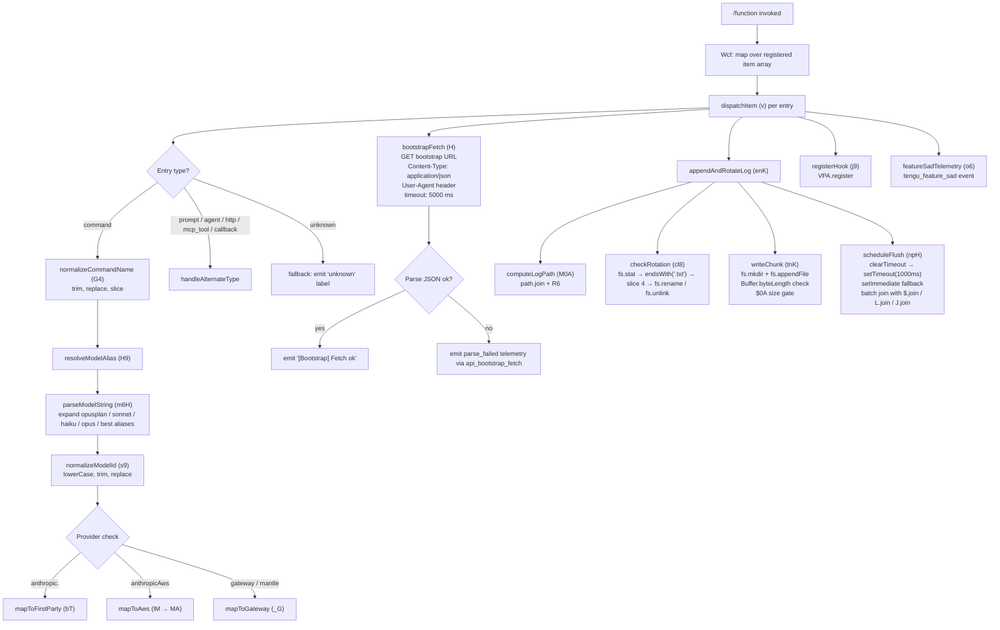

# `/function`

> Analysis basis: CC v2.1.167 bundle.js (AST extraction + Claude interpretation)
> Minimum version: v2.1.167

---

## Overview

The `/function` command is a `function`-type slash command registered in the Claude Code CLI. Rather than dispatching a fixed prompt to the agent, it executes a handler function (`Wcf`) that maps over an array of registered items and invokes a secondary dispatch function, ultimately resolving bootstrap data, parsing model aliases, performing filesystem writes, and managing shell process lifecycle. It is the internal plumbing for registering and resolving callable function-type slash-command entries at runtime.

---

## Registration

| Field | Value |
|---|---|
| type | `function` |
| name | `function` |
| description | `null` |
| loc_byte | `13380030` |
| loc_byte_end | `13380063` |
| loc_line | `10710` |
| arbor_handler.name | `Wcf` |
| arbor_handler.fqn | `claude-2.1.167::Wcf` |
| arbor_handler.kind | `Function` |
| arbor_handler.resolution_path | `direct` |
| arbor_handler.n_hits | `1` |

Analysis basis: CC v2.1.167 bundle.js:+13380030

---

## Input Branching

The call graph from `Wcf` fans out into more than three distinct processing branches: bootstrap fetch, model alias resolution, filesystem append/rotation, and shell process management. A Mermaid flowchart is used.



Analysis basis: CC v2.1.167 bundle.js:+13379711 (Wcf→H.map), +13379782 (Wcf→Z$H), +13380030 (registration block)

---

## Behavioral Spec

### 1. Entry Point — Handler Dispatch (`Wcf`)

```
function commandFunctionHandler(registeredItems):
    results = registeredItems.map(item => dispatchItem(item))
    secondary = resolveSecondaryEntry(Z$H)
    return results
```

`Wcf` iterates over the array `H` using `H.map`, then calls a secondary resolver `Z$H`.

Analysis basis: CC v2.1.167 bundle.js:+13379711, +13379782

---

### 2. Per-Item Dispatch (`v`)

```
function dispatchItem(item):
    parseResult = parseTypeFields(item)          // NUH
    typeInfo    = resolveOnK(item)               // onK → KI, f0A, vPA
    
    if item.type in ["command", "prompt", "agent", "http", "mcp_tool", "callback"]:
        label = item.type                         // literals at +12471306–+12471449
    else:
        label = "unknown"                         // literal at +13380144

    name = normalizeCommandName(item)             // G4
    name = name.toUpperCase()                     // _.toUpperCase at +206696
    name = name.trim()                            // H.trim at +206719
    
    modelAlias = resolveModelAlias(name)          // H9
    
    writeLog(item)                                // EUH → lWA → H.write
    appendAndRotateLog(item)                      // enK
    registerHook(item)                            // j9 → VPA.register
    
    return label
```

Type literals observed: `"command"` (+13379742), `"prompt"` (+12471306), `"agent"` (+12471335), `"http"` (+12471363), `"mcp_tool"` (+12471387), `"callback"` (+12471449), `"unknown"` (+13380144).

Analysis basis: CC v2.1.167 bundle.js:+206594 (v→NUH), +206612 (v→onK), +206634 (v→H.includes), +206652 (v→RH), +206696 (v→_.toUpperCase), +206716 (v→G4), +206735 (v→ny), +206741 (v→EUH), +206755 (v→enK)

---

### 3. Command Name Normalization (`G4`)

```
function normalizeCommandName(rawName):
    segments = buildSegments(rawName)            // q0A → lnK.map at +197888
    name     = rawName.replace(pattern, sub)     // H.replace at +198200
    
    // Redact sensitive segment:
    name     = applyRedaction(name)              // literal "[REDACTED]" at +198252
    
    // Take last meaningful component:
    idx      = name.lastIndexOf(delimiter)       // A.lastIndexOf at +198336
    tail     = name.slice(idx + 2)               // A.slice at +198362; offset constant 2 at +198281
    last     = tail.at(-1)                       // q.at at +198310
    
    return last ?? name
```

The literal `"[REDACTED]"` at +198252 indicates that at least one name segment is masked in serialized output. The constant `2` (+198281) is used as a slice offset.

Analysis basis: CC v2.1.167 bundle.js:+198173, +198200, +198252, +198281, +198310, +198336, +198362

---

### 4. Type-Field Resolution (`onK` / `vPA`)

```
function resolveTypeFields(item):
    key  = lookupKey(item, offset=1)             // KI at +205174; number literal 1 at +205186
    pair = buildPair(item)                       // f0A at +205288
    result = buildVersionedPair(pair)            // vPA at +205301
        startByte = sdK(pair)                    // sdK at +61502; base 0 at +61494
        endByte   = tdK(pair)                    // tdK at +61516
    return {key, startByte, endByte}
```

Analysis basis: CC v2.1.167 bundle.js:+205174, +205186, +205288, +205301, +61494, +61502, +61516

---

### 5. Bootstrap Fetch (`H`)

```
async function bootstrapFetch(url):
    log("[Bootstrap] Fetching", url)             // literal at +15797460
    
    headers = {
        "Content-Type": "application/json",      // literals at +15797545, +15797560
        "User-Agent":   agentString              // literal at +15797579
    }
    
    cachedResult = qA.get(cacheKey)              // qA.get at +15797496
    if cachedResult: return cachedResult
    
    response = await fetch(url, {headers, timeout: 5000})  // timeout literal at +15797661
    
    parsed = Y3(response)                        // Y3 at +15797592
    parsed = parseCommandLine(uj_)(response)     // uj_ at +15797600
    
    if not parsed:
        emitTelemetry("api_bootstrap_fetch", {result: "parse_failed"})
        // literals at +15797782, +15797804
        return null
    
    log("[Bootstrap] Fetch ok")                  // literal at +15797834
    
    hasFlags = checkFlags(lHH)                   // lHH → i74.has at +844383
    normalized = normalizeInput(uj)              // uj → H.replace at +2249044
    aliasResult = resolveAliasChain(H9)
    
    return aliasResult
```

The bootstrap fetch has a hard timeout of **5000 ms** (bundle.js:+15797661) and emits telemetry event `"api_bootstrap_fetch"` with label `"parse_failed"` on JSON parse failure (bundle.js:+15797782, +15797804).

Analysis basis: CC v2.1.167 bundle.js:+15797458, +15797496, +15797545, +15797560, +15797579, +15797592, +15797600, +15797631, +15797643, +15797646, +15797661, +15797670, +15797779, +15797782, +15797804, +15797834

---

### 6. Model Alias Resolution Chain (`H9` → `m6H` → `s9`)

```
function resolveAliasChain(rawModelId):
    expanded = expandAlias(m6H, rawModelId)
    normalized = normalizeModelId(s9, expanded)
    return normalized

function expandAlias(rawId):
    base     = Q0(rawId)
    variant  = aqH(rawId)
    provider = yA(rawId)
    
    // Named alias mapping (literals):
    // "opusplan"  → +2247508
    // "[1m]"      → +2247534  (1-minute context modifier)
    // "sonnet"    → +2247549
    // "haiku"     → +2247588
    // "opus"      → +2247627
    // "best"      → +2247664
    
    tier = qB(rawId)   // further decomposition: trim, startsWith, includes checks
    return {base, variant, provider, tier}

function normalizeModelId(expandedId):
    lower   = expandedId.trim().toLowerCase()    // +2247412, +2247423
    mapped  = Y2(lower)                          // Y2 → R4H at +2985336
    cleaned = lower.replace(pattern, "")         // A.replace at +2247451
    
    tier = h4H(cleaned)                          // h4H → y4H.includes at +2240618
    
    provider = determineProvider(cleaned):
        if cleaned includes "anthropic.":        // literal at +2241469
            route = CI(cleaned)                  // CI → lM, N5
        elif cleaned includes flag [HKL]:
            route = VH8(cleaned)                 // VH8 → HKL.includes at +2247950
        elif cleaned is "opusplan":
            route = DdH(cleaned)                 // DdH → N5 at +2244040
        elif tier == "firstParty":               // literal at +2243716
            route = bT(cleaned)                  // bT → lM, N5, MA
        elif tier == "anthropicAws":             // literal at +2101625
            route = lM(cleaned)                  // lM → MA at +2101590
        elif tier == "gateway":                  // literal at +2101645
            route = _G(cleaned)                  // _G → GA, g6H, gYH, jdH, bT, z2, lM, MA, N5, CI
        elif tier == "mantle":                   // literal at +2244357
            route = _G(cleaned)
    
    replacement = wdH(cleaned)                   // wdH → _6 at +2247988
    final = cleaned.replace(oldPat, replacement) // _.replace at +2247754
    return final
```

Known alias tokens: `"opusplan"`, `"[1m]"`, `"sonnet"`, `"haiku"`, `"opus"`, `"best"`. Provider tiers: `"firstParty"`, `"anthropicAws"`, `"gateway"`, `"mantle"`.

Analysis basis: CC v2.1.167 bundle.js:+2243492, +2243529, +2243542, +2247412–+2247754

---

### 7. Log Write (`EUH` / `lWA`)

```
function writeLogEntry(entry):
    serialized = serializeEntry(entry)           // RH → JSON.stringify at +185264
    lWA.write(serialized)                        // lWA → H.write at +193301
```

Analysis basis: CC v2.1.167 bundle.js:+206741 (v→EUH), +193301 (lWA→H.write), +185264 (RH→JSON.stringify)

---

### 8. Append-and-Rotate Log (`enK`)

```
async function appendAndRotateLog(entry):
    dir      = path.dirname(entry.path)          // IHH.dirname at +206115
    key      = lookupKey(entry)                  // KI at +206145
    debugLog(entry)                              // d6 at +206160; literal "debug" at +206570
    
    logPath  = computeLogPath(entry)             // M0A → IHH.join, R6 at +205767, +205781
    rotErr   = checkAndRotate(entry)             // cl8 at +206284
        stat = fs.stat(logPath)                  // ly.stat at +205407
        if logPath.endsWith(".txt"):             // literal ".txt" at +205511
            rotated = logPath.slice(0, -4)       // constant 4 at +205533
            fs.rename(rotated, newPath)          // ly.rename at +205563
            h8(rotated)                          // h8 at +205591
            fs.unlink(oldPath)                   // ly.unlink at +205603
    
    byteLen  = Buffer.byteLength(payload)        // Buffer.byteLength at +206290
    gate     = $0A(byteLen)                      // $0A at +206323
    
    pending  = LB6.then(writeChunk)             // LB6.then at +206340
    bound    = tnK.bind(context)                // tnK.bind at +206349
    
    await writeChunk(entry):                     // tnK
        fs.mkdir(dir, {recursive:true})          // ly.mkdir at +205836
        fs.appendFile(logPath, payload)          // ly.appendFile at +205895
        dirCheck  = U76(logPath)                 // U76 → V8 at +175684; error "EISDIR" at +175692
        pathCheck = M0A(logPath)                 // M0A → IHH.join, R6
        rotate    = cl8(logPath)                 // cl8 (rotation check)
        byteCheck = Buffer.byteLength(payload)   // Buffer.byteLength at +205988
        gate2     = $0A(byteCheck)              // $0A at +206021
    
    flushHandle = scheduleFlush(entry)           // j9 → VPA.register at +60369
```

Analysis basis: CC v2.1.167 bundle.js:+206082–+206445

---

### 9. Flush Scheduler (`npH`)

```
function scheduleFlush(state):
    clearTimeout(state.timer)                    // clearTimeout at +59783
    
    batchItems = H(state)                        // H at +59824 (batch builder)
    joined1    = $.join(state.queue)             // $.join at +59857
    zVal       = z(state)                        // z at +59855
    
    timer = setTimeout(flush, 1000)              // setTimeout at +59947; delay literal 1000 at +59671
    $.push(item)                                 // $.push at +59982
    
    setImmediate(immediateFlush)                 // setImmediate at +60040; max-batch 100 at +59692
    joined2 = J.join(state.pending)              // J.join at +60080
    L.push(result)                               // L.push at +60131
    joined3 = L.join(state.output)              // L.join at +59901
    
    D(state)                                     // D at +60153
    w(state)                                     // w at +60175
    Y(state)                                     // Y at +60198
    
    return timer
```

Constants: flush delay = **1000 ms** (+59671), batch size cap = **100** (+59692).

Analysis basis: CC v2.1.167 bundle.js:+59671, +59692, +59783, +59824, +59857, +59901, +59947, +59982, +60040, +60080, +60131, +60175, +60198

---

### 10. Hook Registration (`j9`)

```
function registerHook(entry):
    VPA.register(entry)                          // VPA.register at +60369
```

Analysis basis: CC v2.1.167 bundle.js:+206445, +60369

---

### 11. Feature-Sad Telemetry (`o6`)

```
function featureSadTelemetry(context):
    l(context)                                   // l at +1011091
    J6.emit("tengu_feature_sad", context)        // J6 → ym6 at +3628; telemetry at +1011093
```

Analysis basis: CC v2.1.167 bundle.js:+1011091, +1011093, +1011127

---

## State & Side Effects

| Item | Detail |
|---|---|
| Telemetry | `tengu_feature_sad` (bundle.js:+1011093); `api_bootstrap_fetch` with `parse_failed` label (bundle.js:+15797782, +15797804) |
| Hook registration | `VPA.register` called per entry (bundle.js:+60369) |
| Filesystem writes | `fs.appendFile` to computed log path (bundle.js:+205895); `fs.mkdir` (recursive) (bundle.js:+205836); `fs.rename` and `fs.unlink` on rotation (bundle.js:+205563, +205603) |
| Log flush scheduling | `setTimeout` with 1000 ms delay (bundle.js:+59671); `setImmediate` fallback (bundle.js:+60040); batch cap 100 items (bundle.js:+59692) |
| Bootstrap cache | `qA.get` read before fetch (bundle.js:+15797496); result cached on success |
| JSON serialization | `JSON.stringify` used for log entry serialization (bundle.js:+185264) |
| appState changes | <!-- TODO: not found in depth-2 traversal; needs --depth 4 --> |
| Sound | <!-- TODO: not found in depth-2 traversal; needs --depth 4 --> |

---

## Version History

| Version | Change |
|---|---|
| v2.1.167 | Initial analysis |

---

## Common Mistakes

1. **Assuming `/function` accepts user-visible input**: This command's `description` is `null` and its handler is a programmatic function (`Wcf`), not a prompt-driven agent. It is not intended for direct conversational invocation.
2. **Ignoring the 5000 ms bootstrap timeout**: Environments with slow network access may silently receive `parse_failed` telemetry with no visible error to the user.
3. **Overlooking log rotation**: The `.txt`-suffix rotation logic (slice offset 4) may silently rename or delete log files if the path coincidentally ends in `.txt`; callers must not assume log filenames are stable.
4. **Assuming model aliases are stable**: The alias set (`opusplan`, `sonnet`, `haiku`, `opus`, `best`, `[1m]`) is hardcoded in the bundle; they may not map to the same underlying model IDs across bundle versions.
5. **Treating `"[REDACTED]"` as an error**: The command name normalization pipeline intentionally masks certain segments; this is expected behavior, not a crash.
6. **Misinterpreting the flush batch cap**: The `setImmediate` path has a cap of **100 items** per immediate batch; items beyond that cap are deferred to the `setTimeout(1000)` queue.

---

## Appendix — Identifier Mapping

> For bundle debugging only. Identifiers change across versions.

| Identifier | Role |
|---|---|
| `Wcf` | Main handler for `/function` command (arbor_handler, direct resolution) |
| `H` | Bootstrap fetch orchestrator; also used as array/map target in dispatch |
| `v` | Per-item dispatch function |
| `onK` | Type-field resolver (calls KI, f0A, vPA) |
| `vPA` | Versioned byte-pair builder (calls sdK, tdK) |
| `RH` | Log entry serializer (calls JSON.stringify) |
| `_` | Raw name string (toUpperCase, replace targets) |
| `G4` | Command name normalization function |
| `q0A` | Segment array builder (calls lnK.map) |
| `q` | Tail element accessor (calls .at, ipK.unlinkSync) |
| `A` | Path/string with lastIndexOf, slice, toLowerCase operations |
| `EUH` | Log write dispatcher (calls lWA) |
| `lWA` | Buffered writer (calls H.write) |
| `enK` | Append-and-rotate log orchestrator |
| `npH` | Flush scheduler (setTimeout/setImmediate logic) |
| `YKH` | Secondary path builder (calls i76, IHH.join, t8, R6) |
| `d6` | Debug log emitter |
| `U76` | EISDIR-guarded directory check (calls V8) |
| `M0A` | Log path computation (calls IHH.join, R6) |
| `cl8` | Log rotation check (fs.stat, fs.rename, fs.unlink) |
| `tnK` | Actual chunk writer (fs.mkdir, fs.appendFile) |
| `j9` | Hook registrar (calls VPA.register) |
| `Y3` | Response parser helper in bootstrap fetch |
| `uj_` | Command-line argument parser (split, trim, indexOf, slice) |
| `lHH` | Flag-set checker (calls i74.has) |
| `uj` | Input normalizer (calls H.replace) |
| `H9` | Alias resolution chain entry point |
| `m6H` | Model alias expander (Q0, aqH, yA, qB) |
| `Q0` | Base model ID extractor |
| `aqH` | Model variant extractor |
| `qB` | Model tier decomposer (trim, startsWith, includes, lt6, YdH, dP1, sqL, h4H, s9, tqL) |
| `s9` | Model ID normalizer (toLowerCase, trim, replace, Y2, h4H, CI, DdH, bT, cP1, lM, VH8, wdH) |
| `Y2` | Model ID secondary mapper (calls R4H) |
| `h4H` | Tier inclusion checker (calls y4H.includes) |
| `CI` | Anthropic-provider router (calls lM, N5) |
| `DdH` | opusplan-specific router (calls N5) |
| `bT` | First-party provider mapper (calls lM, N5, MA) |
| `cP1` | Conditional provider mapper (calls bT) |
| `lM` | AWS/base provider mapper (calls MA) |
| `VH8` | Flag-list provider router (calls HKL.includes) |
| `wdH` | Replacement string resolver (calls _6) |
| `FJ` | Alias chain combiner (calls s9, _G) |
| `_G` | Gateway/mantle provider router (calls GA, g6H, gYH, jdH, bT, z2, lM, MA, N5, CI) |
| `o6` | Feature-sad telemetry emitter (calls l, J6 → ym6) |
| `l` | Telemetry context builder |
| `J6` | Telemetry event emitter (calls ym6) |
| `ym6` | Low-level telemetry sink |
| `Z$H` | Secondary resolver called after map in Wcf |

---

Note: index built via Arbor fallback; some signals (telemetry, literals) may be missing — see arbor-fallback.js.