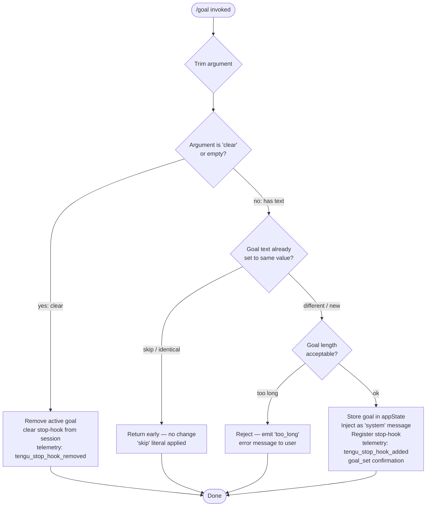

# `/goal`

> Analysis basis: CC v2.1.167 bundle.js (AST extraction + Claude interpretation)
> Minimum version: v2.1.167

---

## Overview

The `/goal` command lets the user set a persistent stop-condition that Claude evaluates before ending each agentic turn. When a goal string is active it is injected as a system-level hook; when the literal word `clear` is passed (or no argument is supplied) the active goal is removed. The command mutates app state directly and registers or deregisters a stop-hook in the running session.

---

## Registration

| Field | Value |
|---|---|
| type | `local-jsx` |
| name | `goal` |
| description | Set a goal Claude checks before stopping |
| argumentHint | `[<condition> \| clear]` |
| immediate | `true` |
| module_id | `N5K` |
| load_inline | `true` |
| loc_byte | `13014197` |
| loc_byte_end | `13014383` |
| loc_line | `9628` |
| arbor_handler.name | `PFf` |
| arbor_handler.fqn | `claude-2.1.167::PFf` |
| arbor_handler.kind | `AsyncFunction` |
| arbor_handler.resolution_path | `module_id` |
| arbor_handler.n_hits | `0` |

Analysis basis: CC v2.1.167 bundle.js:+13014197

---

## Input Branching

Four distinct top-level branches exist based on the argument supplied and the current goal state, so a Mermaid flowchart is used.



Analysis basis: CC v2.1.167 bundle.js:+13012792 (trim), +13012898 (`"skip"` literal), +13012951 (`"No goal set"` literal), +13013037 (`"goal_set"` literal), +13013048 (`"too_long"` literal)

---

## Behavioral Spec

### 1. Entry Point — `handleGoalCommand` (bundle: `PFf`)

The handler is an `AsyncFunction` resolved via the `module_id → N5K` path.

```
async function handleGoalCommand(context):
    rawArg = context.args
    trimmedArg = rawArg.trim()                    // +13012792

    currentGoal = getAppState("goal")             // via appState read

    if trimmedArg == "" or trimmedArg.toLowerCase() == "clear":
        clearGoal(context)
        return

    if shouldSkip(trimmedArg, currentGoal):       // "skip" sentinel +13012898
        return

    if isGoalTooLong(trimmedArg):                 // "too_long" branch +13013048
        reportError("too_long")
        return

    applyNewGoal(context, trimmedArg)
```

Analysis basis: CC v2.1.167 bundle.js:+13012792, +13012880, +13012912, +13012926

---

### 2. Goal Validation — `validateGoalInput` (bundle: `hy8`)

Before storing, the handler checks the lower-cased form of the argument against an internal set of reserved or disallowed strings.

```
function validateGoalInput(arg):
    lower = arg.toLowerCase()                     // +10828925
    if reservedGoalNames.has(lower):              // gzf.has +10828917
        return { valid: false, reason: "reserved" }
    return { valid: true }
```

Analysis basis: CC v2.1.167 bundle.js:+13012912, +10828917, +10828925

---

### 3. Applying a New Goal — `applyNewGoal` (bundle: `E16`)

When the goal is valid and new, the handler:

1. Reads current app state via `getAppState`.
2. Updates app state to store the goal string under the key `"goal"` (`+10830410`).
3. Appends a message of type `"system"` (`+13012995`) to the conversation using `applyMessageOp` with operation `"append"` (`+10830342`).
4. Attaches an `"attachment"` record (`+10830452`) carrying the goal payload.
5. Calls `registerStopHook` to install the stop-hook into the running session.
6. Emits telemetry event `tengu_stop_hook_added` (`+10830004`).
7. Generates a new UUID for the hook entry via `crypto.randomUUID` (`+10830470`).
8. Returns a `"goal_set"` confirmation string (`+13013037`) rendered to the user.

```
async function applyNewGoal(context, goalText):
    state = context.getAppState()
    newState = { ...state, goal: goalText }
    context.setAppState(newState)

    msgOp = {
        type:      "append",
        role:      "system",
        content:   goalText,
        attachment: { kind: "goal", text: goalText },
        id:        crypto.randomUUID()
    }
    context.applyMessageOp(msgOp)

    stopHookId = registerStopHook(context, goalText)  // T16 / W8A path
    emit("tengu_stop_hook_added")

    renderConfirmation("goal_set", goalText)
    // also invokes o6 (bootstrapFetch path) for upstream notification +13013034
```

Analysis basis: CC v2.1.167 bundle.js:+10830121, +10830250, +10830319, +10830342, +10830361, +10830374, +10830407, +10830410, +10830452, +10830470, +13013037

---

### 4. Registering the Stop-Hook — `registerStopHook` (bundle: `T16`)

The stop-hook is the mechanism Claude consults before finalising each agentic turn.

```
function registerStopHook(context, goalText):
    hookConfig = buildHookConfig(goalText)        // W8A +10829618

    gate1 = checkFeatureGate("hooks_gate")        // +10829514
    gate2 = checkFeatureGate("trust_gate")        // +10829568

    if not gate1 or not gate2:
        return null

    hookId = generateHookId()                     // via G16 / n2H
    state  = context.getAppState()                // +10829703
    now    = Date.now()                           // +10829867

    updatedState = addHookToState(state, hookId, hookConfig, now)
    context.setAppState(updatedState)             // +10829905
    context.applyMessageOp(stopHookOp)            // +10829947

    emit("tengu_stop_hook_added")                 // +10830004

    return hookId
```

The hook config building (`W8A`) internally calls:
- `buildPolicySettings` (`kB → x8`) which reads `"policySettings"` (`+3291495`).
- `buildConditionMessage` (`cD`) for constructing the stop-condition payload.
- `Of` (hook options assembler) which uses `EVL` to resolve the hook execution path.

Analysis basis: CC v2.1.167 bundle.js:+10829618, +10829703, +10829867, +10829905, +10829947, +10830004, +10829514, +10829568

---

### 5. Clearing the Goal — `clearGoal` (bundle: `E16` clear-path)

When the argument is empty or `"clear"`:

```
function clearGoal(context):
    state = context.getAppState()
    if state.goal == null:
        renderMessage("No goal set")              // +13012951
        return

    newState = { ...state, goal: null }
    context.setAppState(newState)
    context.applyMessageOp({ type: "append", role: "system", content: "" })

    removeStopHook(context)                       // f.close / q.close path +16208773
    emit("tengu_stop_hook_removed")               // +10830376
```

Analysis basis: CC v2.1.167 bundle.js:+13012951, +10830376, +16208773, +16208783

---

### 6. Bootstrap / Remote Notification — `bootstrapFetch` (bundle: `H` → `v`)

After a goal is set or cleared, the handler calls into the bootstrap-fetch subsystem (`o6` at `+13013034`) which:

- Logs `"[Bootstrap] Fetching"` (`+15797460`).
- Sends a request with headers `Content-Type: application/json` (`+15797560`) and `User-Agent` (`+15797579`).
- Applies a 5000 ms timeout (`+15797661`).
- On success logs `"[Bootstrap] Fetch ok"` (`+15797834`).
- On parse failure records `"parse_failed"` under the `"api_bootstrap_fetch"` telemetry key (`+15797782`, `+15797804`).

Analysis basis: CC v2.1.167 bundle.js:+15797460, +15797545, +15797560, +15797579, +15797661, +15797782, +15797804, +15797834

---

### 7. Stop-Hook Evaluation at Turn End — `evaluateGoalAtStop` (bundle: `T16`)

Before Claude finalises a turn the registered stop-hook fires and:

```
function evaluateGoalAtStop(context, goalText):
    stopLabel = "Stop"                            // +10829326
    hookType  = "prompt"                          // +10829433

    result = runGoalEvaluation(context, goalText, stopLabel)
    // G16 builds the evaluation map via n2H (K.set) and gzq (H.map)
    // A.push collects sub-results +10829442

    goalStatus = deriveGoalStatus(result)         // "goal_status" key +10830539
    context.setAppState({ goalStatus })

    if goalStatus == "met":
        allowStop()
    else:
        continueAgent()
```

Analysis basis: CC v2.1.167 bundle.js:+10829318, +10829326, +10829433, +10829442, +10830539

---

## State & Side Effects

| Item | Detail |
|---|---|
| Telemetry | `tengu_stop_hook_added` (+10830004), `tengu_stop_hook_removed` (+10830376), `tengu_feature_ok` (+1010950), `tengu_feature_sad` (+1011093) |
| appState writes | `goal` key set to goal string or cleared to `null`; `goalStatus` key updated at each stop-hook evaluation (+10830410, +10830539) |
| appState reads | `getAppState` called in `applyNewGoal` (+10830121) and `registerStopHook` (+10829703) |
| Message ops | `applyMessageOp` with `"append"` operation injects goal as system message (+10830319, +10829947) |
| Stop-hook registration | Hook registered under unique UUID via `crypto.randomUUID` (+10830470); keyed by `"hooks_gate"` (+10829514) and `"trust_gate"` (+10829568) feature gates |
| File I/O | `tnK` path: `mkdir`, `appendFile`, `rename`, `unlink` for hook state persistence (+205836, +205895, +205563, +205603); `ipK.unlinkSync` on close (+16173867) |
| Timer usage | `clearTimeout` / `setTimeout` / `setImmediate` used inside output-writer subsystem (`npH`) (+59783, +59947, +60040) |
| Sound | <!-- TODO: not found in depth-2 traversal; needs --depth 4 --> |
| Bootstrap fetch | Remote notification fired after goal set/clear; 5000 ms timeout (+15797661) |
| "skip" guard | If incoming goal text equals active goal, returns early without mutation (+13012898) |

---

## Version History

| Version | Change |
|---|---|
| v2.1.167 | Initial analysis |

---

## Common Mistakes

1. **Passing `clear` with extra whitespace** — the argument is trimmed before comparison (`+13012792`), so `"  clear  "` is treated as `"clear"` and will clear the goal correctly; this is expected behaviour, not a bug.
2. **Setting the same goal twice** — the `"skip"` sentinel (`+13012898`) causes the handler to return early with no visible feedback; the user may believe the command failed when the goal was simply already set.
3. **Goal text that is too long** — the `"too_long"` path (`+13013048`) silently rejects oversized input; users should keep goal conditions concise. The exact character limit is <!-- TODO: not found in depth-2 traversal; needs --depth 4 -->.
4. **Assuming the goal persists across sessions** — the stop-hook is registered against the live session state; restarting Claude Code requires re-issuing `/goal`.
5. **Using `/goal` when feature gates are closed** — if either `"hooks_gate"` (`+10829514`) or `"trust_gate"` (`+10829568`) is disabled, the stop-hook registration will not complete even though the app-state write succeeds, leading to a goal stored in state but never evaluated.

---

## Appendix — Identifier Mapping

> For bundle debugging only. Identifiers change across versions.

| Identifier | Role |
|---|---|
| `PFf` | Main async handler for `/goal` command (entry point) |
| `A` | Argument / input string variable (trimming, mapping contexts) |
| `f` | File/stream handle; also used as generic local in close paths |
| `q` | Secondary file/stream handle; also used in set/delete operations |
| `L` | Async task tracker (add/delete/finally set) |
| `H` | Bootstrap fetch orchestrator; also used as generic object/string reference |
| `v` | Bootstrap fetch implementation (logs "[Bootstrap] Fetching") |
| `onK` | Inner fetch helper (calls `KI`, `f0A`, `vPA`) |
| `vPA` | SDK/storage read helper (calls `sdK`, `tdK`) |
| `RH` | JSON serialisation helper (calls `JSON.stringify`) |
| `_` | Generic variable — context / lowercase transform / replace target |
| `G4` | String formatting helper (replacement, slice, lastIndexOf) |
| `q0A` | Map-over-lines helper |
| `EUH` | Write-wrapper calling `lWA` |
| `lWA` | Low-level stream write (`H.write`) |
| `enK` | File-append / persistence orchestrator |
| `npH` | Async output writer (setTimeout / setImmediate loop) |
| `YKH` | Hook join/render helper |
| `d6` | Directory utility used by `enK` |
| `U76` | Error-code classifier (handles `"EISDIR"`) |
| `M0A` | Path-join helper |
| `cl8` | File rotation helper (stat, endsWith `.txt`, rename, unlink) |
| `tnK` | Persistent-append writer (mkdir → appendFile → rotate) |
| `j9` | Hook registration finaliser (`VPA.register`) |
| `Y3` | Bootstrap sub-helper |
| `uj_` | Argument splitter (split, trim, indexOf, slice) |
| `lHH` | Reserved-name set membership check (`i74.has`) |
| `uj` | Argument cleaner (`H.replace`) |
| `H9` | Token / model string parser (calls `m6H`, `s9`, `FJ`) |
| `m6H` | Model-string decomposer (calls `Q0`, `aqH`, `yA`, `qB`) |
| `Q0` | Model family extractor |
| `aqH` | Model attribute parser |
| `qB` | Model qualifier builder (startsWith `"anthropic."`, includes checks) |
| `s9` | Model alias resolver (opusplan, sonnet, haiku, opus, best) |
| `Y2` | Regex/pattern helper (`R4H`) |
| `h4H` | Model inclusion checker (`y4H.includes`) |
| `CI` | Model capability resolver (calls `lM`, `N5`) |
| `DdH` | Model default resolver (`N5`) |
| `bT` | Model tier builder (firstParty, `lM`, `N5`, `MA`) |
| `cP1` | Model wrapper (delegates to `bT`) |
| `lM` | Model mapping helper (anthropicAws, gateway) |
| `VH8` | Model list inclusion check (`HKL.includes`) |
| `wdH` | Model detail resolver (calls `_6`) |
| `FJ` | Full model-string parser (calls `s9`, `_G`) |
| `_G` | Composite model builder (GA, g6H, gYH, jdH, bT, z2, lM, MA, N5, CI) |
| `o6` | Bootstrap/remote notification dispatcher |
| `l` | Low-level network / IPC send |
| `J6` | Network helper (calls `ym6`) |
| `ym6` | Base network primitive |
| `hy8` | Goal input validator (reserved-name check via `gzf.has`) |
| `E16` | Goal-apply and goal-clear orchestrator (appState read/write, applyMessageOp) |
| `R6` | Shared utility (calls `tv`) |
| `tv` | Base utility primitive |
| `G16` | Stop-hook evaluation map builder (calls `n2H`, `A.push`) |
| `n2H` | Evaluation map setter (`K.set`, `gzq`) |
| `K` | Evaluation map / column formatter (`L.map`, `f.padEnd`) |
| `gzq` | Result mapper (`H.map`) |
| `Oxq` | UUID generator wrapper (`fxq.randomUUID`) |
| `P6` | Confirmation renderer (calls `ym6`) |
| `T16` | Stop-hook registrar (feature-gate checks, appState update, telemetry) |
| `W8A` | Hook config builder (calls `kB`, `cD`, `U_`, `Of`) |
| `kB` | Policy-settings reader (calls `x8`) |
| `x8` | Settings store accessor (calls `Nn6`, `kd`) |
| `cD` | Stop-condition message builder (calls `x8`, `yA`) |
| `U_` | Hook options helper |
| `Of` | Hook execution-path assembler (calls `EVL`) |
| `EVL` | Hook resolver (_6, QpH, J9, C6, clH, Wd, u6, dD.resolve) |
| `yD` | Output-token counter helper (calls `hpH`, `Object.values`) |
| `SH` | Stop-confirmation renderer (calls `l`, `J6`) |
| `Sy8` | Post-goal cleanup / finaliser |

---

Note: index built via Arbor fallback; some signals (telemetry, literals) may be missing — see arbor-fallback.js.