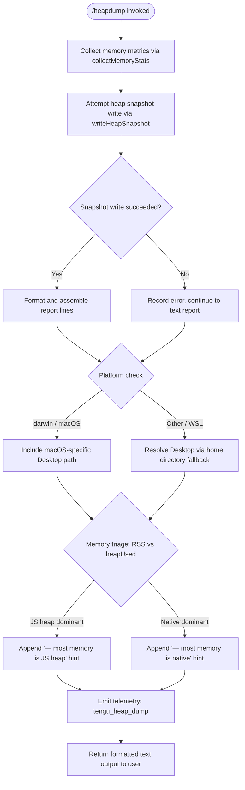

# `/heapdump`

> Analysis basis: CC v2.1.167 bundle.js (AST extraction + Claude interpretation)
> Minimum version: v2.1.167

---

## Overview

`/heapdump` is a hidden developer-diagnostic command that captures a JavaScript heap snapshot of the running Claude Code process, writes it to the user's Desktop directory, and returns a formatted memory-usage report. It collects V8 heap statistics, native memory metrics, Linux process memory maps (when available), and active file-descriptor counts, then prints a human-readable summary with a triage hint indicating whether the dominant memory pressure is in the JS heap or in native code.

---

## Registration

| Field | Value |
|---|---|
| type | `local` |
| name | `heapdump` |
| description | `Dump the JS heap to ~/Desktop` |
| supportsNonInteractive | `true` |
| isHidden | `true` |
| module_id | `p9K` |
| load_inline | `true` |
| loc_byte | `12612612` |
| loc_byte_end | `12613040` |
| loc_line | `9063` |
| arbor_handler.name | `ybf` |
| arbor_handler.fqn | `claude-2.1.167::ybf` |
| arbor_handler.kind | `AsyncFunction` |
| arbor_handler.resolution_path | `module_id` |
| arbor_handler.n_hits | `0` |

Analysis basis: CC v2.1.167 bundle.js:+12612612

---

## Input Branching

The command has four distinct outcome branches depending on runtime environment and memory profile, so a flowchart is used.



---

## Behavioral Spec

### Top-level Handler (`ybf`)

The Arbor-resolved handler is `ybf` (AsyncFunction). It orchestrates the two major sub-operations — memory stat collection and heap snapshot writing — then assembles the final output.

```
async function heapdumpHandler(commandContext):
    lines = []
    lines.push("Open the .heapsnapshot in Chrome DevTools → Memory → Load to inspect retainers.")

    stats = await collectMemoryStats()        // calls collectMemoryStats (u9K)
    snapshotResult = await writeHeapSnapshot() // calls heapdumpOrchestrator (RLA)

    lines = lines.concat(formatReport(stats, snapshotResult))
    lines.join("\n")  // bundle.js:+12611749

    emit telemetry: tengu_heap_dump           // bundle.js:+12610733
    return joinedText
```

Analysis basis: CC v2.1.167 bundle.js:+12611600

---

### Memory Statistics Collection (`u9K`)

Gathers a comprehensive snapshot of current process memory across multiple sources.

```
async function collectMemoryStats():
    result = {}

    // V8 and process metrics
    result.memoryUsage       = process.memoryUsage()           // bundle.js:+12607644
    result.heapStatistics    = v8.getHeapStatistics()          // bundle.js:+12607668
    result.resourceUsage     = process.resourceUsage()         // bundle.js:+12607694
    result.uptime            = process.uptime()                // bundle.js:+12607720
    result.heapSpaceStats    = v8.getHeapSpaceStatistics()     // bundle.js:+12607745

    // Active handles / requests (libuv internals)
    result.activeHandles     = process._getActiveHandles()     // bundle.js:+12607787
    result.activeRequests    = process._getActiveRequests()    // bundle.js:+12607824

    // Linux-only: open file descriptors from /proc
    if (platform supports /proc):
        fdEntries = await fs.readdir("/proc/self/fd")          // bundle.js:+12607875, literal:+12607887

    // Linux-only: smaps_rollup for native RSS breakdown
    if (file readable):
        smapsText = await fs.readFile("/proc/self/smaps_rollup", "utf8")
                                                               // bundle.js:+12607937, literals:+12607950,+12607976

    // Load bun:jsc module for Bun-specific JSC stats
    jscModule = require("bun:jsc")                             // bundle.js:+12608035, literal:+12608035

    // Uptime ceiling used in report: 3600 seconds
    // Memory unit divisor: 1048576 (1 MiB)               // bundle.js:+12608176, +12608181

    // Native-leak heuristic warning string present:
    // "Native memory > heap - leak may be in native addons..."
    //                                                      bundle.js:+12608414

    result.toFixedPrecision = value.toFixed(...)               // bundle.js:+12608537

    return result
```

Analysis basis: CC v2.1.167 bundle.js:+12607644

---

### Heap Snapshot Orchestrator (`RLA`)

Drives the full dump pipeline: resolving the output path, writing the snapshot, and producing the text report.

```
async function heapdumpOrchestrator():
    // 1. Resolve output directory
    outputDir = resolveDesktopPath()           // calls desktopPathResolver (FCA)

    // 2. Collect stats
    stats = collectMemoryStats()               // calls u9K

    // 3. Build output file path
    filename = path.join(outputDir, ...)       // bundle.js:+12610548

    // 4. Write snapshot file with mode 384 (octal 0o600, owner read/write only)
    await fs.writeFile(filename, data, { mode: 384 })
                                               // bundle.js:+12610591, literal:+12610626

    // 5. Write the actual Bun heap snapshot
    writeHeapSnapshotFile(filename)            // calls kbf  bundle.js:+12610682

    // 6. Format the human-readable report
    reportLines = formatMemoryReport(stats)    // calls reportFormatter (l)

    // 7. Error wrapper
    on error:
        wrap with errorWrapper (AA / O$)       // bundle.js:+12610902, +12610911

    // 8. Log via structured logger
    hH(...)                                    // bundle.js:+12610989

    // 9. Emit telemetry
    emit tengu_heap_dump                       // bundle.js:+12610733
```

Analysis basis: CC v2.1.167 bundle.js:+12610143

---

### Desktop Path Resolver (`FCA`)

Computes the platform-appropriate Desktop path for the output file.

```
function resolveDesktopPath():
    home = os.homedir()                        // bundle.js:+1061686

    // Primary: join homedir + "Desktop"
    candidate = path.join(home, "Desktop")     // bundle.js:+1061722, literal:+1061732

    // WSL fallback: scan /mnt/c/Users for valid Windows user profiles
    // Skips pseudo-accounts: "Public", "Default", "Default User", "All Users"
    // literals: bundle.js:+1061954, +1061998, +1062017, +1062037, +1062062
    if (path begins with "/mnt/c/Users"):
        for each subdir in /mnt/c/Users:
            if subdir not in ["Public","Default","Default User","All Users"]:
                candidate = path.join(subdir, "Desktop")

    candidate = candidate.replace(...)         // bundle.js:+1061862
    return candidate
```

Analysis basis: CC v2.1.167 bundle.js:+1061679

---

### Bun Heap Snapshot Writer (`kbf`)

Performs the actual low-level heap snapshot write using Bun runtime APIs.

```
function writeHeapSnapshotFile(outputPath):
    // Write V8-format arraybuffer snapshot
    // format hint: "v8" / "arraybuffer"      // bundle.js:+12611206, +12611211
    fs.writeFileSync(outputPath, ...)          // bundle.js:+12611161

    snapshot = Bun.generateHeapSnapshot()      // bundle.js:+12611181
    Bun.gc(/* force */ true)                   // bundle.js:+12611238
```

Analysis basis: CC v2.1.167 bundle.js:+12611161

---

### Memory Report Formatter (`hbf`)

Assembles the human-readable diagnostic lines returned to the user.

```
function formatMemoryReport(stats):
    lines = []

    // Prepend Chrome DevTools usage hint (literal):
    // "Open the .heapsnapshot in Chrome DevTools → Memory → Load..."
    //                                               bundle.js:+12611637

    rss       = stats.rss  (in MiB, divided by 1048576)
    heapUsed  = stats.heapUsed

    // Triage branch — more than 8 sub-segments compared  // bundle.js:+12612256
    dominantFlag = computeDominance(rss, heapUsed, Math.max)
                                                   // bundle.js:+12611856

    if dominantFlag == JS_HEAP:
        lines.push("— most memory is JS heap (inspect the .heapsnapshot)")
                                                   // bundle.js:+12611924
    else:
        lines.push("— most memory is native (NOT in the .heapsnapshot)")
                                                   // bundle.js:+12611984

    // Threshold: 1 GiB = 1073741824 bytes         // bundle.js:+12612530
    // auto-1.5GB label used in display             // bundle.js:+12610799

    if noObviousLeakIndicators:
        lines.push("  (no obvious leak indicators)")
                                                   // bundle.js:+12612121

    // Append platform label
    if platform == "darwin":
        lines.push("macos")                        // literals:+12609268, +12609687

    lines.push("No obvious leak indicators. Check heap snapshot for retained objects.")
                                                   // bundle.js:+12609533

    return jq6(lines)                              // bundle.js:+12612168
```

Analysis basis: CC v2.1.167 bundle.js:+12611856

---

### Logger Helper (`hH`)

A structured logging wrapper that enqueues log entries, buffers recent entries in a ring buffer, and reports errors.

```
function structuredLogger(level, message, meta):
    formatted = errorWrapper(message)              // calls AA  bundle.js:+1016312
    entry     = formatLogString(formatted)         // calls _6  bundle.js:+1016325
    enqueue(entry)                                 // calls $q  bundle.js:+1016571
    rotateRingBuffer()                             // calls zG4 bundle.js:+1016654
    pushToLogList()                                // calls PFH.push bundle.js:+1016672
    if error-level:
        pr.logError(...)                           // bundle.js:+1016712
```

Analysis basis: CC v2.1.167 bundle.js:+1016312

---

## State & Side Effects

| Item | Detail |
|---|---|
| Telemetry — primary | `tengu_heap_dump` emitted on every invocation (bundle.js:+12610733) |
| Telemetry — daemon control | `tengu_daemon_control` (bundle.js:+16233774) — reached via daemon-stop path in call graph |
| Telemetry — daemon config reload | `tengu_daemon_config_reload` (bundle.js:+16212216) |
| Telemetry — background worker | `tengu_bg_*` family (retire_pinned_low_mem, prewarm_per_sweep, dispatch_sigkill_escalate, dispatch_low_mem, spare_enable, spare_claim, spare_claim_fail, proto_mismatch, dispatch_stale_drop, attach_legacy_autorespawn, attach, attach_stall_gave_up, attach_stall_respawn, attach_kick) — reachable via supervisor path |
| File write | Heap snapshot written to `~/Desktop/<filename>.heapsnapshot` with mode `0o600` (384 decimal) (bundle.js:+12610591, +12610626) |
| Bun GC | `Bun.gc(true)` is called after snapshot generation to force a full GC cycle (bundle.js:+12611238) |
| `/proc` reads | On Linux: reads `/proc/self/fd` (directory listing) and `/proc/self/smaps_rollup` (UTF-8) for native memory info (bundle.js:+12607875, +12607937) |
| appState changes | None observed at depth ≤ 2 |
| Sound | None observed |
| Hook registration | `j9` → `VPA.register` hook path reachable via logging subsystem (bundle.js:+60369) |
| Log ring buffer | Recent log entries rotated via `zG4` ring-buffer (shift/push) (bundle.js:+1015992, +1016004) |

---

## Version History

| Version | Change |
|---|---|
| v2.1.167 | Initial analysis |

---

## Common Mistakes

1. **Expecting output in the current working directory** — the snapshot is always written to the user's Desktop (`~/Desktop`), not to the project directory or CWD. On WSL, the resolver scans `/mnt/c/Users` for a valid Windows user profile.
2. **Running in non-interactive pipelines** — although `supportsNonInteractive: true` is set, the command calls `Bun.generateHeapSnapshot()` which requires the Bun runtime. Running under plain Node.js will cause the snapshot step to fail (the text report may still be generated).
3. **Missing `bun:jsc` module** — the stats collection step requires `bun:jsc` (bundle.js:+12608035). If the module is absent, heap-space statistics will be incomplete.
4. **Interpreting "native dominant" incorrectly** — when the report says most memory is native, the `.heapsnapshot` file will not show the dominant allocations. Native pressure typically indicates leaks in native addons such as `node-pty` or `sharp` (bundle.js:+12608414).
5. **Forgetting the command is hidden** — `/heapdump` does not appear in `/help` output (`isHidden: true`). It must be typed in full.
6. **File permissions** — the `.heapsnapshot` file is written with mode `0o600` (owner read/write only). Attempting to open it as another user will fail with a permission error.

---

## Appendix — Identifier Mapping

> For bundle debugging only. Identifiers change across versions.

| Identifier | Role |
|---|---|
| `ybf` | Top-level heapdump command handler (AsyncFunction) — Arbor-resolved entry point |
| `RLA` | Heap snapshot orchestrator — coordinates path resolution, snapshot write, and report assembly |
| `u9K` | Memory statistics collector — gathers V8, process, and Linux /proc metrics |
| `kbf` | Bun heap snapshot file writer — calls `Bun.generateHeapSnapshot` and `Bun.gc` |
| `hbf` | Memory report formatter — builds human-readable diagnostic lines with triage hint |
| `FCA` | Desktop path resolver — handles macOS, Linux, and WSL path detection |
| `hH` | Structured logger helper with ring-buffer rotation |
| `AA` | Error wrapper utility |
| `O$` | Secondary error handler / formatter |
| `_6` | Log entry string formatter |
| `$q` | Log entry enqueue function |
| `QRA` | Log string normaliser (calls `_6`) |
| `zG4` | Ring-buffer rotation for recent log entries (shift/push on `Sc6`) |
| `jq6` | Final output assembly helper called by report formatter |
| `lV6` | TeammateMailbox markMessagesAsRead helper |
| `R6` | Utility / environment detection helper |
| `tv` | Sub-utility called by environment detection |
| `W` | Module loader / wrapper helper |
| `P` | Supervisor / daemon session manager |
| `w` | Background worker spawn / lifecycle manager |
| `h` | Background sweep / grace-clock manager |
| `Y` | Supervisor config-reload handler |
| `z` | Daemon stop controller |
| `H` | Bootstrap fetch handler |
| `j` | Background worker kill utility |
| `J` | Worker map iteration helper |
| `TOA` | Vim-mode operator dispatcher |
| `C` | Command execution queue |
| `X` | PTY/IPC socket message handler |
| `X5` | IPC channel close helper |
| `i$5` | PTY/IPC session message dispatcher |
| `GH` | String coercion utility |
| `v` | Logging output channel / stderr writer |
| `onK` | Log formatting initialiser |
| `vPA` | Log transport selector (sdK/tdK) |
| `RH` | JSON stringify wrapper |
| `G4` | Path basename extractor |
| `q0A` | Filename map helper |
| `EUH` | Log write dispatcher |
| `lWA` | Low-level log write (H.write) |
| `enK` | Rotating file logger core |
| `npH` | Async write queue / batching buffer |
| `YKH` | Log file path builder |
| `d6` | Date/timestamp formatter |
| `U76` | File permission / mode helper |
| `M0A` | Log directory path builder |
| `cl8` | Log file rotation helper (stat / rename / unlink) |
| `tnK` | Log append + rotation orchestrator |
| `j9` | Hook registration entry point |
| `K` | Column formatter (padEnd, map) |
| `L` | Async task tracker (add/delete/finally) |
| `f` | Resource close helper (A.close / q.close) |
| `l` | Generic utility / Promise helper |

---

Note: index built via Arbor fallback; some signals (telemetry, literals) may be missing — see arbor-fallback.js.