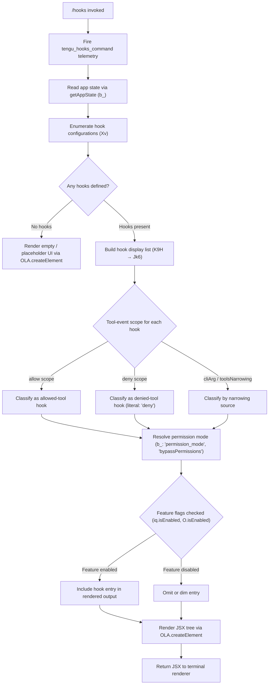

# `/hooks`

> Analysis basis: CC v2.1.167 bundle.js (AST extraction + Claude interpretation)
> Minimum version: v2.1.167

---

## Overview

The `/hooks` command displays the active hook configurations that govern tool-event callbacks in the current Claude Code session. It is a read-only, immediate-mode JSX command that reads application state and renders a structured view of every registered hook, its tool-event bindings, and associated permission or filtering metadata. No prompt is sent to the model; the output is rendered directly in the terminal UI.

---

## Registration

| Field | Value |
|---|---|
| type | `local-jsx` |
| name | `hooks` |
| description | `View hook configurations for tool events` |
| loc_byte | `12501574` |
| loc_byte_end | `12501724` |
| loc_line | `8941` |
| immediate | `true` |
| module_id | `GAK` |
| load_inline | `true` |
| arbor_handler.name | `iRf` |
| arbor_handler.fqn | `claude-2.1.167::iRf` |
| arbor_handler.kind | `AsyncFunction` |
| arbor_handler.resolution_path | `module_id` |
| arbor_handler.n_hits | `0` |

Analysis basis: CC v2.1.167 bundle.js:+12501574

---

## Input Branching

The handler follows several distinct branches depending on the hook data present in application state, making a Mermaid flowchart the appropriate representation.



Analysis basis: CC v2.1.167 bundle.js:+12501414 (handler `iRf` → `Xv`), +12501372 (telemetry call), +9882184 (hook list builder `K9H`)

---

## Behavioral Spec

### 1. Handler Entry and Telemetry

When `/hooks` is invoked the async handler `iRf` is called immediately (registration field `immediate: true`). The very first action is emitting the `tengu_hooks_command` telemetry event. Control then passes to the app-state reader and the JSX renderer.

```
async function hooksCommandHandler(context):
    emit telemetry("tengu_hooks_command")
    appState = readAppState(context)          // b_  → H.getAppState
    jsxTree  = buildHooksView(appState)       // Xv
    return OLA.createElement(jsxTree)
```

Analysis basis: CC v2.1.167 bundle.js:+12501372 (telemetry), +12501406 (`b_`), +12501414 (`Xv`), +12501444 (`OLA.createElement`)

---

### 2. App-State Reading (`b_`)

The state reader (`b_`) fetches the current app state object, then searches for the most-recent relevant state snapshot using `Array.findLast`. It extracts several named fields from that snapshot:

- `working_directory` (bundle.js:+10944470)
- `allowed_tools` (bundle.js:+10944525)
- `disallowed_tools` (bundle.js:+10944580)
- `avoid_prompts` (bundle.js:+10944641)
- `permission_mode` (bundle.js:+10944743)
- `bypassPermissions` (bundle.js:+10944774)
- `session` (bundle.js:+10945073)
- `effort` (bundle.js:+10945098)
- `model` (bundle.js:+10945111)
- `max_thinking_tokens` (bundle.js:+10945123)
- `flag_settings` (bundle.js:+10945149)

The bypass-permissions path additionally calls `aB` which fires the `tengu_disable_bypass_permissions_mode` telemetry and calls `D6` (the permission-mode enforcer), which in turn uses set-based deduplication (`HwH`, `SP_`) and a timestamp via `Date.now`.

```
function readHookAppState(context):
    raw = H.getAppState(context)
    snapshot = raw.findLast(isRelevantSnapshot)
    return {
        workingDirectory : snapshot["working_directory"],
        allowedTools     : snapshot["allowed_tools"],
        disallowedTools  : snapshot["disallowed_tools"],
        avoidPrompts     : snapshot["avoid_prompts"],
        permissionMode   : snapshot["permission_mode"],
        bypassPermissions: snapshot["bypassPermissions"],
        session          : snapshot["session"],
        effort           : snapshot["effort"],
        model            : snapshot["model"],
        maxThinkingTokens: snapshot["max_thinking_tokens"],
        flagSettings     : snapshot["flag_settings"],
    }
```

Analysis basis: CC v2.1.167 bundle.js:+10944365 (`H.getAppState`), +10944445 (`A.findLast`)

---

### 3. Hook View Builder (`Xv`)

`Xv` is the central JSX-building function. It orchestrates the following sub-steps:

1. **Initialise display buffer** (`Y.push`) — prepares an array for hook-row entries.
2. **Build hook list** (`K9H`) — filters and maps over known hooks, calling `Jk6` per hook entry.
3. **Classify each hook** (`Jk6` → `at`, `k6A`, `ZCq`) — determines scope (`allow`, `deny`, `cliArg`, `toolsNarrowing`).
4. **Resolve tool strings** (`As_` → `fb`, `y4`) — normalises tool identifiers, handling Windows-style paths (literal `"windows"` at bundle.js:+4918734).
5. **Apply feature-flag gates** (`iq.isEnabled`, `O.isEnabled`) — checks whether experimental features are active before including certain hook types.
6. **Format output** (`Vg`, `GP`, `nN`) — constructs display rows including status indicators and nested agent information; uses `"local-agent"` label (bundle.js:+5359875) and `"--agent-teams"` flag (bundle.js:+5490793).
7. **Produce final JSX** — calls `OLA.createElement` with the assembled tree.

```
function buildHooksView(appState):
    hookRows = []
    rawHooks = filterActiveHooks(appState.allowedTools,
                                  appState.disallowedTools)   // K9H
    for hook in rawHooks:
        classified = classifyHookScope(hook)                  // Jk6 → at, k6A
        toolLabel  = resolveToolLabel(hook, platform)         // As_ → fb / y4
        featureOn  = checkFeatureFlags(hook)                  // iq.isEnabled / O.isEnabled
        if featureOn or not isExperimental(hook):
            row = formatHookRow(classified, toolLabel,        // Vg → GP, nN
                                agentConfig)
            hookRows.push(row)

    if hookRows is empty:
        return renderEmptyState()
    return renderHookTable(hookRows)                          // OLA.createElement
```

Analysis basis: CC v2.1.167 bundle.js:+9882061 (`wG`), +9882133 (`Y.push`), +9882184 (`K9H`), +9882199 (`As_`), +9882369 (`Vg`), +9882438 (`iq.isEnabled`), +9882568 (`O.isEnabled`)

---

### 4. Hook Classification (`Jk6` / `k6A`)

Each hook entry is classified by its source and effect:

- **`at`**: flattens multi-tool entries using `Dy8.flatMap`, then routes to `w$` for allow/deny determination. The literal `"deny"` (bundle.js:+10676814) marks a denied-tool hook.
- **`k6A`**: applies additional labelling — `"cliArg"` (bundle.js:+10677488) for hooks passed via CLI arguments; `"toolsNarrowing"` (bundle.js:+10677509) for hooks that narrow the available tool set.
- **`ZCq`**: handles a third classification path (details not fully resolved at depth-2 traversal).

```
function classifyHookScope(hook):
    flattened = flatMap(hook.tools)                    // at → Dy8.flatMap
    if flattened includes "deny":
        return { scope: "deny", ...flattened }
    source = detectSource(hook)                        // k6A
    if source == "cliArg":
        return { scope: "allow", source: "cliArg" }
    if source == "toolsNarrowing":
        return { scope: "allow", source: "toolsNarrowing" }
    return ZCq(hook)                                   // fallback path
```

Analysis basis: CC v2.1.167 bundle.js:+10677551 (`at`), +10677567 (`k6A`), +10676814 (`"deny"`), +10677488 (`"cliArg"`), +10677509 (`"toolsNarrowing"`)

---

### 5. Tool Label Resolution (`As_` / `fb` / `y4`)

Tool identifiers are normalised before display. The Windows-aware path in `fb` (bundle.js:+4918734) converts backslash separators. `y4` applies a secondary resolution step. Both call into `uKH` and `D6` for final normalisation.

```
function resolveToolLabel(hook, platform):
    if platform == "windows":
        label = normaliseWindowsPath(hook.toolId)      // fb → windows branch
    else:
        label = hook.toolId
    label = applySecondaryResolution(label)            // y4 → uKH
    return label
```

Analysis basis: CC v2.1.167 bundle.js:+9881962 (`fb`), +4918734 (`"windows"`), +9882199 (`As_`)

---

### 6. Permission-Mode Enforcement (`aB` / `D6`)

When `bypassPermissions` is active in the app state, the handler calls `aB`, which:

1. Fires the `tengu_disable_bypass_permissions_mode` telemetry.
2. Delegates to `D6` which checks internal permission sets (`HwH`, `SP_`, `IB`) using set membership tests.
3. Calls `C6` to write a timestamped entry (`Date.now`) and, if necessary, emits `IVL` (an internal value-logging utility).

```
function enforcePermissionMode(state):
    if state.bypassPermissions == "disable":           // literal "disable" at +4204597
        emit telemetry("tengu_disable_bypass_permissions_mode")
        applyPermissionEnforcement(state)              // D6 → C6
```

Analysis basis: CC v2.1.167 bundle.js:+10944796 (`aB` call), +4204496 (telemetry), +4204597 (`"disable"`), +3244155 (`D6`)

---

### 7. Debug-Log Path (`v` / `onK`)

A debug-level logging path (`"debug"` literal at bundle.js:+206570) is invoked within the view-construction chain. It formats hook data for debug output, applying `toUpperCase` (bundle.js:+206696) and `trim` (bundle.js:+206719). The `RH` utility calls `JSON.stringify` (bundle.js:+185264) to serialise hook objects. Truncation occurs at lengths 1000 (bundle.js:+206401) and 100 (bundle.js:+206420) to prevent overly long log lines.

```
function debugLogHook(hookData, level):
    if level == "debug":
        tag      = hookData.tag.toUpperCase().trim()   // v → _.toUpperCase / H.trim
        payload  = JSON.stringify(hookData)            // RH
        if payload.length > 1000:
            payload = payload.slice(0, 100) + "…"
        log(tag, payload)
```

Analysis basis: CC v2.1.167 bundle.js:+206570, +206696, +206719, +185264, +206401, +206420

---

## State & Side Effects

| Item | Detail |
|---|---|
| Telemetry: `tengu_hooks_command` | Fired immediately on command invocation (bundle.js:+12501374) |
| Telemetry: `tengu_disable_bypass_permissions_mode` | Fired when bypass-permissions mode is being deactivated (bundle.js:+4204496) |
| Telemetry: `tengu_feature_ok` | Fired on successful feature-flag check path (bundle.js:+1010950) |
| Telemetry: `tengu_feature_bad` | Fired on failed/error feature-flag check path (bundle.js:+1011012) |
| Telemetry: `tengu_feature_sad` | Fired on degraded feature-flag state (bundle.js:+1011093) |
| Telemetry: `tengu_slate_harbor` | Fired inside the display-context builder `wG` (bundle.js:+4802198) |
| Telemetry: `tengu_workflows_enabled` | Fired when the `allow_workflows` flag is detected active (bundle.js:+4187339) |
| Telemetry: `tengu_cobalt_ridge` | Fired inside the tool-resolution path `fb` (bundle.js:+4918828) |
| Telemetry: `tengu_amber_flint` | Fired inside the agent-teams configuration path `B9` (bundle.js:+5490905) |
| Telemetry: `tengu_daemon_control` | Fired during daemon-related state checks in `xh` (bundle.js:+16233774) |
| Telemetry: `tengu_daemon_config_reload` | Fired when daemon configuration is reloaded via `Y` (bundle.js:+16212216) |
| appState changes | Read-only access — `/hooks` does not mutate app state |
| Hook registration | None — this command does not register new hooks |
| Sound | None detected in depth-2 traversal |
| Daemon interaction | `xh` path touches daemon-stop logic (`daemon_stop`, `daemon_stop_failed` literals at bundle.js:+16233699, +16233736), but only for status display |
| Rendering | JSX rendered immediately via `OLA.createElement`; `immediate: true` bypasses conversation-turn queuing |

---

## Version History

| Version | Change |
|---|---|
| v2.1.167 | Initial analysis |

---

## Common Mistakes

1. **Expecting model output**: `/hooks` is `immediate: true` and `local-jsx`; it renders a JSX view directly — it does not send a prompt to the model and produces no AI-generated text.
2. **Confusing hook display with hook editing**: `/hooks` is a read-only viewer. To modify hooks, users must edit the relevant configuration files or pass CLI arguments; the command does not provide an interactive editor.
3. **Assuming empty output means no hooks**: The empty-state render path is a distinct UI branch. An empty display may reflect no hooks being configured, but it may also reflect all hooks being filtered out by feature flags (`iq.isEnabled`, `O.isEnabled`).
4. **Interpreting `bypassPermissions` display incorrectly**: When `bypassPermissions` is shown as `"disable"`, the command simultaneously fires `tengu_disable_bypass_permissions_mode` telemetry — this is a side effect of reading the state, not of a user action.
5. **Ignoring platform-specific tool labels**: Tool identifiers displayed for hooks are normalised differently on Windows (backslash path handling in `fb`); comparing raw hook IDs across platforms may yield mismatches.

---

## Appendix — Identifier Mapping

> For bundle debugging only. Identifiers change across versions.

| Identifier | Role |
|---|---|
| `iRf` | Main async handler for `/hooks` command (arbor_handler) |
| `l` | General-purpose logging / output utility |
| `b_` | App-state reader; extracts hook-relevant fields via `getAppState` |
| `H` | App-state object / bootstrap fetch helper (context-dependent) |
| `v` | Debug-log formatter; applies `toUpperCase`, `trim`, `JSON.stringify` |
| `onK` | Inner debug-log emission helper called by `v` |
| `RH` | JSON serialisation wrapper (`JSON.stringify`) |
| `G4` | String-truncation / path-formatting utility |
| `EUH` | Encoding/escaping helper used in log formatting |
| `enK` | Buffer-byte-length and file-path hook executor |
| `Y3` | Bootstrap URL builder |
| `uj_` | String split/trim/indexOf/slice utility |
| `q` | General async queue / file-handle / timeout holder (context-dependent) |
| `lHH` | Set-membership checker (`i74.has`) |
| `uj` | String replacement utility (`H.replace`) |
| `H9` | Model-name parser; delegates to `m6H` and `s9` |
| `m6H` | Core model-identifier decomposition function |
| `s9` | Model-alias normaliser (handles `"opusplan"`, `"sonnet"`, `"haiku"`, `"opus"`, `"best"`) |
| `FJ` | Model-alias resolution combinator |
| `o6` | Feature-flag outcome handler; fires `tengu_feature_ok/bad/sad` |
| `J6` | Feature-flag inner evaluator |
| `A` | Generic array / file-descriptor (context-dependent) |
| `f` | Stream / connection handle (context-dependent) |
| `L` | Connection-set manager (`add`, `delete`, `finally`) |
| `sy8` | Allowed-tools state writer (calls `L1`) |
| `L1` | Low-level state persistence helper |
| `ty8` | Disallowed-tools state writer (calls `L1`) |
| `aB` | Bypass-permissions mode deactivator; fires `tengu_disable_bypass_permissions_mode` |
| `D6` | Permission-mode enforcer; manages `HwH`, `SP_`, `IB` sets |
| `dj6` | Permission-set initialiser |
| `cj6` | Permission-set clearer |
| `hu` | Permission helper (delegates to `yu`) |
| `dq8` | Deduplication helper for permission sets (`SP_`, `HwH`) |
| `C6` | Timestamped permission-entry writer (uses `Date.now`) |
| `Xv` | Central hook-view JSX builder |
| `wG` | Display-context constructor; fires `tengu_slate_harbor` |
| `Yd` | Display value resolver |
| `jK` | String-coercion wrapper (`String(...)`) for positive values |
| `_6` | String-coercion wrapper (`String(...)`) for general values |
| `Y` | JSX output buffer / daemon-config writer |
| `$GH` | Daemon-config file reader (handles `ENOENT`) |
| `V9` | Async-local-storage store reader |
| `V8` | Secondary config field reader |
| `mfA` | Config merge helper (delegates to `ufA`) |
| `GH` | String-coercion utility for code values |
| `K` | Map/pad display-column builder |
| `mfK` | Column-width calculator (`Math.max`, `Object.keys`) |
| `T` | Spinner / progress indicator (`cy6`, `z46`) |
| `E` | Display renderer with `stop/updateConfig/start` lifecycle |
| `WUK` | Heartbeat sender (`S8H`) |
| `V` | Secondary display renderer (`V.start`) |
| `_s_` | React/JSX hook helper (`iEq`, `y_`) |
| `y_` | Core React hook installer (`wTH`, `hg8`, `vm6`, `Im6`, `DBK`, `GjA`) |
| `Im6` | Hook bind helper |
| `zP` | Feature-permission resolver (`if8`, `wf9`, `uZ_`, `BgL`) |
| `if8` | Permission flag reader |
| `aE` | Permission assertion helper |
| `wf9` | Permission-state walker (delegates to `X9`) |
| `X9` | Permission-set membership checker (`pgL`, `UgL`, `cC`, `$q`) |
| `uZ_` | Feature-allow-list builder (delegates to `FgL`) |
| `FgL` | Allow-list constructor; fires `tengu_workflows_enabled` |
| `BgL` | Feature deny-list builder |
| `K9H` | Hook-list builder; filters and maps via `Jk6` |
| `Jk6` | Per-hook classifier; calls `at`, `k6A`, `ZCq` |
| `at` | Tool-list flattener (`Dy8.flatMap`) |
| `k6A` | Hook-source labeller (`"cliArg"`, `"toolsNarrowing"`) |
| `ZCq` | Fallback hook-classification path |
| `As_` | Tool-label resolution orchestrator |
| `fb` | Platform-aware tool-identifier normaliser (Windows path handling) |
| `y4` | Secondary tool-identifier resolver |
| `z` | Daemon-stop action dispatcher |
| `SH` | Daemon-stop success handler; fires `tengu_feature_ok` |
| `CH` | Daemon-stop failure handler; fires `tengu_feature_bad` |
| `xh` | Daemon-control state handler; fires `tengu_daemon_control` |
| `yu` | Daemon-client factory |
| `EvH` | First-party daemon marker |
| `kP_` | Daemon UUID / event emitter (`vP_.randomUUID`, `H.emit`) |
| `sp` | Process-exit orchestrator (`Promise.race/all`, `process.exit`) |
| `RLH` | Daemon shutdown caller (`SLH.shutdown`) |
| `pLH` | Timeout clearer for daemon shutdown |
| `r8` | Abort-signal timeout wrapper (`setTimeout`, `clearTimeout`) |
| `Vg` | Hook-row formatter; builds display rows with agent info |
| `GP` | Local-agent config reader |
| `Md8` | Agent metadata resolver |
| `ow` | Agent-option string coercer |
| `KA6` | Hook-row post-processor |
| `B9` | Agent-teams config handler; fires `tengu_amber_flint` |
| `M47` | Agent-teams metadata reader |
| `CAf` | Hook-row conditional formatter A |
| `bAf` | Hook-row conditional formatter B |
| `nN` | Provider/network-type renderer (`"standard"`, `"tst"`, `"tst-auto"`) |
| `aC_` | Provider-context builder |
| `MA` | Cloud-provider label mapper (`"bedrock"`, `"foundry"`, `"vertex"`, etc.) |
| `Lf` | Supplemental display field appender |
| `Y4` | Hook-row feature-check helper |
| `O` | Feature-flag evaluator object (`isEnabled`) |
| `b8` | Feature-flag backing store |
| `$` | Session/stream state holder |
| `zLK` | Daemon-status reader (`daemon.status.json`) |
| `Yo` | Timestamp formatter |
| `zC6` | Daemon-status path builder (`OLK.join`) |

---

Note: index built via Arbor fallback; some signals (telemetry, literals) may be missing — see arbor-fallback.js.