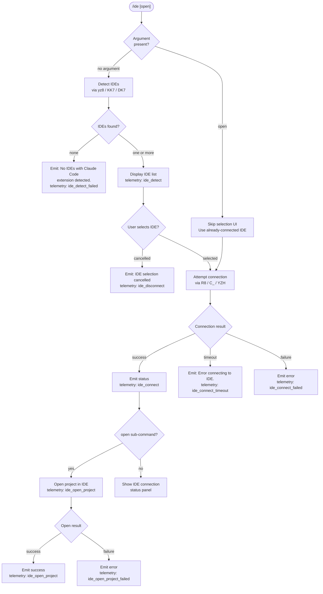

# `/ide`

> Analysis basis: CC v2.1.167 bundle.js (AST extraction + Claude interpretation)
> Minimum version: v2.1.167

---

## Overview

The `/ide` command manages IDE integrations for Claude Code, allowing users to detect connected IDEs, select one for use, open the current project in it, and monitor connection status. When invoked with the optional `open` sub-command argument, it attempts to open the current project directly in the selected IDE; without arguments it presents an interactive status and selection interface for available IDE connections.

---

## Registration

| Field | Value |
|---|---|
| type | `local-jsx` |
| name | `ide` |
| description | `Manage IDE integrations and show status` |
| argumentHint | `[open]` |
| module_id | `mdq` |
| load_inline | `true` |
| loc_byte | `11585433` |
| loc_byte_end | `11585589` |
| loc_line | `7542` |
| arbor_handler.name | `g0f` |
| arbor_handler.fqn | `claude-2.1.167::g0f` |
| arbor_handler.kind | `AsyncFunction` |
| arbor_handler.resolution_path | `module_id` |
| arbor_handler.n_hits | `0` |

Analysis basis: CC v2.1.167 bundle.js:+11585433

---

## Input Branching

The command has four or more distinct execution branches depending on argument presence, IDE detection results, selection outcome, and connection state — a Mermaid flowchart is used.



Analysis basis: CC v2.1.167 bundle.js:+11581549, +11581657, +11581766, +11581904, +11582099, +11582209, +11583652, +11583739, +11583846, +11584815

---

## Behavioral Spec

### Top-Level Handler (`g0f`)

The handler is an `AsyncFunction` resolved via `module_id → mdq` by the Arbor symbol graph.

```
async function ideCommandHandler(args, context):
    emit telemetry("tengu_ext_ide_command")

    subCommand = parseArgument(args)   // "open" or empty

    // Step 1: IDE detection
    detectedIDEs = await detectAvailableIDEs()   // calls yz8 → kz8 → KK7

    if detectedIDEs is empty:
        render("No IDEs with Claude Code extension detected.")
        // telemetry: ide_detect_failed
        return

    // telemetry: ide_detect

    // Step 2: IDE selection (skip if already connected + subCommand=="open")
    if subCommand == "open" AND currentIDE already connected:
        selectedIDE = currentIDE
    else:
        selectedIDE = await presentSelectionUI(detectedIDEs)
        if selectedIDE is null:
            render("IDE selection cancelled")
            // telemetry: ide_disconnect
            return

    // Step 3: Connect
    connectionResult = await connectToIDE(selectedIDE)   // calls R8 → C_ → YZH

    if connectionResult == "timeout":
        render("Error connecting to IDE.")
        // telemetry: ide_connect_timeout
        return
    if connectionResult == "failure":
        render(errorMessage)
        // telemetry: ide_connect_failed
        return

    // telemetry: ide_connect

    // Step 4: Optionally open project
    if subCommand == "open":
        openResult = await openProjectInIDE(selectedIDE)   // calls SH / CH / zR_ → DK7 → tP
        if openResult is success:
            // telemetry: ide_open_project  (worktree or project)
        else:
            render("Exited without opening IDE")
            // telemetry: ide_open_project_failed

    // Step 5: Show status
    renderIDEStatusPanel(selectedIDE)
```

Analysis basis: CC v2.1.167 bundle.js:+11581549, +11581671, +11581695, +11581709, +11581764, +11581937, +11581959, +11582002, +11582023, +11582099

---

### IDE Detection (`yz8` → `kz8` → `KK7`)

Collects candidate IDE processes and socket paths from the host environment.

```
async function detectAvailableIDEs():
    rawPort = parseInt(environmentVariable)
    baseList  = await scanKnownSocketPaths()      // kz8 → KK7
    perPlatform = await Promise.all(
        baseList.map(entry => resolveIDEEntry(entry))  // AK7 → JM_
    )
    filtered = perPlatform.filter(isValidIDE)

    // Platform adjustments
    if platform startsWith "P":               // Windows path normalisation
        filtered = normaliseWindowsPaths(filtered)

    // Process-list scan (Linux)
    filtered += scanProcessList(
        "ps aux | grep -E \"code|cursor|windsurf|devin-desktop|idea|pycharm|...\""
    )                                          // DK7, bundle.js:+5429185

    return filtered
```

Analysis basis: CC v2.1.167 bundle.js:+11581709, +5424460, +5424479, +5424509, +5424523, +5424549, +5424557, +5425180

---

### Known IDE Socket / Path Scanner (`kz8` → `KK7`)

Enumerates well-known IDE socket directories on the host.

```
function scanKnownSocketPaths():
    candidates = []
    homedir = os.homedir()                          // MV9.homedir, bundle.js:+5422330

    // Paths checked (literals found in bundle):
    // – .claude directory              (+5422344)
    // – wsl-specific paths             (+5422389)
    // – /mnt/c/Users subtree           (+5422551)
    // – system IDE socket dirs

    for each path in candidates:
        try:
            stat = fs.stat(path)
            if stat.isDirectory() or stat.isSymbolicLink():
                realpath = fs.realpath(path)        // LV9.realpath, +5423006
                if not seen.has(realpath):
                    seen.add(realpath)
                    results.push(realpath)
        catch ENOENT / EACCES / EPERM / ENOTDIR / ELOOP / EROFS:
            continue                               // V8, bundle.js:+176076

    return results
```

Analysis basis: CC v2.1.167 bundle.js:+5421014, +5422253, +5422330, +5422344, +5422382, +5422408, +5422491, +5422538, +5422551, +5423006, +5423050, +5423068, +5423077

---

### Process-List IDE Scanner (`DK7`)

Used on Linux to find running IDE processes.

```
function scanRunningIDEProcesses():
    output = shell("ps aux | grep -E \"code|cursor|windsurf|...\"\
                    | grep -v grep")
    // bundle.js:+5429185

    entries = parseProcessOutput(output)

    for each entry in entries:
        name = entry.toLowerCase()                 // +5429112
        if name includes known IDE keyword:        // +5429101
            collect IDE record

    // IDE name keywords detected (literals):
    //   windsurf, devin, cursor, insiders, vscode, vs code,
    //   visual studio code, vscodium, code - oss, codium,
    //   appcode, jetbrains, IDE, Devin Desktop
    return collected
```

Analysis basis: CC v2.1.167 bundle.js:+5428263, +5428589, +5428646, +5429101, +5429112, +5429159, +5429185, +5429573

---

### IDE Connection (`R8` → `C_` → `YZH`)

Establishes a connection to the selected IDE over SSE or WebSocket transport.

```
async function connectToIDE(ideEntry):
    // Transport selection (literals in bundle):
    //   "sse-ide"  (+11579536)
    //   "ws-ide"   (+11579556)

    process = spawnIDEProcess(ideEntry)       // C_ → YZH
    // Spawn options: stdio: ["ignore","pipe"], timeout ~200ms (+1095022)
    // Max output: 1 000 000 bytes             (+1095072)
    // Retry count up to 10                   (+1094783)

    result = await waitForConnection(process)

    if result == "timeout":
        return "timeout"
    if result == "error":
        return "failure"

    return "success"
```

Analysis basis: CC v2.1.167 bundle.js:+1095504, +1095615, +1094665, +1094783, +1094946, +1094955, +1095022, +1095072, +11579536, +11579556

---

### Project Open (`zR_` → `DK7` → `tP`)

Opens the current working directory (or worktree) in the connected IDE.

```
async function openProjectInIDE(ideEntry):
    // Determine target: worktree vs project   (+11582136, +11582147)
    targetPath = resolveTargetPath()

    command = buildIDEOpenCommand(ideEntry, targetPath)   // DK7 → tP → YZH
    result  = await executeCommand(command)

    if result.exitCode != 0:
        render("Exited without opening IDE")   // +11582499
        emit telemetry("ide_open_project_failed")
        return failure

    emit telemetry("ide_open_project")
    return success
```

Analysis basis: CC v2.1.167 bundle.js:+11582002, +11582023, +11582099, +11582136, +11582147, +11582163, +11582187, +11582209, +11582499

---

### React UI Component (`udq`)

The command renders a JSX component that drives the interactive selection and status display.

```
function IDECommandComponent(props):
    [selectedIDE, setSelectedIDE] = useState(null)
    appState   = useAppState()          // Y6 → RT_,  +11583455
    ideContext  = useIDEContext()        // KA → RT_,  +11583506
    ref        = useRef()               // +11583513
    effect     = useEffect(...)         // +11583527

    // On mount / IDE list change:
    //   filter available IDEs           // +11583097
    //   auto-select if only one         // u0f, +11583158

    onSelect = useCallback(ide => {
        setSelectedIDE(ide)
        connectToIDE(ide)               // udq → SH / CH
    })

    if connecting:
        render("Connecting to <ide>")   // +11584682

    if connected:
        renderStatusRow(selectedIDE)
        if hasMCPTools:
            // show mcp__ide__* tools   // +11584242
            listMCPIDETools()

    return <IDEStatusPanel ... />
```

Analysis basis: CC v2.1.167 bundle.js:+11583435, +11583455, +11583506, +11583513, +11583527, +11583649, +11583667, +11583722, +11583808, +11583934, +11584095, +11584114, +11584242, +11584335, +11584449, +11584603, +11584682, +11584815, +11584891, +11584910

---

### Truncated IDE Name Display (`B1A`)

When the status panel must display multiple IDE names in a constrained space, names are truncated.

```
function formatIDENameList(names, maxLength):
    // maxLength default: 100            (+11584891)
    // start index: 0                   (+11584910)
    // separator: ", "                  (+11585189)
    // overflow suffix: ", …"           (+11585203)
    // path normalisation: NFC          (+11585032)
    // floor of index: Math.floor       (+11584995)

    normalized = names.map(n => n.normalize("NFC"))
    result = []
    for name in normalized:
        if join(result, ", ").length + name.length <= maxLength:
            result.push(name)
        else:
            result.push("…")
            break
    return result.join(", ")
```

Analysis basis: CC v2.1.167 bundle.js:+11584891, +11584910, +11584927, +11584934, +11584964, +11584995, +11585020, +11585032, +11585041, +11585059, +11585081, +11585107, +11585166, +11585189, +11585203

---

## State & Side Effects

| Item | Detail |
|---|---|
| Telemetry — `tengu_ext_ide_command` | Fired at handler entry (bundle.js:+11581551) |
| Telemetry — `ide_detect` | Fired after successful IDE detection (bundle.js:+5425815) |
| Telemetry — `ide_detect_failed` | Fired when detection returns no IDEs (bundle.js:+5425879) |
| Telemetry — `ide_open_project` | Fired on successful project open; carries `worktree`/`project` dimension (bundle.js:+11582102) |
| Telemetry — `ide_open_project_failed` | Fired when IDE open command fails (bundle.js:+11582209) |
| Telemetry — `ide_connect` | Fired on successful IDE connection (bundle.js:+11583652) |
| Telemetry — `ide_connect_failed` | Fired on connection error (bundle.js:+11583739) |
| Telemetry — `ide_connect_timeout` | Fired on connection timeout (bundle.js:+11583846) |
| Telemetry — `ide_disconnect` | Fired when the user cancels IDE selection (bundle.js:+11584345) |
| Telemetry — `tengu_feature_ok` / `tengu_feature_bad` / `tengu_feature_sad` | Generic feature outcome events emitted via shared feature-reporting path (bundle.js:+1010950, +1011012, +1011093) |
| appState changes | `useAppState` / `useSetAppState` context is read and updated during IDE selection and connection (bundle.js:+11583455, +3853402) |
| MCP tool prefix | Connected IDE exposes tools under the `mcp__ide__` prefix (bundle.js:+11584242) |
| File-system side effects | IDE socket directories are stat-ed and realpath-resolved; no writes during detection |
| Process spawn | A child process is spawned to run the IDE open command (C_ → YZH, bundle.js:+1094665) |
| Transport | SSE (`sse-ide`) and WebSocket (`ws-ide`) connections are managed (bundle.js:+11579536, +11579556) |

---

## Version History

| Version | Change |
|---|---|
| v2.1.167 | Initial analysis |

---

## Common Mistakes

1. **Invoking `/ide open` when no IDE is connected** — the command still requires an IDE to be detectable before it can open a project; it will emit "No IDEs with Claude Code extension detected." rather than silently succeeding.
2. **Expecting `/ide` to install the extension** — the command detects and connects to IDEs that already have the Claude Code extension installed; it does not install the extension for you (the status panel includes a "restart your IDE" hint, bundle.js:+11582767).
3. **Assuming all IDEs are found automatically on WSL** — the scanner explicitly looks under `/mnt/c/Users` (bundle.js:+11582551) but skips system accounts (`Public`, `Default`, `Default User`, `All Users`; bundle.js:+5422645–5422709); paths outside these roots may not be found.
4. **Cancelling the selection prompt and expecting a connection** — cancellation emits `ide_disconnect` and exits without connecting; you must re-invoke the command.
5. **Relying on `mcp__ide__` tools before `/ide` succeeds** — these tools are only registered after a successful connection; using them before that will result in tool-not-found errors.

---

## Appendix — Identifier Mapping

> For bundle debugging only. Identifiers change across versions.

| Identifier | Role |
|---|---|
| `g0f` | Main async handler for `/ide` command (Arbor-resolved entry point) |
| `B1A` | IDE name list formatter / truncation utility |
| `yz8` | Top-level IDE detection orchestrator |
| `kz8` | Socket-path / directory scanner for IDE detection |
| `KK7` | Single IDE candidate resolver (stat, realpath, dedup) |
| `AK7` | Per-entry IDE resolution mapper |
| `JM_` | IDE entry parser / spawner wrapper |
| `DK7` | Process-list IDE scanner (Linux `ps aux` path) |
| `DV9` | IDE name classifier (lowercase includes checks) |
| `hz8` | IDE command basename resolver |
| `K0` | IDE type classifier from process name |
| `wV9` | IDE display name formatter |
| `TV9` | Additional IDE type variant handler |
| `R8` | IDE connection initiator |
| `C_` | Child process spawner for IDE commands |
| `YZH` | Core process-spawn implementation |
| `tP` | IDE open-command builder |
| `zR_` | Project open orchestrator |
| `udq` | JSX React component for IDE command UI |
| `u0f` | Auto-selection helper (single IDE) |
| `Y6` | App-state store selector hook |
| `KA` | IDE context hook |
| `RT_` | Context access guard (throws outside AppStateProvider) |
| `Nf` | IDE context provider hook (useMemo/useSyncExternalStore) |
| `_y` | MCP skills cleanup / hash helper |
| `A16` | MCP tool configuration hash helper |
| `tXH` | MCP tool configuration serialiser / hash function |
| `tN` | MCP skills state updater |
| `GM` | IDE detection or status helper called early in `g0f` |
| `SH` | Shared output / logging helper (feature ok path) |
| `CH` | Shared output / logging helper (feature bad path) |
| `o6` | Output / render utility |
| `J6` | JSX rendering primitive |
| `u6` | Async utility / await wrapper |
| `mc6` | Context store getter |
| `W_` | Warning / informational message emitter |
| `v` | Process stdout writer |
| `onK` | Process output event handler |
| `vPA` | Debug-level log emitter |
| `EUH` | Write-through log flusher |
| `lWA` | Low-level write helper |
| `enK` | Log-file append orchestrator |
| `npH` | Debounced log flush scheduler |
| `YKH` | Log file path resolver |
| `hH` | Error formatting / display helper |
| `AA` | Error string converter |
| `_6` | String coercion utility |
| `V8` | Filesystem error classifier (ENOENT / EISDIR / EACCES etc.) |
| `h8` | Filesystem error swallower |
| `d6` | Directory existence checker |
| `G4` | Path sanitiser / redactor |
| `q0A` | Path component mapper |
| `Iz8` | IDE status display renderer |
| `Vk` | IDE list filter helper |
| `Es` | IDE extension install prompt helper |
| `$V9` | Process kill helper |
| `X49` | Path match utility |
| `Hf9` | Log rotation / directory setup |
| `cl8` | Log file rename / unlink helper |
| `tnK` | Log append with rotation |
| `M0A` | Log file path builder |
| `U76` | Log config reader |
| `j9` | Signal handler registrar |
| `lHH` | Feature flag / capability check |
| `uj_` | Argument parser for IDE sub-commands |
| `uj` | Path replacement utility |
| `H9` | Model / config string parser |
| `m6H` | Model ID resolver |
| `qB` | Model config parser |
| `s9` | Model slug normaliser |
| `Y2` | Model alias resolver |
| `h4H` | Model feature flag check |
| `CI` | Model capability checker |
| `DdH` | Model deprecation checker |
| `bT` | Model tier resolver |
| `cP1` | Model plan resolver |
| `lM` | Provider type resolver |
| `VH8` | Model include-list checker |
| `wdH` | Model extra config resolver |
| `FJ` | Model display name formatter |
| `_G` | Model descriptor builder |
| `b` | Background session handle |
| `cx8` | Memory pressure checker |
| `D6` | Background session dispatcher |
| `dq8` | Dedup / in-flight request tracker |
| `C6` | Session claim handler |
| `QwA` | Session lifecycle manager |
| `mwA` | Claim-frame sender / socket connect |
| `G$A` | Auth file writer |
| `XS6` | Auth directory path builder |
| `D1A` | Auth file path builder |
| `U$5` | Connection retry orchestrator |
| `B$5` | Socket connect helper |
| `p$5` | Claim-frame builder |
| `Tf` | Error type tagger |
| `tX6` | Pin file reader |
| `EZ_` | Pin file path resolver |
| `sT` | Jobs directory path builder |
| `kgL` | Pin directory scanner |
| `e9` | Session state file reader / watcher |
| `VY` | Session state active checker |
| `GN` | Session state normaliser |
| `zf` | Session state file writer |
| `XY` | Atomic file write helper |
| `oj` | Session state file deleter |
| `t16` | Roster file reader / writer |
| `Qg` | Roster parse helper |
| `JWf` | Roster file writer |
| `q$H` | PTY PID path builder |
| `NxH` | PTY path resolver |
| `yE` | PTY PID list reader |
| `gg` | PTY socket path builder |
| `O1A` | PTY directory helper |
| `a16` | PTY socket filename builder |
| `Q` | Process lifecycle manager (retireIfSettled) |
| `b4H` | Output buffer formatter |
| `_6H` | Output buffer slicer |
| `C` | Rate-limit event emitter |
| `R6K` | Rate-limit record builder |
| `k` | Chokidar file watcher |
| `R6` | Timer utility |
| `g` | Transient write debouncer |
| `Y` | Supervisor config updater |
| `m` | Write timeout manager |
| `j` | Worker kill iterator |
| `S` | Worker process handle |
| `W` | Session context holder |
| `i$5` | MCP protocol message handler (main dispatcher) |
| `r$5` | MCP sub-handler |
| `Sz` | Background service error wrapper |
| `BwA` | MCP ack helper |
| `tpK` | MCP dispatch timer |
| `P` | Terminal repaint controller |
| `tHH` | Symlink scan path builder |
| `lx8` | Legacy attach upgrade helper |
| `l$5` | Attach stall detector |
| `n$5` | Session respawn orchestrator |
| `y` | Away-summary generator |
| `n` | MCP server update applier |
| `a` | MCP server list builder |
| `d` | Scheduled task runner |
| `r` | Voice transcription handler |
| `c` | Permission response handler |
| `Ru6` | PTY write-through helper |
| `X5` | Stream end helper |
| `X` | MCP stream reader |
| `J` | Stream join helper |
| `G` | MCP server connector |
| `z46` | MCP server type resolver |
| `b8` | Daemon stop helper |
| `O` | Outer UI shell / spinner |
| `sp` | Graceful shutdown orchestrator |
| `RLH` | Server shutdown caller |
| `pLH` | Shutdown timer canceller |
| `r8` | Timed promise wrapper |
| `z` | Daemon process manager |
| `xh` | Daemon control event emitter |
| `yu` | Daemon socket path resolver |
| `EvH` | Daemon event broadcaster |
| `kP_` | Daemon control request builder |
| `D` | Forced-exit handler |
| `IJ` | Exit code logger |

---

Note: index built via Arbor fallback; some signals (telemetry, literals) may be missing — see arbor-fallback.js.