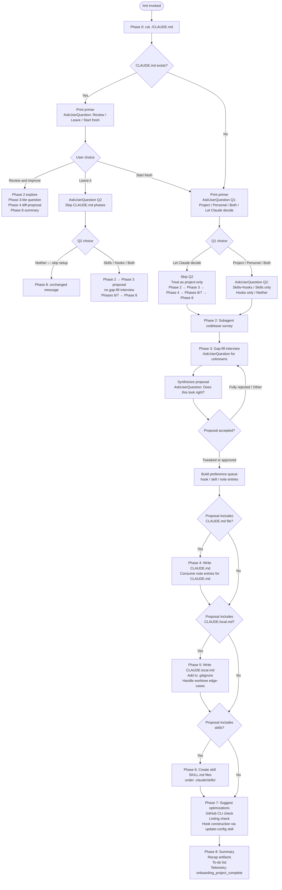

# `/init`

> Analysis basis: CC v2.1.167 bundle.js (AST extraction + Claude interpretation)
> Minimum version: v2.1.167

---

## Overview

`/init` is a guided, multi-phase onboarding command that bootstraps Claude Code configuration for a repository. It interviews the user, surveys the codebase via a subagent, and then writes one or more of: a project-level `CLAUDE.md`, a personal `CLAUDE.local.md`, skill definitions under `.claude/skills/`, and hooks in `.claude/settings.json` or `.claude/settings.local.json`. The command uses a branching question-and-answer flow (via `AskUserQuestion`) to tailor every artifact to the specific repository and user preferences, and emits an `onboarding_project_complete` telemetry event on success.

---

## Registration

| Field | Value |
|---|---|
| type | `prompt` |
| name | `init` |
| description | `Initialize new CLAUDE.md file(s) and optional skills/hooks with codebase documentation \| Initialize a new CLAUDE.md file with codebase documentation` |
| loc_byte | `11608772` |
| loc_byte_end | `11609165` |
| loc_line | `7784` |
| handler_method | `getPromptForCommand` |
| handler_method_start | `11609088` |
| handler_method_end | `11609164` |
| prompt_body.length | `22519` characters |
| prompt_body.trace | `conditional; identifier→l0f (var template, 20920 chars); identifier→c0f (var template, 1592 chars)` |
| arbor_handler.name | `getPromptForCommand` |
| arbor_handler.kind | `Method` |
| arbor_handler.resolution_path | `direct` |
| arbor_handler.fqn | `claude-2.1.167::getPromptForCommand` |
| arbor_handler.n_hits | `2` |

Analysis basis: CC v2.1.167 bundle.js:+11608772

---

## Input Branching

The command has six or more distinct routing paths determined by user responses to `AskUserQuestion` calls across multiple phases (existing-file detection, file-scope choice, skills/hooks choice, and the "Review/Leave/Start fresh" tri-branch). A Mermaid flowchart is mandatory here.



Analysis basis: CC v2.1.167 bundle.js:+11609088 (handler method), +4031423 (telemetry event)

---

## Behavioral Spec

### Phase 0 — Detect Existing CLAUDE.md

Before displaying any text, the agent runs `cat ./CLAUDE.md` at the project root. Only the project-root file counts; the directory tree is not yet explored. The result of this probe gates all of Phase 1's question routing.

```
function detectExistingClaudeMd():
    result = readFile("./CLAUDE.md")
    if result is ENOENT or empty:
        return NOT_FOUND
    else:
        return FOUND
```

Analysis basis: CC v2.1.167 bundle.js:+11609088

### Phase 1 — Primer and Question Flow

The agent always prints a plain-text primer explaining CLAUDE.md, Skills, and Hooks before asking any question. Questions are delivered one at a time via `AskUserQuestion`; Q2 is never included in the same call as Q1.

```
function askSetupScope(claudeMdStatus):
    printPrimer()           // explains CLAUDE.md, Skills, Hooks concepts

    if claudeMdStatus == FOUND:
        choice = AskUserQuestion("I found an existing CLAUDE.md. What would you like to do?",
                                  options=["Review and improve it",
                                           "Leave it, set up other things",
                                           "Start fresh (replace it)"])
        route choice:
            "Review and improve it" → return REVIEW_IMPROVE
            "Leave it, set up other things" → return LEAVE_IT
            "Start fresh (replace it)" → continue as NOT_FOUND

    // NOT_FOUND path (or Start fresh)
    q1 = AskUserQuestion("Which CLAUDE.md files should /init set up?",
                          options=["Project CLAUDE.md",
                                   "Personal CLAUDE.local.md",
                                   "Both project + personal",
                                   "Let Claude decide"])
    if q1 == "Let Claude decide":
        return scope(files=["project"], skipQ2=true)

    q2 = AskUserQuestion("Also set up skills and hooks?",
                          options=["Skills + hooks", "Skills only",
                                   "Hooks only", "Neither, just CLAUDE.md"])
    return scope(files=q1, extras=q2)
```

Analysis basis: CC v2.1.167 bundle.js:+11609088

### Phase 2 — Codebase Survey (Subagent)

A subagent is launched to read manifest files, README, CI config, and any existing AI-tool config files. The subagent also runs `git worktree list` when a personal file is in scope. Detection targets include build/test/lint commands, languages, frameworks, package manager, project structure, formatter config, and existing `.claude/skills/` and `.claude/rules/` directories. Items that cannot be inferred from code alone become interview questions in Phase 3.

```
function surveyCodebase(scope):
    agent = launchSubagent()
    agent.read(manifestFiles)       // package.json, Cargo.toml, pyproject.toml, go.mod, pom.xml, etc.
    agent.read(readmeAndBuildConfigs)
    agent.read(ciConfigs)
    agent.read(existingAiToolConfigs)   // AGENTS.md, .cursor/rules, .cursorrules,
                                        // .github/copilot-instructions.md,
                                        // .devin/rules/, .windsurf/rules/, .clinerules, .mcp.json
    if scope.includesPersonal:
        agent.run("git worktree list")

    findings = agent.collect()
    gaps = detectUnresolvableItems(findings)
    return (findings, gaps)
```

Analysis basis: CC v2.1.167 bundle.js:+11609088

### Phase 3 — Gap-Fill Interview and Proposal

`AskUserQuestion` is used only for items the code cannot answer. The agent then synthesizes a proposal listing each artifact (file, hook, skill, note) with a one-line description. The proposal is printed as normal assistant text and then confirmed with a single `AskUserQuestion` ("Does this look right?"). After confirmation, a preference queue is built with entries of the form `{type, description, targetFile, phase2Details}`.

For the "Review and improve" path, only one question is asked ("Has anything changed…?") and the proposal is a diff against the existing file rather than a fresh outline.

```
function gapFillAndPropose(scope, findings, gaps):
    if scope == REVIEW_IMPROVE:
        change = AskUserQuestion("Has anything changed about how the team works?",
                                  options=["No, nothing's changed", "Yes — let me describe"])
        if change == "Yes":
            details = AskUserQuestion(freeText=true)
        proposal = buildDiffProposal(existingFile, findings, details)
    else:
        answers = conductGapFillInterview(scope, gaps)   // only unanswerable-from-code questions
        proposal = synthesizeProposal(scope, findings, answers)
        // note: deviations from Q2 hint are acknowledged at the top of the proposal

    printProposal(proposal)
    confirmation = AskUserQuestion("Does this look right?",
                                    options=["Looks good — proceed",
                                             "Drop the hook", "Drop the skill", ...])
    return buildPreferenceQueue(proposal, confirmation)
```

Analysis basis: CC v2.1.167 bundle.js:+11609088

### Phase 4 — Write CLAUDE.md

The agent writes (or diffs) `./CLAUDE.md`. Every candidate line is evaluated against: "Would removing this cause Claude to make mistakes?" Lines that fail the test are omitted. Note-type entries from the preference queue whose target is `CLAUDE.md` are consumed here. The file is always prefixed with the canonical header (`# CLAUDE.md` + one-line purpose sentence). For "Review and improve" the agent proposes diffs and calls `AskUserQuestion` for approval before writing.

```
function writeClaudeMd(scope, findings, preferenceQueue):
    if scope == REVIEW_IMPROVE:
        diffs = computeDiffs(existingFile, findings, queueNotes)
        printDiffs(diffs)
        approval = AskUserQuestion("Apply these edits?",
                                    options=["Apply all", "Let me pick which", "Skip"])
        if approval == "Apply all":
            applyAll(diffs)
        else if approval == "Let me pick which":
            applySelected(diffs)
        return

    content = buildClaudeMd(findings, preferenceQueue.notesFor("CLAUDE.md"))
    // content includes: non-standard commands, differing style rules, testing quirks,
    //                   repo etiquette, required env vars, non-obvious gotchas,
    //                   important sections from existing AI-tool configs
    // content excludes: file structure lists, standard conventions, generic advice,
    //                   frequently-changing info (use @path/to/import instead),
    //                   commands obvious from manifest files
    writeFile("./CLAUDE.md", canonicalHeader + content)
```

Analysis basis: CC v2.1.167 bundle.js:+11609088; literal `"CLAUDE.md"` at +4030911

### Phase 5 — Write CLAUDE.local.md

If the approved proposal includes a personal file, the agent writes `./CLAUDE.local.md` and appends the filename to `.gitignore`. Personal notes from the preference queue are consumed here. If Phase 2 found sibling/external worktrees, the actual personal content is written to `~/.claude/<project-name>-instructions.md` and `CLAUDE.local.md` becomes a one-line import stub. Nested worktrees need no special handling.

```
function writeClaudeLocalMd(scope, findings, preferenceQueue):
    if existsFile("./CLAUDE.local.md"):
        existingContent = readFile("./CLAUDE.local.md")
        proposeAdditions(existingContent, preferenceQueue.notesFor("CLAUDE.local.md"))
        return  // never silently overwrite

    worktreeStyle = findings.worktreeStyle   // "nested" | "sibling_external" | null
    if worktreeStyle == "sibling_external":
        targetPath = "~/.claude/<project-name>-instructions.md"
        writeFile(targetPath, buildPersonalContent(preferenceQueue))
        stubContent = "@" + targetPath
        writeFile("./CLAUDE.local.md", stubContent)
    else:
        writeFile("./CLAUDE.local.md", buildPersonalContent(preferenceQueue))

    appendToGitignore("CLAUDE.local.md")
```

Analysis basis: CC v2.1.167 bundle.js:+11609088

### Phase 6 — Create Skills

Skill entries from the preference queue are processed first; each becomes a `.claude/skills/<name>/SKILL.md` file with YAML frontmatter. After the queue is exhausted the agent also suggests additional skills for repeatable workflows found during codebase survey. Existing skills are reviewed but never overwritten. Skills with side effects receive `disable-model-invocation: true`.

```
function createSkills(preferenceQueue, findings):
    existingSkills = listDirectory(".claude/skills/")

    for skillPref in preferenceQueue.skillEntries():
        if skillPref.name in existingSkills:
            continueWithAdditive(skillPref)   // annotate, don't overwrite
        else:
            content = buildSkillMd(skillPref, findings)
            writeFile(".claude/skills/" + skillPref.name + "/SKILL.md", content)

    suggestedSkills = deriveAdditionalSkills(findings)
    for suggested in suggestedSkills:
        if suggested.name not in existingSkills:
            presentSuggestion(suggested)
```

Analysis basis: CC v2.1.167 bundle.js:+11609088

### Phase 7 — Additional Optimizations (GitHub CLI, Linting, Hooks)

The agent checks for GitHub CLI (`which gh` / `where gh`) and lint configuration, then asks about each gap. Hook entries from the preference queue are processed here. Before constructing any hook, the agent invokes the `update-config` skill once with `[hooks-only]` prefix args to load the hooks schema into context.

```
function suggestOptimizations(scope, findings, preferenceQueue):
    if not exists("gh") and findings.usesGitHub:
        AskUserQuestion("Install GitHub CLI?", ...)

    if not findings.hasLintConfig:
        AskUserQuestion("Set up linting?", ...)

    hookEntries = preferenceQueue.hookEntries()
    if hookEntries is empty and findings.formatter is not null:
        hookEntries += formatOnEditFallback(findings.formatter)

    if hookEntries is not empty:
        targetFile = resolveHookTargetFile(scope)
        // project → .claude/settings.json
        // personal → .claude/settings.local.json
        // both/ambiguous → ask once for all hooks

        invokeSkill("update-config", args="[hooks-only] " + buildSummary(hookEntries))  // once per /init run

        for hookPref in hookEntries:
            event, matcher = mapPreferenceToEvent(hookPref)
            // "after every edit" → PostToolUse / Write|Edit
            // "when Claude finishes" → Stop
            // "before running bash" → PreToolUse / Bash
            // "before committing" → redirect to git pre-commit hook, not hooks.json
            constructHook(hookPref, event, matcher, targetFile)
            // flow: dedup → construct → pipe-test → wrap → write JSON → jq validate → live-proof → cleanup
```

Analysis basis: CC v2.1.167 bundle.js:+11609088

### Phase 8 — Summary and Telemetry

After all artifacts are written, the agent recaps the session and presents a to-do list. The `onboarding_project_complete` telemetry event is fired. A `workspace`-type check is also present in the call graph related to empty-workspace detection (literal `"workspace"` and `"Ask Claude to create a new app or clone a repository"` at +4030949, +4030966; and `"Run /init to create a CLAUDE.md file with instructions for Claude"` at +4031086).

```
function summarizeAndComplete(artifacts):
    printSummary(artifacts)
    printTodoList(deriveTodos(artifacts, findings))
    emit("onboarding_project_complete")   // telemetry
```

Analysis basis: CC v2.1.167 bundle.js:+4031423 (`"onboarding_project_complete"`), +4031086

### Prompt Body Composition

The handler (`getPromptForCommand`) resolves the prompt body conditionally. The primary template (`l0f`, 20 920 characters) covers the full eight-phase interactive flow. A shorter fallback template (`c0f`, 1 592 characters) covers the legacy "analyze and create CLAUDE.md" path (the tail section present in the extracted body starting with "Please analyze this codebase…"). The full composed length is 22 519 characters.

```
function getPromptForCommand(context):
    if useExtendedFlow(context):
        return templateL0f   // 20920 chars — full 8-phase interactive init
    else:
        return templateC0f   // 1592 chars — legacy direct-create path
```

Analysis basis: CC v2.1.167 bundle.js:+11609094 (handler callGraph entry), +11609148

### Config Write Safety

The call graph reveals a config-write subsystem reachable from the handler. It enforces a file lock with a 60 000 ms timeout (literal at +3266157), keeps up to 5 backup files (literal at +3266406) under a `backups/` subdirectory (literal at +3266988), uses atomic rename via a `.backup.`-prefixed temp file (literal at +3266273), and refuses to write if a re-read of the config is missing authentication data that the cache holds — preventing credential loss (literals at +3265803, +3269421). Lock acquisition exceeding 100 ms triggers a warning (literal at +3265381).

```
function saveConfigWithLock(config):
    acquired = acquireLock(timeoutMs=60000)
    if lockTookLongerThanExpected(threshold=100):
        warn("Lock acquisition took longer than expected...")

    reRead = readConfigFromDisk()
    if reRead is missing auth and cache has auth:
        // safety guard — refuse write to avoid wiping credentials
        log("saveConfigWithLock: re-read config is missing auth...")
        return ERROR

    backupExisting(maxBackups=5, namingPattern=".backup.<timestamp>")
    writeAtomically(config, tempSuffix=".backup." + randomHex(6))
    emit("tengu_config_stale_write")   // if stale condition detected
```

Analysis basis: CC v2.1.167 bundle.js:+3266157, +3266406, +3266273, +3265381, +3265803

---

## State & Side Effects

| Item | Detail |
|---|---|
| Telemetry: `tengu_config_parse_error` | Fired when the on-disk config JSON cannot be parsed (bundle.js:+3268051) |
| Telemetry: `tengu_config_lock_contention` | Fired when the config file lock is contended (bundle.js:+3265476) |
| Telemetry: `tengu_config_stale_write` | Fired when a stale-write safety condition is detected during config save (bundle.js:+3265612) |
| Telemetry: `tengu_config_auth_loss_prevented` | Fired when a write is aborted to prevent credential loss (bundle.js:+3265955) |
| Telemetry: `tengu_feature_sad` / `tengu_feature_ok` | Feature-flag probe result events (bundle.js:+1011093, +1010950) |
| Telemetry: `tengu_slate_harbor_experiment` | A/B experiment event fired during handler dispatch (bundle.js:+11585663) |
| Telemetry: `onboarding_project_complete` | Fired at the end of a successful `/init` run (bundle.js:+4031423) |
| File writes | `./CLAUDE.md`, `./CLAUDE.local.md`, `.claude/skills/<name>/SKILL.md`, `.claude/settings.json` or `.claude/settings.local.json`, `.gitignore` (append), optionally `~/.claude/<project-name>-instructions.md` |
| Config backup | Up to 5 timestamped backup files written to the `backups/` subdirectory alongside the config (bundle.js:+3266406, +3266988) |
| Hook registration | Hooks written to `.claude/settings.json` (project) or `.claude/settings.local.json` (personal) depending on Phase 1 file scope |
| Lock file | File lock acquired during config write; warns if contention exceeds 100 ms (bundle.js:+3265381) |
| Workspace onboarding hint | Literals at +4031086 (`"Run /init to create a CLAUDE.md file with instructions for Claude"`) and +4030966 (`"Ask Claude to create a new app or clone a repository"`) suggest `/init` is surfaced as the primary onboarding action in an empty workspace |
| A/B experiment | `growthbook_experiment` event (bundle.js:+3237923) may influence prompt template selection (`l0f` vs `c0f`) |

---

## Version History

| Version | Change |
|---|---|
| v2.1.167 | Initial analysis; full 8-phase interactive flow with subagent codebase survey, skills/hooks creation, and config write safety guards |

---

## Common Mistakes

1. **Skipping Q2 when not using "Let Claude decide"**: Q2 must be asked as a separate `AskUserQuestion` call after Q1 is answered. Merging them into a single call violates the stated sequencing rule.
2. **Treating Q2 as a hard filter**: Q2 is a hint only. If the codebase evidence does not support the user's Q2 choice (e.g., "Hooks only" but no formatter exists), the agent should still propose what fits and note the deviation at the top of the proposal.
3. **Silently overwriting `CLAUDE.local.md`**: If the file already exists the agent must read it, propose specific additions, and wait for confirmation — never overwrite without showing a diff.
4. **Putting the `@~/.claude/` import in project CLAUDE.md**: This reference is personal; it belongs only in `CLAUDE.local.md` to avoid checking personal paths into the shared file.
5. **Invoking the `update-config` skill once per hook instead of once per `/init` run**: The skill must be called exactly once before the first hook construction to load the schema; subsequent hooks reuse the already-loaded context.
6. **Writing bloated CLAUDE.md content**: Every line must pass the test "Would removing this cause Claude to make mistakes?" Generic advice, file structure lists, standard conventions, and commands obvious from manifest files must all be excluded.
7. **Constructing a hooks.json hook for git-commit gating**: Bash matchers cannot filter by command content. A "before committing" preference must be routed to a git pre-commit hook (or husky), not to `hooks.json`.

---

## Appendix — Identifier Mapping

> For bundle debugging only. Identifiers change across versions.

| Identifier | Role |
|---|---|
| `__handler_init` | Synthetic BFS entry point for the `/init` command handler |
| `BiH` | Onboarding/init orchestrator function called by the handler |
| `qz` | File-watch or config-reload utility called from the orchestrator |
| `C6` | Config read/watch setup function |
| `d6` | Low-level config path resolver |
| `lP_` | Config lock/permission helper |
| `LwH` | Config file reader (reads UTF-8, handles ENOENT/EEXIST) |
| `IVL` | File-watch registration function (uses `HK8.watchFile` / `HK8.unwatchFile`) |
| `c49` | CLAUDE.md existence check helper |
| `ZE_` | Project-root CLAUDE.md locator (joins path + literal `"CLAUDE.md"`) |
| `u6` | Workspace-type resolver |
| `_l6` | Module/feature flag loader |
| `TY` | Config write + CLAUDE.md write coordinator |
| `aP_` | Atomic config save function (lock, backup, write, validate) |
| `_` | Generic utility / string helper |
| `L` | Async resource/lock manager (add/delete/finally) |
| `S21` | Config object merge helper (uses `Object.assign`) |
| `v` | Logging utility (debug-level, dispatches to `NUH`/`onK`/`RH`/`EUH`/`enK`) |
| `l` | Feature-flag evaluator |
| `V8` | JSON parse helper with error recovery |
| `oj6` | Auth-presence check on config object |
| `A` | Case-normalizer (toLowerCase) |
| `RH` | JSON serializer wrapper (`JSON.stringify`) |
| `sP_` | Backup-directory path builder (joins `backups/` prefix) |
| `V` | String startsWith check target |
| `P` | Text-input / prompt widget handler |
| `E` | Backup file list / array slice target |
| `$$6` | Atomic file write helper (random temp name, fchmod, fsync, rename, unlink) |
| `f` | Session/connection close helper |
| `H` | Bootstrap fetch handler (fetches remote config/data with `Content-Type`, `User-Agent` headers) |
| `Y3` | Response body parser used by bootstrap fetch |
| `uj_` | String split/trim/index/slice utility |
| `lHH` | Feature-flag set membership check |
| `uj` | String replace utility |
| `H9` | Fetch response processor |
| `o6` | Feature-flag evaluation with `tengu_feature_ok`/`tengu_feature_sad` reporting |
| `QlH` | Config write pre-check utility |
| `AK8` | Timestamp generator (`Date.now`) wrapper |
| `oP_` | Project-scoped config save function (auth-loss guard, atomic write) |
| `SH` | Session feature-flag setup with `tengu_feature_ok`/`tengu_feature_sad` |
| `J6` | Feature-flag result dispatcher |
| `ym6` | Base feature-flag registry |
| `d0f` | Experiment/A-B dispatch function (`tengu_slate_harbor_experiment`) |
| `_6` | String coercion helper |
| `D6` | Command registration executor (registers prompt, reads cache, fires `dq8`) |
| `dj6` | Command registry lookup |
| `cj6` | Command deduplication check |
| `hu` | Config initializer wrapper |
| `yu` | Base config loader |
| `dq8` | Command-cache hydration function |
| `yP_` | Session/experiment event emitter (`GrowthbookExperimentEvent`, `growthbook_experiment`) |
| `xP_` | Prompt token pre-loader |
| `getPromptForCommand` | Inline ObjectMethod on the registration object; resolves and returns the prompt body (primary vs. legacy template) |