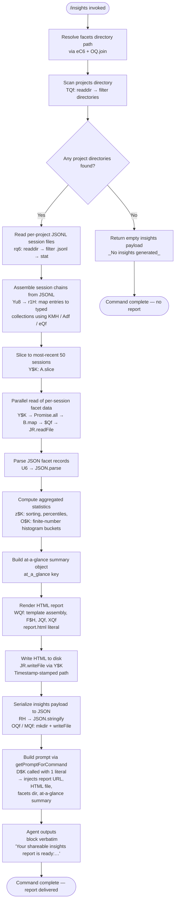

# `/insights`

> Analysis basis: CC v2.1.167 bundle.js (AST extraction + Claude interpretation)
> Minimum version: v2.1.167

---

## Overview

`/insights` generates a self-contained HTML report that analyses the user's Claude Code session history. The command collects session-level JSONL data from a local facets directory, processes and aggregates it into a rich insights payload, renders an HTML file, and then instructs the agent to deliver exactly one pre-composed message confirming that the shareable report is ready.

---

## Registration

| Field | Value |
|---|---|
| type | `prompt` |
| name | `insights` |
| description | `Generate a report analyzing your Claude Code sessions` |
| loc_byte | `13186395` |
| loc_byte_end | `13187699` |
| loc_line | `10611` |
| handler_method | `getPromptForCommand` |
| handler_method_start | `13186569` |
| handler_method_end | `13187698` |
| prompt_body.length | `513` |
| prompt_body.trace | `call→D$K(...) (1 literals)` |
| arbor_handler.name | `getPromptForCommand` |
| arbor_handler.fqn | `claude-2.1.167::getPromptForCommand` |
| arbor_handler.kind | `Method` |
| arbor_handler.resolution_path | `direct` |
| arbor_handler.n_hits | `1` |

Analysis basis: CC v2.1.167 bundle.js:+13186395

---

## Input Branching

The command has several distinct data-collection and rendering branches that combine to produce the final report. Five or more separable paths are identifiable in the call graph (session scanning, facet file reading, session chain assembly, report data aggregation, HTML rendering, and file write). A Mermaid flowchart is used.



---

## Behavioral Spec

### 1. Handler Entry Point — `getPromptForCommand`

The registration object carries `handler_method: "getPromptForCommand"`, which Arbor resolves directly within the registration byte range (resolution_path: `direct`). The synthetic call-graph entry `__handler_insights` is BFS bookkeeping; the real bundle symbol is `getPromptForCommand`.

```
async function getPromptForCommand(context):
    insightsPayload = await collectInsightsData(context)
    promptText     = buildPrompt(insightsPayload)   // D$K with 1 string literal
    return { role: "user", content: promptText }
```

Analysis basis: CC v2.1.167 bundle.js:+13186569

---

### 2. Session Discovery — `collectSessionDirectories` (TQf)

Reads the `projects` sub-directory (string literal at bundle.js:+6745623) within the configured data root, filters for entries where `K.isDirectory` is true, and returns a sorted list.

```
async function collectSessionDirectories(dataRoot):
    baseDir  = pathJoin(dataRoot, "projects")    // literal "projects" +6745623
    entries  = await fs.readdir(baseDir)
    dirs     = entries.filter(e => e.isDirectory())
    dirs.sort()
    // uses setImmediate for cooperative scheduling between batches
    // batch constants: 10 entries per tick (+13173209), retry limit 9 (+13173214)
    return dirs
```

Analysis basis: CC v2.1.167 bundle.js:+13172940

Limits observed:
- Batch size per `setImmediate` tick: **10** (bundle.js:+13173209)
- Inner retry ceiling: **9** (bundle.js:+13173214)
- Maximum sessions sliced for processing: **50** (bundle.js:+13173351) / soft cap **200** (bundle.js:+13173356)

---

### 3. JSONL File Enumeration — `enumerateFacetFiles` (rq6)

For each project directory, reads the directory, keeps only files whose names pass the `.jsonl` suffix test (string literal at bundle.js:+13259848), retrieves `fs.stat` metadata for each, and accumulates file records.

```
async function enumerateFacetFiles(projectDir):
    files   = await fs.readdir(projectDir)
    jsonls  = files.filter(f => f.isFile() && hasJsonlSuffix(f))
    records = await Promise.all(
        jsonls.map(async name =>
            stat = await fs.stat(join(projectDir, name))
            return { name: basename(name), stat }
        )
    )
    return records
```

Analysis basis: CC v2.1.167 bundle.js:+13259742

---

### 4. Session Chain Assembly — `assembleSessionState` (Yu8 + r1H)

Processes raw JSONL entries into typed session-state maps. Uses a large set of Map/Set collections keyed by typed metadata strings including:
`"summary"`, `"last-prompt"`, `"custom-title"`, `"ai-title"`, `"tag"`, `"agent-name"`, `"agent-color"`, `"agent-setting"`, `"mode"`, `"permission-mode"`, `"isolation-latch"`, `"worktree-state"`, `"pr-link"`, `"bridge-session"`, `"file-history-snapshot"`, `"attribution-snapshot"`, `"content-replacement"`, `"fork-context-ref"`, `"marble-origami-commit"`, `"marble-origami-snapshot"`, `"marble-origami-reset"`.

```
function assembleSessionState(rawEntries):
    state = new MultiMap()
    for entry in rawEntries:
        switch entry.type:
            case "summary":             state.summary.set(...)
            case "last-prompt":         state.lastPrompt.set(...)
            case "custom-title":        state.customTitle.set(...)
            case "ai-title":            state.aiTitle.set(...)
            case "tag":                 state.tags.set(...)
            case "attribution-snapshot":state.attribution.set(...)
            // ... (further typed keys as above)
    chainCycles = detectParentCycles(state)   // KMH guard → hH on cycle
    return state
```

Telemetry fired on anomalies: `tengu_transcript_parent_cycle` (bundle.js:+13249135), `tengu_chain_parent_cycle` (bundle.js:+13226824), `tengu_chain_timestamp_fallback` (bundle.js:+13226973), `tengu_chain_parallel_tr_recovered` (bundle.js:+13228839).

Analysis basis: CC v2.1.167 bundle.js:+13260492

---

### 5. Per-Session Facet Read — `readSessionFacet` ($Qf)

Reads a single session's facet JSON file from the `usage-data` sub-directory (literal at bundle.js:+13112284) and parses it. Falls back through `B5A` → `eC6` path resolution for `session-meta` (literal at bundle.js:+13112380).

```
async function readSessionFacet(sessionId, dataRoot):
    facetPath = join(dataRoot, "usage-data", sessionId + ".json")
    raw       = await fs.readFile(facetPath, "utf-8")   // literal +13118415
    return safeJsonParse(raw)   // U6 → JSON.parse +186041
```

Analysis basis: CC v2.1.167 bundle.js:+13118348

---

### 6. Statistics Aggregation — `aggregateInsightsData` (z$K + O$K)

Aggregates per-session data into cross-session metrics. Produces histograms, percentiles, and ranked lists.

```
function aggregateInsightsData(sessions):
    // Response-time histogram buckets (literals):
    // "2-10s", "10-30s", "30s-1m", "1-2m", "2-5m", "5-15m", ">15m"
    // Time-of-day buckets:
    // "Morning (6-12)", "Afternoon (12-18)", "Evening (18-24)", "Night (0-6)"

    timeBuckets  = buildHistogram(sessions, responseTimeBoundaries)
    todBuckets   = buildTimeOfDayHistogram(sessions)
    percentiles  = computePercentiles(sessions.durations)  // Math.floor +13124122
    topErrors    = rankToolErrors(sessions)                 // K.reduce +13124169
    atAGlance    = buildAtAGlance(sessions)                 // key "at_a_glance" +13126529

    // Maximum session count in rolling window: 1,800,000 ms (30 min) +13120757
    // Warmup minimal flag: "warmup_minimal" +13175147
    // None-captured sentinel: "None captured" +13125863
    return { timeBuckets, todBuckets, percentiles, topErrors, atAGlance }
```

Analysis basis: CC v2.1.167 bundle.js:+13122120

---

### 7. HTML Report Rendering — `renderReportHtml` (WQf)

Builds the self-contained HTML report string. Uses inline string assembly with HTML-entity escaping (`K5` / `F7`), chart primitives (`F$H`, `JQf`, `XQf`), and section templates (`PQf`, `WQf`).

```
function renderReportHtml(aggregated):
    html = buildShell(aggregated)        // escapes &amp; &lt; &gt; &quot; &apos;
    html += renderToolErrorSection(aggregated.topErrors,
                colors=["#dc2626","#16a34a","#eab308"])    // +13170883
    html += renderTimeSection(aggregated.timeBuckets,
                colors=["#2563eb","#0891b2","#10b981","#8b5cf6"]) // +13167167…
    html += renderTimeOfDaySection(aggregated.todBuckets)
    if aggregated.topErrors.length == 0:
        html += "<p class=\"empty\">No tool errors</p>"    // +13170894
    // "Add to CLAUDE.md" suggestion links included         // +13134846
    html += buildResponseTimeChart(aggregated)             // JQf: Math.max, Object.values
    return html
```

Output filename: `report.html` (literal bundle.js:+13175589)
Maximum HTML string length passed to rendering helpers: **8192** characters (bundle.js:+13128671)

Analysis basis: CC v2.1.167 bundle.js:+13131136

---

### 8. File Write and Path Stamping — `writeInsightsArtifacts` (Y$K tail + OQf / MQf)

Writes both the HTML report and the serialized JSON insights object to disk, creating directories as needed. The HTML filename embeds a timestamp derived from `Date` components (year, month, date, hours, minutes, seconds).

```
async function writeInsightsArtifacts(html, insights, dataRoot):
    now       = new Date()
    timestamp = padComponents(now.getFullYear(), now.getMonth()+1,
                               now.getDate(), now.getHours(),
                               now.getMinutes(), now.getSeconds())
    reportDir = join(dataRoot, "facets")                // literal "facets" +13112334
    await fs.mkdir(reportDir, { recursive: true })
    htmlPath  = join(reportDir, "report.html")          // literal +13175589
    await fs.writeFile(htmlPath, html)

    insightsDir = join(dataRoot, "usage-data")
    await fs.mkdir(insightsDir, { recursive: true })
    await fs.writeFile(
        join(insightsDir, "insights.json"),             // literal "insights" +13120124
        JSON.stringify(insights)
    )
    return { htmlPath, reportUrl: fileUrl(htmlPath), facetsDir: reportDir }
```

Analysis basis: CC v2.1.167 bundle.js:+13175330

---

### 9. Prompt Construction — `buildInsightsPrompt` (D$K)

Called from within `getPromptForCommand` with one string literal argument. Injects the full insights data blob, report URL, HTML file path, facets directory path, and at-a-glance summary into the prompt template.

```
function buildInsightsPrompt(insightsPayload, paths):
    // Template structure (from prompt_body, length 513):
    // 1. Context line: user ran /insights
    // 2. Full insights data block (serialized)
    // 3. Report URL
    // 4. HTML file path
    // 5. Facets directory path
    // 6. At-a-glance summary (agent-only, user has not seen output)
    // 7. Instruction: output <message>…</message> verbatim, no omissions
    // 8. The <message> block itself:
    //    "Your shareable insights report is ready: …
    //     Want to dig into any section or try one of the suggestions?"
    if insightsPayload is empty:
        substituteMarker = "_No insights generated_"   // literal +13187466
    return templateString
```

The agent is instructed to output the `<message>` block **verbatim** as its entire response. The separator ` · ` (literal bundle.js:+13187027) appears in the at-a-glance display portion.

Analysis basis: CC v2.1.167 bundle.js:+13187601

---

## State & Side Effects

| Item | Detail |
|---|---|
| Telemetry (direct path) | No `tengu_*` events are fired by the insights command's own execution path. Events in the call graph belong to MCP, daemon, voice, and transcript subsystems reached via shared utilities. |
| Telemetry (reachable utilities) | `tengu_transcript_parent_cycle` (+13249135), `tengu_chain_parent_cycle` (+13226824), `tengu_chain_timestamp_fallback` (+13226973), `tengu_chain_parallel_tr_recovered` (+13228839), `tengu_transcript_phantom_parent` (+13245333), `tengu_relink_walk_broken` (+13225051) — all from session-chain anomaly guards |
| File writes | `report.html` written to `<dataRoot>/facets/` directory; `insights.json` written to `<dataRoot>/usage-data/`; parent directories created recursively |
| File reads | Per-project JSONL session files under `<dataRoot>/projects/*/`; per-session facet JSON under `<dataRoot>/usage-data/` |
| appState changes | None observed at depth ≤ 2 within the insights-specific path |
| Sound | None observed |
| Hook registration | None observed |
| Agent output constraint | The prompt instructs the agent to emit the `<message>` block verbatim and in full — no deviation, no omissions |

---

## Version History

| Version | Change |
|---|---|
| v2.1.167 | Initial analysis |

---

## Common Mistakes

1. **Running `/insights` in a fresh environment with no session history** — the command requires populated JSONL files under the `projects/` directory. If none exist, the agent receives `_No insights generated_` as the data payload and will report no report was produced.
2. **Expecting interactive output before the report file is written** — the HTML report is written to disk first; only then does the agent respond. Do not interrupt the command mid-execution.
3. **Assuming the report URL is a remote URL** — the report URL injected into the prompt is a local `file://` path pointing to `report.html` inside the facets directory.
4. **Expecting the agent to summarize or reformat the report** — the prompt instructs the agent to output the pre-composed `<message>` block verbatim. The agent will not add commentary or reword the response.
5. **Stale facets directory** — the `facets/` subdirectory path is derived from the configured data root; if the data root differs between invocations (e.g. environment variable change), old reports will not be visible from the new path.

---

## Appendix — Identifier Mapping

> For bundle debugging only. Identifiers change across versions.

| Identifier | Role |
|---|---|
| `__handler_insights` | Synthetic BFS entry for the insights command handler (not a real bundle symbol; prefer `getPromptForCommand`) |
| `Y$K` | Main insights orchestrator — drives the full data collection, aggregation, render, and write pipeline |
| `TQf` | Session directory scanner (`readdir` + `isDirectory` filter, cooperative batching via `setImmediate`) |
| `Ql` | Path joiner for the `projects` subdirectory |
| `rq6` | JSONL file enumerator per project directory (`readdir` + `.jsonl` filter + `stat`) |
| `BF` | JSONL suffix test helper (`Rj7.test`) |
| `$Qf` | Per-session facet JSON reader (`readFile` + `JSON.parse`) |
| `B5A` | Facet path resolver (joins `usage-data` segment) |
| `eC6` | Inner path builder for `usage-data` directory component |
| `$$K` | Facet post-read helper |
| `U6` | Safe JSON parse wrapper (`JSON.parse`) |
| `Yu8` | Session-state assembler (top-level coordinator over `r1H`) |
| `r1H` | Low-level session-state hydrator — populates all typed Map/Set collections |
| `KMH` | Session chain builder with cycle-detection guard |
| `_df` | Chain anomaly detector (`Number.isNaN` guard) |
| `Adf` | Attribution/parallel chain recovery helper |
| `eQf` | Chain queue manager (shift/sort/push) |
| `t$K` | Per-type chain entry accumulator |
| `l86` | Session metadata mapper (`H.map`) |
| `DMA` | Display-text sanitiser (`replaceAll`, `A.slice`) |
| `hR6` | Session text formatter (`Array.isArray`, `wK`, `L.replace`) |
| `jMA` | Content-type classifier delegating to `qdf` / `Kdf` |
| `qdf` | Single-entry type tester (`trim`, `Array.isArray`, `some`) |
| `Kdf` | Multi-entry type tester (`Array.isArray`, `some`) |
| `Zu8` | Session rollup aggregator |
| `Vu8` | Session value-set extractor (`Array.from`, `H.values`) |
| `z$K` | Cross-session statistics aggregator (histograms, percentiles, sorting) |
| `O$K` | Histogram bucket builder (`Number.isFinite`, sort, `Set` dedup) |
| `iq6` | Entry iterator for aggregation (`Object.entries`) |
| `d1` | String-segment extractor (`indexOf`, `slice`) |
| `DQf` | Report data formatter (`Array.from`, `Math.round`, `Promise.all`) |
| `L$K` | Per-session report record builder (delegates to `r_6`, `sK`, `hH`) |
| `WQf` | HTML report renderer (full template assembly) |
| `F$H` | Chart section builder (bar chart HTML, `Math.max`, `K5` escaping) |
| `JQf` | Response-time chart builder (`Math.max`, `Object.values`, `Object.entries`) |
| `XQf` | Time-of-day chart builder (`_.map`, `Math.max`, `q.map`) |
| `PQf` | Report section serialiser (`RH` / `JSON.stringify`) |
| `K5` | HTML entity escaper (delegates to `F7`) |
| `F7` | Core `replaceAll`-based HTML entity replacement |
| `Ou8` | Secondary HTML escape helper (`K5`) |
| `OQf` | Insights JSON file writer (`mkdir` + `writeFile` + `RH`) |
| `MQf` | Session-meta JSON file writer (`mkdir` + `writeFile` + `RH`) |
| `fQf` | Facet cache reader (`readFile` + `JSON.parse` + optional `unlink`) |
| `zu8` | Facet directory path builder for `session-meta` |
| `w$K` | Facet cache invalidator |
| `zQf` | Report generation orchestrator (calls `LQf`, `r_6`, `f$K`, `sK`) |
| `LQf` | Parallel session report builder (`Promise.all`, `q.map`, `g5A`) |
| `AQf` | Single-session report builder (`g5A`, `K.slice`, `_.join`) |
| `g5A` | Session statistics compiler (`M$K`, `S$`, `Math.round`) |
| `M$K` | Per-message tool-use classifier and counter |
| `S$` | Session summary formatter |
| `r_6` | Report record assembler (calls `oI8`, `u8`, `H.map`, `fuH`) |
| `oI8` | Content hash and file cache helper (`Dy6.createHash`, `bMH.readFile/writeFile`) |
| `u8` | UUID-stamped record wrapper (`Ay.randomUUID`) |
| `fuH` | Assistant message extractor (`$e_`, `GzK`) |
| `f$K` | Report format selector (`bT`) |
| `bT` | Report type dispatcher (`lM`, `N5`, `MA`) |
| `sK` | Session filter (`H.filter`) |
| `EQf` | Insights object key enumerator (`Object.keys`) |
| `HQf` | NaN-guard for numeric fields (`Number.isNaN`) |
| `D$K` | Prompt template interpolator — injects insights payload into the 513-char prompt body |
| `RH` | JSON serialiser wrapper (`JSON.stringify`) |
| `AA` | Error-to-string coercer (`Error`, `String`) |
| `hH` | Structured error logger (`PFH.push`, `pr.logError`) |
| `GH` | String coercion utility (`String`) |
| `GZH` | Gzip/compression helper (`IZ4`, `kZ4`, `hZ4`, `yZ4`) |
| `wdf` | Binary JSONL reader (synchronous `openSync`/`readSync`/`closeSync` with Buffer ops) |
| `jdf` | Secondary synchronous file reader (`openSync`/`readSync`/`closeSync`) |
| `Ddf` | JSONL line parser (Buffer `indexOf`/`compare`/`subarray`/`concat`) |
| `_B6` | Recursive JSON structure traverser (`Array.isArray`, `Object.keys`) |
| `u$K` | Session re-linker (repairs broken parent references; fires `tengu_relink_walk_broken`) |
| `tQf` | Relink worker helper |
| `FQf` | Session-state factory |
| `Ub` | Session state initialiser |
| `fJ` | Session field setter helper |
| `_6` | String-coercion micro-helper (`String`) |
| `t1` | Version-bytes helper (`V8`) |
| `xbH` | MCP connection manager (shared utility reached via `M.push`) |
| `dDA` | MCP server reconnect orchestrator |
| `XF8` | MCP connection result applicator |
| `M8` | MCP debug logger (`PFH.push`, `pr.logMCPDebug`) |
| `v7` | MCP error logger (`PFH.push`, `pr.logMCPError`) |
| `bbH` | MCP transport status helper (`tXH`) |
| `A16` | MCP transport initialiser (`tXH`) |
| `_y` | MCP slot cleanup helper |
| `lD8` | MCP server filter (`Dj7.has`, `hx_.has`) |
| `zLK` | Session-clock helper (`Yo`, `Date.now`, `V9`, `zC6`, `RH`) |