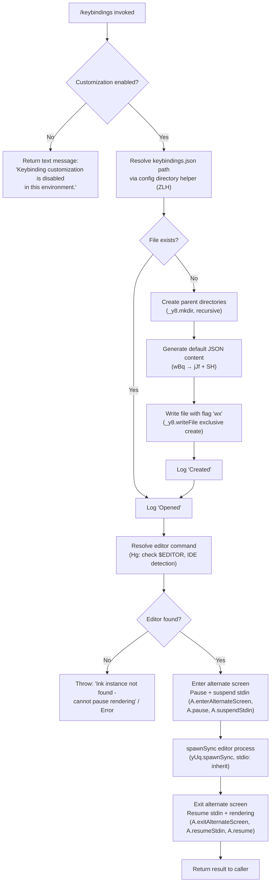

# `/keybindings`

> Analysis basis: CC v2.1.162 bundle.js (AST extraction + Claude interpretation)
> Minimum version: v2.1.162

---

## Overview

The `/keybindings` command opens or creates the user's keybindings configuration file (`keybindings.json`) in an external editor. If the file does not yet exist, the command scaffolds it with a schema-referenced JSON template before launching the editor. The command is disabled in non-interactive and restricted environments.

---

## Registration

| Field | Value |
|---|---|
| type | `local` |
| name | `keybindings` |
| description | `Open or create your keybindings configuration file` |
| supportsNonInteractive | `false` |
| module_id | `XBq` |
| load_inline | `true` |
| loc_byte | `11531124` |
| loc_byte_end | `11531318` |
| loc_line | `7872` |
| arbor_handler.name | `XJf` |
| arbor_handler.fqn | `claude-2.1.162::XJf` |
| arbor_handler.kind | `AsyncFunction` |
| arbor_handler.resolution_path | `module_id` |
| arbor_handler.n_hits | `0` |

Analysis basis: CC v2.1.162 bundle.js:+11531124

---

## Input Branching

Four distinct branches are observable from the call graph and literals: (1) keybinding customization is disabled, (2) the config file already exists and is opened, (3) the config file does not exist and must be created then opened, (4) the editor launch itself branches on editor detection. A Mermaid flowchart is used.



Analysis basis: CC v2.1.162 bundle.js:+11530518, +11530548, +11530615, +11530632, +11530683, +11530699, +11530794, +11469817

---

## Behavioral Spec

### 1. Guard: Customization Availability Check

Before any file I/O, the handler checks whether keybinding customization is permitted in the current environment.

```
async function keybindingsHandler(context):
    if not isCustomizationEnabled(context):
        return { type: "text",
                 content: "Keybinding customization is disabled in this environment." }
    // proceed to file handling
```

- The literal `"Keybinding customization is disabled in this environment."` is returned as a `"text"` type response.
- `supportsNonInteractive: false` means this path is reached when the session lacks an interactive terminal.

Analysis basis: CC v2.1.162 bundle.js:+11530535, +11530548

---

### 2. Config Path Resolution (`ZLH` — config path resolver)

The canonical path to `keybindings.json` is computed by joining the user configuration directory with the fixed filename `"keybindings.json"`.

```
function resolveKeybindingsPath():
    baseDir = getConfigDirectory()          // $48.join helper
    return joinPath(baseDir, "keybindings.json")
```

- Filename constant: `"keybindings.json"` (bundle.js:+3853104)
- Uses path-join utilities (`$48.join`, `s8`).

Analysis basis: CC v2.1.162 bundle.js:+11530615, +3853090, +3853099, +3853104

---

### 3. File Creation — Default Content Generation (`wBq`, `jJf`)

When the file does not yet exist, a default JSON skeleton is generated programmatically before writing.

```
function buildDefaultKeybindingsContent():
    // Collect all registered keybinding entries (lJ6.map)
    entries = getAllKeybindingEntries()

    // For each entry, produce a canonical representation
    // using Object.entries / Object.keys to enumerate fields
    // filtering via _.has for required keys only
    rows = entries.map(entry -> formatEntry(entry))

    // Serialise to pretty-printed JSON (SH → JSON.stringify, indent=2)
    return serialiseToJson({ "$schema": SCHEMA_URL, bindings: rows })
```

- Schema URL embedded in template: `"https://www.schemastore.org/claude-code-keybindings.json"` (bundle.js:+11530271)
- Documentation URL also present: `"https://code.claude.com/docs/en/keybindings"` (bundle.js:+11530336)
- JSON serialisation indentation level: `2` (bundle.js:+11530418)
- String trimming of binding names uses `"space"` as a separator token (bundle.js:+3841999).

Analysis basis: CC v2.1.162 bundle.js:+11530391, +11530035, +11530048, +11530068, +11530104, +11530135, +11530207, +11530408

---

### 4. Exclusive File Write

The generated content is written using the `"wx"` flag, which causes the write to fail atomically if the file was concurrently created between the existence check and the write.

```
function writeKeybindingsFile(path, content):
    parentDir = dirname(path)               // jBq.dirname
    mkdirRecursive(parentDir)               // _y8.mkdir
    writeFile(path, content, flag="wx")     // exclusive create
```

- Write flag: `"wx"` (bundle.js:+11530728) — exclusive creation; error on pre-existing file.
- Encoding: UTF-8 (consistent with config file conventions; `"utf-8"` literal at bundle.js:+3256586).

Analysis basis: CC v2.1.162 bundle.js:+11530632, +11530642, +11530683, +11530728

---

### 5. Editor Launch (`Hg` — editor launcher)

After ensuring the file exists, the command resolves the correct external editor and opens it in a full-screen, blocking subprocess.

```
async function launchEditor(filePath):
    inkInstance = getInkInstance()          // i4.get
    if not inkInstance:
        throw Error("Ink instance not found - cannot pause rendering")

    editorCommand = resolveEditorCommand(filePath)
    // resolveEditorCommand (mwf → N8A):
    //   1. Check basename for known IDE markers (Swf.find, _.includes)
    //   2. Normalise via sk8.basename
    //   3. Strip extension ($9: indexOf + slice)

    terminal = getTerminalInterface()       // A (terminal controller)
    terminal.enterAlternateScreen()
    terminal.pause()
    terminal.suspendStdin()

    // Build argv: split editor command on whitespace (L.split)
    // then append filePath (f.slice)
    argv = editorCommand.split(" ") + [filePath]

    result = spawnSync(argv[0], argv[1:], { stdio: "inherit" })
    // stdio: "inherit" keeps the editor in the foreground (bundle.js:+11469971)

    terminal.exitAlternateScreen()
    terminal.resumeStdin()
    terminal.resume()

    // Read back file after editing
    updatedContent = readFileSync(filePath)   // _.readFileSync

    return updatedContent
```

- Error literal for missing Ink instance: `"Ink instance not found - cannot pause rendering"` (bundle.js:+11469664)
- stdio mode: `"inherit"` (bundle.js:+11469971)
- IDE environment label checked: `"IDE"` (bundle.js:+5399885)
- Editor resolution also consults `lW` (editor-name normaliser) which lowercases the command and uses basename detection with `RkH`.

Analysis basis: CC v2.1.162 bundle.js:+11530794, +11469616, +11469658, +11469721, +11469817, +11469847, +11469857, +11469896, +11469921, +11469939, +11470241, +11470319, +11470348, +11470364

---

### 6. Config System Integration (`fB`, `j6`, file-watch subsystem)

The handler calls into the broader config-access layer (`fB` → `j6`) which handles:

- **Cache lookup** via `fYH` (Map) and `gU` (Map): checks if a config is already loaded before re-reading from disk.
- **File watch registration** (`bWL` → `o18.watchFile` / `o18.unwatchFile`): starts watching the config file for external changes after the editor session ends.
- **Config parsing** (`DYH`): reads the file with `q.readFileSync`, handles `ENOENT` (file not found) and `EEXIST` (already exists) error codes, makes backup copies on migration (`q.copyFileSync`, timestamped via `Date.now`).
- **Experiment tracking** integration (`rJ_` → `ZNH`, `sdH`, `lJ_.randomUUID`, `Jo.emit`): config reads may trigger A/B experiment event emission (`"GrowthbookExperimentEvent"` / `"growthbook_experiment"`).
- **Config status values** resolved by the watcher subsystem: `"unknown"`, `"local"`, `"migrated"`, `"native"`, `"installed"`, `"disabled"`, `"enabled"`, `"no_permissions"`, `"global"`, `"not_configured"` (bundle.js:+3252018–+3252224).

Analysis basis: CC v2.1.162 bundle.js:+11530518, +3852587, +3233252, +3233289, +3233324, +3233341, +3233352, +3233364, +3233378, +3252749, +3252754, +3257094, +3257132, +3256497, +3256733, +3257348

---

### 7. Result Reporting

After the editor closes, the handler logs the outcome:

```
function reportOutcome(wasCreated):
    if wasCreated:
        print("Created")      // literal "Created" (bundle.js:+11530850)
    else:
        print("Opened")       // literal "Opened"  (bundle.js:+11530841)
```

Analysis basis: CC v2.1.162 bundle.js:+11530841, +11530850

---

## State & Side Effects

| Item | Detail |
|---|---|
| Telemetry | `tengu_config_parse_error` (emitted on JSON parse failure in config layer; bundle.js:+3257134) |
| Telemetry | `tengu_keybinding_customization_release` (emitted during keybindings config access; bundle.js:+3852590) |
| File system — create | Creates `keybindings.json` with exclusive `"wx"` flag if absent; creates parent directories recursively |
| File system — read | Reads back the edited file content after editor exits (`_.readFileSync`) |
| File system — watch | Registers a file-watcher on the config file (`o18.watchFile`) post-access; unregisters via `o18.unwatchFile` on cleanup |
| File system — backup | Config migration path (`DYH`) copies existing file with `Date.now`-stamped name before overwriting |
| Terminal state | Enters alternate screen, pauses and suspends stdin before editor launch; restores all on exit |
| Ink renderer | Pauses Ink rendering during editor subprocess; resumes after |
| Experiment events | May emit `"GrowthbookExperimentEvent"` / `"growthbook_experiment"` via config-read path |
| Hook registration | <!-- TODO: not found in depth-2 traversal; needs --depth 4 --> |
| appState changes | <!-- TODO: not found in depth-2 traversal; needs --depth 4 --> |
| Sound | None observed |

---

## Version History

| Version | Change |
|---|---|
| v2.1.162 | Initial analysis |

---

## Common Mistakes

1. **Running in non-interactive mode**: The command declares `supportsNonInteractive: false`. Invoking `/keybindings` in a headless or piped session returns the "disabled in this environment" message immediately without touching any files.
2. **No `$EDITOR` / IDE configured**: If the editor-resolution logic (`Hg`) cannot find a valid editor, it throws an error referencing the Ink instance. Ensure `$EDITOR` is set or an IDE integration is active.
3. **Concurrent file creation race**: The exclusive `"wx"` write flag means a second invocation racing to create the file will receive a write error (`EEXIST`). The config layer handles `EEXIST` gracefully at the parse level, but users should not invoke `/keybindings` in parallel sessions simultaneously.
4. **Schema URL is informational only**: The `$schema` key written into `keybindings.json` (pointing to `https://www.schemastore.org/claude-code-keybindings.json`) enables editor auto-completion but is not validated at runtime by Claude Code itself.
5. **File-watcher lifecycle**: The config system registers a file-watcher after reading `keybindings.json`. Manually deleting the file while Claude Code is running may produce `tengu_config_parse_error` telemetry events on the next config refresh cycle.

---

## Appendix — Identifier Mapping

> For bundle debugging only. Identifiers change across versions.

| Identifier | Role |
|---|---|
| `XJf` | Main async handler for `/keybindings` command (arbor_handler) |
| `fB` | Config-access entry point called by handler |
| `j6` | Core config loader / cache dispatcher |
| `zw6` | Config subsystem initialiser (called from loader) |
| `Dw6` | Config subsystem secondary initialiser |
| `Hu` | Config environment resolver |
| `ex` | Platform/environment detection utility |
| `U18` | Cached config reader with deduplication |
| `rJ_` | Experiment event emitter on config read |
| `eJ_` | Config post-processor / transformer |
| `C6` | File-based config provider |
| `i6` | Internal assertion / invariant checker |
| `zj_` | Config schema validator or normaliser |
| `DYH` | Config file reader with backup/migration logic |
| `bWL` | File-watcher registration manager |
| `ZLH` | Keybindings config path resolver |
| `wBq` | Default keybindings JSON content builder |
| `jJf` | Keybinding entry formatter / mapper |
| `IvH` | String trimmer for binding names |
| `H` | HTTP fetch / bootstrap utility (also used as generic map target) |
| `_` | Node `fs` module reference |
| `SH` | JSON serialiser (wraps `JSON.stringify`) |
| `V8` | File-write result handler or error reporter |
| `Hg` | External editor launcher (alternate-screen + spawnSync) |
| `Hp` | Editor pre-launch state saver |
| `bD` | Terminal state snapshot helper |
| `mwf` | Editor command resolver (delegates to `N8A`) |
| `N8A` | Editor binary name extractor and IDE classifier |
| `$9` | String extension-stripping utility (indexOf + slice) |
| `A` | Terminal / Ink renderer controller interface |
| `f` | Subprocess or stream handle |
| `q` | File system or process resource tracker |
| `L` | Async lifecycle / cleanup tracker |
| `lW` | Editor name normaliser (lowercase + basename) |

---

Note: index built via Arbor fallback; some signals (telemetry, literals) may be missing — see arbor-fallback.js.