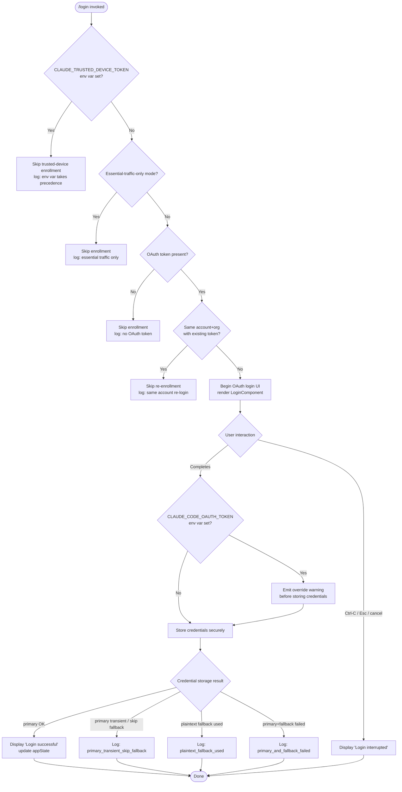

# `/login`

> Analysis basis: CC v2.1.167 bundle.js (AST extraction + Claude interpretation)
> Minimum version: v2.1.167

---

## Overview

The `/login` command initiates an interactive OAuth-based sign-in flow that allows the user to authenticate with Anthropic's account system or switch between Anthropic accounts. It renders a JSX UI component that guides the user through the authentication steps, stores the resulting credentials securely, and updates the application's auth state upon success. When a conflicting environment variable (`CLAUDE_CODE_OAUTH_TOKEN`) is detected, it emits a runtime warning before completing.

---

## Registration

| Field | Value |
|---|---|
| type | `local-jsx` |
| name | `login` |
| description | `Switch Anthropic accounts \| Sign in with your Anthropic account` |
| loc_byte | `11620674` |
| loc_byte_end | `11620894` |
| loc_line | `8026` |
| module_id | `WJq` |
| load_inline | `true` |
| arbor_handler.name | `sdq` |
| arbor_handler.fqn | `claude-2.1.167::sdq` |
| arbor_handler.kind | `Function` |
| arbor_handler.resolution_path | `direct` |
| arbor_handler.n_hits | `2` |
| handler_name (bundle) | `ps7` |

Analysis basis: CC v2.1.167 bundle.js:+11620674 – +11620894

---

## Input Branching

The command involves five or more distinct execution paths (environment variable checks, token re-use detection, enrollment flow, credential storage outcome, and interrupt/cancel state), so a Mermaid flowchart is used.



Analysis basis: CC v2.1.167 bundle.js:+9339591, +9339686, +9339734, +9339800, +9339965, +9340340, +9340359, +2284848, +2284946, +2285095, +2285198, +7008946, +7009260, +7009373

---

## Behavioral Spec

### 1. Command Entry — Root Handler (`ps7`)

The top-level handler is `ps7` (Arbor-resolved as `sdq`, `direct` path). It is the JSX component factory for `/login`.

```
function loginCommandRoot(appContext):
    accountContext = readAccountContext(appContext)       // kL + C6
    loginElement  = createElement(LoginUIComponent)      // yt.createElement
    loginWidget   = mountLoginWidget(appContext)          // UV8
    return renderTree(loginElement, loginWidget)
```

Analysis basis: CC v2.1.167 bundle.js:+9340162, +9340243, +9340307

---

### 2. Bootstrap / API Key Fetch (`v` via `H`)

Before the OAuth flow begins, the handler performs a bootstrap fetch to retrieve environment metadata.

```
function bootstrapFetch(url):
    log("[Bootstrap] Fetching", url)
    response = httpGet(url, headers={
        "Content-Type": "application/json",
        "User-Agent":   <agent string>
    }, timeout=5000)
    if response.ok:
        log("[Bootstrap] Fetch ok")
        return parseJSON(response)
    else:
        telemetry("api_bootstrap_fetch", reason="parse_failed")
        return null
```

Constants:
- Fetch timeout: **5000 ms** (bundle.js:+15797661)
- Log prefix `"[Bootstrap] Fetching"` (bundle.js:+15797460)
- Telemetry event string `"api_bootstrap_fetch"` (bundle.js:+15797782)

Analysis basis: CC v2.1.167 bundle.js:+15797458, +15797545, +15797560, +15797782

---

### 3. Credential / Model Resolution (`onK`, `vPA`, `s9`)

Resolves which Anthropic credential tier and model are available for the session. Inspects cloud provider routing (`bedrock`, `foundry`, `vertex`, `anthropicAws`, `gateway`, `mantle`).

```
function resolveCredentialContext(apiKey, modelHint):
    providerTag = detectProvider(apiKey)   // vPA → sdK / tdK
    modelSlug   = normaliseModel(modelHint)  // s9: trim → toLowerCase → alias map
    // alias map: "opusplan"→"opus", "sonnet"→"sonnet", "haiku"→"haiku",
    //            "best"→alias, "[1m]"→"opus"
    return { provider: providerTag, model: modelSlug }
```

Known provider strings (bundle.js:+2100952, +2101002, +2101160, +2100912, +2101625, +2101645):
`bedrock`, `foundry`, `vertex`, `firstParty`, `anthropicAws`, `gateway`, `mantle`

Analysis basis: CC v2.1.167 bundle.js:+206594, +205174, +61502, +2247412

---

### 4. Trusted-Device Enrollment Gate (`ZtH`)

Runs immediately after an OAuth token is obtained. Guards four skip conditions before enrolling.

```
function trustedDeviceEnrollmentGate(oauthToken, networkMode, osInfo):
    if env.CLAUDE_TRUSTED_DEVICE_TOKEN is set:
        log("[trusted-device] CLAUDE_TRUSTED_DEVICE_TOKEN env var ...")
        return SKIP

    if networkMode == "essential-traffic":
        log("[trusted-device] Essential traffic only ...")
        return SKIP

    if oauthToken is null:
        log("[trusted-device] No OAuth token ...")
        return SKIP

    if isSameAccountReLogin(oauthToken):
        log("[trusted-device] Same account+org re-login with existing token ...")
        return SKIP

    // Proceed with enrollment
    if osInfo.platform == "darwin":
        bridgeEnroll(oauthToken, timeout=10000, retryDelay=500)
        // telemetry: "bridge_trusted_device_enroll"
    else:
        httpEnroll(oauthToken)
    handleEnrollmentResponse()   // checks HTTP 201, missing_token, storage_failed, unknown
```

Constants:
- macOS platform tag `"darwin"` (bundle.js:+7009569)
- Enrollment HTTP timeout **10 000 ms** (bundle.js:+7009662)
- Retry delay **500 ms** (bundle.js:+7009688)
- Expected success HTTP status **201** (bundle.js:+7009850)
- Telemetry event `"bridge_trusted_device_enroll"` (bundle.js:+7009764)

Error tags captured: `"http_error"`, `"missing_token"`, `"storage_failed"`, `"unknown"` (bundle.js:+7009969, +7010148, +7010356, +7010309)

Analysis basis: CC v2.1.167 bundle.js:+7008946, +7009260, +7009373, +7009591, +7009546

---

### 5. Credential Persistence (`p21` — secure storage write)

After a successful login token is returned, the credential is written to secure storage with a plaintext fallback path.

```
function persistCredentials(token, storageContext):
    try:
        primaryResult = secureStorage.write(token)
        telemetry("secure_storage_credentials_write", path="primary")
        return primaryResult
    except TransientError:
        log("primary_transient_skip_fallback")
        return null
    except PrimaryAndFallbackFailed:
        log("primary_and_fallback_failed")
        raise
    on PlaintextFallback:
        log("plaintext_fallback_used")
        writeToPlaintextFallback(token)
```

Telemetry string constants: `"secure_storage_credentials_write"`, `"primary_transient_skip_fallback"`, `"plaintext_fallback_used"`, `"primary_and_fallback_failed"` (bundle.js:+2284848, +2284946, +2285095, +2285198)

Analysis basis: CC v2.1.167 bundle.js:+2284298, +2284845

---

### 6. Remote Managed Settings Pull (`Lm_`)

After auth is updated, the runtime triggers a remote settings pull. The pull is subject to its own auth / cache / security-dialog state machine.

```
function remoteSettingsPull(authContext):
    hash = computeSettingsHash(currentSettings)   // pF9 → mF9.createHash("sha256")
    response = fetchRemoteSettings(authContext, etag=cachedEtag)

    switch response.status:
        case 200: validateAndApply(response.body)
        case 204: applyEmpty()
        case 304: log("Remote settings: Using cached settings (304)")
        case 401:
            telemetry("tengu_remote_settings_401_force_refresh_retry")
            forceRefreshAndRetry()
        case 404: deleteLocalCache(); log("Remote settings: Deleted cached file")
        default:  log("Remote settings: Using stale cache after error")
                  telemetry("remote_managed_settings_unexpected")

    if newSettings differ from cached:
        showSecurityDialog()   // telemetry: tengu_managed_settings_security_dialog_shown
        if accepted:
            applySettings()    // telemetry: tengu_managed_settings_security_dialog_accepted
        else:
            revertToCached()   // telemetry: tengu_managed_settings_security_dialog_rejected
```

HTTP status constants: 200, 204, 304, 401, 404 (bundle.js:+7044866, +7044875, +7044884, +7045806, +7044893)

Analysis basis: CC v2.1.167 bundle.js:+7046906, +7046937, +7047395, +7047525, +7047690

---

### 7. Policy Limits Fetch (`RT6` / `NF9`)

Concurrently with settings pull, the command refreshes per-account policy limits.

```
function refreshPolicyLimits(authContext):
    cached = readCachedLimits()
    if cacheStillValid(cached, maxAge):   // VF9: Math.max + Date.now + statSync
        log("Policy limits: Cache still valid (304 Not Modified)")
        return cached

    try:
        fresh = fetchPolicyLimits(authContext)   // LX7 → TF9.createHash
        applyRestrictions(fresh)
        log("Policy limits: Applied new restrictions successfully")
    except NetworkError:
        log("Policy limits: Using stale cache after fetch failure")
        telemetry("tengu_policy_limits_fetch", outcome="stale_cache_used")
    except UnexpectedError:
        log("Policy limits: Using stale cache after error")
        telemetry("tengu_policy_limits_fetch", outcome="unexpected_error")
```

Telemetry: `"tengu_policy_limits_fetch"` (bundle.js:+7004685)
Log prefixes from literals: `"Policy limits: Loading promise timed out, resolving anyway"` (bundle.js:+7002004), `"Policy limits: Refreshed after auth change"` (bundle.js:+7006147)

Analysis basis: CC v2.1.167 bundle.js:+7006073, +7004646, +7005280

---

### 8. Login UI Component (`OWH`)

The JSX component rendered for the interactive login. Manages local state, keyboard shortcuts, and the OAuth URL display.

```
component LoginUI(props):
    [state, dispatch] = useReducer(loginReducer, initialState)
    useEffect(subscribeToAuthEvents)
    memoValue = useMemo(computeDerivedState)

    // Key bindings registered via T_ → L.registerHandler
    // Ctrl-C  → interrupt / "app:interrupt"
    // Ctrl-D  → exit     / "app:exit"
    // Esc     → confirm:no

    if state == DONE:
        renderSuccess("Login successful")     // bundle.js:+9340340
    else if state == INTERRUPTED:
        renderInfo("Login interrupted")       // bundle.js:+9340359
    else:
        renderOAuthPrompt(oauthUrl, iM, DZ_)
```

UI string constants:
- `"Login successful"` (bundle.js:+9340340)
- `"Login interrupted"` (bundle.js:+9340359)
- `"Press "` / `" again to exit"` (bundle.js:+9340857, +9340876)
- `"Esc"`, `"continue"`, `"cancel"` (bundle.js:+9340963, +9340983, +9340994)
- `"Settings"`, `"Global"`, `"Login"`, `"permission"` (bundle.js:+9340708, +4097893, +9341447, +9341472)
- Warning string about `CLAUDE_CODE_OAUTH_TOKEN` env var override (bundle.js:+9339965)

Analysis basis: CC v2.1.167 bundle.js:+9340405, +9340435, +9340583, +9340739

---

### 9. App-State Update (`UV8` — main widget handler)

Central dispatcher that coordinates all sub-operations after the OAuth callback resolves.

```
function loginWidgetHandler(event, appHandle):
    applyMessageOp(event)                 // H.applyMessageOp
    updateTimestamp()                     // xpH → Date.now
    refreshRemoteSettings()               // RtH → Lm_
    pollPolicyLimits()                    // RT6
    cleanupOldSession()                   // y8H → ulH (clears HwH, gq8, gj6, SP_, IB)
    rebuildOAuthContext()                 // kL → GY + C6
    loadAppState()                        // H.getAppState → JI6 → BT6
    persistLastMessage()                  // b_ → sy8 / ty8
    runTrustedDeviceFlow()                // ZtH
    setAppState(newState)                 // H.setAppState
```

Analysis basis: CC v2.1.167 bundle.js:+9339338, +9339357, +9339413, +9339419, +9339425, +9339437, +9339470, +9339583, +9339686, +9339698, +9339734, +9339746, +9339762, +9339766, +9339800, +9339806, +9339842

---

## State & Side Effects

| Item | Detail |
|---|---|
| Telemetry — feature flags | `tengu_feature_ok` (bundle.js:+1010950), `tengu_feature_bad` (bundle.js:+1011012), `tengu_feature_sad` (bundle.js:+1011093) |
| Telemetry — remote settings 401 retry | `tengu_remote_settings_401_force_refresh_retry` (bundle.js:+7045875) |
| Telemetry — managed settings dialog | `tengu_managed_settings_security_dialog_shown` (+7041842), `…_accepted` (+7041494), `…_rejected` (+7041544) |
| Telemetry — policy limits | `tengu_policy_limits_fetch` (bundle.js:+7004685) |
| Telemetry — bypass permissions | `tengu_disable_bypass_permissions_mode` (bundle.js:+10705066) |
| Telemetry — auto mode config | `tengu_auto_mode_config` (bundle.js:+10702956) |
| Telemetry — daemon config reload | `tengu_daemon_config_reload` (bundle.js:+16212216) |
| Telemetry — trusted device | `bridge_trusted_device_enroll` (bundle.js:+7009764) |
| Telemetry — remote settings pull | `remote_managed_settings_pull` (+7046906), `remote_managed_settings_fetch_failed` (+7046937), `remote_managed_settings_security_check` (+7041616), `remote_managed_settings_unexpected` (+7047991) |
| Hook registration | `T_` registers keyboard handler via `L.registerHandler` (bundle.js:+4097997); subscribes to auth event bus via `Nc → blH.subscribe` (bundle.js:+3241029) |
| appState changes | `H.setAppState` is called at the end of the widget handler (bundle.js:+9339842); inner state managed by `oM` / `BT6` |
| Session cleanup | `ulH` clears `HwH`, `gq8`, `gj6`, `SP_`, `IB` collections and removes process listeners (bundle.js:+3245192–3245240) |
| Credential storage | Secure-storage write (`p21`) with plaintext fallback path; outcomes logged with four distinct constants (bundle.js:+2284848–2285198) |
| File I/O | Remote settings written via `pX7` (`ihH.open` → `A.writeFile` → `A.datasync` → `A.close`), rotated via `cl8` (`ly.rename` / `ly.unlink`), cached via `OX7` (`ghH.writeFile`) |
| Sound | <!-- TODO: not found in depth-2 traversal; needs --depth 4 --> |
| Auto-mode gate notification | Emits `"auto-mode-gate-notification"` with priority `"high"` / severity `"warning"` if auto mode is gated (bundle.js:+9338693, +9338736, +9338755) |
| Env-var override warning | If `CLAUDE_CODE_OAUTH_TOKEN` is set, a warning is displayed after login completes (bundle.js:+9339965) |

---

## Version History

| Version | Change |
|---|---|
| v2.1.167 | Initial analysis |

---

## Common Mistakes

1. **Stale `CLAUDE_CODE_OAUTH_TOKEN` environment variable** — If this variable remains set after `/login` completes, it will silently override the newly stored OAuth token at runtime. The command warns about this but cannot unset the variable itself; the user must clear it manually.
2. **Expecting immediate remote-settings propagation** — The remote managed settings pull runs asynchronously after auth; if the pull returns 401, a retry occurs but there may be a brief window where stale settings are active.
3. **Trusted-device enrollment skipped unexpectedly** — Four independent conditions short-circuit enrollment (env var, essential-traffic mode, no token, same-account re-login). Users on macOS who see enrollment skipped should verify none of those conditions are met.
4. **Re-running `/login` while already authenticated without intent** — The command unconditionally starts the full OAuth flow; it does not first check if a valid session exists and prompt for confirmation. Existing session state is replaced on success.
5. **Policy limits not immediately reflecting login** — Policy limits are fetched concurrently; if a cache from a previous session is still valid, the command may use stale limits until the cache TTL expires.

---

## Appendix — Identifier Mapping

> For bundle debugging only. Identifiers change across versions.

| Identifier | Role |
|---|---|
| `sdq` | Arbor-resolved handler function for `/login` (direct resolution) |
| `ps7` | Top-level JSX component factory / command root handler |
| `UV8` | Main login widget event dispatcher |
| `OWH` | Login UI JSX component (renders OAuth prompt, success, interrupted states) |
| `Lj` | Sub-component: account context / state accessor wrapper |
| `DJq` | Sub-component: reducer + effect hook container |
| `ZtH` | Trusted-device enrollment gate function |
| `RtH` | Post-auth refresh orchestrator (settings + limits) |
| `Lm_` | Remote managed settings pull coordinator |
| `RT6` | Policy limits refresh orchestrator |
| `NF9` | Policy limits HTTP fetch + cache logic |
| `VF9` | Policy limits cache validity checker |
| `p21` | Secure credential storage writer |
| `yVH` | Secure storage async read helper |
| `enK` | File write helper (credential / settings persistence) |
| `tnK` | File append + rotate helper |
| `cl8` | File rename/unlink rotation helper |
| `pX7` | Atomic file write (open → writeFile → datasync → close) |
| `kL` | OAuth context rebuilder |
| `GY` | OAuth credential assembler |
| `C6` | Credential metadata stamper (Date.now + IVL) |
| `GO` | API key / credential resolver |
| `Bj` | Auth-type dispatcher (profile-implicit, user_oauth, etc.) |
| `JI6` | App-state loader |
| `BT6` | App-state transformer |
| `oM` | Permission-mode state machine |
| `b_` | Last-message finder (findLast over app-state messages) |
| `XI6` | Auto-mode gate evaluator |
| `PI6` | Auto-mode configuration resolver |
| `y8H` | Session cleanup initiator |
| `ulH` | Session state clearer (clears multiple WeakMap/Set collections) |
| `mP_` | Process-listener remover (clearInterval + removeListener) |
| `Vg9` | Remote settings HTTP fetch (ETag / If-None-Match) |
| `mX7` | Remote settings retry + backoff scheduler |
| `pAH` | Exponential backoff calculator (Math.min/pow/random) |
| `Pg9` | Remote settings security-check dialog orchestrator |
| `yX7` | Security-check dialog queue manager |
| `Eg9` | Remote settings structured-clone applier |
| `Wg9` | Remote settings user-rejection handler |
| `eK` | Settings rejection outcome classifier |
| `pF9` | Settings hash / fingerprint generator |
| `Bu_` | Recursive settings object serializer |
| `iw8` | Settings key enumerator |
| `ItH` | Settings header normaliser (toUpperCase + vtH.has) |
| `nF9` | Settings entry formatter |
| `LX7` | Policy limits hash generator (TF9.createHash) |
| `fX7` | Policy limits auth-type tagger (wif / oauth / api_key) |
| `MX7` | Policy limits retry scheduler |
| `OX7` | Policy limits cache writer (ghH.writeFile) |
| `zX7` | Policy limits background poller |
| `vF9` | Policy limits foreground poller |
| `gw8` | Policy limits poll scheduler |
| `cC` | Policy limits constraint applier |
| `KP6` | Policy limits cache reader (Of9.readFileSync) |
| `XjH` | Policy limits cache path builder (zf9.join + t8) |
| `s9` | Model alias normaliser |
| `H9` | Model string parser |
| `m6H` | Model object builder |
| `qB` | Model field validator |
| `onK` | Credential-context builder |
| `vPA` | Provider detector |
| `v` | API key validation / normalisation routine |
| `G4` | API key format parser / redactor |
| `q0A` | API key prefix mapper |
| `EUH` | API key writer |
| `lWA` | API key file write helper |
| `Y` | Multi-pane terminal renderer |
| `T_` | Keyboard handler registrar |
| `DZ_` | Input capture component (Ctrl-C / Ctrl-D) |
| `gC` | Debounced input callback hook |
| `iM` | OAuth URL display component |
| `k79` | OAuth URL memo wrapper |
| `Nc` | Auth event-bus subscriber |
| `Ko1` | Auth event-bus resolve callback |
| `Y6` | App-state context reader (useSyncExternalStore) |
| `RT_` | App-state context accessor (useContext + ReferenceError guard) |
| `oD` | Theme/UI context accessor |
| `h8H` | Feature-flag state accessor |
| `cq8` | Feature-flag resolver (zo1) |
| `zo1` | Feature-flag value fetcher (IB.get + L.getFeatureValue) |
| `D6` | Session hydration helper |
| `dq8` | Session deduplication guard (SP_.has / HwH.get) |
| `mh` | Session merge helper |
| `uP_` | Permission-mode initialiser |
| `aB` | Permission-mode disabler |
| `h4H` | Anthropic-domain checker (y4H.includes) |
| `lM` | Provider MA-wrapper |
| `MA` | Provider string coercer (_6 → String) |
| `_6` | Primitive-to-string coercer |
| `RH` | JSON.stringify wrapper |
| `hH` | Error-queue push handler |
| `AA` | Error message extractor |
| `zG4` | Error-queue FIFO manager (Sc6.shift + Sc6.push) |
| `npH` | Debounced batch writer (clearTimeout / setTimeout / setImmediate) |
| `YKH` | Path-segment joiner (IHH.join + t8 + R6) |
| `U76` | Directory path builder (V8) |
| `M0A` | Settings path builder (IHH.join + R6) |
| `a$6` | Config directory resolver (oKH + BpA.join + t8) |
| `VzH` | Auth-change cache invalidator (iV4 + LY) |
| `iV4` | Auth token inspector (oP + a$6 + U6 + Hu) |
| `LY` | Cache clearers (Yp6.clear + HQ8.clear) |
| `pw8` | Background poll interval manager (setInterval / clearInterval) |
| `BX7` | Background poll tick handler |
| `vg9` | Background poll initiator |
| `j9` | IPC registration helper (VPA.register) |
| `wJq` | Module-ID tag for the login command's inline load |
| `uj_` | String split/trim/indexOf/slice utility |
| `uj` | String replace utility |
| `lHH` | Feature-set membership checker (i74.has) |
| `AlH` | ANSI color/style helper (_6 + nOH) |
| `nDH` | No-op / placeholder side-effect during login widget init |
| `yr_` | Post-login cleanup routine |
| `wJq` | Load-inline module reference tag |
| `QMH` | Permission-map entry iterator |
| `YfH` | Event emitter hook (h4 → M.emit) |
| `h4` | Permission-mode change event emitter |
| `st` | Auto-mode status string resolver |
| `pR` | Plan-availability checker |
| `J16` | Auto-mode downstream notifier (yd) |
| `WUK` | Supervisor heartbeat registrar (S8H) |
| `ym6` | Low-level JSX element factory |