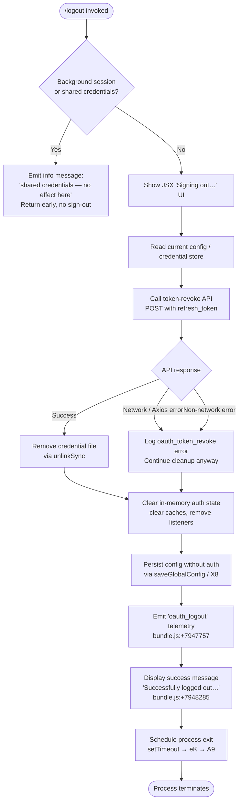

# `/logout`

> Analysis basis: CC v2.1.167 bundle.js (AST extraction + Claude interpretation)
> Minimum version: v2.1.167

---

## Overview

The `/logout` command signs the user out of their Anthropic account by revoking the OAuth token via the API, removing local credential files, clearing in-memory auth state, and then terminating the current CLI session. It presents a JSX confirmation UI while the operation is in progress and displays a final success or error message before exiting.

---

## Registration

| Field | Value |
|---|---|
| type | `local-jsx` |
| name | `logout` |
| description | Sign out from your Anthropic account |
| loc_byte | 11620955 |
| loc_byte_end | 11621239 |
| loc_line | 8026 |
| module_id | `Mg_` |
| load_inline | `true` |
| arbor_handler.name | `rx7` |
| arbor_handler.fqn | `claude-2.1.167::rx7` |
| arbor_handler.kind | `AsyncFunction` |
| arbor_handler.resolution_path | `module_id` |
| arbor_handler.n_hits | 0 |

Analysis basis: CC v2.1.167 bundle.js:+11620955

---

## Input Branching

The handler contains four distinct execution paths depending on session type, token revocation outcome, and background-session detection. A Mermaid flowchart is used.



Analysis basis: CC v2.1.167 bundle.js:+7946859 – +7947754

---

## Behavioral Spec

### Background-session guard

When the CLI is running inside a background (`bg`) or daemon (`daemon` / `daemon-worker`) session that shares credentials with a foreground terminal, the handler detects this condition early and returns a system-scoped message explaining that `/logout` has no effect in that context, and that the user must run `/logout` from their main terminal.

```
function logoutHandler(context):
    sessionType = readSessionType()                    // checks "bg", "daemon", "daemon-worker"
    if sessionType indicates shared credentials:
        emit system message:
            "This background session shares credentials … Run /logout from your main terminal …"
        return                                         // early exit, no sign-out performed
    continueWithLogout(context)
```

Analysis basis: CC v2.1.167 bundle.js:+7948086

---

### Token revocation (oauthTokenRevoke)

The handler calls the OAuth token-revocation endpoint through the HTTP client helper (identified as `e7_`). It sends a POST request with the stored `refresh_token` value. On a network-level Axios error the error is classified and logged; on a non-network error the same fallback path is taken. In either error case cleanup continues — the command does not abort on a failed revocation.

```
async function revokeOAuthToken(credentials):
    try:
        response = await httpClient.post(oauthEndpoint, { grant_type: "refresh_token", ... })
        logEvent("oauth_token_revoke", { status: "success" })
    catch err:
        if isAxiosError(err) and err.code is network-related:
            logEvent("oauth_token_revoke", { status: "network" })
        else:
            logEvent("oauth_token_revoke", { status: ... })
        // do not re-throw; cleanup proceeds regardless
```

Analysis basis: CC v2.1.167 bundle.js:+7947068 (call to `e7_`), +2112525 (POST), +2112693 (`"oauth_token_revoke"`), +2112730 (Axios error check)

---

### Credential file removal

After revocation, the local credential / identity file is unlinked from disk using `ipK.unlinkSync`. A separate socket or lock file used by daemon sessions is also cleaned up via `Ng9` → `ihH.unlink`.

```
function removeCredentialFiles():
    unlinkSync(credentialFilePath)           // ipK.unlinkSync — bundle.js:+16173867
    tryUnlink(daemonSocketOrLockPath)        // ihH.unlink     — bundle.js:+7046573
```

Analysis basis: CC v2.1.167 bundle.js:+7946910 (`q` → `ipK.unlinkSync`), +7947930 (`Ng9`)

---

### In-memory state reset (resetAppState)

The `dZ6` helper orchestrates clearing all runtime auth state:

1. Clears the credentials cache (`mT6`).
2. Removes process event listeners for `exit` and `beforeExit` (`tcH`).
3. Clears multiple in-memory Maps/Sets (`m18` → `am1.clear`; `ulH` clears `HwH`, `gq8`, `gj6`, `SP_`, `IB`).
4. Removes interval timers and process listeners via `mP_` → `clearInterval`, `process.removeListener`.
5. Emits an internal reset event (`blH.emit`) and invokes additional teardown callbacks (`lT`, `hH`).
6. Cleans up daemon/background-session resources via `Ng9` (socket unlink) and `Su_` (clears timeout, unlinks auxiliary file via `ghH.unlink`).

```
function resetAppState():
    clearCredentialCache()                   // mT6
    removeProcessListeners()                 // tcH, mP_
    clearAllRuntimeMaps()                    // am1, HwH, gq8, gj6, SP_, IB
    clearIntervals()                         // clearInterval via mP_
    emitResetEvent()                         // blH.emit
    runTeardownCallbacks()                   // lT, hH
    cleanupDaemonResources()                 // Ng9, Su_
```

Analysis basis: CC v2.1.167 bundle.js:+7947834 – +7947942

---

### Config persistence without auth (saveGlobalConfig)

`X8` (the global config writer) is called to persist the configuration with auth fields stripped. This function acquires a file-system lock, reads the current on-disk config, merges it with the in-memory state minus credentials, and writes back atomically via a temp file and rename. It guards against accidentally wiping auth that it cannot see (see literal at bundle.js:+3262497).

```
async function saveConfigWithoutAuth(currentConfig):
    acquireLock()                                          // X8 / aP_
    onDiskConfig = readConfigFromDisk()
    if onDiskConfig is missing auth that cache holds:
        logWarning("saveGlobalConfig fallback: re-read config is missing auth …")
        releaseLock(); return
    mergedConfig = merge(onDiskConfig, currentConfig minus auth)
    writeAtomic(mergedConfig)                              // rename via $$6
    releaseLock()
```

Analysis basis: CC v2.1.167 bundle.js:+7947398 (call to `X8`), +3262290 (`aP_`), +3262497 (auth-loss guard literal), +1058802 (`q.renameSync`)

---

### Success message and session termination

After cleanup, the handler renders a JSX element (via `fg_.createElement`) containing the success string `"Successfully logged out from your Anthropic account."` and queues a `setTimeout` (200 ms, bundle.js:+7948380) before invoking the session-exit helper (`eK` → `A9`). `A9` flushes pending writes, fires the `session_end` telemetry event, drains I/O, and calls `process.exit`.

```
async function finalizeLogout():
    renderJSX(createElement("Successfully logged out …"))  // fg_.createElement
    await sleep(200)                                        // setTimeout 200 ms
    await sessionExit()                                     // eK → A9 → process.exit
```

Analysis basis: CC v2.1.167 bundle.js:+7948260 (`fg_.createElement`), +7948285 (success literal), +7948348 (`setTimeout`), +7948364 (`eK`), +5456974 (`"session_end"`)

---

### JSX UI component (ox7)

`ox7` is the React/Ink component rendered while the logout is in progress. It displays the label `"Signing out…"` (bundle.js:+7948439) and uses `fyH` → `h4` for layout. The component receives the handler function (`PH6`) and an auth-type prop (`"oauth"`, bundle.js:+7948503) and passes them to the core logout procedure.

```
function LogoutUI(props):
    return render(
        loadingLabel("Signing out…"),
        onMount: () => logoutProcedure(props.authType)   // PH6("oauth")
    )
```

Analysis basis: CC v2.1.167 bundle.js:+7948437 – +7948627

---

## State & Side Effects

| Item | Detail |
|---|---|
| Telemetry — `oauth_logout` | Fired after all cleanup succeeds (bundle.js:+7947757) |
| Telemetry — `tengu_feature_ok` / `tengu_feature_bad` / `tengu_feature_sad` | Feature-level outcome events emitted by `hH` (bundle.js:+1010950, +1011012, +1011093) |
| Telemetry — `tengu_config_lock_contention` | Emitted if the config lock takes longer than expected during `saveGlobalConfig` (bundle.js:+3265476) |
| Telemetry — `tengu_config_stale_write` | Emitted if a stale write is detected (bundle.js:+3265612) |
| Telemetry — `tengu_config_auth_loss_prevented` | Emitted when the auth-loss guard fires to abort the config write (bundle.js:+3265955) |
| Telemetry — `tengu_config_parse_error` | Emitted if the on-disk config JSON is unparseable during write-back (bundle.js:+3268051) |
| Telemetry — `session_end` | Emitted during process-exit sequence via `A9` (bundle.js:+5456974) |
| Telemetry — `tengu_scroll_summary` | Emitted during terminal teardown (bundle.js:+5455866) |
| Telemetry — `tengu_cache_eviction_hint` | Emitted during session-end cache flush (bundle.js:+5456936) |
| Credential file | Deleted from disk via `ipK.unlinkSync` (bundle.js:+16173867) |
| Daemon socket / lock file | Deleted via `ihH.unlink` (bundle.js:+7046573) |
| In-memory Maps/Sets | Cleared: `am1`, `HwH`, `gq8`, `gj6`, `SP_`, `IB` (bundle.js:+2996905, +3245192 – +3245240) |
| Process listeners | Removed for `exit` (bundle.js:+3245124) and `beforeExit` (bundle.js:+3245884) |
| Intervals | Cleared via `clearInterval` (bundle.js:+3245826) |
| Global config | Re-written without auth fields via atomic rename (bundle.js:+7947398) |
| Process lifecycle | `process.exit` called after 200 ms delay via `eK` → `A9` → `vR_` (bundle.js:+5454697) |
| JSX UI | `"Signing out…"` component mounted for duration of operation (bundle.js:+7948439) |

---

## Version History

| Version | Change |
|---|---|
| v2.1.167 | Initial analysis |

---

## Common Mistakes

1. **Running `/logout` in a background or daemon session** — The command detects `bg`, `daemon`, and `daemon-worker` session types and returns early with an informational message. Auth is not removed. Users must run `/logout` from the main interactive terminal.
2. **Expecting immediate re-login** — The command calls `process.exit` after a 200 ms delay. Any subsequent interaction in the same process is not possible; a new `claude` process must be started.
3. **Assuming revocation failure means credentials are still valid** — Even if the API token-revocation POST fails (network error, server error), the local credential file and in-memory state are cleared. The session ends regardless.
4. **Editing `~/.claude.json` manually before `/logout`** — If the on-disk config is missing auth fields that the in-memory cache holds, the auth-loss guard (`tengu_config_auth_loss_prevented`) aborts the write. Manually stripping auth from the JSON can trigger this guard and leave a stale config.
5. **Expecting background daemon sessions to be terminated** — Only the socket/lock file is unlinked. Daemon processes that were already started may need to be stopped separately.

---

## Appendix — Identifier Mapping

> For bundle debugging only. Identifiers change across versions.

| Identifier | Role |
|---|---|
| `rx7` | Main logout async handler (arbor handler; entry point resolved via `module_id` → `Mg_`) |
| `ox7` | JSX UI component rendering "Signing out…" label |
| `PH6` | Core logout procedure called by the UI component; orchestrates revocation, file removal, and state reset |
| `dZ6` | In-memory app-state reset function |
| `mT6` | Credential cache clear helper |
| `tcH` | Process-listener removal helper |
| `m18` | In-memory map/set clear helper (`am1.clear`) |
| `ulH` | Bulk runtime-map clearer (HwH, gq8, gj6, SP_, IB) |
| `mP_` | Interval and process-listener teardown (clearInterval, process.removeListener) |
| `y8H` | Additional auth-state teardown; emits internal reset event |
| `hu` | Auth state accessor called during teardown |
| `yu` | Auth state inner accessor |
| `hH` | Feature-outcome event emitter (tengu_feature_ok/bad/sad) |
| `AA` | Error-string formatter helper |
| `_6` | String coercion utility |
| `$q` | Essential-traffic queue helper |
| `zG4` | Queue shift/push manager (Sc6) |
| `Ng9` | Daemon socket / lock file cleanup |
| `Ig9` | Daemon cleanup sub-step |
| `qm_` | Daemon cleanup sub-step |
| `FpA` | Daemon cleanup value (constant 0) |
| `oKH` | Path join helper |
| `a$6` | Path construction utility |
| `Su_` | Background-session resource cleanup (timeout clear + file unlink) |
| `yu_` | Session cleanup inner helper |
| `Ru_` | Session cleanup sub-step |
| `b7H` | Session-type checker (bg/daemon/daemon-worker) |
| `XjH` | Auxiliary path builder |
| `MA` | Auth-provider classifier (bedrock, foundry, anthropicAws, mantle, vertex, firstParty) |
| `z4` | Config read entry point |
| `p21` | Storage read/write/delete dispatcher |
| `H` | Primary storage backend |
| `v` | HTTP/fetch utility |
| `Y3` | Config store helper |
| `uj_` | String split/trim/index/slice utility |
| `lHH` | Cache has-check helper (`i74.has`) |
| `uj` | String replace utility |
| `H9` | Config field accessor (m6H, s9, FJ) |
| `o6` | Logger helper |
| `yVH` | Storage async read helper |
| `FKL` | Storage write context manager (AsyncLocalStorage) |
| `SH` | Logger sub-helper |
| `l` | Low-level log emitter |
| `J6` | Log formatter |
| `CH` | Logger sub-helper variant |
| `L` | File handle tracker (add/delete/finally) |
| `f` | File handle close helper |
| `A` | File handle lowercase normaliser |
| `e7_` | OAuth token revocation HTTP caller |
| `F1` | OAuth endpoint URL builder |
| `wIA` | OAuth base URL selector |
| `t54` | OAuth URL sub-component |
| `Ar` | UI state accessor used after revocation |
| `PJ_` | Config persistence entry point (calls X8 and $p1) |
| `$p1` | Global config writer sub-step |
| `LO1` | Keychain / secure-storage delete entry point |
| `hI` | Keychain entry hash builder (sha256/NFC/hex) |
| `tP` | Keychain delete caller |
| `sV` | System user-info helper |
| `GH` | String coercion utility |
| `X8` | Global config file writer (atomic rename) |
| `aP_` | Config write core: lock, backup, rename |
| `d6` | File-existence / stat helper |
| `S21` | Config object merger (Object.assign) |
| `V8` | Config validation helper |
| `LwH` | Config read-from-disk helper |
| `oj6` | Config schema validator |
| `RH` | JSON.stringify wrapper |
| `sP_` | Backup path builder |
| `$$6` | Atomic file write via temp + rename |
| `QlH` | Config field validator |
| `Zo1` | Config entries iterator |
| `AK8` | Timestamp helper (Date.now) |
| `oP_` | Config write fallback path |
| `eH8` | Config write post-step |
| `K` | Session/tab map |
| `RTH` | Runtime state mutator called after config write |
| `fyH` | JSX layout helper |
| `Zj` | JSX string formatter |
| `h4` | JSX inner layout component |
| `LyH` | OTEL metrics / attribute builder |
| `ZB` | Random-bytes session ID generator |
| `R6` | Environment variable reader |
| `S38` | OTEL attribute schema builder |
| `kW6` | String-coerce utility for OTEL keys |
| `kL` | OTEL label builder |
| `pJ9` | OTEL dimension helpers |
| `gL6` | JSX grid layout helper |
| `lQ8` | JSX layout sub-component |
| `M` | MCP server manager / event emitter |
| `xbH` | MCP connect-all helper |
| `XF8` | MCP connection result applier |
| `$` | MCP store lookup |
| `dDA` | MCP server state aggregator |
| `nQ8` | JSX render finaliser |
| `eK` | Session-exit coordinator |
| `A9` | Process-exit implementation (flush, drain, exit) |
| `oyH` | Terminal unmount helper |
| `xC` | Terminal cursor restore helper |
| `dL8` | Terminal output write helper (ANSI escape sequences) |
| `NR_` | Terminal final-output renderer |
| `wT` | TTY stream reference |
| `Cx` | Terminal column-width helper |
| `_G6` | Working-directory stat helper |
| `s$` | Shell environment helper |
| `sV9` | Terminal dim-text helper |
| `vR_` | Hard process-exit (process.exit / SIGKILL) |
| `ipH` | I/O drain helper (VPA.drain) |
| `Y` | Supervisor/renderer main loop |
| `$GH` | Render-frame builder |
| `mfK` | Layout metrics calculator |
| `T` | Render ticker |
| `WUK` | Heartbeat sender |
| `LN9` | Pending-promise settler (Promise.allSettled) |
| `_f6` | Startup-profiling reporter |
| `An8` | Profiling data formatter |
| `Z0A` | Profiling write helper |
| `Bz8` | Scroll-summary emitter |
| `aV9` | Scroll-summary sub-step |
| `oV9` | Scroll metrics aggregator |
| `$1` | Display-mode detector (fullscreen/tmux/ConPTY) |
| `DL6` | Cache eviction hint emitter |
| `P6` | Version string accessor |
| `ym6` | Package metadata constant |
| `Fz8` | Race-condition resolver for exit promises |
| `r8` | Timeout-with-abort helper |
| `dYH` | Session-type constant accessor |
| `nDH` | Auth-state field clearer |
| `blH` | Internal event bus |
| `lT` | Teardown callback runner |