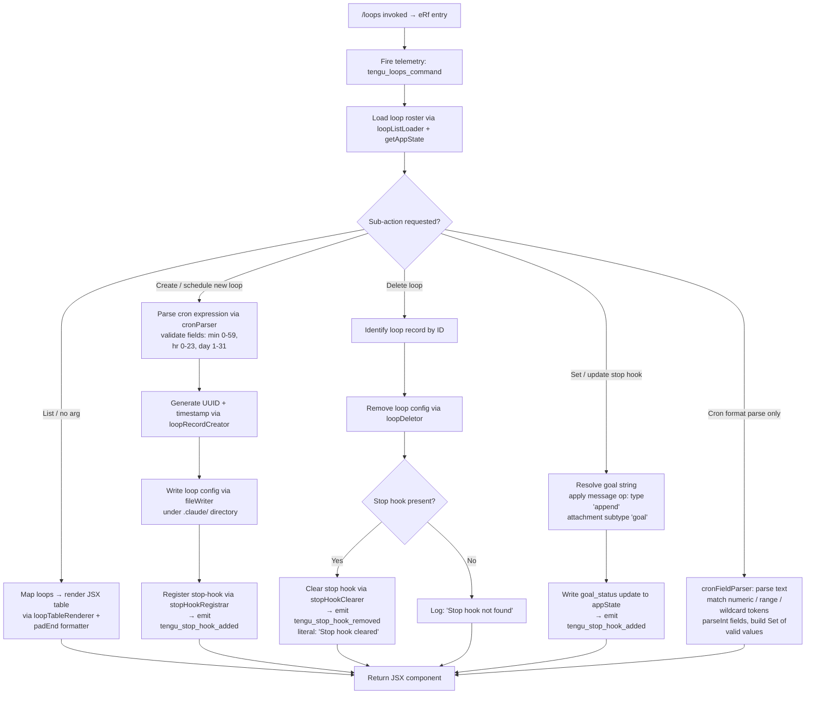

# `/loops`

> Analysis basis: CC v2.1.167 bundle.js (AST extraction + Claude interpretation)
> Minimum version: v2.1.167

---

## Overview

The `/loops` command provides an interactive management interface for Claude Code's background loop (agent) sessions. It allows users to list currently active or known loops, create new scheduled or cron-based loops, and delete existing ones — all from within the CLI prompt. The command renders a JSX-based UI component and operates directly against the daemon's session roster and application state.

---

## Registration

| Field | Value |
|---|---|
| type | `local-jsx` |
| name | `loops` |
| description | `List, create, and delete loops` |
| loc_byte | `12511092` |
| loc_byte_end | `12511249` |
| loc_line | `8941` |
| immediate | `true` |
| module_id | `kAK` |
| load_inline | `true` |
| arbor_handler.name | `eRf` |
| arbor_handler.fqn | `claude-2.1.167::eRf` |
| arbor_handler.kind | `AsyncFunction` |
| arbor_handler.resolution_path | `module_id` |
| arbor_handler.n_hits | `0` |

Analysis basis: CC v2.1.167 bundle.js:+12511092

---

## Input Branching

The handler `eRf` covers at least five distinct execution paths depending on the sub-action requested (list, create/schedule, delete, stop-hook management, and cron format parsing). A Mermaid flowchart is required.



---

## Behavioral Spec

### 1. Command Entry and Telemetry Emission

```
async function loopsCommandHandler(context):
    emit telemetry("tengu_loops_command")          // loc_byte 12510049
    rosterData  = await loadLoopRoster(context)    // calls loopRosterLoader (n_H)
    sessionList = await loadSessionList(context)   // calls sessionListLoader (l)
    appState    = context.getAppState()
    ...
```

Analysis basis: CC v2.1.167 bundle.js:+12510047, +12510087, +12510099

---

### 2. Loop Roster Loading

The roster loader (`n_H`) delegates to the loop configuration reader (`ckH`), which:

1. Resolves the config path via `pathResolver` (`_fH`) using `path.join` against the project root.
2. Reads the file with encoding `"utf-8"` (bundle.js:+4878981).
3. On `ENOENT` / `EACCES` / `EPERM` / `ENOTDIR` / `ELOOP` / `EROFS` errors, returns a safe empty default (error codes: bundle.js:+176093–176162).
4. Parses entries, validates them with `Array.isArray`, and returns the normalized list.

```
async function loadLoopRoster(context):
    configPath = pathJoin(projectRoot, ".claude")  // literal ".claude" loc_byte 4880122
    try:
        raw = await fs.readFile(configPath, "utf-8")
        entries = parseEntries(raw)
        if not Array.isArray(entries): return []
        return entries
    catch err:
        if err.code in ["ENOENT","EACCES","EPERM","ENOTDIR","ELOOP","EROFS"]:
            return []
        throw err
```

Analysis basis: CC v2.1.167 bundle.js:+4878934, +4878953, +4878964, +4879097

---

### 3. Loop Table Renderer (List Sub-action)

```
function renderLoopTable(loops, appState):
    columnWidths = loops.map(entry => measureWidth(entry))   // padEnd width: 40 chars
    rows = tableFormatter(loops, columnWidths)               // padEnd with "  " separator
    return JSX element built via YLA.createElement           // loc_byte 12510852
```

The column formatter uses `padEnd` with a fixed width of `40` characters (bundle.js:+16223575) and a two-space separator `"  "` (bundle.js:+16221604).

Analysis basis: CC v2.1.167 bundle.js:+12510127, +16221570, +16221583

---

### 4. Cron Expression Parser

The cron parser (`tRf`) validates and normalises a human-readable or cron-format schedule string:

```
function parseCronExpression(text):
    text = text.trim()
    match = text.match(cronPattern)
    if match:
        minute  = parseInt(match.minute)
        hour    = parseInt(match.hour)
        // Clamp: max minute 59 (loc_byte 12509814), max hour 23 (loc_byte 12509885)
        // max day 31 (loc_byte 12509938)
        minute  = Math.max(0, Math.ceil(minute))      // loc_byte 12509757, 12509768
        minute  = Math.round(minute)                   // loc_byte 12509841
        if minute > 59: minute = 59
        if hour > 23:   hour   = 23
    // Special human labels:
    if text == "Every minute": return {m:"*", h:"*"}   // loc_byte 4876845
    if text == "Every hour":   return {m:"0", h:"*"}   // loc_byte 4877062
    return normalised cron object
```

The range parser (`saL`) handles hyphen-range tokens (e.g. `"1-5"`, bundle.js:+4877769) using `parseInt` (bundle.js:+4875039) and builds a `Set` of valid integer values via `K.add` (bundle.js:+4875100). Upper bound constants: `10` steps (bundle.js:+4875053), group size `3` (bundle.js:+4875215), `6`/`7` day tokens (bundle.js:+4875251, +4875257).

Analysis basis: CC v2.1.167 bundle.js:+12509635, +12509672, +12510005, +4874974

---

### 5. Loop Creation

```
async function createLoop(scheduleSpec, goalText, context):
    id        = crypto.randomUUID()                   // via mD9.randomUUID, loc_byte 4880281
    timestamp = Date.now()                            // loc_byte 4880343
    record    = buildLoopRecord(id, timestamp, scheduleSpec, goalText)  // bTH
    await fileWriter(record)                          // ckH → fs.writeFile under .claude/
    await stopHookRegistrar(context, record)          // NoH → u$8.mkdir + u$8.writeFile
    updateAppState(context, record)                   // applyMessageOp type "append"
    emit telemetry("tengu_stop_hook_added")
    return render confirmation JSX
```

The loop record creator (`voH`) also invokes `loopRosterLoader` (`ckH`) again to confirm the write persisted before pushing the new entry to the in-memory list (bundle.js:+4880433).

Analysis basis: CC v2.1.167 bundle.js:+12510697, +4880281, +4880343, +4880389, +4880433, +4880446

---

### 6. Stop-Hook Registration and Clearing

Stop hooks are identified by the string key `"stophook"` (bundle.js:+12510231).

**Registration** (`E16` / `T16`):

```
function registerStopHook(context, loopRecord):
    appState = context.getAppState()
    op = {type: "append", subtype: "attachment", kind: "goal"}  // loc_byte 10830342, 10830452, 10830410
    context.applyMessageOp(op)
    context.setAppState({...appState, goal_status: ...})        // loc_byte 10830319, 10830539
    emit telemetry("tengu_stop_hook_added")                      // loc_byte 10830004
```

**Clearing**:

```
function clearStopHook(context, loopId):
    found = lookupStopHook(loopId)
    if not found:
        log("Stop hook not found")                              // literal loc_byte 12510491
        return
    removeHook(found)
    log("Stop hook cleared")                                    // literal loc_byte 12510513
    emit telemetry("tengu_stop_hook_removed")                   // loc_byte 10830376
```

Analysis basis: CC v2.1.167 bundle.js:+12510231, +12510473, +10830319, +10830376, +10830004

---

### 7. Loop Deletion

```
async function deleteLoop(loopId, context):
    record = findLoopById(loopId)
    await loopDeletor(record)           // QwA: ID.rm + ID.unlink, loc_byte 16203007, 16204070
    clearStopHook(context, loopId)
    await rosterRefresh(context)
    return render updated JSX table
```

The deletion path (`QwA`) also removes associated state entries via `R7H.delete` / `OjH.delete` (bundle.js:+4167527, +4167541) and updates session status fields including `"done"`, `"killed"`, `"failed"` (bundle.js:+16202917, +16202935, +16202954).

Analysis basis: CC v2.1.167 bundle.js:+12510334, +16203007, +16204070

---

### 8. JSX Rendering

The final output is always a JSX tree constructed via `YLA.createElement` (bundle.js:+12510852). The handler passes computed loop-row data (`L` array, bundle.js:+12510902) and a callback closure (`f`, bundle.js:+12510926) to the component. Rendering uses the `local-jsx` command type, meaning the output is displayed inline in the terminal UI without triggering an agent turn.

Analysis basis: CC v2.1.167 bundle.js:+12510852, +12510902, +12510926

---

## State & Side Effects

| Item | Detail |
|---|---|
| Telemetry — primary | `tengu_loops_command` (emitted on every invocation, loc_byte 12510049) |
| Telemetry — stop hook added | `tengu_stop_hook_added` (loop create / hook set, loc_byte 10830004) |
| Telemetry — stop hook removed | `tengu_stop_hook_removed` (loop delete / hook clear, loc_byte 10830376) |
| Telemetry — daemon background | `tengu_bg_spare_claim`, `tengu_bg_spare_enable`, `tengu_bg_sendclaim_failed` (indirectly via session manager) |
| Telemetry — daemon lifecycle | `tengu_daemon_idle_exit`, `tengu_daemon_config_reload`, `tengu_daemon_control` |
| Telemetry — feature gates | `tengu_feature_ok`, `tengu_feature_bad`, `tengu_feature_sad` |
| Hook registration | Stop hooks written under `.claude/` directory (literal loc_byte 4880122); `u$8.mkdir` + `u$8.writeFile` called on create |
| appState changes | `goal_status` field updated on hook set (loc_byte 10830539); `setAppState` / `applyMessageOp` called (loc_byte 10829905, 10829947) |
| File I/O | Loop config read/written as UTF-8 JSON; deleted via `ID.rm` + `ID.unlink` |
| Session roster | `_.rosterEntry` updated (loc_byte 16204226); `Y.delete` / `H.delete` called on loop removal |
| Timeout | 300 000 ms session idle timeout registered on new loop (literal loc_byte 16204484) |
| Sound | <!-- TODO: not found in depth-2 traversal; needs --depth 4 --> |

---

## Version History

| Version | Change |
|---|---|
| v2.1.167 | Initial analysis |

---

## Common Mistakes

1. **Providing an invalid cron string** — The parser (`tRf`) expects either a standard cron format or one of the recognised human labels (`"Every minute"`, `"Every hour"`). Free-text descriptions outside those labels will fail to parse and produce no loop.
2. **Deleting a loop without confirming the stop hook** — If the associated stop hook was never registered (e.g. the `.claude/` directory was manually modified), deletion logs `"Stop hook not found"` but still proceeds; callers should not expect an error to surface.
3. **Assuming synchronous roster refresh** — The roster is re-read from disk after creation (`ckH` called twice in `voH`). Race conditions between rapid create/delete sequences may cause stale list renders.
4. **Confusing `/loops` with `/bg`** — `/loops` manages scheduled (cron-driven) background loops; it is not the general background session manager. Session lifecycle telemetry (`tengu_bg_*`) appears in the call graph because the underlying daemon layer is shared.
5. **Editing `.claude/` files manually** — Loop records include a UUID and a `Date.now()` timestamp. Manually edited files may fail the `Array.isArray` guard and be silently dropped on next roster load.

---

## Appendix — Identifier Mapping

> For bundle debugging only. Identifiers change across versions.

| Identifier | Role |
|---|---|
| `eRf` | Main async handler for `/loops` command (`AsyncFunction`, arbor FQN: `claude-2.1.167::eRf`) |
| `l` | Session list / utility loader called at handler entry |
| `n_H` | Loop roster loader — delegates to `ckH` |
| `ckH` | Loop config file reader (reads UTF-8, validates array, handles FS errors) |
| `_fH` | Path resolver — joins project root with config dir |
| `$4` | Sub-path builder used by `_fH` |
| `t1` | Validation helper (delegates to `V8`) |
| `V8` | Core validator / error builder |
| `hH` | Log/error handler used across loop reader and session manager |
| `AA` | Error formatter (wraps `Error` + `String`) |
| `_6` | String coercion utility |
| `$q` | Traffic classifier (uses `"essential-traffic"` literal) |
| `zG4` | Queue manager (shift/push on `Sc6`) |
| `v` | HTTP fetch / bootstrap helper |
| `onK` | Fetch orchestrator (calls `KI`, `f0A`, `vPA`) |
| `H` | Bootstrap fetch wrapper (sets Content-Type, User-Agent, 5000 ms timeout) |
| `RH` | JSON serialiser (wraps `JSON.stringify`) |
| `G4` | URL sanitiser (redacts with `"[REDACTED]"` literal) |
| `EUH` | Encoding utility (delegates to `lWA`) |
| `enK` | Large-file / streaming handler (uses `Buffer.byteLength`, 1000/100 constants) |
| `Yk` | Loop entry formatter (trim + collect via `saL` + push to array) |
| `saL` | Cron range parser (split, match, parseInt, `Set.add`, `Array.from`) |
| `G16` | Session state initialiser (calls `n2H`, pushes to array) |
| `n2H` | Column-width setter (calls `gzq` which maps over entries) |
| `gzq` | Row mapping utility |
| `R6` | Utility: wraps `tv` |
| `RN` | Cron expression normaliser (trim, match, parseInt, UTC date arithmetic) |
| `w` | Session/daemon process manager (spawn, kill, SIGKILL escalation) |
| `r8` | Abort/timeout wrapper (setTimeout, clearTimeout, `"aborted"` sentinel) |
| `O` | Process wrapper (delegates to `b8`) |
| `CH` | Background session create handler (calls `l`, `J6`; emits `tengu_feature_bad`) |
| `SH` | Background session success handler (calls `l`, `J6`; emits `tengu_feature_ok`) |
| `J6` | Journal/log sink (delegates to `ym6`) |
| `cx8` | Memory check utility (reads freemem, 1024 constant, emits `tengu_bg_low_mem_mb`) |
| `D6` | Duplicate-guard / concurrency limiter |
| `tX6` | Pins reader (`pins.json`, `Array.isArray` guard, directory scan via `kgL`) |
| `EZ_` | Pins path builder (`y2.join` + `sT`) |
| `U6` | JSON parser (wraps `JSON.parse`) |
| `h8` | Stat validator (calls `V8`) |
| `kgL` | Directory reader (readdir, filter directories, readFile, push, `"pinned"` flag) |
| `Q` | Session retire-if-settled handler (kill, reconnect, rate-limit events) |
| `U` | Interval clearer |
| `b4H` | Output trimmer (calls `_6H`, `_.trim`) |
| `C` | Rate-limit event emitter (`"rate_limit_event"` literal, `randomUUID`) |
| `g` | Idle-exit timer (write, setTimeout, `Math.round`, unref; emits `tengu_daemon_idle_exit`) |
| `j` | Kill-all helper (iterates values, `S.kill`) |
| `mwA` | Daemon claim / connect handler (YQ.claim, IPC socket connect, write claim frame) |
| `G$A` | Session directory creator (mkdir 448/384 mode, writeFile JSON) |
| `U$5` | Claim timeout enforcer (`Date.now`, 500 ms retry, `"ECONNREFUSED"` guard) |
| `p$5` | Claim frame builder (calls `YQ.buildClaimFrame`) |
| `Tf` | Error type validator (calls `V8`) |
| `GH` | String coercion wrapper |
| `fy` | IPC frame serialiser (Buffer.from, allocUnsafe, writeUInt32BE, writeUInt8, copy) |
| `QwA` | Loop / session deletion orchestrator (rm, unlink, roster update, state cleanup) |
| `RK` | Session path resolver (`y2.join` + `sT`) |
| `e9` | State-file watcher/reader (stat, readFile, JSON parse, set/clear R7H map) |
| `VY` | Active-status setter (calls `GN` with `"active"` literal) |
| `zf` | Daemon status writer (`"daemon.status.json"` via `zC6` path) |
| `t16` | Telemetry timing wrapper (`Date.now`, `JWf` reporter) |
| `q$H` | Path joiner for session data (`OO.join` + `NxH`) |
| `yE` | Session path splitter (`OO.join`, `H.split`) |
| `gg` | Session log path builder (`O1A`, `a16`) |
| `XS6` | Directory creator helper (`OO.join` + `D1A`) |
| `Y` | Config-reload manager (stop/updateConfig/start cycle; emits `tengu_daemon_config_reload`) |
| `D` | Forced-shutdown handler (`"forced shutdown"` literal, `process.exit`, `z.abort`) |
| `IJ` | Shutdown initiator |
| `z` | Abort controller wrapper (calls `SH`, `CH`, `xh`, `sp`; emits `tengu_daemon_control`) |
| `$` | Session context accessor (calls `zLK`) |
| `zLK` | Telemetry context builder (`Yo`, `Date.now`, `V9`, `zC6`, `RH`) |
| `Yo` | Output trimmer (calls `b4H`) |
| `V9` | AsyncLocalStorage accessor (`aNL.getStore`) |
| `zC6` | Status file path builder (`OLK.join` + `t8`) |
| `J` | Date/time calculator (UTC day/date/hour arithmetic for cron scheduling) |
| `l_H` | Hook lookup / loop filter (calls `THH`, `ckH`, `q.filter`, `NoH`) |
| `THH` | Hook presence checker (`_.has`) |
| `NoH` | Stop-hook file writer (`$4`, `u$8.mkdir`, `m$8.join`, `u$8.writeFile`, `_fH`, `RH`) |
| `E16` | Stop-hook registration for existing sessions (`getAppState`, `setAppState`, `applyMessageOp`) |
| `T16` | Stop-hook registration for new sessions (full create path; emits `tengu_stop_hook_added`) |
| `Oxq` | UUID generator for message ops (`fxq.randomUUID`) |
| `P6` | Promise-like helper (calls `ym6`) |
| `ym6` | Low-level async primitive |
| `tRf` | Cron expression parser (match, parseInt, Math.max/ceil/round, clamp 60/59/23/31) |
| `voH` | Loop record creator (randomUUID, Date.now, `bTH`, `ckH`, roster push, `R6`, `Yo`, `NoH`) |
| `bTH` | Loop record builder |
| `M` | MCP server manager (delegates to `xbH`, `XF8`, `dDA`) |
| `xbH` | MCP connection handler (per-server connect, OAuth, tool registration) |
| `sl` | MCP slot processor (`AT6`, `bs`, `sXH`, `al`, `dD8`, `xJ`, `_T6`) |
| `Ik` | MCP capability resolver (`qz`, `bx_`) |
| `a8` | MCP config accessor (`_`) |
| `cy6` | MCP filter helper |
| `yhq` | MCP tool metadata handler (`VHA`, `tXH`, `pD8`, `Date.now`) |
| `UD8` | MCP tool state updater (`pD8`, `EP`) |
| `uD8` | MCP tool cleaner (`z4`) |
| `M8` | MCP debug logger (`PFH.push`, `pr.logMCPDebug`) |
| `Dk8` | MCP OAuth initiator (tool `"authenticate"` with 10 000 ms timeout) |
| `wk8` | MCP OAuth callback handler (validates `callback_url`, `"success"` result) |
| `mhq` | MCP post-connect handler (`VHA`, `V9`, `dk8`, `RH`) |
| `Ee_` | MCP error reporter (`EP`, `z4`, `M8`, `GH`) |
| `tN` | MCP skill telemetry emitter (emits `tengu_mcp_skills`) |
| `yx_` | MCP include-check helper (`X8`, `A.includes`) |
| `k` | MCP skill file watcher (chokidar; emits `tengu_skill_file_changed`) |
| `v7` | MCP error logger (`PFH.push`, `pr.logMCPError`) |
| `Chq` | MCP connection status aggregator (`AF`) |
| `K16` | MCP slot index parser (`parseInt`, constant 20) |
| `ck8` | MCP retry-count parser (`parseInt`) |
| `XF8` | MCP connection result applier (`H.applyMcpUpdate`, `bbH`, `M8`, `_y`, `sD`) |
| `bbH` | MCP tool-set updater (`tXH`) |
| `_y` | MCP cleanup sequencer (`A16`, `K.cleanup`, `tN`) |
| `dDA` | MCP global retry monitor (`Object.entries`, `_.getClients`, `lD8`, `xbH`, `XF8`) |
| `lD8` | MCP disabled-server checker (`Dj7.has`, `hx_.has`) |
| `A16` | MCP tool-list refresher (`tXH`) |
| `W8A` | Policy/trust gate loader (`kB`, `cD`, `U_`, `Of`) |
| `kB` | Policy settings accessor (`x8`, `"policySettings"` literal) |
| `cD` | Trust gate evaluator (`x8`, `yA`) |
| `U_` | Gate helper |
| `Of` | Hooks gate evaluator (`EVL`) |
| `EVL` | Gate resolution engine (`_6`, `QpH`, `J9`, `C6`, `clH`, `Wd`, `u6`, `dD.resolve`) |
| `o6` | Telemetry emitter for goal_set (calls `l`, `J6`; `"goal_set"` literal) |
| `yD` | Output-token counter (`hpH`, `Object.values`, `"outputTokens"` literal) |

---

Note: index built via Arbor fallback; some signals (telemetry, literals) may be missing — see arbor-fallback.js.