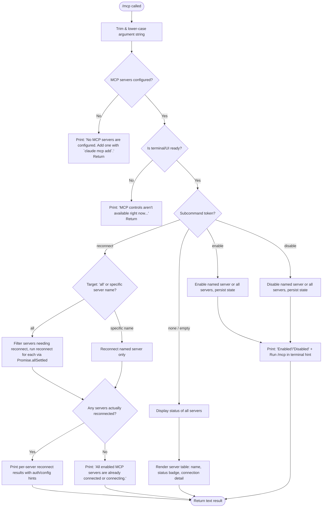

# `/mcp`

> Analysis basis: CC v2.1.167 bundle.js (AST extraction + Claude interpretation)
> Minimum version: v2.1.167

---

## Overview

The `/mcp` command provides in-session management of Model Context Protocol (MCP) servers. It allows users to inspect server connection status, reconnect failed or disconnected servers, and enable or disable individual servers (or all servers at once) without leaving the Claude Code session. The command is implemented as an async handler (`jGf`) that branches on the subcommand token supplied by the user.

---

## Registration

| Field | Value |
|---|---|
| type | `local` |
| name | `mcp` |
| description | `Manage MCP servers` |
| argumentHint | `[reconnect\|enable\|disable [<server>\|all]]` |
| supportsNonInteractive | `true` |
| module_id | `Dlq` |
| load_inline | `true` |
| loc_byte | `11940283` |
| loc_byte_end | `11940475` |
| loc_line | `8248` |
| arbor_handler.name | `jGf` |
| arbor_handler.fqn | `claude-2.1.167::jGf` |
| arbor_handler.kind | `AsyncFunction` |
| arbor_handler.resolution_path | `module_id` |
| arbor_handler.n_hits | `0` |

Analysis basis: CC v2.1.167 bundle.js:+11940283

---

## Input Branching

The handler parses the raw argument string and branches across five distinct cases (status display, reconnect, enable, disable, and the "no servers configured" guard), warranting a Mermaid flowchart.



Analysis basis: CC v2.1.167 bundle.js:+11688020 (handler entry `jGf`), +11688727–+11688771 (subcommand literals)

---

## Behavioral Spec

### 1. Argument Parsing

```
async function mcpCommandHandler(context):
    rawArg = context.args.trim()                         // +11688020
    getMcpServerList = context.getMcp()                  // +11688031
    subcommand = rawArg.toLowerCase()                    // +11688080

    if subcommand is "ide":                              // +11688071
        // IDE-specific path: handled separately below
```

The handler first normalises the argument string by trimming whitespace and converting to lower-case. The `getMcp()` accessor retrieves the current list of configured MCP servers from application state.

Analysis basis: CC v2.1.167 bundle.js:+11688020, +11688031, +11688080

---

### 2. Guard: No Servers Configured

```
function noServersGuard(serverList):
    if serverList is empty or null:
        return text("No MCP servers are configured. Add one with `claude mcp add`.")
        // +11688993
```

When no MCP servers exist in the configuration the handler returns early with an instructional message and performs no further processing.

Analysis basis: CC v2.1.167 bundle.js:+11688993

---

### 3. Guard: Terminal / UI Not Ready

```
function uiReadyGuard(context):
    if terminal not yet ready or another view is active:
        return text("MCP controls aren't available right now — the terminal is still starting up or is showing another view.")
        // +11689192
```

A second guard fires when the interactive terminal layer has not finished initialising or is occluded by another view.

Analysis basis: CC v2.1.167 bundle.js:+11689192

---

### 4. Status Display (no subcommand)

```
function displayMcpStatus(serverList):
    for each server in serverList:
        badge = derive_status_badge(server.state)
        // possible states: connected, pending, failed, needs-auth, disabled
        // +11688245 / +11688279 / +11688311 / +11688330 / +11688365
        renderRow(server.name, badge, server.connectionDetail)
    return formatted table as text          // +11692291
```

When the argument string is empty the command renders a status table showing each server's name and current connection state. Status tokens found in the bundle: `connected`, `pending`, `failed`, `needs-auth`, `disabled`.

Analysis basis: CC v2.1.167 bundle.js:+11688245, +11688279, +11688311, +11688330, +11688365, +11692291

---

### 5. Reconnect Subcommand

```
async function handleReconnect(subcommand, serverList):
    target = tokenAfter("reconnect", subcommand)         // may be "all" or a server name

    if target == "all" or target is absent:              // +11688727
        candidates = serverList.filter(needsReconnect)   // +11688931
    else:
        candidates = [findServerByName(target)]

    if candidates is empty:
        return text("All enabled MCP servers are already connected or connecting.")
        // +11689934

    results = await Promise.allSettled(                  // +11690010
                  candidates.map(server => reconnectServer(server))
              )

    for each result in results:
        if result.status == "fulfilled":                 // +11690075
            if server.state == "needs-auth":
                appendHint("Authenticate with `/mcp` in the terminal.")   // +11690220
            else if server.state == "failed":
                appendHint("Check its config with `/mcp` in the terminal.") // +11690264

    // Inline telemetry event emitted
    emit("tengu_mcp_command_inline")                     // +11688870
    return formatted reconnect summary
```

The reconnect path uses `Promise.allSettled` so that a failure on one server does not abort reconnection attempts for others. The hint message ` Reply \`/mcp reconnect all\` here to retry.` (+11688521) is appended to connection-failure notices shown in the chat context.

Analysis basis: CC v2.1.167 bundle.js:+11688727, +11688740, +11688931, +11689934, +11690010, +11690075, +11690220, +11690264, +11688521

---

### 6. Enable / Disable Subcommand

```
async function handleEnableDisable(verb, serverList, subcommand):
    // verb: "enable" (+11688757) or "disable" (+11688771)
    target = tokenAfter(verb, subcommand)    // may be "all" or a server name

    if target == "all":                      // +11688727
        affected = serverList
    else:
        affected = [findServerByName(target)]

    for each server in affected:
        setServerEnabled(server, verb == "enable")   // persists to config

    statusWord = (verb == "enable") ? "Enabled" : "Disabled"  // +11691382 / +11691392
    return text(statusWord + ". Run `/mcp` in the terminal to see status.")
    // +11692217
```

Enabling or disabling a server mutates the stored MCP configuration and confirms the change to the user. The trailing hint directs users to rerun `/mcp` without arguments to review the updated status table.

Analysis basis: CC v2.1.167 bundle.js:+11688757, +11688771, +11688727, +11691382, +11691392, +11692217

---

### 7. Server State Helper (`o1A` / needs-approval check)

```
function needsApprovalCheck(server):
    if server.approvalState == "needs-approval":   // +11687429
        return IxH(server)                         // internal approval-state resolver
```

Internally the handler consults an approval-state predicate (resolved via `o1A` → `IxH`) when deciding which servers require user action before reconnection can proceed.

Analysis basis: CC v2.1.167 bundle.js:+11687429, +11689357, +11690566

---

### 8. Non-Interactive Mode

The registration sets `supportsNonInteractive: true`. In non-interactive invocations the same handler runs but UI-readiness guards are expected to pass through silently, and output is serialised as plain `text` (+11692291) rather than rendered UI components.

Analysis basis: CC v2.1.167 bundle.js:+11692291

---

### 9. Daemon Lifecycle (called via `z`)

The call graph shows that the handler may reach the daemon lifecycle module (`z`) when a reconnect triggers a full server restart. The lifecycle sequence is:

```
function daemonReconnect(server):
    // Phase 1 – graceful shutdown
    await Promise.race([
        Promise.all([shutdownTransport(server)]),   // RLH → SLH.shutdown +3236646
        timeoutAfter(500ms)                         // +16228817
    ])
    // Phase 2 – restart
    startNewTransport(server)                       // xh path
    emit("tengu_daemon_control")                    // +16233774
    if shutdown fails:
        emit("daemon_stop_failed")                  // +16233736
```

The daemon stop path emits `"stopped"` (+16233608) and `"daemon_stop"` (+16233699) status strings. A forced-shutdown path exists (`"forced shutdown"` +16230096) that calls `process.exit` as a last resort.

Analysis basis: CC v2.1.167 bundle.js:+16228773, +16228817, +16233608, +16233699, +16233736, +16230096, +16230115

---

## State & Side Effects

| Item | Detail |
|---|---|
| Telemetry | `tengu_mcp_command_inline` (+11688870) — fired after inline reconnect; `tengu_feature_ok` (+1010950), `tengu_feature_bad` (+1011012), `tengu_feature_sad` (+1011093) — general feature outcome events; `tengu_daemon_control` (+16233774) — fired when daemon transport is restarted |
| MCP server config mutation | `enable` / `disable` subcommands persist enabled-state change to the MCP server configuration |
| Reconnect side effect | Triggers transport teardown and re-initialisation for affected servers; uses `Promise.allSettled` to run reconnects concurrently |
| Daemon lifecycle | Full reconnect may trigger `SLH.shutdown`, new transport creation via `xh`/`kP_`, UUID generation (`vP_.randomUUID` +3236800), and event emission (`H.emit` +3236912) |
| Log / file I/O | `enK` path involves `ly.appendFile`, `ly.mkdir`, `ly.rename`, `ly.unlink`, `ly.stat` for log rotation; `Buffer.byteLength` used for size-guarding log writes |
| Hook registration | `j9` → `VPA.register` (+60369) — registers a hook for MCP state updates |
| Timer management | `npH` path uses `clearTimeout`, `setTimeout`, `setImmediate` for connection debounce/retry (+59783, +59947, +60040) |
| Sound | None observed in depth-2 traversal |
| appState changes | Server enabled/disabled state written back through MCP configuration accessors |

---

## Version History

| Version | Change |
|---|---|
| v2.1.167 | Initial analysis |

---

## Common Mistakes

1. **Omitting the target argument for `enable`/`disable`**: The argument hint shows `<server>|all` is required after the verb. Calling `/mcp enable` without a server name or `all` leaves the target unresolved and the command may silently no-op.
2. **Expecting synchronous reconnect feedback**: Reconnects are performed with `Promise.allSettled`, meaning the command returns after all attempts settle — not after the first success. Partial failures are reported but do not block the response.
3. **Using `/mcp reconnect` when no servers are failing**: If all enabled servers are already connected or in a connecting state, the handler returns the "already connected" message and performs no reconnect work. This is expected behaviour, not a bug.
4. **Confusing `needs-auth` and `failed` states**: The two states produce different hint messages. `needs-auth` prompts the user to authenticate; `failed` prompts config review. Both can look like connectivity failures at a glance.
5. **Running `/mcp` before the terminal is ready**: The UI-readiness guard fires early in initialisation. If the command is issued programmatically in a non-interactive script before the terminal layer starts, the guard message is returned instead of server status.
6. **Expecting `/mcp disable all` to stop background reconnect timers immediately**: The disable path persists configuration state but the reconnect timer debounce (1000 ms default at +59671, 100-item queue at +59692) may still fire once before the disabled state is observed.

---

## Appendix — Identifier Mapping

> For bundle debugging only. Identifiers change across versions.

| Identifier | Role |
|---|---|
| `jGf` | Main async handler for `/mcp` command (Arbor-resolved entry point) |
| `H` | Bootstrap / HTTP fetch utility; also used as generic argument variable in several call sites |
| `v` | Core MCP subcommand dispatch function |
| `onK` | MCP server list accessor / state reader |
| `vPA` | MCP configuration persistence helper |
| `sdK` | Config read sub-helper (called from vPA) |
| `tdK` | Config write sub-helper (called from vPA) |
| `RH` | JSON serialisation helper (`JSON.stringify` wrapper) |
| `G4` | Path / string manipulation utility (uses `.replace`, `.at`, `.lastIndexOf`, `.slice`) |
| `q0A` | Server list mapper (called from G4) |
| `q` | File unlink / trim utility (context-dependent) |
| `A` | Lower-case / file-system path utility |
| `EUH` | Output write coordinator |
| `lWA` | Terminal write helper (`H.write`) |
| `enK` | Log file write / rotation orchestrator |
| `npH` | Connection debounce / retry timer manager |
| `YKH` | MCP server status formatter |
| `d6` | Internal config field accessor |
| `U76` | EISDIR-guarded directory check helper |
| `M0A` | Log path join helper |
| `cl8` | Log rotation helper (stat → rename → unlink) |
| `tnK` | Log append worker (mkdir + appendFile) |
| `j9` | Hook registration wrapper (`VPA.register`) |
| `Y3` | Bootstrap response validator |
| `uj_` | Argument string tokeniser (split / trim / indexOf / slice) |
| `lHH` | Set membership check (`i74.has`) |
| `uj` | String sanitiser (`H.replace`) |
| `H9` | Tool/model name resolver |
| `m6H` | Model string parser |
| `Q0` | Model name component extractor |
| `aqH` | Model alias resolver |
| `qB` | Model metadata builder |
| `s9` | Model normalisation function |
| `Y2` | Model ID validator (`R4H`) |
| `h4H` | Model allowlist checker (`y4H.includes`) |
| `CI` | Model tier classifier (`lM`, `N5`) |
| `DdH` | Model tier fallback handler |
| `bT` | First-party model resolver (`lM`, `N5`, `MA`) |
| `cP1` | Model resolution wrapper (`bT`) |
| `lM` | AWS/Anthropic model mapping helper |
| `VH8` | Model capability flag checker (`HKL.includes`) |
| `wdH` | Model suffix stripper (`_6`) |
| `FJ` | Model configuration finaliser |
| `_G` | Composite model property assembler |
| `o6` | Feature outcome event emitter (ok/bad/sad paths) |
| `l` | Feature telemetry logger |
| `J6` | Feature event dispatcher (`ym6`) |
| `ym6` | Low-level telemetry emitter |
| `CE` | MCP server status badge builder |
| `a8` | Server state string resolver |
| `bS8` | Reconnect eligibility predicate |
| `Olq` | Reconnect executor |
| `o1A` | Approval-state check entry point |
| `IxH` | Approval-state resolver |
| `$` | Daemon process registry / filter target |
| `zLK` | Daemon status file writer (`daemon.status.json`) |
| `Yo` | Status object builder |
| `b4H` | Status field formatter |
| `V9` | AsyncLocalStorage store accessor |
| `zC6` | Status file path constructor |
| `E` | Reconnect result array |
| `O` | Background session manager |
| `b8` | Session record handler |
| `D` | Forced shutdown / process exit coordinator |
| `IJ` | Shutdown initiator |
| `z` | Daemon lifecycle controller (abort + stop) |
| `SH` | Daemon stop success handler |
| `CH` | Daemon stop failure handler |
| `xh` | Transport restart orchestrator |
| `yu` | Transport constructor helper (`kC`) |
| `EvH` | Transport event binder (`bh`) |
| `kP_` | Transport UUID / event emitter setup |
| `sp` | Graceful shutdown with timeout (`Promise.race`) |
| `RLH` | Transport shutdown caller (`SLH.shutdown`) |
| `pLH` | Shutdown timeout clearer (`clearTimeout` + `A2_`) |
| `r8` | Abort/timeout race utility |

---

Note: index built via Arbor fallback; some signals (telemetry, literals) may be missing — see arbor-fallback.js.