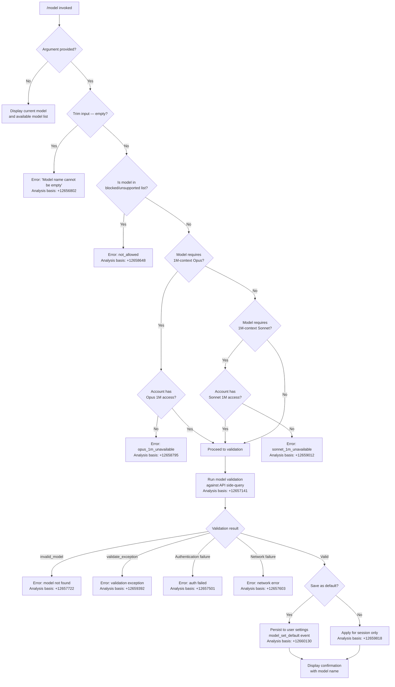

# `/model`

> Analysis basis: CC v2.1.167 bundle.js (AST extraction + Claude interpretation)
> Minimum version: v2.1.167

---

## Overview

The `/model` command allows the user to switch the AI model that Claude Code uses for its responses. When invoked with a model name argument, it validates the requested model against the available models for the user's account, applies the change either for the current session or as a persistent default, and emits confirmation output. When invoked without an argument, it displays the current model and the list of available models.

---

## Registration

| Field | Value |
|---|---|
| type | `local` |
| name | `model` |
| description | Set the AI model for Claude Code |
| argumentHint | `<model>` |
| supportsNonInteractive | `true` |
| module_id | `kKK` |
| load_inline | `true` |
| loc_byte | 12731148 |
| loc_byte_end | 12731322 |
| loc_line | 9094 |
| arbor_handler.name | `$uf` |
| arbor_handler.fqn | `claude-2.1.167::$uf` |
| arbor_handler.kind | `AsyncFunction` |
| arbor_handler.resolution_path | `module_id` |
| arbor_handler.n_hits | 0 |

Analysis basis: CC v2.1.167 bundle.js:+12731148

---

## Input Branching

The command has 4+ distinct branches depending on whether an argument is provided, whether the argument is empty, which model family is requested, and whether the model is available to the account.



---

## Behavioral Spec

### Handler Entry Point (`$uf`)

The Arbor-resolved handler is `$uf` (AsyncFunction), reached via `module_id` resolution path.

```
async function handleModelCommand(rawArgument, context):
    trimmedArg = rawArgument.trim()                         // +12695780

    if trimmedArg is not of kind "text":                    // +12695847
        // no-op or display mode
        pass

    if trimmedArg appears in the disabled-features list:    // +12695796
        return error or early exit

    appState = context.getAppState()                        // +12695819

    if trimmedArg is non-empty:
        emit telemetry "tengu_model_command_inline"         // +12695938
        result = validateAndApplyModel(trimmedArg, appState)
        return result
    else:
        displayCurrentModelAndList(appState)                // +12695863 via Cb8
```

### Model Name Normalization (`s9`)

```
function normalizeModelName(rawName):
    name = rawName.trim().toLowerCase()                     // +2247412, +2247423
    name = resolveAlias(name)                               // +2247441 via Y2

    if name == "opusplan":                                  // +2247508
        return resolve "Opus in plan mode, else Sonnet"     // +2246038
    if name contains "[1m]":                                // +2247534
        name = applyExtendedContextFlag(name)
    if name == "sonnet":                                    // +2247549
        return canonical sonnet model string
    if name == "haiku":                                     // +2247588
        return canonical haiku model string
    if name == "opus":                                      // +2247627
        return canonical opus model string
    if name == "best":                                      // +2247664
        return canonical best-available model string

    name = applyReplacements(name)                          // +2247451
    return name
```

### Account-Tier Checks (`Rb8` / `Wxf` / `Gxf` / `Pxf`)

```
function checkModelAvailability(normalizedName, accountCapabilities):

    // Opus 1M check
    if normalizedName matches Opus-1M pattern:              // +12658763 via Wxf
        normalizedName = normalizedName.toLowerCase()       // +12660528
        if account does not include Opus-1M entitlement:    // +12660564
            return error {
                code: "opus_1m_unavailable",                // +12658795
                message: "Opus with 1M context is not available..."  // +12658833
            }

    // Sonnet 1M check
    if normalizedName matches "sonnet[1m]"                  // +12660667
       or "sonnet-4-6[1m]":                                 // +12660693
        normalizedName = normalizedName.toLowerCase()       // +12660625
        if account does not include Sonnet-1M entitlement:  // +12660656
            return error {
                code: "sonnet_1m_unavailable",              // +12659012
                message: "Sonnet 4.6 with 1M context is not available..."  // +12659052
            }

    // Generic availability check
    if model is in y4H (unavailable-model set):             // +12660469
        normalizedName = normalizedName.toLowerCase()       // +12660482
        return error { code: "not_allowed" }                // +12658648

    return { ok: true, name: normalizedName }
```

### Model Validation via Side-Query (`hb8` / `Sm`)

The validation sub-system sends a lightweight side-query ("Hi") to the Anthropic API using the candidate model name to verify it exists and the user's credentials are valid.

```
async function validateModelWithAPI(modelName, apiKey):
    modelName = modelName.trim()                            // +12656765
    if modelName is empty:
        return error "Model name cannot be empty"           // +12656802

    modelName = applyNormalization(modelName)               // +12656836 via qB
    modelName = modelName.toLowerCase()                     // +12656925
    if modelName in unavailable-model set (y4H):            // +12656944
        return error { code: "not_allowed" }

    if validationCache.has(modelName):                      // +12657046 via mqK.has
        return validationCache.get(modelName)

    // Perform API side-query
    response = await apiSideQuery({                         // +12657091 via Sm
        type: "side_query",                                 // +13499128
        model: modelName,
        message: { role: "user", content: "Hi" },          // +12657176, +12657210
        cache: "ephemeral"                                  // +12657235
    })

    if response is auth-failure:
        return error "Authentication failed. Please check your API credentials."  // +12657501
    if response is network-failure:
        return error "Network error. Please check your internet connection."      // +12657603
    if response.type == "not_found_error"                   // +12657722
       and response.message contains "model:":              // +12657804
        return error { code: "invalid_model" }             // +12659295

    result = { valid: true, model: modelName }
    validationCache.set(modelName, result)                  // +12657254 via mqK.set
    return result
```

### Applying and Persisting the Model (`rLA` / `tR6`)

```
async function applyModelSelection(validatedModelName, saveAsDefault, appState):

    // Compute a hash-based identifier for the model
    modelHash = computeHash(validatedModelName)             // +12695978 via nD (sha256, +3484959)

    displayName = formatModelDisplayName(validatedModelName)  // +12659753 via j6.bold

    // Determine model mode annotations
    if modelIsOpusPlan(validatedModelName):                 // +12659857 via A4
        annotation = ""
    if fastModeApplicable(validatedModelName):
        suffix = " · Fast mode ON"                         // +12659936
    if modelDrawsFromUsageCredits(validatedModelName):
        suffix += " · Draws from usage credits"            // +12659987
    else:
        suffix = " · Fast mode OFF"                        // +12660033

    if saveAsDefault:
        writeModelToUserSettings(validatedModelName)        // +12660127 via tR6 → o_
        emit telemetry "model_set_default"                  // +12660130
        confirmationSuffix = " and saved as your default for new sessions"  // +12659772
    else:
        applyModelForSession(validatedModelName, appState)
        confirmationSuffix = " for this session only"       // +12659818

    displayConfirmation(displayName + confirmationSuffix)
```

### Available-Model List Display (`oLA` / `Oo`)

When no argument is given, the command renders the current model and a formatted list of selectable models.

```
function displayModelList(appState):
    currentModel = appState.model
    availableModels = buildModelList(appState)              // +12660405 via Oo → h4H, Az, s9

    output = [
        dim("Managed settings"),                           // +12660339 via j6.dim
        bold(currentModel),                                // +12660397 via j6.bold
    ]
    for each model in availableModels:
        output.append(formatModelEntry(model))             // +12660269 via x8

    displayTable(output)                                   // +12660358 via qu
```

### Bootstrap / Model-List Fetch (`H` / `v`)

On first invocation the handler may perform a bootstrap fetch to refresh the available-model catalogue.

```
async function bootstrapModelFetch(url):
    log("[Bootstrap] Fetching", url)                       // +15797460
    response = await fetch(url, {
        headers: {
            "Content-Type": "application/json",            // +15797545
            "User-Agent": <agent-string>                   // +15797579
        },
        timeout: 5000                                      // +15797661
    })
    if response ok:
        log("[Bootstrap] Fetch ok")                        // +15797834
        return parseResponse(response)                     // +15797592 via Y3
    else:
        emit telemetry "api_bootstrap_fetch" / "parse_failed"  // +15797782, +15797804
```

---

## State & Side Effects

| Item | Detail |
|---|---|
| Telemetry | `tengu_model_command_inline` (+12695938) — fired when a non-empty model argument is supplied inline |
| Telemetry | `tengu_feature_ok` (+1010950) — fired on successful feature path |
| Telemetry | `tengu_feature_bad` (+1011012) — fired on error feature path |
| Telemetry | `tengu_feature_sad` (+1011093) — fired on degraded/partial feature path |
| Telemetry | `tengu_lone_surrogate_sanitized` (+13500458) — fired when side-query response contains lone surrogates |
| Telemetry | `tengu_api_success` (+13500709) — fired when the API side-query returns successfully |
| Hook registration | `VPA.register` called via `j9` (+60369) — registers a hook after model write |
| appState changes | `_.getAppState()` (+12695819) read; model field updated in-session when not saving as default |
| Persistent settings write | `tR6` → `o_` writes `model` key into user settings (`userSettings` / `settings.json`, +1283044 / +1272971) when `saveAsDefault` is true; emits `model_set_default` (+12660130) |
| Validation cache | `mqK` (Map) keyed by lowercased model name; populated after first successful API validation (+12657046, +12657254) |
| File I/O (transcript / log) | `enK` writes transcript via `ly.appendFile`, `ly.mkdir`, `ly.rename`, `ly.unlink`, `ly.stat` — standard session-log management, not specific to `/model` |
| Sound | None detected in depth-2 traversal |

---

## Version History

| Version | Change |
|---|---|
| v2.1.167 | Initial analysis |

---

## Common Mistakes

1. **Providing an alias instead of the full model ID in non-interactive mode**: Aliases such as `sonnet`, `haiku`, `opus`, `best`, and `opusplan` are resolved at runtime. They work interactively but downstream tooling reading the persisted settings will see the resolved canonical name, not the alias.
2. **Expecting 1M-context models to be universally available**: Requesting `[1m]`-suffixed variants (e.g. `sonnet[1m]`, `sonnet-4-6[1m]`) when the account lacks the extended-context entitlement will produce a hard error with a documentation link, not a fallback to the standard context size.
3. **Assuming the change is always persistent**: Without an explicit save-as-default signal, the model switch applies only for the current session (`" for this session only"`, +12659818). A new session reverts to the previously persisted default.
4. **Passing an empty string**: An explicitly empty argument (e.g. `/model `) after trimming triggers the `"Model name cannot be empty"` error (+12656802) rather than displaying the model list.
5. **Ignoring validation-cache behaviour**: The first call for a given model name makes a live API round-trip; subsequent calls within the same session hit the in-memory cache (`mqK`). Cache state does not survive process restart.

---

## Appendix — Identifier Mapping

> For bundle debugging only. Identifiers change across versions.

| Identifier | Role |
|---|---|
| `$uf` | Main async handler for `/model` command (arbor_handler) |
| `H` | Bootstrap fetch / model-list orchestrator |
| `v` | Model-list fetch inner helper |
| `onK` | File-write utility (inner helper of `v`) |
| `vPA` | Write-to-disk helper (called by `onK`) |
| `RH` | JSON serialization helper |
| `G4` | Path/name truncation utility |
| `q0A` | Model-list mapper |
| `EUH` | Output writer (calls `lWA`) |
| `lWA` | Low-level stream write wrapper |
| `enK` | Session transcript / log writer |
| `npH` | Async batch/queue flusher (uses `setTimeout` / `setImmediate`) |
| `YKH` | Log rotation helper |
| `U76` | Directory-existence checker |
| `M0A` | Path join helper for log files |
| `cl8` | Log file renaming / cleanup helper |
| `tnK` | Append-to-log-file helper |
| `j9` | Hook registration wrapper (calls `VPA.register`) |
| `Y3` | Bootstrap response parser |
| `uj_` | String splitter / trimmer |
| `lHH` | Feature-flag cache lookup |
| `uj` | String replacement utility |
| `H9` | Model token / display-name builder |
| `m6H` | Model metadata assembler |
| `Q0` | Model object constructor |
| `aqH` | Model-family tag helper |
| `qB` | Model name parser / normalizer |
| `s9` | Canonical model name resolver (alias expansion) |
| `Y2` | Alias lookup table |
| `h4H` | Model availability set membership checker |
| `CI` | Model mode helper (plan-mode, etc.) |
| `DdH` | Model deprecation checker |
| `bT` | Model tier classifier |
| `cP1` | Compound tier checker |
| `lM` | Provider-type resolver |
| `VH8` | HKL (extended-context) model list checker |
| `wdH` | Model-name suffix helper |
| `FJ` | Model display-name formatter |
| `_G` | Full model descriptor builder |
| `o6` | Feature event dispatcher |
| `l` | Feature-flag reader |
| `J6` | Feature-flag inner lookup |
| `ym6` | Feature-flag registry |
| `Cb8` | Current-model display builder |
| `zR` | Model-list renderer |
| `kz6` | Model list constructor |
| `Az` | Model-name-to-display-string mapper |
| `nD` | SHA-256 model-name hasher |
| `kx` | Hash utility wrapper |
| `pqK` | Model switch orchestrator (top-level validate + apply) |
| `Rb8` | Model availability pre-checker |
| `CH` | Feature-ok event emitter |
| `Wxf` | Opus-1M availability checker |
| `Us` | GA-event helper used in Opus-1M check |
| `z2` | Model-string pattern matcher |
| `Gxf` | Sonnet-1M availability checker |
| `q5H` | GA-event helper used in Sonnet-1M check |
| `Pxf` | Generic unavailable-model checker |
| `hb8` | API-based model validator (side-query logic) |
| `Sm` | API side-query executor |
| `Jxf` | Validation result formatter |
| `GH` | String coercion helper |
| `rLA` | Model-apply-and-persist handler |
| `tR6` | Settings-write dispatcher |
| `o_` | User/project settings file writer |
| `SH` | Feature-ok/bad event emitter (settings path) |
| `A4` | Opus-plan mode annotation helper |
| `MA` | Provider tag mapper |
| `_6` | String coercion utility |
| `UYH` | Usage-credit annotation helper |
| `PO` | Opus model family membership checker |
| `q0H` | Model display record builder |
| `GA` | Generic analytics/telemetry dispatcher |
| `oLA` | Available-model list renderer |
| `kZH` | Model table row builder |
| `x8` | Model entry formatter |
| `qu` | Path join utility (`.claude/settings.json`) |
| `Oo` | Model-list population helper |

---

Note: index built via Arbor fallback; some signals (telemetry, literals) may be missing — see arbor-fallback.js.