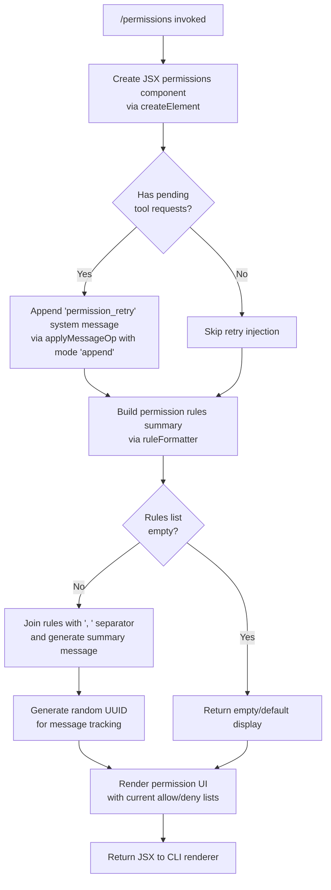

# `/permissions`

> Analysis basis: CC v2.1.167 bundle.js (AST extraction + Claude interpretation)
> Minimum version: v2.1.167

---

## Overview

The `/permissions` command (also accessible as `/allowed-tools`) provides an interactive interface for managing tool permission rules within a Claude Code session. It allows users to view, add, and remove entries from both the allow-list and deny-list of tools, updating the session's tool access policy at runtime. The command renders a JSX-based UI component and injects a `permission_retry` system message to trigger re-evaluation of pending tool requests.

---

## Registration

| Field | Value |
|---|---|
| type | `local-jsx` |
| name | `permissions` |
| description | Manage allow and deny tool permission rules |
| aliases | `["allowed-tools"]` |
| module_id | `E_K` |
| load_inline | `true` |
| loc_byte | `12446078` |
| loc_byte_end | `12446250` |
| loc_line | `8843` |
| arbor_handler.name | `WRf` |
| arbor_handler.fqn | `claude-2.1.167::WRf` |
| arbor_handler.kind | `AsyncFunction` |
| arbor_handler.resolution_path | `module_id` |
| arbor_handler.n_hits | `0` |

Analysis basis: CC v2.1.167 bundle.js:+12446078

---

## Input Branching

The handler's control flow involves multiple distinct paths: rendering the JSX permissions UI component, appending a system-level `permission_retry` message, and delegating to the rule-builder helper (`Nbq`). Three or more distinct branches are present, so a Mermaid flowchart is used.



Analysis basis: CC v2.1.167 bundle.js:+12445896, +12445949, +12445972, +12445991, +10778603, +10778692

---

## Behavioral Spec

### Handler Entry Point (`WRf`)

The `WRf` async function is the primary command handler, resolved via the `module_id` path (`E_K`).

```
async function permissionsCommandHandler(context):
    // Step 1: Build the JSX permissions management UI component
    uiElement = createElement(PermissionsComponent, context.props)

    // Step 2: Inject a permission_retry system message to re-evaluate
    //         any tool calls that were previously blocked
    applyMessageOp(context.messages, {
        mode: "append",
        role: "system",
        content: "permission_retry"
    })

    // Step 3: Generate and format the current rules summary
    summary = buildPermissionRulesSummary(context.permissionRules)

    // Step 4: Return the rendered UI element
    return uiElement
```

Analysis basis: CC v2.1.167 bundle.js:+12445896, +12445949, +12445972, +12445991

---

### Permission Rules Summary Builder (`Nbq`)

This helper formats the current list of allow/deny permission rules into a human-readable summary string.

```
function buildPermissionRulesSummary(rulesList):
    if rulesList is empty:
        return defaultEmptyMessage

    // Join individual rule strings with ", " separator
    joined = rulesList.join(", ")

    // Attach a log-level marker ("info") for display
    annotated = annotateWithLogLevel(joined, level="info")

    // Generate a unique tracking ID for this rules snapshot
    trackingId = Crypto.randomUUID()

    return { text: annotated, id: trackingId }
```

Analysis basis: CC v2.1.167 bundle.js:+10778603, +10778610, +10778635, +10778692

---

### Permission Rule Normalizer (`v` → `onK`, `RH`, `G4`)

The depth-2 call graph reveals a normalizer pipeline that processes individual tool permission rule strings before they are stored or displayed.

```
function normalizePermissionRule(rawRule):
    // Phase 1: Apply prefix/ownership normalization
    normalized = applyRuleOwnership(rawRule, depth=1)   // onK, constant: 1

    // Phase 2: Redact sensitive fields within the rule string
    //          Uses "[REDACTED]" placeholder for sensitive segments
    //          Index position 0 is the start; index 2 marks redaction end
    redacted = redactSensitiveFields(normalized)         // RH → JSON.stringify

    // Phase 3: Convert rule verb to uppercase (e.g. "allow" → "ALLOW")
    uppercased = normalized.verb.toUpperCase()

    // Phase 4: Normalize glob pattern in rule target
    //          - Replace special chars at position 0
    //          - Trim to last-component using lastIndexOf + slice
    normalizedPattern = normalizeGlobPattern(rawRule.target)  // G4

    // Phase 5: Trim whitespace
    trimmed = rawRule.trim()

    return buildRuleObject(uppercased, normalizedPattern, trimmed)
```

Analysis basis: CC v2.1.167 bundle.js:+206594, +206612, +206634, +206652, +206696, +206716, +206719, +205174, +205186, +205288, +205301, +198173, +198178, +198200, +198252, +198281, +198310, +198336, +198362

Notable constants found in the normalizer path:
- Redaction sentinel string: `"[REDACTED]"` (bundle.js:+198252)
- Replacement start index: `0` (bundle.js:+198178)
- Replacement segment count: `2` (bundle.js:+198281)

---

### Path-Scoped Rule Evaluator (`enK`)

A deeper helper (reached via `v → enK`) handles file-path-scoped permission rules — i.e., rules that allow or deny tool use within specific directory subtrees.

```
async function evaluatePathScopedRule(rulePath, toolCall):
    // Resolve directory context for the rule
    dirName = path.dirname(rulePath)               // IHH.dirname

    // Load cached path permissions if available
    cached = loadCachedPathPermissions(dirName)    // KI, d6

    if not cached:
        // Fetch remote/config source with timeout
        // Timeout: 1000 ms, retry limit: 100 attempts
        result = await fetchWithTimeout(source, timeout=1000, maxAttempts=100)
        byteSize = Buffer.byteLength(result)

        // Parse and store result
        parsed = parsePermissionPayload(result)    // $0A
        store(parsed)                               // LB6.then, tnK.bind
    
    // Apply debug logging if enabled
    debugLog(level="debug", data=cached ?? result) // literal "debug"

    // Evaluate tool call against resolved rule
    return applyRuleDecision(toolCall, resolved)   // j9
```

Analysis basis: CC v2.1.167 bundle.js:+206082, +206107, +206115, +206145, +206160, +206235, +206252, +206284, +206290, +206323, +206340, +206349, +206401, +206445, +206570

Notable constants in path-scoped evaluator:
- Fetch timeout: `1000` ms (bundle.js:+206401)
- Maximum retry/attempt count: `100` (bundle.js:+206420)
- Debug log level literal: `"debug"` (bundle.js:+206570)

---

### Bootstrap Fetcher (`H` → `v`, `Y3`, `uj_`, `uj`, `H9`)

The `H` function group handles fetching remote configuration data needed to populate initial permission state. It is reached from the `Nbq` path.

```
async function bootstrapPermissionConfig(endpoint):
    debugLog("[Bootstrap] Fetching", endpoint)   // literal at +15797460

    response = await fetch(endpoint, {
        headers: {
            "Content-Type": "application/json",   // +15797545, +15797560
            "User-Agent": buildUserAgent()         // +15797579
        },
        timeout: 5000                              // +15797661
    })

    if response.ok:
        debugLog("[Bootstrap] Fetch ok")           // +15797834
        data = parseResponse(response)
        cacheResult(data)                          // qA.get, Y3
    else:
        emitTelemetry("api_bootstrap_fetch", { result: "parse_failed" })
        // +15797782, +15797804
    
    // Normalize rule strings from fetched config
    for each ruleEntry in data.rules:
        parts = splitRuleString(ruleEntry)         // uj_ → split, trim, indexOf, slice
        normalized = normalizeToolName(parts)      // uj → replace
        resolved = resolveModelAlias(normalized)   // H9 → s9 → model alias mapping
```

Analysis basis: CC v2.1.167 bundle.js:+15797458, +15797460, +15797496, +15797545, +15797560, +15797579, +15797592, +15797600, +15797631, +15797643, +15797646, +15797661, +15797670, +15797779, +15797782, +15797804, +15797834

---

### Model Alias Resolver (`s9`)

Within the bootstrap path, `s9` maps short model alias strings to canonical model identifiers. This affects which model a permission rule targets when rules reference model names.

```
function resolveModelAlias(inputName):
    trimmed = inputName.trim().toLowerCase()

    switch trimmed:
        case "opusplan":   return canonicalOpusPlan    // +2247508
        case "[1m]":       return canonicalLargeModel  // +2247534
        case "sonnet":     return canonicalSonnet      // +2247549
        case "haiku":      return canonicalHaiku       // +2247588
        case "opus":       return canonicalOpus        // +2247627
        case "best":       return canonicalBestModel   // +2247664
        default:           return applyFallbackMapping(trimmed)
```

Analysis basis: CC v2.1.167 bundle.js:+2247412, +2247423, +2247441, +2247451, +2247487, +2247508, +2247526, +2247534, +2247549, +2247588, +2247627, +2247664, +2247678, +2247696, +2247702, +2247710, +2247754

---

### Feature-Sad Telemetry Sink (`o6`)

The `o6` function is reached indirectly from `H` and contains the single telemetry emission in the traversal. It fires the `tengu_feature_sad` event, which signals a failed or degraded feature invocation.

```
function reportFeatureFailure(featureContext):
    emitTelemetry("tengu_feature_sad", {
        feature: featureContext.name,
        reason: featureContext.errorReason
    })
    // Delegates to lower-level logger (l) and error formatter (J6 → ym6)
```

Analysis basis: CC v2.1.167 bundle.js:+1011091, +1011093, +1011127, +3628

---

## State & Side Effects

| Item | Detail |
|---|---|
| Telemetry | `tengu_feature_sad` (bundle.js:+1011093) — emitted on feature failure/degraded path |
| Telemetry (bootstrap) | `api_bootstrap_fetch` with `parse_failed` result label (bundle.js:+15797782, +15797804) — emitted when remote config fetch response cannot be parsed |
| Message injection | Appends a `"permission_retry"` message with role `"system"` via `applyMessageOp` in `"append"` mode (bundle.js:+12445949, +12445972, +10778548, +10778565) |
| UUID generation | `Crypto.randomUUID()` called via `Nbq` to assign a tracking ID to each rendered permissions summary (bundle.js:+10778692) |
| Remote fetch | Bootstrap fetcher (`H`) performs an HTTP GET with `Content-Type: application/json` and `User-Agent` headers, with a 5000 ms timeout (bundle.js:+15797661) |
| Caching | Fetched permission config is stored via `qA.get` / `Y3` cache accessors (bundle.js:+15797496, +15797592) |
| Path permission cache | Path-scoped rule evaluator (`enK`) reads and writes a path-keyed permission cache with a 1000 ms fetch timeout and up to 100 retry attempts (bundle.js:+206401, +206420) |
| Hook registration | <!-- TODO: not found in depth-2 traversal; needs --depth 4 --> |
| appState changes | <!-- TODO: not found in depth-2 traversal; needs --depth 4 --> |
| Sound | <!-- TODO: not found in depth-2 traversal; needs --depth 4 --> |

---

## Version History

| Version | Change |
|---|---|
| v2.1.167 | Initial analysis |

---

## Common Mistakes

1. **Using `/allowed-tools` vs `/permissions`**: Both aliases trigger the same handler (`WRf`). There is no behavioral difference between them; `/allowed-tools` is a registered alias (bundle.js:+12446078).
2. **Expecting immediate effect on blocked tool calls**: The `permission_retry` system message is appended on invocation, but re-evaluation depends on the agent processing the next turn. Rules take effect for subsequent tool invocations, not retroactively for already-rejected calls.
3. **Glob pattern casing**: The normalizer (`G4`) applies string replacement and slicing to the rule target pattern starting at index `0` (bundle.js:+198178). Patterns with inconsistent casing may not match as expected after normalization.
4. **Model-aliased rules**: When a permission rule references a model by short alias (e.g. `"sonnet"`, `"opus"`, `"best"`), the alias is resolved by `s9` to a canonical model name. Using an unrecognized alias string will fall through to the default mapping, potentially producing unexpected results.
5. **Remote config fetch failures**: If the bootstrap fetch (`H`) cannot parse the remote config response, a `parse_failed` telemetry event fires but the command continues with a potentially stale or empty permission set. No user-visible error is guaranteed in this path.

---

## Appendix — Identifier Mapping

> For bundle debugging only. Identifiers change across versions.

| Identifier | Role |
|---|---|
| `WRf` | Primary async handler for `/permissions` command (arbor_handler, resolved via module_id `E_K`) |
| `Nbq` | Permission rules summary builder; joins rule strings and generates tracking UUID |
| `H` | Bootstrap permission config fetcher; orchestrates remote fetch and caching |
| `v` | Permission rule normalizer pipeline; delegates to ownership, redaction, and pattern helpers |
| `onK` | Rule ownership applicator; assigns depth/prefix metadata to a rule (constant depth `1`) |
| `RH` | Sensitive field redactor; uses `JSON.stringify` to serialize before redaction |
| `G4` | Glob pattern normalizer; applies character replacement, `lastIndexOf`, and `slice` |
| `EUH` | Additional normalization helper; delegates to `lWA` |
| `enK` | Path-scoped rule evaluator; resolves directory context, caches, and applies rule decisions |
| `Y3` | Cache store accessor used by bootstrap fetcher |
| `uj_` | Rule string splitter; applies `split`, `trim`, `indexOf`, `slice` to parse raw rule tokens |
| `q` | Low-level file system accessor; contains `unlinkSync` reference |
| `lHH` | Set-membership checker; uses `i74.has` for rule deduplication or existence check |
| `uj` | Tool name normalizer; applies `replace` to sanitize tool name strings |
| `H9` | Model name resolution orchestrator; delegates to `m6H` and `s9` |
| `m6H` | Model metadata resolver; delegates to `Q0`, `aqH`, `yA`, `qB` sub-resolvers |
| `s9` | Model alias resolver; maps short aliases (`"sonnet"`, `"opus"`, `"haiku"`, etc.) to canonical identifiers |
| `FJ` | Formatting/wrapping helper used by `H9`; delegates to `s9` and `_G` |
| `o6` | Feature failure reporter; emits `tengu_feature_sad` telemetry |
| `l` | Low-level logger used by `o6` |
| `J6` | Error formatter helper; delegates to `ym6` |

---

Note: index built via Arbor fallback; some signals (telemetry, literals) may be missing — see arbor-fallback.js.