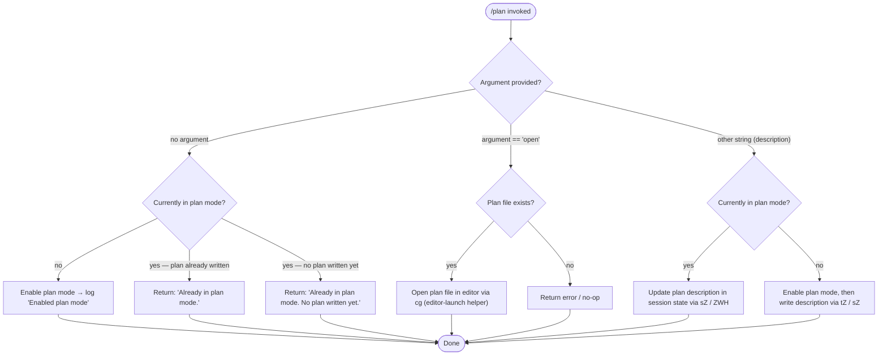

# `/plan`

> Analysis basis: CC v2.1.167 bundle.js (AST extraction + Claude interpretation)
> Minimum version: v2.1.167

---

## Overview

The `/plan` command enables "plan mode" for the current Claude Code session, or opens the existing session plan document for editing. When invoked with no argument or with `open`, the command opens the plan file in the user's configured editor; when invoked with a description string, it activates plan mode and records the description. The command integrates with the session state machine, the permission subsystem, and the file-system plan-storage layer.

---

## Registration

| Field | Value |
|---|---|
| type | `local-jsx` |
| name | `plan` |
| description | Enable plan mode or view the current session plan |
| argumentHint | `[open\|<description>]` |
| module_id | `I_K` |
| load_inline | `true` |
| loc_byte | `12447892` |
| loc_byte_end | `12448091` |
| loc_line | `8843` |
| arbor_handler.name | `ERf` |
| arbor_handler.fqn | `claude-2.1.167::ERf` |
| arbor_handler.kind | `AsyncFunction` |
| arbor_handler.resolution_path | `module_id` |
| arbor_handler.n_hits | `0` |

Analysis basis: CC v2.1.167 bundle.js:+12447892

---

## Input Branching

The handler `ERf` resolves at least five distinct runtime paths based on the current plan-mode state and the argument provided. A Mermaid flowchart is used accordingly.



Analysis basis: CC v2.1.167 bundle.js:+12447005 – +12447669

---

## Behavioral Spec

### 1. Entry point — `handlePlanCommand` (`ERf`)

```
async function handlePlanCommand(context):
    sessionState   = getSessionState(context)         // tqH  +12447054
    appState       = getAppState(context)              // K    +12447068
    permState      = getPermissionsState(context)      // oM   +12447104
    toolsConfig    = getToolsConfig(context)           // _86  +12447107
    uiHelpers      = getUIHelpers(context)             // eP   +12447194
    currentMode    = getCurrentMode(sessionState)      // H    +12447206

    rawArg = context.args ?? ""
    trimmedArg = rawArg.trim()                         //       +12447272

    if trimmedArg == "open":                           //       +12447291
        planContent = readPlanFile(sessionState)       // Kq6  +12447354
        openPlanInEditor(planContent, appState)        // cg   +12447551
        return

    if trimmedArg is non-empty (description path):
        if currentMode == "plan":
            updatePlanDescription(trimmedArg, sessionState)   // sZ +12447408
        else:
            enablePlanMode(sessionState)
            writePlanDescription(trimmedArg, sessionState)    // tZ +12447401
        return

    // No argument
    if currentMode == "plan":
        if planFileHasContent(sessionState):
            displayMessage("Already in plan mode.")           // +12447230
        else:
            displayMessage("Already in plan mode. No plan written yet.")  // +12447450
    else:
        enablePlanMode(sessionState)                          // +12447104
        displayMessage("Enabled plan mode")                   // +12447210
        renderOutput(context)                                 // zV.createElement +12447669
```

Analysis basis: CC v2.1.167 bundle.js:+12447005

---

### 2. Permission / mode guard — `setPermissionMode` (`oM`)

```
function setPermissionMode(mode, permissionsState):
    if mode == "bypassPermissions":                           // +4760279
        if bypassPermissionsDisabled(permissionsState):
            log("Ignoring permission update: setMode 'bypassPermissions' rejected …")
            // +4760345
            return
    applyModeToState(mode, permissionsState)                  // A.set +4761539

    // Reconcile allow / deny / ask rule sets
    for each ruleSet in ["alwaysAllowRules","alwaysDenyRules","alwaysAskRules"]:
        // +4760806 / +4760853 / +4760871
        updateRuleSet(ruleSet, permissionsState)

    // Handle addRules / replaceRules / removeRules / addDirectories / removeDirectories
    // +4760621 / +4760969 / +4761626 / +4761280 / +4762010
    reconcileRuleCollections(permissionsState)
```

Analysis basis: CC v2.1.167 bundle.js:+4760343

---

### 3. Plan file read — `readPlanFile` (`Kq6`)

```
function readPlanFile(sessionState):
    planPath = resolvePlanPath(sessionState)    // HOH +13268629
    content  = readFileAtPath(planPath)         // R6  +13268642
    return content
```

Analysis basis: CC v2.1.167 bundle.js:+12447354

---

### 4. Plan file write / update — `writePlanFile` (`tZ`) and `updatePlanDescription` (`sZ`)

```
function writePlanFile(description, sessionState):
    entry = buildPlanEntry(sessionState)       // sZ   +12447408
    planPath = resolvePlanPath(sessionState)   // d6   +13268858
    writeUtf8File(planPath, entry)             // h8   +13268910
    // encoding: "utf-8"                              +13268888

function updatePlanDescription(description, sessionState):
    existing = loadPlanEntry(sessionState)     // ZWH  +13268731
    if existing:
        mergeDescription(existing, description)
        persistEntry(existing, sessionState)   // q.set +13268586
    else:
        buildAndPersist(description)           // zQ.join +13268754
```

Analysis basis: CC v2.1.167 bundle.js:+12447401 / +12447408

---

### 5. Editor launch — `launchEditorForPlan` (`cg`)

```
function launchEditorForPlan(planContent, appState):
    inkInstance = getInkInstance(appState)    // _L.get +11558964
    if not inkInstance:
        throw Error("Ink instance not found - cannot pause rendering")  // +11559005

    editorCmd = resolveEditorCommand(appState)    // mp   +11559062
    editorBin = getEditorBinary(editorCmd)        // K0   +12447644
    planFilePath = resolveStatPath(planContent)   // _.statSync +11559098

    // Pause Ink rendering and stdin before spawning
    inkInstance.enterAlternateScreen()            // +11559158
    inkInstance.pause()                           // +11559188
    inkInstance.suspendStdin()                    // +11559198

    argv = buildEditorArgv(planFilePath)          // f.slice +11559262
    // stdio: "inherit"                                       +11559312
    result = Ldq.spawnSync(editorBin, argv, {stdio:"inherit"})  // +11559280

    content = fs.readFileSync(planFilePath)       // +11559582

    // Restore rendering
    inkInstance.exitAlternateScreen()             // +11559660
    inkInstance.resumeStdin()                     // +11559689
    inkInstance.resume()                          // +11559705

    return content
```

Analysis basis: CC v2.1.167 bundle.js:+12447551

---

### 6. Tools configuration resolution — `resolveToolsConfig` (`_86`)

```
function resolveToolsConfig(context):
    baseConfig  = resolveBaseConfig(context)         // Q6A  +10706372
    if baseConfig.mode == "disable":                 //      +10705164
        return disabledConfig()
    if baseConfig.mode == "auto":                    //      +10706385

    // Build allowed-tools list
    perSessionRules = buildSessionRules(context)     // QMH  +10706474
    cliArgRules     = buildCLIArgRules(context)      // Rp   +10706568
    // CLI arg name: "--allowed-tools"               //      +10694556
    // Source tag:   "cliArg"                        //      +10694507
    // Source tag:   "session"                       //      +10695797

    merged = mergeToolRules(perSessionRules, cliArgRules)
    log("info", merged)                              //      +10706670
    return merged
```

Analysis basis: CC v2.1.167 bundle.js:+12447107

---

### 7. JSX output rendering — `renderPlanOutput` (via `zV.createElement`)

```
function renderPlanOutput(message, context):
    // Spawns a WH6 (StreamWatcher) node that listens on "data" events  // +7955298
    // and pipes through QB (OutputFormatter) → vT_ (React element)
    // then ANSI is stripped via p4 → Bun.stripANSI                    // +3847204
    node = zV.createElement(planOutputComponent, {message})            // +12447669
    render(node)
```

Analysis basis: CC v2.1.167 bundle.js:+12447669

---

## State & Side Effects

| Item | Detail |
|---|---|
| Telemetry | `tengu_feature_sad` (bundle.js:+1011093); `tengu_native_cursor` (bundle.js:+3819350) |
| Plan-mode state | Sets session `currentMode` to `"plan"` via `oM` / `setPermissionMode` when plan mode was not already active |
| Permission rules | May update `alwaysAllowRules`, `alwaysDenyRules`, `alwaysAskRules` collections in permission state (bundle.js:+4760806) |
| File I/O | Reads and/or writes a UTF-8 plan file on disk via `tZ` / `Kq6`; uses `fs.appendFile`, `fs.mkdir`, `fs.rename`, `fs.unlink`, `fs.readFileSync`, `fs.statSync` |
| Editor subprocess | Spawns `Ldq.spawnSync` with `stdio:"inherit"` (bundle.js:+11559280) when `open` argument is given; pauses/resumes Ink rendering around the subprocess |
| appState changes | Reads Ink instance from `appState` via `_L.get`; calls `enterAlternateScreen` / `exitAlternateScreen` on it |
| Sound | None observed in depth-2 traversal |
| Bypass-permissions guard | Silently ignores `bypassPermissions` mode if `disableBypassPermissionsMode` is set (bundle.js:+4760345) |
| Log output | Emits `"Enabled plan mode"` (bundle.js:+12447210), `"Already in plan mode."` (bundle.js:+12447230), `"Already in plan mode. No plan written yet."` (bundle.js:+12447450) |

---

## Version History

| Version | Change |
|---|---|
| v2.1.167 | Initial analysis |

---

## Common Mistakes

1. **Invoking `/plan open` before any plan exists** — the handler attempts to `statSync` the plan file path; if the file does not exist (ENOENT, bundle.js:+175652) the editor will not launch and the command may silently return.
2. **Calling `/plan <description>` when plan mode is already active** — the handler calls the *update* path (`sZ`) rather than the *create* path (`tZ`); an existing plan entry is merged, not replaced wholesale.
3. **Running in a context where `bypassPermissions` mode is disabled** — any attempt by the plan command to set that mode will be silently swallowed with a log warning (bundle.js:+4760345); the rest of the command proceeds normally.
4. **Expecting a blocking editor on non-TTY environments** — `Ldq.spawnSync` is called with `stdio:"inherit"` (bundle.js:+11559312); in piped/non-interactive sessions the spawn may receive no TTY and the editor will fail immediately.
5. **Assuming `/plan` resets tool restrictions** — the tools-config resolution (`_86`) only *reads* the existing allow/deny rule sets; it does not clear them when plan mode is toggled.

---

## Appendix — Identifier Mapping

> For bundle debugging only. Identifiers change across versions.

| Identifier | Role |
|---|---|
| `ERf` | Main handler for `/plan` command (`handlePlanCommand`) |
| `q` | File-unlink helper / generic utility |
| `tqH` | Session-state accessor |
| `K` | App-state / config map accessor |
| `L` | Generic collection (Set/Map) used in rule reconciliation |
| `f` | File descriptor / stream handle |
| `A` | Permission-state object / generic map |
| `oM` | Permission-mode setter (`setPermissionMode`) |
| `v` | HTTP bootstrap fetch helper |
| `onK` | Fetch response handler |
| `vPA` | Fetch content-type handler |
| `H` | Current mode / string variable (context-dependent) |
| `Y3` | Bootstrap response parser |
| `uj_` | String header parser (split/trim/indexOf/slice) |
| `lHH` | Feature-flag checker |
| `uj` | String replace helper |
| `H9` | Model-string formatter |
| `o6` | Feature-sad telemetry emitter |
| `RH` | JSON.stringify wrapper |
| `_` | Generic iteration variable / string value |
| `G4` | String-path formatter |
| `q0A` | Path-map builder |
| `EUH` | Write-stream helper |
| `lWA` | Stream write wrapper |
| `enK` | File append/rotate helper |
| `npH` | Debounce / timeout scheduler |
| `YKH` | Log-line builder |
| `d6` | Plan/config path resolver |
| `U76` | Directory-ensure helper |
| `M0A` | Path join helper |
| `cl8` | File rename/unlink helper |
| `tnK` | File append (bound) helper |
| `j9` | Signal/hook registrar |
| `jM` | String escape helper |
| `XV4` | Backslash/paren escape helper |
| `_86` | Tools-config resolver |
| `Q6A` | Base tools-config builder |
| `yd` | Model capability checker |
| `QG` | Config-object builder |
| `p6A` | Model default resolver |
| `HvH` | Model-name predicate |
| `O__` | Settings-layer loader |
| `x8` | Settings-layer merger |
| `pR` | Policy-settings loader |
| `QMH` | Per-session tool-rule builder |
| `Rp` | CLI-arg tool-rule builder |
| `w$` | Tool-rule string formatter |
| `WV4` | Tool-name wildcard helper |
| `IT` | Object.hasOwn wrapper |
| `GV4` | Tool-rule pattern builder |
| `PV4` | Tool-rule replaceAll helper |
| `x6A` | Allowed-tool list assembler |
| `aRH` | Tool-cache getter/setter |
| `b6A` | Relative-path tool-rule builder |
| `uCq` | Session-rule accumulator |
| `qOf` | Excluded-tool checker |
| `M` | Message / conversation-state object |
| `eP` | UI-helpers accessor |
| `oL` | UI-helper sub-accessor |
| `uTH` | UI-helper leaf accessor |
| `Kq6` | Plan-file reader |
| `HOH` | Plan file path resolver |
| `R6` | File-read utility |
| `tv` | Low-level read primitive |
| `tZ` | Plan-file write (create path) |
| `sZ` | Plan description update (merge path) |
| `ZWH` | Plan entry loader/merger |
| `pP_` | String replace helper (plan entry) |
| `mlH` | Plan entry line builder |
| `nq8` | Plan entry line builder (alt) |
| `h8` | UTF-8 file write helper |
| `V8` | Low-level write primitive |
| `hH` | Error / log handler |
| `AA` | Error constructor wrapper |
| `_6` | String coercion helper |
| `$q` | Log-entry formatter |
| `QRA` | Log-entry string builder |
| `zG4` | Log-ring-buffer manager |
| `cg` | Editor-launch helper (`launchEditorForPlan`) |
| `mp` | Editor-command resolver |
| `nY` | Editor binary name resolver |
| `J0f` | Editor stat helper |
| `S1A` | Editor path basename helper |
| `d1` | String index/slice helper |
| `K0` | Editor binary type checker |
| `j_q` | Stream-watcher factory |
| `WH6` | Data-event stream watcher |
| `QB` | Output formatter |
| `vT_` | React element factory (output) |
| `Va` | Ink component helper |
| `p4` | ANSI-strip helper (`Bun.stripANSI` wrapper) |

---

Note: index built via Arbor fallback; some signals (telemetry, literals) may be missing — see arbor-fallback.js.