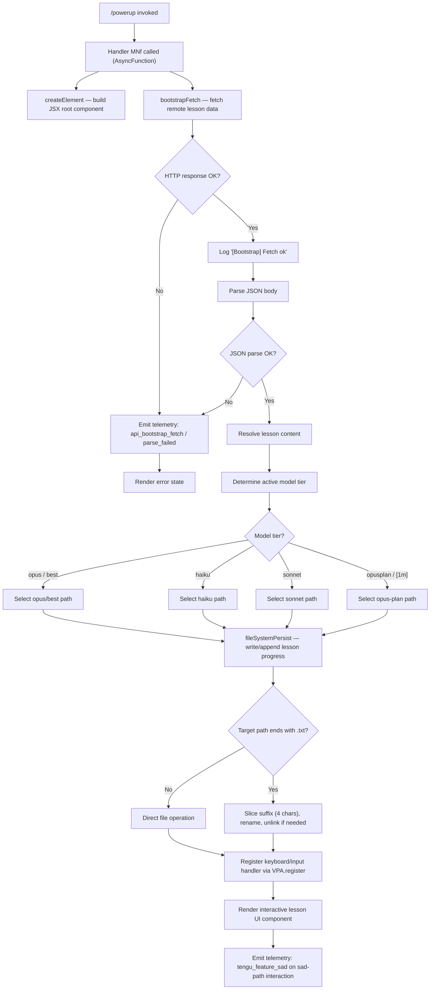

# `/powerup`

> Analysis basis: CC v2.1.167 bundle.js (AST extraction + Claude interpretation)
> Minimum version: v2.1.167

---

## Overview

`/powerup` is an interactive lesson-style command that surfaces Claude Code features to users through short, guided discovery experiences. It is implemented as a local JSX component (type `local-jsx`), meaning it renders a React element directly within the CLI UI rather than dispatching a text prompt to the model. On invocation, the handler bootstraps lesson content — potentially fetching remote data — and then renders an interactive UI component.

---

## Registration

| Field | Value |
|---|---|
| type | `local-jsx` |
| name | `powerup` |
| description | `Discover Claude Code features through quick interactive lessons` |
| module_id | `poq` |
| load_inline | `true` |
| loc_byte | `12023950` |
| loc_byte_end | `12024130` |
| arbor_handler.name | `MNf` |
| arbor_handler.fqn | `claude-2.1.167::MNf` |
| arbor_handler.kind | `AsyncFunction` |
| arbor_handler.resolution_path | `module_id` |
| arbor_handler.n_hits | `0` |

Analysis basis: CC v2.1.167 bundle.js:+12023950

---

## Input Branching

The handler involves multiple distinct paths: bootstrap fetch success vs. failure, content-type/header negotiation, lesson rendering with model-tier selection logic, and file-system persistence branches. Five or more distinct branches are present in the call graph.



---

## Behavioral Spec

### 1. Handler Entry — `MNf` (AsyncFunction)

The Arbor-resolved handler `MNf` is an `AsyncFunction` within module `poq`. It is the sole top-level entry point for `/powerup`.

```
async function powerupHandler(context):
    rootElement = createElement(LessonComponent, context)
    lessonData  = await bootstrapFetch(context)
    return rootElement configured with lessonData
```

Analysis basis: CC v2.1.167 bundle.js:+12023824, +12023859

---

### 2. Bootstrap Fetch — `bootstrapFetch` (mapped from `H` → `v`)

On activation, the command performs an HTTP fetch to retrieve lesson/feature content. The fetch is annotated with the log prefix `"[Bootstrap] Fetching"` and sets `Content-Type: application/json` plus a `User-Agent` header. A timeout of **5000 ms** applies.

```
async function bootstrapFetch(context):
    log("[Bootstrap] Fetching ...")
    response = await fetch(remoteUrl, {
        headers: {
            "Content-Type": "application/json",
            "User-Agent":    userAgentString
        },
        timeout: 5000
    })
    if response.ok:
        log("[Bootstrap] Fetch ok")
        return parseJSON(response)
    else:
        emitTelemetry("api_bootstrap_fetch", { result: "parse_failed" })
        return null
```

- Fetch timeout: **5000 ms** (bundle.js:+15797661)
- Log prefix literal `"[Bootstrap] Fetching"` (bundle.js:+15797460)
- Log success literal `"[Bootstrap] Fetch ok"` (bundle.js:+15797834)
- Header `"Content-Type"` / `"application/json"` (bundle.js:+15797545, +15797560)
- Header `"User-Agent"` (bundle.js:+15797579)
- Telemetry event key `"api_bootstrap_fetch"` / `"parse_failed"` (bundle.js:+15797782, +15797804)

Analysis basis: CC v2.1.167 bundle.js:+15797458

---

### 3. Argument / Input Parsing — `argumentParser` (mapped from `uj_`)

User-supplied arguments (the text after `/powerup`) are tokenised and trimmed.

```
function argumentParser(rawInput):
    parts = rawInput.split(separator)
    for each part in parts:
        token = part.trim()
        idx   = token.indexOf(delimiter)
        if idx >= 0:
            yield token.slice(0, idx), token.slice(idx+1)
        else:
            yield token
```

Analysis basis: CC v2.1.167 bundle.js:+2979391

---

### 4. Model-Tier Resolution — `modelResolver` (mapped from `s9`)

Before rendering lesson content, `/powerup` determines which model tier is active. The logic normalises the model identifier string, then matches against a set of known tier names.

```
function modelResolver(modelId):
    normalised = modelId.trim().toLowerCase()
    if normalised includes "opusplan" or "[1m]":
        return TIER_OPUS_PLAN
    if normalised includes "sonnet":
        return TIER_SONNET
    if normalised includes "haiku":
        return TIER_HAIKU
    if normalised includes "opus" or "best":
        return TIER_OPUS
    return TIER_DEFAULT
```

Known tier-name literals (bundle.js:+2247508, +2247534, +2247549, +2247588, +2247627, +2247664):
- `"opusplan"`, `"[1m]"`, `"sonnet"`, `"haiku"`, `"opus"`, `"best"`

Provider/back-end literals also visible in this region:
- `"anthropic."` (bundle.js:+2241469), `"firstParty"` (bundle.js:+2243716), `"anthropicAws"` (bundle.js:+2101625), `"gateway"` (bundle.js:+2101645), `"mantle"` (bundle.js:+2244357)

Analysis basis: CC v2.1.167 bundle.js:+2247412

---

### 5. Lesson-Content Normalisation — `lessonContentNormaliser` (mapped from `H9`, `m6H`, `qB`)

Once lesson data arrives, several normalisation passes run:

```
function lessonContentNormaliser(rawContent):
    lines = rawContent.split("\n").map(line => line.trim())
    for each line:
        if line.startsWith("anthropic."):
            classify as first-party metadata
        if line.includes(knownModelId):
            resolve to display name
    return normalisedLines
```

String operations used: `trim`, `toLowerCase`, `startsWith`, `includes`, `map` (bundle.js:+2241393, +2241404, +2241430, +2241456, +2241484).

Analysis basis: CC v2.1.167 bundle.js:+2243492

---

### 6. File-System Persistence — `fileSystemPersist` (mapped from `enK`)

Lesson progress is persisted to disk using an append-based strategy with file rotation.

```
async function fileSystemPersist(content, targetPath):
    dir = path.dirname(targetPath)
    await fs.mkdir(dir, { recursive: true })

    byteLen = Buffer.byteLength(content)

    // Rotation: if existing file ends with ".txt", rename then unlink
    stat = await fs.stat(targetPath) catch ignore
    if targetPath.endsWith(".txt"):
        rotatedPath = targetPath.slice(0, -4)   // strip 4-char ".txt" suffix
        await fs.rename(targetPath, rotatedPath)
        await fs.unlink(rotatedPath) if appropriate

    await fs.appendFile(targetPath, content)
    await persistMetadata(targetPath)
    await rotateIfNeeded(targetPath)
    await registerProgressCallback()
```

- Suffix check: `".txt"` (bundle.js:+205511)
- Suffix length sliced: **4** characters (bundle.js:+205533)
- Uses `fs.mkdir`, `fs.appendFile`, `fs.rename`, `fs.stat`, `fs.unlink` (bundle.js:+205836, +205895, +205563, +205407, +205603)
- `Buffer.byteLength` for size accounting (bundle.js:+206290)

Analysis basis: CC v2.1.167 bundle.js:+206082

---

### 7. Write-Stream Flush — `streamFlusher` (mapped from `EUH` → `lWA`)

Rendered output is flushed to the terminal output stream.

```
function streamFlusher(handle, data):
    handle.write(data)
```

Analysis basis: CC v2.1.167 bundle.js:+193365, +193301

---

### 8. Chunk-Queue / Debounced Writer — `chunkQueueWriter` (mapped from `npH`)

Output is accumulated and dispatched through a debounced timer mechanism, preventing excessive re-renders.

```
function chunkQueueWriter(chunk):
    clearTimeout(activeTimer)
    pendingQueue.push(chunk)
    activeTimer = setTimeout(() => {
        flushBatch(pendingQueue.join(""))
        pendingQueue = []
    }, debounceMs)
    setImmediate(drainStep)
```

- Debounce interval constants present: **1000** ms, **100** ms (bundle.js:+59671, +59692)

Analysis basis: CC v2.1.167 bundle.js:+59783

---

### 9. Directory-Entry Normaliser — `directoryNormaliser` (mapped from `G4` → `q0A`)

Path segments for lesson asset directories are normalised: upper-cased, sanitised (a `[REDACTED]` marker replaces sensitive fragments), and the last two path components are extracted.

```
function directoryNormaliser(rawPath):
    mapped   = pathSegments(rawPath).map(redactSensitive)
    joined   = mapped.join(separator)
    lastTwo  = joined.lastIndexOf(sep)
    return joined.slice(lastTwo)
```

- Redaction marker: `"[REDACTED]"` (bundle.js:+198252)
- Component count used: **2** (bundle.js:+198281)

Analysis basis: CC v2.1.167 bundle.js:+198173

---

### 10. Input Keyboard Handler — `keyboardHandler` (mapped from `j9` → `VPA.register`)

Interactive lesson navigation registers a keyboard event handler so the user can progress through lessons with keystrokes.

```
function keyboardHandler():
    VPA.register(inputCallback)
```

Analysis basis: CC v2.1.167 bundle.js:+60369

---

### 11. Error / Sad-Path Reporting — `sadPathReporter` (mapped from `o6` → `l`)

When a user interaction indicates a negative/sad outcome (e.g., skipping or dismissing a lesson), the command emits a telemetry event.

```
function sadPathReporter(context):
    emitTelemetry("tengu_feature_sad", context)
    renderSadState()
```

Analysis basis: CC v2.1.167 bundle.js:+1011091, +1011093

---

### 12. JSON Serialisation — `jsonSerializer` (mapped from `RH`)

Lesson metadata is serialised with `JSON.stringify` before persisting or transmitting.

```
function jsonSerializer(data):
    return JSON.stringify(data)
```

Analysis basis: CC v2.1.167 bundle.js:+185264

---

### 13. EISDIR Guard — `dirErrorGuard` (mapped from `U76`)

File-write operations check for the `EISDIR` error code to handle cases where a path resolves to a directory rather than a file.

```
function dirErrorGuard(err):
    if err.code === "EISDIR":
        handleDirectoryConflict()
    else:
        rethrow(err)
```

- Error code literal: `"EISDIR"` (bundle.js:+175692)

Analysis basis: CC v2.1.167 bundle.js:+175684

---

## State & Side Effects

| Item | Detail |
|---|---|
| Telemetry | `tengu_feature_sad` — emitted on sad-path/dismiss interaction (bundle.js:+1011093); `api_bootstrap_fetch` + `parse_failed` label on fetch/parse failure (bundle.js:+15797782, +15797804) |
| Hook registration | Keyboard/input handler registered via `VPA.register` (bundle.js:+60369) |
| File system | Lesson progress appended to a file under a managed directory; `.txt`-suffixed files are renamed/rotated; `fs.mkdir`, `fs.appendFile`, `fs.rename`, `fs.stat`, `fs.unlink` are all invoked |
| Network | Outbound HTTP fetch with `Content-Type: application/json` and `User-Agent` header; 5000 ms timeout |
| Timer | Debounced chunk queue uses `setTimeout` / `clearTimeout` / `setImmediate` for output batching |
| Buffer accounting | `Buffer.byteLength` used for byte-level size tracking of persisted content |
| appState changes | <!-- TODO: not found in depth-2 traversal; needs --depth 4 --> |
| Sound | <!-- TODO: not found in depth-2 traversal; needs --depth 4 --> |

---

## Version History

| Version | Change |
|---|---|
| v2.1.167 | Initial analysis |

---

## Common Mistakes

1. **Expecting a model response**: `/powerup` is type `local-jsx` — it renders a React UI component directly and does not send a prompt to Claude. Waiting for a text completion response will time out.
2. **Assuming offline-only operation**: The command performs an outbound bootstrap fetch. Environments with restricted egress (firewalls, air-gapped networks) may see the command stall or silently fall back to a parse-failed state.
3. **Conflating file paths with directories**: The `EISDIR` guard is present precisely because the persistence target path can collide with an existing directory. Ensure the working directory does not have a folder whose name matches the expected lesson-progress file name.
4. **Ignoring the `.txt` rotation**: Lesson progress files with a `.txt` suffix are automatically renamed and unlinked as part of rotation. External tooling that watches for `.txt` files in the lesson-data directory may observe unexpected deletions.
5. **Expecting instant render**: Output is batched through a debounced queue (constants 1000 ms / 100 ms visible in the bundle). There may be a short delay between invocation and visible UI output, especially in slow terminals.

---

## Appendix — Identifier Mapping

> For bundle debugging only. Identifiers change across versions.

| Identifier | Role |
|---|---|
| `MNf` | Top-level `/powerup` async handler (Arbor-resolved, module `poq`) |
| `H` | Bootstrap / fetch orchestrator |
| `v` | Core fetch execution function |
| `onK` | HTTP response handler / content-type dispatcher |
| `vPA` | Header construction helper |
| `sdK` | Header key builder (sub-helper of `vPA`) |
| `tdK` | Header value builder (sub-helper of `vPA`) |
| `RH` | JSON serialiser (`JSON.stringify` wrapper) |
| `G4` | Directory / path normaliser |
| `q0A` | Path-segment mapper |
| `q` | File-unlink utility (`ipK.unlinkSync`) |
| `A` | Lowercase filename helper (`f.toLowerCase`) |
| `EUH` | Stream-flush dispatcher |
| `lWA` | Stream writer (`handle.write`) |
| `enK` | File-system persistence orchestrator |
| `npH` | Debounced chunk-queue writer |
| `YKH` | Lesson content assembler |
| `d6` | Lesson data accessor |
| `U76` | EISDIR error guard |
| `M0A` | Metadata path resolver |
| `cl8` | File-rotation handler (stat / rename / unlink) |
| `tnK` | Append-file writer with rotation |
| `j9` | Keyboard handler registrar |
| `Y3` | Context/state accessor (bootstrap) |
| `uj_` | Argument / input parser |
| `lHH` | Feature-flag set checker (`i74.has`) |
| `uj` | String replacer helper |
| `H9` | Content normalisation entry point |
| `m6H` | Line-level content normaliser |
| `Q0` | Normalisation sub-step A |
| `aqH` | Normalisation sub-step B |
| `qB` | Multi-pass line processor |
| `s9` | Model-tier resolver |
| `Y2` | Model-ID regex helper |
| `h4H` | Model inclusion checker (`y4H.includes`) |
| `CI` | `lM`+`N5` model tier compositor |
| `DdH` | `N5`-only tier compositor |
| `bT` | First-party tier handler |
| `cP1` | Tier delegation helper |
| `lM` | `MA`-backed model accessor |
| `VH8` | HKL inclusion checker |
| `wdH` | `_6` delegation helper |
| `FJ` | Normalisation pipeline runner |
| `_G` | Full model-resolution compositor |
| `o6` | Sad-path / error UI renderer |
| `l` | Telemetry emitter for `tengu_feature_sad` |
| `J6` | Sub-renderer for sad-path component |
| `ym6` | Inner sad-state element factory |
| `NUH` | Fetch response validator |
| `KI` | Shared utility (used in `onK` and `enK`) |
| `f0A` | Response body extractor |
| `$0A` | Progress callback scheduler |
| `LB6` | Promise chain root for persistence |
| `tnK` | Append-file writer (also listed above) |
| `npH` | Chunk queue / debounce writer (also listed above) |
| `i76` | Lesson item factory |
| `IHH` | Path utilities (`.join`, `.dirname`) |
| `t8` | Lesson state holder |
| `R6` | Lesson resolver |
| `V8` | Directory-conflict resolution sub-handler |
| `ly` | `fs` promises wrapper (`stat`, `rename`, `unlink`, `mkdir`, `appendFile`) |
| `h8` | Rename-completion callback |
| `ipK` | Sync `fs` wrapper (`unlinkSync`) |
| `VPA` | Input/keyboard event registry |
| `qA` | Global state map (`.get`) |
| `a75` | Timeout / abort-signal helper |
| `lnK` | Path-segment source array (`.map`) |
| `HKL` | Known model-ID list |
| `_6` | Model-tier lookup table |
| `GA` | Model display-name resolver |
| `g6H` | Tier metadata getter A |
| `gYH` | Tier metadata getter B |
| `jdH` | Tier metadata getter C |
| `z2` | Tier fallback resolver |
| `MA` | Model-accessor base |
| `N5` | Model-tier tag constant |
| `y4H` | Inclusion-check source list |
| `R4H` | Regex pattern for model IDs |
| `lt6` | Line classifier sub-step |
| `YdH` | Line metadata extractor |
| `dP1` | Display-name lookup |
| `sqL` | Sequence normaliser |
| `tqL` | Tail normaliser |

---

Note: index built via Arbor fallback; some signals (telemetry, literals) may be missing — see arbor-fallback.js.