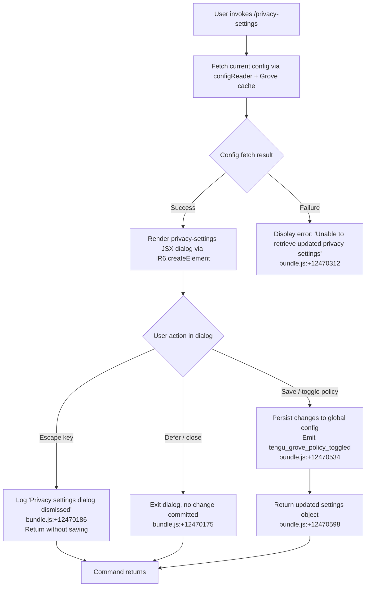

# `/privacy-settings`

> Analysis basis: CC v2.1.167 bundle.js (AST extraction + Claude interpretation)
> Minimum version: v2.1.167

---

## Overview

`/privacy-settings` opens an interactive JSX dialog that allows users to view and update their privacy settings within Claude Code. The command is implemented as a `local-jsx` type, meaning it renders a React-based UI component inline in the terminal rather than dispatching a text prompt to the agent. Upon invocation, it fetches the current privacy configuration (including Grove/policy settings), presents the dialog, and persists any changes the user makes back to the global config.

---

## Registration

| Field | Value |
|---|---|
| type | `local-jsx` |
| name | `privacy-settings` |
| description | `View and update your privacy settings` |
| module_id | `n_K` |
| load_inline | `true` |
| loc_byte | `12470998` |
| loc_byte_end | `12471190` |
| loc_line | `8853` |
| arbor_handler.name | `mRf` |
| arbor_handler.fqn | `claude-2.1.167::mRf` |
| arbor_handler.kind | `AsyncFunction` |
| arbor_handler.resolution_path | `module_id` |
| arbor_handler.n_hits | `0` |

Analysis basis: CC v2.1.167 bundle.js:+12470998

---

## Input Branching

The handler has 3+ distinct execution paths depending on dialog lifecycle events (escape/dismiss, defer, settings save) and on the state of the fetched privacy configuration (success vs. retrieval failure).



---

## Behavioral Spec

### Handler Entry: `privacySettingsHandler` (`mRf`)

Analysis basis: CC v2.1.167 bundle.js:+12469998

```
async function privacySettingsHandler(context):
    // 1. Resolve current session state
    sessionState = getSessionState(context)           // calls H @ +12470011

    // 2. Concurrently fetch config and MCP/Grove state
    [configData, mcpState] = await Promise.all([      // +12470038
        fetchBootstrapConfig(context),                // Bs @ +12470051
        resolvePrivacyPolicyBlock(context)            // PPH @ +12470056
    ])

    // 3. Check retrieval success
    if configData is null or retrieval failed:
        display error message:
            "Unable to retrieve updated privacy settings"  // +12470312
        return

    // 4. Build and render JSX dialog
    element = lR6.createElement(                      // +12470645
        PrivacySettingsComponent,
        {
            settings: configData,                     // "settings" literal @ +12470598
            onEscape: () => {
                log("Privacy settings dialog dismissed")  // +12470186
                // "escape" event key @ +12470161
            },
            onDefer: () => {
                // "defer" action key @ +12470175
            },
            onSave: (updatedSettings) => {
                persistPrivacySettings(updatedSettings)
                emitTelemetry("tengu_grove_policy_toggled")  // +12470534
            }
        }
    )

    // 5. Render element into terminal UI
    renderLocalJSX(element)

    // 6. Await user interaction and return result
    result = await awaitDialogCompletion()
    return result
```

---

### Config Loading: `configLoader` (`VtH`)

Analysis basis: CC v2.1.167 bundle.js:+7013132

```
async function configLoader(context):
    // Attempt to read config via Grove cache layer
    freshConfig = await readConfigFromStore(context)          // GLH @ +7013132

    if Grove cache is absent:
        log("Grove: No cache, fetching config in background (dialog skipped this session)")
        // literal @ +7013247
        fetchConfigInBackground(context)                      // C6 @ +7013192
        timestamp = Date.now()                                // +7013221

    else if Grove cache is stale:
        log("Grove: Cache stale, returning cached data and refreshing in background")
        // literal @ +7013367
        refreshConfigInBackground(context)                    // bF9 @ +7013327

    else:
        log("Grove: Using fresh cached config")               // literal @ +7013473

    return freshConfig
```

---

### Config Store Reader: `configStoreReader` (`GLH`)

Analysis basis: CC v2.1.167 bundle.js:+3025799

```
function configStoreReader(storeRef):
    // Validate subscription tier
    tier = checkSubscriptionTier(storeRef)                    // Aq @ +3025799
    // Recognized tiers from literals: "max" (+3025761), "pro" (+3025772)

    // Merge global settings
    mergedConfig = mergeGlobalSettings(storeRef)              // GA @ +3025811

    // Apply policy overrides
    policyResult = applyPolicyOverrides(mergedConfig)         // Dp1 @ +3025827

    return policyResult
```

---

### Settings State Resolver: `settingsStateResolver` (`Aq`)

Analysis basis: CC v2.1.167 bundle.js:+3023197

```
function settingsStateResolver(storeRef):
    // Read raw API key config
    apiKeyEntry = readApiKeyConfig(storeRef)                  // a7_ @ +3023197
    // Literal key names: "ANTHROPIC_API_KEY" (+3002328), "apiKeyHelper" (+3002353)

    // Read helper config
    helperEntry = readHelperConfig(storeRef)                  // o7_ @ +3023210

    // Build combined settings object
    combined = buildCombinedSettings(apiKeyEntry, helperEntry) // GY @ +3023220
    // GY references literals: 0 (+3002210), "ANTHROPIC_API_KEY" (+3002328)

    // Apply region/role defaults
    result = applyRegionRoleDefaults(combined)                // r1 @ +3023243

    return result
```

---

### Background Config Save: `backgroundConfigSave` (`bF9`)

Analysis basis: CC v2.1.167 bundle.js:+7013563

```
async function backgroundConfigSave(context):
    // Attempt to obtain write lock
    lockResult = await acquireConfigLock()                    // PPH @ +7013563

    // Re-read config with lock held
    lockedConfig = await readConfigWithLock()                 // C6 @ +7013619
    timestamp = Date.now()                                    // +7013671

    // Write updated config atomically
    writeResult = await atomicConfigWrite(lockedConfig)       // X8 @ +7013706

    // Log outcome
    logWriteResult(writeResult)                               // v @ +7013817
```

---

### Atomic Config Writer: `atomicConfigWriter` (`X8`)

Analysis basis: CC v2.1.167 bundle.js:+3262290

```
function atomicConfigWriter(configData):
    // Check current config state
    configState = resolveConfigState(configData)              // qZ @ +3262294
    // State literals: "unknown" (+3262935), "local" (+3263010),
    //   "migrated" (+3262997), "native" (+3263042),
    //   "installed" (+3263028), "disabled" (+3263061),
    //   "enabled" (+3263087), "no_permissions" (+3263101),
    //   "not_configured" (+3263122), "global" (+3263141)

    if configData auth is missing from re-read but present in cache:
        // Safety guard from GH #3117
        log("saveGlobalConfig fallback: re-read config is missing auth that cache has; refusing to write. See GH #3117.")
        // literal @ +3262497
        return

    // Build file path
    filePath = buildConfigPath(configData)                    // LwH @ +3262471

    // Write with backup rotation
    backupAndWrite(filePath, configData)                      // oP_ @ +3262737
    // Backup suffix literal: ".backup." (+3266273)
    // Max backups: 5 (+3266406)
    // Lock timeout: 60000ms (+3266157)
```

---

### Config File I/O: `configFileIO` (`LwH`)

Analysis basis: CC v2.1.167 bundle.js:+3267414

```
function configFileIO(path, operation):
    // Guard: config must be accessible
    if not configAccessAllowed():
        throw Error("Config accessed before allowed.")        // literal @ +3267420

    // Read path
    content = fs.readFileSync(path, "utf-8")                  // +3267476, +3267503

    if content is absent (ENOENT):                            // "ENOENT" @ +3267650
        return defaultConfig()

    // Parse JSON
    try:
        parsed = JSON.parse(content)
    catch:
        emitTelemetry("tengu_config_parse_error")             // +3268051
        return defaultConfig()

    // On write: create backup
    if operation == "write":
        backupDir = ensureBackupDirectory()
        fs.mkdirSync(backupDir)                               // +3268230

        // Rotate old backups; remove entries not starting with expected prefix
        existing = fs.readdirStringSync(backupDir)            // +3268288
        for entry in existing:
            if not entry.startsWith(expectedPrefix):          // +3268323
                continue
        copyFile(path, backupPath)                            // fs.copyFileSync @ +3268559

    return parsed
```

---

### MCP Server State: `mcpServerStateManager` (`M`)

Analysis basis: CC v2.1.167 bundle.js:+15879107

The privacy-settings handler also resolves the current MCP server state as part of its `Promise.all` initialization. This includes:

```
async function mcpServerStateManager(context):
    // Enumerate all registered MCP server entries
    serverEntries = Object.entries(mcpRegistry)               // xbH @ +15879107

    for each serverEntry in serverEntries:
        // Connect or reconnect server
        connectionResult = await connectMcpServer(serverEntry) // sl @ +10450900

        // Apply connection result (handle orphaned slots)
        applyConnectionResult(serverEntry, connectionResult)   // XF8 @ +15879117

    // Compute final merged server map
    return Object.fromEntries(updatedEntries)
```

---

## State & Side Effects

| Item | Detail |
|---|---|
| Telemetry: `tengu_grove_policy_toggled` | Emitted when the user toggles a privacy/Grove policy setting (bundle.js:+12470534) |
| Telemetry: `tengu_config_parse_error` | Emitted when the config JSON file cannot be parsed (bundle.js:+3268051) |
| Telemetry: `tengu_config_lock_contention` | Emitted when config lock acquisition exceeds expected duration (bundle.js:+3265476) |
| Telemetry: `tengu_config_stale_write` | Emitted when a stale config write is detected (bundle.js:+3265612) |
| Telemetry: `tengu_config_auth_loss_prevented` | Emitted when a write is blocked to prevent auth data loss (bundle.js:+3265955) |
| Telemetry: `tengu_feature_sad` | Emitted on feature-level error path (bundle.js:+1011093) |
| Telemetry: `tengu_mcp_oauth_flow_start` | Emitted when an MCP OAuth flow is started during initialization (bundle.js:+10291012) |
| Telemetry: `tengu_mcp_oauth_flow_success` | Emitted on successful MCP OAuth completion (bundle.js:+10295800) |
| Telemetry: `tengu_mcp_oauth_flow_error` | Emitted on MCP OAuth failure (bundle.js:+10297185) |
| Telemetry: `tengu_daemon_config_reload` | Emitted when the daemon reloads config in response to a change (bundle.js:+16212216) |
| Telemetry: `tengu_mcp_skills` | Emitted during MCP skills resolution (bundle.js:+6966700) |
| Telemetry: `tengu_skill_file_changed` | Emitted when a skill file changes on disk (bundle.js:+14200319) |
| Telemetry: `tengu_daemon_yield` | Emitted when the daemon yields to a foreground process (bundle.js:+16216439) |
| Config file write | Updates `~/.claude.json` (global config) when settings are changed; atomic write with backup rotation (max 5 backups, suffix `.backup.`) |
| File watch registration | `IVL` registers a `watchFile` listener on the config path; unregistered via `unwatchFile` on cleanup (bundle.js:+3263671, +3264004) |
| Grove cache update | Refreshes the in-memory Grove config cache on background reload (bundle.js:+7013367) |
| JSX render | Renders a local JSX component via `lR6.createElement`; does not invoke the LLM agent (bundle.js:+12470645) |
| Lock acquisition | Config writes acquire a file lock; contention logged if lock takes longer than expected (literal: "Lock acquisition took longer than expected — another Claude instance may be running", bundle.js:+3265387) |
| Auth-loss guard | Refuses to write global config if the re-read file is missing auth data that the cache holds (GH #3117 guard, bundle.js:+3265803, +3262497) |

---

## Version History

| Version | Change |
|---|---|
| v2.1.167 | Initial analysis |

---

## Common Mistakes

1. **Expecting an agent response**: `/privacy-settings` is a `local-jsx` command; it renders a UI dialog directly and does not route through the LLM. No assistant message will appear in the conversation transcript.
2. **Concurrent writes causing lock contention**: Running multiple Claude Code instances simultaneously may trigger the `tengu_config_lock_contention` telemetry event and delay config persistence. Only one instance should write settings at a time.
3. **Dismissing via Escape without saving**: Pressing Escape logs "Privacy settings dialog dismissed" and exits without writing any changes. Users must explicitly confirm/save to persist toggled settings.
4. **Assuming settings persist immediately on toggle**: The write path goes through a locking and backup-rotation mechanism. On heavily loaded systems or when `~/.claude.json` is unreadable, the write may be silently skipped with an auth-loss prevention guard.
5. **Grove cache staleness**: If the config cache is stale at invocation time, the dialog may display slightly out-of-date values while a background refresh completes. The stale-cache path is explicitly logged (bundle.js:+7013367).

---

## Appendix — Identifier Mapping

> For bundle debugging only. Identifiers change across versions.

| Identifier | Role |
|---|---|
| `mRf` | Main async handler for `/privacy-settings` (entry point, `AsyncFunction`) |
| `VtH` | Config loader with Grove cache branching logic |
| `GLH` | Config store reader; validates subscription tier and merges settings |
| `Aq` | Settings state resolver; reads API key and helper config entries |
| `a7_` | Raw API key config reader |
| `o7_` | Helper config reader |
| `GY` | Combined settings builder; incorporates API key and tier literals |
| `GA` | Global settings merger |
| `YC` | Array/include check utility used in settings merge |
| `Dp1` | Policy overrides applicator |
| `kL` | Supplementary config read helper called from config loader |
| `C6` | Background config fetcher / config-with-lock reader |
| `d6` | Config path resolver utility |
| `lP_` | Config parsing helper |
| `LwH` | Config file I/O handler (read, parse, backup, write) |
| `IVL` | Config file watcher; registers/unregisters `watchFile` listeners |
| `v` | Logging utility (debug-level); used throughout call graph |
| `onK` | Log sink dispatcher |
| `vPA` | Secondary log sink (routes to `sdK`/`tdK`) |
| `H` | Bootstrap fetch helper; also used as include-check utility |
| `Y3` | Bootstrap response parser |
| `uj_` | String split/trim/index utility |
| `lHH` | Set membership check helper |
| `uj` | String replace utility |
| `H9` | String transformation utility |
| `o6` | Output stream line writer |
| `RH` | JSON stringify wrapper |
| `G4` | Path/string manipulation utility |
| `q0A` | Path segment mapper |
| `EUH` | Terminal write helper |
| `lWA` | Low-level terminal write |
| `enK` | Log file writer; manages append, rotation, and directory creation |
| `npH` | Buffered log flush scheduler (uses setTimeout/setImmediate) |
| `YKH` | Log line formatter |
| `U76` | Log path resolver |
| `M0A` | Log directory path builder |
| `cl8` | Log file rotation handler |
| `tnK` | Log append worker (mkdir, appendFile, rotate) |
| `j9` | Signal/exit hook registrar (`VPA.register`) |
| `bF9` | Background config save handler; locks, re-reads, and writes config |
| `X8` | Atomic config writer with state classification and auth-loss guard |
| `aP_` | Config save-with-lock implementation; manages backup rotation |
| `QlH` | Config lock helper |
| `Zo1` | Object entries iterator utility |
| `AK8` | Timestamp-based lock manager |
| `oj6` | Config path join helper |
| `l` | General-purpose logger (lower-level) |
| `oP_` | Backup-aware config write helper |
| `M` | MCP server state manager; enumerates and connects MCP servers |
| `xbH` | MCP server connection orchestrator |
| `sl` | MCP server slot connector |
| `AT6` | MCP transport adapter (SSE/HTTP) |
| `bs` | MCP server bootstrap handler |
| `al` | MCP server entry lister |
| `dD8` | MCP error colorizer (red/yellow terminal output) |
| `_T6` | MCP server transport-type router (sse, http, stdio, sdk) |
| `Ik` | MCP connection initializer |
| `qz` | MCP connection state machine |
| `bx_` | MCP connection cleanup helper |
| `K` | Terminal column padding utility |
| `L` | Async task set manager (add/delete/finally) |
| `f` | Stream close handler |
| `a8` | Utility wrapper |
| `cy6` | MCP server filter predicate |
| `yhq` | MCP server hash/fingerprint calculator |
| `VHA` | MCP server version/descriptor reader |
| `tXH` | MCP config hasher (SHA-256) |
| `pD8` | MCP server property key inspector |
| `UD8` | MCP server descriptor builder |
| `EP` | Config entry hasher |
| `uD8` | Config diff utility |
| `z4` | Config diff helper |
| `M8` | MCP debug log pusher |
| `Dk8` | MCP connection driver (OAuth, reconnect, full lifecycle) |
| `$7f` | MCP driver initialization helper |
| `vd` | MCP auth state reader |
| `X9H` | MCP connection setup helper |
| `P9H` | MCP protocol negotiator |
| `W9H` | MCP OAuth local callback server handler |
| `QA6` | MCP pending-connection tracker |
| `D` | Process exit / abort controller |
| `jk8` | MCP server descriptor cache helper |
| `an` | MCP server reconnect orchestrator |
| `Au` | Auth token reader |
| `Y` | Terminal supervisor output writer |
| `v7` | MCP error log pusher |
| `GH` | String coercion utility |
| `O7f` | MCP race-condition resolver |
| `M7f` | MCP SSH/URL transport selector |
| `wk8` | MCP server state reader |
| `gA6` | MCP pending-auth cache getter |
| `dA6` | MCP connection-keyed cache getter |
| `mhq` | MCP server metadata resolver |
| `V9` | AsyncLocalStorage store getter |
| `dk8` | MCP needs-auth cache path builder (`mcp-needs-auth-cache.json`) |
| `Ee_` | MCP error handler (hash + log) |
| `j` | Active process values iterator |
| `S` | Process supervisor (start/stop/write) |
| `tN` | MCP skills tracker |
| `D6` | MCP skill file dependency registrar |
| `yx_` | MCP server include-list checker |
| `k` | File watcher entry (chokidar) |
| `P6` | chokidar watcher factory |
| `R` | Terminal output writer |
| `Chq` | MCP connection options normalizer |
| `AF` | Async iterator / AbortSignal adapter |
| `K16` | Integer parser (radix 10) |
| `ck8` | Integer parser variant (radix 10) |
| `XF8` | MCP connection result applicator (handles orphaned slots) |
| `bbH` | MCP config hash comparator |
| `_y` | MCP server slot cleanup coordinator |
| `A16` | MCP server slot state applicator |
| `$` | App state writer (zLK) |
| `zLK` | App state update dispatcher |
| `Yo` | App state store helper |
| `zC6` | Daemon status file path builder (`daemon.status.json`) |
| `dDA` | MCP server diff-and-apply orchestrator |
| `lD8` | MCP server visibility filter (checks deny-lists) |
| `r8` | Async retry-with-timeout helper |
| `O` | Background session state holder |